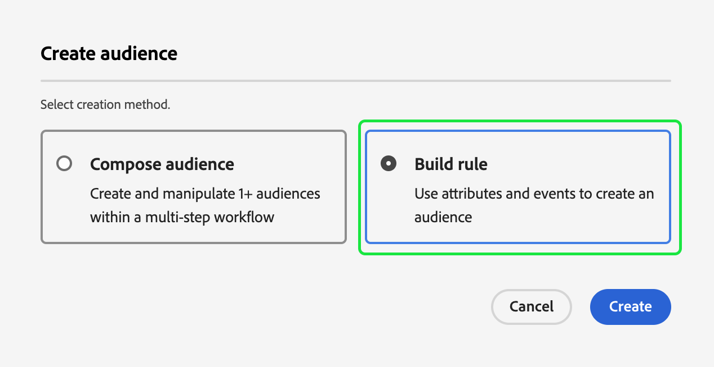

# エッジセグメント化ガイド

Edgeのセグメント化は、Adobe Experience Platformのセグメント定義を [ エッジ上で ](../../landing/edge-and-hub-comparison.md) 即座に評価する機能で、これにより、同じページや次のページのパーソナライゼーションのユースケースが可能になります。

>[!IMPORTANT]
>
> エッジデータは、収集場所に最も近いエッジサーバーの場所に保存されます。 このデータは、ハブ（またはプリンシパル）Adobe Experience Platform データセンターとして指定された場所以外の場所に保存される場合もあります。
>
> エッジセグメント化エンジンは、プライマリとしてマークされた **単一** ID （エッジベース以外のプライマリ ID と一致するもの）があるエッジ上のリクエストのみに従います。
>
> さらに、エッジセグメント化はリクエストを大規模に処理するように設計されているので、エッジサーバーは必要なメタデータを動的に読み込みます。 その結果、サンドボックスタイプに関係なく、最初の呼び出しで「コールドスタート」の待ち時間が発生する場合があります。 この期間中は、最初の数回の評価呼び出しによってタイムアウトが発生する場合があります。 短時間のプリウォームバーストまたは現実的な負荷は、テストの偽陽性の失敗を排除するのに役立ちます。

## エッジセグメント化のクエリタイプ {#query-types}

次の表に示す条件のいずれかを満たす場合、クエリはエッジセグメント化で評価できます。

>[!NOTE]
>
>クエリが次の表のいずれかのクエリタイプと一致する場合、エッジセグメント化を使用して自動的に評価されます。クエリ式に基づいて、システムがこの機能を自動的に判断します。
>
>さらに、オーディエンス **のみ** にプロファイル属性が含まれている場合は、毎日評価されます。 オーディエンスをリアルタイムで評価する場合は、オーディエンスにイベントデータを追加する必要があります。

| クエリタイプ | 詳細 | クエリ | 例 |
| ---------- | ------- | ----- | ------- |
| 24 時間未満の時間枠内での単一イベント | 24 時間未満の時間枠内に 1 つの受信イベントを参照する任意のセグメント定義。 | `CHAIN(xEvent, timestamp, [C0: WHAT(eventType.equals("commerce.checkouts", false)) WHEN(today)])` | {zoomable="yes"} |
| プロファイルのみ | プロファイル属性のみを参照するセグメント定義。 | `homeAddress.country.equals("US", false)` | {zoomable="yes"} |
| 24 時間未満の相対時間枠内でのプロファイル属性を持つ単一のイベント | 1 つ以上のプロファイル属性を持つ 1 つの受信イベントを参照し、24 時間未満の相対時間枠内に発生するセグメント定義。 | `workAddress.country.equals("US", false) and CHAIN(xEvent, timestamp, [C0: WHAT(eventType.equals("commerce.checkouts", false)) WHEN(today)])` | {zoomable="yes"} |
| セグメントのセグメント | 1 つ以上のバッチセグメントまたはエッジセグメントを含むセグメント定義。 **メモ：**&#x200B;セグメントのセグメントが使用される場合、**24 時間ごとに**&#x200B;プロファイルの不選定が発生します。 | `inSegment("a730ed3f-119c-415b-a4ac-27c396ae2dff") and inSegment("8fbbe169-2da6-4c9d-a332-b6a6ecf559b9")` | {zoomable="yes"} |

さらに、セグメント定義 **は、エッジ上でアクティブな結合ポリシーに結び付ける必要があります**。 結合ポリシーの詳細については、[結合ポリシーガイド](../../profile/api/merge-policies.md)を参照してください。

次のシナリオでは、セグメント定義はエッジセグメント化の対象 **なります** 対象外）。

- セグメント定義には、単一のイベントと `inSegment` イベントの組み合わせが含まれています。
   - ただし、`inSegment` イベントに含まれるセグメント定義がプロファイルのみの場合、セグメント定義はエッジセグメント化に対して有効に&#x200B;**なります**。
- セグメント定義では、時間制約の一部として「年を無視」を使用します。

## オーディエンスを作成 {#create-audience}

Segmentation Service API または UI の Audience Portal を使用して、エッジのセグメント化を使用して評価されるオーディエンスを作成できます。

セグメント定義が [ 適格なクエリタイプ ](#eligible-query-types) のいずれかと一致する場合、エッジ対応にすることができます。

>[!BEGINTABS]

>[!TAB Segmentation Service API]

**API 形式**

```http
POST /segment/definitions
```

**リクエスト**

+++ エッジセグメント化が有効なセグメント定義を作成するリクエストの例

```shell
curl -X POST https://platform.adobe.io/data/core/ups/segment/definitions
 -H 'Authorization: Bearer {ACCESS_TOKEN}' \
 -H 'Content-Type: application/json' \
 -H 'x-gw-ims-org-id: {ORG_ID}' \
 -H 'x-api-key: {API_KEY}' \
 -H 'x-sandbox-name: {SANDBOX_NAME}'
 -d '{
        "name": "People in the USA",
        "description: "An audience that looks for people who live in the USA",
        "expression": {
            "type": "PQL",
            "format": "pql/text",
            "value": "homeAddress.country = \"US\""
        },
        "evaluationInfo": {
            "batch": {
                "enabled": false
            },
            "continuous": {
                "enabled": false
            },
            "synchronous": {
                "enabled": true
            }
        },
        "schema": {
            "name": "_xdm.context.profile"
        }
     }'
```

+++

**応答**

リクエストが成功した場合は、新しく作成したセグメント定義の詳細と HTTP ステータス 200 が返されます。

+++セグメント定義を作成する際のサンプルレスポンス。

```json
{
    "id": "4afe34ae-8c98-4513-8a1d-67ccaa54bc05",
    "schema": {
        "name": "_xdm.context.profile"
    },
    "profileInstanceId": "ups",
    "imsOrgId": "{ORG_ID}",
    "sandbox": {
        "sandboxId": "28e74200-e3de-11e9-8f5d-7f27416c5f0d",
        "sandboxName": "prod",
        "type": "production",
        "default": true
    },
    "name": "People in the USA",
    "description": "An audience that looks for people who live in the USA",
    "expression": {
        "type": "PQL",
        "format": "pql/text",
        "value": "homeAddress.country = \"US\""
    },
    "evaluationInfo": {
        "batch": {
            "enabled": false
        },
        "continuous": {
            "enabled": false
        },
        "synchronous": {
            "enabled": true
        }
    },
    "dataGovernancePolicy": {
        "excludeOptOut": true
    },
    "creationTime": 0,
    "updateEpoch": 1579292094,
    "updateTime": 1579292094000
}
```

+++

このエンドポイントの使用について詳しくは、[ セグメント定義エンドポイントガイド ](../api/segment-definitions.md) を参照してください。

>[!TAB  オーディエンスポータル ]

Audience Portal で、「**[!UICONTROL Create audience]**」を選択します。

{zoomable="yes"}

ポップオーバーが表示されます。 「**[!UICONTROL Build rules]**」を選択して、セグメントビルダーに入ります。

{zoomable="yes"}

セグメントビルダー内で、[ 適格なクエリタイプ ](#eligible-query-types) の 1 つに一致するセグメント定義を作成します。 セグメント定義がエッジセグメント化の対象であれば、**[!UICONTROL Edge]** を **[!UICONTROL Evaluation method]** として選択できます。

{zoomable="yes"}

セグメント定義の作成について詳しくは、[セグメントビルダーガイド](../ui/segment-builder.md)を参照してください。

>[!ENDTABS]

## エッジセグメント化を使用して評価されたオーディエンスの取得 {#retrieve-audiences}

Segmentation Service API または UI の Audience Portal を使用して、エッジのセグメント化を使用して評価されるすべてのオーディエンスを取得できます。

>[!BEGINTABS]

>[!TAB Segmentation Service API]

`/segment/definitions` エンドポイントに対してGET リクエストを行い、組織内でエッジセグメント化を使用して評価されるすべてのセグメント定義のリストを取得します。

**API 形式**

エッジセグメント化を使用して評価されたセグメント定義を取得するには、リクエストパスにクエリパラメーター `evaluationInfo.synchronous.enabled=true` を含める必要があります。

```http
GET /segment/definitions?evaluationInfo.synchronous.enabled=true
```

**リクエスト**

+++ エッジが有効なすべてのセグメント定義を一覧表示するサンプルリクエスト

```shell
curl -X GET \
  'https://platform.adobe.io/data/core/ups/segment/definitions?evaluationInfo.synchronous.enabled=true' \
  -H 'Authorization: Bearer {ACCESS_TOKEN}' \
  -H 'x-api-key: {API_KEY}' \
  -H 'x-gw-ims-org-id: {ORG_ID}' \
  -H 'x-sandbox-name: {SANDBOX_NAME}'
```

+++

**応答**

応答が成功すると、HTTP ステータス 200 が、エッジセグメント化が有効になっている、組織内のセグメント定義の配列と共に返されます。

+++ 組織内のすべてのエッジセグメント化が有効なセグメント定義のリストを含むサンプル応答

```json
{
    "segments": [
        {
            "id": "15063cb-2da8-4851-a2e2-bf59ddd2f004",
            "schema": {
                "name": "_xdm.context.profile"
            },
            "imsOrgId": "{ORG_ID}",
            "sandbox": {
                "sandboxId": "",
                "sandboxName": "",
                "type": "production",
                "default": true
            },
            "name": " People who are NOT on their homepage ",
            "expression": {
                "type": "PQL",
                "format": "pql/text",
                "value": "select var1 from xEvent where var1._experience.analytics.endUser.firstWeb.webPageDetails.isHomePage = false"
            },
            "evaluationInfo": {
                "batch": {
                    "enabled": false
                },
                "continuous": {
                    "enabled": false
                },
                "synchronous": {
                    "enabled": true
                }
            },
            "creationTime": 1572029711000,
            "updateEpoch": 1572029712000,
            "updateTime": 1572029712000
        },
        {
            "id": "f15063cb-2da8-4851-a2e2-bf59ddd2f004",
            "schema": {
                "name": "_xdm.context.profile"
            },
            "imsOrgId": "{ORG_ID}",
            "sandbox": {
                "sandboxId": "",
                "sandboxName": "",
                "type": "production",
                "default": true
            },
            "name": "Homepage_continuous",
            "description": "People who are on their homepage - continuous",
            "expression": {
                "type": "PQL",
                "format": "pql/text",
                "value": "select var1 from xEvent where var1._experience.analytics.endUser.firstWeb.webPageDetails.isHomePage = true"
            },
            "evaluationInfo": {
                "batch": {
                    "enabled": false
                },
                "continuous": {
                    "enabled": false
                },
                "synchronous": {
                    "enabled": true
                }
            },
            "creationTime": 1572021085000,
            "updateEpoch": 1572021086000,
            "updateTime": 1572021086000
        }
    ],
    "page": {
        "totalCount": 2,
        "totalPages": 1,
        "sortField": "creationTime",
        "sort": "desc",
        "pageSize": 2,
        "limit": 100
    },
    "link": {}
}
```

返されるセグメント定義について詳しくは、[セグメント定義エンドポイントガイド](../api/segment-definitions.md)を参照してください。

+++

>[!TAB  オーディエンスポータル ]

Audience Portal のフィルターを使用すると、組織内でエッジセグメント化が有効になっているすべてのオーディエンスを取得できます。  アイコンを選択して、フィルターのリストを表示します。

{zoomable="yes"}

使用可能なフィルター内で、**更新頻度** に移動し、「Edge」を選択します。 このフィルターを使用すると、エッジセグメント化を使用して評価された、組織内のすべてのオーディエンスが表示されます。

{zoomable="yes"}

Experience Platformでのオーディエンスの表示について詳しくは、[ オーディエンスポータルガイド ](../ui/audience-portal.md) を参照してください。

>[!ENDTABS]

## オーディエンスの詳細 {#audience-details}

エッジセグメント化を使用して評価された特定のオーディエンスの詳細を、オーディエンスポータル内で選択して表示できます。

オーディエンスポータルでオーディエンスを選択すると、オーディエンスの詳細ページが表示されます。 オーディエンスの詳細の概要、選定されたプロファイルの量の推移、オーディエンスがアクティブ化されている宛先など、オーディエンスに関する情報が表示されます。


エッジ対応オーディエンスの場合は、**[!UICONTROL Profiles over time]** カードが表示され、合計選定済み指標と新しいオーディエンス更新指標が表示されます。

**[!UICONTROL Total qualified]** 指標は、このオーディエンスのエッジ評価に基づいた、選定オーディエンスの合計数を表します。

**[!UICONTROL New audience updated]** 指標は、エッジのセグメント化によってオーディエンスサイズの変化を示す折れ線グラフで表されます。 ドロップダウンを調整して、過去 24 時間、先週または過去 30 日間を表示できます。

{zoomable="yes"}

オーディエンスの詳細については、[ オーディエンスポータルの概要 ](../ui/audience-portal.md#audience-details) を参照してください。

## 次の手順

このガイドでは、エッジセグメント化の概要と、Adobe Experience Platformでエッジセグメント化を使用して評価できるセグメント定義の作成方法について説明します。

Experience Platform ユーザーインターフェイスの使用方法について詳しくは、[ セグメント化ユーザーガイド ](./overview.md) を参照してください。

エッジセグメント化に関するよくある質問については、[FAQ のエッジセグメント化に関する節 ](../faq.md#edge-segmentation) を参照してください。

