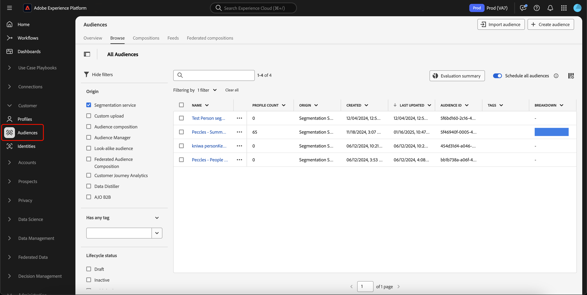

# 柔軟なオーディエンス評価ガイド

>[!AVAILABILITY]
>
>柔軟なオーディエンス評価は、[!DNL Microsoft Azure] で実行されているExperience Platformのインスタンスで **のみ** 利用できます。 サポートされるExperience Platform インフラストラクチャについて詳しくは、[Experience Platform multi-cloud overview](../../landing/multi-cloud.md) を参照してください。
>
>さらに、柔軟なオーディエンス評価は、Real-Time CDP B2C Editionで使用できる **のみ** です。

柔軟なオーディエンス評価を使用すると、バッチセグメント化ジョブをオンデマンドで実行できます。 柔軟なオーディエンス評価を使用すると、アドホックなキャンペーンの開始、ジャストインタイムの通信または時間に依存するその他のアクティビティを実行できます。

## ガードレール {#guardrails}

>[!CONTEXTUALHELP]
>id="platform_segmentation_browse_flexibleaudienceevaluation"
>title="柔軟なオーディエンス評価制限"
>abstract="1 回の柔軟なオーディエンス評価実行で最大 20 個のオーディエンスを評価できます。<br/><br/>さらに、評価ジョブはできるだけ早く実行されますが、オンデマンド評価は別のオンデマンドまたはバッチ評価と同時に実行<b>できない</b>ので、システムの遅延が発生する可能性があります。"

柔軟なオーディエンス評価を実行する場合は、次の条件に注意してください。

- 柔軟なオーディエンス評価は、サンドボックスごとに 1 日に **2 回** 使用できます。 この制限は、午前 0 時（UTC）にリセットされます。
- **実稼動** サンドボックスごとに、年間 50 回の柔軟なオーディエンス評価 **最大** を実行できます。
- **開発用** サンドボックスごとに、毎年 100 回 **最大** の柔軟なオーディエンス評価を実行しています。
- すべてのオーディエンス **必須** は、「セグメント化サービス」のオリジンを持ちます。
- すべてのオーディエンス **必須** は、バッチセグメント化を使用して評価する必要があります。
- すべてのオーディエンスは **人物ベースのオーディエンスである必要があります**。
- 柔軟なオーディエンス評価実行 1 回につき、最大 20 個のオーディエンスを選択できます。

>[!NOTE]
>
>柔軟なオーディエンス評価の追加実行を年単位で購入できます。 詳しくは、Adobe カスタマーケアにお問い合わせください。

## アクセス {#access}

柔軟なオーディエンス評価を使用するには、次の権限が必要です。

- **[!UICONTROL オーディエンスに対するセグメントの評価]** は、「**[!DNL Profile Management]**」セクションで行います。

役割ベースのアクセス制御の詳細については、[ アクセス制御の概要 ](../../access-control/home.md) を参照してください。

## 柔軟なオーディエンス評価の実行

Experience Platform API または UI を使用して、柔軟なオーディエンス評価を実行できます。

>[!BEGINTABS]

>[!TAB Experience Platform API]

Experience Platform API 内で柔軟なオーディエンス評価を実行するには、評価するすべてのセグメント定義（オーディエンス）の ID を含むセグメントジョブを作成する必要があります。

>[!NOTE]
>
>セグメントジョブ API 呼び出しごとに追加できるセグメント定義 ID は **最大** 20 個のみです。

`/segment/jobs` エンドポイントに対して POST リクエストを実行し、リクエスト本文にセグメント定義の ID を含めることで、新しいセグメントジョブを作成できます。

+++新しいセグメントジョブを作成するためのサンプルリクエスト

```shell
curl -X POST https://platform.adobe.io/data/core/ups/segment/jobs \
 -H 'Authorization: Bearer {ACCESS_TOKEN}' \
 -H 'Content-Type: application/json' \
 -H 'x-gw-ims-org-id: {ORG_ID}' \
 -H 'x-api-key: {API_KEY}' \
 -H 'x-sandbox-name: {SANDBOX_NAME}' \
 -d '[
    {
        "segmentId": "7863c010-e092-41c8-ae5e-9e533186752e"
    },
    {
        "segmentId": "07d39471-05d1-4083-a310-d96978fd7c85"
    }
 ]'
```

| プロパティ | 説明 |
| -------- | ----------- |
| `segmentId` | 評価するセグメント定義の ID。 これらのセグメント定義は、異なる結合ポリシーに属することができます。 |

+++

応答に成功すると、HTTP ステータス 200 と、新しく作成されたセグメントジョブに関する情報が返されます。

+++ 新しいセグメントジョブを作成する際のサンプル応答。

```json
{
    "id": "b31aed3d-b3b1-4613-98c6-7d3846e8d48f",
    "imsOrgId": "{ORG_ID}",
    "sandbox": {
        "sandboxId": "28e74200-e3de-11e9-8f5d-7f27416c5f0d",
        "sandboxName": "prod",
        "type": "production",
        "default": true
    },
    "profileInstanceId": "ups",
    "source": "api",
    "status": "PROCESSING",
    "batchId": "678f53bc-e21d-4c47-a7ec-5ad0064f8e4c",
    "computeJobId": 8811,
    "computeGatewayJobId": "9ea97b25-a0f5-410e-ae87-b2d85e58f399",
    "segments": [
        {
            "segmentId": "7863c010-e092-41c8-ae5e-9e533186752e",
            "segment": {
                "id": "7863c010-e092-41c8-ae5e-9e533186752e",
                "expression": {
                    "type": "PQL",
                    "format": "pql/json",
                    "value": "workAddress.country = \"US\""
                },
                "mergePolicyId": "25c548a0-ca7f-4dcd-81d5-997642f178b9",
                "mergePolicy": {
                    "id": "25c548a0-ca7f-4dcd-81d5-997642f178b9",
                    "version": 1
                }
            }
        },
        {
            "segmentId": "07d39471-05d1-4083-a310-d96978fd7c85",
            "segment": {
                "id": "07d39471-05d1-4083-a310-d96978fd7c85",
                "expression": {
                    "type": "PQL",
                    "format": "pql/json",
                    "value": "workAddress.country = \"US\""
                },
                "mergePolicyId": "25c548a0-ca7f-4dcd-81d5-997642f178b9",
                "mergePolicy": {
                    "id": "25c548a0-ca7f-4dcd-81d5-997642f178b9",
                    "version": 1
                }
            }
        }
    ],
    "metrics": {
        "totalTime": {
            "startTimeInMs": 1573203617195,
            "endTimeInMs": 1573204395655,
            "totalTimeInMs": 778460
        },
        "profileSegmentationTime": {
            "startTimeInMs": 1573204266727,
            "endTimeInMs": 1573204395655,
            "totalTimeInMs": 128928
        },
        "segmentedProfileCounter":{
            "7863c010-e092-41c8-ae5e-9e533186752e":1033
        },
        "segmentedProfileByNamespaceCounter":{
            "7863c010-e092-41c8-ae5e-9e533186752e":{
                "tenantiduserobjid":1033,
                "campaign_profile_mscom_mkt_prod2":1033
            }
        },
        "segmentedProfileByStatusCounter":{
            "7863c010-e092-41c8-ae5e-9e533186752e":{
                "exited":144646,
                "realized":2056
            }
        },
        "totalProfiles":13146432,
        "totalProfilesByMergePolicy":{
            "25c548a0-ca7f-4dcd-81d5-997642f178b9":13146432
        }
    },
    "requestId": "4e538382-dbd8-449e-988a-4ac639ebe72b-1573203600264",
    "schema": {
        "name": "_xdm.context.profile"
    },
    "properties": {
        "scheduleId": "4e538382-dbd8-449e-988a-4ac639ebe72b",
        "runId": "e6c1308d-0d4b-4246-b2eb-43697b50a149"
    },
    "_links": {
        "cancel": {
            "href": "/segment/jobs/b31aed3d-b3b1-4613-98c6-7d3846e8d48f",
            "method": "DELETE"
        },
        "checkStatus": {
            "href": "/segment/jobs/b31aed3d-b3b1-4613-98c6-7d3846e8d48f",
            "method": "GET"
        }
    },
    "updateTime": 1573204395000,
    "creationTime": 1573203600535,
    "updateEpoch": 1573204395
}
```

+++

セグメントジョブを作成したら、リクエストパスに新しく作成したセグメントジョブの ID を指定して `/segment/jobs` エンドポイントに対してGET リクエストを行い、そのステータスを確認できます。

+++セグメントジョブを取得するサンプルリクエスト

```shell
curl -X GET https://platform.adobe.io/data/core/ups/segment/jobs/b31aed3d-b3b1-4613-98c6-7d3846e8d48f \
 -H 'Authorization: Bearer {ACCESS_TOKEN}' \
 -H 'x-gw-ims-org-id: {ORG_ID}' \
 -H 'x-api-key: {API_KEY}' \
 -H 'x-sandbox-name: {SANDBOX_NAME}'
```

+++

正常な応答は、HTTP ステータス 200 と、指定したセグメントジョブに関する詳細情報を返します。


+++ セグメントジョブを取得するためのサンプル応答。

```json
{
    "id": "b31aed3d-b3b1-4613-98c6-7d3846e8d48f",
    "imsOrgId": "{ORG_ID}",
    "sandbox": {
        "sandboxId": "28e74200-e3de-11e9-8f5d-7f27416c5f0d",
        "sandboxName": "prod",
        "type": "production",
        "default": true
    },
    "profileInstanceId": "ups",
    "source": "api",
    "status": "SUCCEEDED",
    "batchId": "678f53bc-e21d-4c47-a7ec-5ad0064f8e4c",
    "computeJobId": 8811,
    "computeGatewayJobId": "9ea97b25-a0f5-410e-ae87-b2d85e58f399",
    "segments": [
        {
            "segmentId": "7863c010-e092-41c8-ae5e-9e533186752e",
            "segment": {
                "id": "7863c010-e092-41c8-ae5e-9e533186752e",
                "expression": {
                    "type": "PQL",
                    "format": "pql/text",
                    "value": "workAddress.country = \"US\""
                },
                "mergePolicyId": "25c548a0-ca7f-4dcd-81d5-997642f178b9",
                "mergePolicy": {
                    "id": "25c548a0-ca7f-4dcd-81d5-997642f178b9",
                    "version": 1
                }
            }
        },
        {
            "segmentId": "07d39471-05d1-4083-a310-d96978fd7c85",
            "segment": {
                "id": "07d39471-05d1-4083-a310-d96978fd7c85",
                "expression": {
                    "type": "PQL",
                    "format": "pql/json",
                    "value": "workAddress.country = \"US\""
                },
                "mergePolicyId": "25c548a0-ca7f-4dcd-81d5-997642f178b9",
                "mergePolicy": {
                    "id": "25c548a0-ca7f-4dcd-81d5-997642f178b9",
                    "version": 1
                }
            }
        }
    ],
    "metrics": {
        "totalTime": {
            "startTimeInMs": 1579304313411
        },
        "profileSegmentationTime": {}
    },
    "requestId": "4e538382-dbd8-449e-988a-4ac639ebe72b-1573203600264",
    "schema": {
        "name": "_xdm.context.profile"
    },
    "_links": {
        "cancel": {
            "href": "/segment/jobs/d3b4a50d-dfea-43eb-9fca-557ea53771fd",
            "method": "DELETE"
        },
        "checkStatus": {
            "href": "/segment/jobs/d3b4a50d-dfea-43eb-9fca-557ea53771fd",
            "method": "GET"
        }
    },
    "updateTime": 1579304339000,
    "creationTime": 1579304260897,
    "updateEpoch": 1579304339
}
```

+++

>[!TAB Experience Platform UI]

Experience Platform UI 内で柔軟なオーディエンス評価を実行するには、「**[!UICONTROL 顧客]** セクションの **[!UICONTROL オーディエンス]** を選択します。



オーディエンスポータルが表示され、組織のすべての人物オーディエンスのリストが表示されます。 Audience Portal では、評価するオーディエンスを選択し、「**[!UICONTROL オーディエンスを評価]**」を選択できます。


**[!UICONTROL オーディエンスをオンデマンドで評価]** ポップオーバーが表示され、オンデマンドセグメントジョブで評価されるオーディエンスのリストが表示されます。 オーディエンスがオンデマンドで評価される資格がない場合、評価ジョブから自動的に削除されます。 リストされたオーディエンスが、評価の対象となるオーディエンスであることを確認します。


正しいオーディエンスがリストに表示されていることを確認したら、リクエストを続行できます。柔軟なオーディエンス評価が開始されます。 このオーディエンス評価のステータスは、[ 評価ジョブ監視ビュー ](../../dataflows/ui/monitor-audiences.md#evaluation-job-details) で確認できます。

>[!NOTE]
>
>セグメントジョブのステータスは、監視ダッシュボード内の「待機中」状態として報告される場合があります。 リクエストパスでセグメントジョブの ID を指定して `/segment/jobs` エンドポイントに対してGET リクエストを実行することで、セグメントジョブの最新ステータスを表示できます。 このエンドポイントの使用について詳しくは、「API」タブを参照してください。
>
>柔軟なオーディエンス評価を実行し、評価で宛先に対してオーディエンスをアクティブ化する場合は、頻度が **[!UICONTROL セグメント評価後]** に設定されていることを確認する必要があります。 既にアクティブ化するように設定されているオーディエンス [ セグメント評価後 ](../../destinations/ui/activate-batch-profile-destinations.md#export-full-files) に対して柔軟なオーディエンス評価を実行すると、以前の日別アクティベーションジョブの有無に関係なく、柔軟なオーディエンス評価ジョブが終了するとすぐにオーディエンスがアクティブ化されます。

>[!ENDTABS]

## ビデオ {#video}

次のビデオでは、Experience Platformで柔軟なオーディエンス評価にアクセスして使用する方法を示します。

>[!VIDEO](https://video.tv.adobe.com/v/3453641?&captions=jpn)

## よくある質問 {#faq}

次の節では、柔軟なオーディエンス評価に関するよくある質問を一覧表示しています。

### 柔軟なオーディエンス評価を使用してオーディエンスをアクティブ化するには、どうすればよいですか？

+++ 回答

作成直後に柔軟なオーディエンス評価を使用して、オーディエンスをアクティベートできます。

+++

### 柔軟なオーディエンス評価にはどのくらいの時間がかかりますか？

+++ 回答

柔軟なオーディエンス評価ジョブの完了には最大 4 時間かかる場合があります。

+++

### 柔軟なオーディエンス評価を使用してスケジュールを実行できますか？

+++ 回答

いいえ。スケジュールは、柔軟なオーディエンス評価では使用できません。

+++

### 柔軟なオーディエンス評価を使用する場合、追加の書き出しジョブを実行する必要がありますか？

+++ 回答

いいえ。エクスポートジョブは、対応するセグメントジョブが完了すると自動的に実行されます。

+++

### 柔軟なオーディエンス評価で評価されたオーディエンスを使用するには、どのようなサービスがありますか？

+++ 回答

宛先やAdobe Journey Optimizer ジャーニーなど、すべてのダウンストリームサービスでオーディエンスを使用できます。

+++

### 柔軟なオーディエンス評価制限はいつリセットされますか。

+++ 回答

1 日の制限は、午前 0 時（UTC）にリセットされます。 年間上限は、契約の契約応当日にリセットされます。

+++

### 柔軟なオーディエンス評価でサポートされているオーディエンスのタイプは何ですか？

+++ 回答

柔軟なオーディエンス評価をサポートしているのは、オリジンがセグメント化サービスのオーディエンスのみです。 コンポジション、カスタムアップロード、データDistillerなど、その他のオーディエンスは、柔軟なオーディエンス評価をサポートしていません。

+++

### 柔軟なオーディエンス評価の実行数には、どのような実行が貢献しますか？

+++ 回答

API または UI を使用して作成された柔軟なオーディエンス評価実行が、上限に近づきました。 ただし、毎日夜間に実行されるバッチセグメント化ジョブは、この制限に貢献 **しません**。

+++

