# ストリーミングセグメンテーションガイド

>[!BEGINSHADEBOX]

>[!NOTE]
>
>ストリーミングセグメンテーションの適格基準は、2025年5月20日（PT）に更新されました。

+++適格性の更新

>[!IMPORTANT]
>
>ストリーミングまたはエッジセグメント化を使用して現在評価されている既存のセグメント定義はすべて、編集または更新されない限り、そのまま機能し続けます。

## ルールセット {#ruleset}

次のルールセットに一致する&#x200B;**新しいまたは編集された** セグメント定義は、**ストリーミングまたはエッジセグメント化を使用して評価されなくなります**。 代わりに、バッチセグメンテーションを使用して評価されます。

- 24時間を超える時間枠を持つ単一のイベント
   - 過去3日間にweb ページを閲覧したすべてのプロファイルを含むオーディエンスをアクティベートします。
- 時間枠のない単一のイベント
   - web ページを閲覧したあらゆるプロファイルをもとに、オーディエンスをアクティベートできます。

## 時間枠 {#time-window}

ストリーミングセグメンテーションを使用してオーディエンスを評価するには、24時間以内に&#x200B;**制限する必要があります**。

## バッチデータをストリーミングオーディエンスに含める {#include-batch-data}

>[!NOTE]
>
>バッチデータを使用する際にストリーミングセグメンテーションを正確に保つには、バッチデータがバッチオーディエンス内に&#x200B;**のみ**&#x200B;保持され、ストリーミングオーディエンス内で参照されていることを確認します。

このアップデートの前に、バッチデータソースとストリーミングデータソースの両方を組み合わせたストリーミングオーディエンス定義を作成できます。 ただし、最新のアップデートでは、バッチデータソースとストリーミングデータソースの両方を使用してオーディエンスを作成することが、バッチセグメンテーションを使用して評価されます。

更新されたルールセットに一致するストリーミングまたはエッジセグメント化を使用してセグメント定義を評価する必要がある場合は、バッチおよびストリーミングルールセットを明示的に作成し、セグメントのセグメントを使用して組み合わせる必要があります。 このバッチ ルールセット **は、プロファイル スキーマに基づく必要があります**。

例えば、1つのオーディエンスハウジングのプロファイルスキーマデータと他のハウジングのエクスペリエンスイベントスキーマデータを含む2つのオーディエンスがあるとします。

| オーディエンス | スキーマ | ソースタイプ | クエリ定義 | オーディエンス ID |
| -------- | ------ | ----------- | ---------------- | ----------- |
| カリフォルニア在住の方 | プロファイル | バッチ | 住所はカリフォルニア州 | `e3be6d7f-1727-401f-a41e-c296b45f607a` |
| 最近のチェックアウト | エクスペリエンスイベント | ストリーミング | 過去24時間に少なくとも1回のチェックアウトがある | `9e1646bb-57ff-4309-ba59-17d6c5bab6a1` |

ストリーミングオーディエンスでバッチコンポーネントを使用する場合は、セグメントのセグメントを使用してバッチオーディエンスを参照する必要があります。

したがって、2つのオーディエンスを組み合わせるルールセットの例は次のようになります。

```
inSegment("e3be6d7f-1727-401f-a41e-c296b45f607a") and 
CHAIN(xEvent, timestamp, [C0: WHAT(eventType.equals("commerce.checkouts", false)) 
WHEN(<= 24 hours before now)])
```

結果のオーディエンス *は、バッチオーディエンスコンポーネントを参照してバッチオーディエンスのメンバーシップを活用するため、ストリーミングセグメンテーションを使用して評価されます。*

ただし、2つのオーディエンスをイベントデータと組み合わせたい場合、**2つのイベントを組み合わせることはできません**。 両方のオーディエンスを作成してから、`inSegment`を使用してこれらの両方のオーディエンスを参照する別のオーディエンスを作成する必要があります。

例えば、2つのオーディエンスがあり、両方のオーディエンスにエクスペリエンスイベントスキーマデータが格納されているとします。

| オーディエンス | スキーマ | ソースタイプ | クエリ定義 | オーディエンス ID |
| -------- | ------ | ----------- | ---------------- | ----------- |
| 最近の放棄 | エクスペリエンスイベント | バッチ | 過去24時間に少なくとも1つの放棄イベントがある | `e3be6d7f-1727-401f-a41e-c296b45f607a` |
| 最近のチェックアウト | エクスペリエンスイベント | ストリーミング | 過去24時間に少なくとも1回のチェックアウトがある | `9e1646bb-57ff-4309-ba59-17d6c5bab6a1` |

この場合、次のように3番目のオーディエンスを作成する必要があります。

```
inSegment("e3be6d7f-1727-401f-a41e-c296b45f607a") and inSegment("9e1646bb-57ff-4309-ba59-17d6c5bab6a1")
```

>[!IMPORTANT]
>
>ルールセットに一致するすべての既存のセグメント定義は、編集されるまで、ストリーミングセグメントまたはエッジセグメント化を使用して評価されたままになります。
>
>さらに、現在、他のストリーミングまたはエッジセグメント化の評価基準を満たす既存のセグメント定義はすべて、ストリーミングまたはエッジセグメント化で評価されたままになります。

## 結合ポリシー {#merge-policy}

ストリーミングまたはエッジセグメント化&#x200B;**に適格な**&#x200B;新規または編集された&#x200B;**セグメント定義は、「Edgeでアクティブ」結合ポリシーに**&#x200B;含まれている必要があります。

アクティブな結合ポリシーセットがない場合は、[結合ポリシーを設定し](../../profile/merge-policies/ui-guide.md#configure) エッジでアクティブになるように設定する必要があります。


+++

>[!ENDSHADEBOX]

ストリーミングセグメンテーションとは、Adobe Adobe Experience Platformのオーディエンスを、データリッチメントに重点を置いてほぼリアルタイムで評価する能力です。

ストリーミングセグメンテーションを利用することで、ストリーミングデータがExperience Platformに格納される際に、オーディエンスの選定を実行できるようになり、セグメンテーションジョブをスケジュールして実行する必要性が軽減されました。 これにより、Experience Platformに渡されたデータを評価して、オーディエンスメンバーシップを自動的に最新の状態に保つことができます。

## 対象ルールセット {#rulesets}

>[!IMPORTANT]
>
>ストリーミングセグメンテーションを使用するには、**Edgeでアクティブな結合ポリシーを使用する必要があります**。 結合ポリシーについて詳しくは、[結合ポリシーの概要](../../profile/merge-policies/overview.md)を参照してください。

ルールセットは、次の表に示す基準のいずれかを満たす場合、ストリーミングセグメンテーションの対象となります。

>[!NOTE]
>
>ストリーミングセグメント化を機能させるには、スケジュールされたセグメント化を組織で有効にする必要があります。 スケジュールされたセグメント化の有効化について詳しくは、[&#x200B; オーディエンスポータルの概要](../ui/audience-portal.md#scheduled-segmentation)を参照してください。

| クエリタイプ | 詳細 | クエリ | 例 |
| ---------- | ------- | ----- | ------- |
| 24時間未満の時間枠内での単一イベント | 24時間未満の時間枠内で、単一の受信イベントを参照するセグメント定義。 | `CHAIN(xEvent, timestamp, [C0: WHAT(eventType.equals("commerce.checkouts", false)) WHEN(today)])` | 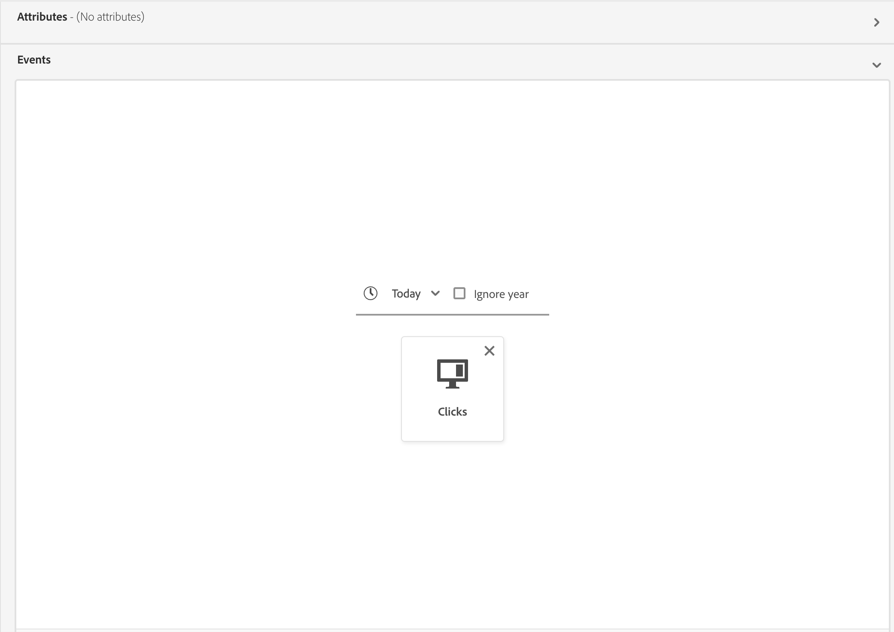 |
| プロファイルのみ | プロファイル属性のみを参照するセグメント定義。 | `homeAddress.country.equals("Canada", false)` | 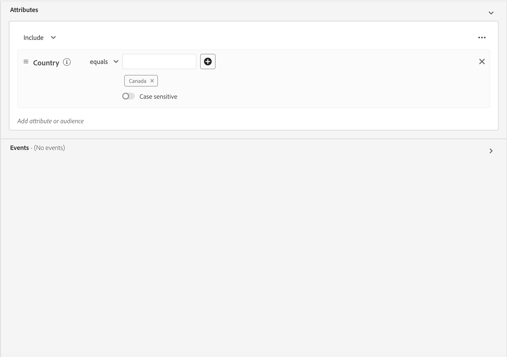 |
| プロファイル属性が24時間未満の相対時間枠内に存在する単一のイベント | 1つ以上のプロファイル属性を持つ単一の受信イベントを参照し、24時間未満の相対時間時間枠内で発生するセグメント定義。 | `workAddress.country.equals("Canada", false) and CHAIN(xEvent, timestamp, [C0: WHAT(eventType.equals("commerce.checkouts", false)) WHEN(today)])` | 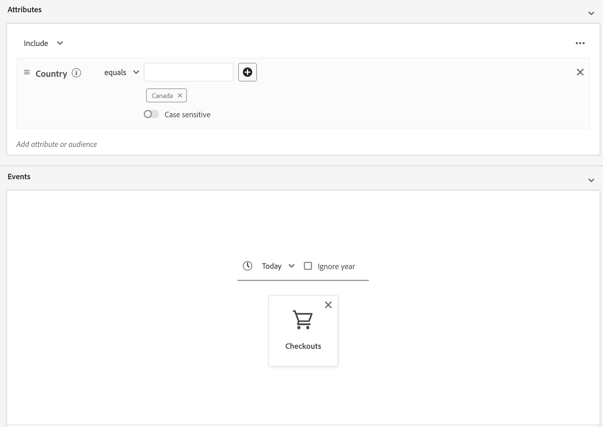 |
| 24時間の相対時間枠内で複数のイベント | **過去 24 時間以内に**&#x200B;複数のイベントを参照し、（オプションで）1 つ以上のプロファイル属性を持つ任意のセグメント定義。 | `workAddress.country.equals("US", false) and CHAIN(xEvent, timestamp, [C0: WHAT(eventType.equals("directMarketing.emailClicked", false)) WHEN(today), C1: WHAT(eventType.equals("commerce.checkouts", false)) WHEN(today)])` | 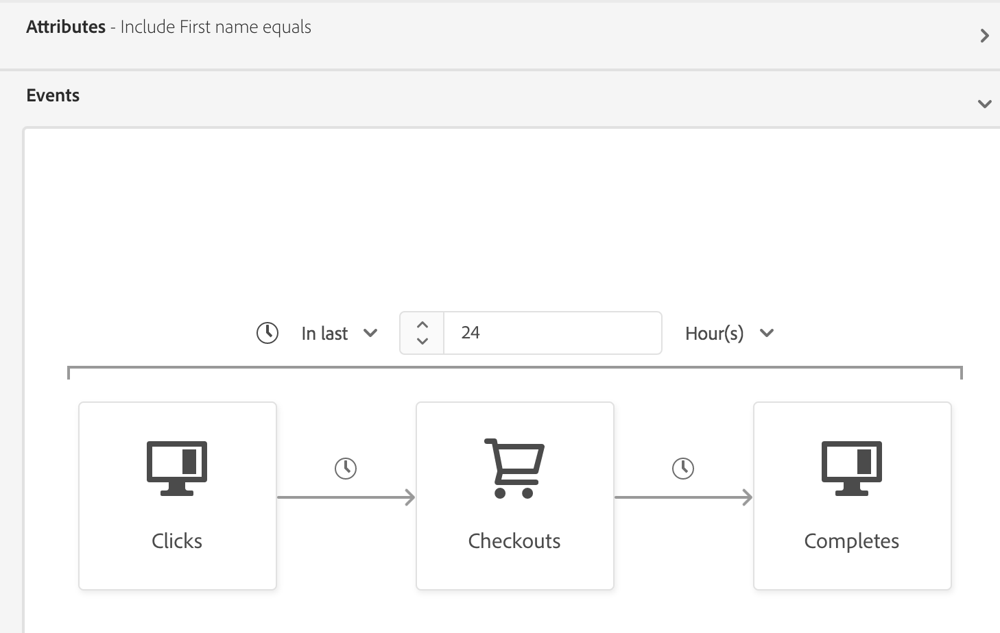 |

セグメント定義は、次のシナリオで&#x200B;**not** ストリーミングセグメント化の対象となります。

- セグメント定義には、Adobe Audience Manager（AAM）のセグメントまたは特性が含まれます。
- セグメント定義には複数のエンティティ（複数エンティティクエリ）が含まれます。
- セグメント定義には、単一のイベントと `inSegment` イベントの組み合わせが含まれます。
   - 例えば、単一のルールセットで次のチェーンを作成します：`inSegment("e3be6d7f-1727-401f-a41e-c296b45f607a") and  CHAIN(xEvent, timestamp, [C0: WHAT(eventType.equals("commerce.checkouts", false))  WHEN(<= 24 hours before now)])`。
- セグメント定義では、時間制約の一部として「年を無視」を使用します。

ストリーミングセグメンテーションクエリに適用される次のガイドラインに注意してください。

| クエリタイプ | ガイドライン |
| ---------- | -------- |
| 単一イベントルールセット | ルックバックウィンドウは **1 日**&#x200B;に制限されています。 |
| イベント履歴を含むクエリ | <ul><li>ルックバックウィンドウは **1 日**&#x200B;に制限されています。</li><li>イベント間に厳密な時間順序条件が存在する&#x200B;**必要があります**。</li><li>少なくとも 1 つの否定イベントを含むクエリがサポートされています。 ただし、イベント全体を否定することは&#x200B;**できません**。</li></ul> |

セグメント定義を変更して、ストリーミングセグメント化の条件を満たさなくなった場合、セグメント定義は自動的に「ストリーミング」から「バッチ」に切り替わります。

また、セグメントの選定解除は、セグメントの選定と同様に、リアルタイムで発生します。その結果、オーディエンスがセグメントの選定対象ではなくなった場合、そのオーディエンスはただちに選定解除となります。例えば、セグメント定義で「過去 3 時間で赤い靴を購入したすべてのユーザー」という要求があった場合、3 時間後に、最初にセグメント定義で選定されたすべてのプロファイルが無効になります。

### オーディエンスの組み合わせ {#combine-audiences}

バッチソースとストリーミングソースの両方からのデータを組み合わせるには、バッチコンポーネントとストリーミングコンポーネントを別々のオーディエンスに分ける必要があります。

### プロファイル属性とエクスペリエンスイベント {#profile-and-event}

例えば、次の2つのサンプルオーディエンスを考えてみましょう。

| オーディエンス | スキーマ | ソースタイプ | クエリ定義 | オーディエンス ID |
| -------- | ------ | ----------- | ---------------- | ----------- |
| カリフォルニア在住の方 | プロファイル | バッチ | 住所はカリフォルニア州 | `e3be6d7f-1727-401f-a41e-c296b45f607a` |
| 最近のチェックアウト | エクスペリエンスイベント | ストリーミング | 過去24時間に少なくとも1回のチェックアウトがある | `9e1646bb-57ff-4309-ba59-17d6c5bab6a1` |

ストリーミングオーディエンスでバッチコンポーネントを使用する場合は、セグメントのセグメントを使用してバッチオーディエンスを参照する必要があります。

したがって、2つのオーディエンスを組み合わせるルールセットの例は次のようになります。

```
inSegment("e3be6d7f-1727-401f-a41e-c296b45f607a") and 
CHAIN(xEvent, timestamp, [C0: WHAT(eventType.equals("commerce.checkouts", false)) 
WHEN(<= 24 hours before now)])
```

結果のオーディエンス *は、バッチオーディエンスコンポーネントを参照してバッチオーディエンスのメンバーシップを活用するため、ストリーミングセグメンテーションを使用して評価されます。*

### 複数のエクスペリエンスイベント {#two-events}

複数のオーディエンスをイベントデータと組み合わせたい場合、**は** イベントを組み合わせることはできません。 イベントごとにオーディエンスを作成し、`inSegment`を使用してすべてのオーディエンスを参照する別のオーディエンスを作成する必要があります。

例えば、2つのオーディエンスがあり、両方のオーディエンスにエクスペリエンスイベントスキーマデータが格納されているとします。

| オーディエンス | スキーマ | ソースタイプ | クエリ定義 | オーディエンス ID |
| -------- | ------ | ----------- | ---------------- | ----------- |
| 最近の放棄 | エクスペリエンスイベント | バッチ | 過去48時間に少なくとも1つの放棄イベントがある | `7deb246a-49b4-4687-95f9-6316df049948` |
| 最近のチェックアウト | エクスペリエンスイベント | ストリーミング | 過去24時間に少なくとも1回のチェックアウトがある | `9e1646bb-57ff-4309-ba59-17d6c5bab6a1` |

この場合、次のように3番目のオーディエンスを作成する必要があります。

```
inSegment("7deb246a-49b4-4687-95f9-6316df049948) and inSegment("9e1646bb-57ff-4309-ba59-17d6c5bab6a1")
```

## オーディエンスを作成 {#create-audience}

ストリーミングセグメンテーションを使用して評価されるオーディエンスは、Segmentation Service APIまたはUIのAudience Portalを使用して作成できます。

セグメント定義は、[適格なルールセット &#x200B;](#eligible-rulesets)のいずれかに一致する場合、ストリーミングを有効にできます。

>[!BEGINTABS]

>[!TAB  セグメント サービス API]

**API 形式**

```http
POST /segment/definitions
```

**リクエスト**

+++ ストリーミングセグメント化が有効なセグメント定義を作成するためのサンプルリクエスト

```shell
curl -X POST https://platform.adobe.io/data/core/ups/segment/definitions
 -H 'Authorization: Bearer {ACCESS_TOKEN}' \
 -H 'Content-Type: application/json' \
 -H 'x-gw-ims-org-id: {ORG_ID}' \
 -H 'x-api-key: {API_KEY}' \
 -H 'x-sandbox-name: {SANDBOX_NAME}'
 -d '{
        "name": "People in the USA",
        "description: "An audience that looks for people who live in the USA",
        "expression": {
            "type": "PQL",
            "format": "pql/text",
            "value": "homeAddress.country = \"US\""
        },
        "evaluationInfo": {
            "batch": {
                "enabled": false
            },
            "continuous": {
                "enabled": true
            },
            "synchronous": {
                "enabled": false
            }
        },
        "schema": {
            "name": "_xdm.context.profile"
        }
     }'
```

+++

**応答**

リクエストが成功した場合は、新しく作成したセグメント定義の詳細と HTTP ステータス 200 が返されます。

+++セグメント定義を作成する際の応答のサンプル。

```json
{
    "id": "4afe34ae-8c98-4513-8a1d-67ccaa54bc05",
    "schema": {
        "name": "_xdm.context.profile"
    },
    "profileInstanceId": "ups",
    "imsOrgId": "{ORG_ID}",
    "sandbox": {
        "sandboxId": "28e74200-e3de-11e9-8f5d-7f27416c5f0d",
        "sandboxName": "prod",
        "type": "production",
        "default": true
    },
    "name": "People in the USA",
    "description": "An audience that looks for people who live in the USA",
    "expression": {
        "type": "PQL",
        "format": "pql/text",
        "value": "homeAddress.country = \"US\""
    },
    "evaluationInfo": {
        "batch": {
            "enabled": false
        },
        "continuous": {
            "enabled": true
        },
        "synchronous": {
            "enabled": false
        }
    },
    "dataGovernancePolicy": {
        "excludeOptOut": true
    },
    "creationTime": 0,
    "updateEpoch": 1579292094,
    "updateTime": 1579292094000
}
```

+++

このエンドポイントの使用について詳しくは、[&#x200B; セグメント定義エンドポイントガイド &#x200B;](../api/segment-definitions.md)を参照してください。

>[!TAB  オーディエンスポータル ]

オーディエンスポータルで、**[!UICONTROL Create audience]**&#x200B;を選択します。

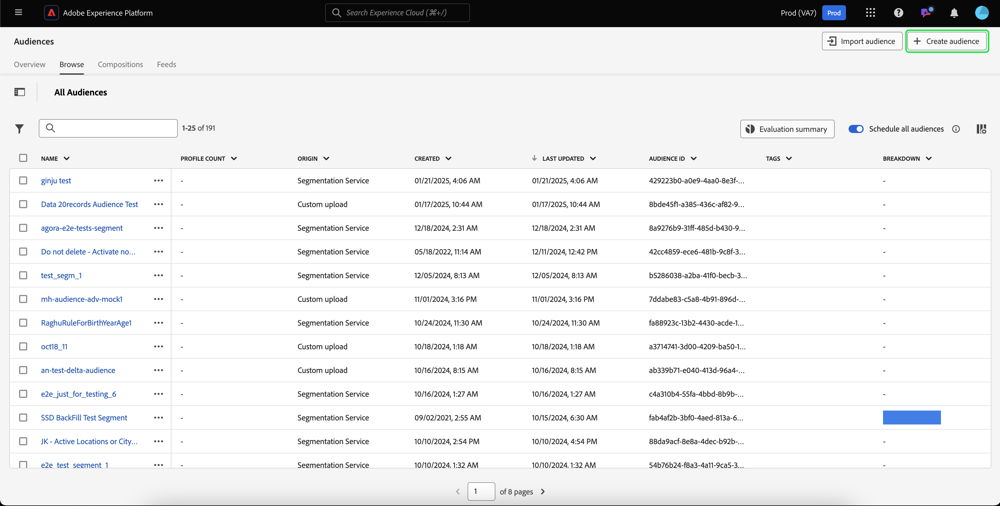

ポップオーバーが表示されます。 **[!UICONTROL Build rules]**&#x200B;を選択してセグメントビルダーに入ります。

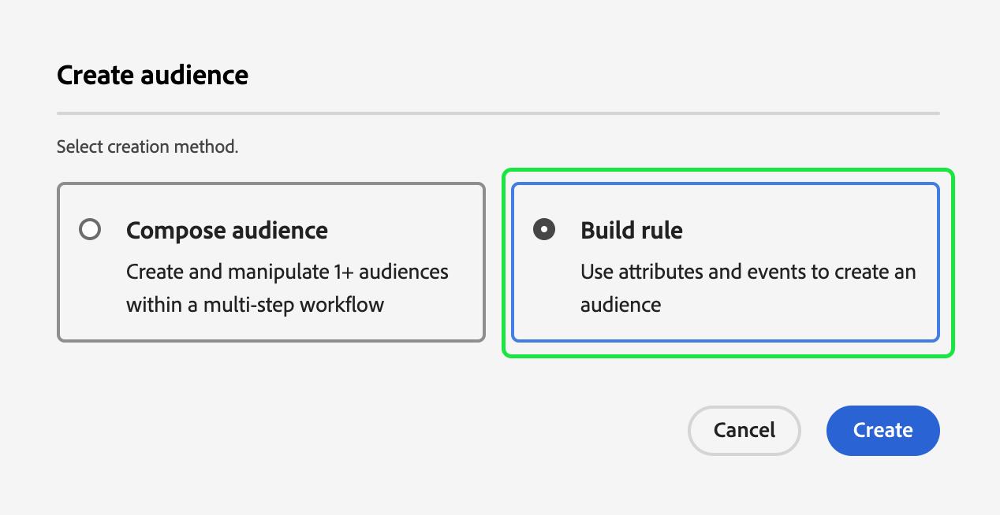

セグメントビルダー内で、[適格なルールセット &#x200B;](#eligible-rulesets)のいずれかに一致するセグメント定義を作成します。 セグメント定義がストリーミングセグメント化に適合する場合は、**[!UICONTROL Streaming]**&#x200B;を&#x200B;**[!UICONTROL Evaluation method]**&#x200B;として選択できます。

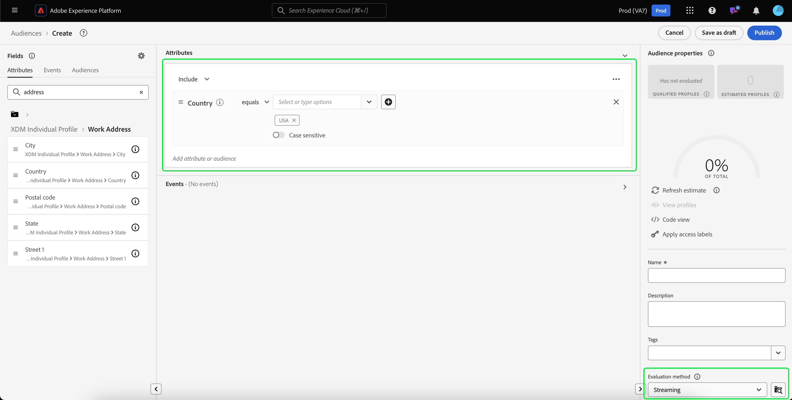

セグメント定義の作成について詳しくは、[セグメントビルダーガイド](../ui/segment-builder.md)を参照してください。

>[!ENDTABS]

## オーディエンスの取得 {#retrieve-audiences}

ストリーミングセグメンテーションを使用して評価されたすべてのオーディエンスを取得するには、Segmentation Service APIまたはUIのAudience Portalを使用します。

>[!BEGINTABS]

>[!TAB  セグメント サービス API]

`/segment/definitions` エンドポイントに対してGET リクエストを行うことで、組織内のストリーミングセグメンテーションを使用して評価されたすべてのセグメント定義のリストを取得します。

**API 形式**

ストリーミングセグメント化を使用して評価されたセグメント定義を取得するには、クエリパラメーター`evaluationInfo.synchronous.enabled=true`をリクエストパスに含める必要があります。

```http
GET /segment/definitions?evaluationInfo.continuous.enabled=true
```

**リクエスト**

+++ ストリーミングが有効なすべてのセグメント定義を一覧表示するサンプルリクエスト

```shell
curl -X GET 'https://platform.adobe.io/data/core/ups/segment/definitions?evaluationInfo.continuous.enabled=true' \
  -H 'Authorization: Bearer {ACCESS_TOKEN}' \
  -H 'Content-Type: application/json' \
  -H 'x-api-key: {API_KEY}' \
  -H 'x-gw-ims-org-id: {ORG_ID}' \
  -H 'x-sandbox-name: {SANDBOX_NAME}'
```

+++

**応答**

応答が成功すると、ストリーミングセグメント化が有効になっている組織内のセグメント定義の配列を含むHTTP ステータス 200が返されます。

+++組織内のすべてのストリーミングセグメンテーション対応セグメント定義のリストを含むサンプル応答

```json
{
    "segments": [
        {
            "id": "15063cb-2da8-4851-a2e2-bf59ddd2f004",
            "schema": {
                "name": "_xdm.context.profile"
            },
            "ttlInDays": 30,
            "imsOrgId": "{ORG_ID}",
            "sandbox": {
                "sandboxId": "",
                "sandboxName": "",
                "type": "production",
                "default": true
            },
            "name": " People who are NOT on their homepage ",
            "expression": {
                "type": "PQL",
                "format": "pql/text",
                "value": "select var1 from xEvent where var1._experience.analytics.endUser.firstWeb.webPageDetails.isHomePage = false"
            },
            "evaluationInfo": {
                "batch": {
                    "enabled": false
                },
                "continuous": {
                    "enabled": true
                },
                "synchronous": {
                    "enabled": false
                }
            },
            "creationTime": 1572029711000,
            "updateEpoch": 1572029712000,
            "updateTime": 1572029712000
        },
        {
            "id": "f15063cb-2da8-4851-a2e2-bf59ddd2f004",
            "schema": {
                "name": "_xdm.context.profile"
            },
            "ttlInDays": 30,
            "imsOrgId": "{ORG_ID}",
            "sandbox": {
                "sandboxId": "",
                "sandboxName": "",
                "type": "production",
                "default": true
            },
            "name": "Homepage_continuous",
            "description": "People who are on their homepage - continuous",
            "expression": {
                "type": "PQL",
                "format": "pql/text",
                "value": "select var1 from xEvent where var1._experience.analytics.endUser.firstWeb.webPageDetails.isHomePage = true"
            },
            "evaluationInfo": {
                "batch": {
                    "enabled": true
                },
                "continuous": {
                    "enabled": true
                },
                "synchronous": {
                    "enabled": false
                }
            },
            "creationTime": 1572021085000,
            "updateEpoch": 1572021086000,
            "updateTime": 1572021086000
        }
    ],
    "page": {
        "totalCount": 2,
        "totalPages": 1,
        "sortField": "creationTime",
        "sort": "desc",
        "pageSize": 2,
        "limit": 100
    },
    "link": {}
}
```

返されるセグメント定義について詳しくは、[セグメント定義エンドポイントガイド](../api/segment-definitions.md)を参照してください。

+++

>[!TAB  オーディエンスポータル ]

オーディエンスポータルのフィルターを使用すると、組織内のストリーミングセグメンテーションに有効なすべてのオーディエンスを取得できます。  アイコンを選択して、フィルターのリストを表示します。

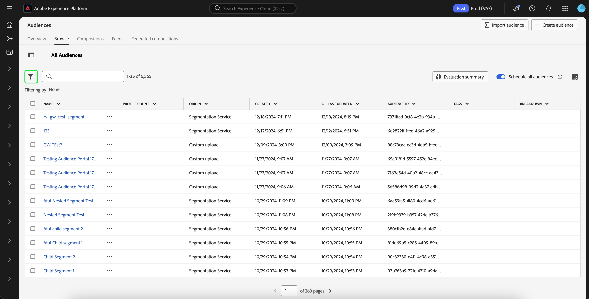

使用可能なフィルター内で、**[!UICONTROL Update frequency]**&#x200B;に移動し、「[!UICONTROL Streaming]」を選択します。 このフィルターを使用すると、ストリーミングセグメンテーションを使用して評価された組織内のすべてのオーディエンスが表示されます。

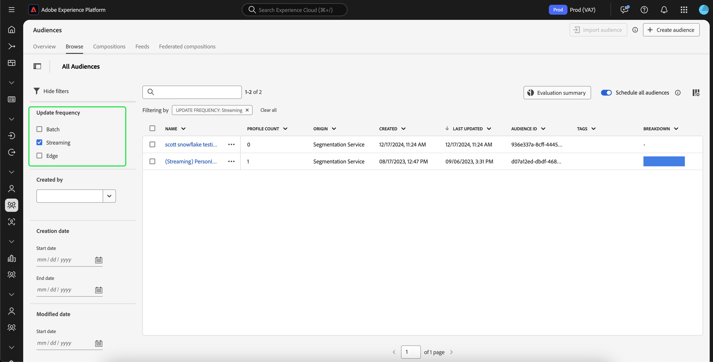

Experience Platformでのオーディエンスの表示について詳しくは、[&#x200B; オーディエンスポータルガイド &#x200B;](../ui/audience-portal.md)を参照してください。

>[!ENDTABS]

## オーディエンスの詳細 {#audience-details}

ストリーミングセグメンテーションを使用して評価された特定のオーディエンスの詳細を、オーディエンスポータル内で選択して表示できます。

オーディエンスポータルでオーディエンスを選択すると、オーディエンスの詳細ページが表示されます。 これにより、オーディエンスの詳細の要約、時間の経過に伴う適格プロファイルの量、オーディエンスがアクティブ化された宛先など、オーディエンスに関する情報が表示されます。

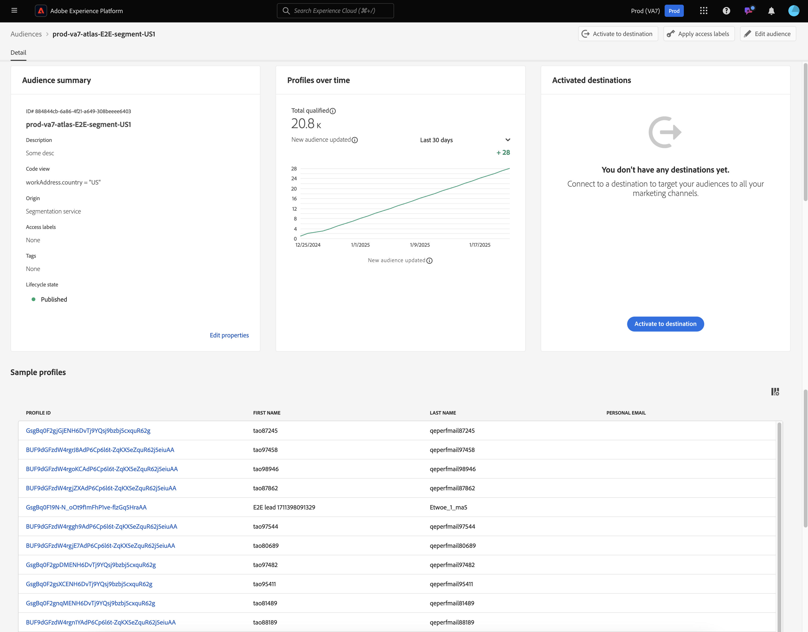

ストリーミングが有効なオーディエンスの場合、**[!UICONTROL Profiles over time]** カードが表示され、合計適格オーディエンス数と新しいオーディエンス更新指標が表示されます。

**[!UICONTROL Total qualified]**&#x200B;指標は、このオーディエンスのバッチ評価とストリーミング評価に基づいて、選定されたオーディエンスの合計数を表します。

**[!UICONTROL New audience updated]**&#x200B;指標は、ストリーミングセグメンテーションによるオーディエンスサイズの変化を示す折れ線グラフで表されます。 ドロップダウンを調整して、過去24時間、先週、または過去30日間を表示できます。

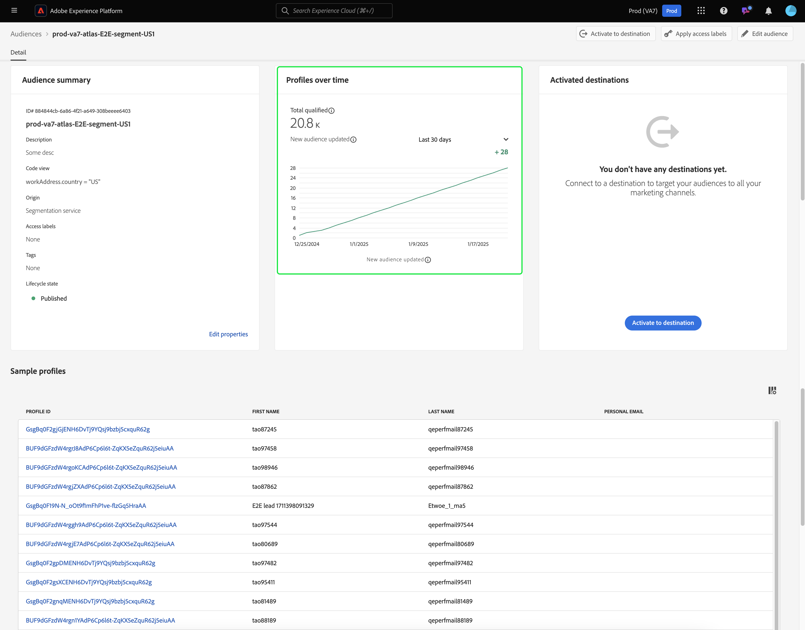

オーディエンスの詳細については、[&#x200B; オーディエンスポータルの概要](../ui/audience-portal.md#audience-details)を参照してください。

## 次の手順

このガイドでは、Adobe Experience Platformでのストリーミング対応セグメント定義の仕組みと、ストリーミング対応セグメント定義のモニタリング方法について説明します。

Adobe Experience Platform ユーザーインターフェイスの使用について詳しくは、[セグメント化ユーザーガイド](./overview.md)を参照してください。

ストリーミングセグメンテーションに関するよくある質問については、FAQ[の「](../faq.md#streaming-segmentation) ストリーミングセグメンテーション」の節をご覧ください。
