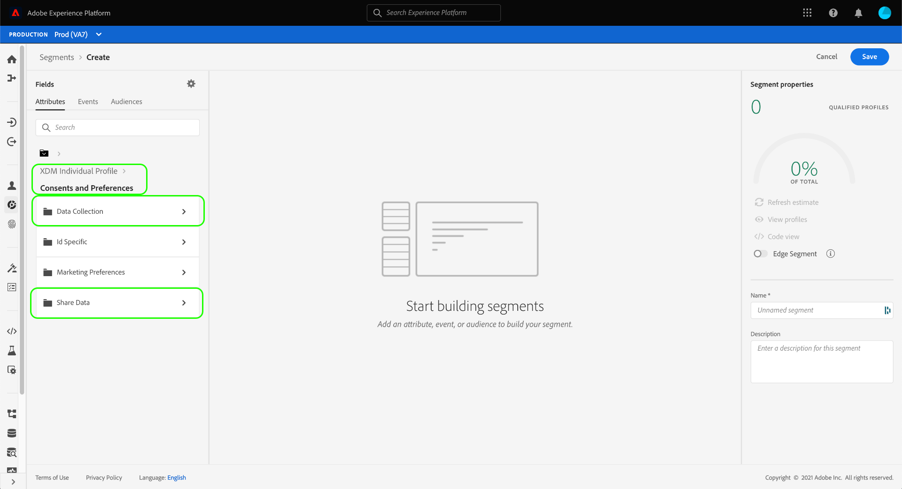
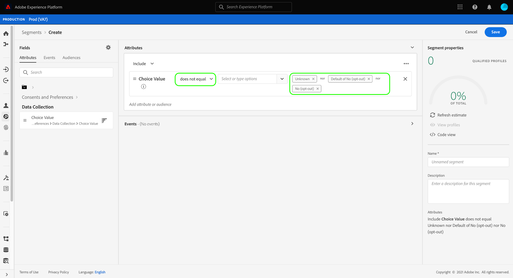

# セグメント定義での同意の遵守

>[!NOTE]
>
>このガイドでは、**セグメント定義** 内の同意に従う方法を説明します。

[!DNL California Consumer Privacy Act] （CCPA）などの法的なプライバシー規制では、消費者が個人データをサードパーティで収集または共有することをオプトアウトする権利を提供しています。 Adobe Experience Platformは、これらの顧客の同意環境設定をリアルタイム顧客プロファイルデータに取り込むことを目的とした、標準のエクスペリエンスデータモデル（XDM）コンポーネントを提供します。

顧客が個人データの共有に対する同意を撤回または留保した場合、マーケティングアクティビティのオーディエンスを生成する際に、組織がその環境設定を遵守することが重要です。 このドキュメントでは、Experience Platform ユーザーインターフェイスを使用してセグメント定義に顧客の同意値を統合する方法を説明します。

## はじめに

顧客の同意値を尊重するには、関連する様々な [!DNL Adobe Experience Platform] サービスを理解している必要があります。 このチュートリアルを開始する前に、次のサービスに精通していることを確認してください。

* [[!DNL Experience Data Model (XDM)]](../../xdm/home.md)：Experience Platform が顧客体験データを整理するための標準的なフレームワーク。
* [[!DNL Real-Time Customer Profile]](../../profile/home.md)：複数のソースから集計したデータに基づいて、統合された顧客プロファイルをリアルタイムで提供します。
* [[!DNL Adobe Experience Platform Segmentation Service]](../home.md):[!DNL Real-Time Customer Profile] データからオーディエンスを作成できます。

## 同意スキーマフィールド

顧客の同意および環境設定に従うには、[!UICONTROL XDM 個人プロファイル &#x200B;] 結合スキーマの一部であるスキーマの 1 つに、標準フィールドグループ **[!UICONTROL 同意および環境設定]** が含まれている必要があります。

フィールドグループが提供する各属性の構造と意図されるユースケースについて詳しくは、[ 同意および環境設定リファレンスガイド ](../../xdm/field-groups/profile/consents.md) を参照してください。 スキーマにフィールドグループを追加する手順については、[XDM UI ガイド ](../../xdm/ui/resources/schemas.md#add-field-groups) を参照してください。

フィールドグループが [ プロファイル対応スキーマ ](../../xdm/ui/resources/schemas.md#profile) に追加され、そのフィールドをエクスペリエンスアプリケーションから同意データを取り込むために使用されると、収集された同意属性をセグメントルールで使用できます。

## セグメント化での同意の処理

オプトアウトプロファイルがセグメント定義に含まれないようにするには、新しいセグメント定義を作成する際に、既存のセグメント定義に特別なフィールドを追加し、含める必要があります。

次の手順は、2 種類のオプトアウトフラグに適切なフィールドを追加する方法を示しています。

1. [!UICONTROL データ収集]
1. [!UICONTROL &#x200B; データを共有 &#x200B;]

>[!NOTE]
>
>このガイドでは、上記の 2 つのオプトアウトフラグに焦点を当てていますが、追加の同意シグナルを組み込むようにセグメント定義を設定することもできます。 [ 同意および環境設定リファレンスガイド ](../../xdm/field-groups/profile/consents.md) では、これらの各オプションとその意図されたユースケースについて詳しく説明します。

UI でセグメント定義を作成する場合、「**[!UICONTROL 属性]**」の下の「**[!UICONTROL XDM 個人プロファイル]**」に移動し、「**[!UICONTROL 同意と環境設定]**」を選択したあと、「**[!UICONTROL ID 固有]**」を選択します。 ここから、**[!UICONTROL データ収集]** および **[!UICONTROL データを共有]** のオプションを確認できます。

**[!UICONTROL データ収集]** カテゴリを選択して開始し、**[!UICONTROL 選択値]** をセグメントビルダーにドラッグします。 セグメント定義に属性を追加する際に、含めるか除外する必要がある [ 同意値 ](../../xdm/field-groups/profile/consents.md#choice-values) を指定できます。

1 つのアプローチは、データ収集をオプトアウトしたお客様を除外することです。 これを行うには、演算子を **[!UICONTROL 次と等しくない]** に設定し、次の値を選択します。

* **[!UICONTROL なし（オプトアウト）]**
* **[!UICONTROL デフォルトの「いいえ」（オプトアウト）]**
* **[!UICONTROL 不明]** （同意が得られないと見なされる場合は不明）

左側のパネルの **[!UICONTROL 属性]** の下で、「**[!UICONTROL 同意および環境設定]**」セクションに戻り、「**[!UICONTROL データを共有]**」を選択します。 対応する **[!UICONTROL 選択値]** をキャンバスにドラッグし、[!UICONTROL &#x200B; データ収集 &#x200B;] 選択値と同じ値を選択します。 2 つの属性間に **[!UICONTROL OR]** 関係が確立されていることを確認します。

**[!UICONTROL データ収集]** と **[!UICONTROL データを共有]** の両方の同意値がセグメント定義に追加された状態で、データを使用することをオプトアウトした顧客は、結果のオーディエンスから除外されます。 ここから、セグメント定義のカスタマイズを続行してから、「**[!UICONTROL 保存]**」を選択してプロセスを終了できます。

## 次の手順

このチュートリアルに従うことで、Experience Platformでセグメント定義を作成する際に顧客の同意および環境設定を遵守する方法について、理解を深めることができました。

Experience Platformでの同意管理について詳しくは、次のドキュメントを参照してください。

* [Adobe標準を使用した同意処理](../../landing/governance-privacy-security/consent/adobe/overview.md)
* [IAB TCF 2.0 標準を使用した同意処理](../../landing/governance-privacy-security/consent/iab/overview.md)