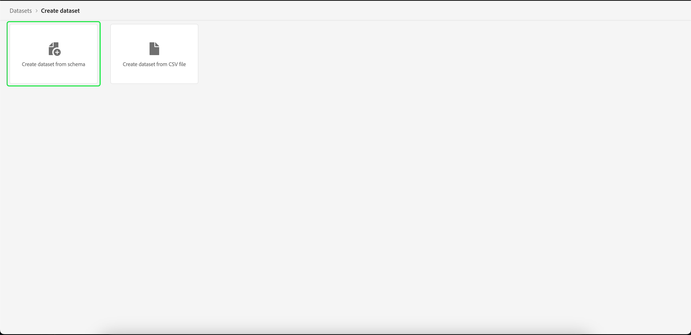

# オーディエンスセグメントをエクスポートするためのデータセットの作成

[!DNL Adobe Experience Platform] では、特定の属性に基づいて顧客プロファイルをオーディエンスにセグメント化できます。 セグメントを作成したら、そのオーディエンスをデータセットに書き出し、そこでオーディエンスにアクセスしたり、操作したりできます。 エクスポートを正常におこなうには、データセットを正しく設定する必要があります。

このチュートリアルでは、 [!DNL Experience Platform] UI

このチュートリアルは、 [セグメント結果の評価とアクセス](./evaluate-a-segment.md). セグメント評価のチュートリアルでは、 [!DNL Catalog Service] このチュートリアルでは、API に対し、 [!DNL Experience Platform] UI

## はじめに

セグメントをエクスポートするには、データセットが [!DNL XDM Individual Profile Union Schema]. 和集合スキーマは、同じクラスを共有するすべてのスキーマのフィールドを集計する、システム生成の読み取り専用のスキーマです。 和集合スキーマについて詳しくは、 [スキーマ構成の基本](../../xdm/schema/composition.md#union).

UI に和集合スキーマを表示するには、「 **[!UICONTROL プロファイル]** 左側のナビゲーションで、「 **[!UICONTROL 和集合スキーマ]** 以下に示すように。

## データセットワークスペース

この [!UICONTROL データセット] workspace では、組織のすべてのデータセットを表示および管理できます。

選択 **[!UICONTROL データセット]** 左側のナビゲーションでワークスペースにアクセスし、「 **[!UICONTROL 参照]**. このタブには、データセットとその詳細のリストが表示されます。 各列の幅によっては、すべての列を表示するには、左または右にスクロールする必要があります。

>[!NOTE]
>
>検索バーの横にあるフィルターアイコンを選択して、フィルタリング機能を使用し、有効なデータセットのみを表示します。 [!DNL Real-time Customer Profile].

## データセットの作成

データセットを作成するには、「 **[!UICONTROL データセットを作成]**.

次の画面で、「 」を選択します。 **[!UICONTROL スキーマからデータセットを作成]**.

## XDM 個別プロファイル和集合スキーマの選択

次の項目を選択します。 [!DNL XDM Individual Profile Union Schema] データセットで使用する場合は、「[!UICONTROL XDM 個人プロファイル]」スキーマ **[!UICONTROL スキーマを選択]** 画面 スキーマを選択したら、そのスキーマがの和集合スキーマかどうかを確認できます。 **[!UICONTROL API の使用]** をクリックします。 この [!UICONTROL スキーマ] パスが次の値で終わる `_union`の場合、和集合スキーマです。

>[!NOTE]
>
>和集合スキーマは定義によりリアルタイム顧客プロファイルに参加していますが、従来のスキーマと同じ方法でプロファイルに対して有効になっていないので、「無効」と表示されます。

横のラジオボタンを選択します。 **[!UICONTROL XDM 個人プロファイル]**&#x200B;を選択し、「 **[!UICONTROL 次へ]**.

## データセットの設定

次の画面で、データセットに名前を付ける必要があります。 オプションで説明を追加することもできます。

**データセット名に関する注意事項：**
* 後でライブラリ内で簡単に見つけられるように、データセット名は短く、わかりやすい名前にする必要があります。
* データセット名は一意である必要があります。つまり、今後再利用されないように十分に具体的に指定する必要があります。
* ベストプラクティスは、説明フィールドを使用して、データセットに関する追加情報を提供することです。これは、今後、他のユーザーがデータセットを区別する際に役立つ可能性があるためです。

データセットに名前と説明が付いたら、「 」を選択します。 **[!UICONTROL 完了]**.

## データセットアクティビティ

データセットを作成したら、そのデータセットのアクティビティページが表示されます。 ワークスペースの左上隅にデータセットの名前と、「バッチが追加されていません」という通知が表示されます。このデータセットにバッチをまだ追加していないので、これは期待通りです。

右側のレールには、新しいデータセットに関連する情報（データセット ID、名前、説明、スキーマなど）が含まれています。 **[!UICONTROL データセット ID]** は、オーディエンスセグメントのエクスポートワークフローを完了するために必要になるので、メモしておいてください。

## 次の手順

これで、 [!DNL XDM Individual Profile Union Schema]に値を入力した場合は、データセット ID を使用して [セグメント結果の評価とアクセス](./evaluate-a-segment.md) チュートリアル

この時点で、セグメント結果評価チュートリアルに戻り、 [オーディエンスメンバー用のプロファイルの生成](./evaluate-a-segment.md#generate-profiles) セグメントの書き出しワークフローの手順。
