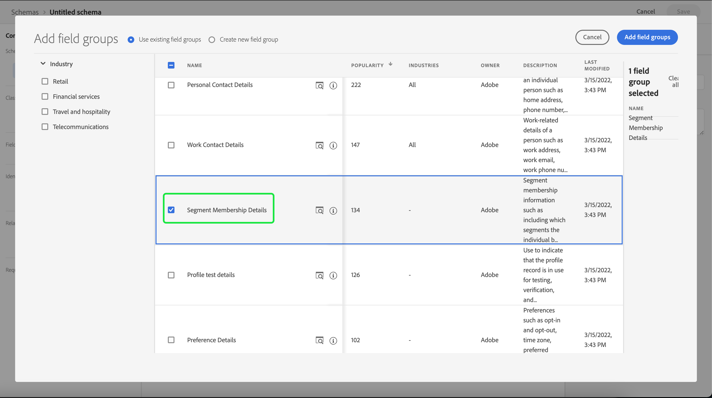

# 外部オーディエンスのインポートと使用

Adobe Experience Platformは、外部オーディエンスをインポートする機能をサポートしています。これは、その後、新しいセグメント定義のコンポーネントとして使用できます。 このドキュメントでは、外部オーディエンスをインポートして使用するExperience Platformを設定するためのチュートリアルを提供します。

## はじめに

このチュートリアルでは、 [!DNL Adobe Experience Platform] オーディエンスセグメントの作成に関係するサービス。 このチュートリアルを開始する前に、次のサービスのドキュメントを確認してください。

- [セグメント化サービス](../home.md):リアルタイム顧客プロファイルデータからオーディエンスセグメントを作成できます。
- [リアルタイム顧客プロファイル](../../profile/home.md):複数のソースからの集計データに基づいて、統合されたリアルタイムの消費者プロファイルを提供します。
- [エクスペリエンスデータモデル（XDM）](../../xdm/home.md)：Platform が顧客エクスペリエンスデータを整理する際に使用する標準化されたフレームワーク。セグメント化を最大限に活用するには、[データモデリングのベストプラクティス](../../xdm/schema/best-practices.md)に従って、データがプロファイルとイベントとして取り込まれていることを確認してください。
- [データセット](../../catalog/datasets/overview.md)：Experience Platform のデータ永続化のためのストレージと管理の構成。
- [ストリーミング取り込み](../../ingestion/streaming-ingestion/overview.md):Experience Platformがクライアントサイドおよびサーバーサイドのデバイスからデータをリアルタイムで取得し、保存する方法。

### セグメントデータとセグメントメタデータ

外部オーディエンスの読み込みと使用を開始する前に、セグメントデータとセグメントメタデータの違いを理解しておくことが重要です。

セグメントデータは、セグメント認定条件を満たすプロファイルを指すので、オーディエンスの一部になります。

セグメントメタデータは、セグメント自体に関する情報で、名前、説明、式（該当する場合）、作成日、最終変更日、ID などが含まれます。 ID は、セグメントメタデータを、セグメントの認定を満たし、結果として得られるオーディエンスの一部となる個々のプロファイルにリンクします。

| セグメントデータ | セグメントメタデータ |
| ------------ | ---------------- |
| セグメント認定を満たすプロファイル | セグメント自体に関する情報 |

## 外部オーディエンス用の ID 名前空間の作成

外部オーディエンスを使用する最初の手順は、ID 名前空間を作成することです。 ID 名前空間を使用すると、Platform はセグメントの元となる場所を関連付けることができます。

ID 名前空間を作成するには、 [id 名前空間ガイド](../../identity-service/namespaces.md#manage-namespaces). ID 名前空間を作成する際に、ソースの詳細を ID 名前空間に追加し、その ID 名前空間をマークします [!UICONTROL タイプ] as a **[!UICONTROL 人以外の識別子]**.


## セグメントメタデータのスキーマの作成

ID 名前空間を作成した後、作成するセグメント用に新しいスキーマを作成する必要があります。

スキーマの構成を開始するには、まず「 」を選択します。 **[!UICONTROL スキーマ]** 左側のナビゲーションバーで、 **[!UICONTROL スキーマを作成]** を使用して、スキーマワークスペースの右上隅に表示します。 ここからを選択します。 **[!UICONTROL 参照]** をクリックして、使用可能なスキーマタイプの完全な選択を確認します。


事前に定義されたクラスであるセグメント定義を作成するので、「 」を選択します。 **[!UICONTROL 既存のクラスを使用]**. 次に、 **[!UICONTROL セグメント定義]** クラス、その後に **[!UICONTROL クラスを割り当て]**.


スキーマが作成されたので、セグメント ID を含むフィールドを指定する必要があります。 このフィールドをプライマリ ID としてマークし、以前に作成した名前空間に割り当てる必要があります。


をマークした後 `_id` 「 」フィールドをプライマリ id として、スキーマのタイトルを選択し、「 」というラベルの付いた切り替えを選択します **[!UICONTROL プロファイル]**. 選択 **[!UICONTROL 有効にする]** スキーマを有効にするには [!DNL Real-Time Customer Profile].


これで、このスキーマがプロファイルに対して有効になり、作成した個人以外の ID 名前空間にプライマリ ID が割り当てられます。 その結果、このスキーマを使用して Platform に読み込まれたセグメントメタデータは、他の人関連のプロファイルデータと結合されずに、プロファイルに取り込まれます。

## スキーマのデータセットの作成

スキーマを設定した後、セグメントメタデータのデータセットを作成する必要があります。

データセットを作成するには、 [データセットユーザーガイド](../../catalog/datasets/user-guide.md#create). 次の手順に従う必要があります。 **[!UICONTROL スキーマからデータセットを作成]** 」オプションを選択します。


データセットの作成後、 [データセットユーザーガイド](../../catalog/datasets/user-guide.md#enable-profile) をクリックして、リアルタイム顧客プロファイルに対してこのデータセットを有効にします。


## オーディエンスデータの設定とインポート

データセットを有効にした場合、UI を使用して、またはExperience PlatformAPI を使用して、データを Platform に送信できるようになりました。 このデータは、バッチ接続またはストリーミング接続を使用して取り込むことができます。

### バッチ接続を使用したデータの取得

バッチ接続を作成するには、汎用の [ローカルファイルアップロード UI ガイド](../../sources/tutorials/ui/create/local-system/local-file-upload.md). データの取り込みに使用できる利用可能なソースの完全なリストについては、 [ソースの概要](../../sources/home.md).

### ストリーミング接続を使用したデータの取り込み

ストリーミング接続を作成するには、 [API チュートリアル](../../sources/tutorials/api/create/streaming/http.md) または [UI チュートリアル](../../sources/tutorials/ui/create/streaming/http.md).

ストリーミング接続を作成したら、固有のストリーミングエンドポイントにアクセスし、データの送信先にすることができます。 これらのエンドポイントにデータを送信する方法については、 [レコードデータのストリーミングに関するチュートリアル](../../ingestion/tutorials/streaming-record-data.md#ingest-data).


## オーディエンスのメタデータ構造

接続を作成した後、データを Platform に取り込めるようになりました。

外部オーディエンスペイロードのメタデータの例を以下に示します。

```json
{
    "header": {
        "schemaRef": {
            "id": "https://ns.adobe.com/{TENANT_ID}/schemas/{SCHEMA_ID}",
            "contentType": "application/vnd.adobe.xed-full+json;version=1"
        },
        "imsOrgId": "{ORG_ID}",
        "datasetId": "{DATASET_ID}",
        "source": {
            "name": "Sample External Audience"
        }
    },
    "body": {
        "xdmMeta": {
            "schemaRef": {
                "id": "https://ns.adobe.com/{TENANT_ID}/schemas/{SCHEMA_ID}",
                "contentType": "application/vnd.adobe.xed-full+json;version=1"
            }
        },
        "xdmEntity": {
            "_id": "{SEGMENT_ID}",
            "description": "Sample description",
            "identityMap": {
                "{IDENTITY_NAMESPACE}": [{
                    "id": "{}"
                }]
            },
            "segmentName" : "{SEGMENT_NAME}",
            "segmentStatus": "ACTIVE",
            "version": "1.0"
        }
    }
}
```

| プロパティ | 説明 |
| -------- | ----------- |
| `schemaRef` | スキーマ **必須** 前に作成したセグメントメタデータのスキーマを参照します。 |
| `datasetId` | データセット ID **必須** 先ほど作成したスキーマ用に前に作成したデータセットを参照します。 |
| `xdmEntity._id` | ID **必須** 外部オーディエンスと同じセグメント ID を参照します。 |
| `xdmEntity.identityMap` | この節 **必須** には、以前に作成した名前空間の作成時に使用する id ラベルが含まれます。 |
| `{IDENTITY_NAMESPACE}` | これは、以前に作成した ID 名前空間のラベルです。 例えば、ID 名前空間を「externalAudience」と呼ぶ場合は、それを配列のキーとして使用します。 |
| `segmentName` | 外部オーディエンスをセグメント化するセグメントの名前。 |

## インポートしたオーディエンスを使用したセグメントの作成

インポートしたオーディエンスを設定したら、セグメント化プロセスの一部として使用できます。 外部オーディエンスを検索するには、セグメントビルダーに移動して、 **[!UICONTROL オーディエンス]** 」タブをクリックします。 **[!UICONTROL フィールド]** 」セクションに入力します。


## 次の手順

これで、セグメントで外部オーディエンスを使用できるようになったので、セグメントビルダーを使用してセグメントを作成できます。 セグメントの作成方法については、 [セグメントの作成に関するチュートリアル](./create-a-segment.md).

## 付録

読み込まれた外部オーディエンスメタデータを使用し、それらを使用してセグメントを作成する以外に、外部セグメントメンバーシップを Platform に読み込むこともできます。

### 外部セグメントメンバーシップの宛先スキーマの設定

スキーマの構成を開始するには、まず「 」を選択します。 **[!UICONTROL スキーマ]** 左側のナビゲーションバーで、 **[!UICONTROL スキーマを作成]** を使用して、スキーマワークスペースの右上隅に表示します。 ここからを選択します。 **[!UICONTROL XDM 個人プロファイル]**.


スキーマが作成されたので、セグメントメンバーシップフィールドグループをスキーマの一部として追加する必要があります。 それには、「 [!UICONTROL セグメントメンバーシップの詳細]に続いて [!UICONTROL フィールドグループを追加].



さらに、スキーマが **[!UICONTROL プロファイル]**. これをおこなうには、フィールドをプライマリ ID としてマークする必要があります。


### データセットの設定

スキーマを作成したら、データセットを作成する必要があります。

データセットを作成するには、 [データセットユーザーガイド](../../catalog/datasets/user-guide.md#create). 次の手順に従う必要があります。 **[!UICONTROL スキーマからデータセットを作成]** 」オプションを選択します。


データセットの作成後、 [データセットユーザーガイド](../../catalog/datasets/user-guide.md#enable-profile) をクリックして、リアルタイム顧客プロファイルに対してこのデータセットを有効にします。


## 外部オーディエンスメンバーシップデータの設定とインポート

データセットを有効にした場合、UI を使用して、またはExperience PlatformAPI を使用して、データを Platform に送信できるようになりました。 このデータは、バッチ接続またはストリーミング接続を使用して取り込むことができます。

### バッチ接続を使用したデータの取得

バッチ接続を作成するには、汎用の [ローカルファイルアップロード UI ガイド](../../sources/tutorials/ui/create/local-system/local-file-upload.md). データの取り込みに使用できる利用可能なソースの完全なリストについては、 [ソースの概要](../../sources/home.md).

### ストリーミング接続を使用したデータの取り込み

ストリーミング接続を作成するには、 [API チュートリアル](../../sources/tutorials/api/create/streaming/http.md) または [UI チュートリアル](../../sources/tutorials/ui/create/streaming/http.md).

ストリーミング接続を作成したら、固有のストリーミングエンドポイントにアクセスし、データの送信先にすることができます。 これらのエンドポイントにデータを送信する方法については、 [レコードデータのストリーミングに関するチュートリアル](../../ingestion/tutorials/streaming-record-data.md#ingest-data).


## セグメントメンバーシップ構造

接続を作成した後、データを Platform に取り込めるようになりました。

外部オーディエンスメンバーシップペイロードの例を以下に示します。

```json
{
    "header": {
        "schemaRef": {
            "id": "https://ns.adobe.com/{TENANT_ID}/schemas/{SCHEMA_ID}",
            "contentType": "application/vnd.adobe.xed-full+json;version=1"
        },
        "imsOrgId": "{ORG_ID}",
        "datasetId": "{DATASET_ID}",
        "source": {
            "name": "Sample External Audience Membership"
        }
    },
    "body": {
        "xdmMeta": {
            "schemaRef": {
                "id": "https://ns.adobe.com/{TENANT_ID}/schemas/{SCHEMA_ID}",
                "contentType": "application/vnd.adobe.xed-full+json;version=1"
            }
        },
        "xdmEntity": {
            "_id": "{UNIQUE_ID}",
            "description": "Sample description",
            "{TENANT_NAME}": {
                "identities": {
                    "{SCHEMA_IDENTITY}": "sample-id"
                }
            },
            "personId" : "sample-name",
            "segmentMembership": {
                "{IDENTITY_NAMESPACE}": {
                    "{EXTERNAL_IDENTITY}": {
                        "status": "realized",
                        "lastQualificationTime": "2022-03-14T:00:00:00Z"
                    }
                }
            }
        }
    }
}
```

| プロパティ | 説明 |
| -------- | ----------- |
| `schemaRef` | スキーマ **必須** 前に作成したスキーマをセグメントメンバーシップデータに参照します。 |
| `datasetId` | データセット ID **必須** 先ほど作成したメンバーシップスキーマの、前に作成したデータセットを参照します。 |
| `xdmEntity._id` | データセット内のレコードを一意に識別するために使用される適切な ID です。 |
| `{TENANT_NAME}.identities` | このセクションは、カスタム ID のフィールドグループを、以前読み込んだユーザーと接続するために使用します。 |
| `segmentMembership.{IDENTITY_NAMESPACE}` | これは、以前に作成したカスタム ID 名前空間のラベルです。 例えば、ID 名前空間を「externalAudience」と呼ぶ場合は、それを配列のキーとして使用します。 |

>[!NOTE]
>
>デフォルトでは、外部オーディエンスのメンバーシップは 30 日間のみ保持されます。 30 日間以上保持する場合は、 `validUntil` フィールドに値を入力する必要があります。 このフィールドの詳細については、 [セグメントメンバーシップの詳細スキーマフィールドグループ](../../xdm/field-groups/profile/segmentation.md).