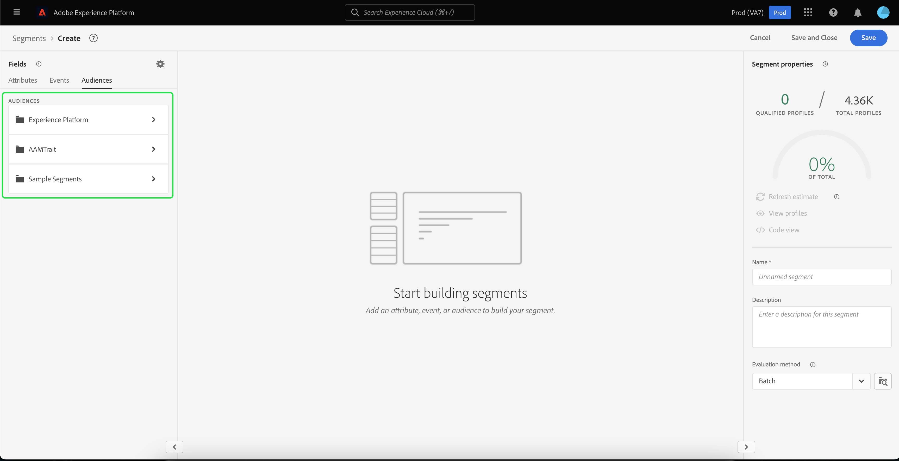

# 外部オーディエンスの読み込みと使用

Adobe Experience Platformは、外部オーディエンスのインポート機能をサポートしています。この機能は、後で新しいセグメント定義のコンポーネントとして使用できます。 このドキュメントでは、外部オーディエンスを読み込んで使用するExperience Platformを設定するためのチュートリアルを提供します。

## はじめに

- [ セグメント化サービス](../home.md)：リアルタイム顧客プロファイルデータからオーディエンスセグメントを作成できます。
- [リアルタイム顧客プロファイル](../../profile/home.md)：複数のソースから集約されたデータに基づいて、統合されたリアルタイムのコンシューマープロファイルを提供します。
- [エクスペリエンスデータモデル（XDM）](../../xdm/home.md)：Platform が顧客エクスペリエンスデータを整理する際に使用する標準化されたフレームワーク。
- [データセット](../../catalog/datasets/overview.md)：Experience Platform のデータ永続化のためのストレージと管理の構成。
- [ストリーミング取得](../../ingestion/streaming-ingestion/overview.md)：Experience Platform がクライアントサイドおよびサーバーサイドのデバイスからデータをリアルタイムで取得し、保存する方法。

## 外部オーディエンスのID名前空間の作成

外部オーディエンスを使用する最初の手順は、ID名前空間を作成することです。 ID名前空間を使用すると、プラットフォームは、セグメントの送信元を関連付けることができます。

ID名前空間を作成するには、『[ID名前空間ガイド](../../identity-service/namespaces.md#manage-namespaces)』の手順に従ってください。 ID名前空間を作成する際に、ソースの詳細をID名前空間に追加し、[!UICONTROL タイプ]を&#x200B;**[!UICONTROL 非人物識別子]**&#x200B;としてマークします。

## セグメントメタデータのスキーマの作成

ID名前空間を作成したら、作成するセグメント用に新しいスキーマを作成する必要があります。

スキーマの構成を開始するには、まず左のナビゲーションバーで「**[!UICONTROL スキーマ]**」を選択し、次にスキーマワークスペースの右上隅にある「**[!UICONTROL スキーマを作成]**」を選択します。 ここから、「**[!UICONTROL 参照]**」を選択して、使用可能なスキーマタイプの完全な選択を表示します。

セグメント定義（事前定義済みのクラス）を作成するので、「**[!UICONTROL 既存のクラス]**&#x200B;を使用」を選択します。 次に、**[!UICONTROL セグメント定義]**&#x200B;クラスを選択し、**[!UICONTROL クラス]**&#x200B;を割り当てます。

スキーマが作成されたら、セグメントIDを含めるフィールドを指定する必要があります。 このフィールドはプライマリIDとしてマークされ、以前に作成した名前空間に割り当てられる必要があります。

`_id`フィールドを主IDとしてマークした後、スキーマのタイトルを選択し、**[!UICONTROL プロファイル]**&#x200B;というトグルを選択します。 「**[!UICONTROL 有効]**」を選択して[!DNL Real-time Customer Profile]のスキーマを有効にします。

このスキーマは、作成した個人以外のID名前空間に割り当てられたプライマリIDを使用して、プロファイルに対して有効になります。 その結果、このスキーマを使用してプラットフォームに読み込んだセグメントメタデータは、他の人に関連するプロファイルデータと統合されることなく、プロファイルに取り込まれます。

## スキーマのデータセットの作成

スキーマの設定後、セグメントメタデータのデータセットを作成する必要があります。

データセットを作成するには、『データセットユーザーガイド](../../catalog/datasets/user-guide.md#create)』の手順に従ってください。 [以前に作成したスキーマを使用して、**[!UICONTROL 「スキーマからデータセットを作成」]**&#x200B;オプションに従います。

データセットの作成後、引き続き[データセットユーザーガイド](../../catalog/datasets/user-guide.md#enable-profile)の手順に従って、このデータセットをリアルタイム顧客プロファイルに対して有効にします。

## オーディエンスデータの設定と読み込み

データセットを有効にすると、UI経由またはExperience PlatformAPIを使用して、プラットフォームにデータを送信できるようになります。 このデータをプラットフォームに取り込むには、ストリーミング接続を作成する必要があります。

ストリーミング接続を作成するには、[APIチュートリアル](../../sources/tutorials/api/create/streaming/http.md)または[UIチュートリアル](../../sources/tutorials/ui/create/streaming/http.md)の手順に従います。

ストリーミング接続を作成すると、固有のストリーミングエンドポイントにアクセスでき、そのエンドポイントにデータを送信できます。 これらのエンドポイントにデータを送信する方法を学ぶには、[ストリーミングレコードデータのチュートリアル](../../ingestion/tutorials/streaming-record-data.md#ingest-data)をお読みください。

## 読み込んだオーディエンスを使用したセグメントの作成

読み込んだオーディエンスを設定したら、それらをセグメント化プロセスの一部として使用できます。 外部オーディエンスを検索するには、セグメントビルダーに移動し、**[!UICONTROL フィールド]**&#x200B;セクションの&#x200B;**[!UICONTROL オーディエンス]**&#x200B;タブを選択します。

## 次の手順

セグメントで外部オーディエンスを使用できるようになったので、セグメントビルダーを使用してセグメントを作成できます。 セグメントの作成方法を学ぶには、[セグメントの作成に関するチュートリアル](./create-a-segment.md)をお読みください。