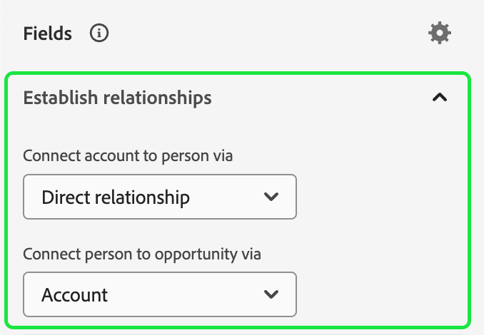

# アカウントオーディエンス

>[!AVAILABILITY]
>
>アカウントオーディエンスは、Real-Time Customer Data Platformの [B2B edition](../../rtcdp/overview.md#rtcdp-b2b) およびReal-Time Customer Data Platformの [B2P Edition](../../rtcdp/overview.md#rtcdp-b2p) でのみ使用できます。

アカウントのセグメント化で、Adobe Experience Platformを使用すると、ユーザーベースのオーディエンスからアカウントベースのオーディエンスまで、マーケティングセグメント化エクスペリエンスの完全な使いやすさと洗練さを実現できます。

アカウントオーディエンスは、アカウントベースの宛先の入力として使用できます。これにより、ダウンストリームのサービスでこれらのアカウント内のユーザーをターゲットにすることができます。 例えば、アカウントベースのオーディエンスを使用して、最高執行責任者（COO）または最高マーケティング責任者（CMO **という肩書を持つ人物の連絡先情報を持たない** 持たない）すべてのアカウントの記録を取得できます。

## 用語 {#terminology}

アカウントオーディエンスを使用する前に、様々なオーディエンスタイプの違いを確認してください。

- **アカウントオーディエンス**：アカウントオーディエンスは、**アカウント** プロファイルデータを使用して作成されたオーディエンスです。 アカウントプロファイルデータを使用すると、ダウンストリームアカウント内のユーザーをターゲットにしたオーディエンスを作成できます。 アカウントプロファイルについて詳しくは、[ アカウントプロファイルの概要 ](../../rtcdp/accounts/account-profile-overview.md) を参照してください。
- **人物オーディエンス**：人物オーディエンスは、**顧客** プロファイルデータを使用して作成されたオーディエンスです。 顧客プロファイルデータを使用すると、ビジネスの顧客をターゲットにしたオーディエンスを作成できます。 顧客プロファイルについて詳しくは、[ リアルタイム顧客プロファイルの概要 ](../../profile/home.md) を参照してください。
- **見込み客オーディエンス**：見込み客オーディエンスは、**見込み客** プロファイルデータを使用して作成されたオーディエンスです。 見込み客プロファイルデータを使用すると、認証されていないユーザーからオーディエンスを作成できます。 見込み客プロファイルについて詳しくは、[ 見込み客プロファイルの概要 ](../../profile/ui/prospect-profile.md) を参照してください。

## アクセス {#access}

アカウントオーディエンスにアクセスするには、「**[!UICONTROL アカウント]** セクションの **[!UICONTROL オーディエンス]** を選択します。

[!UICONTROL  参照 ] ページが表示され、組織のすべてのアカウントオーディエンスのリストが表示されます。

この表示には、名前、プロファイル数、接触チャネル、ライフサイクルステータス、作成日、最終更新日など、オーディエンスに関する情報がリストされます。

また、検索機能とフィルター機能を使用して、特定のアカウントオーディエンスをすばやく検索および並べ替えることもできます。 この機能について詳しくは、[ オーディエンスポータルの概要 ](../ui/audience-portal.md#manage-audiences) を参照してください。

## オーディエンスを作成 {#create}

>[!NOTE]
>
>アカウントオーディエンスは、**バッチ** セグメント化を使用して評価され、24 時間ごとに評価されます。

アカウントオーディエンスを作成するには、**[!UICONTROL 参照]** ページで [!UICONTROL  オーディエンスを作成 ] を選択します。

![ アカウントオーディエンスの参照ページで「[!UICONTROL  オーディエンスを作成 ]」ボタンがハイライト表示されます。](../images/types/account/select-create-audience.png)

セグメントビルダーが表示されます。アカウント属性とオーディエンスが左側のナビゲーションバーに表示されます。 「[!UICONTROL  属性 ]」タブでは、Platform で作成した属性とカスタム属性の両方を追加できます。

アカウントオーディエンスを作成する場合、これらの属性は人物に関連付けられているので、イベントは独自のタブではなく **[!UICONTROL 人物]** の下に表示されることに注意してください。

![ イベントを検索する場所は、[!UICONTROL People] フォルダー内でハイライト表示されます。](../images/types/account/attributes.png)

「[!UICONTROL  オーディエンス ]」タブでは、以前に作成したユーザーベースのオーディエンスを追加して、独自のアカウントオーディエンスの作成時に構築できます。

セグメントビルダーの使用について詳しくは、[セグメントビルダー UI ガイド](../ui/segment-builder.md)を参照してください。

### 関係の確立 {#relationships}

アカウントオーディエンスの場合、デフォルトでは、セグメントビルダー UI にアカウントとユーザーの間の直接の関係が表示されます。 ただし、アカウントオーディエンスには、他の関係タイプも使用できます。

別の関係タイプを使用するには、 を選択します。

「[!UICONTROL  設定 ]」タブの「**[!UICONTROL フィールドの関係]** セクションで「**[!UICONTROL 関係セレクターを表示]**」を選択します。

 を再度選択して、「[!UICONTROL  フィールド ] タブに戻ります。 これで、「**[!UICONTROL 関係の確立]**」セクションが表示されます。このセクションでは、アカウントがユーザーに接続される方法と、ユーザーがオポチュニティに接続される方法を確立できます。

アカウントを人物に接続する際は、次のいずれかのオプションを選択できます。

| オプション | 説明 |
| ------ | ----------- |
| 直接的な関係 | アカウントと人物の間の直接接続。 これは、人物スキーマの `personComponents` 配列に含まれる `accountID` 値の配列を介して、各ユーザーがリンクされているアカウントを指定します。 このパスは、最も頻繁に使用されます。 |
| アカウントと人物の関係 | アカウントとユーザーの関係。`accountPersonRelation` オブジェクトで定義されます。 また、このパスを使用すると、各ユーザーを複数のアカウントに接続することもできます。 組織がソースデータから明示的な関係テーブルを定義した場合に使用されます。 |
| 商談と担当者の関係 | オポチュニティと人物の関係。`opportunityPersonRelation` オブジェクトで定義されます。 これにより、opportunity-person から opportunity に移動してアカウントに接続されます。 これにより、その人物がどの会社の商談に関連付けられているかを説明できます。 |

機会を人物に接続する際は、次のオプションから選択できます。

| オプション | 説明 |
| ------ | ----------- |
| アカウント | アカウントとオポチュニティの間の直接接続。 アカウントオーディエンスでこれを使用する場合、このパスによって会社のすべてのユーザーが機会に接続されます。 |
| 商談と担当者の関係 | 機会と人物の関係。機会 – 人物オブジェクトに基づいています。 このパスは、機会に関与したと特定されたユーザーのみをその機会につなげます。 |

目的の関係を確立したら、必要な人物オーディエンスをセグメント定義に追加できます。

## オーディエンスをアクティベート {#activate}

>[!NOTE]
>
>アカウントオーディエンスをサポートする宛先は、限られています。 このプロセスを続行する前に、アカウントオーディエンスをサポートするアクティブ化する宛先を確認してください。

アカウントオーディエンスを作成したら、そのオーディエンスを他のダウンストリームサービスに対してアクティブ化できます。

アクティベートするオーディエンスを選択し、続けて **[!UICONTROL 宛先に対してアクティベート]** を選択します。

![ 選択したオーディエンスのクイックアクションメニューで「[!UICONTROL  宛先に対してアクティブ化 ]」ボタンがハイライト表示されます。](../images/types/account/activate.png)

[!UICONTROL  宛先のアクティブ化 ] ページが表示されます。 サポートされる宛先やフィールドマッピングなど、アクティベーションプロセスについて詳しくは、[ アカウントオーディエンスのアクティブ化 ](/help/destinations/ui/activate-account-audiences.md) チュートリアルをお読みください。

## 次の手順 {#next-steps}

このガイドを読むことで、Adobe Experience Platformでアカウントオーディエンスを作成および使用する方法について、理解が深まりました。 Platform で他のタイプのオーディエンスを使用する方法については、[ オーディエンスタイプの概要 ](./overview.md) を参照してください。

## 付録 {#appendix}

次の節では、アカウントオーディエンスに関する追加情報を示します。

### アカウントセグメント化の検証 {#validation}

>[!CONTEXTUALHELP]
>id="platform_audiences_account_constraint_eventLookbackWindow"
>title="最大ルックバックウィンドウエラー"
>abstract="エクスペリエンスイベントの最大ルックバックウィンドウは 30 日間です。"

>[!CONTEXTUALHELP]
>id="platform_audiences_account_constraint_combinationMaxDepth"
>title="ネストされたコンテナの最大深度エラー"
>abstract="ネストされたコンテナの最大深度は **5** です。つまり、オーディエンスを作成する際に、ネストされたコンテナの数を 6 以上にすることは&#x200B;**できません**。"

>[!CONTEXTUALHELP]
>id="platform_audiences_account_constraint_combinationMaxBreadth"
>title="ルールの最大数エラー"
>abstract="1 つのコンテナ内のルールの最大数は **5** です。つまり、オーディエンスを作成する際に、1 つのコンテナ内のルールを 6 個以上にすることは&#x200B;**できません**。"

>[!CONTEXTUALHELP]
>id="platform_audiences_account_constraint_crossEntityMaxDepth"
>title="クロスエンティティの最大数エラー"
>abstract="1 つのオーディエンス内で使用できるクロスエンティティの最大数は **5** です。クロスエンティティとは、オーディエンス内で異なるエンティティ間を切り替えることです。例えば、アカウントからユーザーに、さらにマーケティングリストに移行するといったことです。"

>[!CONTEXTUALHELP]
>id="platform_audiences_account_constraint_allowCustomEntity"
>title="カスタムエンティティエラー"
>abstract="カスタムエンティティは使用でき&#x200B;**ません**。"

>[!CONTEXTUALHELP]
>id="platform_audiences_account_constraint_b2bBuiltInEntities"
>title="無効な B2B エンティティエラー"
>abstract="`_xdm.context.account`、`_xdm.content.opportunity`、`_xdm.context.profile`、`_xdm.context.experienceevent`、`_xdm.context.account-person`、`_xdm.classes.opportunity-person`、`_xdm.classes.marketing-list-member`、`_xdm.classes.marketing-list`、`_xdm.context.campaign-member`、`_xdm.classes.campaign` の B2B エンティティのみを使用できます。"

>[!CONTEXTUALHELP]
>id="platform_audiences_account_constraint_rhsMaxOptions"
>title="値の最大数エラー"
>abstract="1 つのフィールドに対して確認できる値の最大数は **50** です。"

>[!CONTEXTUALHELP]
>id="platform_audiences_account_constraint_allowInSegmentByReference"
>title="inSegment イベントエラー"
>abstract="inSegment イベントは使用でき&#x200B;**ません**。"

>[!CONTEXTUALHELP]
>id="platform_audiences_account_constraint_allowInSegmentByValue"
>title="inSegment イベントエラー"
>abstract="inSegment イベントは使用でき&#x200B;**ません**。"

>[!CONTEXTUALHELP]
>id="platform_audiences_account_constraint_allowSequentialEvents"
>title="順次イベントエラー"
>abstract="順次イベントは使用でき&#x200B;**ません**。"

>[!CONTEXTUALHELP]
>id="platform_audiences_account_constraint_allowMaps"
>title="マップタイププロパティエラー"
>abstract="マップタイププロパティは使用でき&#x200B;**ません**。"

>[!CONTEXTUALHELP]
>id="platform_audiences_account_constraint_maxNestedAggregationDepth"
>title="ネストされたエンティティの最大深度エラー"
>abstract="ネストされた配列の最大深度は **5** です。"

>[!CONTEXTUALHELP]
>id="platform_audiences_account_constraint_maxObjectNestingLevel"
>title="ネストされたオブジェクトの最大数エラー"
>abstract="許可されるネストされたオブジェクトの最大数は、**10** です。"

>[!CONTEXTUALHELP]
>id="platform_audiences_account_constraint_generic"
>title="制約違反"
>abstract="オーディエンスが制約に違反しています。詳しくは、リンク先のドキュメントを参照してください。"

アカウントオーディエンスを使用する場合、オーディエンス **必須** は次の制約に従います。

- エクスペリエンスイベントの最大ルックバックウィンドウは **30 日** です。
- ネストされたコンテナの最大深度は **5** です。
   - つまり、オーディエンスを作成する際に、ネストされたコンテナの数を 6 以上にすることは&#x200B;**できません**。
- 1 つのコンテナ内のルールの最大数は **5** です。
   - つまり、オーディエンスには、オーディエンスを構成する 5 つ以上のルールが含まれています **できません**。
- 使用できるクロスエンティティの最大数は **5** です。
   - クロスエンティティとは、オーディエンス内で異なるエンティティ間を切り替えることです。例えば、アカウントからユーザーに、さらにマーケティングリストに移行するといったことです。
- カスタムエンティティ **使用できません** を使用します。
- 1 つのフィールドに対して確認できる値の最大数は **50** です。
   - 例えば、「市区町村名」のフィールドがある場合、50 個の市区町村名とその値を照合できます。
- アカウントオーディエンス **使用でき** せん `inSegment` イベント。
- アカウントオーディエンス **連続したイベントは使用できません**。
- アカウントオーディエンス **使用** マップは使用できません。
- ネストされた配列の最大深度は **5** です。
- ネストされたオブジェクトの最大数は **10** です。
