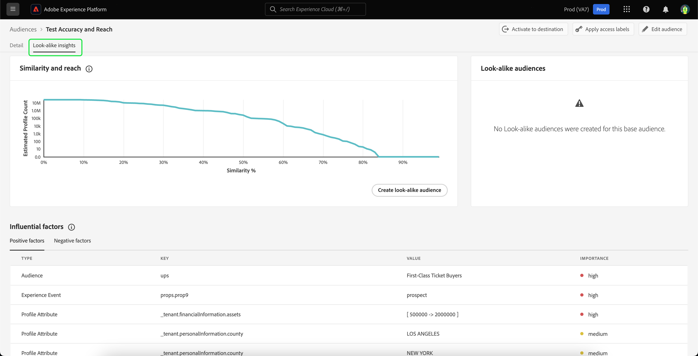

# 類似オーディエンスガイド

>[!IMPORTANT]
>
>類似インサイトと類似オーディエンスは、**B2C edition** でのみ使用できます。

Adobe Experience Platformでは、類似オーディエンスは、各オーディエンスに関するインテリジェントなインサイトを提供し、機械学習ベースのインサイトを活用して、マーケティングキャンペーンで価値の高い顧客を特定してターゲットにします。

類似オーディエンスを使用すると、パフォーマンスの高いオーディエンスに類似した顧客をターゲットにしたり、以前にコンバージョンされたオーディエンスに類似した顧客をターゲットにしたりして、拡張オーディエンスを作成できます。

## 用語 {#terminology}

類似オーディエンスを使用する前に、必ず次の概念を理解してください。

- **ベースオーディエンス**：ベースオーディエンスとは、より多くのインサイトを得たいオーディエンスです。 これは、類似モデルの **ベース** のオーディエンスです。
- **類似モデル**：類似モデルは、顧客入力なしで、すべての適格なベースオーディエンスに対してトレーニングされる機械学習モデルです。 各類似モデルは、影響を及ぼす要因と類似性グラフを作成します。 類似モデルはスコアリングされ **いません**。
- **類似オーディエンス**：類似オーディエンスとは、選択した類似性のしきい値を持つ類似モデルがベースオーディエンスに適用された場合に作成されるオーディエンスです。 同じ類似モデルを使用して複数の類似オーディエンスを作成できます。 類似オーディエンスが得点されます。
- **合計アドレス可能なオーディエンスサイズ**：合計アドレス可能なオーディエンスサイズは、過去 30 日間のプロファイルの合計数から、過去 30 日間のベースオーディエンス母集団を引いた数です。 例えば、顧客が過去 30 日間に 1,000 万のプロファイルを持っており、ベースオーディエンスが過去 30 日間に 100 万のプロファイルを持っている場合、アドレス可能なオーディエンスサイズの合計は 900 万プロファイルです。

## 実施要件 {#eligibility}

類似インサイトを使用するには、ベースオーディエンスが次の実施要件 **満たしている必要があります**。

- ベースオーディエンス **必須** は、Platform 内で作成する必要があります。
   - 外部で生成されたオーディエンスは、類似インサイトの対象 **対象外** となります。
- ベースオーディエンス **必須** はデフォルトの結合ポリシー上にあります。
- ベースオーディエンス **必須** は、データガバナンスによって制限されたフィールドを使用しません。

## 類似モデルの詳細 {#details}

>[!CONTEXTUALHELP]
>id="platform_audiences_lookAlike_notEligible"
>title="不適格"
>abstract="このオーディエンスは、現在、トレーニングに必要な最小数のプロファイル数を下回っているか、またはプロファイルの書き出しがまだトリガーされていないので、類似インサイトに不適格です。"

>[!CONTEXTUALHELP]
>id="platform_audiences_lookAlike_processing"
>title="処理中"
>abstract="このオーディエンスは現在処理中です。モデルの処理が完了するまでに最大 24 時間かかる場合があります。後でもう一度確認してください。"

>[!CONTEXTUALHELP]
>id="platform_audiences_lookAlike_error"
>title="エラー"
>abstract="このモデルの処理中にエラーが発生しました。このモデルを削除して再作成するか、後でもう一度試してください。"

Adobe Experience Platformでは、類似モデルは 3 つの異なるタイプのデータポイントを使用します。

- 過去 30 日間のオーディエンスメンバーシップ
- リアルタイム顧客プロファイルに取り込まれた過去 30 日間のエクスペリエンスイベント
- リアルタイム顧客プロファイルに取り込まれた、過去 30 日間のプロファイル属性

これらのデータポイントはすべてキーと値のペアになり、類似モデルに入力されます。 プロファイルが非常に多い割合で一致するキーと値のペアのみが保持されます。

この時点で、類似モデルは 24 時間ごとに実行され、ベースオーディエンスに影響を与える要因と類似性グラフが作成、再作成されます。 類似オーディエンスのスコアリングも頻繁に実行されます。

## 使用権限 {#entitlements}

類似オーディエンスの使用には、次の使用権限が適用されます。

- Real-Time CDP Primeのお客様には、実稼動サンドボックスで **5** のアクティブな類似オーディエンスを使用する権利があります
- Real-Time CDP Ultimateのお客様には、実稼動サンドボックスのアクティブな類似オーディエンス **20** を使用する権利があります
- 開発用サンドボックスは、すべてのReal-Time CDPのお客様に対して **5** 類似オーディエンスに制限されています

後日利用可能になるアドオンパックでは、実稼動用サンドボックスの使用権限を、パックあたり 20 類似オーディエンス増やします。

類似オーディエンスにアクセスできるかどうかを確認するには、Adobe担当者にお問い合わせください。

## 類似インサイトの表示 {#view}

オーディエンスの詳細ページに類似インサイトが組み込まれています。 オーディエンスの類似インサイトを確認するには、左側のナビゲーションバーで **[!UICONTROL オーディエンス]** を選択し、次に **[!UICONTROL 参照]**、さらにインサイトを表示するオーディエンスを選択します。

オーディエンスの詳細ページが表示されます。「**[!UICONTROL 類似インサイト]**」タブを選択して、オーディエンスの類似インサイトを表示します。 **[!UICONTROL 類似インサイト]** ページが表示されます。 このページには、類似性とリーチグラフ、類似オーディエンス、影響要因の 3 つの主な要素があります。

### 類似性とリーチ {#similarity-and-reach}

>[!CONTEXTUALHELP]
>id="platform_audiences_lookAlike_similarityAndReach"
>title="類似性とリーチ"
>abstract="類似性およびリーチグラフでは、特定の類似性スコアを上回るプロファイルから構成される、類似オーディエンスの予想リーチを図にします。グラフ内の特定のポイントにポインターを合わせると、現在ハイライト表示されているポイントの類似率および予想プロファイル数が表示されます。"

「類似性とリーチ」セクションには、特定の類似性スコア以上のプロファイルで構成される類似オーディエンスの予想リーチをグラフ化したグラフが表示されます。 類似性スコアは、ベースオーディエンスのプロファイルと類似インサイトのプロファイルの間の類似性の **距離** を表します。

このグラフでは、X 軸は、選択したオーディエンスのプロファイルとメンバーの類似性の割合を測定します。 類似性スコアの範囲は 0 ～ 100% です。類似性スコアが高いほど、プロファイルが、選択したオーディエンスのメンバーに影響を与える要因の値が近いことを示します。

y 軸は、x 軸の一致する値に対応する類似性の割合を持つプロファイルの予想カウントを示します。 この予想されるプロファイル数は、0～アドレス可能なオーディエンスサイズの合計、または 2,500 万プロファイルのいずれか低い方の範囲です。 グラフの読みやすさを向上させるために、この軸を **対数スケール** で測定します。

グラフは右から左に **累積** されていることに注意してください。 つまり、グラフ内の任意の時点で、y 軸の値は、類似性のしきい値が **上** の類似性を持つプロファイルの数になります。 例えば、x 軸が 60% で、y 軸が 1,000 万の場合、ベースオーディエンスとの類似度が 60% 以上のプロファイルが 1,000 万個あることを意味します。

グラフ内の特定のポイントにポインターを合わせると、現在ハイライト表示されているポイントの類似率および予想プロファイル数が表示されます。

### 類似オーディエンス {#list}

「類似オーディエンス」セクションには、選択したベースオーディエンスに対して以前に作成したすべての類似オーディエンスのリストが表示されます。

### 影響を与える要因 {#influential-factors}

>[!CONTEXTUALHELP]
>id="platform_audiences_lookAlike_influentialFactors"
>title="影響を与える要因"
>abstract="影響を与える要因は、属性、イベントおよびオーディエンスのメンバーシップで、基本オーディエンスのメンバーに対するプロファイルの類似性を説明する際に重要です。 データ使用ラベルとポリシーを使用すると、類似モデルで特定のデータが影響を与える要因と見なされるのを除外できます。"
>additional-url="https://experienceleague.adobe.com/docs/experience-platform/segmentation/types/lookalike-audiences.html#exclude" text="データを除外"

「影響要因」セクションには、選択したベースオーディエンスの類似モデルに影響を与える上位 100 個の要因が表示されます。 これらの影響を与える要因は、プロファイル属性、エクスペリエンスイベントおよびオーディエンスメンバーシップで、ベースオーディエンスの類似点を説明する際に最も重要です。 上位の影響力のある要因を理解することで、このオーディエンスと、そこから作成した類似オーディエンスのマーケティングコンテンツをより適切にパーソナライズできます。 類似モデルに影響を与えるすべての要因が表示されるわけではないことに注意してください。

数値である影響力のある要因の場合、キーの値のペアは、キーが持つ様々な値の数に応じて、グループにまとめることができます。 例えば、`income` のキーがある場合、多くの一意の値が存在する可能性が高くなります。 その結果、キーと値のペアは `income=[0 -> 30000]`、`income=[30000 -> 50000]`、`income=[50000 -> 100000]` のようなバケットに配置されます。

これらのバケットは定期的に再計算され、データが最新の状態に保たれます。

>[!NOTE]
>
>影響要因は、重要度の高い順に並べ替えられ、互いに独立しています。

| フィールド | 説明 |
| ----- | ----------- |
| タイプ | 影響要因が派生するデータのタイプ。 これは、プロファイル属性、エクスペリエンスイベントまたはオーディエンスメンバーシップのいずれかです。 |
| キー | データフィールドの名前。 オーディエンスメンバーシップタイプのキーの場合、この値は、データの取得元であるオーディエンスの **名前空間** を表します。 使用可能な値は `ups` （Segmentation Service）および `AO` （Audience Orchestration）です。 その他のタイプのキーの場合、この値は XDM フィールドパスを表します。 例えば、会社 Luma に「income」というカスタムフィールドがある場合、キーは `_luma.income` になります |
| 値 | 値は、その値が表す影響要因によって異なります。 プロファイル属性またはエクスペリエンスイベントの場合、このフィールドは、ベースオーディエンスのメンバーとの類似性を示すデータフィールドの値または値の範囲を表します。 値の範囲は `[A -> B]` という形式で記述されます。`A` は下限を、`B` は上限を表します。 オーディエンスメンバーシップの場合、このフィールドはオーディエンスの名前です。 |
| 重要度 | 影響要因の相対的な重要度。 高、中、低のいずれかです。 |

## 類似オーディエンスを作成 {#create}

>[!IMPORTANT]
>
>類似オーディエンスを **別の類似オーディエンスのベースオーディエンスとして使用することは** できません。 つまり、チェーンされた類似オーディエンスを作成 **できません**。

類似オーディエンスを作成するには、類似オーディエンスのベースにするオーディエンスを選択する必要があります。 使用可能なオーディエンスのリストにアクセスするには、左側のナビゲーションバーで **[!UICONTROL オーディエンス]** を選択し、次に **[!UICONTROL 参照]** を選択します。 オーディエンスのリストが表示されます。 このページでは、ベースオーディエンスとして使用するオーディエンスを選択できます。

オーディエンスの詳細ページで、「**[!UICONTROL 類似オーディエンスを作成]**」を選択して、類似オーディエンスの作成プロセスを開始します。

![ 「[!UICONTROL  類似オーディエンスを作成 ] ボタンがハイライト表示されます。](../images/types/lookalike/create-look-alike-audience.png)

**[!UICONTROL 類似オーディエンスを作成]** ポップオーバーが表示されます。 このページでは、類似オーディエンスの類似性の割合を設定できます。

![[!UICONTROL  類似オーディエンスを作成 ] ポップオーバーが表示されます。](../images/types/lookalike/create-audience.png)

この類似性の割合は、次の 3 つの方法で設定できます。

- スライダーを移動して類似性の割合を設定します
- スライダーの横にある数値入力ボックスに、類似度のパーセンテージを入力します
- グラフの上にマウスポインターを置いて、目的の場所を選択し、類似性の割合を設定します

また、名前や説明など、類似オーディエンスに関する詳細を更新することもできます。 デフォルトでは、ベースオーディエンス名と以前に指定した類似性の割合に基づいて、類似オーディエンスの名前が生成されます。

![ 基本情報は、「[!UICONTROL  類似オーディエンスを作成 ] ポップオーバー内でハイライト表示されます。](../images/types/lookalike/basic-info.png)

**[!UICONTROL 作成]** を選択して、類似オーディエンスの作成を完了します。

![[!UICONTROL  類似オーディエンスを作成 ] ポップオーバー内で「作成」ボタンがハイライト表示されます。](../images/types/lookalike/create-audience.png)

新しく作成された類似オーディエンスは、オーディエンスの詳細ページの **[!UICONTROL 類似オーディエンス]** セクションでアクセスできるほか、オーディエンスポータルやその他のダウンストリームの用途でも使用できます。 類似オーディエンスがスコアリングされるまでには時間がかかることに注意してください。 スコアリングが行われるまで、プロファイル数は 0 と表示されます。

## 類似オーディエンスの詳細を表示 {#view-details}

類似オーディエンスの詳細を表示するには、ベースオーディエンスの **[!UICONTROL 類似オーディエンス]** セクションで類似オーディエンスを選択します。

オーディエンスの詳細ページが表示されます。このページについて詳しくは、[ オーディエンスポータルの概要のオーディエンスの詳細 ](../ui/audience-portal.md#audience-details) を参照してください。

## 類似モデリングからデータフィールドを除外 {#exclude}

>[!IMPORTANT]
>
> **お客様** は、機密データを含むデータに適切なラベルを付け、データ使用ポリシーが定義され、お客様が運用する法的および規制上の義務に準拠できるようにする責任を負います。 また、通常、機密データ型や保護データ型に関連付けられたデータフィールドと直接相関しない **** データフィールドやセグメントメンバーシップは、潜在的なバイアスの原因となる可能性があることにも注意する必要があります。 **お客様は** データを分析し、適切なデータ使用ポリシーを識別、ラベル付けおよびデータに適用する責任を負います。これには、機密または保護されたデータタイプをプロキシする可能性があり、モデリングから除外する必要があるデータフィールドが含まれます。

類似オーディエンスは、関連するデータ使用ラベルとポリシーを適用することで、「データサイエンス」マーケティングアクション用に制限されたデータフィールドを除外するように設定できます。 データサイエンスへの使用が制限されているとラベル付けされたデータは、類似オーディエンスモデルのトレーニング時およびトレーニング済みモデルから類似オーディエンスを生成する際に、考慮から削除されます。 

>[!NOTE]
>
>ベースオーディエンスのデータ使用ラベルに対する変更が有効になるまでに最大 48 時間かかる場合があります。

標準の「C9」ラベルは、データサイエンスに使用すべきでないデータにラベルを付けるのに使用できます。このラベルを適用するには、標準の「データサイエンスを制限」ポリシーを有効にします。 また、追加のポリシーを作成して、機密ラベルを含む他のラベルを含むデータを、データサイエンスの使用から制限することもできます。 データ使用ポリシーの管理について詳しくは、[ データ使用ポリシー UI ガイド ](../../data-governance/policies/user-guide.md) を参照してください。 データ使用ラベルの管理について詳しくは、[ データ使用ラベル UI ガイド ](../../data-governance/labels/user-guide.md) を参照してください。

デフォルトでは、ベースオーディエンスに契約ラベルがない場合、類似オーディエンスのモデリングプロセスは、組織で有効になっているプライバシーポリシーに基づいて、**任意** フィールド、データセットまたはオーディエンスを除外します。

## 次の手順

このガイドを読むことで、類似インサイトを表示する方法と、これらのインサイトに基づいて類似オーディエンスを作成する方法を学びました。 Adobe Experience Platform UI のオーディエンスについて詳しくは、[ セグメント化サービス UI ガイド ](./overview.md) を参照してください。
