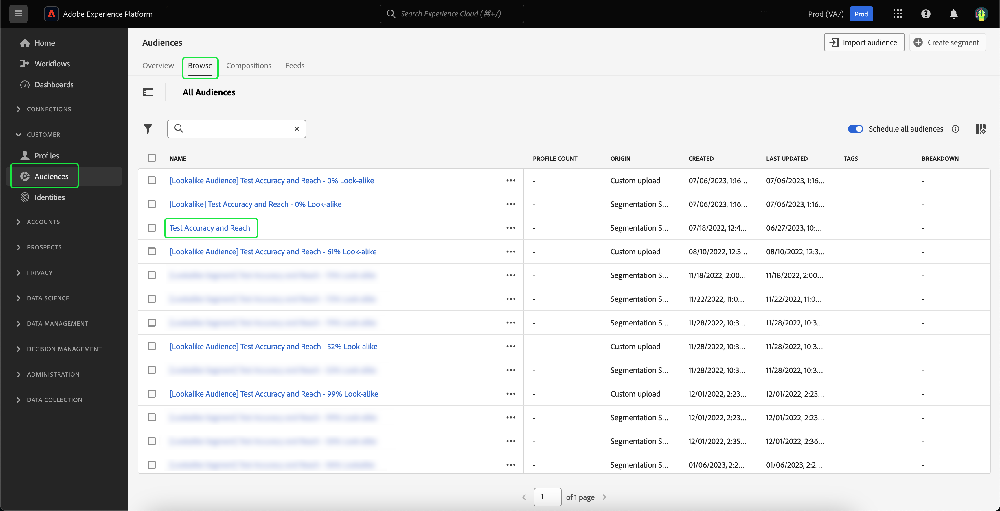
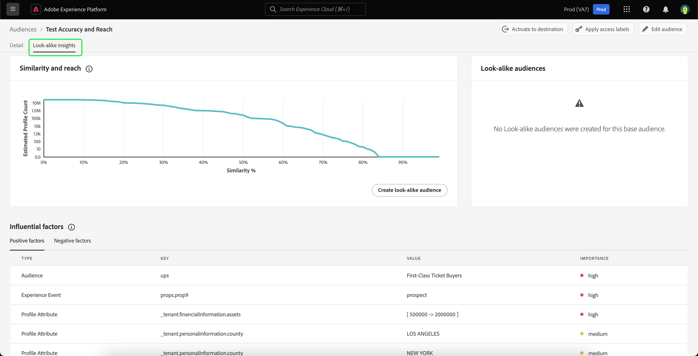
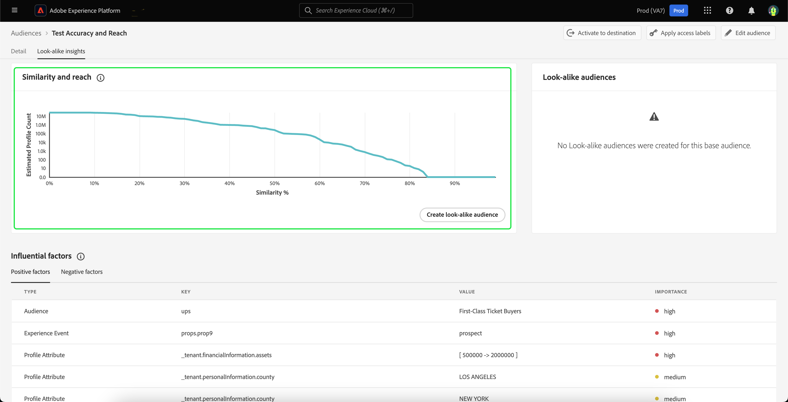
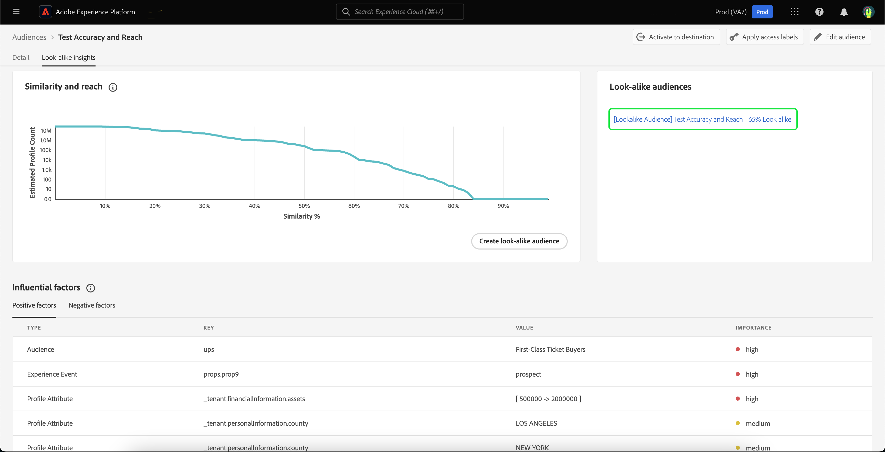
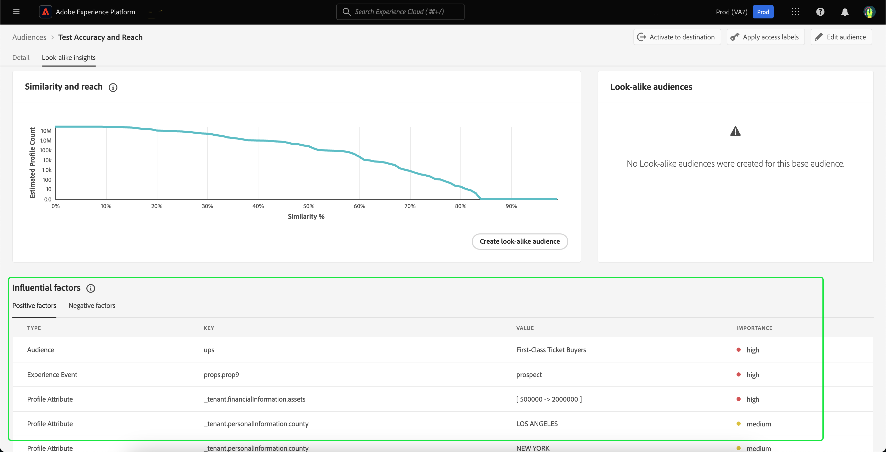
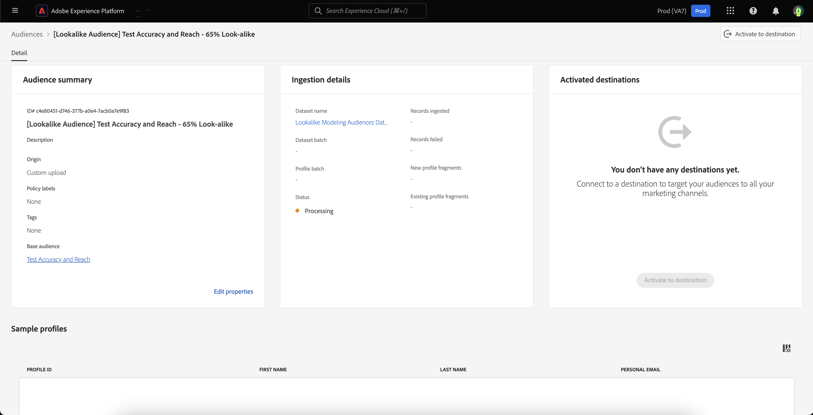

# 類似オーディエンスガイド

>[!IMPORTANT]
>
>使用率の低い環境では、類似インサイトと類似オーディエンスは自動的に無効になります。 「利用頻度の低さ」とは、過去3 ヶ月間に類似インサイトを閲覧しなかったか、過去6 ヶ月間に新しい類似オーディエンスを作成しなかったことと定義されます。
>
>お客様の環境で類似インサイトが無効になっている場合は、Adobe カスタマーケアチームに電子メールを送信して、お客様の組織IDとメッセージ内の環境の詳細を含むアクセスをリクエストできます。
>
>Adobe カスタマーケアから確認を受け取ると、環境内のすべてのサンドボックスで類似インサイトとオーディエンスが有効になります。

Adobe Experience Platformでは、類似オーディエンス機能を利用して、個々のオーディエンスに関するインテリジェントなインサイトを獲得できます。マシンラーニングベースのインサイトを活用して、マーケティングキャンペーンで価値の高い顧客を特定し、ターゲティングします。

類似オーディエンス機能を使用すれば、パフォーマンスの高いオーディエンスに類似した顧客をターゲットにする拡張オーディエンスや、以前にコンバージョンしたオーディエンスに類似した顧客をターゲットにする拡張オーディエンスを作成できます。

## 用語 {#terminology}

類似オーディエンスの使用を開始する前に、次の概念を必ず理解してください。

- **基本オーディエンス**：基本オーディエンスとは、詳細なインサイトを得るために必要なオーディエンスのことです。 これは、類似モデルが&#x200B;**ベース**&#x200B;のオーディエンスです。
- **類似モデル**：類似モデルは、顧客の入力がなくても、すべての適格な基本オーディエンスでトレーニングされる機械学習モデルです。 各類似モデルは、影響要因と類似度グラフを作成します。 類似モデルでは、**not**&#x200B;がスコアリングされます。
- **類似オーディエンス**：類似オーディエンスとは、選択した類似度のしきい値を持つ類似モデルが基本オーディエンスに適用されたときに作成されるオーディエンスです。 同じ類似モデルを使用して、複数の類似オーディエンスを作成できます。 類似オーディエンスはスコアリングされます。
- **合計アドレス可能なオーディエンスサイズ**：合計アドレス可能なオーディエンスサイズは、過去30日間のプロファイルの合計数から過去30日間の基本オーディエンス母集団を差し引いた数です。 例えば、顧客が過去30日間に1,000万件のプロファイルを持ち、基本オーディエンスが過去30日間に100万件のプロファイルを持つ場合、合計オーディエンスサイズは900万件になります。

## 実施要件 {#eligibility}

類似インサイトを使用するには、基本オーディエンス **は次の適格条件を満たす必要があります。**

- 基本オーディエンス **は** Experience Platform内で作成する必要があります。
   - 外部で生成されたオーディエンスは&#x200B;**類似インサイトの対象ではありません**。
- 基本オーディエンス **は、デフォルトの結合ポリシーに属している必要があります。**
- 基本オーディエンス **では、データガバナンスによって制限されているフィールドを使用しないでください。**

## 類似モデルの詳細 {#details}

>[!CONTEXTUALHELP]
>id="platform_audiences_lookAlike_notEligible"
>title="不適格"
>abstract="このオーディエンスは、現在、トレーニングに必要な最小数のプロファイル数を下回っているか、またはプロファイルの書き出しがまだトリガーされていないので、類似インサイトに不適格です。"

>[!CONTEXTUALHELP]
>id="platform_audiences_lookAlike_processing"
>title="処理中"
>abstract="このオーディエンスは現在処理中です。モデルの処理が完了するまでに最大 24 時間かかる場合があります。後でもう一度確認してください。"

>[!CONTEXTUALHELP]
>id="platform_audiences_lookAlike_error"
>title="エラー"
>abstract="このモデルの処理中にエラーが発生しました。このモデルを削除して再作成するか、後でもう一度試してください。"

Adobe Experience Platformの類似モデルでは、次の3種類のデータポイントを使用します。

- 過去30日間のオーディエンスメンバーシップ
- リアルタイム顧客プロファイルに取り込まれた過去30日間のエクスペリエンスイベント
- リアルタイム顧客プロファイルに取り込まれた過去30日間のプロファイル属性

これらのデータポイントはすべて、類似モデルに入力される主要な値のペアに変換されます。 一致するプロファイルの割合が大幅に高いキー値のペアのみが保持されます。

この時点で、類似モデルが24時間ごとに実行され、ベースオーディエンスの影響要因と類似性グラフを作成および再作成します。 類似オーディエンスのスコアリングも頻繁に実施されています。

## 使用権限 {#entitlements}

類似オーディエンスの使用には、次の使用権限が適用されます。

- Real-Time CDP Primeのお客様は、実稼動サンドボックス内の&#x200B;**5**&#x200B;件のアクティブな類似オーディエンスを利用できます
- Real-Time CDP Ultimateのお客様は、実稼動サンドボックス内の&#x200B;**20**&#x200B;件のアクティブな類似オーディエンスを利用できます
- 開発用サンドボックスは、すべてのReal-Time CDPのお客様に対して&#x200B;**5**&#x200B;件の類似オーディエンスに制限されています

後日公開されるアドオンパックでは、実稼動サンドボックスの使用権限が、1 パックにつき20人の類似オーディエンスに増加します。

## アクセス {#access}

類似オーディエンスにアクセスできるかどうかを確認するには、オーディエンスポータル内の任意のオーディエンスを選択し、「**[!UICONTROL Look-alike insights]**」タブが表示されているかどうかを確認します。

## 類似インサイトを表示 {#view}

類似インサイトは、オーディエンスの詳細ページに組み込まれています。 オーディエンスの類似インサイトを確認するには、左側のナビゲーションバーで「**[!UICONTROL Audiences]**」、「**[!UICONTROL Browse]**」、およびインサイトを表示するオーディエンスを選択します。

オーディエンスの詳細ページが表示されます。「**[!UICONTROL Look-alike insights]**」タブを選択して、オーディエンスの類似インサイトを表示します。 **[!UICONTROL Look-alike insights]** ページが表示されます。 このページには、類似性グラフとリーチグラフ、類似オーディエンス、影響要因の3つの主要な要素が含まれています。

### 類似性とリーチ {#similarity-and-reach}

>[!CONTEXTUALHELP]
>id="platform_audiences_lookAlike_similarityAndReach"
>title="類似性とリーチ"
>abstract="類似性およびリーチグラフでは、特定の類似性スコアを上回るプロファイルから構成される、類似オーディエンスの予想リーチを図にします。グラフ内の特定のポイントにポインターを合わせると、現在ハイライト表示されているポイントの類似率および予想プロファイル数が表示されます。"

「類似度とリーチ」セクションには、特定の類似度スコアを上回るプロファイルで構成される類似オーディエンスの予想リーチをプロットするグラフが表示されます。 類似度スコアは、ベースオーディエンスのプロファイルと類似insightのプロファイルの類似度の&#x200B;**距離**&#x200B;を表します。

このグラフでは、x軸は、プロファイルと選択したオーディエンスのメンバーとの類似度の割合を測定します。 類似度スコアは0%から100%の範囲で、選択したオーディエンスのメンバーに対して、プロファイルが影響要因の値に関して近いことを示す類似度スコアが高くなります。

Y軸は、x軸の一致する値に対応する類似度の割合を持つプロファイルの予想数を示します。 プロファイルの期待数は、0から到達可能なオーディエンスサイズの合計、または2,500万プロファイルのいずれか低い方の範囲です。 この軸は、グラフの読みやすさを向上させるために&#x200B;**対数スケール**&#x200B;で測定されます。

グラフは右から左へ&#x200B;**累積**&#x200B;です。 つまり、グラフ内の任意の時点で、y軸の値は、類似度&#x200B;**以上**&#x200B;の類似度のしきい値を持つプロファイルの数になります。 例えば、x軸が60%、y軸が1,000万の場合、ベースオーディエンスに対して60%以上の類似度を持つプロファイルが1,000万個あることを意味します。

グラフ内の特定のポイントにポインターを合わせると、現在ハイライト表示されているポイントの類似率および予想プロファイル数が表示されます。

### 類似オーディエンス {#list}

「類似オーディエンス」セクションには、選択したベースオーディエンスに対して以前に作成されたすべての類似オーディエンスのリストが表示されます。

### 影響を与える要因 {#influential-factors}

>[!CONTEXTUALHELP]
>id="platform_audiences_lookAlike_influentialFactors"
>title="影響を与える要因"
>abstract="影響を与える要因は、属性、イベントおよびオーディエンスのメンバーシップで、基本オーディエンスのメンバーに対するプロファイルの類似性を説明する際に重要です。 データ使用ラベルとポリシーを使用すると、類似モデルで特定のデータが影響を与える要因と見なされるのを除外できます。"
>additional-url="https://experienceleague.adobe.com/docs/experience-platform/segmentation/types/lookalike-audiences.html?lang=ja#exclude" text="データを除外"

「影響要因」セクションには、選択したベースオーディエンスの類似モデルに影響を与える上位100の要因が表示されます。 これらの影響要因は、ベースオーディエンスの類似点を説明する上で最も重要なプロファイル属性、エクスペリエンスイベント、オーディエンスメンバーシップです。 最も重要な影響要因を把握することで、このオーディエンスと、そこから作成する類似オーディエンスに合わせて、マーケティングコンテンツをより適切にパーソナライズできます。 類似モデルに影響を与える影響要因がすべて表示されるわけではありません。

数値である影響因子の場合、キーが持つ異なる値の数に応じて、キー値のペアをバケットに入れることができます。 例えば、キーが`income`の場合、一意の値が多く存在する可能性が高くなります。 その結果、キー値のペアは、`income=[0 -> 30000]`、`income=[30000 -> 50000]`、`income=[50000 -> 100000]`のように見えるバケットに配置されます。

これらのバケットは、データが最新に保たれるように定期的に再計算されます。

>[!NOTE]
>
>影響要因は重要度の順に並べ替えられ、互いに独立しています。

| フィールド | 説明 |
| ----- | ----------- |
| タイプ | 影響要因の派生元となるデータのタイプ。 プロファイル属性、エクスペリエンスイベント、オーディエンスメンバーシップのいずれかを指定します。 |
| キー | データフィールドの名前。 オーディエンスメンバーシップ型のキーの場合、この値は、データの取得元となるオーディエンスの&#x200B;**名前空間**&#x200B;を表します。 使用可能な値には、`ups` （セグメント化サービス）と`AO` （オーディエンスオーケストレーション）が含まれます。 他のタイプのキーの場合、この値はXDM フィールドパスを表します。 例えば、会社Lumaにincomeというカスタムフィールドがある場合、キーは`_luma.income`になります |
| 値 | 値は、それが表す影響要因によって異なります。 プロファイル属性またはエクスペリエンスイベントの場合、このフィールドは、ベースオーディエンスのメンバーとの類似性を示すデータフィールドの値または値範囲を表します。 値の範囲は`[A -> B]`形式で記述されます。ここで、`A`は下位範囲を表し、`B`は高位範囲を表します。 オーディエンスメンバーシップの場合、このフィールドはオーディエンスの名前です。 |
| 重要度 | 影響要因の相対的な重要度。 これは、高、中、低の場合があります。 |

## 類似オーディエンスの作成 {#create}

>[!IMPORTANT]
>
>**様は、類似オーディエンスを別の類似オーディエンスのベース オーディエンスとして使用することはできません。**&#x200B;つまり、**様はチェーンされた類似オーディエンスを**&#x200B;作成できません。

類似オーディエンスを作成するには、類似オーディエンスのベースとなるオーディエンスを選択する必要があります。 使用可能なオーディエンスのリストにアクセスするには、左側のナビゲーションバーで「**[!UICONTROL Audiences]**」を選択し、その後に「**[!UICONTROL Browse]**」を選択します。 オーディエンスのリストが表示されます。 このページで、ベースオーディエンスとして使用するオーディエンスを選択できます。

オーディエンスの詳細ページで「**[!UICONTROL Create look-alike audience]**」を選択して、類似オーディエンスの作成処理を開始します。

![[!UICONTROL Create look-alike audience] ボタンがハイライト表示されます。](../images/types/lookalike/create-look-alike-audience.png)

**[!UICONTROL Create a look-alike audience]** ポップオーバーが表示されます。 このページでは、類似オーディエンスの類似度の割合を設定できます。

![ [!UICONTROL Create a look-alike audience] ポップオーバーが表示されます。](../images/types/lookalike/create-audience.png)

この類似度の割合は、次の3つの方法で設定できます。

- スライダーを動かして、類似度の割合を設定します
- スライダーの横にある数値エントリボックスに、類似度の割合を入力します
- グラフにカーソルを合わせて目的の場所を選択し、類似度の割合を設定します

また、類似オーディエンスの名前や説明などの詳細を更新することもできます。 デフォルトでは、類似オーディエンスの名前は、ベースオーディエンスの名前と、以前に指定した類似度の割合に基づいて生成されます。

![基本情報は[!UICONTROL Create a look-alike audience] ポップオーバー内で強調表示されます。](../images/types/lookalike/basic-info.png)

類似オーディエンスの作成を完了するには、**[!UICONTROL Create]**&#x200B;を選択します。

![作成ボタンが[!UICONTROL Create a look-alike audience] ポップオーバー内で強調表示されます。](../images/types/lookalike/create-audience.png)

新しく作成された類似オーディエンスは、オーディエンスの詳細ページの&#x200B;**[!UICONTROL Look-alike audiences]** セクションからアクセスでき、オーディエンスポータルやその他のダウンストリームでの使用にも使用できます。 類似オーディエンスがスコアリングされるには時間がかかることに注意してください。 スコアリングが行われるまでは、プロファイル数は0のように見えます。

## 類似オーディエンスの詳細の表示 {#view-details}

類似オーディエンスの詳細を表示するには、ベースオーディエンスの&#x200B;**[!UICONTROL Look-alike audiences]** セクションで「類似オーディエンス」を選択します。

オーディエンスの詳細ページが表示されます。このページについて詳しくは、オーディエンスポータルの概要[の「](../ui/audience-portal.md#audience-details) オーディエンスの詳細」セクションを参照してください。

## 類似モデリングからデータフィールドを除外 {#exclude}

>[!IMPORTANT]
>
> **お客様**&#x200B;は、機密データを含むデータが適切にラベル付けされ、データ使用ポリシーが定義され、お客様が運用する法的および規制上の義務に準拠できるようになっていることを確認する責任があります。 また、機密性の高いデータ型または保護されたデータ型に一般的に関連付けられているデータフィールドと&#x200B;**not**&#x200B;直接関連付けられているデータフィールドまたはセグメントメンバーシップが、潜在的なバイアスの原因になる可能性があることにも注意する必要があります。 **お客様**&#x200B;は、お客様のデータを分析し、お客様のデータに適切なデータ使用ポリシーを特定、ラベル付け、適用する責任があります。これには、機密性の高いデータ型または保護されたデータ型をプロキシする可能性があり、モデリングから除外する必要があるデータフィールドも含まれます。

類似オーディエンスは、関連するデータ使用ラベルとポリシーを適用することで、「データサイエンス」マーケティングアクションに制限されているデータフィールドを除外するように設定できます。 データサイエンスの使用が制限されているとラベル付けされたデータは、類似オーディエンスモデルをトレーニングする場合や、トレーニングされたモデルから類似オーディエンスを生成する場合、考慮から削除されます。 

>[!NOTE]
>
>基本オーディエンスのデータ使用ラベルの変更は、有効になるまでに最大48時間かかる場合があります。

標準の「C9」ラベルは、データサイエンスに使用すべきではないデータにラベルを付けるために使用でき、標準の「データサイエンス制限」ポリシーを有効にすることで適用できます。 また、データサイエンスの使用から、機密ラベルを含む他のラベルとのデータを制限する追加ポリシーを作成することもできます。 データ使用ポリシーの管理について詳しくは、[ データ使用ポリシーUI ガイド ](../../data-governance/policies/user-guide.md)を参照してください。 データ使用ラベルの管理について詳しくは、[ データ使用ラベル UI ガイド ](../../data-governance/labels/user-guide.md)を参照してください。

デフォルトでは、基本オーディエンスに契約ラベルがない場合、類似オーディエンスのモデリングプロセスでは、組織で有効なプライバシーポリシーに基づいて、**any** フィールド、データセット、またはオーディエンスが除外されます。

## 次の手順

このガイドでは、類似インサイトを表示し、これらのインサイトに基づいて類似オーディエンスを作成する方法について説明しました。 Adobe Experience Platform UIのオーディエンスについて詳しくは、[Segmentation Service UI ガイド ](./overview.md)を参照してください。
