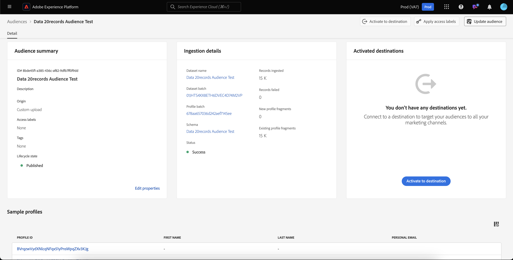

# 人物オーディエンスガイド

Adobe Experience Platformでは、People ベースのオーディエンスを使用すると、マーケティングキャンペーンにターゲットを設定するユーザーのグループを指定できます。

人物オーディエンスは、顧客プロファイルデータを使用して特定の市場をターゲット設定し、広告のターゲットにする特定の人口統計をより適切にターゲット設定できます。

## 用語 {#terminology}

人物オーディエンスの使用を開始する前に、様々なオーディエンスタイプの違いを確認してください。

- **アカウントオーディエンス**：アカウントオーディエンスは、**アカウント** プロファイルデータを使用して作成されたオーディエンスです。 アカウントプロファイルデータを使用すると、ダウンストリームアカウント内のユーザーをターゲットにしたオーディエンスを作成できます。 アカウントオーディエンスについて詳しくは、[ アカウントオーディエンスの概要 ](./account-audiences.md) を参照してください。
- **人物オーディエンス**：人物オーディエンスは、**顧客** プロファイルデータを使用して作成されたオーディエンスです。 顧客プロファイルデータを使用すると、ビジネスの顧客をターゲットにしたオーディエンスを作成できます。
- **見込み客オーディエンス**：見込み客オーディエンスは、**見込み客** プロファイルデータを使用して作成されたオーディエンスです。 見込み客プロファイルデータを使用すると、認証されていないユーザーからオーディエンスを作成できます。 見込み客オーディエンスについて詳しくは、[ 見込み客オーディエンスの概要 ](./prospect-audiences.md) を参照してください。

## アクセス {#access}

人物オーディエンスにアクセスするには、「**[!UICONTROL 顧客]** セクションの **[!UICONTROL オーディエンス]** を選択します。

オーディエンスポータルが表示され、組織のすべての人物オーディエンスのリストが表示されます。

この表示には、名前、プロファイル数、接触チャネル、ライフサイクルステータス、作成日、最終更新日など、オーディエンスに関する情報がリストされます。

また、検索機能とフィルター機能を使用して、特定のアカウントオーディエンスをすばやく検索および並べ替えることもできます。 この機能について詳しくは、[ オーディエンスポータルの概要 ](../ui/audience-portal.md#manage-audiences) を参照してください。

## オーディエンスの詳細 {#details}

特定の人物オーディエンスに関する詳細を表示するには、オーディエンスポータルでオーディエンスを選択します。

オーディエンスの詳細ページが表示されます。 説明、接触チャネル、ライフサイクル ステータスなどの情報が表示されます。

オーディエンスの詳細ページについて詳しくは、[ オーディエンスポータルの概要のオーディエンスの詳細 ](../ui/audience-portal.md#audience-details) を参照してください。

## オーディエンスを作成 {#create}

オーディエンスコンポーザーまたはセグメントビルダーを使用して、人物オーディエンスを作成できます。 People オーディエンスの作成を開始するには、オーディエンスポータルで「オーディエンスを作成」を選択します。

ポップオーバーが表示され、オーディエンスを作成するか、ルールを作成するかを選択できます。

オーディエンスの作成について詳しくは、[ オーディエンスポータルの概要 ](../ui/audience-portal.md#create-audience) を参照してください。

## オーディエンスをアクティベート {#activate}

People オーディエンスを作成したら、このオーディエンスを他のダウンストリームサービスに対してアクティブ化できます。

アクティベートするオーディエンスを選択し、続けて **[!UICONTROL 宛先に対してアクティベート]** を選択します。

[!UICONTROL  宛先のアクティブ化 ] ページが表示され、オーディエンスの更新頻度に応じて、使用可能な宛先のリストが表示されます。 アクティベーションプロセスについて詳しくは、[ アクティベーションの概要 ](../../destinations/ui/activation-overview.md) を参照してください。

## 次の手順

このガイドを読むと、Adobe Experience Platformで人物オーディエンスを作成および管理する方法を理解できます。 様々なタイプのオーディエンスについて詳しくは、[ オーディエンスタイプの概要 ](./overview.md) を参照してください。
