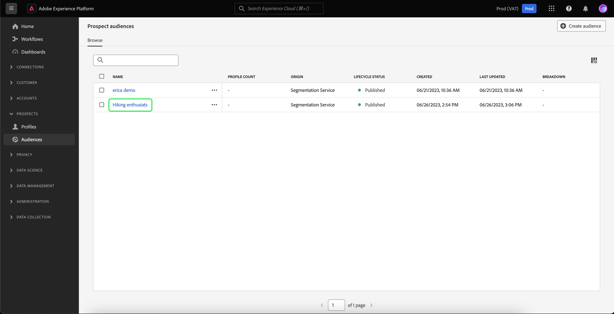

# 見込み客オーディエンス

Adobe Experience Platform を使用すると、マーケターにとってわかりやすいセグメント化エクスペリエンスの使いやすさと精巧さを[見込み客プロファイル](../../profile/ui/prospect-profile.md)に活かすことができます。パートナーデータを責任を持って使用しながら、独自の見込み客オーディエンスを作成することで、オーディエンスの組み立てに要する時間を大幅に短縮できます。

## アクセス {#access}

見込み客オーディエンスにアクセスするには、「**[!UICONTROL 見込み客]**」セクションの「**[!UICONTROL オーディエンス]**」を選択します。

![「[!UICONTROL 見込み客]」セクション内で「[!UICONTROL オーディエンス]」ボタンがハイライト表示されています。](../images/types/prospect/prospect-audiences.png)

オーディエンスポータルが表示され、組織のすべての見込み客オーディエンスのリストが表示されます。

この表示には、名前、プロファイル数、接触チャネル、ライフサイクルステータス、作成日、最終更新日、分類など、オーディエンスに関する情報が一覧表示されます。

この表示にフィールドを追加するには、 アイコンを選択します。これらの追加フィールドには、更新頻度と最終更新者が含まれます。

リストに表示されたフィールドに関する詳細情報を含む、Audience Portal に関する詳細については、[Audience Portal の概要 ](../ui/audience-portal.md#list) を参照してください。

## オーディエンスの詳細 {#details}

特定の見込み客オーディエンスに関する詳細を表示するには、Audience Portal でオーディエンスを選択します。

見込み客オーディエンスの詳細ページが表示されます。見込み客オーディエンスの概要、オーディエンス合計、アクティブ化された宛先などの情報が表示されます。

オーディエンスの詳細ページについて詳しくは、[ オーディエンスポータルの概要のオーディエンスの詳細 ](../ui/audience-portal.md#audience-details) を参照してください。

## オーディエンスを作成 {#create}

見込み客オーディエンスを作成するには、オーディエンスポータルで **[!UICONTROL オーディエンスを作成]** を選択します。

![見込み客オーディエンスの参照ページで「[!UICONTROL オーディエンスを作成]」ボタンがハイライト表示されています。](../images/types/prospect/select-create-audience.png)

セグメントビルダーが表示されます。見込み客プロファイルの属性が左のナビゲーションバーに表示されます。

セグメントビルダーの使用について詳しくは、[セグメントビルダー UI ガイド](../ui/segment-builder.md)を参照してください。

## 推奨されるユースケース {#use-cases}

Experience Platformの見込み客オーディエンス機能を他のExperience Platform機能と組み合わせて使用する方法については、次のユースケースドキュメントを参照してください。

- [見込み客機能を使用した新規顧客のエンゲージメントと獲得](../../rtcdp/partner-data/prospecting.md)

## 次の手順

このガイドでは、Adobe Experience Platform で見込み客オーディエンスを作成および管理する方法を説明しました。見込み客オーディエンスを他のダウンストリームサービスに対してアクティブ化する方法については、[見込み客オーディエンスのアクティブ化](../../destinations/ui/activate-prospect-audiences.md)に関するガイドを参照してください。
