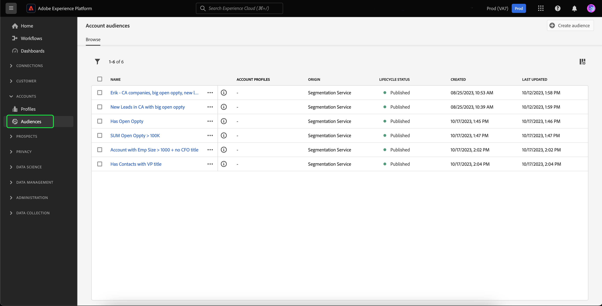

# アカウントオーディエンス

>[!AVAILABILITY]
>
>アカウントオーディエンスは、 [B2B エディションオブReal-time Customer Data Platform](../../rtcdp/b2b-overview.md). また、アカウントオーディエンス機能は、現在、 **限られた可用性**. AdobeカスタマーケアまたはAdobe担当者に問い合わせて、この機能へのアクセスをリクエストしてください。

Adobe Experience Platformでは、アカウントのセグメント化により、ユーザーベースのオーディエンスからアカウントベースのオーディエンスに至るまで、マーケティングセグメント化のエクスペリエンスを完全に簡単かつ高度にすることができます。

アカウントオーディエンスをアカウントベースの宛先の入力として使用し、ダウンストリームサービス内のこれらのアカウント内のユーザーをターゲティングできます。 例えば、アカウントベースのオーディエンスを使用して、 **not** COO（最高経営責任者）または CMO（最高マーケティング責任者）という役職の人に関する連絡先情報を持っています。

## 用語 {#terminology}

アカウントオーディエンスの使用を開始する前に、様々なオーディエンスタイプの違いを確認してください。

- **アカウントオーディエンス**：アカウントオーディエンスは、 **アカウント** プロファイルデータ。 アカウントプロファイルデータを使用して、ダウンストリームアカウント内のユーザーをターゲットにするオーディエンスを作成できます。 アカウントプロファイルの詳細については、 [アカウントプロファイルの概要](../../rtcdp/accounts/account-profile-overview.md).
- **People オーディエンス**：人物オーディエンスは、 **顧客** プロファイルデータ。 顧客プロファイルデータを使用して、ビジネス顧客をターゲットにするオーディエンスを作成できます。 顧客プロファイルの詳細については、 [リアルタイム顧客プロファイルの概要](../../profile/home.md).
- **見込み客のオーディエンス**：見込み客オーディエンスは、 **見込み客** プロファイルデータ。 見込み客プロファイルデータを使用して、未認証ユーザーからオーディエンスを作成できます。 見込み客プロファイルの詳細については、 [見込み客プロファイルの概要](../../profile/ui/prospect-profile.md).

## アクセス {#access}

アカウントオーディエンスにアクセスするには、 **[!UICONTROL オーディエンス]** （内） **[!UICONTROL アカウント]** 」セクションに入力します。

The [!UICONTROL 参照] ページが表示され、組織のすべてのアカウントオーディエンスのリストが表示されます。

このビューには、名前、プロファイル数、接触チャネル、ライフサイクルステータス、作成日、最終更新日など、オーディエンスに関する情報が一覧表示されます。

## オーディエンスを作成 {#create}

アカウントオーディエンスを作成するには、 **[!UICONTROL オーディエンスを作成]** の [!UICONTROL 参照] ページに貼り付けます。

![The [!UICONTROL オーディエンスを作成] アカウントオーディエンスの参照ページでボタンが強調表示されます。](../images/ui/account-audiences/select-create-audience.png)

セグメントビルダーが表示されます。アカウント属性は、左側のナビゲーションバーに表示されます。

アカウントオーディエンスを作成する場合、イベントは **[!UICONTROL People]**&#x200B;これらの属性はユーザーに関連付けられるので、個々のタブではなく個々のユーザーのタブになります。

![イベントを検索する場所 ( [!UICONTROL People] フォルダーがハイライト表示されます。](../images/ui/account-audiences/attributes.png)

セグメントビルダーの使用について詳しくは、[セグメントビルダー UI ガイド](./segment-builder.md)を参照してください。

## オーディエンスを有効化 {#activate}

>[!NOTE]
>
>アカウントオーディエンスをサポートする宛先は限られています。 このプロセスを続行する前に、アクティブ化する宛先でアカウントオーディエンスがサポートされていることを確認してください。

アカウントオーディエンスを作成したら、そのオーディエンスを他のダウンストリームサービスに対してアクティブ化できます。

アクティブ化するオーディエンスを選択し、その後に **[!UICONTROL 宛先に対して有効化]**.

![The [!UICONTROL 宛先に対して有効化] ボタンが、選択したオーディエンスのクイックアクションメニューでハイライト表示されます。](../images/ui/account-audiences/activate.png)

The [!UICONTROL 宛先を有効化] ページが表示されます。 有効化プロセスの詳細については、次を参照してください：サポートされる宛先やフィールドマッピングの詳細など。 [アカウントオーディエンスを有効化](/help/destinations/ui/activate-account-audiences.md) チュートリアル

## 次の手順 {#next-steps}

このガイドを読むと、Adobe Experience Platformでアカウントオーディエンスを作成して使用する方法をより深く理解できます。 Platform での他のタイプのオーディエンスの使用方法については、 [セグメント化サービス UI ガイド](./overview.md).
