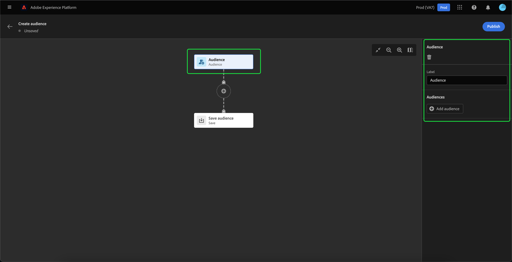

# Audience Builder UI ガイド

>[!IMPORTANT]
>
>Audience Builder は現在ベータ版で、すべてのユーザーが利用できるわけではありません。ドキュメントと機能は変更される場合があります。

Audience Builder にはオーディエンスを作成および編集するためのワークスペースが用意されており、様々なアクションを表すブロックが使用されています。

オーディエンス構成キャンバスは、5 種類のブロック（**[[!UICONTROL オーディエンス]](#audience-block)**、**[[!UICONTROL 除外]](#exclude-block)**、**[[!UICONTROL 結合]](#join-block)**、**[[!UICONTROL ランク]](#rank-block)**、**[[!UICONTROL 分割]](#split-block)**）で構成されています。

## [!UICONTROL オーディエンス] {#audience-block}

**[!UICONTROL オーディエンス]**&#x200B;ブロックタイプを使用すると、より大きな新しいオーディエンスを構成するサブオーディエンスを追加できます。 デフォルトでは、**[!UICONTROL オーディエンス]**&#x200B;ブロックは構成キャンバスの上部に含まれています。

**[!UICONTROL オーディエンス]**&#x200B;ブロックを選択すると、右側のパネルに、オーディエンスのラベル付けとブロックへの追加を行うためのコントロールが表示されます。

「**[!UICONTROL オーディエンスを追加]**」を選択すると、オーディエンスのリストが表示されます。含めるオーディエンス、「**[!UICONTROL 追加]**」の順に選択して、オーディエンスブロックに追加します。

**[!UICONTROL オーディエンス]**&#x200B;ブロックが選択されると、選択したオーディエンスが右側のパネル内に表示されます。ここから、結合オーディエンスの結合タイプを変更できます。

| 結合タイプ | 説明 |
| ---------- | ----------- |
| [!UICONTROL 結合] | 複数のオーディエンスが 1 つのオーディエンスに結合されます。 これは OR 演算と同じです。 |
| [!UICONTROL Intersection] | オーディエンスが結合され、**すべて**&#x200B;のオーディエンスで共有されているオーディエンスのみが追加されます。これは AND 演算と同じです。 |
| [!UICONTROL 重複を除外] | オーディエンスが結合され、**すべてではなく、いずれか**&#x200B;のオーディエンスで共有されているオーディエンスのみが追加されます。これは XOR 演算と同じです。 |

## [!UICONTROL 除外] {#exclude-block}

**[!UICONTROL 除外]**&#x200B;ブロックタイプを使用すると、指定したサブオーディエンスまたは属性を、より大きな新しいオーディエンスから除外できます。

**[!UICONTROL 除外]**&#x200B;ブロックを追加するには、「**+**」アイコン、「**[!UICONTROL 除外]**」の順に選択します。

**[!UICONTROL 除外]**&#x200B;ブロックが追加されます。このブロックを選択すると、除外に関する詳細が右側のパネルに表示されます。これには、ブロックのラベルと除外のタイプが含まれます。[オーディエンス別](#exclude-audience)、または[属性別](#exclude-attribute)に除外できます。

### オーディエンス別に除外 {#exclude-audience}

オーディエンス別に除外する場合は、「**[!UICONTROL オーディエンスを追加]**」をクリックすることで、除外するオーディエンスを選択できます。

オーディエンスのリストが表示されます。「**[!UICONTROL 追加]**」を選択し、除外するオーディエンスを除外ブロックに追加します。

### 属性別に除外 {#exclude-attribute}

属性別に除外する場合は、「**[!UICONTROL 除外ルール]**」セクションにあるアイコンを選択することで、除外する属性を選択できます。

プロファイル属性のリストが表示されます。除外する属性タイプを選択し、続けて「**[!UICONTROL 選択]**」をクリックして、「除外」ブロックに追加します。

## [!UICONTROL 結合] {#join-block}

**[!UICONTROL 結合]**&#x200B;ブロックタイプを使用すると、Adobe Experience Platform でまだ処理されていないデータセットから外部オーディエンスを追加できます。

**[!UICONTROL 結合]**&#x200B;ブロックを追加するには、「**+**」アイコン、「**[!UICONTROL 結合]**」の順に選択します。

ブロックを選択すると、ブロックのラベルや、オーディエンスをエンリッチメントデータセットに追加するオプションなど、結合の詳細が右側のパネルに表示されます。

「**[!UICONTROL オーディエンスを追加]**」を選択すると、オーディエンスのリストが表示されます。含めるオーディエンスを選択し、続けて「**[!UICONTROL 追加]**」をクリックして結合ブロックに追加します。

**[!UICONTROL 結合]**&#x200B;ブロックが選択されると、選択したオーディエンスが右側のパネル内に表示されます。

## [!UICONTROL ランク] {#rank-block}

**[!UICONTROL ランク]**&#x200B;ブロックタイプを使用すると、新しいオーディエンスが公開される前に、オーディエンスのランク付けと並べ替えを行うことができます。

**[!UICONTROL ランク]**&#x200B;ブロックを追加するには、「**+**」アイコン、「**[!UICONTROL ランク]**」の順に選択します。

ブロックを選択すると、右側のパネルにランキングの詳細が表示されます。ここには、ブロックのラベル、ランク付けの基準にする属性、ランク付けの順序、ランク付けするプロファイル数を制限する切替スイッチなどが含まれています。

オーディエンスのランク付けの基準にする属性を選択するには、アイコンを選択します。

プロファイル属性のリストが表示されます。このポップオーバーで、オーディエンスのランク付けの基準にする属性タイプを選択できます。 「**[!UICONTROL 選択]**」を選択して、ランクブロックに追加します。選択した属性は、`int` 型&#x200B;**のみ**&#x200B;であることに注意してください。

属性を選択したら、ランク付けの順序を選択できます。 昇順（最小から最大）または降順（最大から最小）のいずれかです。

さらに、「**[!UICONTROL プロファイル制限を追加]**」切替スイッチを有効にすることで、返されるオーディエンスの数を制限できます。この切替スイッチが有効になっている場合は、「**[!UICONTROL 含まれるプロファイル]**」フィールド内で、返されるオーディエンスの最大数を設定できます。

## [!UICONTROL 分割] {#split-block}

**[!UICONTROL 分割]**&#x200B;ブロックタイプを使用すると、新しいオーディエンスを様々なサブオーディエンスに分割できます。オーディエンスは、割合に基づいて分割したり、属性別に分割したりできます。

**[!UICONTROL 分割]**&#x200B;ブロックを追加するには、「**+**」アイコン、「**[!UICONTROL 分割]**」の順に選択します。

### 割合で分割 {#split-percentage}

割合で分割する場合、オーディエンスは、指定されたパスの数と割合に基づいてランダムに分割されます。

例えば、3 つのパスを作成し、それぞれのパスでプロファイルの割合を変えることができます。

さらに、分割されたオーディエンスの 1 つをコントロール母集団としてマークすることもできます。

### 属性で分割 {#split-attribute}

属性別に分割する場合、オーディエンスは指定された属性に基づいて分割されます分割の基準にする属性を選択するには、**[!UICONTROL 分割]**&#x200B;ブロック、アイコンの順に選択します。

プロファイル属性のリストが表示されます。属性タイプ、「**[!UICONTROL 選択]**」の順に選択して、分割ブロックに追加します。

属性を選択したら、「**[!UICONTROL 値]**」フィールド内に値を追加することで、どのプロファイルがどのサブオーディエンスに属するか選択できます。

また、「**[!UICONTROL その他のプロファイル]**」切替スイッチを有効にして、選択されていないすべてのプロファイルで構成されるサブオーディエンスを作成できます。

## オーディエンスのパブリッシュ

オーディエンスを作成したら、「 **[!UICONTROL 公開]**」を選択してオーディエンスを保存および公開できます。

オーディエンスの作成でエラーが発生した場合は、アラートが表示され、問題の解決方法を知らせます。

## 次の手順

Audience Builder には、様々なブロックタイプからオーディエンスを作成できる機能豊富なワークフローが用意されています。 セグメント化サービス UI の他の部分について詳しくは、[セグメント化サービスユーザーガイド](./overview.md)を参照してください。
