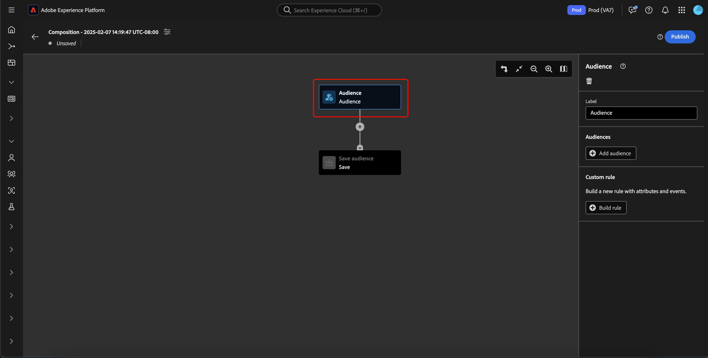
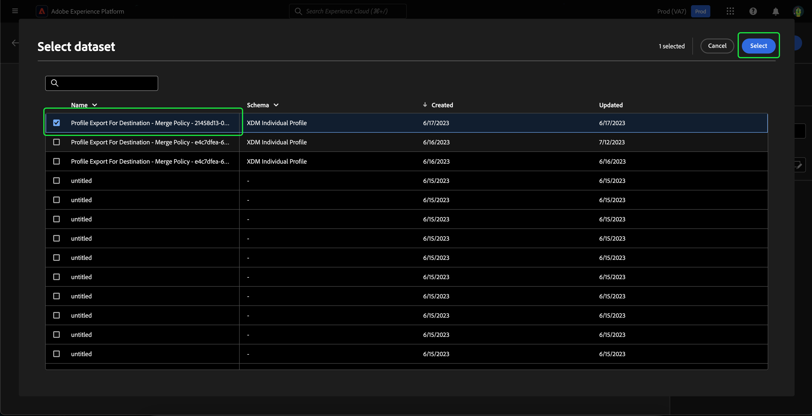
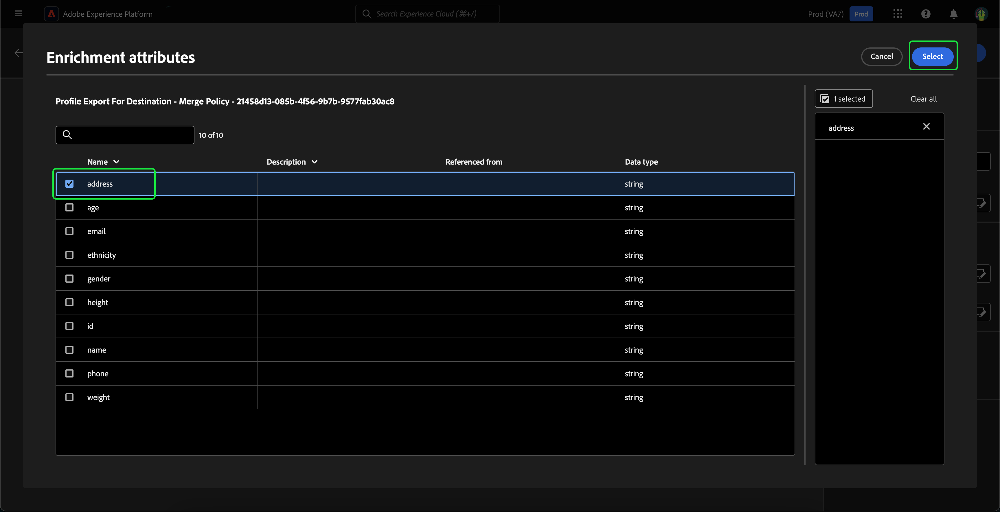

# Audience Composition UI ガイド

>[!NOTE]
>
>このガイドでは、オーディエンス構成を使用してオーディエンスを作成する方法を説明します。 セグメントビルダーを使用して、セグメント定義を通じてオーディエンスを作成する方法については、 [セグメントビルダー UI ガイド](./segment-builder.md).

オーディエンス構成は、様々なアクションを表すために使用されるブロックを使用して、オーディエンスを構築および編集するためのワークスペースを提供します。

タイトルや説明など、構成の詳細を変更するには、  」ボタンをクリックします。

The **[!UICONTROL 合成のプロパティ]** ポップオーバーが表示されます。 タイトルや説明など、構成の詳細をここに挿入できます。

>[!NOTE]
>
>もし **not** コンポジションにタイトルを付けます。タイトルは「コンポジション」に続き、デフォルトで作成日時が続きます。

コンポジションの詳細を更新した後、「 」を選択します。 **[!UICONTROL 保存]** をクリックして、これらの更新を確定します。 オーディエンス構成キャンバスが再び表示されます。

オーディエンス構成キャンバスは、次の 4 種類のブロックで構成されています。 **[[!UICONTROL 対象ユーザ]](#audience-block)**, **[[!UICONTROL 除外]](#exclude-block)**, **[[!UICONTROL ランク]](#rank-block)**、および **[[!UICONTROL 分割]](#split-block)**.

## [!UICONTROL オーディエンス] {#audience-block}

**[!UICONTROL オーディエンス]**&#x200B;ブロックタイプを使用すると、より大きな新しいオーディエンスを構成するサブオーディエンスを追加できます。 デフォルトでは、**[!UICONTROL オーディエンス]**&#x200B;ブロックは構成キャンバスの上部に含まれています。

次の項目を選択した場合： **[!UICONTROL 対象ユーザ]** ブロックの場合、右側のパネルには、オーディエンスにラベルを付けたり、オーディエンスをブロックに追加したり、オーディエンスブロックのカスタムルールを作成したりするためのコントロールが表示されます。

>[!NOTE]
>
>オーディエンスを追加することもできます **または** カスタムルールを作成します。 次の 2 つの機能 **できません** 一緒に使用する。

### [!UICONTROL オーディエンスを追加] {#add-audience}

オーディエンスブロックにオーディエンスを追加するには： 選択 **[!UICONTROL オーディエンスを追加]**.

オーディエンスのリストが表示されます。含めるオーディエンス、「**[!UICONTROL 追加]**」の順に選択して、オーディエンスブロックに追加します。

**[!UICONTROL オーディエンス]**&#x200B;ブロックが選択されると、選択したオーディエンスが右側のパネル内に表示されます。ここから、結合オーディエンスの結合タイプを変更できます。

| 結合タイプ | 説明 |
| ---------- | ----------- |
| [!UICONTROL 結合] | 複数のオーディエンスが 1 つのオーディエンスに結合されます。 これは OR 演算と同じです。 |
| [!UICONTROL Intersection] | オーディエンスが結合され、**すべて**&#x200B;のオーディエンスで共有されているオーディエンスのみが追加されます。これは AND 演算と同じです。 |
| [!UICONTROL 重複を除外] | オーディエンスが結合され、**すべてではなく、いずれか**&#x200B;のオーディエンスで共有されているオーディエンスのみが追加されます。これは XOR 演算と同じです。 |

### [!UICONTROL ルールを作成] {#build-rule}

オーディエンスブロックにカスタムルールを追加するには、 **[!UICONTROL ルールを作成]**.

「セグメントビルダー」が表示されます。セグメントビルダーを使用して、オーディエンスが従うカスタムルールを作成できます。 セグメントビルダーの使用について詳しくは、 [セグメントビルダーガイド](./segment-builder.md).

カスタムルールを追加した後、「 **[!UICONTROL 保存]** をクリックして、ルールをオーディエンスに追加します。

## [!UICONTROL 除外] {#exclude-block}

**[!UICONTROL 除外]**&#x200B;ブロックタイプを使用すると、指定したサブオーディエンスまたは属性を、より大きな新しいオーディエンスから除外できます。

**[!UICONTROL 除外]**&#x200B;ブロックを追加するには、「**+**」アイコン、「**[!UICONTROL 除外]**」の順に選択します。

**[!UICONTROL 除外]**&#x200B;ブロックが追加されます。このブロックを選択すると、除外に関する詳細が右側のパネルに表示されます。これには、ブロックのラベルと除外のタイプが含まれます。[オーディエンス別](#exclude-audience)、または[属性別](#exclude-attribute)に除外できます。

### オーディエンス別に除外 {#exclude-audience}

オーディエンス別に除外する場合は、「**[!UICONTROL オーディエンスを追加]**」をクリックすることで、除外するオーディエンスを選択できます。

オーディエンスのリストが表示されます。「**[!UICONTROL 追加]**」を選択し、除外するオーディエンスを除外ブロックに追加します。

### 属性別に除外 {#exclude-attribute}

属性別に除外する場合は、「**[!UICONTROL 除外ルール]**」セクションにあるアイコンを選択することで、除外する属性を選択できます。

プロファイル属性のリストが表示されます。除外する属性タイプを選択し、続けて「**[!UICONTROL 選択]**」をクリックして、「除外」ブロックに追加します。

## [!UICONTROL エンリッチメント] {#enrich-block}

>[!IMPORTANT]
>
>この時点で、エンリッチメント属性は次の操作を実行できます。 **のみ** をダウンストリームのAdobe Journey Optimizerシナリオで使用する

The **[!UICONTROL エンリッチ]** ブロックタイプを使用すると、データセットの追加属性でオーディエンスをエンリッチメントできます。 これらの属性は、パーソナライゼーションの使用例で使用できます。

次の手順で **[!UICONTROL エンリッチ]** ブロック、 **+** アイコン、その後に **[!UICONTROL エンリッチ]**.

![The [!UICONTROL エンリッチ] 」オプションが選択されている。](../images/ui/audience-composition/add-enrich-block.png)

The **[!UICONTROL エンリッチ]** ブロックが追加されます。 このブロックを選択すると、エンリッチメントの詳細が右側のパネルに表示されます。 これには、ブロックのラベルとエンリッチメントデータセットが含まれます。

オーディエンスのエンリッチメントに使用するデータセットを選択するには、  アイコン。

![フィルターボタンがハイライト表示されます。 これを選択すると、 [!UICONTROL データセットを選択] ポップオーバー](../images/ui/audience-composition/enrich-select-dataset.png)

The **[!UICONTROL データセットを選択]** ポップオーバーが表示されます。 エンリッチメント用に追加するデータセットを選択し、その後に **[!UICONTROL 選択]** をクリックして、エンリッチメント用のデータセットを追加します。

>[!IMPORTANT]
>
>選択したデータセット **必須** 次の条件を満たしている。
>
>- データセット **必須** はレコードタイプです。
>   - データセット **できません** イベントタイプであるか、システム生成であるか、プロファイル用にマークされている。
>- データセット **必須** は 1 GB 以下です。

The **[!UICONTROL エンリッチメント条件]** セクションが右側のパネルに表示されるようになりました。 このセクションでは、 **[!UICONTROL ソース結合キー]** そして **[!UICONTROL エンリッチメントデータセット結合キー]**：エンリッチメントデータセットを、作成しようとしているオーディエンスとリンクできます。

![The [!UICONTROL エンリッチメント条件] 領域がハイライト表示されます。](../images/ui/audience-composition/enrichment-criteria.png)

次の項目を選択します。 **[!UICONTROL ソース結合キー]**&#x200B;を選択し、  アイコン。

![次に示すフィルターアイコン： [!UICONTROL ソース結合キー] がハイライト表示されます。](../images/ui/audience-composition/enrich-select-source-join-key.png)

The **[!UICONTROL プロファイル属性を選択]** ポップオーバーが表示されます。 ソース結合キーとして使用するプロファイル属性を選択し、その後に **[!UICONTROL 選択]** をクリックして、その属性をソース結合キーとして選択します。

次の項目を選択します。 **[!UICONTROL エンリッチメントデータセット結合キー]**&#x200B;を選択し、  アイコン。

![次に示すフィルターアイコン： [!UICONTROL エンリッチメントデータセット結合キー] がハイライト表示されます。](../images/ui/audience-composition/enrich-select-enrichment-dataset-join-key.png)

The **[!UICONTROL エンリッチメント属性]** ポップオーバーが表示されます。 エンリッチメントデータセット結合キーとして使用する属性を選択し、その後に **[!UICONTROL 選択]** を使用して、その属性をエンリッチメントデータセット結合キーとして選択します。

これで、2 つの結合キー、 **[!UICONTROL エンリッチメント属性]** セクションが表示されます。 これで、オーディエンスを強化する属性を追加できます。 これらの属性を追加するには、「 **[!UICONTROL 属性を追加]**.

![The [!UICONTROL 属性を追加] ボタンがハイライト表示されます。](../images/ui/audience-composition/enrich-select-add-attribute.png)

The **[!UICONTROL エンリッチメント属性]** ポップオーバーが表示されます。 データセットから属性を選択してオーディエンスをエンリッチメントし、その後に **[!UICONTROL 選択]** をクリックして、オーディエンスに属性を追加します。

<!-- ## [!UICONTROL Join] {#join-block}

The **[!UICONTROL Join]** block type allows you to add in external audiences from datasets that have not yet been processed by Adobe Experience Platform.

To add a **[!UICONTROL Join]** block, select the **+** icon, followed by **[!UICONTROL Join]**.

When you select the block, details about the join are shown in the right rail, including the block's label and the option to add audiences to the enrichment dataset.

After selecting **[!UICONTROL Add Audience]**, a list of audiences appears. Select the audiences you want to include, followed by **[!UICONTROL Add]** to add them to your join block.

Your selected audiences now appear within the right rail when the **[!UICONTROL Join]** block is selected. 

 -->

## [!UICONTROL ランク] {#rank-block}

The **[!UICONTROL ランク]** ブロックタイプを使用すると、指定した属性に基づいてプロファイルのランク付けと並べ替えをおこない、これらのランク付けされたプロファイルを構成に含めることができます。

**[!UICONTROL ランク]**&#x200B;ブロックを追加するには、「**+**」アイコン、「**[!UICONTROL ランク]**」の順に選択します。

ブロックを選択すると、右側のパネルにランキングの詳細が表示されます。ここには、ブロックのラベル、ランク付けの基準にする属性、ランク付けの順序、ランク付けするプロファイル数を制限する切替スイッチなどが含まれています。

オーディエンスのランク付けの基準にする属性を選択するには、アイコンを選択します。

プロファイル属性のリストが表示されます。このポップオーバーで、オーディエンスのランク付けの基準にする属性タイプを選択できます。 「**[!UICONTROL 選択]**」を選択して、ランクブロックに追加します。選択した属性は、 **のみ** 数字です。

属性を選択したら、ランク付けの順序を選択できます。 昇順（最小から最大）または降順（最大から最小）のいずれかです。

さらに、「**[!UICONTROL プロファイル制限を追加]**」切替スイッチを有効にすることで、返されるオーディエンスの数を制限できます。この切替スイッチが有効になっている場合は、「**[!UICONTROL 含まれるプロファイル]**」フィールド内で、返されるオーディエンスの最大数を設定できます。

## [!UICONTROL 分割] {#split-block}

**[!UICONTROL 分割]**&#x200B;ブロックタイプを使用すると、新しいオーディエンスを様々なサブオーディエンスに分割できます。オーディエンスは、割合に基づいて分割したり、属性別に分割したりできます。

**[!UICONTROL 分割]**&#x200B;ブロックを追加するには、「**+**」アイコン、「**[!UICONTROL 分割]**」の順に選択します。

オーディエンスを分割する場合は、割合で分割するか、属性で分割します。

### 割合で分割 {#split-percentage}

割合で分割する場合、オーディエンスは、指定されたパスの数と割合に基づいてランダムに分割されます。

例えば、3 つのパスを作成し、それぞれのパスでプロファイルの割合を変えることができます。

### 属性で分割 {#split-attribute}

属性別に分割する場合、オーディエンスは指定された属性に基づいて分割されます分割の基準にする属性を選択するには、**[!UICONTROL 分割]**&#x200B;ブロック、アイコンの順に選択します。

プロファイル属性のリストが表示されます。属性タイプ、「**[!UICONTROL 選択]**」の順に選択して、分割ブロックに追加します。

属性を選択したら、「**[!UICONTROL 値]**」フィールド内に値を追加することで、どのプロファイルがどのサブオーディエンスに属するか選択できます。

また、「**[!UICONTROL その他のプロファイル]**」切替スイッチを有効にして、選択されていないすべてのプロファイルで構成されるサブオーディエンスを作成できます。

## オーディエンスのパブリッシュ

オーディエンスを作成したら、「 **[!UICONTROL 公開]**」を選択してオーディエンスを保存および公開できます。

オーディエンスの作成でエラーが発生した場合は、アラートが表示され、問題の解決方法を知らせます。

## 次の手順

オーディエンスの構成には、様々なブロックタイプからオーディエンスを作成できる豊富なワークフローが用意されています。 セグメント化サービス UI の他の部分について詳しくは、[セグメント化サービスユーザーガイド](./overview.md)を参照してください。
