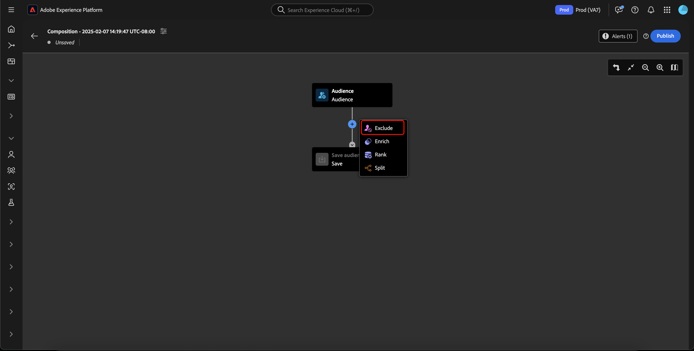

# オーディエンス構成 UI ガイド

>[!AVAILABILITY]
>
>この機能を使用するには、次の権限が必要です。
>
>- セグメントの管理
>- プロファイルの管理
>- 結合ポリシーの管理
>
>Platform 内の権限について詳しくは、[ アクセス制御の概要 ](../../access-control/home.md#permissions) を参照してください。

>[!NOTE]
>
>このガイドでは、オーディエンス構成を使用してオーディエンスを作成する方法を説明します。セグメントビルダーを使用してセグメント定義を通じてオーディエンスを作成する方法については、[セグメントビルダー UI ガイド](./segment-builder.md)を参照してください。

オーディエンス構成には、様々なアクションの表現に使用されるブロックでオーディエンスを作成および編集するためのワークスペースが用意されています。

タイトルや説明など、構成の詳細を変更するには、 ボタンを選択します。

**[!UICONTROL 構成のプロパティ]**&#x200B;ポップオーバーが表示されます。タイトルや説明など、構成の詳細をここに挿入できます。

>[!NOTE]
>
>**ない** 場合は、コンポジションにタイトルを付けると、「コンポジション」というタイトルの後に、デフォルトで作成日時が続きます。 さらに、コンポジションごとに一意の名前を付ける **必要があります**。

構成の詳細を更新した後、「**[!UICONTROL 保存]**」を選択して、これらの更新を確定します。オーディエンス構成キャンバスが再び表示されます。

オーディエンス構成キャンバスは、4 種類のブロック（**[[!UICONTROL オーディエンス]](#audience-block)**、**[[!UICONTROL 除外]](#exclude-block)**、**[[!UICONTROL ランク]](#rank-block)**、**[[!UICONTROL 分割]](#split-block)**）で構成されています。

## [!UICONTROL オーディエンス] {#audience-block}

>[!CONTEXTUALHELP]
>id="platform_segmentation_ao_audience"
>title="オーディエンスブロック"
>abstract="オーディエンスブロックを使用すると、新しいオーディエンスの作成に使用するサブオーディエンスを追加できます。"

>[!CONTEXTUALHELP]
>id="platform_segmentation_ao_merge_types"
>title="結合タイプ"
>abstract="結合タイプによって、選択したサブオーディエンスの結合方法が決まります。サポートされている値には、和集合、積集合、重複を除外が含まれます。"

**[!UICONTROL オーディエンス]** ブロックタイプを使用すると、より大きな新しいオーディエンスの作成に使用するサブオーディエンスを追加できます。 デフォルトでは、**[!UICONTROL オーディエンス]**&#x200B;ブロックは構成キャンバスの上部に含まれています。

**[!UICONTROL オーディエンス]**&#x200B;ブロックを選択すると、右側のパネルには、オーディエンスにラベルを付けたり、ブロックにオーディエンスを追加したり、オーディエンスブロックのカスタムルールを作成したりするためのコントロールが表示されます。

>[!NOTE]
>
>オーディエンスを追加する&#x200B;**かまたは**&#x200B;カスタムルールを作成できます。これらの 2 つの機能を一緒に使用することは&#x200B;**できません**。

### [!UICONTROL オーディエンスの追加] {#add-audience}

オーディエンスブロックにオーディエンスを追加するには。「**[!UICONTROL オーディエンスを追加]**」を選択します。

>[!IMPORTANT]
>
>デフォルトの結合ポリシーを使用して定義されたオーディエンスは **のみ** 表示されることに注意してください。
>
>また、セグメントビルダーを使用して作成された **公開** オーディエンスのみ使用できます。 オーディエンスコンポジションを使用して作成されたオーディエンスと、外部で生成されたオーディエンスは **使用できません**。

オーディエンスのリストが表示されます。含めるオーディエンス、「**[!UICONTROL 追加]**」の順に選択して、オーディエンスブロックに追加します。

**[!UICONTROL オーディエンス]**&#x200B;ブロックが選択されると、選択したオーディエンスが右側のパネル内に表示されます。ここから、結合オーディエンスの結合タイプを変更できます。

| 結合タイプ | 説明 |
| ---------- | ----------- |
| [!UICONTROL 結合] | 複数のオーディエンスが 1 つのオーディエンスに結合されます。 これは OR 演算と同じです。 |
| [!UICONTROL Intersection] | オーディエンスが結合され、**すべて**&#x200B;のオーディエンスで共有されているオーディエンスのみが追加されます。これは AND 演算と同じです。 |
| [!UICONTROL 重複を除外] | オーディエンスが結合され、**すべてではなく、いずれか**&#x200B;のオーディエンスで共有されているオーディエンスのみが追加されます。これは XOR 演算と同じです。 |

### [!UICONTROL ルールの作成] {#build-rule}

>[!CONTEXTUALHELP]
>id="platform_segmentation_ao_rule_builder"
>title="セグメントビルダー"
>abstract="セグメントビルダーを使用して、構成にカスタムルールを追加できます。"

オーディエンスブロックにカスタムルールを追加するには、「**[!UICONTROL ルールを作成]**」を選択します。

セグメントビルダーが表示されます。セグメントビルダーを使用して、オーディエンスが従うべきカスタムルールを作成できます。セグメントビルダーの使用について詳しくは、[セグメントビルダーガイド](./segment-builder.md)を参照してください。

カスタムルールを追加した後、「**[!UICONTROL 保存]**」を選択して、ルールをオーディエンスに追加します。

## [!UICONTROL 除外] {#exclude-block}

>[!CONTEXTUALHELP]
>id="platform_segmentation_ao_exclude"
>title="ブロックを除外"
>abstract="「ブロックを除外」を使用すると、指定したオーディエンスまたは属性を構成から除外できます。"

>[!CONTEXTUALHELP]
>id="platform_segmentation_ao_exclude_type"
>title="除外タイプ"
>abstract="特定のオーディエンスに属するプロファイルを除外（オーディエンス別に除外）するか、特定の属性に基づいてプロファイルを除外（属性別に除外）することができます。"

**[!UICONTROL 除外]** ブロックタイプを使用すると、指定したサブオーディエンスまたは属性を、より大きな新しいオーディエンスから除外できます。

**[!UICONTROL 除外]**&#x200B;ブロックを追加するには、「**+**」アイコン、「**[!UICONTROL 除外]**」の順に選択します。

**[!UICONTROL 除外]**&#x200B;ブロックが追加されます。このブロックを選択すると、除外に関する詳細が右側のパネルに表示されます。これには、ブロックのラベルと除外のタイプが含まれます。[オーディエンス別](#exclude-audience)、または[属性別](#exclude-attribute)に除外できます。

### オーディエンス別に除外 {#exclude-audience}

オーディエンス別に除外する場合は、「**[!UICONTROL オーディエンスを追加]**」をクリックすることで、除外するオーディエンスを選択できます。

![「[!UICONTROL オーディエンスを追加]」ボタンが選択されています。ここから、除外するオーディエンスを選択できます。](../images/ui/audience-composition/add-excluded-audience.png)

>[!IMPORTANT]
>
>セグメントビルダーを使用して作成された **公開** オーディエンスのみ使用できます。 オーディエンスコンポジションを使用して作成されたオーディエンスと、外部で生成されたオーディエンスは **使用できません**。

オーディエンスのリストが表示されます。「**[!UICONTROL 追加]**」を選択し、除外するオーディエンスを除外ブロックに追加します。

### 属性別に除外 {#exclude-attribute}

>[!CONTEXTUALHELP]
>id="platform_segmentation_ao_exclude_attribute"
>title="属性別に除外"
>abstract="属性別に除外すると、選択した属性に基づいて、特定のプロファイルが構成に表示されないように除外できます。"

属性別に除外する場合は、「除外ルール」セクションにある  アイコンを選択することで、除外する属性を選択でき **[!UICONTROL す]**。 属性を除外すると、この属性を含むプロファイルを結果のオーディエンスから除外できます。

プロファイル属性のリストが表示されます。除外する属性タイプを選択し、続けて「**[!UICONTROL 選択]**」をクリックして、「除外」ブロックに追加します。

>[!IMPORTANT]
>
>属性別に除外する場合は、除外する **one** 値のみを指定できます。 コンマやセミコロンなどの任意の種類の区切り記号を使用すると、その正確な値のみが除外されます。 例えば、値を `red, blue` に設定すると、属性から用語 `red, blue` が除外されますが、用語 `red` または `blue` のいずれかが除外されます **除外されません**。

## [!UICONTROL エンリッチメント] {#enrich-block}

>[!CONTEXTUALHELP]
>id="platform_segmentation_ao_enrich"
>title="エンリッチメントブロック"
>abstract="エンリッチメントブロックを使用すると、Adobe Experience Platform データセットから取得した追加の属性でオーディエンスを強化できます。"

>[!CONTEXTUALHELP]
>id="platform_segmentation_ao_dataset"
>title="エンリッチメントデータセット"
>abstract="エンリッチメントデータセットには、構成に関連付けるデータが含まれます。"

>[!CONTEXTUALHELP]
>id="platform_segmentation_ao_enrich_criteria"
>title="エンリッチメント条件"
>abstract="エンリッチメント条件には、ソース結合キーとエンリッチメントデータセット結合キーが含まれます。 これらの 2 つのキーは、ソースデータセットとエンリッチメントデータセットを紐付けます。"

>[!CONTEXTUALHELP]
>id="platform_segmentation_ao_enrich_attributes"
>title="エンリッチメント属性"
>abstract="エンリッチメント属性は、構成に関連付ける属性です。"

>[!IMPORTANT]
>
>この時点で、エンリッチメント属性は、ダウンストリームの Adobe Journey Optimizer シナリオで&#x200B;**のみ**&#x200B;使用できます。

**[!UICONTROL 強化]**&#x200B;ブロックタイプを使用すると、データセットからの追加属性でオーディエンスを強化できます。これらの属性は、パーソナライゼーションのユースケースで使用できます。

**[!UICONTROL 強化]**&#x200B;ブロックを追加するには、「**+**」アイコン、「**[!UICONTROL 強化]**」の順に選択します。

![「[!UICONTROL 強化]」オプションが選択されます。](../images/ui/audience-composition/add-enrich-block.png)

**[!UICONTROL 強化]**&#x200B;ブロックが追加されます。このブロックを選択すると、エンリッチメントに関する詳細が右側のパネルに表示されます。これには、ブロックのラベルとエンリッチメントデータセットが含まれます。

オーディエンスの強化に使用するデータセットを選択するには、アイコンを選択します。

![フィルターボタンがハイライト表示されます。これを選択すると、[!UICONTROL データセットを選択]ポップオーバーが表示されます。](../images/ui/audience-composition/enrich-select-dataset.png)

**[!UICONTROL データセットを選択]**&#x200B;ポップオーバーが表示されます。エンリッチメント用に追加するデータセットを選択し、「**[!UICONTROL 選択]**」を選択して、エンリッチメント用のデータセットを追加します。

>[!IMPORTANT]
>
>選択したデータセットは、**必ず**&#x200B;次の条件を満たす必要があります。
>
>- データセットは、**必ず**&#x200B;レコードタイプである必要があります。
>   - データセットをイベントタイプ、システム生成またはプロファイル用にマークすることは&#x200B;**できません**。
>- データセットは、**必ず** 1 GB 以下にする必要があります。

**[!UICONTROL エンリッチメント条件]**&#x200B;セクションが右側のパネルに表示されます。このセクションでは、**[!UICONTROL ソース結合キー]**&#x200B;およびエンリッチメントデータセットを作成するオーディエンスとリンクする&#x200B;**[!UICONTROL エンリッチメントデータセット結合キー]**&#x200B;を選択できます。

![[!UICONTROL エンリッチメント条件]領域がハイライト表示されます。](../images/ui/audience-composition/enrichment-criteria.png)

「**[!UICONTROL ソース結合キー]**」を選択して、アイコンを選択します。

**[!UICONTROL プロファイル属性を選択]**&#x200B;ポップオーバーが表示されます。ソース結合キーとして使用するプロファイル属性を選択し、その後に「**[!UICONTROL 選択]**」を選択してその属性をソース結合キーとして選択します。

「**[!UICONTROL エンリッチメントデータセット結合キー]**」を選択し、アイコンを選択します。

**[!UICONTROL エンリッチメント属性]**&#x200B;ポップオーバーが表示されます。エンリッチメントデータセット結合キーとして使用する属性を選択し、その後に「**[!UICONTROL 選択]**」を使用して、その属性をエンリッチメントデータセット結合キーとして選択します。

これで、2 つの結合キーが追加され、**[!UICONTROL エンリッチメント属性]**&#x200B;セクションが表示されます。これで、オーディエンスを強化する属性を追加できます。これらの属性を追加するには、「**[!UICONTROL 属性を追加]**」を選択します。

**[!UICONTROL エンリッチメント属性]**&#x200B;ポップオーバーが表示されます。データセットから属性を選択してオーディエンスを強化し、その後に「**[!UICONTROL 選択]**」を選択してオーディエンスに属性を追加します。

<!-- ## [!UICONTROL Join] {#join-block}

The **[!UICONTROL Join]** block type allows you to add in external audiences from datasets that have not yet been processed by Adobe Experience Platform.

To add a **[!UICONTROL Join]** block, select the **+** icon, followed by **[!UICONTROL Join]**.

When you select the block, details about the join are shown in the right rail, including the block's label and the option to add audiences to the enrichment dataset.

After selecting **[!UICONTROL Add Audience]**, a list of audiences appears. Select the audiences you want to include, followed by **[!UICONTROL Add]** to add them to your join block.

Your selected audiences now appear within the right rail when the **[!UICONTROL Join]** block is selected. 

 -->

## [!UICONTROL ランク] {#rank-block}

>[!CONTEXTUALHELP]
>id="platform_segmentation_ao_ranking"
>title="ランクブロック"
>abstract="ランクブロックを使用すると、特定の属性に基づいてプロファイルをランク付けし、構成に含めることができます。"

>[!CONTEXTUALHELP]
>id="platform_segmentation_ao_rank_profilelimit_text"
>title="プロファイル制限を追加"
>abstract="「プロファイル制限を追加」切替スイッチを使用すると、ランキングプロセスの一部として含めるプロファイルの最大数を指定できます。"

**[!UICONTROL ランク]**&#x200B;ブロックタイプを使用すると、指定した属性に基づいてプロファイルのランク付けと並べ替えを行い、これらのランク付けされたプロファイルを構成に含めることができます。

**[!UICONTROL ランク]**&#x200B;ブロックを追加するには、「**+**」アイコン、「**[!UICONTROL ランク]**」の順に選択します。

ブロックを選択すると、右側のパネルにランキングの詳細が表示されます。ここには、ブロックのラベル、ランク付けの基準にする属性、ランク付けの順序、ランク付けするプロファイル数を制限する切替スイッチなどが含まれています。

オーディエンスのランク付けの基準にする属性を選択するには、アイコンを選択します。

プロファイル属性のリストが表示されます。このポップオーバーで、オーディエンスのランク付けの基準にする属性タイプを選択できます。 「**[!UICONTROL 選択]**」を選択して、ランクブロックに追加します。選択した属性は、数字&#x200B;**のみ**&#x200B;であることに注意してください。

属性を選択したら、ランク付けの順序を選択できます。 昇順（最小から最大）または降順（最大から最小）のいずれかです。

さらに、「プロファイル制限を追加 **[!UICONTROL 切替スイッチを有効にすることで、返されるプロファイルの数を制限でき]** す。 この切替スイッチが有効になっている場合は、「**[!UICONTROL 含まれるプロファイル]**」フィールド内で、返されるプロファイルの最大数を設定できます。

## [!UICONTROL 分割] {#split-block}

>[!CONTEXTUALHELP]
>id="platform_segmentation_ao_split"
>title="ブロックを分割"
>abstract="「ブロックを分割」を使用すると、構成を複数のパスに分割できます。"

>[!CONTEXTUALHELP]
>id="platform_segmentation_ao_split_type"
>title="分割タイプ"
>abstract="構成は、割合の分割または属性の分割で分割できます。割合の分割は、プロファイルを複数のパスにランダムに分割します。属性の分割を使用すると、特定の属性に基づいてプロファイルを分割できます。"

>[!CONTEXTUALHELP]
>id="platform_segmentation_ao_split_otherprofiles_text"
>title="その他のプロファイル"
>abstract="「その他のプロファイル」切替スイッチを使用すると、他のパスで指定された条件に一致しない残りのプロファイルと共に、追加のパスを作成できます。"

**[!UICONTROL 分割]**&#x200B;ブロックタイプを使用すると、新しいオーディエンスを様々なサブオーディエンスに分割できます。オーディエンスは、割合に基づいて分割したり、属性別に分割したりできます。

**[!UICONTROL 分割]**&#x200B;ブロックを追加するには、「**+**」アイコン、「**[!UICONTROL 分割]**」の順に選択します。

オーディエンスを分割する場合は、割合で分割するか、属性で分割します。

### 割合で分割 {#split-percentage}

>[!CONTEXTUALHELP]
>id="platform_segmentation_ao_split_percentage"
>title="割合で分割"
>abstract="指定されたパスの数と割合に基づいて、オーディエンスを複数のオーディエンスにランダムに分割できます。"

>[!CONTEXTUALHELP]
>id="platform_segmentation_ao_split_persistent"
>title="永続的分割"
>abstract="このオプションを有効にして ID 名前空間を選択することで、割合の分割を永続的にすることができます。"

割合で分割する場合、オーディエンスは、指定されたパスの数と割合に基づいてランダムに分割されます。

または、ID を指定することもできます。これにより、パーセンテージベースの分割が永続的になります。 使用可能な ID タイプには、組織で使用可能なすべての ID 名前空間が含まれます。

### 属性で分割 {#split-attribute}

属性別に分割する場合、オーディエンスは指定された属性に基づいて分割されます分割の基準にする属性を選択するには、**[!UICONTROL 分割]**&#x200B;ブロック、アイコンの順に選択します。

プロファイル属性のリストが表示されます。属性タイプ、「**[!UICONTROL 選択]**」の順に選択して、分割ブロックに追加します。

属性を選択したら、「**[!UICONTROL 値]**」フィールド内に値を追加することで、どのプロファイルがどのサブオーディエンスに属するか選択できます。

また、「**[!UICONTROL その他のプロファイル]**」切替スイッチを有効にして、選択されていないすべてのプロファイルで構成されるサブオーディエンスを作成できます。

## オーディエンスのパブリッシュ {#publish}

>[!CONTEXTUALHELP]
>id="platform_segmentation_ao_publish"
>title="公開"
>abstract="構成を公開して、結果のオーディエンスを Adobe Experience Platform で作成できます。"

>[!IMPORTANT]
>
>オーディエンスコンポジションを公開する場合、Real-Time CDP宛先やAdobe Journey Optimizer チャネルなどのダウンストリームサービスで使用するために評価およびアクティブ化されるまで、最大 48 時間かかる場合があります。

コンポジションを作成したら、「**[!UICONTROL 公開]**」を選択して保存および公開できます。

オーディエンスの作成でエラーが発生した場合は、アラートが表示され、問題の解決方法を知らせます。

## 次の手順

オーディエンスコンポジションには、様々なブロックタイプからコンポジションを作成できる機能豊富なワークフローが用意されています。 セグメント化サービス UI の他の部分について詳しくは、[セグメント化サービスユーザーガイド](./overview.md)を参照してください。
