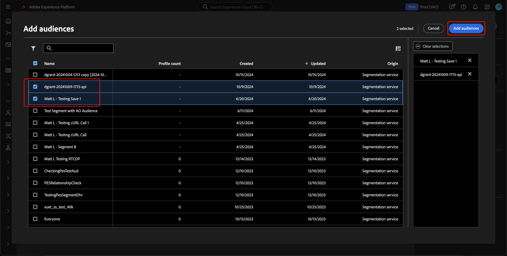
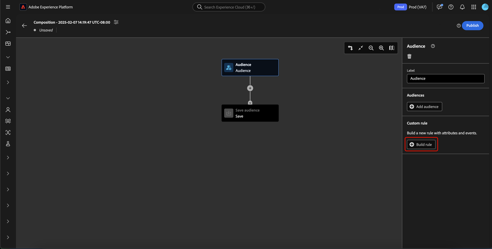

# オーディエンス構成 UI ガイド

>[!AVAILABILITY]
>
>この機能を使用するには、次のアクセス許可が必要です。
>
>- セグメントの管理
>- プロファイルの管理
>- 結合ポリシーの管理
>
>Experience Platform 内のアクセス許可詳細の詳細については、「 [アクセス制御の概要」を参照してください](../../access-control/home.md#permissions)。

>[!NOTE]
>
>このガイドでは、オーディエンス構成を使用してオーディエンスを作成する方法を説明します。セグメントビルダーを使用してセグメント定義を通じてオーディエンスを作成する方法については、[セグメントビルダー UI ガイド](./segment-builder.md)を参照してください。

オーディエンス構成には、様々なアクションの表現に使用されるブロックでオーディエンスを作成および編集するためのワークスペースが用意されています。

タイトルや説明など、構成の詳細を変更するには、 ボタンを選択します。

**[!UICONTROL Composition properties]**&#x200B;ポップオーバーが表示されます。タイトルや説明など、構成の詳細をここに挿入できます。

>[!NOTE]
>
>コンポジションにタイトルを付ける **しない** 場合、デフォルトでは「コンポジション」というタイトルの後に作成日時が続きます。 また、各コンポジションには固有の名前が付けられています&#x200B;****。

コンポジションの詳細を更新したら、[ **[!UICONTROL Save]** ] を選択してこれらの更新を確認します。 オーディエンス構成キャンバスが再び表示されます。

オーディエンスコンポジションキャンバスは、 **[[!UICONTROL Audience]](#audience-block)**、 **[[!UICONTROL Exclude]](#exclude-block)**、 **[[!UICONTROL Rank]](#rank-block)**、 **[[!UICONTROL Split]](#split-block)**&#x200B;の4種類のブロックで構成されています。

## [!UICONTROL Audience] {#audience-block}

>[!CONTEXTUALHELP]
>id="platform_segmentation_ao_audience"
>title="オーディエンスブロック"
>abstract="オーディエンスブロックを使用すると、新しいオーディエンスの作成に使用するサブオーディエンスを追加できます。"

>[!CONTEXTUALHELP]
>id="platform_segmentation_ao_merge_types"
>title="結合タイプ"
>abstract="結合タイプによって、選択したサブオーディエンスの結合方法が決まります。サポートされている値には、和集合、積集合、重複を除外が含まれます。"

**[!UICONTROL Audience]**&#x200B;ブロックタイプでは、新しい大きなオーディエンスの作成に使用するサブオーディエンスを追加できます。既定では、 **[!UICONTROL Audience]** ブロックはコンポジション キャンバスの上部に含まれます。

**[!UICONTROL Audience]**&#x200B;ブロックを選択すると、右側のパネルに、オーディエンスのラベル付け、ブロックへのオーディエンスの追加、オーディエンスブロックのカスタムルールの作成を行うためのコントロールが表示されます。

>[!NOTE]
>
>オーディエンスを追加する&#x200B;**かまたは**&#x200B;カスタムルールを作成できます。これらの 2 つの機能を一緒に使用することは&#x200B;**できません**。

### [!UICONTROL Add audience] {#add-audience}

オーディエンスブロックにオーディエンスを追加するには。[ **[!UICONTROL Add Audience]**] を選択します。

>[!IMPORTANT]
>
>デフォルトの結合ポリシーを使用して定義された **のみ** オーディエンスが表示されます。
>
>また、セグメントビルダー を使用して作成された **公開** オーディエンスのみを使用できます。 オーディエンス構成を使用して作成されたAudiences、外部で生成されたオーディエンスは使用できません&#x200B;****。

オーディエンスのリストが表示されます。含めるオーディエンスを選択し、 **[!UICONTROL Add]** を選択してオーディエンスブロックに追加します。

これで、 **[!UICONTROL Audience]** ブロックを選択したときに、選択したオーディエンスが右側のパネル内に表示されます。 ここから、結合オーディエンスの結合タイプを変更できます。

| 結合タイプ | 説明 |
| ---------- | ----------- |
| [!UICONTROL Union] | 複数のオーディエンスが 1 つのオーディエンスに結合されます。 これは OR 演算と同じです。 |
| [!UICONTROL Intersection] | オーディエンスが結合され、**すべて**&#x200B;のオーディエンスで共有されているオーディエンスのみが追加されます。これは AND 演算と同じです。 |
| [!UICONTROL Exclude overlap] | オーディエンスが結合され、**すべてではなく、いずれか**&#x200B;のオーディエンスで共有されているオーディエンスのみが追加されます。これは XOR 演算と同じです。 |

### [!UICONTROL Build rule] {#build-rule}

>[!CONTEXTUALHELP]
>id="platform_segmentation_ao_rule_builder"
>title="セグメントビルダー"
>abstract="セグメントビルダーを使用して、構成にカスタムルールを追加できます。"

オーディエンスブロックにカスタムルールを追加するには、[ **[!UICONTROL Build rule]**] を選択します。

セグメントビルダーが表示されます。セグメントビルダーを使用して、オーディエンスが従うべきカスタムルールを作成できます。セグメントビルダーの使用について詳しくは、[セグメントビルダーガイド](./segment-builder.md)を参照してください。

カスタムルールを追加したら、[ **[!UICONTROL Save]** ] を選択してルールをオーディエンスに追加します。

## [!UICONTROL Exclude] {#exclude-block}

>[!CONTEXTUALHELP]
>id="platform_segmentation_ao_exclude"
>title="ブロックを除外"
>abstract="「ブロックを除外」を使用すると、指定したオーディエンスまたは属性を構成から除外できます。"

>[!CONTEXTUALHELP]
>id="platform_segmentation_ao_exclude_type"
>title="除外タイプ"
>abstract="特定のオーディエンスに属するプロファイルを除外（オーディエンス別に除外）するか、特定の属性に基づいてプロファイルを除外（属性別に除外）することができます。"

**[!UICONTROL Exclude]** ブロック タイプを使用すると、指定したサブオーディエンスまたは属性を新しい大きなオーディエンスから除外できます。

**[!UICONTROL Exclude]** ブロックを追加するには、[**+**] アイコンを選択し、[**[!UICONTROL Exclude]**] を選択します。

**[!UICONTROL Exclude]** ブロックが追加されます。このブロックを選択すると、除外に関する詳細が右側のパネルに表示されます。これには、ブロックのラベルと除外のタイプが含まれます。[オーディエンス別](#exclude-audience)、または[属性別](#exclude-attribute)に除外できます。

### オーディエンス別に除外 {#exclude-audience}

オーディエンスで除外する場合は、[ **[!UICONTROL Add Audience]**] を選択して除外するオーディエンスを選択できます。

![[!UICONTROL Add audience]ボタンを選択すると、除外するオーディエンスを選択できます。](../images/ui/audience-composition/add-excluded-audience.png)

>[!IMPORTANT]
>
>セグメントビルダー を使用して作成された **公開済み** オーディエンスのみ使用できます。 オーディエンス構成を使用して作成されたAudiences、外部で生成されたオーディエンスは使用できません&#x200B;****。

オーディエンスのリストが表示されます。**[!UICONTROL Add]**&#x200B;を選択して、除外するオーディエンスを除外ブロックに追加します。

### 属性別に除外 {#exclude-attribute}

>[!CONTEXTUALHELP]
>id="platform_segmentation_ao_exclude_attribute"
>title="属性別に除外"
>abstract="属性別に除外すると、選択した属性に基づいて、特定のプロファイルが構成に表示されないように除外できます。"

属性別に除外する場合は、[![] セクション内の フィルター&#x200B;**[!UICONTROL Exclusion rule]**&#x200B;アイコンを選択して、除外する属性を選択できます。属性を除外すると、結果のオーディエンスからこの属性を含むすべてのプロファイルを除外できます。

プロファイル属性のリストが表示されます。除外する属性タイプを選択してから、それらを除外ブロックに追加する **[!UICONTROL Select]** を選択します。

>[!IMPORTANT]
>
>属性で除外する場合、除外する値は **1** つだけ指定できます。 コンマやセミコロンなどの任意の種類の区切り文字を使用すると、その正確な値が除外されるだけです。 たとえば、値を `red, blue` に設定すると、用語`red, blue`は属性から除外されますが、用語 **または**&#x200B;は除外`red``blue`されません。

## [!UICONTROL Enrich] {#enrich-block}

>[!CONTEXTUALHELP]
>id="platform_segmentation_ao_enrich"
>title="エンリッチメントブロック"
>abstract="エンリッチメントブロックを使用すると、Adobe Experience Platform データセットから取得した追加の属性でオーディエンスを強化できます。"

>[!CONTEXTUALHELP]
>id="platform_segmentation_ao_dataset"
>title="エンリッチメントデータセット"
>abstract="エンリッチメントデータセットには、構成に関連付けるデータが含まれます。"

>[!CONTEXTUALHELP]
>id="platform_segmentation_ao_enrich_criteria"
>title="エンリッチメント条件"
>abstract="エンリッチメント条件には、ソース結合キーとエンリッチメントデータセット結合キーが含まれます。 これらの 2 つのキーは、ソースデータセットとエンリッチメントデータセットを紐付けます。"

>[!CONTEXTUALHELP]
>id="platform_segmentation_ao_enrich_attributes"
>title="エンリッチメント属性"
>abstract="エンリッチメント属性は、構成に関連付ける属性です。"

>[!IMPORTANT]
>
>この時点で、エンリッチメント属性は、ダウンストリームの Adobe Journey Optimizer シナリオで&#x200B;**のみ**&#x200B;使用できます。

**[!UICONTROL Enrich]** ブロック タイプを使用すると、データセットの追加属性でオーディエンスをエンリッチメントできます。これらの属性は、パーソナライゼーションのユースケースで使用できます。

**[!UICONTROL Enrich]** ブロックを追加するには、[**+**] アイコンを選択し、[**[!UICONTROL Enrich]**] を選択します。

![[!UICONTROL Enrich]オプションが選択されています。](../images/ui/audience-composition/add-enrich-block.png)

**[!UICONTROL Enrich]** ブロックが追加されます。このブロックを選択すると、エンリッチメントに関する詳細が右側のパネルに表示されます。これには、ブロックのラベルとエンリッチメントデータセットが含まれます。

オーディエンスの強化に使用するデータセットを選択するには、アイコンを選択します。

![フィルターボタンがハイライト表示されます。これを選択すると、 [!UICONTROL Select dataset] ポップオーバーが表示されます。](../images/ui/audience-composition/enrich-select-dataset.png)

**[!UICONTROL Select dataset]**&#x200B;ポップオーバーが表示されます。エンリッチメント用に追加するデータセットを選択し、続いて **[!UICONTROL Select]** を追加してエンリッチメント用データセットを選択します。

>[!IMPORTANT]
>
>選択したデータセットは、**必ず**&#x200B;次の条件を満たす必要があります。
>
>- データセットは、**必ず**&#x200B;レコードタイプである必要があります。
>   - データセットをイベントタイプ、システム生成またはプロファイル用にマークすることは&#x200B;**できません**。
>- データセットは、**必ず** 1 GB 以下にする必要があります。

これで、 **[!UICONTROL Enrichment criteria]** セクションが右側のパネルに表示されます。 このセクションでは、 **[!UICONTROL Source join key]** と **[!UICONTROL Enrichment dataset join key]**&#x200B;を選択して、作成しようとしているオーディエンスでエンリッチメントデータセットリンクできます。

![[!UICONTROL Enrichment criteria]領域がハイライト表示されます。](../images/ui/audience-composition/enrichment-criteria.png)

**[!UICONTROL Source join key]**&#x200B;を選択するには、アイコンを選択します。

**[!UICONTROL Select a profile attribute]**&#x200B;ポップオーバーが表示されます。ソース結合キーとして使用する プロファイル 属性を選択し、その後に **[!UICONTROL Select]** をクリックしてその属性をソース結合キーとして選択します。

**[!UICONTROL Enrichment dataset join key]**&#x200B;を選択するには、アイコンを選択します。

**[!UICONTROL Enrichment attributes]**&#x200B;ポップオーバーが表示されます。エンリッチメントデータセット結合キーとして使用する属性を選択し、次に **[!UICONTROL Select]** をクリックしてその属性をエンリッチメントデータセット結合キーとして選択します。

両方の結合キーを追加したので、[ **[!UICONTROL Enrichment attributes]** ] セクションが表示されます。 これで、オーディエンスを強化する属性を追加できます。これらの属性を追加するには、[ **[!UICONTROL Add attribute]**] を選択します。

**[!UICONTROL Enrichment attributes]**&#x200B;ポップオーバーが表示されます。データセットから属性を選択してオーディエンスを充実させた後、 **[!UICONTROL Select]** を選択して属性をオーディエンスに追加できます。

<!-- ## [!UICONTROL Join] {#join-block}

The **[!UICONTROL Join]** block type allows you to add in external audiences from datasets that have not yet been processed by Adobe Experience Platform.

To add a **[!UICONTROL Join]** block, select the **+** icon, followed by **[!UICONTROL Join]**.

When you select the block, details about the join are shown in the right rail, including the block's label and the option to add audiences to the enrichment dataset.

After selecting **[!UICONTROL Add Audience]**, a list of audiences appears. Select the audiences you want to include, followed by **[!UICONTROL Add]** to add them to your join block.

Your selected audiences now appear within the right rail when the **[!UICONTROL Join]** block is selected. 

 -->

## [!UICONTROL Rank] {#rank-block}

>[!CONTEXTUALHELP]
>id="platform_segmentation_ao_ranking"
>title="ランクブロック"
>abstract="ランクブロックを使用すると、特定の属性に基づいてプロファイルをランク付けし、構成に含めることができます。"

>[!CONTEXTUALHELP]
>id="platform_segmentation_ao_rank_profilelimit_text"
>title="プロファイル制限を追加"
>abstract="「プロファイル制限を追加」切替スイッチを使用すると、ランキングプロセスの一部として含めるプロファイルの最大数を指定できます。"

**[!UICONTROL Rank]**&#x200B;ブロックタイプを使用すると、指定した属性に基づいてプロファイルをランク付けおよび並べ替え、これらのランク付けされたプロファイルをコンポジションに含めることができます。

**[!UICONTROL Rank]** ブロックを追加するには、[**+**] アイコンを選択し、[**[!UICONTROL Rank]**] を選択します。

ブロックを選択すると、右側のパネルにランキングの詳細が表示されます。ここには、ブロックのラベル、ランク付けの基準にする属性、ランク付けの順序、ランク付けするプロファイル数を制限する切替スイッチなどが含まれています。

オーディエンスのランク付けの基準にする属性を選択するには、アイコンを選択します。

プロファイル属性のリストが表示されます。このポップオーバーで、オーディエンスのランク付けの基準にする属性タイプを選択できます。 **[!UICONTROL Select]**&#x200B;を選択してランクブロックに追加します。選択した属性は、数字&#x200B;**のみ**&#x200B;であることに注意してください。

属性を選択したら、ランク付けの順序を選択できます。 昇順（最小から最大）または降順（最大から最小）のいずれかです。

さらに、 **[!UICONTROL Add profile limit]** トグルを有効にすることで、返されるプロファイルの数を制限できます。 この切り替えを有効にすると、「 **[!UICONTROL Included profiles]** 」フィールドに返されるプロファイルの最大数を設定できます。

## [!UICONTROL Split] {#split-block}

>[!CONTEXTUALHELP]
>id="platform_segmentation_ao_split"
>title="ブロックを分割"
>abstract="「ブロックを分割」を使用すると、構成を複数のパスに分割できます。"

>[!CONTEXTUALHELP]
>id="platform_segmentation_ao_split_type"
>title="分割タイプ"
>abstract="構成は、割合の分割または属性の分割で分割できます。割合の分割は、プロファイルを複数のパスにランダムに分割します。属性の分割を使用すると、特定の属性に基づいてプロファイルを分割できます。"

>[!CONTEXTUALHELP]
>id="platform_segmentation_ao_split_otherprofiles_text"
>title="その他のプロファイル"
>abstract="「その他のプロファイル」切替スイッチを使用すると、他のパスで指定された条件に一致しない残りのプロファイルと共に、追加のパスを作成できます。"

>[!NOTE]
>
>**[!UICONTROL Split]** ブロックを使用するには、オーディエンスに 10 個のプロファイルがある&#x200B;****&#x200B;必要があります。

**[!UICONTROL Split]**&#x200B;ブロックタイプでは、新しいオーディエンス様々なサブオーディエンスに分割できます。オーディエンスは、割合に基づいて分割したり、属性別に分割したりできます。

**[!UICONTROL Split]** ブロックを追加するには、[**+**] アイコンを選択し、[**[!UICONTROL Split]**] を選択します。

オーディエンスを分割する場合は、割合で分割するか、属性で分割します。

### 割合で分割 {#split-percentage}

>[!CONTEXTUALHELP]
>id="platform_segmentation_ao_split_percentage"
>title="割合で分割"
>abstract="指定されたパスの数と割合に基づいて、オーディエンスを複数のオーディエンスにランダムに分割できます。"

>[!CONTEXTUALHELP]
>id="platform_segmentation_ao_split_persistent"
>title="永続的分割"
>abstract="このオプションを有効にして ID 名前空間を選択することで、割合の分割を永続的にすることができます。"

割合で分割する場合、オーディエンスは、指定されたパスの数と割合に基づいてランダムに分割されます。

または、ID を指定することで、割合ベースの分割を永続的にすることもできます。 使用可能な ID の種類には、組織で使用できるすべての 名前空間が含まれます。

![[ID で分割] チェックボックスが強調表示されます。 さらに、分割条件とする ID を選択できるドロップダウンもハイライト表示されます。](../images/ui/audience-composition/split-by-identity.png)

### 属性で分割 {#split-attribute}

属性別に分割する場合、オーディエンスは指定された属性に基づいて分割されます分割する属性を選択するには、[ **[!UICONTROL Split]** ] ブロックを選択し、[  アイコンを選択します。

プロファイル属性のリストが表示されます。属性タイプを選択し、[ **[!UICONTROL Select]** ] を選択して分割ブロックに追加します。

属性を選択した後、[ **[!UICONTROL Values]** ] フィールド内に値を追加することで、どのプロファイルがどのサブオーディエンスに属するかを選択できます。

さらに、 **[!UICONTROL Other profiles]** トグルを有効にして、選択されていないすべてのプロファイルで構成されるサブオーディエンスを作成できます。

## オーディエンスのパブリッシュ {#publish}

>[!CONTEXTUALHELP]
>id="platform_segmentation_ao_publish"
>title="公開"
>abstract="構成を公開して、結果のオーディエンスを Adobe Experience Platform で作成できます。"

>[!IMPORTANT]
>
>オーディエンスコンポジションを公開する場合、Real-時間 CDP 宛先や Adobe Systems Journey Optimizer チャネルなどのダウンストリームサービスで使用するために評価およびアクティブ化されるまでに最大 48 時間かかる場合があることに注意してください。

コンポジションを作成したら、「 **[!UICONTROL Publish]**」を選択して保存および公開するできます。

オーディエンスの作成でエラーが発生した場合は、アラートが表示され、問題の解決方法を知らせます。

## 次の手順

オーディエンスコンポジションには、さまざまなブロックタイプからコンポジションを作成できる豊富なワークフローが用意されています。 セグメント化サービス UI の他の部分について詳しくは、[セグメント化サービスユーザーガイド](./overview.md)を参照してください。
