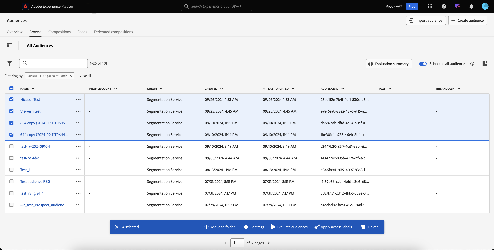

# オーディエンスポータルの概要

オーディエンスポータルは、Adobe Experience Platform内の中央ハブで、オーディエンスの表示、管理および作成を可能にします。

オーディエンスポータル内では、次のタスクを実行できます。

>[!BEGINSHADEBOX]

- [オーディエンスのリストの表示](#list)
   - [オーディエンスに対するクイックアクションの使用](#quick-actions)
   - [オーディエンスのリストに表示されるプロパティをカスタマイズします](#customize)
   - [フィルター、フォルダー、タグを使用したオーディエンスの整理](#manage-audiences)
- [オーディエンスに関する詳細の表示](#audience-details)
   - [オーディエンスに関する概要の表示](#audience-summary)
- [スケジュールされたセグメント化に対してオーディエンスを有効にする](#scheduled-segmentation)
- [オーディエンスの作成](#create-audience)
   - [セグメントビルダーを使用したオーディエンスの作成](#segment-builder)
   - [オーディエンス構成を使用したオーディエンスの作成](#audience-composition)
   - [Federated Audience コンポジションを使用すると、既存のデータウェアハウスのデータを使用してオーディエンスを作成できます](#fac)
   - [Data Distillerを使用したオーディエンスの作成](#data-distiller)
- [外部で生成されたオーディエンスのインポート](#import-audience)

>[!ENDSHADEBOX]

Audience Portal を開くには、「セグメント化」セクションの「**[!UICONTROL Browse]**」タブを選択します。

## オーディエンスリスト {#list}

>[!CONTEXTUALHELP]
>id="platform_segments_browse_churncolumnname"
>title="チャーン"
>abstract="チャーンは、セグメントジョブが最後に実行された時点と比較して、オーディエンス内で変化しているプロファイルの割合を示します。"

>[!CONTEXTUALHELP]
>id="platform_segments_browse_evaluationmethodcolumnname"
>title="評価方法"
>abstract="オーディエンスの評価方法には、バッチ、ストリーミング、エッジが含まれます。"

デフォルトでは、Audience Portal には、プロファイル数、接触チャネル、作成日、最終変更日、タグ、分類など、組織およびサンドボックス内のすべてのオーディエンスのリストが表示されます。

### クイックアクション {#quick-actions}

各オーディエンスの横には省略記号アイコンが表示されます。これを選択すると、オーディエンスで使用可能なクイックアクションのリストが表示されます。このアクションのリストは、オーディエンスの接触チャネルに基づいて異なります。

![&#x200B; クイックアクションリストは、接触チャネルが [!UICONTROL Audience composition] のオーディエンスに対して表示されます。](../images/ui/audience-portal/browse-audience-composition-details.png)

| アクション | 接触チャネル | 説明 |
| ------ | ------- | ----------- |
| [!UICONTROL Edit] | セグメント化サービス | セグメントビルダーを開いてオーディエンスを編集します。 なお、API を使用してオーディエンスを作成した場合は、セグメントビルダーを使用して編集することは **できません**。 セグメントビルダーの使用について詳しくは、[セグメントビルダー UI ガイド](./segment-builder.md)を参照してください。 |
| [!UICONTROL Open composition] | オーディエンス構成 | オーディエンス構成を開いてオーディエンスを表示します。 オーディエンス構成について詳しくは、[オーディエンス構成 UI ガイド](./audience-composition.md)を参照してください。 |
| [!UICONTROL Activate to destination] | セグメント化サービス | 宛先に対してオーディエンスをアクティブ化します。 オーディエンスを宛先に対してアクティブ化する方法について詳しくは、[アクティブ化の概要](../../destinations/ui/activation-overview.md)を参照してください。 |
| [!UICONTROL Share with partners] | オーディエンス構成、カスタムアップロード、セグメント化サービス | オーディエンスを他のExperience Platform ユーザーと共有します。 この機能について詳しくは、[Segment Match の概要](./segment-match/overview.md)を参照してください。 |
| [!UICONTROL Manage tags] | オーディエンス構成、カスタムアップロード、セグメント化サービス | オーディエンスに属する、ユーザー定義のタグを管理します。 この機能について詳しくは、[フィルタリングとタグ付け](#manage-audiences)に関する節を参照してください。 |
| [!UICONTROL Move to folder] | オーディエンス構成、カスタムアップロード、セグメント化サービス | オーディエンスが属するフォルダーを管理します。 この機能について詳しくは、[フィルタリングとタグ付け](#manage-audiences)に関する節を参照してください。 |
| [!UICONTROL Copy] | セグメント化サービス | 選択したオーディエンスを複製します。 この関数について詳しくは、[&#x200B; セグメント化に関する FAQ](../faq.md#copy) を参照してください。 |
| [!UICONTROL Apply access labels] | オーディエンス構成、カスタムアップロード、セグメント化サービス | オーディエンスに属するアクセスラベルを管理します。 アクセスラベルについて詳しくは、[ラベルの管理](../../access-control/abac/ui/labels.md)に関するドキュメントを参照してください。 |
| [!UICONTROL Publish] | カスタムアップロード、セグメント化サービス | 選択したオーディエンスを公開します。 ライフサイクルステータス管理について詳しくは、[&#x200B; セグメント化に関する FAQ のライフサイクルステータスの節 &#x200B;](../faq.md#lifecycle-states) を参照してください。 |
| [!UICONTROL Deactivate] | カスタムアップロード、セグメント化サービス | 選択したオーディエンスをアクティベート解除します。 オーディエンスをディアクティベートするには、**任意** の宛先（Experience Platform以外の宛先を含む **でアクティブ化することも** 任意の **他のオーディエンスの一部とすることも** できません。 ライフサイクルステータス管理について詳しくは、[&#x200B; セグメント化に関する FAQ のライフサイクルステータスの節 &#x200B;](../faq.md#lifecycle-states) を参照してください。 |
| [!UICONTROL Delete] | オーディエンス構成、カスタムアップロード、セグメント化サービス | 選択したオーディエンスを削除します。 ダウンストリームの宛先で使用されているオーディエンス、または他のオーディエンスに依存しているオーディエンス **削除できません**。 オーディエンスの削除について詳しくは、[&#x200B; セグメント化に関する FAQ](../faq.md#lifecycle-states) を参照してください。 |
| [!UICONTROL Add to package] | オーディエンス構成、カスタムアップロード、セグメント化サービス | サンドボックス間でオーディエンスを移動します。 この機能について詳しくは、[&#x200B; サンドボックスツールガイド &#x200B;](../../sandboxes/ui/sandbox-tooling.md) を参照してください。 |

>[!IMPORTANT]
>
>オーディエンスを削除する前に、オーディエンスがアカウントベースのオーディエンスのコンポーネントとして使用されていないか **Adobe Journey Optimizerで使用されていないことを** 確認してください。

ページの上部には、すべてのオーディエンスをスケジュールに追加するオプション、オーディエンスをインポートするオプション、新しいオーディエンスを作成するオプション、オーディエンス評価の概要を表示するオプションがあります。

**[!UICONTROL Schedule all audiences]** を切り替えると、スケジュールされたセグメント化が有効になります。 スケジュールされたセグメント化について詳しくは、[このユーザーガイドの「スケジュールされたセグメント化」の節](#scheduled-segmentation)を参照してください。

「**[!UICONTROL Import audience]**」を選択すると、外部で生成されたオーディエンスを読み込むことができます。 オーディエンスのインポートについて詳しくは、[&#x200B; ユーザーガイドのオーディエンスのインポート &#x200B;](#import-audience) の節を参照してください。

**[!UICONTROL Create audience]** を選択すると、オーディエンスを作成できます。 オーディエンスの作成について詳しくは、[このユーザーガイドの「オーディエンスの作成」の節](#create-audience)を参照してください。

**[!UICONTROL Evaluation summary]** を選択すると、オーディエンスの評価の概要を示す円グラフを表示できます。

円グラフが表示され、オーディエンス評価別にオーディエンスの分類が表示されます。 グラフには、途中のオーディエンスの合計数と、毎日のバッチ評価時間が UTC 単位で下部に表示されます。 オーディエンスの異なる部分にポインタを合わせると、各更新頻度タイプに属するオーディエンスの数が表示されます。

### カスタマイズ {#customize}

 を選択することで、オーディエンスポータルにフィールドを追加できます。 追加のフィールドには、ライフサイクルステータス、更新頻度、最終更新者、説明、作成者、アクセスラベルなどがあります。

| フィールド | 説明 |
| ----- | ----------- |
| [!UICONTROL Name] | オーディエンスの名前。 |
| [!UICONTROL Profile count] | オーディエンスに適合するプロファイルの合計数。 |
| [!UICONTROL Origin] | オーディエンスの接触チャネル。これは、オーディエンスがどこから来たかを示します。使用可能な値は [&#x200B; セグメント化サービス &#x200B;](#segment-builder)、[&#x200B; カスタムアップロード &#x200B;](#import-audience)、[&#x200B; オーディエンス構成 &#x200B;](#audience-composition)、[Audience Manager](https://experienceleague.adobe.com/en/docs/audience-manager/user-guide/aam-home)、[&#x200B; 類似オーディエンス &#x200B;](../types/lookalike-audiences.md)、[&#x200B; フェデレーション オーディエンス構成 &#x200B;](#fac)、[Customer Journey Analytics](https://experienceleague.adobe.com/en/docs/analytics-platform/using/cja-overview/cja-overview) [、&lbrace; データDistiller](#data-distiller)、[AJO B2B](https://experienceleague.adobe.com/ja/docs/journey-optimizer-b2b/user/guide-overview)、[Real-Time CDP Collaboration](https://experienceleague.adobe.com/en/docs/real-time-cdp-collaboration/using/destinations/experience-platform#audience-portal) です。 |
| [!UICONTROL Lifecycle status] | オーディエンスのステータス。このフィールドの可能な値には、`Draft`、`Inactive`、`Published` などがあります。 様々な状態の意味や、オーディエンスを様々なライフサイクル状態に移動する方法など、ライフサイクルのステータスについて詳しくは、[&#x200B; セグメント化に関する FAQ のライフサイクルステータスに関する節 &#x200B;](../faq.md#lifecycle-status) を参照してください。 |
| [!UICONTROL Update frequency] | オーディエンスのデータが更新される頻度を示す値。このフィールドの可能な値には、[!UICONTROL Batch]、[!UICONTROL Streaming]、[!UICONTROL Edge]、[!UICONTROL Not Scheduled] などがあります。 |
| [!UICONTROL Last updated by] | オーディエンスを最後に更新したユーザーの名前。 |
| [!UICONTROL Created] | オーディエンスが作成された日時（UTC）。 |
| [!UICONTROL Last updated] | オーディエンスが最後に作成された日時（UTC）。 |
| [!UICONTROL Tags] | オーディエンスに属するユーザー定義のタグ。これらのタグについて詳しくは、[タグのセクション](#tags)を参照してください。 |
| [!UICONTROL Description] | オーディエンスの説明。 |
| [!UICONTROL Created by] | オーディエンスを作成した人物の名前。 |
| [!UICONTROL Access labels] | オーディエンスのアクセスラベル。アクセスラベルを使用すると、データに適用される使用ポリシーに従ってデータセットとフィールドを分類できます。これらのラベルはいつでも適用でき、柔軟にデータ管理方法を選択できます。アクセスラベルについて詳しくは、[ラベルの管理](../../access-control/abac/ui/labels.md)に関するドキュメントを参照してください。 |
| [!UICONTROL Breakdown] | オーディエンスのプロファイルのステータスの分類。このプロファイルのステータスの分類について詳しくは、以下を参照してください。 |

分類を選択すると、ディスプレイには、計算された各プロファイルステータス（[!UICONTROL Realized]、[!UICONTROL Existing]、[!UICONTROL Exiting]）に属するプロファイルの割合を示す棒グラフが表示されます。 さらに、「[!UICONTROL Browse]」タブに表示される分類は、セグメント定義ステータスの最も正確な分類です。 この数値が「[!UICONTROL Overview]」タブに表示されている数値と異なる場合は、「[!UICONTROL Browse]」タブの数値は 1 日に 1 回しか更新されないので、「[!UICONTROL Overview]」タブの数値を正しいソースとして使用する必要があります。

| ステータス | 説明 |
| ------ | ----------- |
| [!UICONTROL Realized] | 前回バッチセグメントジョブを実行してから過去 24 時間に、オーディエンスに対して **選定** されたプロファイルの数です。 |
| [!UICONTROL Existing] | 前回バッチセグメントジョブを実行してから過去 24 時間に、オーディエンスで **残って** いた）プロファイルの数です。 このフィールドは **計算** されるもので、[`segmentMembership` オブジェクトには表示されません &#x200B;](../../xdm/field-groups/profile/segmentation.md)。 |
| [!UICONTROL Exiting] | 前回バッチセグメントジョブを実行してから過去 24 時間に **オーディエンスを離脱** したプロファイルの数です。 |

表示するフィールドを選択した後で、表示される列の幅を変更することもできます。 サイズを変更するには、列間の領域をドラッグするか、サイズを変更する列の  を選択してから **[!UICONTROL Resize column]** を選択します。

### フィルタリング、フォルダー、タグ付け {#manage-audiences}

作業効率を向上させるには、既存のオーディエンスの検索、オーディエンスへのユーザー定義タグの追加、フォルダーへのオーディエンスの格納、表示されたオーディエンスのフィルタリングなどを行います。

#### 検索 {#searching}

[!DNL Unified Search] を使用すると、既存のオーディエンスを最大 9 つの異なる言語で検索できます。

[!DNL Unified Search] を使用するには、下図でハイライト表示されている検索バーに検索する語句を追加します。

サポートされている機能など、[!DNL Unified Search] について詳しくは、[統合検索のドキュメント](https://experienceleague.adobe.com/docs/core-services/interface/services/search-experience-cloud.html)を参照してください。

#### タグ {#tags}

ユーザー定義のタグを追加して、オーディエンスをより適切に説明、検索、管理することができます。

タグを追加するには、タグ付 **[!UICONTROL Manage tags]** するオーディエンスのタグを選択します。

![&#x200B; 指定したオーディエンスに対して「[!UICONTROL Manage tags]」ボタンが選択されている様子 &#x200B;](../images/ui/audience-portal/browse-manage-tags.png)

**[!UICONTROL Manage tags]** ポップオーバーが表示されます。 このポップオーバーで、分類済みまたは未分類のタグを選択できます。

| タグのタイプ | 説明 |
| -------- | ----------- |
| 分類済み | 組織の管理者が作成および管理するタグ。 |
| 未分類 | [!UICONTROL Manage tags] ポップオーバー内に作成されるタグ。 このタイプのタグは誰でも作成または管理できます。 |

![[!UICONTROL Manage tags] ポップオーバーが表示されます。 分類済みまたは未分類を選択するオプションがハイライト表示されます。](../images/ui/audience-portal/create-tag.png)

オーディエンスに添付するすべてのタグを追加したら、「**[!UICONTROL Save]**」を選択します。

![[!UICONTROL Manage tags] ポップオーバーで、追加されたタグがハイライト表示されます。](../images/ui/audience-portal/created-tags.png)

タグの作成と管理について詳しくは、[タグの管理ガイド](../../administrative-tags/ui/managing-tags.md)を参照してください。

#### フォルダー {#folders}

オーディエンスをフォルダー内に配置すると、オーディエンスをより適切に管理できます。

オーディエンスを格納するフォルダーを作成するには、「**[!UICONTROL Create folder]**」を選択します。

>[!NOTE]
>
>別のフォルダー内にいる場合にのみ、フォルダーを作成できます。 つまり、左側のナビゲーションバーでフォルダーを選択し **いる場合、フォルダーを作成** できません **[!UICONTROL All Audiences]**。

ポップオーバーが表示され、新しく作成したフォルダーに名前を付けることができます。 フォルダーに名前を付けた後で「**[!UICONTROL Save]**」を選択して、フォルダーの作成を完了します。 親フォルダーに対して一意の名前 **必須** であることに注意してください。

オーディエンスをフォルダーに移動するには、移動するオーディエンスの **[!UICONTROL Move to folder]** を選択します。

![&#x200B; 特定のオーディエンスに対して「[!UICONTROL Move to folder]」ボタンが選択されている様子 &#x200B;](../images/ui/audience-portal/browse-move-to-folder.png)

「**オーディエンスをフォルダーに移動**」ポップオーバーが表示されます。オーディエンスの移動先のフォルダーを選択し、「**[!UICONTROL Save]**」を選択します。

オーディエンスをフォルダーに追加すると、特定のフォルダーに属するオーディエンスのみを表示するように選択できます。

#### フィルター {#filter}

様々な設定に基づいてオーディエンスをフィルタリングすることもできます。

使用可能なオーディエンスをフィルタリングするには、を選択します。

使用可能なフィルターのリストが表示されます。

| フィルター | 説明 |
| ------ | ----------- |
| [!UICONTROL Origin] | オーディエンスの接触チャネルに基づいてフィルタリングできます。使用可能な値は [&#x200B; セグメント化サービス &#x200B;](#segment-builder)、[&#x200B; カスタムアップロード &#x200B;](#import-audience)、[&#x200B; オーディエンス構成 &#x200B;](#audience-composition)、[Audience Manager](https://experienceleague.adobe.com/en/docs/audience-manager/user-guide/aam-home)、[&#x200B; 類似オーディエンス &#x200B;](../types/lookalike-audiences.md)、[&#x200B; フェデレーション オーディエンス構成 &#x200B;](#fac)、[Customer Journey Analytics](https://experienceleague.adobe.com/en/docs/analytics-platform/using/cja-overview/cja-overview) [、&lbrace; データDistiller](#data-distiller)、[AJO B2B](https://experienceleague.adobe.com/ja/docs/journey-optimizer-b2b/user/guide-overview)、[Real-Time CDP Collaboration](https://experienceleague.adobe.com/en/docs/real-time-cdp-collaboration/using/destinations/experience-platform#audience-portal) です。 |
| [!UICONTROL Has any tag] | タグでフィルタリングできます。**[!UICONTROL Has any tag]** から **[!UICONTROL Has all tags]** まで選択できます。 **[!UICONTROL Has any tag]** を選択すると、フィルターされたオーディエンスに、追加したタグの **いずれか** が含まれます。 **[!UICONTROL Has all tags]** を選択した場合、フィルタリングされたオーディエンスに、追加したタグの **すべて** が含まれている必要があります。 |
| [!UICONTROL Lifecycle status] | オーディエンスのライフサイクルステータスに基づいてフィルタリングできます。使用可能なオプションには、[!UICONTROL Deleted]、[!UICONTROL Draft]、[!UICONTROL Inactive]、[!UICONTROL Published] などがあります。 |
| [!UICONTROL Update frequency] | オーディエンスの更新頻度（評価方法）に基づいてフィルタリングできます。 使用可能なオプションには、[!UICONTROL Batch]、[!UICONTROL Streaming]、[!UICONTROL Edge] があります |
| [!UICONTROL Created by] | オーディエンスを作成したユーザーに基づいてフィルタリングできます。 |
| [!UICONTROL Creation date] | オーディエンスの作成日に基づいてフィルタリングできます。オーディエンスが作成された日時をフィルタリングする日付範囲を選択できます。 |
| [!UICONTROL Modified date] | オーディエンスの最終変更日に基づいてフィルタリングできます。オーディエンスが最後に変更された日時をフィルタリングする日付範囲を選択できます。 |

### 一括アクション {#bulk-actions}

さらに、最大 25 種類のオーディエンスを選択し、これらのオーディエンスに対して様々なアクションを実行できます。 これらのアクションには、[&#x200B; フォルダーへの移動 &#x200B;](#folders)、[&#x200B; タグの編集または適用 &#x200B;](#tags)、[&#x200B; オーディエンスの評価 &#x200B;](#flexible-audience-evaluation)、[&#x200B; アクセスラベルの適用 &#x200B;](../../access-control/abac/ui/labels.md)、[&#x200B; 削除 &#x200B;](#browse) が含まれます。

オーディエンスに一括アクションを適用する場合は、次の条件が適用されます。

- 様々なページからオーディエンスを選択 **できます**。
- 宛先のアクティベーションで使用されているオーディエンスは削除 **できません**。
- フィルターを選択すると、選択したオーディエンス **自動** リセットされます。

#### 柔軟なオーディエンス評価 {#flexible-audience-evaluation}

柔軟なオーディエンス評価を使用すると、セグメント化ジョブをオンデマンドで実行できます。 柔軟なオーディエンス評価の詳細については、[&#x200B; 柔軟なオーディエンス評価ガイド &#x200B;](../methods/flexible-audience-evaluation.md) を参照してください。

## オーディエンスの詳細 {#audience-details}

特定のオーディエンスに関する詳細を表示するには、「オーディ **[!UICONTROL Browse]** ンス」タブをクリックします。

オーディエンスの詳細ページが表示されます。上部には、オーディエンスの概要、適格なオーディエンスサイズに関する情報、セグメントがアクティブ化されている宛先があります。

### オーディエンスの概要 {#audience-summary}

**[!UICONTROL Audience summary]** のセクションには、属性の ID、名前、説明、接触チャネル、詳細などの情報が表示されます。

さらに、オーディエンスを宛先に対してアクティブ化したり、アクセスラベルを適用したり、オーディエンスを編集または更新したりするオプションも提供されます。

「**[!UICONTROL Activate to destination]**」を選択すると、宛先に対するオーディエンスをアクティブ化できます。 宛先へのオーディエンスのアクティブ化について詳しくは、[アクティブ化の概要](../../destinations/ui/activation-overview.md)を参照してください。

「**[!UICONTROL Apply access labels]**」を選択すると、オーディエンスに属するアクセスラベルを管理できます。 アクセスラベルについて詳しくは、[ラベルの管理](../../access-control/abac/ui/labels.md)に関するドキュメントを参照してください。

>[!BEGINTABS]

>[!TAB オーディエンス構成]

![&#x200B; 「[!UICONTROL Open composition]」ボタンがハイライト表示されたオーディエンスの詳細ページが表示されます。](../images/ui/audience-portal/audience-details-open-composition.png)

「**[!UICONTROL Open composition]**」を選択すると、オーディエンス構成でオーディエンスを表示できます。 オーディエンス構成について詳しくは、[オーディエンス構成 UI ガイド](./audience-composition.md)を参照してください。

>[!TAB カスタムアップロード]

![&#x200B; 「[!UICONTROL Update audience]」ボタンがハイライト表示されたオーディエンスの詳細ページが表示されます。](../images/ui/audience-portal/audience-details-update-audience.png)

「**[!UICONTROL Update audience]**」を選択すると、外部で生成されたオーディエンスを再アップロードできます。 外部で生成されたオーディエンスの読み込みについて詳しくは、[オーディエンスの読み込み](#import-audience)に関する節を参照してください。

>[!TAB セグメント化サービス]

![&#x200B; 「[!UICONTROL Edit audience]」ボタンがハイライト表示されたオーディエンスの詳細ページが表示されます。](../images/ui/audience-portal/audience-details-edit-audience.png)

**[!UICONTROL Edit audience]** を選択すると、セグメントビルダーでオーディエンスを編集できます。 [!DNL Segment Builder] ワークスペースの使用について詳しくは、[[!DNL Segment Builder] ユーザーガイド](./segment-builder.md)を参照してください。

>[!ENDTABS]

「**[!UICONTROL Edit properties]**」を選択すると、名前、説明、タグなど、オーディエンスの基本的な詳細を編集できます。

### オーディエンス合計 {#audience-total}

Experience Platform で生成されたオーディエンスおよびコンポジションの場合は、**[!UICONTROL Audience total]** のセクションにオーディエンスに該当するプロファイルの合計数が表示されます。

>[!NOTE]
>
>書き出しジョブが完了した後、オーディエンスの合計数が更新されるまで最大 30 分かかる場合があります。

予測値は、その日のサンプルデータのサンプルサイズを使用して生成されます。プロファイルストアのエンティティ数が 100 万個未満の場合、完全なデータセットが使用されます。エンティティの数が 1～2,000 万の場合は 100 万のエンティティが使用され、2,000 万を超えるエンティティの場合は合計エンティティの 5% が使用されます。 予測値の生成について詳しくは、オーディエンスの作成に関するチュートリアルの[予測値の生成に関する節](../tutorials/create-a-segment.md#estimate-and-preview-an-audience)を参照してください。

### 取り込みの詳細 {#ingestion-details}

オリジンが **[!UICONTROL Custom upload]** のオーディエンスの場合、**[!UICONTROL Ingestion details]** の節には、プロファイルの合計と、外部で生成されたオーディエンスが取り込まれたデータセットの詳細の両方が表示されます。

>[!NOTE]
>
>書き出しジョブの後、オーディエンスのプロファイル数が完全に更新されるまで最大 30 分かかる場合があります。

| プロパティ | 説明 |
| -------- | ----------- |
| プロファイル数 | オーディエンスに適合するプロファイルの合計数。 |
| データセット名 | オーディエンスが取り込まれたデータセットの名前。 データセット名を選択すると、データセットの詳細を確認できます。 データセットについて詳しくは、[&#x200B; データセット UI ガイド &#x200B;](../../catalog/datasets/user-guide.md) を参照してください。 |
| データセットバッチ | オーディエンスが取り込まれたデータセットの ID。 バッチの詳細を表示するには、バッチの ID を選択します。 バッチについて詳しくは、[&#x200B; データ取り込みの監視ガイド &#x200B;](../../ingestion/quality/monitor-data-ingestion.md#viewing-batches) を参照してください。 |
| プロファイルバッチ | Experience Platformでプロファイルを作成したバッチの ID。 バッチの詳細を表示するには、バッチの ID を選択します。 バッチについて詳しくは、[&#x200B; データ取り込みの監視ガイド &#x200B;](../../ingestion/quality/monitor-data-ingestion.md#viewing-batches) を参照してください。 |
| スキーマ | オーディエンスが属するスキーマの名前。 スキーマの名前を選択して、スキーマの構造に関する情報を表示し、データ使用ラベルを適用できます。 詳しくは、[&#x200B; スキーマガイドのデータ使用ラベルの管理 &#x200B;](../../xdm/tutorials/labels.md) を参照してください。 |
| 取り込まれたレコード | データセットに取り込まれたレコードの数。 |
| 失敗したレコード | データセットに取り込むことができなかったレコードの数。 |
| 新しいプロファイルフラグメント | 作成された新しいプロファイルの数。 |
| 既存のプロファイルフラグメント | 更新された既存のプロファイルの数。 |

>[!NOTE]
>
>データ使用ラベルをスキーマに適用することが、ベストプラクティスです。 データ使用ラベルをオーディエンスに直接適用することはできま **ん**。

### アクティブ化された宛先 {#activated-destinations}

「**[!UICONTROL Activated destinations]**」セクションには、このオーディエンスがアクティブ化されている宛先が表示されます。

>[!NOTE]
>
> 宛先は、[!DNL Adobe Real-Time Customer Data Platform] で使用可能な機能で、データを外部プラットフォームに書き出すことができます。宛先について詳しくは、[宛先の概要](../../destinations/home.md)を参照してください。宛先へのセグメントをアクティブ化する方法については、[アクティベーションの概要](../../destinations/ui/activation-overview.md)を参照してください。

### プロファイルのサンプル {#profile-samples}

その下には、セグメントに適したプロファイルのサンプリングがあり、[!DNL Profile] ID、名、姓、個人のメールなどの詳細情報が示されています。

データサンプリングをトリガーする方法は、取り込み方法によって異なります。

バッチ取り込みの場合、プロファイルストアは 15 分ごとに自動的にスキャンされ、最後のサンプリングジョブが実行されてから新しいバッチが正常に取り込まれたかどうかが確認されます。 その場合、続いてプロファイルストアがスキャンされ、レコード数に 3% 以上の変化があったかどうかが確認されます。 これらの条件が満たされると、新しいサンプリングジョブがトリガーされます。

ストリーミング取り込みの場合、プロファイルストアは 1 時間ごとに自動的にスキャンされ、レコード数に少なくとも 3% の変化があったかどうかが確認されます。 この条件が満たされると、新しいサンプリングジョブがトリガーされます。

スキャンのサンプルサイズは、プロファイルストア内のエンティティの合計数によって異なります。 これらのサンプルサイズを次の表に示します。

| プロファイルストアのエンティティ | サンプルサイズ |
| ------------------------- | ----------- |
| 100 万未満 | フルデータセット |
| 100 万～2000 万 | 100 万 |
| 2000 万以上 | 全体の 5% |

[!DNL Profile] ID を選択すると、各 [!DNL Profile] に関する詳細情報を確認できます。プロファイルの詳細については、[[!DNL Real-Time Customer Profile] ユーザーガイド](../../profile/ui/user-guide.md#profile-detail)を参照してください。

## スケジュールされたセグメント化 {#scheduled-segmentation}

>[!CONTEXTUALHELP]
>id="platform_segments_browse_addallsegmentstoschedule"
>title="スケジュールへのすべてのオーディエンスの追加"
>abstract="毎日のスケジュール済みアップデートに、バッチセグメント化を使用して評価されたすべてのオーディエンスを含めることを有効にします。無効にすると、スケジュール済みアップデートからすべてのオーディエンスが削除されます。"

オーディエンスを作成したら、オンデマンド評価またはスケジュール済みの（継続的な）評価でオーディエンスを評価できます。評価とは、対応するオーディエンスを生成するためにセグメントジョブを通じて [!DNL Real-Time Customer Profile] データを移動することを意味します。作成したオーディエンスは、[!DNL Experience Platform] API を使用して書き出せるように保存されます。

オンデマンド評価では、API を使用して評価を実行し、必要に応じてオーディエンスを作成します。一方、スケジュール済みの評価（「スケジュール済みのセグメンテーション」とも言います）では、反復スケジュールを作成して特定の時間（最大 1 日に 1 回）でオーディエンスを評価します。

### スケジュールに沿ったセグメント化を有効にする {#enable-scheduled-segmentation}

オーディエンスのスケジュール済みの評価を有効にするには、UI または API を使用します。UI で、「**[!UICONTROL Browse]**」内の「**[!UICONTROL Audiences]**」タブに戻り、「**[!UICONTROL Schedule all audiences]**」をオンにします。 これで、すべてのオーディエンスが組織で設定したスケジュールに沿って評価されます。

>[!NOTE]
>
>[!DNL XDM Individual Profile] の最大 5 つの結合ポリシーを備えたサンドボックスに対して、スケジュールされた評価を有効にできます。組織で、1 つのサンドボックス環境内に [!DNL XDM Individual Profile] の結合ポリシーが 6 つ以上ある場合は、スケジュールされた評価を使用できません。

現在、スケジュールを作成するには API を使用する必要があります。API を使用してスケジュールを作成、編集、操作する手順について詳しくは、セグメント化の結果の評価とアクセスに関するチュートリアル（特に、[API を使用するスケジュール済みの評価](../tutorials/evaluate-a-segment.md#scheduled-evaluation)に関する節）を参照してください。

## オーディエンスの作成 {#create-audience}

**[!UICONTROL Create audience]** を選択して、オーディエンスを作成できます。

ポップオーバーが表示され、オーディエンスを作成するか、ルールを作成するかを選択できます。

### オーディエンス構成 {#audience-composition}

「**[!UICONTROL Compose audiences]**」を選択すると、オーディエンス構成に移動します。 このワークスペースには、オーディエンスを作成および編集するための直感的なコントロール（様々なアクションの表示に使用するドラッグ＆ドロップタイルなど）が含まれています。オーディエンスの作成について詳しくは、[オーディエンス構成ガイド](./audience-composition.md)を参照してください。

### セグメントビルダー {#segment-builder}

「**[!UICONTROL Build rule]**」を選択すると、セグメントビルダーに移動します。 このワークスペースには、セグメント定義を作成および編集するための直感的なコントロール（データプロパティの表示に使用するドラッグ＆ドロップタイルなど）が含まれています。セグメント定義の作成について詳しくは、[セグメントビルダーガイド](./segment-builder.md)を参照してください。

### 連合オーディエンス構成 {#fac}

Adobe Federated Audience Composition を使用すると、基になるデータをコピーすることなく、エンタープライズデータセットから新しいオーディエンスを作成し、それらのオーディエンスをAdobe Experience Platform Audience ポータルに保存できます。

また、Enterprise Data Warehouse からフェデレーションされた作成済みオーディエンスデータを利用して、Adobe Experience Platformの既存のオーディエンスを強化することもできます。 [連合オーディエンス構成](https://experienceleague.adobe.com/ja/docs/federated-audience-composition/using/home)に関するガイドを参照してください。

### Data Distiller {#data-distiller}

SQL 拡張機能を使用した Data Distillerを使用して、データレイクからオーディエンスを作成できます。 このデータには、顧客属性や製品情報などの既存のディメンションエンティティが含まれます。

Data Distillerについて詳しくは、[SQL を使用したオーディエンスの構築ガイド &#x200B;](../../query-service/data-distiller-audiences/overview.md) を参照してください。

## オーディエンスの読み込み {#import-audience}

>[!CONTEXTUALHELP]
>id="platform_segmentation_importaudience_dataexpiration"
>title="データの有効期限"
>abstract="オーディエンスメンバーシップが期限切れになる日数。この値は、1 日から 90 日の間で設定できます。オーディエンスメンバーシップの有効期限が切れると、評価は停止し、すべてのプロファイルはオーディエンスメンバーシップを終了します。オーディエンスメンバーシップの残り日数が 7 日未満の場合は、有効期限ウィンドウを更新できます。ただし、残り日数が 0 日になると、有効期限ウィンドウを更新できなくなります。"

>[!IMPORTANT]
>
>外部で生成されたオーディエンスを読み込むには、**、** および [!UICONTROL View segments] の権限が必要です [!UICONTROL Manage segments] 必須 [!UICONTROL Import audience]。 これらの権限について詳しくは、[&#x200B; アクセス制御の概要 &#x200B;](../../access-control/home.md#permissions) を参照してください。

**[!UICONTROL Import audience]** を選択して、外部で生成されたオーディエンスを読み込むことができます。

**[!UICONTROL Import audience CSV]** ワークフローが表示されます。 CSV ファイルを選択して、外部で生成されたオーディエンスとして読み込むことができます。

![[!UICONTROL Import audience CSV] のワークフローでは、[!UICONTROL Drag and drop files] ボックスがハイライト表示され、外部で生成されたオーディエンスをアップロードできる場所が表示されます。](../images/ui/audience-portal/import-audience-csv.png)

>[!NOTE]
>
>外部生成オーディエンスは CSV 形式で、**最大** 25 列かつ 1 GB 未満にする&#x200B;**必要があります**。
>
>また、CSV の最初の行または関連する列には、スペースやダッシュを使用 **できません**。
>
>例えば、最初の行の値は「FirstName」または「First_Name」にすることができますが、「First Name」または「First-Name」にすることはできません。

読み込む CSV ファイルを選択すると、この外部で生成されたオーディエンスのサンプルデータのリストが表示されます。サンプルデータが正しいことを確認したら、「**[!UICONTROL Next]**」を選択します。

**[!UICONTROL Audience details]** ページが表示されます。 オーディエンスに関する情報（名前、説明、プライマリ ID、ID 名前空間の値など）を追加できます。

外部で生成されたオーディエンスを読み込む場合は、いずれかの列をプライマリ ID フィールドとして選択し、名前空間値を指定する必要があります。 残りのすべてのフィールドは **ペイロード属性** と見なされることに注意してください。 これらの属性は、パーソナライゼーションの目的でのみオーディエンスに関連付けられ、プロファイルには **接続されない** ので、**永続的ではない** と見なされます。

![[!UICONTROL Audience details] ページが表示されます。](../images/ui/audience-portal/import-audience-audience-details.png)

また、オプションで、外部 ID の付与、結合ポリシーの定義、列データタイプの編集、カスタムデータの有効期限の適用など、外部で生成されたオーディエンスにいくつかの追加の詳細を追加できます。

+++ カスタム外部オーディエンス ID

>[!NOTE]
>
>カスタムの外部オーディエンス ID を使用する場合は、次のガイドラインに従う必要があります。
>
> - 文字 **a ～ z または A ～ Z**、アンダースコア（_）、ドル記号（$）で始める必要があります。
> - 以降の文字はすべて、英数字（a ～ z、A ～ Z、0 ～ 9）、アンダースコア （_）、ドル記号（$）にすることができます。

+++

>[!NOTE]
>
>カスタムデータの有効期限は、プロファイルがオーディエンスメンバーシップに **残る** 日数を設定します。 データの有効期限が切れた後、プロファイルはオーディエンスメンバーシップを終了します。 この値は、1 ～ 90 日の範囲で設定できます。

オーディエンスの詳細を入力したら、「**[!UICONTROL Next]**」を選択します。

![[!UICONTROL Next] ページで「[!UICONTROL Audience details]」ボタンがハイライト表示されている様子 &#x200B;](../images/ui/audience-portal/import-audience-filled-details.png)

**[!UICONTROL Review]** ページが表示されます。 新しく読み込んだ外部生成オーディエンスの詳細を確認できます。

![[!UICONTROL Review] ページが表示され、新しく読み込んだ外部で生成されたオーディエンスの詳細が表示されます。](../images/ui/audience-portal/import-audience-review-details.png)

詳細が正しいことを確認したら、「**[!UICONTROL Finish]**」を選択して、外部で生成されたオーディエンスをAdobe Experience Platformに読み込みます。

>[!IMPORTANT]
>
>デフォルトでは、外部で生成されたオーディエンスのデータ有効期限は 30 日です。 オーディエンスが更新または変更された場合、データの有効期限はリセットされます。
>
>さらに、外部で生成されたオーディエンスに機密情報や医療関連の情報が含まれている場合は、任意の宛先に対してアクティブ化する前に、必要なデータ使用ラベルを適用する **必要があります**。 外部で生成されたオーディエンスの変数は、リアルタイム顧客プロファイル内ではなくデータレイクに保存されるので、CSV ファイル内に同意データを含める **しないでください**。
>
>データ使用ラベルの適用について詳しくは、[&#x200B; ラベルの管理 &#x200B;](../../access-control/abac/ui/labels.md) に関するドキュメントを参照してください。 Experience Platformのデータ使用ラベル全般について詳しくは、[&#x200B; データ使用ラベルの概要 &#x200B;](../../data-governance/labels/overview.md) を参照してください。 外部で生成されたオーディエンスでの同意の仕組みについては、[&#x200B; オーディエンスに関する FAQ](../faq.md#consent) を参照してください。

## 次の手順

この概要を読むと、オーディエンスポータルを使用して、オーディエンスを効果的に管理、作成し、Adobe Experience Platformに読み込めるようになります。

セグメント化サービス UI の使用方法の詳細については、[セグメント化サービス UI の概要](./overview.md)を参照してください。

Audience Portal に関するよくある質問については、[&#x200B; よくある質問 &#x200B;](../faq.md) を参照してください。
