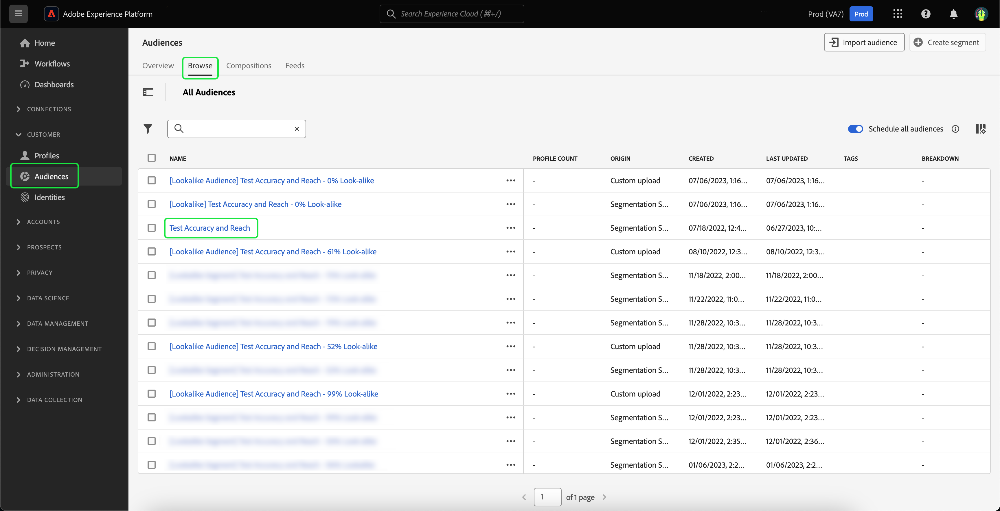

# 類似オーディエンスガイド

>[!IMPORTANT]
>
>類似インサイトおよび類似オーディエンスは、 **限られた可用性**.

Adobe Experience Platformでは、類似オーディエンスは、機械学習ベースのインサイトを活用して、価値の高い顧客を特定しマーケティングキャンペーンでターゲット化し、各オーディエンスに関するインテリジェントなインサイトを提供します。

類似オーディエンスを使用すると、パフォーマンスの高いオーディエンスに類似した顧客をターゲットにしたり、以前にコンバージョンされたオーディエンスに類似した顧客をターゲットにしたりする、拡張オーディエンスを作成できます。

## 用語 {#terminology}

類似オーディエンスの使用を開始する前に、次の概念を理解しておく必要があります。

- **ベースオーディエンス**：ベースオーディエンスは、より多くのインサイトを見つけたいオーディエンスです。 類似 (look-alike) モデルが適用されるオーディエンスです。 **ベース** オン。
- **類似モデル**：類似モデルは、顧客の入力なしで、すべての適格なベースオーディエンスに基づいてトレーニングされる機械学習モデルです。 類似した各モデルは、影響を与える要因と類似性グラフを作成します。 類似モデルでは次のことが行われます。 **not** 得点を得る。
- **類似オーディエンス**：類似オーディエンスとは、選択した類似性しきい値を持つ類似モデルがベースオーディエンスに適用されたときに作成されるオーディエンスです。 同じ類似モデルを使用して、複数の類似オーディエンスを作成できます。 類似オーディエンスは、スコアが割り当てられるものです。
- **アドレス可能なオーディエンスの合計サイズ**：アドレス可能なオーディエンスの合計サイズは、過去 30 日間のプロファイルの合計数から過去 30 日間のベースオーディエンス母集団を引いた数です。 例えば、顧客の過去 30 日間に 1,000 万件のプロファイルがあり、基本オーディエンスの過去 30 日間に 100 万件のプロファイルがある場合、アドレス可能なオーディエンスの合計サイズは 900 万件のプロファイルになります。

## 類似モデルの詳細 {#details}

>[!CONTEXTUALHELP]
>id="platform_audiences_lookAlike_notEligible"
>title="不適格"
>abstract="このオーディエンスは、現在、トレーニングに必要な最小数のプロファイル数を下回っているか、またはプロファイルの書き出しがまだトリガーされていないので、類似インサイトに不適格です。"

>[!CONTEXTUALHELP]
>id="platform_audiences_lookAlike_processing"
>title="処理中"
>abstract="このオーディエンスは現在処理中です。モデルの処理が完了するまでに最大 24 時間かかる場合があります。後でもう一度確認してください。"

>[!CONTEXTUALHELP]
>id="platform_audiences_lookAlike_error"
>title="エラー"
>abstract="このモデルの処理中にエラーが発生しました。このモデルを削除して再作成するか、後でもう一度試してください。"

Adobe Experience Platformでは、類似 (look-alike) モデルは、次の 3 種類のデータポイントを使用します。

- 過去 30 日間のオーディエンスメンバーシップ
- リアルタイム顧客プロファイルに取り込まれた過去 30 日間のエクスペリエンスイベント
- 過去 30 日間のリアルタイム顧客プロファイルに取り込まれたプロファイル属性

これらのデータポイントはすべて、類似 (look-alike) モデルに入力されるキー値ペアに変換されます。 一致するプロファイルの大きな割合を持つキー値ペアのみが保持されます。

現時点では、類似モデルは 24 時間ごとに実行され、ベースオーディエンスの影響を与える要因と類似性グラフを作成および再作成します。 類似オーディエンスのスコアリングも頻繁に実行されます。

## 権利 {#entitlements}

類似 (look-alike) オーディエンスの使用には、次の使用権限が適用されます。

- Real-Time CDP Prime のお客様には、次の権限が付与されます。 **5** 実稼働サンドボックス内のアクティブな類似オーディエンス
- Real-Time CDP Ultimate のお客様には、次の権限が付与されます。 **20** 実稼働サンドボックス内のアクティブな類似オーディエンス
- 開発サンドボックスは次に制限されています： **5** すべてのReal-Time CDPのお客様向けの類似オーディエンス

アドオンパック（後日利用可能になる予定）は、1 パックあたり 20 人の類似オーディエンスにより、実稼動用サンドボックスの使用権限を増やします。

類似オーディエンスへのアクセス権があるかどうかを確認するには、Adobe担当者にお問い合わせください。

## 類似のインサイトを表示 {#view}

類似のインサイトは、オーディエンスの詳細ページに組み込まれています。 オーディエンスの類似のインサイトを確認するには、「 **[!UICONTROL オーディエンス]** 左側のナビゲーションバーで、 **[!UICONTROL 参照]**、およびインサイトを表示するオーディエンス。

オーディエンスの詳細ページが表示されます。選択 **[!UICONTROL 類似のインサイト]** 」タブを使用して、オーディエンスの類似インサイトを表示します。 The **[!UICONTROL 類似のインサイト]** ページが表示されます。 このページには、類似性およびリーチグラフ、類似オーディエンス、影響要因という 3 つの主な要素があります。

### 類似性とリーチ {#similarity-and-reach}

>[!CONTEXTUALHELP]
>id="platform_audiences_lookAlike_similarityAndReach"
>title="類似性とリーチ"
>abstract="類似性およびリーチグラフでは、特定の類似性スコアを上回るプロファイルから構成される、類似オーディエンスの予想リーチを図にします。グラフ内の特定のポイントにポインターを合わせると、現在ハイライト表示されているポイントの類似率および予想プロファイル数が表示されます。"

「類似性とリーチ」セクションには、特定の類似性スコアを上回るプロファイルから成る、類似 (look-alike) オーディエンスの予想リーチを示すグラフが表示されます。 類似性スコアは、 **距離** の類似性に関する情報を含みます。

このグラフでは、x 軸は、プロファイルと選択したオーディエンスのメンバー間の類似率を測定します。 類似性スコアは 0%から 100%の範囲です。類似性スコアが高いほど、選択したオーディエンスのメンバーに対して、影響力のある要因値の点でプロファイルが近いことを示します。

y 軸は、x 軸の一致値に対応する類似性の割合を持つプロファイルの予想数を示します。 この予想されるプロファイル数の範囲は、0 からアドレス可能なオーディエンスの合計サイズまたは 2,500 万のプロファイルのいずれか小さい方の数です。 この軸は、 **対数尺度** グラフの可読性を向上させる。

グラフは **累積** 右から左に つまり、グラフの任意の時点での y 軸の値が、類似性を持つプロファイルの数になります **上** 類似性のしきい値。 例えば、x 軸が 60%で y 軸が 1,000 万の場合、1,000 万のプロファイルが基本オーディエンスとの類似性が 60%以上あることを意味します。

グラフ内の特定のポイントにポインターを合わせると、現在ハイライト表示されているポイントの類似率および予想プロファイル数が表示されます。

### 類似オーディエンス {#list}

「類似オーディエンス」セクションには、選択したベースオーディエンス用に以前に作成されたすべての類似オーディエンスのリストが表示されます。

### 影響を与える要因 {#influential-factors}

>[!CONTEXTUALHELP]
>id="platform_audiences_lookAlike_influentialFactors"
>title="影響を与える要因"
>abstract="影響を与える要因は、属性、イベントおよびオーディエンスのメンバーシップで、基本オーディエンスのメンバーに対するプロファイルの類似性を説明する際に重要です。 データ使用ラベルとポリシーを使用すると、類似モデルで特定のデータが影響を与える要因と見なされるのを除外できます。"
>additional-url="https://experienceleague.adobe.com/docs/experience-platform/segmentation/ui/lookalike-audiences.html#exclude" text="データを除外"

影響要因セクションには、選択したベースオーディエンスの類似モデルに影響する上位 100 件の要因が表示されます。 これらの影響を及ぼす要因は、プロファイル属性、エクスペリエンスイベント、およびベースオーディエンスの類似性を説明する際に最も重要なオーディエンスのメンバーシップです。 最も影響を及ぼす要因を把握することで、このオーディエンスと、そこから作成する類似オーディエンスのマーケティングコンテンツをより適切にパーソナライズできます。 類似 (look-alike) モデルに影響を与える影響を与える要因がすべて表示されるわけではありません。

数値である影響を与える要因の場合、キーの値のペアは、キーの異なる値の数に応じて、グループに入れられる場合があります。 例えば、 `income`の場合、多くの一意の値が存在する可能性が高くなります。 その結果、キーと値のペアは、次のような形式のグループに配置されます `income=[0 -> 30000]`, `income=[30000 -> 50000]`、および `income=[50000 -> 100000]`.

データを最新の状態に保つために、これらのグループは定期的に再計算されます。

>[!NOTE]
>
>影響を与える要因は、重要度の順に並べ替えられ、互いに独立しています。

| フィールド | 説明 |
| ----- | ----------- |
| タイプ | 影響要因の派生元となるデータのタイプ。 プロファイル属性、エクスペリエンスイベント、オーディエンスのメンバーシップのいずれかです。 |
| キー | データフィールドの名前。 オーディエンスメンバーシップタイプのキーの場合、この値は **名前空間** データの取得元となるオーディエンスの 以下の値を指定できます。 `ups` （セグメント化サービス）および `AO` (Audience Orchestration) を参照してください。 他のタイプのキーの場合、この値は XDM フィールドのパスを表します。 例えば、Luma の会社に income という名前のカスタムフィールドがある場合、キーは次のようになります。 `_luma.income` |
| 値 | 値は、その値が表す影響要因によって異なります。 プロファイル属性またはエクスペリエンスイベントの場合、このフィールドは、ベースオーディエンスのメンバーとの類似性を示すデータフィールドの値または値の範囲を表します。 値の範囲はフォームに書き込まれます `[A -> B]`です。 `A` は下限範囲を表します。 `B` 高い範囲を表します。 オーディエンスメンバーシップの場合、このフィールドはオーディエンスの名前です。 |
| 重要度 | 影響を与える要因の相対的な重要度です。 高、中、低のいずれかを指定できます。 |

## 類似オーディエンスを作成 {#create}

>[!IMPORTANT]
>
>あなた **できません** 類似オーディエンスを別の類似オーディエンスのベースオーディエンスとして使用する。 つまり君は **できません** チェーンされた類似 (look-alike) オーディエンスを作成します。

類似オーディエンスを作成するには、類似オーディエンスのベースにするオーディエンスを選択する必要があります。 使用可能なオーディエンスのリストにアクセスするには、 **[!UICONTROL オーディエンス]** 左側のナビゲーションバーで、 **[!UICONTROL 参照]**. オーディエンスのリストが表示されます。 このページでは、ベースオーディエンスとして使用するオーディエンスを選択できます。

オーディエンスの詳細ページで、「 」を選択します。 **[!UICONTROL 類似オーディエンスを作成]** をクリックして、類似 (look-alike) オーディエンスの作成プロセスを開始します。

![The [!UICONTROL 類似オーディエンスを作成] ボタンがハイライト表示されます。](../images/ui/lookalike-audiences/create-look-alike-audience.png)

The **[!UICONTROL 類似オーディエンスを作成]** ポップオーバーが表示されます。 このページで、類似 (look-alike) オーディエンスの類似性の割合を設定できます。

![The [!UICONTROL 類似オーディエンスを作成] ポップオーバーが表示されます。](../images/ui/lookalike-audiences/create-audience.png)

この類似性の割合は、次の 3 つの方法で設定できます。

- スライダーを動かして、類似性の割合を設定します。
- スライダーの横にある数値の入力ボックスに、類似性の割合を入力します
- グラフの上にマウスポインターを置いて、目的の場所を選択し、類似性の割合を設定します

また、類似オーディエンスの名前や説明を含め、類似オーディエンスの詳細を更新することもできます。 デフォルトでは、類似 (look-alike) オーディエンスの名前は、ベースオーディエンスの名前と、以前に指定した類似性の割合に基づいて生成されます。

![基本情報は、 [!UICONTROL 類似オーディエンスを作成] ポップオーバー](../images/ui/lookalike-audiences/basic-info.png)

選択 **[!UICONTROL 作成]** をクリックして、類似 (look-alike) オーディエンスの作成を完了します。

![「作成」ボタンが [!UICONTROL 類似オーディエンスを作成] ポップオーバー](../images/ui/lookalike-audiences/create-audience.png)

新しく作成した類似オーディエンスには、 **[!UICONTROL 類似オーディエンス]** 」セクションを開き、Audience Portal で利用したり、他のダウンストリームでの使用にも使用できます。 類似オーディエンスのスコアが割り当てられるまでには、しばらく時間がかかることに注意してください。 スコアが割り当てられるまで、プロファイル数は 0 と表示されます。

## 類似オーディエンスの詳細を表示 {#view-details}

類似オーディエンスの詳細を表示するには、 **[!UICONTROL 類似オーディエンス]** のセクションに含まれている必要があります。

オーディエンスの詳細ページが表示されます。このページの詳細については、 [セグメント化サービス UI ガイドの「オーディエンスの詳細」の節](./overview.md#audience-details).

## 類似 (look-alike) モデリングからデータフィールドを除外 {#exclude}

類似オーディエンスを設定して、「データサイエンス」マーケティングアクションに対して制限されているデータフィールドを除外するには、関連するデータ使用ラベルとポリシーを適用します。 データサイエンスでの使用を制限されているとラベル付けされたデータは、類似オーディエンスモデルをトレーニングする場合、およびトレーニング済みモデルから類似オーディエンスを生成する場合、考慮から削除されます。 

標準の「C9」ラベルは、データサイエンスに使用すべきでないデータにラベルを付けるために使用でき、標準の「データサイエンスを制限」ポリシーを有効にして適用できます。 また、データサイエンスの使用から、機密ラベルを含む他のラベルでデータを制限する追加のポリシーを作成することもできます。 データ使用ポリシーの管理の詳細については、 [データ使用ポリシー UI ガイド](../../data-governance/policies/user-guide.md). データ使用ラベルの管理の詳細については、 [データ使用ラベル UI ガイド](../../data-governance/labels/user-guide.md).

デフォルトでは、類似 (look-alike) オーディエンスのモデリングプロセスによってが除外されます **任意** 組織で有効になっているプライバシーポリシーに基づくフィールド、データセット、オーディエンス。 ベースオーディエンスに契約ラベルがない場合、モデリングプロセスによってが除外されます **任意** 組織で有効になっているプライバシーポリシーに基づくフィールド、データセット、オーディエンス。

注意： **あなた** は、機密データを含むデータに適切なラベルが付けられ、データ使用ポリシーが定義され、運用する法的義務や規制上の義務に準拠できるようにする責任を負います。 また、次のようなデータフィールドまたはセグメントメンバーシップにも注意する必要があります。 **not** 通常、機密データ型や保護されたデータ型に関連付けられるデータフィールドと直接相関する場合、潜在的なバイアスの源になる可能性があります。 **あなた** は、データを分析し、適切なデータ使用ポリシーを識別、ラベル付けし、データに適用します。これには、機密データや保護されたデータタイプの代理となり、モデリングから除外される必要のあるデータフィールドが含まれます。

## 次の手順

このガイドを読んだ後、類似インサイトを表示し、これらのインサイトに基づいて類似オーディエンスを作成する方法を学びました。 Adobe Experience Platform UI のオーディエンスの詳細については、 [セグメント化サービス UI ガイド](./overview.md).
