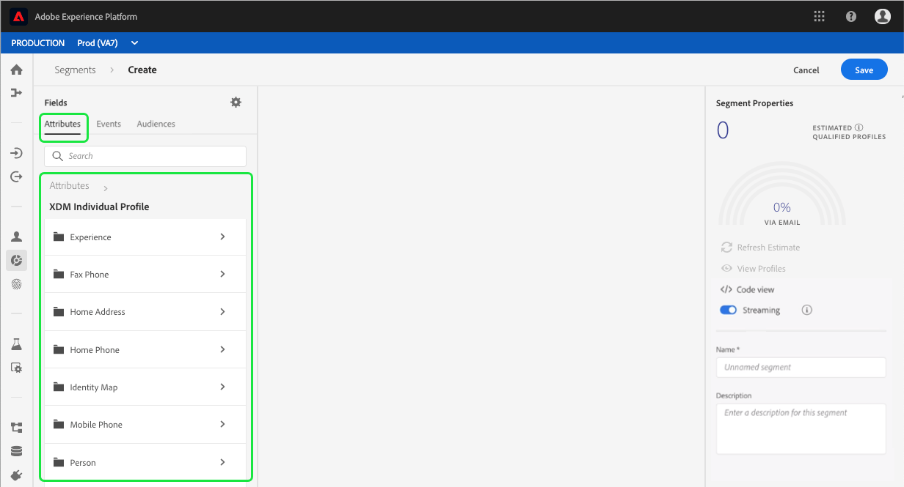
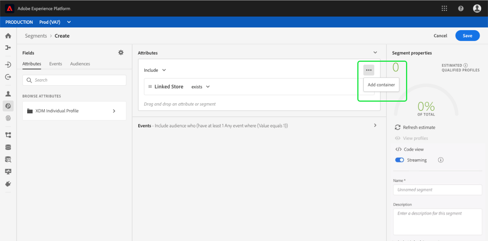
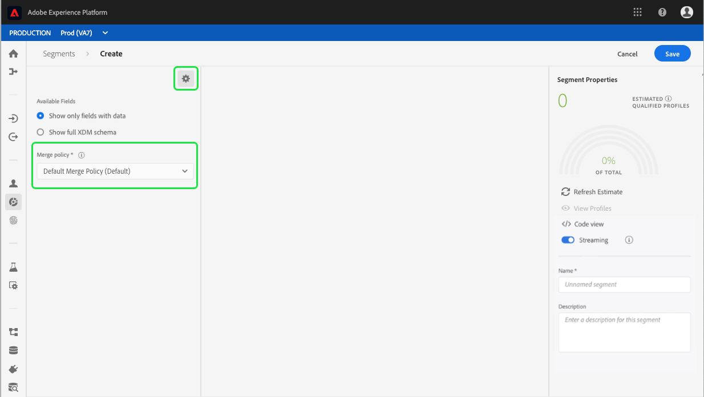
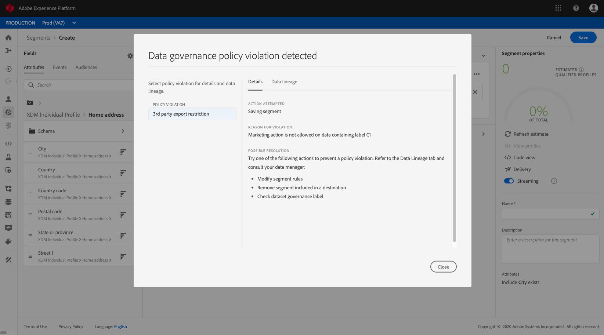

# セグメントビルダーユーザーガイド

Adobe Experience Platform Segmentation Serviceは、リアルタイム顧客データからセグメント定義を作成するためのRESTful APIおよびユーザーインターフェイスをプロファイルします。

## はじめに

セグメントの定義を使用するには、セグメント化に関連する様々なエクスペリエンスプラットフォームサービスを理解する必要があります。 このユーザガイドを読む前に、次のサービスのドキュメントを確認してください。

- [Segmentation Service](../home.md):セグメント化サービスを使用すると、個人(顧客、見込み客、ユーザー、組織など)に関連するエクスペリエンスプラットフォームに保存されたデータを、類似した特性を共有し、マーケティング戦略と同様に対応する小さなグループに分割できます。
- [リアルタイム顧客プロファイル](../../profile/home.md):複数のソースからの集計データに基づいて、統合されたリアルタイムのプロファイルを顧客に提供します。
- [IDサービス](../../identity-service/home.md):異なるデータソースのIDをPlatformに取り込むことで、リアルタイムの顧客プロファイルを有効にします。
- [エクスペリエンスデータモデル(XDM)](../../xdm/home.md):プラットフォームが顧客エクスペリエンスデータを整理する際に使用する標準化されたフレームワーク。

また、このドキュメントを通じて使用される2つの主要用語を知り、それらの違いを理解することも重要です。
- **セグメント定義**:ルールセットは、ルールの主な特性や動作を記述するために使用されるターゲットオーディエンスです。
- **オーディエンス**:セグメント定義の条件を満たすプロファイルの結果セット。

## セグメント定義へのアクセス

Adobe Experience Platformでセグメント定義の操作を開始するには、左側のナビゲーショ **ンで** 「セグメント」をクリックします。 組織のすべてのセグメント定義を表示するには、「参照」タブをクリ *ックし* ます。 この表示リストでは、評価方法、作成日、最終変更日など、セグメント定義に関する情報が表示されます。

評価方法は、ストリーミングまたはバッチのいずれかです。 ストリーミングセグメントは、データがシステムに入ると常に評価されます。 バッチセグメントは、設定されたスケジュールに従って評価されます。

バッチセグメントには、最後の評価日と次の評価日の両方を示す追加情報が表示されます。

右上隅 **の「セグメントを作成** 」をクリックすると、セグメントビルダーワークスペースが開き、セグメント定義の作成を開始できます。

## セグメントビルダのワークスペース

セグメントビルダーは、ワークスペースデータ要素を操作できるリッチプロファイルを提供します。 ワークスペースには、データプロパティを表すために使用するドラッグ&amp;ドロップタイルなど、ルールを作成および編集するための直感的なコントロールが用意されています。

## セグメント定義の構築ブロック

セグメント定義の基本構成要素は、属性と **イベントです******。 さらに、既存のイベントに含まれる属性と **オーディエンスは** 、新しい定義のコンポーネントとして使用できます。

これらの構築ブロックは、セグメントビル *ダーワークスペース* の左側の「フィールド」セクションに表示されます。 *フィールド* には、主要な構築ブロックのそれぞれに対するタブが含まれます。属性 **、**&#x200B;イベント **、**&#x200B;オーディエンス ****。

### 属性

「 **Attributes** 」タブでは、XDM Individualプロファイルクラスに属するプロファイル属性を参照できます。 各フォルダーを展開して、追加の属性を表示できます。各属性は、ワークスペースの中央にあるルールビルダーキャンバスにドラッグできるタイルです。 ルールビ [ルダーのキャンバスについて](#rule-builder-canvas) 、このガイドで後述します。

### イベント

「 **イベント** 」タブでは、XDM ExperienceEventデータ要素を使用して行われたイベントまたはアクションに基づいてオーディエンスを作成できます。 また、セグメントをより迅速に作成できる **ようにする** 、一般的に使用されるイベントの集まりである「イベント」タブにもイベントタイプが表示されます。

ExperienceEvent要素を参照できるだけでなく、要素を検索することもできます。イベントタイプ イベントタイプは、ExperienceEventsと同じコーディングロジックを使用します。XDM ExperienceEventクラスで正しいイベントを検索する必要はありません。 例えば、検索バーを使用して「買い物かご」を検索すると、「AddCart」と「RemoveCart」というイベントタイプが返されます。これは、セグメント定義を作成する際に非常に一般的に使用される2つの買い物かごアクションです。

検索バーに名前を入力すると、どのタイプのコンポーネントでも検索できます。この場合、 [Luceneの検索構文が使用されます](https://docs.microsoft.com/en-us/azure/search/query-lucene-syntax)。 単語全体が入力されると、検索結果が入力され始めます。 例えば、XDMフィールドに基づくルールを作成するには、開始 `ExperienceEvent.commerce.productViews`が検索フィールドに「製品の表示」と入力します。 「product」という単語が入力されると、検索結果が表示され始めます。 各結果には、その結果が属するオブジェクト階層が含まれます。

>[!NOTE] 組織で定義されたカスタムスキーマフィールドが表示され、ルールの作成で使用できるようになるまでに、最大24時間かかる場合があります。

その後、ExperienceEventsやイベントをセグメント定義に簡単にドラッグ&amp;イベントタイプできます。

デフォルトでは、データストアのスキーマフィールドのみが表示されます。 これにはイベントタイプが含まれます。 イベントタイプリストが表示されない場合、またはイベントタイプとして「任意」を選択できる場合は、「フィールド」の横の歯車アイコンをクリックし、「使用可能なフィールド」の下の「 ** XDMスキーマ全体を表示 **」を** 選択します **。 歯車アイコンを再度クリックして「フィールド ** 」タブに戻り、データが含まれているかどうかに関係なく、複数のイベントタイプおよびスキーマフィールドを表示できるようになりました。

### Audiences

「 **オーディエンス** 」タブでは、Adobeオーディエンスマネージャーなどの外部ソースから読み込んだすべてのオーディエンスと、Experience Platform内で作成されたオーディエンスをリストします。

[オーディエンス]タブでは、使用可能なすべてのソースをフォルダのグループとして表示できます。 これらのフォルダをクリックすると、使用可能なサブフォルダとオーディエンスが表示されます。 また、フォルダ構造を表示する（右端の画像のように）フォルダアイコンをクリックし、ツリー内のフォルダ名をクリックすると、フォルダ間を簡単に移動できます。

オーディエンスの横にあⓘる表示の上にカーソルを置くと、そのオーディエンスのID、説明、およびフォルダー階層を含むオーディエンスに関する情報を表示できます。

また、 [Luceneの検索構文を利用した検索バーを使用してオーディエンスを検索するこ](https://docs.microsoft.com/en-us/azure/search/query-lucene-syntax)ともできます。 「 *オーディエンス* 」タブで最上位フォルダを選択すると、検索バーが表示され、そのフォルダ内を検索できます。 検索結果の入力は、単語全体が入力された場合にのみ開始されます。 例えば、という名前のオーディエンスを検索す `Online Shoppers`るには、開始が検索バーに「Online」と入力します。 「Online」という語を完全に入力すると、「Online」という語を含む検索結果が表示されます。

## ルールビルダーキャンバス

セグメント定義とは、セグメント定義の主要な特性や動作を記述するために使用されるターゲットオーディエンスです。 これらのルールは、セグメントビル *ダーの中央にある*、ルールビルダーキャンバスを使用して作成されます。

セグメント定義に新しいルールを追加するには、「フィールド」タブからタイルをド *ラッグし* 、ルールビルダーキャンバスにドロップします。 追加するデータのタイプに応じて、コンテキスト固有のオプションが表示されます。 使用できるデータタイプは次のとおりです。文字列、日付、ExperienceEvent、イベントタイプ、オーディエンス。

### 追加オーディエンス

オーディエンスを「オーディエンス」タブからルールビルダーキャンバスにドラッグ ** &amp;ドロップして、新しいセグメント定義のオーディエンスのメンバーシップを参照できます。 これにより、新しいセグメントルールでオーディエンスのメンバーシップを属性として含めたり除外したりできます。

セグメントビルダーを使用して作成したオーディエンスの場合、オーディエンスを、そのオーディエンスのセグメント定義で使用された一連のルールに変換するオプションが与えられます。 この変換により、ルールロジックのコピーが作成され、元のセグメント定義に影響を与えることなく変更できます。

>[!NOTE] 外部ソースからオーディエンスを追加する場合、参照されるのはオーディエンスのメンバーシップのみです。 このオーディエンスをルールに変換することはできません。したがって、元のオーディエンスの作成に使用されたルールは、新しいセグメント定義で変更できません。

## コンテナ

セグメントルールは、リストに表示される順に評価されます。 コンテナを使用すると、ネストされたパラメーターを使用して、実行の順序を制御できます。クエリ

ルールビルダーキャンバスに少なくとも1つのタイルを追加したら、追加を開始できます。コンテナ 新しいコンテナを作成するには、タイルの右上隅にある楕円(...)をクリックし、「 **追加コンテナ」をクリックします**。

新しいコンテナが最初のコンテナの子として表示されますが、階層を調整するには、コンテナをドラッグ&amp;移動します。 コンテナのデフォルトの動作は、指定された属性、イベント、またはオーディエンスを「含める」ことです。 ルールを「除外」プロファイルに設定し、コンテナ条件に一致するようにするには、タイルの左上隅にある「 **Include** 」をクリックし、「Exclude」を選択します。

子コンテナの「コンテナを展開」をクリックして、子コンテナを抽出し、親コンテナにインラインで追加することもできます。 子コンテナの右上隅にある省略記号(...)をクリックして、このオプションにアクセスします。

「折り返し解除コンテナ **** 」をクリックすると、子コンテナが削除され、条件がインラインで表示されます。

>[!NOTE] コンテナのラッピングを解除する場合は、ロジックが引き続き目的のセグメント定義を満たすように注意してください。

## 結合ポリシー

エクスペリエンスプラットフォームを使用すると、複数のソースからデータを集め、それを組み合わせて、個々の顧客の完全な表示を確認できます。 このデータを統合する際、マージポリシーとは、データの優先順位付け方法と、どのデータを組み合わせてプロファイルを作成するかを決定するためにPlatformが使用するルールです。

このオーディエンスのマーケティング目的に合ったマージポリシーを選択するか、Platformが提供するデフォルトのマージポリシーを使用することができます。 独自のデフォルトの結合ポリシーの作成を含め、組織に固有の複数の結合ポリシーを作成できます。 組織の結合ポリシーを作成する手順については、UIを使用した結合ポリシーの操作に関するチュート [リアルを参照してください](../../profile/ui/merge-policies.md)。

セグメント定義の結合ポリシーを選択するには、「フィールド *」タブの歯車アイコンをクリックし、「結合ポリシー」ドロップダウンメニューを使用して*** 、使用する結合ポリシーを選択します。

## セグメントプロパティ

セグメント定義を作成すると、ワークスペースの右側の *Segment Properties* （セグメントプロパティ）セクションに、結果のセグメントのサイズの推定値が表示され、オーディエンス自体を作成する前に、必要に応じてセグメント定義を調整できます。

「セグ *メントのプロパティ* 」セクションでは、セグメント定義に関する重要な情報(名前や説明など *)を指定することもで* きます **。 セグメント定義名は、組織で定義されたセグメントの中でセグメントを識別するために使用されます。したがって、セグメント定義名は、説明的、簡潔、一意である必要があります。

セグメント定義を作成し続ける際に、「 **表示」プロファイルを選択して、オーディエンスのページ番号付きプレビューを選択できます**。

>[!NOTE] オーディエンスの予測は、その日のサンプルデータのサンプルサイズを使用して生成されます。 エンティティストア内のエンティティが100万個未満の場合は、プロファイルセット全体が使用されます。100万から2000万のエンティティに対しては、100万のエンティティが使用されます。2000万以上の企業に対しては全体の5%が使用されます セグメントの予測の生成に関する詳細は、セグメント作成チュートリ [アルの予測の生成](../tutorials/create-a-segment.md#estimate-and-preview-an-audience) セクションを参照してください。

## スケジュールされたセグメントの有効化

セグメント定義を作成したら、オンデマンド評価またはスケジュール済み（継続的）評価を使用して、セグメント定義を評価できます。 評価とは、対応する顧客を生成するために、リアルタイムの顧客プロファイルデータをセグメント定義を通じて移動することを意味します。オーディエンス。 作成したオーディエンスは保存され、保存され、Experience Platform APIを使用して書き出すことができるようになります。

オンデマンド評価では、APIを使用して評価を実行し、必要に応じてオーディエンスを構築します。一方、スケジュール済み評価（「スケジュール済みセグメント化」とも呼ばれる）では、特定の時間（最大1日に1回）にセグメント定義を評価する反復スケジュールを作成できます。

スケジュールされた評価のセグメント定義の有効化は、UIまたはAPIを使用して実行できます。 UIで、セグメント内の「参照」タブに戻り *、「すべ* てのセグメント **** を評価」を切り替えます ****。 これにより、組織で設定されたスケジュールに基づいてすべてのセグメントが評価されます。

>[!NOTE] XDM個々のサンドボックスに対して、最大5個のマージポリシーを持つサンドボックスに対して、スケジュールされた評価を有効にすることができます。プロファイル 1つのサンドボックス環境内にXDM個々のプロファイルに対して5つ以上の結合ポリシーがある場合、スケジュールされた評価を使用できません。

スケジュールは現在、APIを使用してのみ作成できます。 APIを使用してスケジュールを作成、編集、および操作する手順について詳しくは、セグメント結果の評価とアクセスのチュートリアル(特にAPIを使用したスケジュールされた評価に関するセクシ [ョン)を参照してくださ](../tutorials/evaluate-a-segment.md#scheduled-evaluation)い。

## ストリーミングセグメント化の有効化

>[!NOTE] ストリーミングセグメントはベータ版の機能で、リクエストに応じて使用できます。

また、セグメント定義は、セグメントの作成前または作成後に、ストリーミングセグメント化に対して有効にできます。 ストリーミングセグメントは、顧客が特定のセグメントグループに入るとすぐにイベントを評価します。 この機能を使用すると、ほとんどのセグメントルールを、データがプラットフォームに渡される際に評価できるようになり、セグメントのメンバーシップは、スケジュール済みのセグメント化ジョブを実行しない限り最新の状態に保たれます。 ストリーミングセグメント化について詳しくは、ストリーミングセグメント化のドキュメントを [参照してくださ](../api/streaming-segmentation.md)い。

ストリーミング用のセグメント定義の有効化は、UIまたはAPIを使用して行うことができます。 UIで新しいセグメント定義または既存のセグメント定義を有効にするには、「ストリーミング」オプションを ** 「オン」に切り替える必要が **あります**。

ストリーミングセグメントを有効にしたら、ベースラインを確立する必要があります（これは、セグメントが常に最新の状態になる最初の実行です）。 ベースラインは自動的に処理されますが、これはスケジュールされたセグメント化が有効な場合にのみ可能です。 スケジュールされたセグメント化を有効にする方法の詳細については、 [このユーザガイドの前の節を参照してくださ](#enable-scheduled-segmentation)い。

## ポリシー違反のスケジュール

>[!NOTE] DULEポリシー違反は、宛先に割り当てられたセグメントを作成する場合にのみ適用されます。

セグメントの作成が完了すると、セグメントがデータガバナンスによって分析され、セグメント内にポリシー違反がないことを確認します。 DULEとポリシー違反の詳細については、「データ使用ラベルの概 [要」を参照してください](../../data-governance/labels/overview.md)。

## 次の手順

セグメントビルダーは、マーケティング可能なオーディエンスをリアルタイムの顧客プロファイルデータから分離できる豊富なワークフローを提供します。 このガイドを読むと、次のことができるようになります。

- 属性、セグメント、既存のセグメントの組み合わせを構築ブロックとしてイベントを使用して、セグメントオーディエンスを作成します。
- ルールビルダーのキャンバスとコンテナを使用して、セグメントルールの実行順序を制御します。
- 表示による見込みオーディエンスの予測。必要に応じてセグメント定義を調整できます。
- スケジュール済みセグメントのすべてのセグメント定義を有効にします。
- ストリーミングセグメントの指定したセグメント定義を有効にします。

リアルタイム顧客プロファイルAPIを使用してSegmentation Serviceを使用する手順については、APIを使用したオーディエンスセグメントの作成のチュートリアル [を参照してください](../tutorials/create-a-segment.md) 。