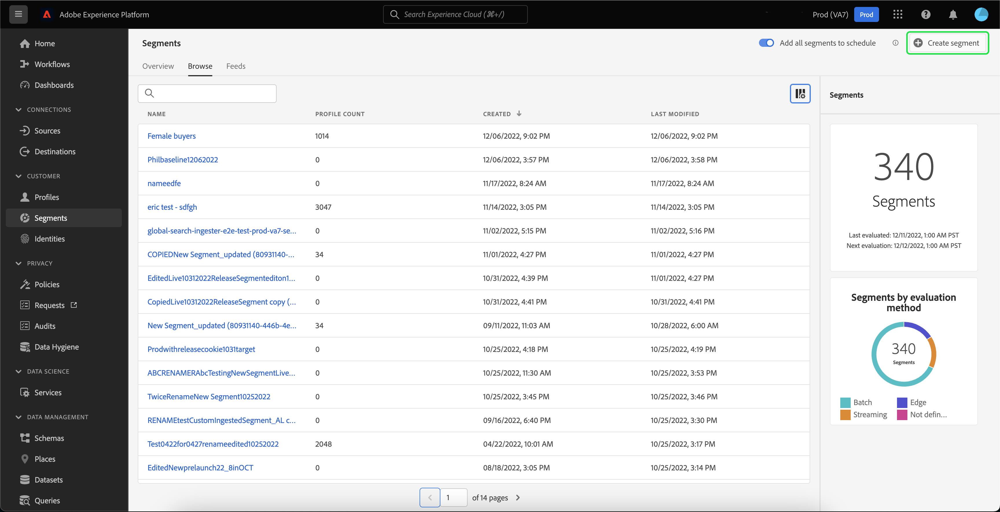

# セグメント化サービス UI ガイド

[!DNL Adobe Experience Platform Segmentation Service] は、セグメント定義を作成および管理するためのユーザーインターフェイスを提供します。

## はじめに

セグメントの定義を使用するには、セグメント化に関連する様々な [!DNL Experience Platform] サービスについて理解している必要があります。 このユーザガイドを読む前に、次のサービスのドキュメントを確認してください。

- [[!DNL Segmentation Service]](../home.md): [!DNL Segmentation Service] では、個人 ( 顧客、見込み客、ユ [!DNL Experience Platform] ーザー、組織など ) に関連付けて保存されているデータを、小さなグループに分割できます。
- [[!DNL Real-time Customer Profile]](../../profile/home.md)：複数のソースからの集計データに基づいて、統合されたリアルタイムの顧客プロファイルを提供します。
- [[!DNL Adobe Experience Platform Identity Service]](../../identity-service/home.md):に取り込まれる様々なデータソースの ID を関連付けることで、顧客プロファイルを作成できま [!DNL Platform]す。
- [[!DNL Experience Data Model (XDM)]](../../xdm/home.md)：顧客体験データを編成する際に [!DNL Platform] に使用される標準化されたフレームワーク。

また、このドキュメントを通して使用される次の 2 つの重要用語を知り、その違いを理解することも重要です。
- **セグメント定義**：ターゲットオーディエンスの重要な特徴やビヘイビアーの説明に使用されるルールセットです。
- **オーディエンス**：セグメント定義の条件を満たす一連のプロファイルです。

## 概要

Experience PlatformUI で、左側のナビゲーションで「**[!UICONTROL セグメント]**」を選択して「**[!UICONTROL 概要]**」タブを開き、「[!UICONTROL  セグメント ]」ダッシュボードを表示します。

>[!NOTE]
>
>組織が Platform を初めて使用し、アクティブなプロファイルデータセットや結合ポリシーをまだ作成していない場合は、「[!UICONTROL Segments]」ダッシュボードは表示されません。 代わりに、「[!UICONTROL  概要 ]」タブには、セグメントの使用を開始する際に役立つリンクとドキュメントが表示されます。

###  Segmentsdashboard {#segments-dashboard}

**[!UICONTROL セグメント]** ダッシュボードでは、組織のセグメントデータに関連する主要指標の概要を説明しています。

詳しくは、[ セグメントダッシュボードガイド ](../../dashboards/guides/segments.md) を参照してください。

## 参照

「**[!UICONTROL 参照]**」タブを選択して、IMS 組織のすべてのセグメント定義のリストを表示します。

このビューには、分類、チャーン、プロファイル数、評価方法、作成日、最終変更日など、セグメント定義に関する情報が表示されます。

分類には、次の各ステータスに属するプロファイルの割合を示す棒グラフが表示されます。[!UICONTROL  認識済み ]、[!UICONTROL  既存 ]、[!UICONTROL  既存 ]。

| ステータス | 説明 |
| ------ | ----------- |
| 実現済み | セグメント内の新しいプロファイル。 |
| 既存 | セグメント内に残った既存のプロファイル。 |
| 終了 | セグメントから離脱する既存のプロファイル。 |

チャーンは、セグメントジョブが最後に実行された時点と比較して、セグメント定義内で変更されているプロファイルの割合を表し、プロファイル数は、セグメントに適合するプロファイルの合計数を表します。

評価方法は、ストリーミングまたはバッチのいずれかです。ストリーミングセグメントは、データがシステムに入力されるたびに評価されます。バッチセグメントは、設定されたスケジュールに従って評価されます。

ページの上部には、すべてのセグメントをスケジュールに追加し、新しいセグメントを作成するためのオプションがあります。

**[!UICONTROL スケジュールにすべてのセグメントを追加]** を切り替えると、スケジュールに沿ったセグメント化が有効になります。 スケジュールに沿ったセグメント化について詳しくは、このユーザーガイドの [ スケジュールに沿ったセグメント化の節 ](#scheduled-segmentation) を参照してください。

「**[!UICONTROL セグメントを作成]**」を選択すると、セグメントビルダーが表示されます。 セグメントの作成の詳細については、ユーザーガイド ](#create-segment) の [ セグメントの作成に関する節を参照してください。

右側のサイドバーには、IMS 組織内のすべてのセグメントに関する情報が含まれ、セグメントの合計数、最後の評価日、次の評価日、および評価方法別のセグメントの分類が表示されます。

セグメント定義の行を選択すると、セグメントの編集または削除、宛先へのセグメントのアクティブ化、セグメントの対象オーディエンス、合計オーディエンスサイズ、セグメント名、説明、評価方法、作成日、最終変更日など、セグメント定義の概要が表示されます。

>[!NOTE]
>
> 宛先のアクティベーションで使用されているセグメントを **削除できません**。

## セグメント定義の詳細 {#segment-details}

特定のセグメント定義の詳細を表示するには、「**[!UICONTROL 参照]**」タブでセグメントの名前を選択します。

セグメントの詳細ページが表示されます。 上部には、セグメント定義の概要、対象オーディエンスのサイズに関する情報、およびセグメントがアクティブ化される宛先が表示されます。

### セグメントの概要

**[!UICONTROL セグメントの概要]** セクションには、ID、名前、説明、属性の詳細などの情報が表示されます。

さらに、宛先に対してセグメントをアクティブ化するか、セグメントを編集するかのどちらかのオプションが提供されます。 「**[!UICONTROL 宛先に対してアクティブ化]**」を選択すると、宛先へのセグメントをアクティブ化できます。 宛先へのセグメントのアクティブ化の詳細については、[ アクティベーションの概要 ](../../destinations/ui/activation-overview.md) を参照してください。

「**[!UICONTROL セグメントを編集]**」を選択すると、[!DNL Segment Builder] が表示されます。 [!DNL Segment Builder] ワークスペースの使用に関する詳細は、[[!DNL Segment Builder]  ユーザーガイド ](./segment-builder.md) を参照してください。

### セグメント内の合計オーディエンス

「**[!UICONTROL セグメント]** の合計オーディエンス」セクションには、セグメントに適合するプロファイルの合計数が表示されます。

見積もりは、その日のサンプルデータのサンプルサイズを使用して生成されます。 プロファイルストアのエンティティ数が 100 万個未満の場合は、データセット全体が使用されます。100 万個から 2,000 万個のエンティティがある場合は、100 万個のエンティティが使用されます。2,000 万個を超えるエンティティがある場合は、合計エンティティ数の 5％が使用されます。セグメントの推定サイズを生成する方法について詳しくは、セグメントの作成に関するチュートリアルの[予測値の生成に関する節](../tutorials/create-a-segment.md#estimate-and-preview-an-audience)を参照してください。

### アクティブ化された宛先

**[!UICONTROL アクティブ化された宛先]** セクションには、このセグメントがアクティブ化される宛先が表示されます。

>[!NOTE]
>
> 宛先は、[!DNL Real-time Customer Data Platform] で使用できる機能で、外部プラットフォームにデータを書き出すことができます。 宛先の詳細については、「[ 宛先の概要 ](../../destinations/home.md)」を参照してください。 宛先に対してセグメントをアクティブ化する方法については、「[ アクティブ化の概要 ](../../destinations/ui/activation-overview.md)」を参照してください。

### プロファイルサンプル

の下には、セグメントに適合するプロファイルのサンプリングがあり、[!DNL Profile] ID、名、姓、個人の E メールなどの詳細情報が表示されます。

データサンプリングを実行する方法は、取り込み方法によって異なります。

バッチ取得の場合、プロファイルストアは 15 分ごとに自動的にスキャンされ、最後のサンプリングジョブの実行後に新しいバッチが正常に取得されたかどうかを確認します。 その場合は、レコード数に少なくとも 5%の変更があったかどうかを確認するために、プロファイルストアがスキャンされます。 これらの条件が満たされると、新しいサンプリングジョブがトリガーされます。

ストリーミング取り込みの場合、プロファイルストアは、レコード数に少なくとも 5%の変更があったかどうかを確認するため、1 時間ごとに自動的にスキャンされます。 この条件が満たされると、新しいサンプリングジョブがトリガーされます。

スキャンのサンプルサイズは、プロファイルストア内のエンティティの全体数によって異なります。 これらのサンプルサイズを次の表に示します。

| プロファイルストア内のエンティティ数 | サンプルサイズ |
| ------------------------- | ----------- |
| 100 万未満 | フルデータセット |
| 100 万～2000 万 | 100 万 |
| 2000 万以上 | 全体の 5% |

各 [!DNL Profile] に関する詳細な情報は、[!DNL Profile] ID を選択すると確認できます。 プロファイルの詳細については、[[!DNL Real-time Customer Profile]  ユーザーガイド ](../../profile/ui/user-guide.md#profile-detail) を参照してください。

## セグメントの作成 {#create-segment}

右上隅の「 **[!UICONTROL セグメントを作成]** 」を選択すると、[!DNL Segment Builder] ワークスペースが開き、セグメント定義の作成を開始できます。

### [!DNL Segment Builder] ワークスペース

[!DNL Segment Builder] は、データ要素を操作できる豊富なワークスペ [!DNL Profile] ースを提供します。ワークスペースには、ルールを作成および編集するための直感的なコントロールがあります。例えば、データプロパティを表示する際に使用するドラッグ＆ドロップタイルなどです。

[!DNL Segment Builder] ワークスペースの使用に関する詳細は、[[!DNL Segment Builder]  ユーザーガイド ](./segment-builder.md) を参照してください。

## スケジュールされたセグメント化 {#scheduled-segmentation}

セグメント定義を作成したら、オンデマンドで、またはスケジュールに沿って（継続的に）セグメント定義を評価することができます。評価とは、対応するオーディエンスを生成するために、セグメント定義を介して [!DNL Real-time Customer Profile] データを移動することを意味します。 作成したオーディエンスは、[!DNL Experience Platform] API を使用して書き出せるように保存されます。

オンデマンド評価では、API を使用して評価を実行し、必要に応じてオーディエンスを作成します。一方、スケジュールに沿った評価（「スケジュールに沿ったセグメント化」とも言います）では、特定の時間（最大 1 日に 1 回）にセグメント定義を評価する反復スケジュールを作成できます。

### スケジュールに沿ったセグメント化を有効にする {#enable-scheduled-segmentation}

セグメント定義でスケジュールに沿った評価を有効にするには、UI または API を使用します。UI で、**[!UICONTROL 「セグメント」]** 内の「**[!UICONTROL 参照]**」タブに戻り、「**[!UICONTROL スケジュールするすべてのセグメントを追加]**」をオンに切り替えます。 これで、すべてのセグメントが組織で設定したスケジュールに沿って評価されます。

>[!NOTE]
>
>[!DNL XDM Individual Profile] の結合ポリシーが最大 5 個あるサンドボックスに対して、スケジュールされた評価を有効にすることができます。 1 つのサンドボックス環境内に [!DNL XDM Individual Profile] の結合ポリシーが 6 つ以上ある場合、スケジュールされた評価を使用することはできません。

現在、スケジュールを作成するには API を使用する必要があります。API を使用してスケジュールを作成、編集および操作する手順について詳しくは、セグメント結果の評価とアクセスに関するチュートリアル（特に、[API を使用した、スケジュールに沿った評価](../tutorials/evaluate-a-segment.md#scheduled-evaluation)に関する節）を参照してください。

## ストリーミングセグメント化 {#streaming-segmentation}

ストリーミングセグメント化は、[!DNL Platform] でほぼリアルタイムでセグメント化を行い、データの豊富さに焦点を当てる機能です。 ストリーミングセグメント化では、データが [!DNL Platform] に到着するとセグメント認定がおこなわれ、セグメント化ジョブのスケジュールと実行の必要性が軽減されました。

ストリーミングセグメント化について詳しくは、『[ ストリーミングセグメント化ユーザガイド ](./streaming-segmentation.md)』を参照してください。

>[!NOTE]
>
>ストリーミングによるセグメント化を機能させるには、組織でスケジュールされたセグメント化を有効にする必要があります。 スケジュールに沿ったセグメント化を有効にする方法について詳しくは、このユーザーガイドの ](#scheduled-segmentation) ストリーミングによるセグメント化の節を参照してください。[

## エッジセグメント化 {#edge-segmentation}

エッジのセグメント化は、Platform 内のセグメントを即座にエッジ上で評価する機能で、同じページおよび次のページのパーソナライゼーションの使用例を可能にします。

エッジセグメント化について詳しくは、『[ エッジセグメント化 UI ガイド ](./edge-segmentation.md)』を参照してください。

## ポリシー違反

>[!NOTE]
>
>ポリシー違反は、宛先に割り当てられたセグメントを作成する場合にのみ適用されます。

セグメントの作成が完了すると、そのセグメントがAdobe Experience Platformデータガバナンスによって分析され、セグメント内にポリシー違反がないことを確認します。 詳しくは、[[!DNL Data Governance]  の概要](../../data-governance/home.md)を参照してください。

## 次の手順とその他のリソース {#next-steps}

[!DNL Segmentation Service] UI は、[!DNL Real-time Customer Profile] データからマーケティング可能なオーディエンスを分離できる、豊富なワークフローを提供します。

[!DNL Segmentation Service] の詳細については、ドキュメントを引き続きお読みください。 [!DNL Segmentation Service] API の使用方法については、[[!DNL Segmentation Service]  開発者ガイド ](../api/overview.md) を参照してください。
