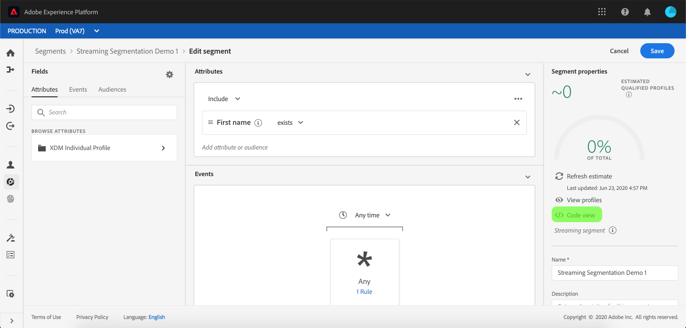
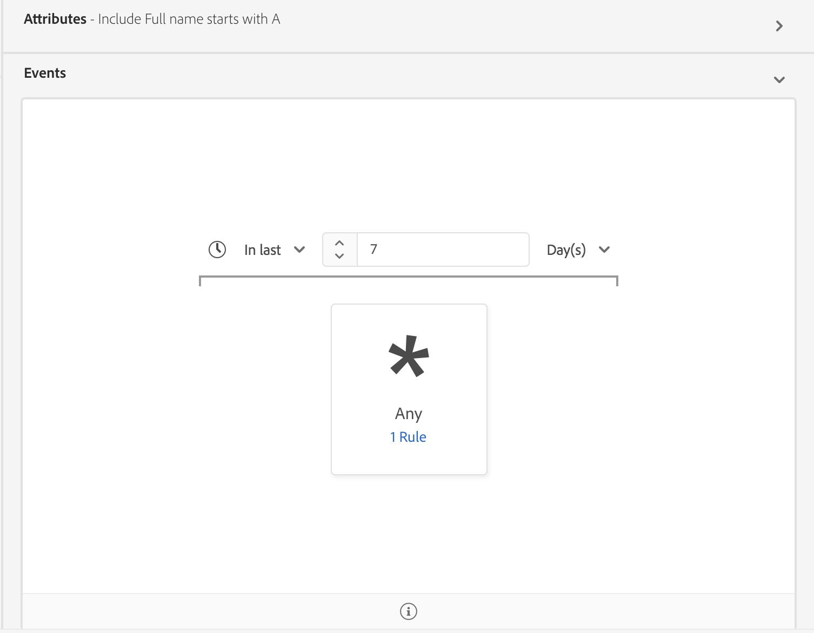

# [!DNL Segment Builder] ユーザーガイド

[!DNL Adobe Experience Platform Segmentation Service] は、データからセグメント定義を作成するためのRESTful APIおよびユーザーインターフェイスを提供し [!DNL Real-time Customer Profile] ます。

## はじめに

Working with segment definitions requires an understanding of the various [!DNL Experience Platform] services involved with segmentation. このユーザガイドを読む前に、次のサービスのドキュメントを確認してください。

- [!DNL Segmentation Service](../home.md): [!DNL Segmentation Service] 個人(顧客、見込み客、ユーザー、組織など) [!DNL Experience Platform] に関連付けて保存されたデータを、類似した特性を共有し、マーケティング戦略と同様に対応する小さなグループに分割できます。
- [!DNL Real-time Customer Profile](../../profile/home.md): 複数のソースからの集計データに基づいて、統合されたリアルタイムの消費者プロファイルを提供します。
- [!DNL Identity Service](../../identity-service/home.md): 取り込ま [!DNL Real-time Customer Profile] れる異なるデータソースのIDをブリッジ化することで有効に [!DNL Platform]します。
- [!DNL Experience Data Model (XDM)](../../xdm/home.md): 顧客体験データを [!DNL Platform] 整理するための標準化されたフレームワーク。

また、このドキュメントを通して使用される次の 2 つの重要用語を知り、その違いを理解することも重要です。
- **セグメント定義**：ターゲットオーディエンスの重要な特徴やビヘイビアーの説明に使用されるルールセットです。
- **オーディエンス**：セグメント定義の条件を満たす一連のプロファイルです。

## セグメント定義へのアクセス

To begin working with segment definitions in [!DNL Adobe Experience Platform], click **[!UICONTROL Segments]** in the left navigation. 組織のすべてのセグメント定義を表示するには、「*[!UICONTROL 参照]*」タブをクリックします。このビューには、評価方法、作成日、最終変更日など、セグメント定義に関する情報が表示されます。

評価方法は、ストリーミングまたはバッチのいずれかです。ストリーミングセグメントは、データがシステムに入力されるたびに評価されます。バッチセグメントは、設定されたスケジュールに従って評価されます。

バッチセグメントには、バッチの最終評価日と次の評価日の両方を示す追加情報が表示されます。

右上隅の「**[!UICONTROL セグメントを作成]**」をクリックすると、セグメントビルダーのワークスペースが開き、セグメント定義の作成を開始できます。

## [!DNL Segment Builder] ワークスペース

[!DNL Segment Builder] は、データ要素を操作できるリッチワークスペースを提供し [!DNL Profile] ます。 ワークスペースには、ルールを作成および編集するための直感的なコントロールがあります。例えば、データプロパティを表示する際に使用するドラッグ＆ドロップタイルなどです。

## セグメント定義の構成要素

セグメント定義の基本的な構成要素は&#x200B;**[!UICONTROL 属性]**&#x200B;と&#x200B;**[!UICONTROL イベント]**&#x200B;です。また、既存の&#x200B;**[!UICONTROL オーディエンス]**&#x200B;に含まれる属性とイベントも、新しい定義のコンポーネントとして使用できます。

You can see these building blocks in the *[!UICONTROL Fields]* section on the left side of the [!DNL Segment Builder] workspace. 「*[!UICONTROL フィールド]*」には、主要な構成要素（**[!UICONTROL 属性]**、**[!UICONTROL イベント]**、**[!UICONTROL オーディエンス]**）のタブが含まれています。

### 属性

The **[!UICONTROL Attributes]** tab allows you to browse [!DNL Profile] attributes belonging to the [!DNL XDM Individual Profile] class. 各フォルダーを展開して、追加の属性を表示できます。各属性はタイルで表されており、ワークスペースの中央にあるルールビルダーキャンバスにドラッグすることができます。[ルールビルダーキャンバス](#rule-builder-canvas)の詳細については、このガイドで後述します。

### イベント

「**[!UICONTROL イベント]**」タブでは、 のデータ要素を使用して実行されたイベントまたはアクションに基づいてオーディエンスを作成できます。[!DNL XDM ExperienceEvent]また、「**[!UICONTROL イベント]**」タブではイベントタイプを検索できます。イベントタイプは一般的に使用されるイベントの集まりで、これを使用するとセグメントをより迅速に作成することができます。

In addition to being able to browse for [!DNL ExperienceEvent] elements, you can also search for Event Types. Event Types use the same coding logic as [!DNL ExperienceEvents], without requiring you to search through the [!DNL XDM ExperienceEvent] class looking for the correct event. For example, using the search bar to search &quot;cart&quot; returns the Event Types &quot;[!UICONTROL AddCart]&quot; and &quot;[!UICONTROL RemoveCart]&quot;, which are two very commonly used cart actions when building segment definitions.

任意のタイプのコンポーネントを検索するには、[Lucene の検索構文](https://docs.microsoft.com/ja-JP/azure/search/query-lucene-syntax)を使用して、検索バーにその名前を入力します。単語を完全に入力すると、検索結果が表示され始めます。例えば、XDM フィールド `ExperienceEvent.commerce.productViews` に基づくルールを作成するには、検索フィールドに「product views」と入力します。「product」という単語の入力が終わると同時に、検索結果が表示され始めます。検索結果には、それが属するオブジェクト階層も表示されます。

>[!NOTE]
>
>組織で定義されたカスタムスキーマフィールドが表示され、ルールの作成に使用できるようになるまでに、最長で 24 時間かかる場合があります。

You can then easily drag and drop [!DNL ExperienceEvents] and [!UICONTROL Event Types] into your segment definition.

デフォルトでは、データストアから入力されたスキーマフィールドのみが表示されます。This includes [!UICONTROL Event Types]. If the [!UICONTROL Event Types] list is not visible, or you are only able to select &quot;[!UICONTROL Any]&quot; as an [!UICONTROL Event Type], click the gear icon next to *[!UICONTROL Fields]*, then select **[!UICONTROL Show full XDM schema]** under *[!UICONTROL Available Fields]*. 歯車アイコンをもう一度クリックすると、「*[!UICONTROL フィールド]*」タブに戻ります。データが含まれているかどうかに関係なく、複数のイベントタイプとスキーマフィールドが表示されます。

### オーディエンス

The **[!UICONTROL Audiences]** tab lists all audiences imported from external sources, such as Adobe Audience Manager, as well as audiences created within [!DNL Experience Platform].

On the [!UICONTROL Audiences] tab, you can see all of the available sources as a group of folders. これらのフォルダーをクリックすると、使用可能なサブフォルダーとオーディエンスが表示されます。また、フォルダー構造を表示するには、フォルダーアイコンをクリックします（右端の画像を参照）。チェックマークは、現在のフォルダーを表しています。また、ツリー内のフォルダーの名前をクリックすることで、フォルダー間を簡単に移動できます。

オーディエンス横の ⓘ にカーソルを置くと、そのオーディエンスに関する情報が表示されます。例えば、ID、説明、そのオーディエンスが存在するフォルダーの階層などです。

You can also search for [!UICONTROL Audiences] using the search bar, which utilizes [Lucene&#39;s search syntax](https://docs.microsoft.com/ja-JP/azure/search/query-lucene-syntax). 「*[!UICONTROL オーディエンス]*」タブで最上位のフォルダーを選択すると、検索バーが表示され、そのフォルダー内を検索することができます。検索結果は、単語の入力が終わると同時に表示され始めます。For example, to find an [!UICONTROL Audience] named `Online Shoppers`, start typing &quot;Online&quot; in the search bar. 「Online」という単語を完全に入力すると、「Online」という単語を含む検索結果が表示されます。

## ルールビルダーキャンバス {#rule-builder-canvas}

セグメント定義は、ターゲットオーディエンスの重要な特徴やビヘイビアーの説明に使用される一連のルールです。These rules are created using the *[!UICONTROL rule builder canvas]*, located in the center of [!DNL Segment Builder].

セグメント定義に新しいルールを追加するには、タイルを「*[!UICONTROL フィールド]*」タブからルールビルダーキャンバスにドラッグ＆ドロップします。追加するデータのタイプに応じて、コンテキスト固有のオプションが表示されます。Available data types include: strings, dates, [!DNL ExperienceEvents], [!UICONTROL Event Types], and [!UICONTROL Audiences].

### オーディエンスの追加

オーディエンスを「*[!UICONTROL オーディエンス]*」タブからルールビルダーキャンバスにドラッグ＆ドロップすることで、新しいセグメント定義でオーディエンスのメンバーシップを参照できます。これで、オーディエンスのメンバーシップを新しいセグメントルールの属性として含めたり除外したりできます。

For [!DNL Platform] audiences created using [!DNL Segment Builder], you are given the option to convert the audience into the set of rules that were used in the segment definition for that audience. このように変換するとルールロジックのコピーが作成されます。このコピーを使用することで、元のセグメント定義に影響を与えることなくルールを変更できます。セグメント定義をルールロジックに変換する前に、セグメント定義に対する最新の変更を保存していることを確認してください。

>[!NOTE]
>
>外部ソースからオーディエンスを追加した場合、オーディエンスのメンバーシップのみが参照されます。このオーディエンスをルールに変換することはできません。このため、元のオーディエンスの作成に使用されたルールを新しいセグメント定義で変更することはできません。

オーディエンスをルールに変換する際に競合が発生した場合 [!DNL Segment Builder] 、は既存のオプションをその機能を最大限に保持しようとします。

### コード表示

または、で作成したルールのコードベースの表示を行うこともでき [!DNL Segment Builder]ます。 ルールビルダーキャンバス内にルールを作成したら、 **[!UICONTROL コード表示]** を選択して、セグメントをPQLとして表示できます。

コード表示には、API呼び出しで使用するセグメントの値をコピーできるボタンが用意されています。 セグメントの最新バージョンを取得するには、セグメントに対する最新の変更を保存していることを確認します。

## コンテナ

セグメントルールは、リストでの表示順に従って評価されます。コンテナでは、ネストされたクエリを使用して、評価の順序を制御できます。

ルールビルダーキャンバスにタイルを 1 つ以上追加したら、コンテナの追加を開始できます。新しいコンテナを作成するには、タイルの右上隅にある省略記号（...）をクリックし、「**[!UICONTROL コンテナを追加]**」をクリックします。

新しいコンテナが最初のコンテナの子として表示されますが、コンテナをドラッグして移動することで、階層を調整することができます。The default behavior of a container is to &quot;[!UICONTROL Include]&quot; the attribute, event, or audience provided. You can set the rule to &quot;[!UICONTROL Exclude]&quot; profiles that match the container criteria by clicking **[!UICONTROL Include]** in the top-left corner of the tile and selecting &quot;[!UICONTROL Exclude]&quot;.

子コンテナを抜き出して、親コンテナに直列で追加することもできます。それには、子コンテナの「コンテナを展開」をクリックします。このオプションにアクセスするには、子コンテナの右上隅にある省略記号（...）をクリックします。

「**[!UICONTROL コンテナを展開]**」をクリックすると、子コンテナが削除され、条件が直列的に表示されます。

>[!NOTE]
>
>コンテナを展開する場合には、ロジックが引き続き目的のセグメント定義を満たすようにしてください。

## 結合ポリシー

[!DNL Experience Platform] では、複数のソースのデータを統合して、個々の顧客の全体像を把握できます。When bringing this data together, merge policies are the rules that [!DNL Platform] uses to determine how data will be prioritized and what data will be combined to create a profile.

You can select a merge policy that matches your marketing purpose for this audience or use the default merge policy provided by [!DNL Platform]. デフォルトの結合ポリシーを作成できるほか、組織に固有の複数の結合ポリシーを作成できます。組織の結合ポリシーを作成する手順については、[UI を使用した結合ポリシーの操作](../../profile/ui/merge-policies.md)に関するチュートリアルを参照してください。

セグメント定義の結合ポリシーを選択するには、「*[!UICONTROL フィールド]*」タブの歯車アイコンをクリックし、「*結合ポリシー&#x200B;*」ドロップダウンメニューを使って、使用する結合ポリシーを選択します。

## セグメントのプロパティ

セグメント定義を作成する際には、作成されるセグメントの推定サイズがワークスペース右側の「*[!UICONTROL セグメントのプロパティ]*」セクションに表示されるので、オーディエンス自体を作成する前にセグメントの定義を必要に応じて調整できます。

「*[!UICONTROL セグメントのプロパティ]*」セクションでは、セグメント定義に関する重要な情報（*[!UICONTROL 名前]*、*[!UICONTROL 説明]*&#x200B;など）を指定することもできます。セグメント定義名は、組織で定義されたものの中から目的のセグメントを識別する際に使用されます。このため、セグメント定義名は、内容がわかりやすく簡潔、かつ一意である必要があります。

セグメント定義の作成中、「**[!UICONTROL プロファイルを表示]**」を選択することで、オーディエンスのプレビューをページ別に表示できます。

>[!NOTE]
>
>オーディエンスの予測値は、その日のサンプルデータのサンプルサイズを使用して生成されます。プロファイルストアのエンティティ数が 100 万個未満の場合は、データセット全体が使用されます。100 万個から 2,000 万個のエンティティがある場合は、100 万個のエンティティが使用されます。2,000 万個を超えるエンティティがある場合は、合計エンティティ数の 5％が使用されます。セグメントの推定サイズを生成する方法について詳しくは、セグメントの作成に関するチュートリアルの[予測値の生成に関する節](../tutorials/create-a-segment.md#estimate-and-preview-an-audience)を参照してください。

## スケジュールに沿ったセグメント化を有効にする {#enable-scheduled-segmentation}

セグメント定義を作成したら、オンデマンドで、またはスケジュールに沿って（継続的に）セグメント定義を評価することができます。Evaluation means moving [!DNL Real-time Customer Profile] data through segment definitions in order to produce corresponding audiences. Once created, the audiences are saved and stored so that they can be exported using [!DNL Experience Platform] APIs.

オンデマンド評価では、API を使用して評価を実行し、必要に応じてオーディエンスを作成します。一方、スケジュールに沿った評価（「スケジュールに沿ったセグメント化」とも言います）では、特定の時間（最大 1 日に 1 回）にセグメント定義を評価する反復スケジュールを作成できます。

セグメント定義でスケジュールに沿った評価を有効にするには、UI または API を使用します。UI で、「**[!UICONTROL セグメント]**」内の「*[!UICONTROL 参照]*」タブに戻り、「**[!UICONTROL すべてのセグメントを評価]**」を切り替えます。これで、すべてのセグメントが組織で設定したスケジュールに沿って評価されます。

>[!NOTE]
>
>Scheduled evaluation can be enabled for sandboxes with a maximum of five (5) merge policies for [!DNL XDM Individual Profile]. If your organization has more than five merge policies for [!DNL XDM Individual Profile] within a single sandbox environment, you will not be able to use scheduled evaluation.

現在、スケジュールを作成するには API を使用する必要があります。API を使用してスケジュールを作成、編集および操作する手順について詳しくは、セグメント結果の評価とアクセスに関するチュートリアル（特に、[API を使用した、スケジュールに沿った評価](../tutorials/evaluate-a-segment.md#scheduled-evaluation)に関する節）を参照してください。

## ストリーミングセグメント化 {#streaming-segmentation}

>[!NOTE]
>
>ストリーミングセグメントを機能させるには、お客様が組織でスケジュール済みのセグメントを有効にする必要があります。 スケジュールに沿ったセグメント化を有効にする方法について詳しくは、[このユーザガイドの前の節](#enable-scheduled-segmentation)を参照してください。

次のいずれかの条件を満たす場合、クエリはストリーミングセグメント化によって自動的に評価されます。

| クエリタイプ | 詳細 | 例 |
| ---------- | ------- | ------- |
| 受信ヒット | 時間制限のない、単一の着信イベントを参照するセグメント定義。 |  |
| 相対時間枠内での着信ヒット | 過去7日間に発生した単一のイベントを参照す **るセグメント定義**。 |  |
| プロファイルを参照する着信ヒット | 時間制限のない、1つの着信イベント、および1つ以上のプロファイル属性を参照するセグメント定義。 |  |
| 相対的な時間枠内のプロファイルを参照する着信ヒット | 過去7日間の、1つの着信イベントと1つ以上のプロファイル属性を参照す **るセグメント定義**。 |  |
| プロファイルを参照する複数のイベント | 過去24時間以内に複数のイベントを参照するセグメント定義 **には** 、1つ以上のプロファイル属性が含まれます。 |  |

次の節では、ストリーミングセグメントに対して **有効にしないリストセグメント定義の例を示します** 。

| クエリタイプ | 詳細 |
| ---------- | ------- | 
| 相対時間枠内での着信ヒット | セグメント定義が、 **過去7日間** 以内でない着信イベントを参照する場合 ****。 例えば、 **過去2週間以内の場合**。 |  |
| 相対的なウィンドウ内のプロファイルを参照する着信ヒット | 次のオプションは、ストリーミングセグメントをサポートし **ません** 。<ul><li>過去7日間 **以** 内の着信イベント ****。</li><li>セグメントまたは特性を含む [!DNL Adobe Audience Manager (AAM)] セグメント定義。</li></ul> |  |
| プロファイルを参照する複数のイベント | 次のオプションは、ストリーミングセグメントをサポートし **ません** 。<ul><li>過去24時間以内に **発生しないイベント******。</li><li>Adobe Audience Manager(AAM)のセグメントまたは特性を含むセグメント定義。</li></ul> |  |
| マルチエンティティクエリ | マルチエンティティクエリは、全体として、ストリーミングセグメントでは **サポートされていません** 。 |  |

さらに、ストリーミングセグメント化を行う際には、次のようなガイドラインが適用されます。

| クエリタイプ | ガイドライン |
| ---------- | -------- |
| 単一イベントクエリ | ルックバックウィンドウは **7日間に制限されています**。 |
| イベント履歴のあるクエリ | <ul><li>ルックバックウィンドウは **1日に制限されます**。</li><li>イベント間に厳密な時間順序条件 **が存在する** 。</li><li>イベント間の単純な時間順（前後）のみが許可されます。</li><li>個々のイベント **を無効にすることはできません** 。 ただし、クエリ全体を無効にす **ることはできます** 。</li></ul> |

### ストリーミングセグメントの監視

ストリーミングが有効なセグメントを作成したら、そのセグメントの詳細を監視できます。

特に、条件を満たした *[!UICONTROL オーディエンスの合計サイズ]* の詳細が表示されます。 ジョブが過去24時間以内に実行された場合は、追加されたオーディエンスの折れ線グラフに加えて、ジョブ **[!UICONTROL からのオーディエンスの合計サイズ]** (Total Job Size)が表示されます。 そうでない場合は、ビジュアライゼーションのトレンドラインに加えて **[!UICONTROL 、オーディエンスの推定サイズ]** が表示されます。

最後のセグメント評価に関する追加情報は、情報バブルをクリックして確認できます。

### ストリーミングセグメントのビデオデモ

次のビデオでは、ストリーミングのセグメント化について理解しておくことを目的としています。 ここには、顧客体験の例を示し、その後インター [!DNL Platform] フェイスの主な機能を簡単に紹介します。

>[!VIDEO](https://video.tv.adobe.com/v/36184?quality=12&learn=on)

## DULE ポリシーの違反

>[!NOTE]
>
>DULE ポリシーの違反は、宛先に割り当てられたセグメントを作成する場合にのみ適用されます。

Once you are done creating your segment, the segment will be analyzed by [!DNL Data Governance] to ensure there are no policy violations within the segment. DULE とポリシー違反について詳しくは、[データ使用ラベルの概要](../../data-governance/labels/overview.md)を参照してください。

## 次の手順 およびその他のリソース {#next-steps}

Segment Builder provides a rich workflow allowing you to isolate marketable audiences from [!DNL Real-time Customer Profile] data. このガイドをお読みになると、次のことができるようになります。

- 属性、イベントおよび既存のオーディエンスの組み合わせを構成要素として使用して、セグメント定義を作成する。
- ルールビルダーキャンバスとコンテナを使用して、セグメントルールの実行順を制御する。
- 見込みオーディエンスの予測値を表示する。必要に応じてセグメント定義を調整できます。
- スケジュールに沿ったセグメント化に対してすべてのセグメント定義を有効にする。
- ストリーミングによるセグメント化に対して、特定のセグメント定義を有効にする。

詳しくは、ドキュメントを読み続け [!DNL Segmentation Service]て、以下のビデオを参照して学習内容を補ってください。 For step-by-step instructions on working with [!DNL Segmentation Service] using the [!DNL Segmentation Service] API, see the [creating audience segments using APIs](../tutorials/create-a-segment.md) tutorial.

>[!WARNING]
>
> 次のビデオに示す [!DNL Platform] UIは古いです。 最新のUIのスクリーンショットと機能については、上記のドキュメントを参照してください。

**セグメントの作成:**

>[!VIDEO](https://video.tv.adobe.com/v/27254?quality=12&learn=on)

**動的セグメントの作成：**

>[!VIDEO](https://video.tv.adobe.com/v/27428?quality=12&learn=on)
