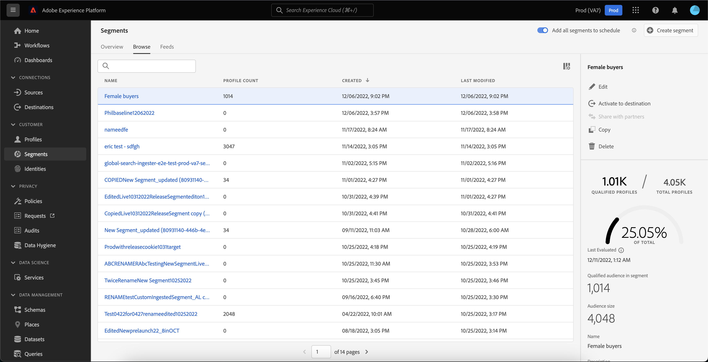
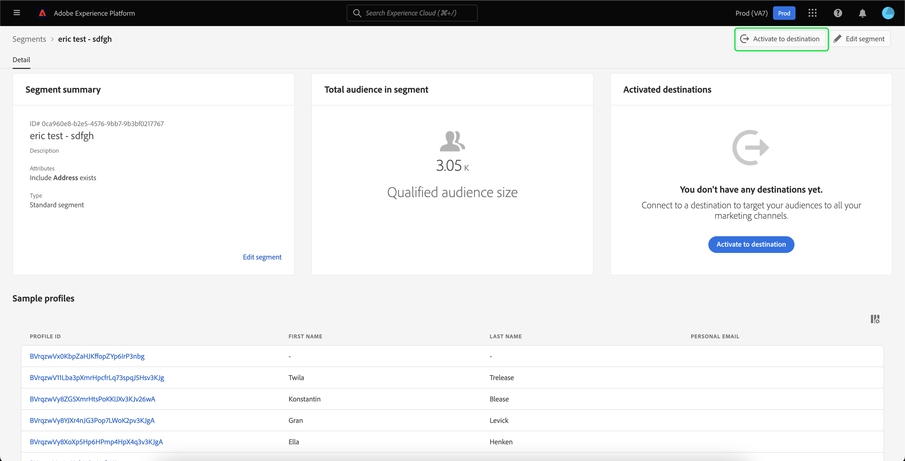

# セグメント化サービス UI ガイド

[!DNL Adobe Experience Platform Segmentation Service] は、セグメント定義を作成および管理するためのユーザーインターフェイスを提供します。

## はじめに

セグメント定義に取り組むには、セグメント化に関連する様々な [!DNL Experience Platform] サービスについて理解している必要があります。このユーザガイドを読む前に、次のサービスのドキュメントを確認してください。

- [[!DNL Segmentation Service]](../home.md)：[!DNL Segmentation Service] を使用すると、[!DNL Experience Platform] に保存されている、個人（顧客、見込み客、ユーザー、組織など）に関連するデータを細かいグループに分類できます。
- [[!DNL Real-Time Customer Profile]](../../profile/home.md)：複数のソースからの集計データに基づいて、統合されたリアルタイムの顧客プロファイルを提供します。
- [[!DNL Adobe Experience Platform Identity Service]](../../identity-service/home.md)：[!DNL Platform] に取り込まれる様々なデータソースの ID を結合することで、顧客プロファイルの作成を有効にします。
- [[!DNL Experience Data Model (XDM)]](../../xdm/home.md)：[!DNL Platform] が、カスタマーエクスペリエンスデータを整理する際に使用する、標準化されたフレームワーク。セグメント化を最大限に活用するには、[データモデリングのベストプラクティス](../../xdm/schema/best-practices.md)に従って、データがプロファイルとイベントとして取り込まれていることを確認してください。

また、このドキュメントを通して使用される次の 2 つの重要用語を知り、その違いを理解することも重要です。
- **セグメント定義**：ターゲットオーディエンスの重要な特徴やビヘイビアーの説明に使用されるルールセットです。
- **オーディエンス**：セグメント定義の条件を満たすプロファイルの結果セットです。これは、Adobe Experience Platform（Platform で生成されたオーディエンス）または外部ソース（外部で生成されたオーディエンス）から作成できます。

## 概要

Experience Platform UI で、左側のナビゲーションで「**[!UICONTROL セグメント]**」を選択して「**[!UICONTROL 概要]**」タブを開き、[!UICONTROL セグメント]ダッシュボードを表示します。

>[!NOTE]
>
>Platform を初めて使用する組織で、アクティブなプロファイルデータセットや結合ポリシーが作成されていない場合は、[!UICONTROL セグメント]ダッシュボードは表示されません。代わりに、「[!UICONTROL 概要]」タブには、セグメント化を開始する際に役立つリンクとドキュメントが表示されます。

### [!UICONTROL セグメント]ダッシュボード {#segments-dashboard}

**[!UICONTROL セグメント]**&#x200B;ダッシュボードは、組織のセグメントデータに関連する主要指標の概要を示します。

詳しくは、[セグメントダッシュボードガイド](../../dashboards/guides/segments.md)を参照してください。

## 参照 {#browse}

>[!CONTEXTUALHELP]
>id="platform_segments_browse_churncolumnname"
>title="チャーン"
>abstract="チャーンは、セグメントジョブが最後に実行された時点と比較して、セグメント定義内で変化しているプロファイルの割合を表します。"

>[!CONTEXTUALHELP]
>id="platform_segments_browse_evaluationmethodcolumnname"
>title="評価方法"
>abstract="セグメントの評価方法には、バッチ、ストリーミング、エッジが含まれます。"

>[!CONTEXTUALHELP]
>id="platform_segments_browse_addallsegmentstoschedule"
>title="すべてのセグメントをスケジュールに追加"
>abstract="毎日スケジュールされている更新に、すべてのバッチ評価セグメントを含めることができるようにします。スケジュールされている更新からすべてのセグメントを削除するには無効にします。"

「**[!UICONTROL 参照]**」タブを選択して、組織のすべてのセグメント定義のリストを表示します。

この表示には、プロファイル数、作成日、最終変更日など、セグメント定義に関する情報がリストされます。

この表示にフィールドを追加するには、「」を選択します。これらの追加フィールドには、分類、評価方法およびジョブ ID などがあります。

分類を選択すると、次の各計算済みプロファイルステータスに属するプロファイルの割合を示す棒グラフが表示されます。 [!UICONTROL 実現済み] および [!UICONTROL 終了]. さらに、「[!UICONTROL 参照]」タブに表示される分類は、セグメントステータスの最も正確な分類です。この数値が「[!UICONTROL 概要]」タブに表示されている数値と異なる場合は、「[!UICONTROL 概要]」タブの数値は 1 日に 1 回しか更新されないので、「[!UICONTROL 参照]」タブの数値を正しいソースとして使用する必要があります。

| ステータス | 説明 |
| ------ | ----------- |
| 実現済み | 過去 24 時間のセグメントに選定されたプロファイルの数。つまり、バッチセグメントジョブが前回実行されてからセグメントに選定されたプロファイルの数です。 |
| 離脱 | 過去 24 時間にセグメントから離脱したプロファイルの数。つまり、バッチセグメントジョブが前回実行されてからセグメントに選定されなくなったプロファイルの数です。 |

評価方法は、ストリーミング、バッチまたはエッジのいずれかです。ストリーミングセグメントは、データがシステムに入力されるたびに評価されます。バッチセグメントは、設定されたスケジュールに従って評価されます。エッジセグメントはリアルタイムで評価されるので、同じページおよび次のページのパーソナライゼーションの使用例が可能になります。

ページの上部には、すべてのセグメントをスケジュールに追加するオプションと、新しいセグメントを作成するオプションがあります。

**[!UICONTROL すべてのセグメントをスケジュールに追加]**&#x200B;を切り替えると、スケジュールされたセグメント化が有効になります。スケジュールされたセグメント化について詳しくは、[このユーザーガイドのスケジュールされたセグメント化の節](#scheduled-segmentation)を参照してください。

「**[!UICONTROL セグメントを作成]**」を選択すると、セグメントビルダーに移動します。セグメントの作成について詳しくは、[ユーザーガイドのセグメントの作成](#create-segment)の節を参照してください。

右側のサイドバーには、組織内のすべてのセグメントに関する情報が含まれており、セグメントの合計数、最後の評価日、次の評価日および評価方法によるセグメントの分類がリストされています。

セグメント定義の行を選択すると、セグメント定義の概要が表示されます。これには、セグメントの名前、説明、評価方法、作成日、および最終変更日に加えて、セグメントの編集または削除、宛先へのセグメントのアクティブ化、セグメントの適格オーディエンス、合計オーディエンスサイズのオプションが含まれます。

>[!NOTE]
>
> 宛先のアクティベーションで使用されているセグメントを削除することはでき&#x200B;**ません**。

## セグメント定義の詳細 {#segment-details}

特定のセグメント定義の詳細を表示するには、「**[!UICONTROL 参照]**」タブでセグメントの名前を選択します。

セグメントの詳細ページが表示されます。上部には、セグメント定義の概要、適格なオーディエンスサイズに関する情報、セグメントがアクティブ化されている宛先があります。

### セグメントの概要 {#segment-summary}

「**[!UICONTROL セグメントの概要]**」セクションには、属性の ID、名前、説明、詳細などの情報が表示されます。

さらに、宛先に対してセグメントをアクティブ化するか、セグメントを編集するかのオプションが提供されます。「**[!UICONTROL 宛先に対してアクティブ化]**」を選択すると、セグメントを宛先に対してアクティブ化できます。宛先へのセグメントのアクティブ化について詳しくは、[アクティベーションの概要](../../destinations/ui/activation-overview.md)を参照してください。

「**[!UICONTROL セグメントを編集]**」を選択すると、[!DNL Segment Builder] に移動します。[!DNL Segment Builder] ワークスペースの使用について詳しくは、[[!DNL Segment Builder] ユーザーガイド](./segment-builder.md)を参照してください。

### セグメント内の合計オーディエンス

「**[!UICONTROL セグメントの合計オーディエンス]**」セクションには、セグメントに該当するプロファイルの合計数が表示されます。

予測値は、その日のサンプルデータのサンプルサイズを使用して生成されます。プロファイルストアのエンティティ数が 100 万個未満の場合は、データセット全体が使用されます。100 万個から 2,000 万個のエンティティがある場合は、100 万個のエンティティが使用されます。2,000 万個を超えるエンティティがある場合は、合計エンティティ数の 5％が使用されます。セグメントの推定サイズを生成する方法について詳しくは、セグメントの作成に関するチュートリアルの[予測値の生成に関する節](../tutorials/create-a-segment.md#estimate-and-preview-an-audience)を参照してください。

### アクティブ化された宛先

「**[!UICONTROL アクティブ化された宛先]**」セクションには、このセグメントがアクティブ化されている宛先が表示されます。

>[!NOTE]
>
> 宛先は、[!DNL Adobe Real-Time Customer Data Platform] で使用可能な機能で、データを外部プラットフォームに書き出すことができます。宛先について詳しくは、[宛先の概要](../../destinations/home.md)を参照してください。宛先へのセグメントをアクティブ化する方法については、[アクティベーションの概要](../../destinations/ui/activation-overview.md)を参照してください。

### プロファイルのサンプル

その下には、セグメントに適したプロファイルのサンプリングがあり、[!DNL Profile] ID、名、姓、個人のメールなどの詳細情報が示されています。

データサンプリングをトリガーする方法は、取り込み方法によって異なります。

バッチ取り込みの場合、プロファイルストアは 15 分ごとに自動的にスキャンされ、最後のサンプリングジョブが実行されてから新しいバッチが正常に取り込まれたかどうかが確認されます。その場合、続いてプロファイルストアがスキャンされ、レコード数に 5％以上の変化があったかどうかを確認します。これらの条件が満たされると、新しいサンプリングジョブがトリガーされます。

ストリーミング取り込みの場合、プロファイルストアは 1 時間ごとに自動的にスキャンされ、レコード数に少なくとも 5％の変化があったかどうかが確認されます。この条件が満たされると、新しいサンプリングジョブがトリガーされます。

スキャンのサンプルサイズは、プロファイルストア内のエンティティの合計数によって異なります。これらのサンプルサイズを次の表に示します。

| プロファイルストア内のエンティティ数 | サンプルサイズ |
| ------------------------- | ----------- |
| 100 万未満 | フルデータセット |
| 100 万～2000 万 | 100 万 |
| 2000 万以上 | 全体の 5% |

[!DNL Profile] ID を選択すると、各 [!DNL Profile] に関する詳細情報を確認できます。プロファイルの詳細については、[[!DNL Real-Time Customer Profile] ユーザーガイド](../../profile/ui/user-guide.md#profile-detail)を参照してください。

## セグメントの作成 {#create-segment}

右上隅の「**[!UICONTROL セグメントを作成]**」を選択すると、[!DNL Segment Builder] ワークスペースが開き、ここでセグメント定義の作成を開始できます。

### [!DNL Segment Builder] ワークスペース

[!DNL Segment Builder] のワークスペースには、[!DNL Profile] のデータ要素を操作できる豊富な機能があります。ワークスペースには、ルールを作成および編集するための直感的なコントロール（例えば、データプロパティを表示する際に使用するドラッグ＆ドロップタイルなど）があります。

[!DNL Segment Builder] ワークスペースの使用について詳しくは、[[!DNL Segment Builder] ユーザーガイド](./segment-builder.md)を参照してください。

## スケジュールされたセグメント化 {#scheduled-segmentation}

セグメント定義を作成したら、オンデマンドで、またはスケジュールに沿って（継続的に）セグメント定義を評価することができます。評価とは、対応するオーディエンスを生成するために、セグメント定義を通じて [!DNL Real-Time Customer Profile] データを移動することを意味します。作成したオーディエンスは、[!DNL Experience Platform] API を使用して書き出すことができるように保存されます。

オンデマンド評価では、API を使用して評価を実行し、必要に応じてオーディエンスを作成します。一方、スケジュールに沿った評価（「スケジュールに沿ったセグメント化」とも言います）では、特定の時間（最大 1 日に 1 回）にセグメント定義を評価する反復スケジュールを作成できます。

### スケジュールに沿ったセグメント化を有効にする {#enable-scheduled-segmentation}

セグメント定義でスケジュールに沿った評価を有効にするには、UI または API を使用します。UI で、「**[!UICONTROL セグメント]**」内の「**[!UICONTROL 参照]**」タブに戻り、「**[!UICONTROL すべてのセグメントをスケジュールに追加]**」をオンにします。これで、すべてのセグメントが組織で設定したスケジュールに沿って評価されます。

>[!NOTE]
>
>[!DNL XDM Individual Profile] の最大 5 つの結合ポリシーを備えたサンドボックスに対して、スケジュールされた評価を有効にできます。組織で、1 つのサンドボックス環境内に [!DNL XDM Individual Profile] の結合ポリシーが 6 つ以上ある場合は、スケジュールされた評価を使用できません。

現在、スケジュールを作成するには API を使用する必要があります。API を使用してスケジュールを作成、編集および操作する手順について詳しくは、セグメント結果の評価とアクセスに関するチュートリアル（特に、[API を使用した、スケジュールに沿った評価](../tutorials/evaluate-a-segment.md#scheduled-evaluation)に関する節）を参照してください。

## オーディエンス {#audiences}

>[!IMPORTANT]
>
>オーディエンス機能は現在限定ベータ版であり、すべてのユーザーが利用できるわけではありません。ドキュメントと機能は変更される場合があります。

「**[!UICONTROL オーディエンス]**」タブを選択して、組織のすべてのオーディエンスのリストを表示します。

デフォルトでは、この表示には、名前、プロファイル数、接触チャネル、作成日、最終更新日など、オーディエンスに関する情報がリストされます。

「」アイコンを選択して、表示するフィールドを変更できます。

ポップオーバーが表示され、テーブル内に表示できるすべてのフィールドがリストされます。

| フィールド | 説明 |
| ----- | ----------- | 
| [!UICONTROL 名前] | オーディエンスの名前。 |
| [!UICONTROL プロファイル数] | オーディエンスに適合するプロファイルの合計数。 |
| [!UICONTROL 接触チャネル] | オーディエンスの接触チャネル。このオーディエンスが Platform で生成された場合、セグメント化サービスの接触チャネルがあります。 |
| [!UICONTROL ライフサイクルステータス] | オーディエンスのステータス。このフィールドの可能な値には、`Draft`、`Published` および `Archived` が含まれます。 |
| [!UICONTROL 更新頻度] | オーディエンスのデータが更新される頻度を示す値。このフィールドの可能な値には、`On Demand`、`Scheduled` および `Continuous` が含まれます。 |
| [!UICONTROL 最終更新者] | オーディエンスを最後に更新したユーザーの名前。 |
| [!UICONTROL 作成日] | オーディエンスが作成された日時。 |
| [!UICONTROL 最終更新日] | オーディエンスが最後に作成された日時。 |
| [!UICONTROL アクセスラベル] | オーディエンスのアクセスラベル。アクセスラベルを使用すると、データに適用される使用ポリシーに従ってデータセットとフィールドを分類できます。これらのラベルはいつでも適用でき、柔軟にデータ管理方法を選択できます。アクセスラベルについて詳しくは、[ラベルの管理](../../access-control/abac/ui/labels.md)に関するドキュメントを参照してください。 |

「**[!UICONTROL オーディエンスを作成]**」を選択して、オーディエンスを作成できます。

ポップオーバーが表示され、オーディエンスを作成するか、ルールを作成するかを選択できます。

「**[!UICONTROL オーディエンスを作成]**」を選択すると、Audience Builder に移動します。オーディエンスの作成について詳しくは、[Audience Builder ガイド](./audience-builder.md)を参照してください。

「**[!UICONTROL ルールを作成]**」を選択すると、セグメントビルダーに移動します。セグメントの作成について詳しくは、[セグメントビルダーガイド](./segment-builder.md)を参照してください。

## オーディエンスの詳細 {#audience-details}

特定のオーディエンスに関する詳細を表示するには、「[!UICONTROL オーディエンス]」タブをクリックします。

オーディエンスの詳細ページが表示されます。このページの詳細は、オーディエンスが Adobe Experience Platform で生成されたか、Audience Orchestration などの外部ソースから生成されたかによって異なります。

### Platform で生成されたオーディエンス

Platform で生成されたオーディエンスについて詳しくは、[セグメントの概要](#segment-summary)の節を参照してください。

### 外部で生成されたオーディエンス

オーディエンスの詳細ページの上部に、オーディエンスの概要と、オーディエンスが保存されたデータセットに関する詳細が表示されます。

「**[!UICONTROL オーディエンスの概要]**」セクションには、属性の ID、名前、説明、詳細などの情報が表示されます。

「**[!UICONTROL データセットの詳細]**」セクションには、名前、説明、テーブル名、ソース、スキーマなどの情報が表示されます。「**[!UICONTROL データセットを表示]**」を選択すると、データセットの詳細が表示されます。

| フィールド | 説明 |
| ----- | ----------- |
| [!UICONTROL 名前] | データセットの名前。 |
| [!UICONTROL 説明] | データセットの説明。 |
| [!UICONTROL テーブル名] | データセットのテーブル名。 |
| [!UICONTROL ソース] | データセットのソース。外部で生成されたオーディエンスの場合、この値は **Schema** になります。 |
| [!UICONTROL スキーマ] | データセットが対応する XDM スキーマのタイプ。 |

データセットについて詳しくは、[データセットの概要](../../catalog/datasets/overview.md)を参照してください。

## ストリーミングセグメント化 {#streaming-segmentation}

ストリーミングセグメント化は、データの豊富さを重視しながら、ほぼリアルタイムで [!DNL Platform] でセグメント化を実行する機能です。ストリーミングセグメント化を使用すると、データが [!DNL Platform] に到達する際にセグメントの選定が行われるようになり、セグメント化ジョブをスケジュールして実行する必要性が軽減されます。

ストリーミングセグメント化について詳しくは、[ストリーミングセグメント化ユーザーガイド](./streaming-segmentation.md)を参照してください。

>[!NOTE]
>
>ストリーミングセグメント化を機能させるには、スケジュールされたセグメント化を組織で有効にする必要があります。 スケジュールされたセグメント化を有効にする方法について詳しくは、[このユーザーガイドのストリーミングセグメント化の節](#scheduled-segmentation)を参照してください。

## エッジセグメント化 {#edge-segmentation}

エッジセグメント化は、Platform 内のセグメントをエッジ上で即座に評価する機能で、これにより、同じページや次のページのパーソナライゼーションのユースケースが可能になります。

エッジセグメント化について詳しくは、[エッジセグメント化 UI ガイド](./edge-segmentation.md)を参照してください。

## ポリシー違反

>[!NOTE]
>
> ポリシー違反は、宛先に割り当てられたセグメントを作成する場合にのみ適用されます。

セグメントの作成が完了すると、そのセグメントが Adobe Experience Platform データガバナンスによって分析され、セグメント内にポリシー違反がないことが確認されます。詳しくは、[データガバナンスの概要](../../data-governance/home.md)を参照してください。

## 次の手順とその他のリソース {#next-steps}

[!DNL Segmentation Service] UI には機能豊富なワークフローが用意されているので、マーケティング可能なオーディエンスを [!DNL Real-Time Customer Profile] データから分離できます。

[!DNL Segmentation Service] について詳しくは、引き続きこのドキュメントを参照してください。[!DNL Segmentation Service] API の使用方法については、[[!DNL Segmentation Service] 開発者ガイド](../api/overview.md)を参照してください。
