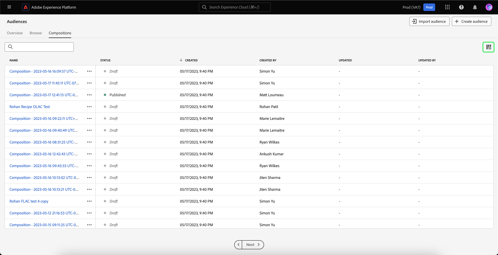
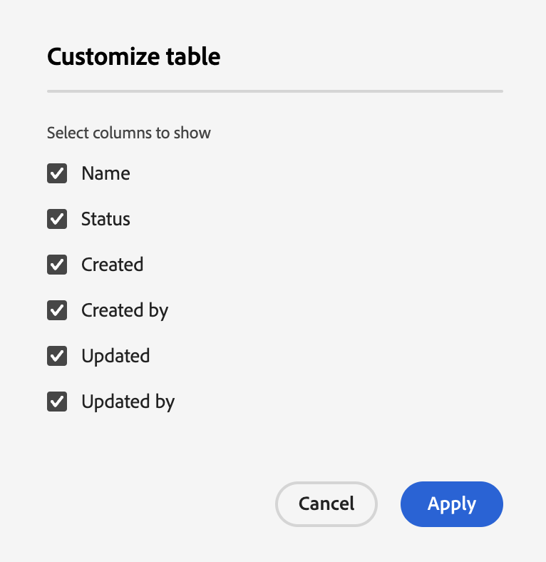
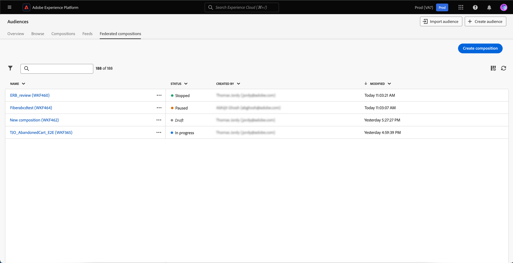
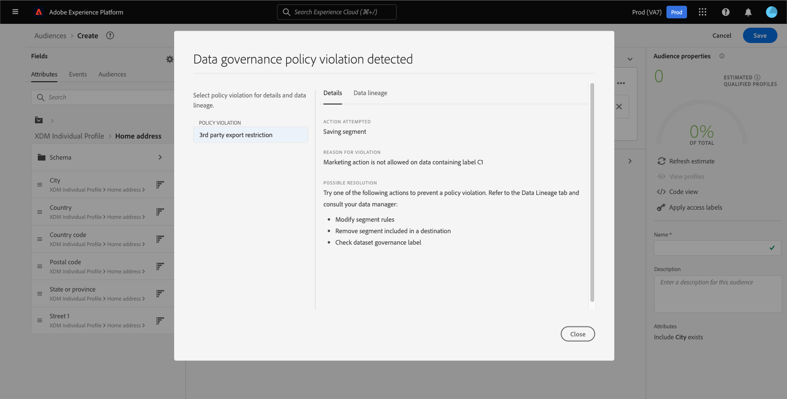

# セグメント化サービス UI ガイド

[!DNL Adobe Experience Platform Segmentation Service] は、オーディエンスおよびセグメント定義を作成および管理するためのユーザーインターフェイスを提供します。

## はじめに

オーディエンスおよびセグメント定義に取り組むには、セグメント化に関連する様々な [!DNL Experience Platform] サービスについて理解している必要があります。このユーザガイドを読む前に、次のサービスのドキュメントを確認してください。

- [[!DNL Segmentation Service]](../home.md)：[!DNL Segmentation Service] を使用すると、[!DNL Experience Platform] に保存されている、個人（顧客、見込み客、ユーザー、組織など）に関連するデータを細かいグループに分類できます。
- [[!DNL Real-Time Customer Profile]](../../profile/home.md)：複数のソースからの集計データに基づいて、統合されたリアルタイムの顧客プロファイルを提供します。
- [[!DNL Adobe Experience Platform Identity Service]](../../identity-service/home.md)：[!DNL Experience Platform] に取り込まれる様々なデータソースの ID を結合することで、顧客プロファイルの作成を有効にします。
- [[!DNL Experience Data Model (XDM)]](../../xdm/home.md)：[!DNL Experience Platform] が、カスタマーエクスペリエンスデータを整理する際に使用する、標準化されたフレームワーク。セグメント化を最大限に活用するには、[データモデリングのベストプラクティス](../../xdm/schema/best-practices.md)に従って、データがプロファイルとイベントとして取り込まれていることを確認してください。

また、このドキュメントで使用されている次の重要な用語を理解し、それらの違いを理解する必要があります。

- **オーディエンス**：類似した行動や特性を共有する人の集まりです。この人物のコレクションは、セグメント定義（Experience-Platformで生成されたオーディエンス）、オーディエンス構成、またはカスタムアップロード（外部で生成されたオーディエンス）などの外部ソースから、Adobe Experience Platformで生成できます。
- **セグメント定義**：Adobe Experience Platform が、ターゲットオーディエンスの重要な特徴や行動の説明に使用するルールです。
- **セグメント**：プロファイルをオーディエンスに分割する行為です。

## 概要

Experience Platform UIで、左側のナビゲーションで「**[!UICONTROL Audiences]**」を選択し、**[!UICONTROL Overview]** ダッシュボードが表示されている「[!UICONTROL Audiences]」タブを開きます。

>[!NOTE]
>
>組織がExperience Platformを初めて使用しており、アクティブなプロファイルデータセットまたは結合ポリシーがまだ作成されていない場合、[!UICONTROL Audiences] ダッシュボードは表示されません。 代わりに、[!UICONTROL Overview] タブには、オーディエンスを開始するのに役立つリンクとドキュメントが表示されます。

### [!UICONTROL Audiences] ダッシュボード {#segments-dashboard}

**[!UICONTROL Audiences]** ダッシュボードは、組織のオーディエンスデータに関連する主要な指標の概要を示しています。

詳しくは、[オーディエンスダッシュボードガイド](../../dashboards/guides/audiences.md)を参照してください。

## 参照 {#browse}

「**[!UICONTROL Browse]**」タブを選択して、オーディエンスポータルを表示します。 オーディエンスポータルには、組織とサンドボックスに属するすべてのオーディエンスのリストが表示され、プロファイル数、作成日、最終変更日、タグ、内訳などの詳細が含まれます。

さらに、オーディエンスポータルでは、セグメントビルダーやオーディエンス構成を使用して新しいオーディエンスを作成したり、外部で生成されたオーディエンスをExperience Platformにインポートしたりできます。

オーディエンスポータルについて詳しくは、[&#x200B; オーディエンスポータルの概要](./audience-portal.md)を参照してください。

## 構成 {#compositions}

「**[!UICONTROL Compositions]**」タブを選択すると、組織のオーディエンス構成を通じて生成されたすべてのオーディエンスのリストが表示されます。

デフォルトで、このビューにはオーディエンスに関する情報（名前、ステータス、作成日、作成者、最終更新日、最終更新者など）がリスト表示されます。

各オーディエンスの横には省略記号アイコンが表示されます。これを選択すると、オーディエンスで使用可能なクイックアクションのリストが表示されます。

| アクション | 説明 |
| ------ | ----------- |
| 複製 | 選択したオーディエンスをコピーします。 |
| アクセスの管理 | オーディエンスに属するアクセスラベルを管理します。 アクセスラベルについて詳しくは、[ラベルの管理](../../access-control/abac/ui/labels.md)に関するドキュメントを参照してください。 |
| 削除 | 選択したオーディエンスを削除します。 ダウンストリームの宛先で使用されているオーディエンス、または他のオーディエンス **の依存関係にあるオーディエンスは削除できません**。 オーディエンスの削除について詳しくは、[&#x200B; セグメント化に関するFAQ](../faq.md#lifecycle-states)を参照してください。 |

「」アイコンを選択して、表示するフィールドを変更できます。

ポップオーバーが表示され、テーブル内に表示できるすべてのフィールドがリストされます。

| フィールド | 説明 |
| ----- | ----------- |
| [!UICONTROL Name] | オーディエンスの名前。 |
| [!UICONTROL Status] | オーディエンスのステータス。このフィールドの可能な値には、`Draft`、`Inactive` および `Published` が含まれます。 |
| [!UICONTROL Created] | オーディエンスが作成された日時。 |
| [!UICONTROL Created by] | オーディエンスを作成した人物の名前。 |
| [!UICONTROL Updated] | オーディエンスが最後に更新された日時。 |
| [!UICONTROL Updated by] | オーディエンスを最後に更新したユーザーの名前。 |

オーディエンスがどのように構成されているかを確認するには、[!UICONTROL Audiences] タブ内でオーディエンスの名前を選択します。

オーディエンス構成 ページが表示され、オーディエンスを構成する構成要素が表示されます。オーディエンス構成の使用方法について詳しくは、[オーディエンス構成 UI ガイド](./audience-composition.md)を参照してください。

## 連合オーディエンス構成 {#fac}

オーディエンスの構成とセグメントの定義に加えて、Adobeの連合オーディエンスの構成を使用して、基礎データをコピーすることなく、新しいオーディエンスを企業データセットから構築し、Adobe Experience Platform Audience Portalに保存できます。 また、エンタープライズデータウェアハウスから連合され、構成されたオーディエンスデータを利用することで、Adobe Experience Platformの既存のオーディエンスを強化することもできます。 [連合オーディエンス構成](https://experienceleague.adobe.com/ja/docs/federated-audience-composition/using/home)に関するガイドを参照してください。

## ストリーミングセグメント化 {#streaming-segmentation}

ストリーミングセグメント化は、データの豊富さを重視しながら、ほぼリアルタイムで [!DNL Experience Platform] でセグメント化を実行する機能です。ストリーミングセグメント化を使用すると、データが [!DNL Experience Platform] に到達する際にセグメントの選定が行われるようになり、セグメント化ジョブをスケジュールして実行する必要性が軽減されます。

ストリーミングセグメント化について詳しくは、[ストリーミングセグメント化ユーザーガイド](../methods/streaming-segmentation.md)を参照してください。

>[!NOTE]
>
>ストリーミングセグメント化を機能させるには、スケジュールされたセグメント化を組織で有効にする必要があります。 スケジュールされたセグメント化を有効にする方法について詳しくは、[このユーザーガイドのストリーミングセグメント化の節](#scheduled-segmentation)を参照してください。

## エッジセグメント化 {#edge-segmentation}

Edgeのセグメンテーション機能では、Experience Platformのオーディエンスをエッジで即座に評価できるため、同じページや次のページのパーソナライズされたユースケースを実現できます。

エッジセグメント化について詳しくは、[エッジセグメント化 UI ガイド](../methods/edge-segmentation.md)を参照してください。

## ポリシー違反

>[!NOTE]
>
>ポリシー違反は、宛先に割り当てられたオーディエンスを作成する場合にのみ適用されます。

オーディエンスの作成が完了すると、そのオーディエンスが Adobe Experience Platform データガバナンスによって分析され、オーディエンス内にポリシー違反がないことが確認されます。詳しくは、[データガバナンスの概要](../../data-governance/home.md)を参照してください。

## 次の手順とその他のリソース {#next-steps}

[!DNL Segmentation Service] UI には豊富なワークフローが用意されており、マーケティング可能なオーディエンスを [!DNL Real-Time Customer Profile] データから分離できます。

[!DNL Segmentation Service] について詳しくは、引き続きこのドキュメントを参照してください。[!DNL Segmentation Service] API の使用方法については、[[!DNL Segmentation Service] 開発者ガイド](../api/overview.md)を参照してください。
