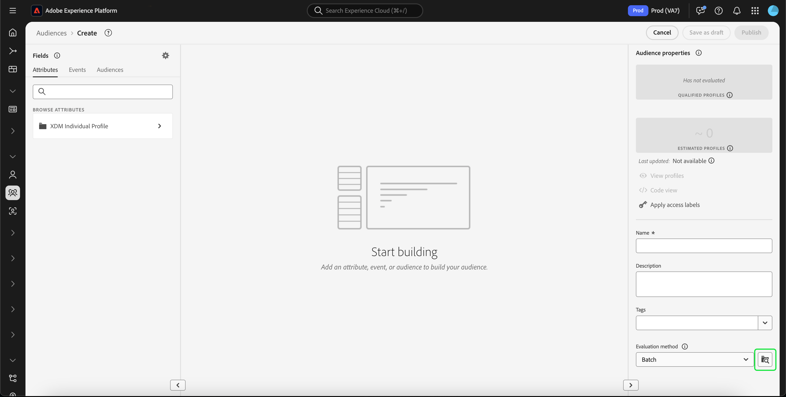
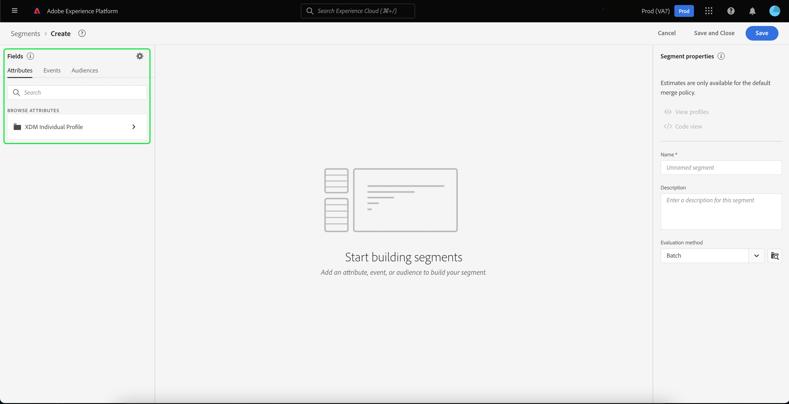

# [!DNL Segment Builder] UI ガイド

[!DNL Segment Builder] は、操作できる豊富なワークスペースを提供します。 [!DNL Profile] データ要素。 ワークスペースには、ルールを作成および編集するための直感的なコントロールがあります。例えば、データプロパティを表示する際に使用するドラッグ＆ドロップタイルなどです。

## セグメント定義の構成要素 {#building-blocks}

>[!CONTEXTUALHELP]
>id="platform_segments_createsegment_segmentbuilder_fields"
>title="フィールド"
>abstract="セグメントを構成する 3 つのフィールドタイプは、属性、イベントおよびオーディエンスです。 属性では、XDM Individual Profile クラスに属するプロファイル属性を使用でき、イベントでは XDM ExperienceEvent データ要素を使用して実行されるアクションやイベントに基づいてオーディエンスを作成でき、オーディエンスでは外部ソースからインポートされたオーディエンスを使用できます。"

セグメント定義の基本的な構成要素は、属性とイベントです。 また、既存のオーディエンスに含まれる属性とイベントを、新しい定義のコンポーネントとして使用できます。

これらの構築要素は、 **[!UICONTROL フィールド]** の左側のセクション [!DNL Segment Builder] ワークスペース。 **[!UICONTROL フィールド]** には、主要な構築ブロックの各タブが含まれます。&quot;[!UICONTROL 属性]&quot;, &quot;[!UICONTROL イベント]&quot;および&quot;[!UICONTROL オーディエンス]&quot;.

### 属性

この **[!UICONTROL 属性]** 「 」タブで、 [!DNL Profile] 属する属性 [!DNL XDM Individual Profile] クラス。 各フォルダーを展開して、追加の属性を表示できます。各属性はタイルで表されており、ワークスペースの中央にあるルールビルダーキャンバスにドラッグすることができます。[ルールビルダーキャンバス](#rule-builder-canvas)の詳細については、このガイドで後述します。

### イベント

「**[!UICONTROL イベント]**」タブでは、 のデータ要素を使用して実行されたイベントまたはアクションに基づいてオーディエンスを作成できます。[!DNL XDM ExperienceEvent]また、「**[!UICONTROL イベント]**」タブではイベントタイプを検索できます。イベントタイプは一般的に使用されるイベントの集まりで、これを使用するとセグメントをより迅速に作成することができます。

次を参照できるほか、 [!DNL ExperienceEvent] 要素を使用する場合は、イベントタイプも検索できます。 イベントタイプは、 [!DNL ExperienceEvents]を検索する必要がなくなりました。 [!DNL XDM ExperienceEvent] 正しいイベントを探しているクラス。 例えば、検索バーを使用して「cart」を検索すると、イベントタイプ「[!UICONTROL AddCart]&quot;および&quot;[!UICONTROL RemoveCart]」と呼ばれ、セグメント定義を作成する際によく使用される買い物かごアクションの 2 つです。

任意のタイプのコンポーネントを検索するには、[Lucene の検索構文](https://docs.microsoft.com/ja-JP/azure/search/query-lucene-syntax)を使用して、検索バーにその名前を入力します。単語を完全に入力すると、検索結果が表示され始めます。例えば、XDM フィールド `ExperienceEvent.commerce.productViews` に基づくルールを作成するには、検索フィールドに「product views」と入力します。「product」という単語の入力が終わると同時に、検索結果が表示され始めます。検索結果には、それが属するオブジェクト階層も表示されます。

>[!NOTE]
>
>組織で定義されたカスタムスキーマフィールドが表示され、ルールの作成に使用できるようになるまでに、最長で 24 時間かかる場合があります。

その後、簡単にドラッグ&amp;ドロップできます [!DNL ExperienceEvents] および」[!UICONTROL イベントタイプ]」をセグメント定義に追加します。

デフォルトでは、データストアから入力されたスキーマフィールドのみが表示されます。これには、「[!UICONTROL イベントタイプ]&quot;. この[!UICONTROL イベントタイプ]&quot;リストが表示されないか、選択できるのは&quot;[!UICONTROL 任意]&quot;[!UICONTROL イベントタイプ]&quot;、 **歯車アイコン** 次の **[!UICONTROL フィールド]**&#x200B;を選択し、「 **[!UICONTROL 完全な XDM スキーマを表示]** under **[!UICONTROL 使用可能フィールド]**. を選択します。 **歯車アイコン** 再び **[!UICONTROL フィールド]** 」タブに移動し、複数の「[!UICONTROL イベントタイプ]「 」およびスキーマフィールド（データが含まれているかどうかに関係なく）。

#### Adobe Analyticsレポートスイートデータセット

1 つまたは複数のAdobe Analyticsレポートスイートのデータをセグメント内のイベントとして使用できます。

単一の Analytics レポートスイートのデータを使用する場合、Platform は記述子とわかりやすい名前を eVar に自動的に追加するので、内でこれらのフィールドを見つけやすくなります [!DNL Segment Builder].

複数の Analytics レポートスイートのデータを使用する場合、Platform **できません** eVar に記述子またはわかりやすい名前を自動的に追加します。 その結果、Analytics レポートスイートのデータを使用する前に、XDM フィールドにマッピングする必要があります。 Analytics 変数の XDM へのマッピングについて詳しくは、 [Adobe Analytics source connection guide](../../sources/tutorials/ui/create/adobe-applications/analytics.md#mapping).

例えば、次の変数を含む 2 つのレポートスイートがある場合を考えてみましょう。

| フィールド | レポートスイートスキーマ A | レポートスイートスキーマ B |
| ----- | --------------------- | --------------------- |
| eVar1 | 参照ドメイン | ログイン済み Y/N |
| eVar2 | ページ名 | メンバーロイヤリティ ID |
| eVar3 | URL | ページ名 |
| eVar4 | 検索語句 | 製品名 |
| event1 | クリック数 | ページビュー数 |
| event2 | ページビュー数 | 買い物かごへの追加 |
| event3 | 買い物かごへの追加 | チェックアウト |
| event4 | 購入 | 購入 |

この場合、次のスキーマを使用して 2 つのレポートスイートをマッピングできます。

>[!NOTE]
>
>汎用eVar値は入力されますが、 **not** 値の意味はレポート内の元の意味とは異なる可能性があるので、セグメントの定義で使用します（可能な場合）。

レポートスイートがマッピングされたら、プロファイル関連のワークフローおよびセグメント化内で、新しくマッピングされたこれらのフィールドを使用できます。

| シナリオ | 和集合スキーマエクスペリエンス | セグメント化の汎用変数 | セグメント化マッピング変数 |
| -------- | ----------------------- | ----------------------------- | ---------------------------- |
| 単一のレポートスイート | 汎用変数には、わかりやすい名前記述子が含まれています。   **例：** ページ名 (eVar2) | <ul><li>汎用変数に含まれるわかりやすい名前記述子</li><li>唯一のクエリであるので、クエリでは特定のデータセットのデータを使用します</li></ul> | クエリでは、Adobe Analyticsのデータや他のソースを使用する場合があります。 |
| 複数のレポートスイート | 汎用変数にはわかりやすい名前記述子は含まれません。   **例：** eVar2 | <ul><li>複数の記述子を持つフィールドは、汎用として表示されます。 つまり、UI にわかりやすい名前が表示されません。</li><li>クエリでは、eVarを含む任意のデータセットのデータを使用できます。その結果、結果が混在したり、正しくないりする場合があります。</li></ul> | クエリでは、複数のデータセットから正しく組み合わされた結果を使用します。 |

### オーディエンス

この **[!UICONTROL オーディエンス]** 「 」タブには、Adobe Audience Managerなどの外部ソースからインポートされたすべてのオーディエンスと、で作成されたオーディエンスが表示されます。 [!DNL Experience Platform].

の **[!UICONTROL オーディエンス]** 「 」タブには、使用可能なすべてのソースがフォルダーのグループとして表示されます。 フォルダーを選択すると、使用可能なサブフォルダーとオーディエンスが表示されます。 また、フォルダー構造を表示するために（右端の画像に示すように）フォルダーアイコンを選択し（チェックマークは現在存在するフォルダーを示します）、ツリー内のフォルダーの名前を選択することで、簡単にフォルダー間を戻すことができます。

オーディエンス横の ⓘ にカーソルを置くと、そのオーディエンスに関する情報が表示されます。例えば、ID、説明、そのオーディエンスが存在するフォルダーの階層などです。

また、検索バーを使用してオーディエンスを検索することもできます。このツールでは、 [Lucene の検索構文](https://docs.microsoft.com/en-us/azure/search/query-lucene-syntax). 「**[!UICONTROL オーディエンス]**」タブで最上位のフォルダーを選択すると、検索バーが表示され、そのフォルダー内を検索することができます。検索結果は、単語の入力が終わると同時に表示され始めます。例えば、 `Online Shoppers`検索バーに「Online」と入力します。 「Online」という単語を完全に入力すると、「Online」という単語を含む検索結果が表示されます。

## ルールビルダーキャンバス {#rule-builder-canvas}

セグメント定義は、ターゲットオーディエンスの重要な特徴やビヘイビアーの説明に使用される一連のルールです。これらのルールは、中央にあるルールビルダーキャンバスを使用して作成します。 [!DNL Segment Builder].

セグメント定義に新しいルールを追加するには、タイルを「**[!UICONTROL フィールド]**」タブからルールビルダーキャンバスにドラッグ＆ドロップします。追加するデータのタイプに応じて、コンテキスト固有のオプションが表示されます。使用できるデータタイプは次のとおりです。文字列、日付、 [!DNL ExperienceEvents], &quot;[!UICONTROL イベントタイプ]」、およびオーディエンス。

>[!IMPORTANT]
>
>Adobe Experience Platformの最新の変更により、 `OR` および `AND` イベント間の論理演算子。 これらの更新は、既存のセグメントには影響しません。 ただし、既存のセグメントおよび新しいセグメント作成に対するそれ以降の更新はすべて、これらの変更の影響を受けます。 詳しくは、 [時定数の更新](./segment-refactoring.md) を参照してください。

属性の値を選択すると、その属性に使用できる列挙値のリストが表示されます。

この列挙のリストから値を選択すると、値は実線の境界線で囲まれます。 ただし、 `meta:enum` （ソフト）列挙の場合は、値を選択することもできます。 **not** 列挙のリストから 独自の値を作成する場合、その値は点線の境界線で囲まれ、その値が列挙リストに含まれていないことを示す警告が表示されます。

### オーディエンスの追加

オーディエンスを「**[!UICONTROL オーディエンス]**」タブからルールビルダーキャンバスにドラッグ＆ドロップすることで、新しいセグメント定義でオーディエンスのメンバーシップを参照できます。これで、オーディエンスのメンバーシップを新しいセグメントルールの属性として含めたり除外したりできます。

の場合 [!DNL Platform] を使用して作成されたオーディエンス [!DNL Segment Builder]の場合は、オーディエンスを、そのオーディエンスのセグメント定義で使用された一連のルールに変換するオプションが与えられます。 このように変換するとルールロジックのコピーが作成されます。このコピーを使用することで、元のセグメント定義に影響を与えることなくルールを変更できます。セグメント定義に対する最近の変更を、ルールロジックに変換する前に必ず保存しておいてください。

>[!NOTE]
>
>外部ソースからオーディエンスを追加した場合、オーディエンスのメンバーシップのみが参照されます。このオーディエンスをルールに変換することはできません。このため、元のオーディエンスの作成に使用されたルールを新しいセグメント定義で変更することはできません。

オーディエンスをルールに変換する際に競合が発生した場合は、 [!DNL Segment Builder] 既存のオプションをその能力を最大限に引き出そうと試みます。

### コードビュー

または、 [!DNL Segment Builder]. ルールビルダーキャンバス内でルールを作成したら、「 **[!UICONTROL コードビュー]** セグメントを PQL として確認する。

コードビューには、API 呼び出しで使用するセグメントの値をコピーできるボタンが用意されています。 セグメントの最新バージョンを取得するには、セグメントに対する最新の変更を保存していることを確認してください。

### 集計関数

の集計 [!DNL Segment Builder] は、データ型が数値（倍精度または整数）である XDM 属性のグループに対する計算です。 セグメントビルダーでサポートされている 4 つの集計関数は、SUM、AVERAGE、MIN、MAXです。

集計関数を作成するには、左側のレールからイベントを選択し、 [!UICONTROL イベント] コンテナ。

イベントコンテナ内にイベントを配置した後、省略記号アイコン (...) を選択し、次のアイコンを選択します。 **[!UICONTROL 集計]**.

これで、集計が追加されます。 集計関数を選択し、集計する属性、等価関数、値を選択できるようになりました。 次の例では、このセグメントは、各購入が 100 ドル未満の場合でも、購入した値の合計が 100 ドルを超えるプロファイルを認定します。

### カウント関数 {#count-functions}

セグメントビルダーのカウント関数は、指定したイベントを検索し、その回数をカウントするために使用されます。 セグメントビルダーでサポートされているカウント関数は、「少なくとも」、「最大」、「正確」、「範囲内」、「すべて」です。

カウント関数を作成するには、左側のパネルからイベントを選択し、 [!UICONTROL イベント] コンテナ。

イベントコンテナ内にイベントを配置した後、 [!UICONTROL 少なくとも 1 つ] 」ボタンをクリックします。

これで、count 関数が追加されました。 これで、カウント関数と関数の値を選択できるようになりました。 次の例では、少なくとも 1 回のクリックを持つイベントを含めます。

## コンテナ

セグメントルールは、リストでの表示順に従って評価されます。コンテナでは、ネストされたクエリを使用して、評価の順序を制御できます。

ルールビルダーキャンバスにタイルを 1 つ以上追加したら、コンテナの追加を開始できます。新しいコンテナを作成するには、タイルの右上隅にある省略記号 (...) を選択し、「 **[!UICONTROL コンテナを追加]**.

新しいコンテナが最初のコンテナの子として表示されますが、コンテナをドラッグして移動することで、階層を調整することができます。コンテナのデフォルトの動作は、[!UICONTROL 次を含む]「指定された属性、イベントまたはオーディエンス。 ルールを「[!UICONTROL 除外]「 」を選択して、コンテナ条件に一致するプロファイルを除外 **[!UICONTROL 次を含む]** をクリックし、「[!UICONTROL 除外]&quot;.

子コンテナを抽出し、親コンテナにインラインで追加することもできます。そのためには、子コンテナで「コンテナを展開」を選択します。 このオプションにアクセスするには、子コンテナの右上隅にある省略記号 (...) を選択します。

次を選択したら、 **[!UICONTROL コンテナを展開]** 子コンテナが削除され、条件がインラインで表示されます。

>[!NOTE]
>
>コンテナを展開する場合には、ロジックが引き続き目的のセグメント定義を満たすようにしてください。

## 結合ポリシー

[!DNL Experience Platform] では、複数のソースのデータを統合して、個々の顧客の全体像を把握できます。このデータを統合する場合、結合ポリシーは [!DNL Platform] は、データの優先順位付け方法と、どのデータを組み合わせてプロファイルを作成するかを決定するために使用します。

このオーディエンスのマーケティング目的に合った結合ポリシーを選択することも、 [!DNL Platform]. デフォルトの結合ポリシーを作成できるほか、組織に固有の複数の結合ポリシーを作成できます。組織の結合ポリシーを作成する手順については、まず [結合ポリシーの概要](../../profile/merge-policies/overview.md).

セグメント定義の結合ポリシーを選択するには、 **[!UICONTROL フィールド]** 」タブをクリックし、 **[!UICONTROL 結合ポリシー]** 使用する結合ポリシーを選択するドロップダウンメニュー。

## セグメントのプロパティ {#segment-properties}

>[!CONTEXTUALHELP]
>id="platform_segments_createsegment_segmentbuilder_segmentproperties"
>title="セグメントのプロパティ"
>abstract="「セグメントのプロパティ」セクションには、結果のセグメントのサイズの推定値が表示され、プロファイルの合計数に対する認定済みプロファイルの数が表示されます。 これにより、オーディエンス自体を作成する前に、必要に応じてセグメント定義を調整できます。"

>[!CONTEXTUALHELP]
>id="platform_segments_createsegment_segmentbuilder_refreshestimate"
>title="見積もりを更新"
>abstract="セグメントの予測を更新すると、提案したセグメントに適合するプロファイル数のプレビューをすぐに確認できます。 オーディエンスの予測値は、その日のサンプルデータのサンプルサイズを使用して生成されます。"
>additional-url="https://experienceleague.adobe.com/docs/experience-platform/segmentation/tutorials/create-a-segment.html?lang=en#estimate-and-preview-an-audience" text="詳しくは、ドキュメントを参照してください。"

セグメント定義を作成する際には、作成されるセグメントの推定サイズがワークスペース右側の「**[!UICONTROL セグメントのプロパティ]**」セクションに表示されるので、オーディエンス自体を作成する前にセグメントの定義を必要に応じて調整できます。

この **[!UICONTROL セグメントのプロパティ]** セクションでは、セグメント定義の名前や説明など、セグメント定義に関する重要な情報を指定することもできます。 セグメント定義名は、組織で定義されたものの中から目的のセグメントを識別する際に使用されます。このため、セグメント定義名は、内容がわかりやすく簡潔、かつ一意である必要があります。

セグメント定義の作成中、「**[!UICONTROL プロファイルを表示]**」を選択することで、オーディエンスのプレビューをページ別に表示できます。

>[!NOTE]
>
>オーディエンスの予測値は、その日のサンプルデータのサンプルサイズを使用して生成されます。プロファイルストアのエンティティ数が 100 万個未満の場合は、データセット全体が使用されます。100 万個から 2,000 万個のエンティティがある場合は、100 万個のエンティティが使用されます。2,000 万個を超えるエンティティがある場合は、合計エンティティ数の 5％が使用されます。セグメントの推定サイズを生成する方法について詳しくは、セグメントの作成に関するチュートリアルの[予測値の生成に関する節](../tutorials/create-a-segment.md#estimate-and-preview-an-audience)を参照してください。

## 次の手順 {#next-steps}

セグメントビルダーには、マーケティング可能なオーディエンスを次の場所から分離できる、豊富なワークフローが用意されています。 [!DNL Real-time Customer Profile] データ。 このガイドをお読みになると、次のことができるようになります。

- 属性、イベントおよび既存のオーディエンスの組み合わせを構成要素として使用して、セグメント定義を作成する。
- ルールビルダーキャンバスとコンテナを使用して、セグメントルールの実行順を制御する。
- 見込みオーディエンスの予測値を表示する。必要に応じてセグメント定義を調整できます。
- スケジュールに沿ったセグメント化に対してすべてのセグメント定義を有効にする。
- ストリーミングによるセグメント化に対して、特定のセグメント定義を有効にする。

詳しくは、以下を参照してください。 [!DNL Segmentation Service]を参照してください。ドキュメントを引き続き読み、関連するビデオを見て学習を補完してください。 他の [!DNL Segmentation Service] UI、 [[!DNL Segmentation Service] ユーザーガイド](./overview.md)
