# [!DNL Segment Builder] UI ガイド

>[!NOTE]
>
>このガイドでは、セグメントビルダーで&#x200B;**セグメント定義**&#x200B;を使用して、オーディエンスを作成する方法について説明します。オーディエンス構成を使用してオーディエンスを作成する方法については、[オーディエンス構成 UI ガイド](./audience-composition.md)を参照してください。

[!DNL Segment Builder] のワークスペースには、[!DNL Profile] のデータ要素を操作できる豊富な機能があります。ワークスペースには、ルールを作成および編集するための直感的なコントロール（例えば、データプロパティを表示する際に使用するドラッグ＆ドロップタイルなど）があります。

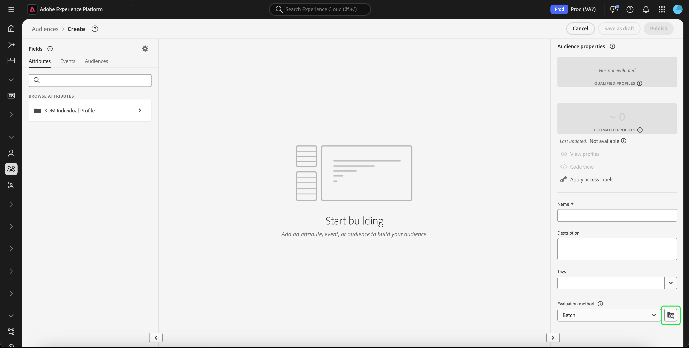

## セグメント定義の構成要素 {#building-blocks}

>[!CONTEXTUALHELP]
>id="platform_segments_createsegment_segmentbuilder_fields"
>title="フィールド"
>abstract="セグメント定義を構成する 3 つのフィールドタイプは、属性、イベントおよびオーディエンスです。属性では、XDM 個人プロファイルクラスに属するプロファイル属性を使用できます。イベントでは、XDM ExperienceEvent データ要素を使用して実行されるアクションやイベントに基づいてオーディエンスを作成できます。また、オーディエンスでは、外部ソースから読み込まれたオーディエンスを使用できます。"

>[!CONTEXTUALHELP]
>id="platform_segmentation_segmentbuilder_showfullxdmschema"
>title="完全な XDM スキーマの表示"
>abstract="デフォルトでは、データを含むフィールドのみが表示されます。このオプションを有効にして、XDM スキーマ内のすべてのフィールドを表示します。"

>[!CONTEXTUALHELP]
>id="platform_segmentation_segmentbuilder_showdeprecatedfields"
>title="非推奨フィールドの表示"
>abstract="デフォルトでは、非推奨の XDM フィールドは表示されません。このオプションを有効にして、非推奨の XDM フィールドを表示します。"

セグメント定義の基本的な構成要素は属性とイベントです。また、既存のオーディエンスに含まれている属性とイベントを、新しい定義の構成要素として使用することもできます。

>[!CONTEXTUALHELP]
>id="platform_segments_createsegment_segmentbuilder_summarydata"
>title="概要データ"
>abstract="概要データはプロファイル属性にのみ表示され、イベント属性またはオーディエンス属性には表示<b>されません</b>。  次の状況では、プロファイル属性の概要データが表示されない場合があります。 <ol><li>属性の値の一部が 100 文字を超えている。</li><li>属性に 3,000 を超える一意の値がある。</li></ol>"

>[!NOTE]
>
>属性の情報バブルを選択すると、フィールドの概要データとも呼ばれる値の分布を表示できます。 これらは、「属性」タブで使用できる&#x200B;**のみ**&#x200B;であり、「イベント」タブまたは「オーディエンス」タブでは使用できません。
>
>属性が次の条件を満たす場合、概要データが表示されます。属性の値はすべて100文字以下で、属性の一意の値は3000文字以下です。
>
>ただし、リレーションシップを介してプロファイルにリンクされた複数のエンティティ データである場合、属性&#x200B;**not**&#x200B;には概要データが含まれます。 例えば、`Vehicle`というカスタムスキーマがある場合、**スキーマ内の** プロパティ `Vehicle`には概要データが&#x200B;**not**&#x200B;になります。

これらの構成要素は、**[!UICONTROL Fields]** ワークスペースの左側にある[!DNL Segment Builder] セクションで確認できます。 **[!UICONTROL Fields]**&#x200B;には、主な構成要素（「[!UICONTROL Attributes]」、「[!UICONTROL Events]」、「[!UICONTROL Audiences]」）ごとにタブが含まれています。

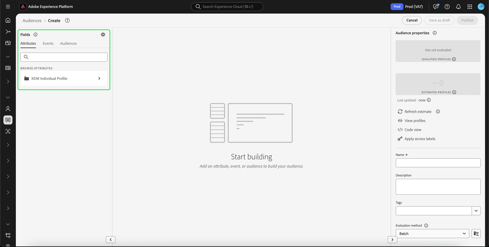

を選択して、表示されるフィールドの設定を調整できます。

**[!UICONTROL Available fields]**&#x200B;では、データを含むフィールドまたは完全なXDM スキーマのみを表示できます。

**[!UICONTROL Data sources]**&#x200B;では、フィルターを使用して、指定した取り込みタイプから取得された属性を表示できます。 サポートされている値には、**[!UICONTROL Show batch data]**、**[!UICONTROL Show streaming/edge data]**、**[!UICONTROL Show fields with no ingested data]**&#x200B;などがあります。

**[!UICONTROL Merge policy]**&#x200B;では、フィールドがどの結合ポリシーに属しているかを選択できます。

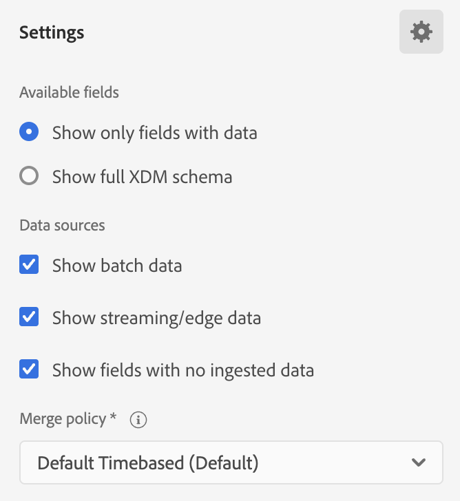

### 属性

「**[!UICONTROL Attributes]**」タブでは、[!DNL Profile] クラスに属する[!DNL XDM Individual Profile]属性を参照できます。 各フォルダーを展開して、追加の属性を表示できます。各属性はタイルで表されており、ワークスペースの中央にあるルールビルダーキャンバスにドラッグすることができます。[ルールビルダーキャンバス](#rule-builder-canvas)の詳細については、このガイドで後述します。

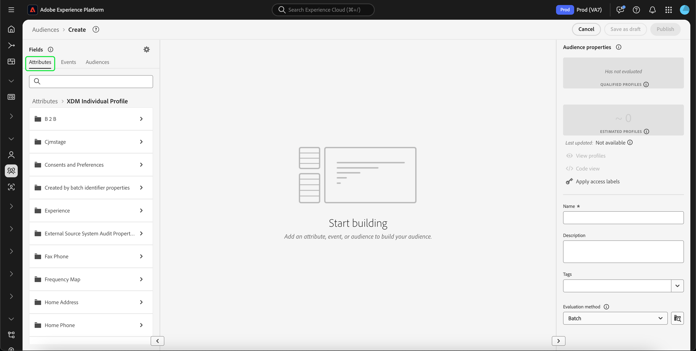

追加する属性は、次のいずれかのデータタイプにすることができます。

| データタイプ | よくあるユースケース |
| --------- | ---------------- |
| 文字列 | 名前、メールアドレス、商品カテゴリ |
| 数値 | 年齢、収益、製品数量、ロイヤルティスコア |
| ブール | 環境設定、ステータスインジケーター、ユーザーフラグ |
| 列挙 | 性別やステータスなど定義済みのリスト |
| 日付/時刻 | 購入日、訪問時間、誕生日 |

各データタイプには、次の演算子を使用できます。

+++ 文字列演算子

| 演算子 | 説明 | 例 |
| -------- | ----------- | ------- |
| 次に等しい | 指定した値と完全に一致する値を検索 | **equals** &quot;sample@example.com&quot; |
| 次と等しくない | 指定した値を除外 | ステータス **が** 「キャンセル済み」と等しくない |
| 次を含む | テキストには、指定した値が含まれます | 商品名&#x200B;**contains** &quot;iPhone&quot; |
| 次を含まない | テキストに指定された値が含まれていません | 説明&#x200B;**に** 「廃止」が含まれていません |
| 次で始まる | テキストは指定された値で始まります | 顧客ID **が**&#x200B;で始まる「PREM」 |
| 次で終わる | テキストは指定された値で終わります | 電子メール **は**&#x200B;で終わります。「@company.com」 |
| exists | 値が存在します | ミドルネーム **が存在します** |
| 存在しない | 値が存在しません | ロイヤルティステータス **が存在しません** |

+++

+++ 数値演算子

| 演算子 | 説明 | 例 |
| -------- | ----------- | ------- |
| 次に等しい | 指定した値と完全に一致する値を検索 | 年齢&#x200B;**に等しい** 25 |
| 次と等しくない | 指定した値を除外 | 注文数&#x200B;**が** 0と等しくありません |
| 次より大きい | 数値は、指定された値より&#x200B;**大きい**&#x200B;です。 この値は、指定された数値の&#x200B;**exclusive**&#x200B;です。 | 年間収益&#x200B;**50000以上**&#x200B;件 |
| 以上 | 数値は、指定された値より&#x200B;**大きい**&#x200B;です。 この値は、指定された数値の&#x200B;**包括的**&#x200B;です。 | 年齢&#x200B;**以上** 21 |
| 次より小さい | 数値は、指定された値より&#x200B;**小さい**&#x200B;です。 この値は、指定された数値の&#x200B;**exclusive**&#x200B;です。 | 購入からの日数&#x200B;**未満** 30 |
| 次より小さい | 数値は、指定された値より&#x200B;**小さい**&#x200B;です。 この値は、指定された数値の&#x200B;**包括的**&#x200B;です。 | 買い物かご値&#x200B;**以下** 100 |
| 間 | 数値は、指定された値の&#x200B;**から**&#x200B;です。 これらの値は、指定された数値の&#x200B;**包括的**&#x200B;です。 | 年齢&#x200B;**～** 25 ～ 45 |
| exists | 値が存在します | クレジットスコア **が存在します** |
| 存在しない | 値が存在しません | クレジットスコア **が存在しません** |

+++

+++ ブーリアン演算子

| 演算子 | 説明 | 例 |
| -------- | ----------- | ------- |
| 次に等しい | ブール値は、指定した値（TrueまたはFalse）に設定されます | 電子メールオプトイン **がTrue**&#x200B;に等しい |
| 次と等しくない | ブール値は、指定された値（TrueまたはFalse）に設定された&#x200B;**not**&#x200B;です | インストール済みモバイルアプリ **がTrue**&#x200B;と等しくない |

+++

+++ 列挙演算子

| 演算子 | 説明 | 例 |
| -------- | ----------- | ------- |
| 次に等しい | 値は、指定された列挙値と等しくなります | 性別&#x200B;**が女性**&#x200B;に等しい |
| 次と等しくない | 値が指定された列挙値と等しくない | 注文ステータス **がキャンセル済み**&#x200B;と等しくない |
| exists | 列挙値が設定されました | 優先言語&#x200B;**が存在します** |
| 存在しない | 列挙値が設定されていません | 優先言語&#x200B;**が存在しません** |

+++

+++ 日付/時刻演算子

| 演算子 | 説明 | 例 |
| -------- | ----------- | ------- |
| Today | その価値は今日生まれた。 「**年を無視**」チェックボックスを選択して、比較を年を無視することができます。 | 今日の生年月日&#x200B;**は** |
| 昨日 | その価値は昨日生まれた。 | 買い物かごの購入&#x200B;**は**&#x200B;昨日 |
| 今月 | 値は今月のカレンダーで発生しました。 | 誕生月&#x200B;**は**&#x200B;今月 |
| 今年 | この値は今年のカレンダーで発生しました。 | サインアップ日&#x200B;**は**&#x200B;です。今年 |
| カスタム日付 | 値は指定された日付に発生しました。 | 購入日&#x200B;**は** カスタム日です |
| In last | 値は、選択した最後の期間に発生しました。 先月誕生日&#x200B;**は**&#x200B;です | |
| 差出人（から） | 値は、選択した2つのカレンダーの日付に含まれています。 この期間は、両方の日付のうち&#x200B;**を含む**&#x200B;です。 | アカウント作成日&#x200B;**は** 4月20日から7月13日 |
| 実行中 | 値は、選択した月または年に発生しました。 | 3月のセール **is** |
| （+/ – ）内 | 値は、選択した日付から数日、数週間、数カ月、または数年以内に発生しました。 この期間は、両方の日付のうち&#x200B;**を含む**&#x200B;です。 | 買い物かごの放棄は&#x200B;**3日以内です** |
| 前 | 値は、選択した日付より前に発生しました。 | メンバーシップの参加日は&#x200B;**前** 2025年1月3日です |
| 変更後  | 値は、選択した日付の後に発生しました。 | 購入日は2024年3月14日以降&#x200B;**です** |
| 圧延範囲 | 値は、2つの相対的な日付の間で発生しました。 | 最終購入日は、7日前から3日前の範囲内です。 |
| 次の段階 | 値は、選択した次の期間内に発生しました。 | 買い物かごの放棄は今後2日以内です |

時刻と日付の関数について詳しくは、[時間制約の節](#time-constraints)を参照してください。

+++

属性を選択すると、[情報アイコン &#x200B;](../../images/icons/info.png)を選択して概要データを表示できます。 概要データには、フィールドの説明、値のレコード数、この属性の値を含むアカウントの割合などの情報が含まれます。

**[!UICONTROL Top values]** セクションには、属性に対して最も頻繁に発生する値が表示され、値、値を持つレコードの数、値が表す合計レコードの割合などの詳細が含まれます。

プロファイルの25%未満が属性に入力した場合は、代わりにが表示されます。 属性に関わらず、同じ概要データが表示されます。

>[!NOTE]
>
>上位の値は、フィールドに異なる値が&#x200B;**not**&#x200B;あり、それらのフィールドの値が一般的に繰り返される場合にのみ表示されます。 さらに、この概要データは&#x200B;**日単位**&#x200B;で更新されます。

さらに、属性には&#x200B;**[!UICONTROL Ingestion Type]**&#x200B;があります。 取り込みタイプは、データの出所を知ることができ、次のいずれかの値にすることができます：**[!UICONTROL Batch]**、**[!UICONTROL Streaming/Edge]**、または&#x200B;**[!UICONTROL No Data Ingested]**。

#### 計算属性 {#computed-attributes}

計算属性は、集計または数式を使用して他の属性から計算されるフィールドです。 複数のイベントをまたいで合計、数、平均などの集計データが必要な場合や、複雑な計算を必要とする頻繁に使用されるオーディエンスを構築する場合は、計算属性を使用できます。

計算属性の作成方法、その中で使用できる関数、および計算属性の管理方法など、計算属性の詳細については、[計算属性の概要](/help/profile/computed-attributes/overview.md)を参照してください。

### イベント

「**[!UICONTROL Events]**」タブでは、[!DNL XDM ExperienceEvent] データ要素を使用して発生したイベントまたはアクションに基づいてオーディエンスを作成できます。 また、**[!UICONTROL Events]** タブでイベントタイプを見つけることもできます。このタブは、よく使用されるイベントのコレクションで、セグメント定義をより迅速に作成できます。

[!DNL ExperienceEvent] 要素を参照できるだけでなく、イベントタイプを検索することもできます。イベントタイプでは、[!DNL ExperienceEvents] と同じコーディングロジックを使用します。その際に、[!DNL XDM ExperienceEvent] クラスで正しいイベントを検索する必要はありません。例えば、検索バーを使用して「買い物かご」を検索すると、イベントタイプ「[!UICONTROL AddCart]」と「[!UICONTROL RemoveCart]」が返されます。これは、セグメント定義を構築する際に非常によく使用される2つの買い物かごアクションです。

任意のタイプのコンポーネントを検索するには、[Lucene の検索構文](https://docs.microsoft.com/ja-JP/azure/search/query-lucene-syntax)を使用して、検索バーにその名前を入力します。単語を完全に入力すると、検索結果が表示され始めます。例えば、XDM フィールド `ExperienceEvent.commerce.productViews` に基づくルールを作成するには、検索フィールドに「product views」と入力します。「product」という単語の入力が終わると同時に、検索結果が表示され始めます。検索結果には、それが属するオブジェクト階層も表示されます。

>[!NOTE]
>
>組織で定義されたカスタムスキーマフィールドが表示され、ルールの作成に使用できるようになるまでに、最長で 24 時間かかる場合があります。

次に、[!DNL ExperienceEvents]と「[!UICONTROL Event Types]」をセグメント定義に簡単にドラッグ&amp;ドロップできます。

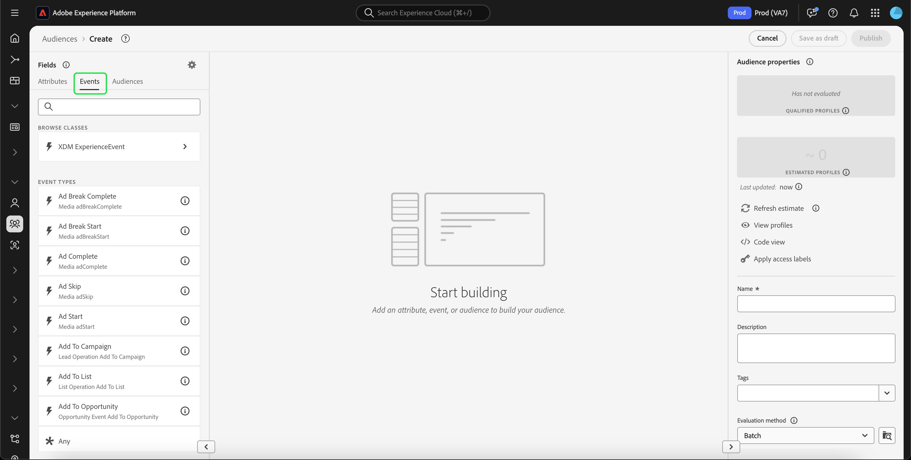

デフォルトでは、データストアから入力されたスキーマフィールドのみが表示されます。これには「[!UICONTROL Event Types]」が含まれます。 「[!UICONTROL Event Types]」リストが表示されていない場合、または「[!UICONTROL Any]」を「[!UICONTROL Event Type]」としてのみ選択できる場合は、**の横にある**&#x200B;歯車アイコン **[!UICONTROL Fields]**&#x200B;を選択し、**[!UICONTROL Show full XDM schema]**&#x200B;の下にある&#x200B;**[!UICONTROL Available Fields]**&#x200B;を選択します。 **ギアアイコン**&#x200B;をもう一度選択して&#x200B;**[!UICONTROL Fields]** タブに戻ります。これで、データが含まれているかどうかに関係なく、複数の「[!UICONTROL Event Types]」フィールドとスキーマフィールドを表示できるようになります。

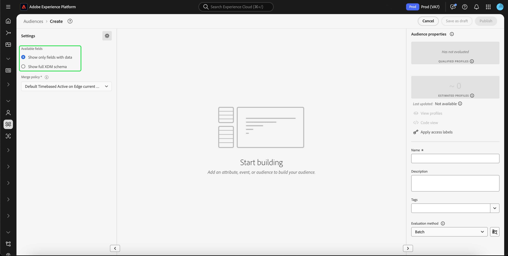

#### Adobe Analytics レポートスイートのデータセット

セグメント化において 1 つまたは複数の Adobe Analytics レポートスイートのデータをイベントとして使用できます。

単一のAnalytics レポートスイートのデータを使用する場合、Experience PlatformはeVarに記述子とわかりやすい名前を自動的に追加し、[!DNL Segment Builder]内でそれらのフィールドを見つけやすくします。

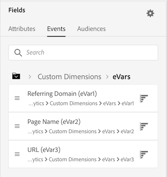

複数のAnalytics レポートスイートのデータを使用する場合、Experience Platform **はeVarに記述子やわかりやすい名前を自動的に追加できません**。 したがって、Analytics レポートスイートのデータを使用する前に、XDM フィールドにマッピングする必要があります。 Analytics 変数から XDM へのマッピングについて詳しくは、[Adobe Analytics ソース接続ガイド](../../sources/tutorials/ui/create/adobe-applications/analytics.md#mapping)を参照してください。

例えば、次の変数が含まれる 2 つのレポートスイートがあるとします。

| フィールド | レポートスイートスキーマ A | レポートスイートスキーマ B |
| ----- | --------------------- | --------------------- |
| eVar1 | 参照ドメイン | ログイン済み Y/N |
| eVar2 | ページ名 | メンバーロイヤルティ ID |
| eVar3 | URL | ページ名 |
| eVar4 | 検索語句 | 製品名 |
| event1 | クリック数 | ページビュー数 |
| event2 | ページビュー数 | 買い物かごへの追加 |
| event3 | 買い物かごへの追加 | チェックアウト |
| event4 | 購入 | 購入 |

この場合、これら 2 つのレポートスイートを次のスキーマでマッピングできます。

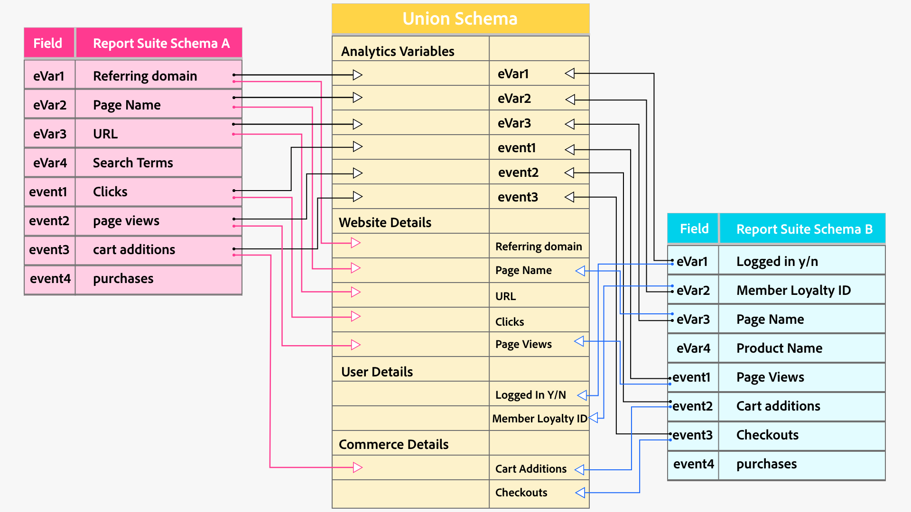

>[!NOTE]
>
>汎用 eVar 値は引き続き入力されますが、レポート内の元の値とは異なる意味を持つ可能性があるので、セグメント定義では使用し&#x200B;**ない**&#x200B;でください（可能な場合）。

レポートスイートがマッピングされると、これらの新しくマッピングされたフィールドをプロファイル関連のワークフローおよびセグメント化内で使用できます。

| シナリオ | 結合スキーマエクスペリエンス | セグメント化汎用変数 | セグメント化マッピング変数 |
| -------- | ----------------------- | ----------------------------- | ---------------------------- |
| 単一レポートスイート | 汎用変数には、フレンドリ名記述子が含まれます。  **例：**&#x200B;ページ名（eVar2） | <ul><li>汎用変数に含まれるフレンドリ名記述子</li><li>唯一のクエリであるので、クエリでは特定のデータセットのデータを使用します</li></ul> | クエリでは、Adobe Analytics データを使用でき、場合によってはその他のソースを使用できます。 |
| 複数のレポートスイート | 汎用変数には、フレンドリ名記述子は含まれません。  **例：** eVar2 | <ul><li>複数の記述子を持つフィールドは、すべて汎用として表示されます。つまり、UI にフレンドリ名は表示されません。</li><li>クエリでは、eVar を含む任意のデータセットのデータを使用できます。これにより、結果が混在したり、不正確になったりする可能性があります。</li></ul> | クエリでは、複数のデータセットから正しく結合された結果を使用します。 |

### オーディエンス

>[!CONTEXTUALHELP]
>id="platform_segmentation_segmentBuilder_b2b_decomposition"
>title="複雑な評価"
>abstract="次の式は複雑すぎて、単一のオーディエンスとして表現できません。同じセグメント定義で B2B ルールと人物ベースのイベントの両方を使用するには、次の手順に従ってください。<ol><li>人物ベースのイベントのみを参照するセグメント定義を作成し、独自のセグメント定義として保存します。</li><li>新しいセグメント定義では、B2B ルールを参照しながら、以前に作成したセグメント定義を読み込みます。</li></ol>"

>[!CONTEXTUALHELP]
>id="platform_segmentation_segmentbuilder_externalaudiences"
>title="外部オーディエンス"
>abstract="「オーディエンス」タブを使用して読み込んだオーディエンスは、オーディエンスポータルを通じて自動的に表示されるようになりました。これには、Audience Manager、Customer Journey Analytics、Segment Match およびその他のカスタム統合から取り込まれたオーディエンスが含まれます。  2025年9月末までに、オーディエンスは統合検索を通じてのみ取得可能となり、以前のワークフローはサポートされなくなります。サービスの移行中、Segment Match を利用できるのは、少数の指定された顧客のみです。Segment Match の新規顧客のアクセスは、サービスが完全に廃止される前に、リクエストに応じて引き続き有効にすることができます。  継続的なデータコラボレーションのユースケースについては、Adobe では、長期的にサポートされるソリューションである Collaboration に移行することをお勧めします。"
>additional-url="https://experienceleague.adobe.com/ja/docs/experience-platform/segmentation/ui/audience-portal#list" text="オーディエンスポータル"

>[!NOTE]
>
>Experience Platform内で作成されたオーディエンスの場合、**same**&#x200B;結合ポリシーを持つオーディエンスのみが表示されます。

「**[!UICONTROL Audiences]**」タブには、Adobe Audience ManagerやCustomer Journey Analyticsなどの外部ソースから読み込まれたすべてのオーディエンスと、[!DNL Experience Platform]内で作成されたオーディエンスが一覧表示されます。

「**[!UICONTROL Audiences]**」タブでは、利用可能なすべてのソースをフォルダーのグループとして表示できます。 フォルダーを選択すると、使用可能なサブフォルダーとオーディエンスが表示されます。また、フォルダー構造を表示するには、フォルダーアイコンを選択します（右端の画像を参照）。チェックマークは、現在のフォルダーを表しています。また、ツリー内のフォルダーの名前を選択することで、フォルダー間を簡単に移動できます。

オーディエンス横の ⓘ にカーソルを置くと、そのオーディエンスに関する情報が表示されます。例えば、ID、説明、そのオーディエンスが存在するフォルダーの階層などです。

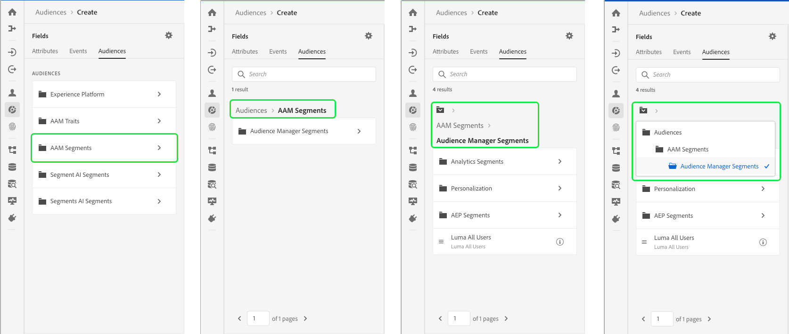

## ルールビルダーキャンバス {#rule-builder-canvas}

>[!IMPORTANT]
>
>2024年6月リリースの時点では、「今月」と「今年」の時間制約はそれぞれ「月々」と「年々」を表しています。 例えば、7月18日に「今月の誕生日を持つすべての顧客」を探すオーディエンスを作成した場合、7月1日から7月31日までの誕生日を持つすべての顧客がオーディエンスに表示されます。 8月1日から8月31日の間に誕生日を迎えるお客様には、このオーディエンスが提供されます。
>
>以前は、「今月」と「今年」はそれぞれ30日と365日を表し、31日とうるう年で数か月を説明できませんでした。
>
>オーディエンスのロジックを更新するには、以前に作成したオーディエンスを再保存してください。

セグメント定義は、ターゲットオーディエンスの重要な特徴やビヘイビアーの説明に使用される一連のルールです。これらのルールは、[!DNL Segment Builder] の中央にあるルールビルダーキャンバスを使用して作成します。

セグメント定義に新しいルールを追加するには、「**[!UICONTROL Fields]**」タブからタイルをドラッグし、ルールビルダーキャンバスにドロップします。 追加するデータのタイプに応じて、コンテキスト固有のオプションが表示されます。使用可能なデータタイプには、文字列、日付、[!DNL ExperienceEvents]、「[!UICONTROL Event Types]」およびオーディエンスが含まれます。

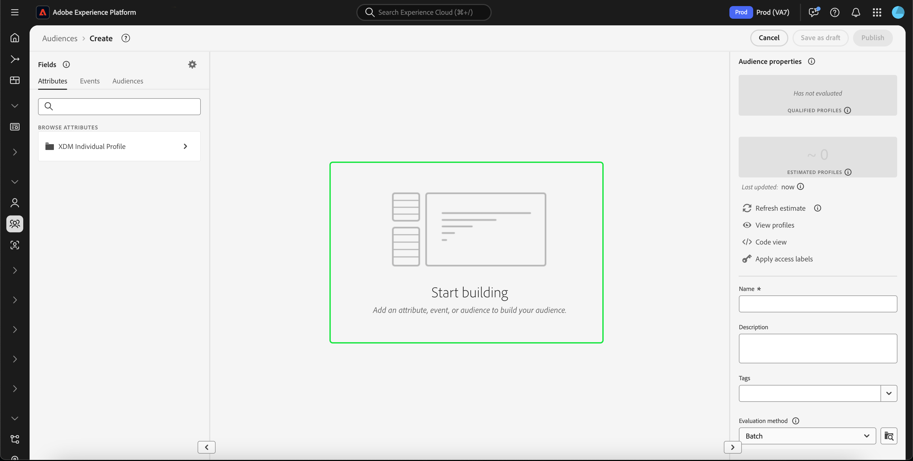

>[!IMPORTANT]
>
>Adobe Experience Platform に対する最新の変更により、イベント間の `OR` および `AND` 論理演算子の使用が更新されました。これらの更新は、既存のセグメント定義には影響しません。ただし、既存のセグメント定義と新しく作成されたセグメント定義に対するその後の更新はすべて、これらの変更の影響を受けます。詳しくは、[時間制約の更新](./segment-refactoring.md)を参照してください。

属性の値を選択すると、属性が取り得る列挙値のリストが表示されます。

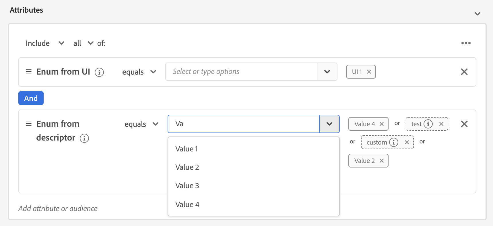

この列挙リストから値を選択すると、その値が実線の境界線で囲まれます。ただし、`meta:enum`（ソフト）列挙を使用するフィールドの場合、列挙リストに&#x200B;**ない**&#x200B;値を選択することもできます。独自の値を作成すると、この値が列挙リストにないという警告と共に、値が点線の境界線で囲まれます。

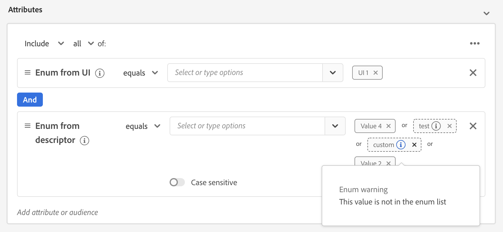

複数の値を作成している場合は、バルクアップロードを使用して一度にすべてを追加できます。を選択して、**[!UICONTROL Add values in bulk]** ポップオーバーを表示します。

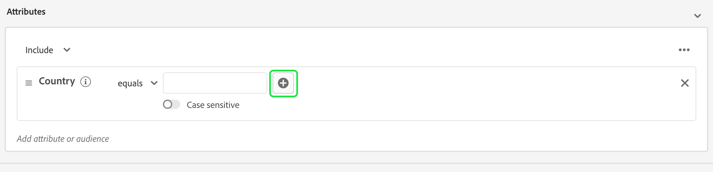

**[!UICONTROL Add values in bulk]** ポップオーバーで、CSVまたはTSV ファイルをアップロードできます。

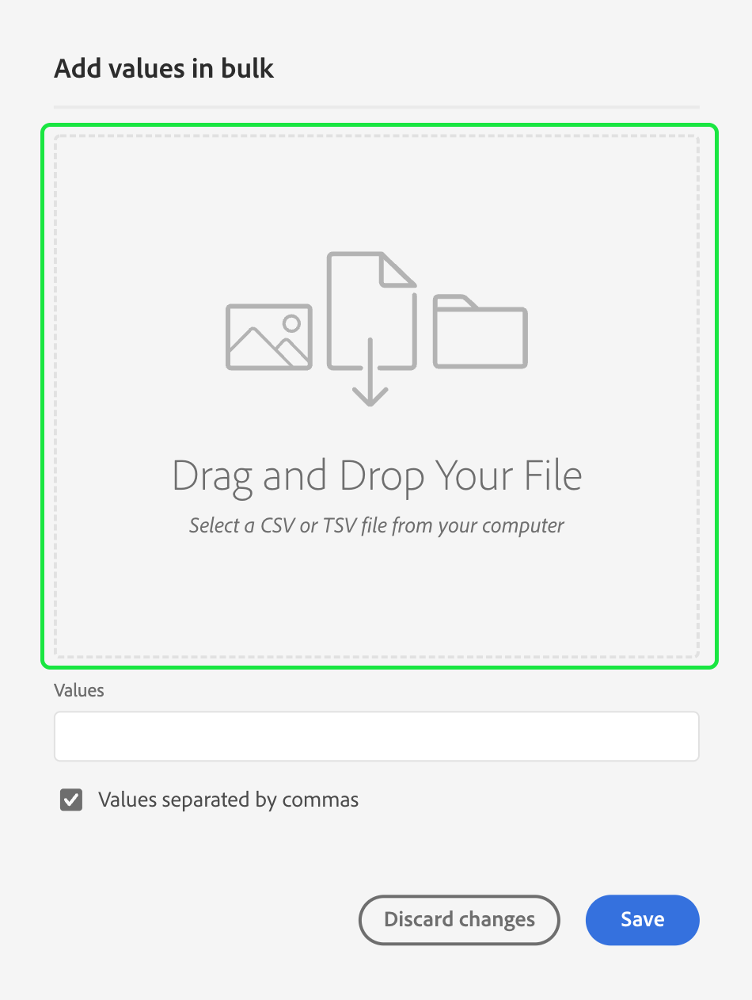

または、コンマ区切りの値を手動で追加することもできます。

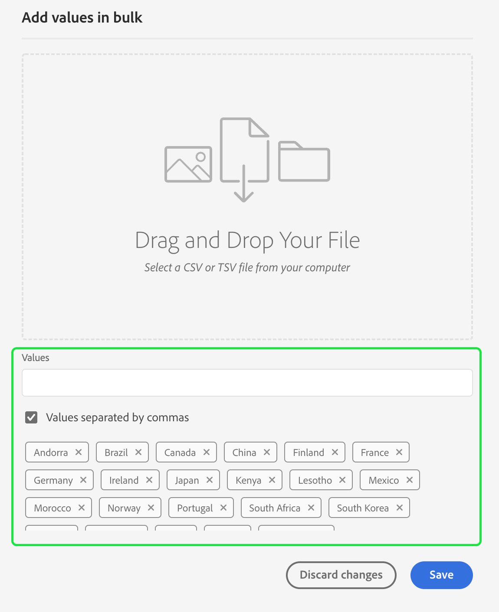

最大 250 個の値が許可されます。この値を超える場合は、値を削除してから追加する必要があります。

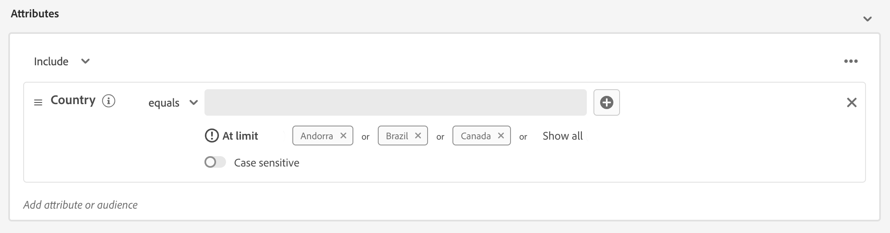

### オーディエンスの検証 {#audience-validation}

セグメントビルダーは、オーディエンス定義を自動的に分析および検証し、オーディエンス定義のベストプラクティスを遵守していることを確認します。 これらのベストプラクティスは、クリティカル検証とパフォーマンス最適化の2つのカテゴリに設定できます。

オーディエンス定義が重要な検証のベストプラクティスに違反した場合、サンドボックスを安定させるために&#x200B;**not**&#x200B;で変更を保存できます。 オーディエンス定義がパフォーマンス最適化のベストプラクティスに違反した場合は、変更を保存できますが、パフォーマンスの問題を回避するためにオーディエンス定義を更新することは&#x200B;*強くお勧めします*。

| 検証チェック | タイプ | しきい値 |
| ---------------- | ---- | --------- |
| 論理的な複雑さ | クリティカル検証 | オーディエンスの定義が複雑すぎる。 |
| シーケンシャルイベント | クリティカル検証 | オーディエンス定義には、6つ以上の連続イベントがあります。 |
| 集計数 | パフォーマンスの最適化 | オーディエンス定義内には3つ以上の集計関数があります。 |
| ネストされたデータ | パフォーマンスの最適化 | オーディエンス定義内には、ネストされたデータ（配列またはマップデータタイプ）の深さ2つ以上のレベルがあります。 |
| オーディエンスサイズ | パフォーマンスの最適化 | オーディエンスの選定サイズが、サンドボックス内のプロファイルの合計数の30%を超えています。 |

オーディエンス検証の仕組みについて詳しくは、[&#x200B; オーディエンス検証ガイド &#x200B;](/help/segmentation/validation.md)を参照してください。

### オーディエンスの追加

>[!CONTEXTUALHELP]
>id="platform_segmentation_segmentbuilder_addaudiences"
>title="更新の検索"
>abstract="既存の検索システムは、統合検索を使用するように更新されました。統合検索を使用すると、オーディエンスのセグメントメンバーシップをより簡単かつ確実に検索できます。"

「**[!UICONTROL Audience]**」タブからルールビルダーキャンバスにオーディエンスをドラッグ&amp;ドロップして、新しいセグメント定義のオーディエンスメンバーシップを参照できます。 これにより、オーディエンスのメンバーシップを新しいセグメント定義ルールの属性として含めたり除外したりできます。

[!DNL Segment Builder] を使用して作成した [!DNL Experience Platform] オーディエンスの場合は、オーディエンスを、そのオーディエンスのセグメント定義で使用されていた一連のルールに変換することができます。このような変換では、ルールロジックのコピーが作成されます。このコピーを変更すれば、元のセグメント定義に影響を与えずに済みます。セグメント定義に対する最近の変更を、ルールロジックに変換する前に必ず保存しておいてください。

>[!NOTE]
>
>外部ソースからオーディエンスを追加した場合、オーディエンスのメンバーシップのみが参照されます。このオーディエンスをルールに変換することはできないので、元のオーディエンスの作成に使用されたルールを新しいセグメント定義で変更することはできません。

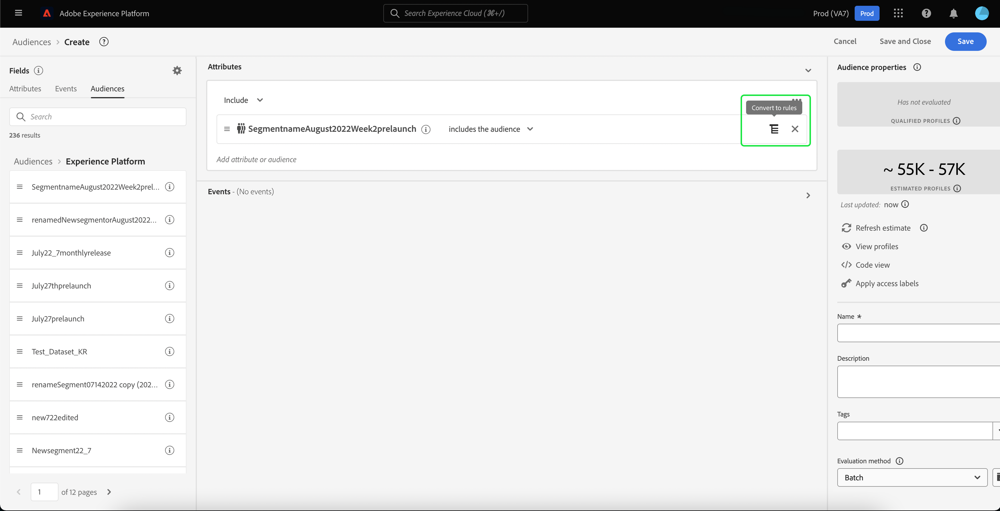

オーディエンスをルールに変換するときに競合が発生した場合、[!DNL Segment Builder] は既存のオプションを可能な限り保持しようとします。

### コードビュー

または、[!DNL Segment Builder] で作成されたルールのコードベースバージョンを表示できます。ルールビルダーキャンバス内でルールを作成したら、**[!UICONTROL Code view]**&#x200B;を選択して、セグメント定義をPQLとして表示できます。

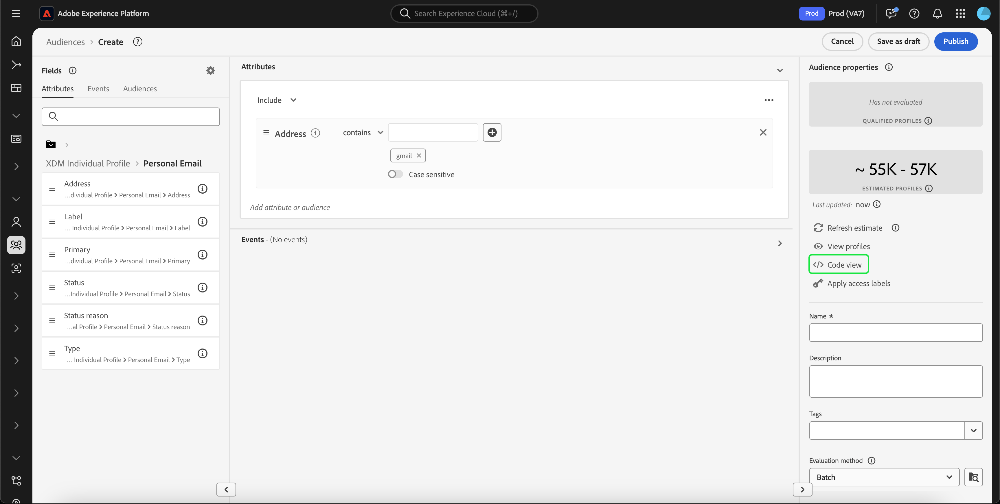

コードビューには、API 呼び出しで使用するセグメント定義の値をコピーできるボタンがあります。セグメント定義の最新バージョンを取得するには、最新の変更をセグメント定義に保存してあることを確認してください。

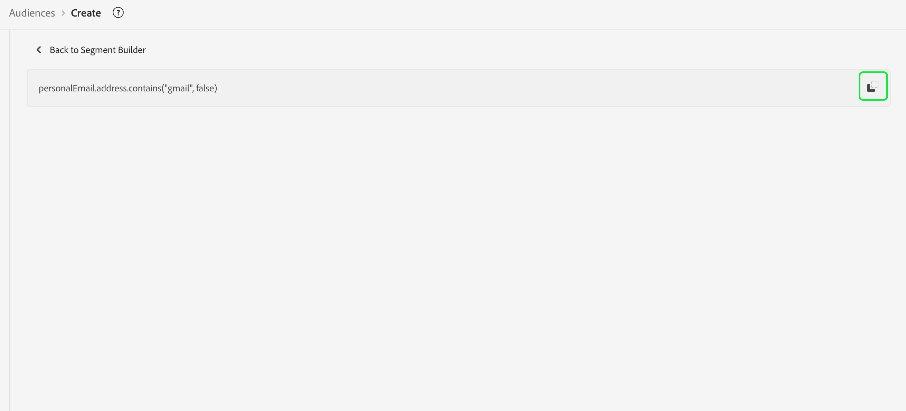を使用できます

### 集計関数

[!DNL Segment Builder] での集計は、データタイプが数値（倍精度浮動小数点数または整数）である XDM 属性のグループに対する計算です。セグメントビルダー内でサポートされている 4 つの集計関数は、SUM、AVERAGE、MIN および MAX です。

集計関数を作成するには、左側のパネルからイベントを選択し、[!UICONTROL Events] コンテナに挿入します。

イベントをイベントコンテナ内に配置した後、省略記号アイコン（。..）を選択し、次に&#x200B;**[!UICONTROL Aggregate]**&#x200B;を選択します。

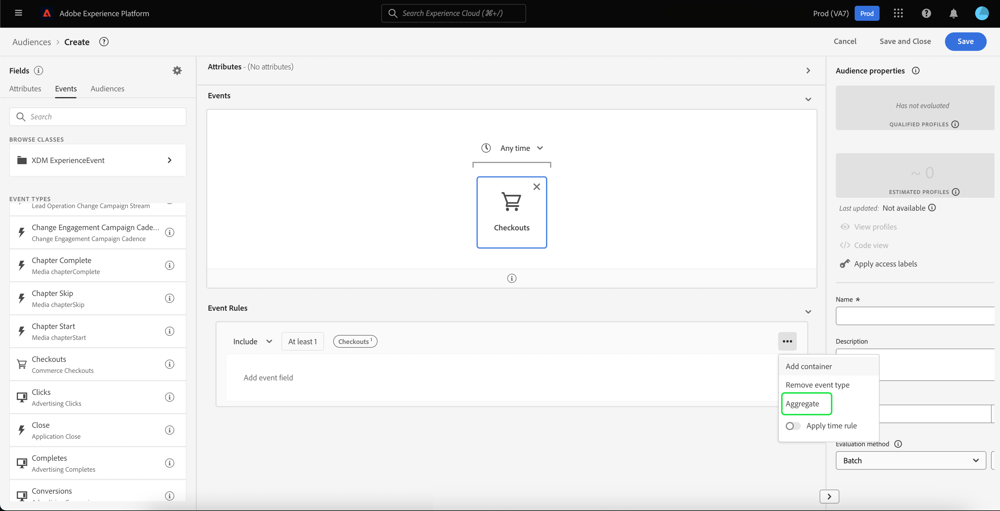

これで、集計が追加されます。集計関数を選択し、集計する属性、等値関数および値を選択できるようになりました。次の例では、個々の購入額が 100 ドル未満であっても、購入額の合計が 100 ドルを超えるプロファイルはすべて、このセグメント定義に該当します。

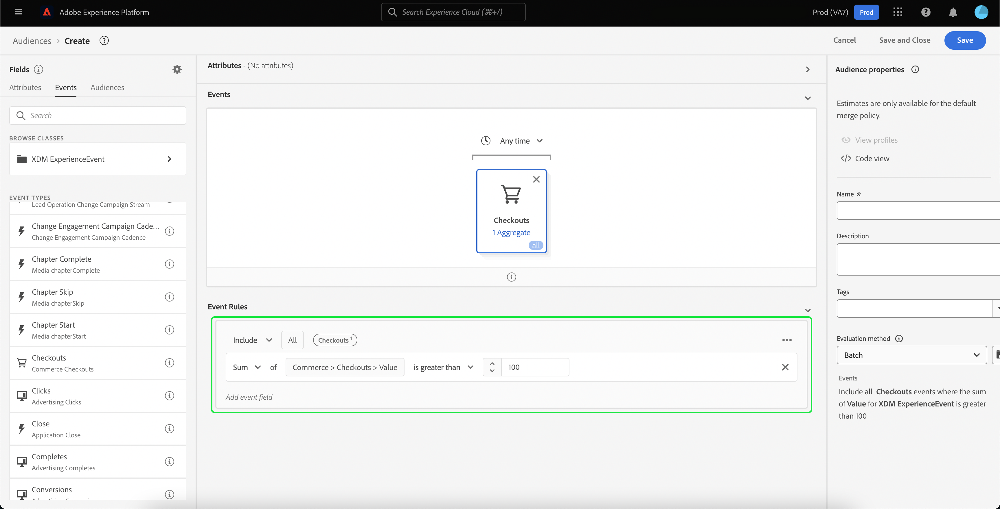

### カウント関数 {#count-functions}

セグメントビルダーのカウント関数は、指定されたイベントを検索し、イベントが実行された回数をカウントするために使用されます。セグメントビルダーでサポートされているカウント関数は、「少なくとも」、「最大で」、「正確に」、「範囲内」および「すべて」です。

カウント関数を作成するには、左側のパネルからイベントを選択し、[!UICONTROL Events] コンテナに挿入します。

イベントコンテナ内にイベントを配置したら、[!UICONTROL At least 1] ボタンを選択します。

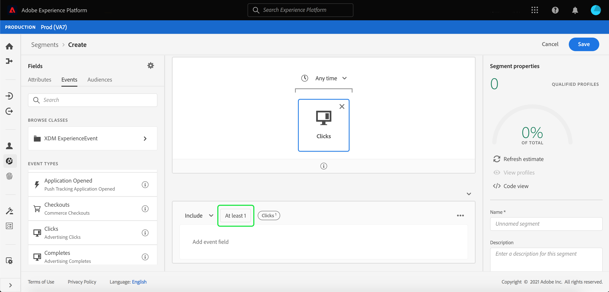

これで、カウント関数が追加されました。カウント関数と関数の値を選択できるようになりました。次の例では、少なくとも 1 回のクリックが発生したイベントを含めることになります。

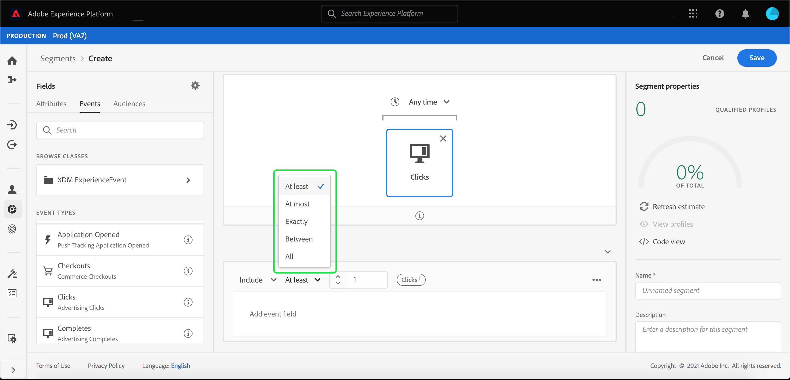

### 時間の制約 {#time-constraints}

時間制約を使用すると、時間ベースの属性、イベント、イベント間の順序に時間制限を適用できます。

>[!IMPORTANT]
>
>2024年6月より前に「今月」または「今年」の時間制約を使用してセグメント定義を作成した場合は、セグメント定義を再保存する必要があります。 2024年6月より以前は、「今月」は30日、「今年」は365日でした。

>[!NOTE]
>
>[年を無視する時間制約](./ignore-year.md)と[&#x200B; ルールレベルの時間制約](./segment-refactoring.md)の両方が以前にリファクタリングされ、リンクされた概要で詳細な情報を利用できるようになりました。

使用可能な時間制約のリストは次のとおりです。

+++ 利用可能な時間の制約

>[!NOTE]
>
>すべての時間制約はUTCに基づいています。
>
>さらに、[!UICONTROL Ignore year] チェックボックスが有効になっている場合、セグメント定義の評価の一部として、年は&#x200B;**not**&#x200B;と比較されます。

| 時間制限 | 説明 | 年を無視を有効にできます | 例 |
| --------------- | ----------- | ------------------- | ------- |
| Today | **を比較する属性またはイベントは、今日から発生する必要があります。** | ○ | 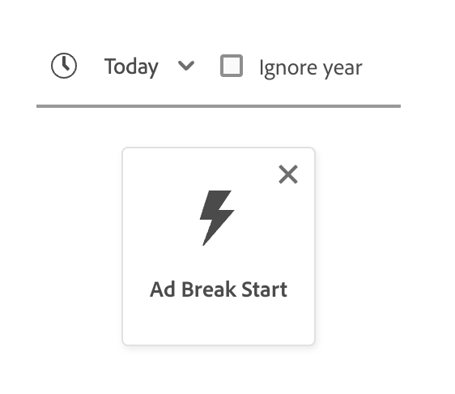{width="100" zoomable="yes"} |
| 昨日 | **を比較する属性またはイベントは、昨日発生する必要があります。** | ○ | {width="100" zoomable="yes"} |
| 今月 | **を比較する属性またはイベントは、今月に発生する必要があります**。 | ○ | 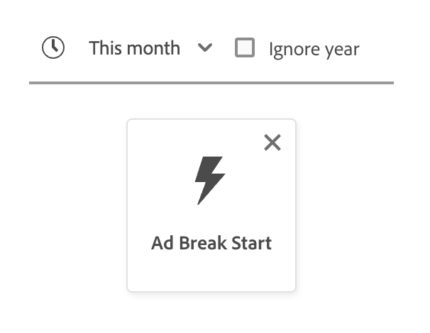{width="100" zoomable="yes"} |
| 今年 | **を比較する属性またはイベントは、今年のカレンダーで発生する必要があります**。 | × | {width="100" zoomable="yes"} |
| カスタム日付 | **を比較する属性またはイベントは、指定された日付に発生する必要があります**。 | ○ | {width="100" zoomable="yes"} |
| In last | **を比較する属性またはイベントは、選択した最後の期間内に発生する必要があります**。 この期間は、評価時間まで&#x200B;**包括的**&#x200B;です。 | × | {width="100" zoomable="yes"} |
| 差出人（から） | **を比較する属性またはイベントは、選択した2つのカレンダー日付内で発生する必要があります**。 この期間は、両方の日付のうち&#x200B;**を含む**&#x200B;です。 | はい、カスタム日付の場合 | {width="100" zoomable="yes"} |
| 実行中 | **を比較する属性またはイベントは、選択した月または年の範囲内で発生する必要があります**。 月を選択した場合は、属性またはイベントが発生した月と年の両方を選択する必要があります。  年を選択した場合は、属性またはイベントが発生した年を選択するだけです。 月を選択した場合は、[!UICONTROL Ignore year] チェックボックスを有効にすることもできます。 | ○ | 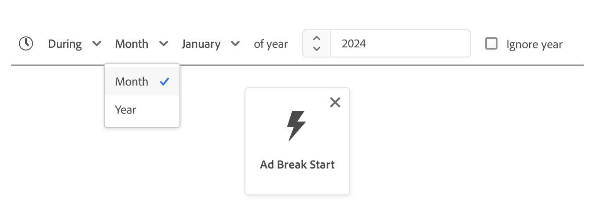{width="100" zoomable="yes"} |
| （+/ – ）内 | **を比較する属性またはイベントは、選択した日付から数日、数週間、数か月、または数年以内に発生する必要があります**。 この期間は、両方の日付のうち&#x200B;**を含む**&#x200B;です。 選択した日付は、今日、昨日、または選択した別のカスタム日付にすることができます。 | ○ | 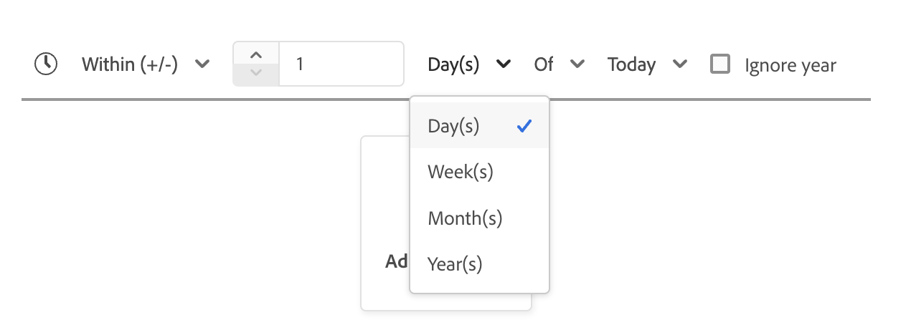{width="100" zoomable="yes"} |
| 前 | **を比較する属性またはイベントは、選択した日付より前に発生する必要があります**。 選択した日付は、選択したカスタム日付、または日、週、月、または数年前の間の選択です。 | ○ | {width="100" zoomable="yes"} |
| 変更後  | **を比較する属性またはイベントは、選択した日付より後に発生する必要があります**。 選択した日付は、選択したカスタム日付、または日、週、月、または数年前の間の選択です。 | ○ | 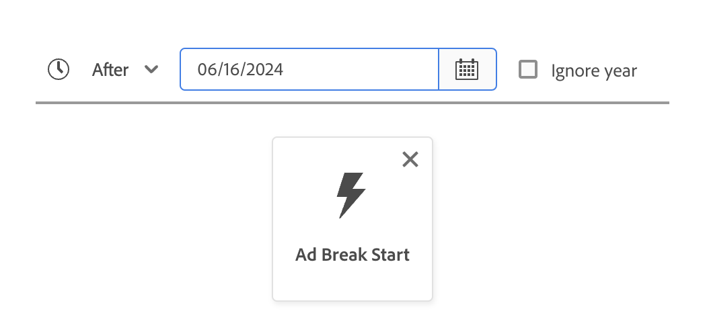{width="100" zoomable="yes"} |
| 圧延範囲 | 比較する属性またはイベントは、2つの相対的な日付の間で発生する必要があります。 日付は、秒、分、時間、日、週、月、または年で表すことができます。 | × | 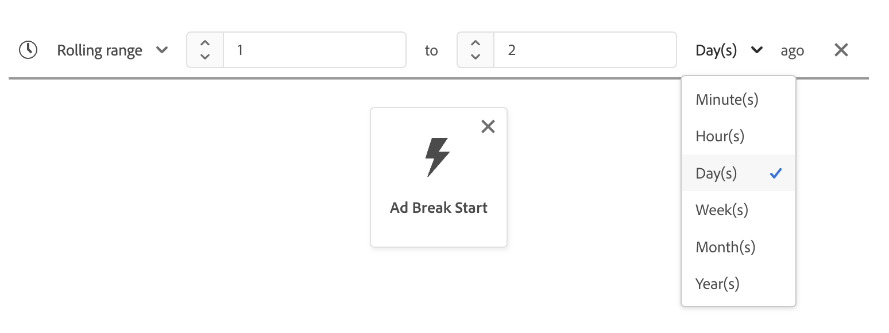{width="100" zoomable="yes"} |
| 次の段階 | 比較する属性またはイベントは、選択した次の期間内に発生する必要があります。 選択した期間には、分、時間、日、週、月、年が含まれます。 | × | {width="100" zoomable="yes"} |
| exists | 属性が存在します。 | × | 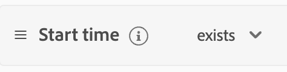{width="100" zoomable="yes"} |
| 存在しない | 属性が存在しません。 | × | 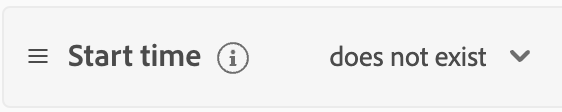{width="100" zoomable="yes"} |

+++

イベントに時間制約を適用する場合は、キャンバスレベル、カードレベル、またはイベント間で時間制約を適用できます。

#### カンバスレベルの制約

カンバスレベルの時間制約を適用するには、イベントのタイムラインの上に表示される時計アイコンを選択します。

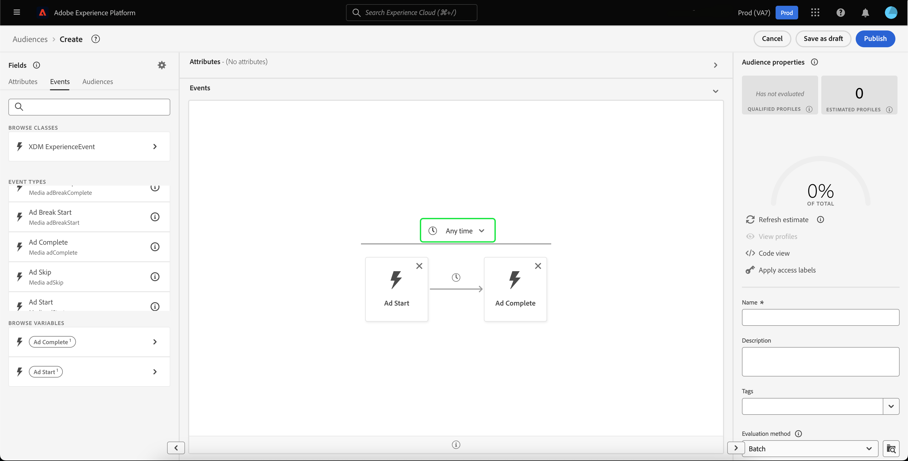

キャンバスレベルで時間制約を適用すると、時間制約がオーディエンスの&#x200B;**all** イベントに適用されます。

#### カードレベルの制約

カードレベルの制約を適用するには、時間制約を適用するカードを選択し、次に省略記号アイコン、および&#x200B;**[!UICONTROL Apply time rule]**&#x200B;を選択します。 これにより、**[!UICONTROL Event Rules]** コンテナ内の時間制約を選択できます。

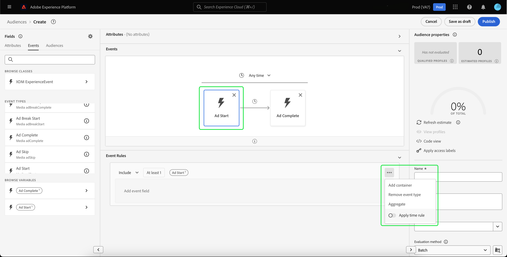

時間の制約をカードレベルで適用すると、これはオーディエンスの&#x200B;**指定** イベントに時間の制約を適用します。

#### イベント間の制約

イベント間に時間制約を適用するには、時間制約を適用する2つのイベント間の時計アイコンを選択します。

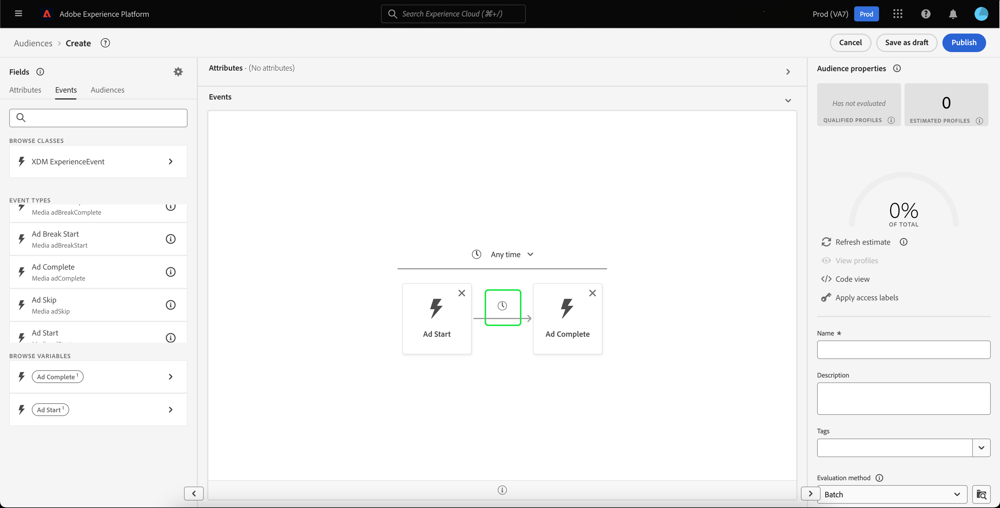

イベント間に時間制約を適用すると、イベント間の時間&#x200B;**に時間制約が適用されます。**

この操作で使用可能な時間制約のリストは、時間制約の主なリストとは異なり、次のとおりです。

+++ 利用可能な時間の制約

| 時間制限 | 説明 |
| --------------- | ----------- |
| 変更後  | 後者のイベント **は、前のイベントの後に少なくとも**&#x200B;行う必要があります。 |
| 内 | 2つのイベント **must**&#x200B;は、時間制約の範囲内にリストされている期間に発生します。 |

>[!NOTE]
>
>「After」時間制約を使用する場合、後者のイベントは、時間制約の中にリストされている時間よりも多く発生する可能性があります。 >
>例えば、ページビューイベントとチェックアウトイベントがあり、これら2つのイベント間に「1時間後」の時間制約を設定した場合、ページビューイベントの2時間後にチェックアウトイベントを含むセグメント定義が適用されます。
>
>さらに、これらの2つの時間制約は相互に調整して使用できます。
>
>例えば、ページビューイベントとチェックアウトイベントがあり、「1時間後」と「24時間以内」の時間制約の両方を設定した場合、ページビューイベントの12時間後にチェックアウトイベントを含むセグメント定義は適用されますが、ページビューイベントの36時間後にチェックアウトイベントを含むセグメント定義は適用されません。

+++

## コンテナ {#containers}

オーディエンスは、リストされた順序で評価されます。 コンテナでは、ネストされたクエリを使用して、評価の順序を制御できます。

ルールビルダーキャンバスにタイルを 1 つ以上追加したら、コンテナの追加を開始できます。新しいコンテナを作成するには、タイルの右上隅にある省略記号（。..）を選択し、**[!UICONTROL Add container]**&#x200B;を選択します。

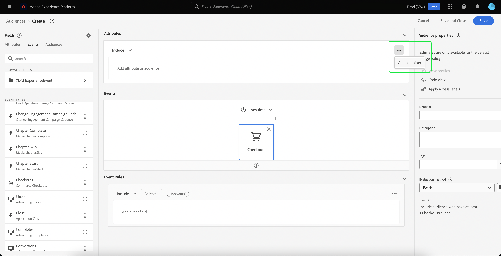

新しいコンテナが最初のコンテナの子として表示されますが、コンテナをドラッグして移動することで、階層を調整することができます。コンテナのデフォルトの動作は、指定された属性、イベント、またはオーディエンスを「[!UICONTROL Include]」にします。 タイルの左上隅にある[!UICONTROL Exclude]を選択し、「**[!UICONTROL Include]**」を選択することで、コンテナ条件に一致する「[!UICONTROL Exclude]」プロファイルにルールを設定できます。

子コンテナを展開して、親コンテナにインラインで追加することもできます。それには、子コンテナで「コンテナを展開」を選択します。このオプションにアクセスするには、子コンテナの右上隅にある省略記号（...）を選択します。

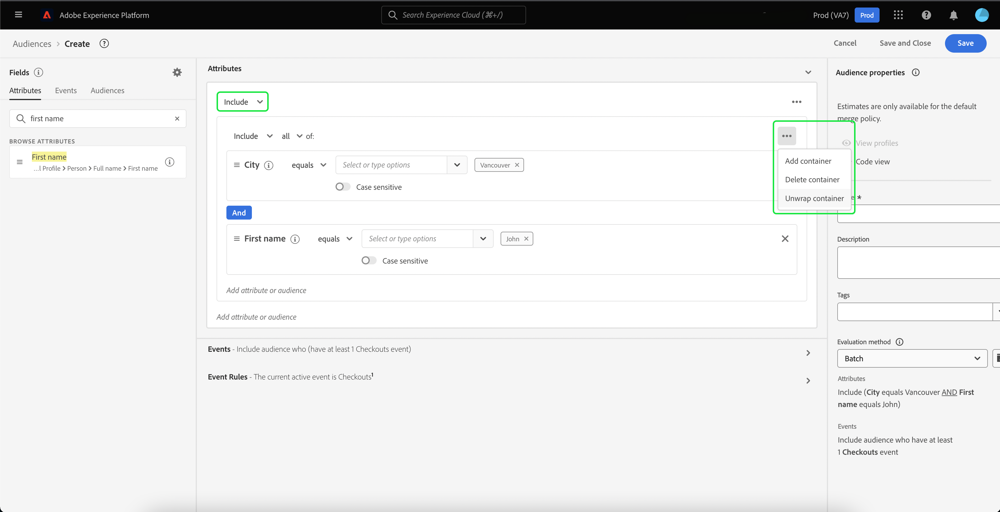

**[!UICONTROL Unwrap container]**&#x200B;を選択すると、子コンテナが削除され、条件がインラインで表示されます。

>[!NOTE]
>
>コンテナを展開する場合には、ロジックが引き続き目的のセグメント定義を満たすようにしてください。

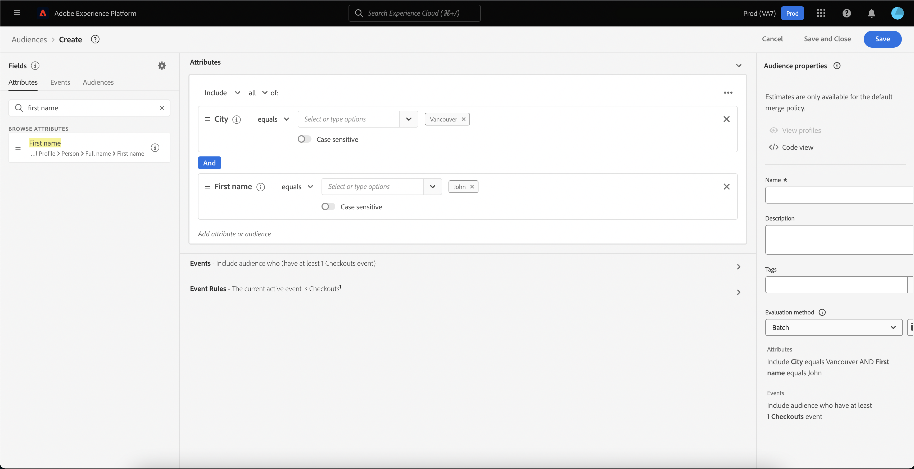

### 例 {#container-examples}

セグメントビルダー内でコンテナを使用するには、次の3つの異なる方法があります。ブール論理を使用してルールをグループ化する、コンテナの条件に一致するプロファイルを含めるか除外するかを制御する、時間制約を使用してイベントシーケンスを定義する。

+++ 混在ブール論理

次の例では、1つの式に&#x200B;**both** ANDとOR ロジックを混在させています。 コンテナを使用しない場合、ANDとOR ロジックの両方を単一レベルで混在させることはできません。

+++

+++ イベントシーケンス

次の例では、コンテナを使用してイベントのシーケンスを構築します。

+++

### ベストプラクティス {#container-best-practices}

オーディエンスにコンテナを追加する場合は、次のガイドラインに注意してください。

- コンテナを段階的に構築し、追加する各ステップでロジックをテストします
   - これは、「除外」ロジックを使用する場合に特に重要です。これは、結果を大幅に変更する可能性があるからです
- コンテナにわかりやすい名前を付けて、何をすべきかを理解します
- パフォーマンスが低下するため、ネストされたレベルのコンテナが多くなりすぎないようにします
- イベントの順序はシーケンスコンテナに大きく影響するため、コンテナの順序は正確です

## 結合ポリシー

>[!CONTEXTUALHELP]
>id="platform_segmentation_createSegment_segmentBuilder_mergePolicies"
>title="結合ポリシー"
>abstract="結合ポリシーを使用すると、様々なデータセットを結合してプロファイルを形成できます。Experience Platform にはデフォルトの結合ポリシーが用意されていますが、プロファイルで新しいデフォルトの結合ポリシーを作成することもできます。このオーディエンスに対するマーケティング目的に合った結合ポリシーを選択します。"

[!DNL Experience Platform] では、個々の顧客の全体像を把握するために、複数のソースからのデータを統合することができます。このようなデータを統合する場合、データをどのように優先順位付けするかや、どのようなデータを組み合わせてプロファイルを作成するかを決定するために [!DNL Experience Platform] で使用されるルールが結合ポリシーです。

このオーディエンスのマーケティング目的に合った結合ポリシーを選択することも、[!DNL Experience Platform] から提供されるデフォルトの結合ポリシーを使用することもできます。デフォルトの結合ポリシーを独自に作成することも含め、組織に固有の複数の結合ポリシーを作成できます。組織の結合ポリシーを作成する手順については、まず[結合ポリシーの概要](../../profile/merge-policies/overview.md)を参照してください。

セグメント定義の結合ポリシーを選択するには、**[!UICONTROL Fields]** タブの歯車アイコンを選択し、**[!UICONTROL Merge Policy]** ドロップダウンメニューを使用して、使用する結合ポリシーを選択します。

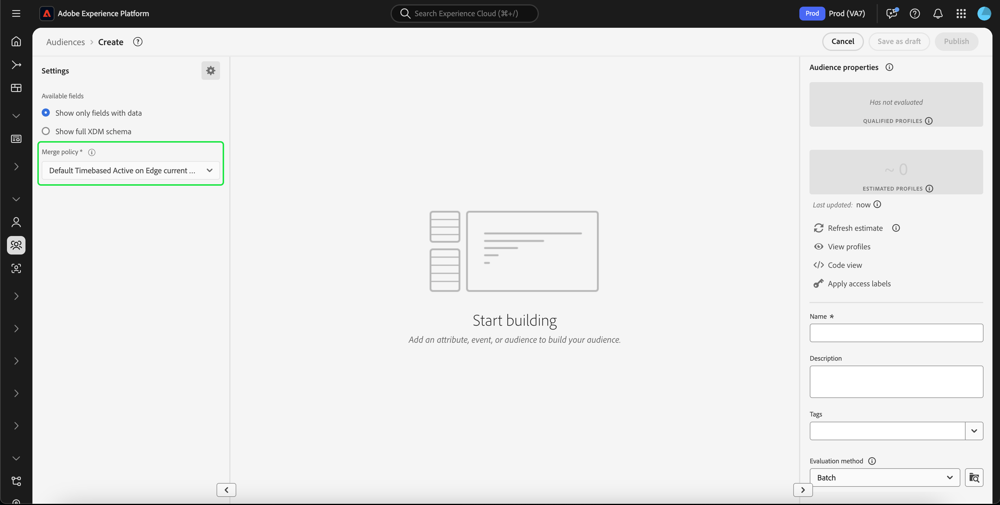

## オーディエンスのプロパティ {#audience-properties}

>[!CONTEXTUALHELP]
>id="platform_segments_createsegment_segmentbuilder_segmentproperties"
>title="オーディエンスのプロパティ"
>abstract="「オーディエンスプロパティ」セクションには、結果として生成されるオーディエンスの推定サイズが表示され、プロファイルの合計数に対する適格なプロファイルの数が表示されます。これにより、オーディエンスを作成する前に、必要に応じてオーディエンスを調整できます。"

>[!CONTEXTUALHELP]
>id="platform_segments_createsegment_segmentbuilder_refreshestimate"
>title="推定の更新"
>abstract="セグメント定義の推定を更新すると、提案されたセグメント定義に適格と思われるプロファイルの数をすぐにプレビューできます。オーディエンスの推定値は、その日のサンプルデータから抽出したサンプルサイズを使用して生成されます。"
>additional-url="https://experienceleague.adobe.com/docs/experience-platform/segmentation/tutorials/create-a-segment.html?lang=ja#estimate-and-preview-an-audience" text="オーディエンスの推定とプレビュー"

>[!CONTEXTUALHELP]
>id="platform_segments_createsegment_segmentbuilder_qualifiedprofiles"
>title="認定プロファイル数"
>abstract="認定プロファイル数は、オーディエンスのルールに一致するプロファイルの実際の数を示します。この数は、セグメント評価ジョブの実行後、24時間ごとに更新されます。"

>[!CONTEXTUALHELP]
>id="platform_segments_createsegment_segmentbuilder_estimatedprofiles"
>title="推定プロファイル数"
>abstract="推定プロファイル数は、サンプルジョブに基づいて、オーディエンスのルールに適合するプロファイルの概算数を示します。"

セグメント定義を作成する場合、ワークスペースの右側にある&#x200B;**[!UICONTROL Audience properties]** セクションには、結果として得られるセグメント定義のサイズの推定値が表示され、オーディエンス自体を作成する前に、必要に応じてセグメント定義を調整できます。

**[!UICONTROL Qualified Profiles]**&#x200B;は、セグメント定義のルールに一致するプロファイルの&#x200B;**実際の**&#x200B;数を示します。 この数は、セグメント評価ジョブの実行後、24時間ごとに更新されます。

適格プロファイルのタイムスタンプは、最新の&#x200B;**バッチ** セグメント評価ジョブを示し、ストリーミングまたはエッジセグメント化を使用して評価されたセグメント定義に対して&#x200B;**not**&#x200B;が表示されます。 セグメント定義を編集すると、次のセグメント評価ジョブが実行されるまで、適格プロファイルの数は同じままになります。

**[!UICONTROL Estimated Profiles]**&#x200B;は、**サンプルジョブ**&#x200B;に基づいて、プロファイルの&#x200B;**おおよその範囲**&#x200B;を示します。 つまり、より大きなプロファイルセットにサンプルデータが投影されるので、実際の適合プロファイルの数とは異なる推定数が生じる場合があります。推定プロファイルサンプルは95%の信頼区間を有する。

オーディエンスのルールに変更を加えると、**[!UICONTROL Refresh estimate]** ボタンを選択して、推定プロファイルの更新された数を確認できます。 ただし、この数値は以前のサンプルジョブに基づいています。 顧客データの変化が3%を超えた場合、または最後のサンプルジョブが3日を超えた場合に、サンプルジョブが更新されます。

情報バブルを選択すると、最後のサンプルジョブが実行された日時が表示されます。

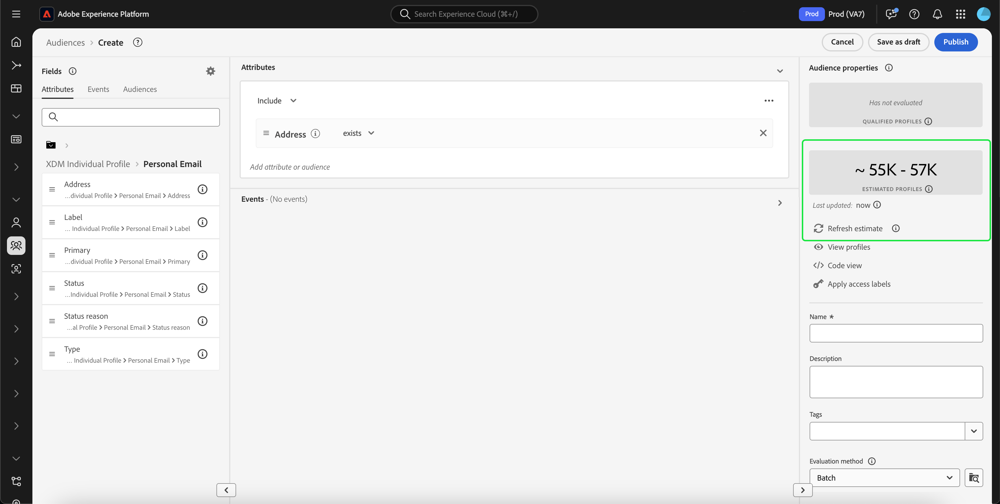

**[!UICONTROL Audience properties]** セクションでは、オーディエンスの名前、説明、評価タイプなど、オーディエンスに関する重要な情報を指定することもできます。 名前は、組織で定義されたセグメント定義の中からセグメント定義を特定するために使用されます。そのため、わかりやすく、簡潔で、一意である必要があります。

引き続きオーディエンスを作成する場合は、**[!UICONTROL View Profiles]**&#x200B;を選択して、オーディエンスのページ分割されたプレビューを表示できます。

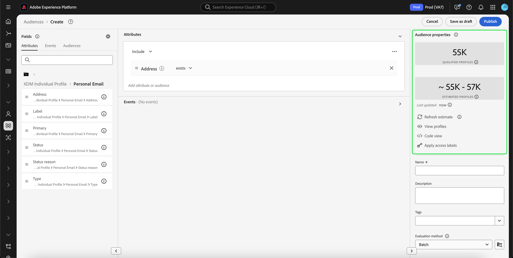

>[!NOTE]
>
>オーディエンスの推定値は、その日のサンプルデータから抽出したサンプルサイズを使用して生成されます。プロファイルストアに100万未満のエンティティがある場合は、完全なデータセットが使用されます。1～2000万個のエンティティの場合は、100万個のエンティティが使用され、2000万個を超えるエンティティの場合は、合計エンティティの5%が使用されます。
>
>さらに、この見積もりは、最後のプロファイルサンプルジョブがいつ実行されたかにもとづいています。 つまり、「今日」や「今週」などの相対日付関数を使用している場合、推定値は最後のプロファイルサンプルジョブ実行時間に基づいて計算されます。 例えば、今日が1月24日で、最後のプロファイルサンプルジョブが1月22日に実行された場合、「昨日」の相対日付関数は1月23日ではなく、1月21日を基準とします。
>
>セグメント定義の推定サイズを生成する方法について詳しくは、セグメント定義の作成に関するチュートリアルの[予測値の生成に関する節](../tutorials/create-a-segment.md#estimate-and-preview-an-audience)を参照してください。

また、評価方法を選択することもできます。 使用する評価方法がわかっている場合は、ドロップダウンリストを使用して、目的の評価方法を選択できます。 このセグメント定義が適合する評価タイプを知りたい場合、「参照」アイコン（）を選択すると、使用可能なセグメント定義の評価方法のリストが表示されます。

[!UICONTROL Evaluation method eligibility] ポップオーバーが表示されます。 このポップオーバーには、使用可能な評価方法（バッチ、ストリーミングおよびエッジ）が表示されます。 ポップオーバーには、どの評価方法が適格か不適格かが表示されます。 セグメント定義で使用したパラメーターによっては、特定の評価方法に適合しない場合があります。 各評価方法の要件について詳しくは、[ストリーミングセグメント化](../methods/streaming-segmentation.md#query-types)または[エッジセグメント化](../methods/edge-segmentation.md#query-types)の概要を参照してください。

セグメント定義の作成完了後に、セグメント定義の評価方法を変更することもできます。 Edgeまたはストリーミングからバッチに評価方法を変更すると、**not**&#x200B;はEdgeまたはストリーミングに戻すことができます。 評価方法の変更は、ポップオーバーで「**」を選択すると、**&#x200B;のみ&#x200B;**[!UICONTROL Save]**&#x200B;が有効になります。 ダイアログをキャンセルすると、元の評価方法を&#x200B;**維持**&#x200B;します。

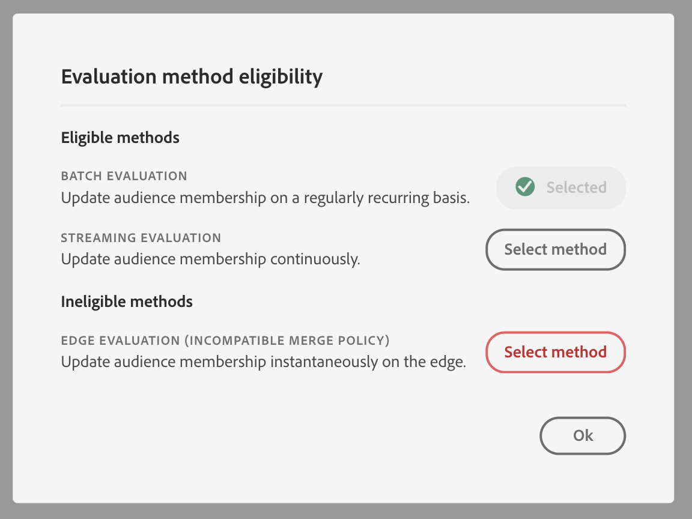

無効な評価方法を選択すると、セグメント定義ルールを変更するか、評価方法を変更するかを尋ねるプロンプトが表示されます。

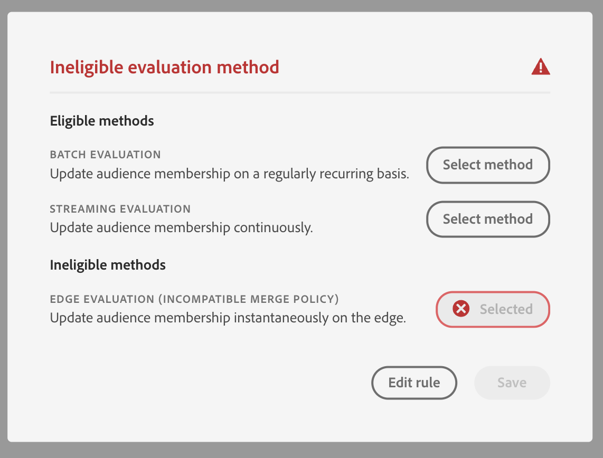

様々なセグメント定義評価方法について詳しくは、[セグメント化の概要](../home.md#evaluate-segments)を参照してください。

## 次の手順 {#next-steps}

セグメントビルダーには、マーケティング可能なオーディエンスを [!DNL Real-Time Customer Profile] データから分離するのに使用できる機能豊富なワークフローが用意されています。このガイドをお読みになると、次のことができるようになります。

- 属性、イベントおよび既存のオーディエンスの組み合わせを構成要素として使用して、セグメント定義を作成する。
- ルールビルダーキャンバスとコンテナを使用して、オーディエンスルールを実行する順序を制御します。
- 見込みオーディエンスの予測値を表示する。必要に応じてセグメント定義を調整できます。
- スケジュールに沿ったセグメント化に対してすべてのセグメント定義を有効にする。
- ストリーミングによるセグメント化に対して、特定のセグメント定義を有効にする。

[!DNL Segmentation Service] について詳しくは、引き続きこのドキュメントを参照し、関連するビデオを視聴して知識を補ってください。[!DNL Segmentation Service] UIのその他の部分について詳しくは、[[!DNL Segmentation Service]  ユーザーガイド &#x200B;](./overview.md)を参照してください。
