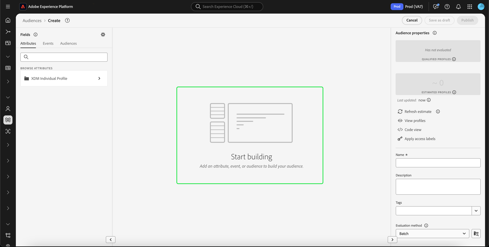

# [!DNL Segment Builder] UIガイド

[!DNL Segment Builder] は、データ要素を操作できるリッチワークスペースを提供し [!DNL Profile] ます。 ワークスペースには、ルールを作成および編集するための直感的なコントロールがあります。例えば、データプロパティを表示する際に使用するドラッグ＆ドロップタイルなどです。

## セグメント定義の構成要素

セグメント定義の基本構成要素は、属性とイベントです。 また、既存のオーディエンスに含まれる属性とイベントを、新しい定義のコンポーネントとして使用することもできます。

You can see these building blocks in the **[!UICONTROL Fields]** section on the left side of the [!DNL Segment Builder] workspace. **[!UICONTROL フィールド]** には、主要構築ブロックのそれぞれに対するタブが含まれます。「[!UICONTROL Attributes]」、「[!UICONTROL イベント]」および「[!UICONTROL オーディエンス]」。

### 属性

The **[!UICONTROL Attributes]** tab allows you to browse [!DNL Profile] attributes belonging to the [!DNL XDM Individual Profile] class. 各フォルダーを展開して、追加の属性を表示できます。各属性はタイルで表されており、ワークスペースの中央にあるルールビルダーキャンバスにドラッグすることができます。[ルールビルダーキャンバス](#rule-builder-canvas)の詳細については、このガイドで後述します。

### イベント

「**[!UICONTROL イベント]**」タブでは、 のデータ要素を使用して実行されたイベントまたはアクションに基づいてオーディエンスを作成できます。[!DNL XDM ExperienceEvent]また、「**[!UICONTROL イベント]**」タブではイベントタイプを検索できます。イベントタイプは一般的に使用されるイベントの集まりで、これを使用するとセグメントをより迅速に作成することができます。

In addition to being able to browse for [!DNL ExperienceEvent] elements, you can also search for Event Types. Event Types use the same coding logic as [!DNL ExperienceEvents], without requiring you to search through the [!DNL XDM ExperienceEvent] class looking for the correct event. For example, using the search bar to search &quot;cart&quot; returns the Event Types &quot;[!UICONTROL AddCart]&quot; and &quot;[!UICONTROL RemoveCart]&quot;, which are two very commonly used cart actions when building segment definitions.

任意のタイプのコンポーネントを検索するには、[Lucene の検索構文](https://docs.microsoft.com/ja-JP/azure/search/query-lucene-syntax)を使用して、検索バーにその名前を入力します。単語を完全に入力すると、検索結果が表示され始めます。例えば、XDM フィールド `ExperienceEvent.commerce.productViews` に基づくルールを作成するには、検索フィールドに「product views」と入力します。「product」という単語の入力が終わると同時に、検索結果が表示され始めます。検索結果には、それが属するオブジェクト階層も表示されます。

>[!NOTE]
>
>組織で定義されたカスタムスキーマフィールドが表示され、ルールの作成に使用できるようになるまでに、最長で 24 時間かかる場合があります。

You can then easily drag and drop [!DNL ExperienceEvents] and &quot;[!UICONTROL Event Types]&quot; into your segment definition.

デフォルトでは、データストアから入力されたスキーマフィールドのみが表示されます。This includes &quot;[!UICONTROL Event Types]&quot;. If the &quot;[!UICONTROL Event Types]&quot; list is not visible, or you are only able to select &quot;[!UICONTROL Any]&quot; as an &quot;[!UICONTROL Event Type]&quot;, select the **gear icon** next to **[!UICONTROL Fields]**, then select **[!UICONTROL Show full XDM schema]** under **[!UICONTROL Available Fields]**. Select the **gear icon** again to return to the **[!UICONTROL Fields]** tab and you should now be able to view multiple &quot;[!UICONTROL Event Types]&quot; and schema fields, regardless of whether they contain data or not.

### オーディエンス

The **[!UICONTROL Audiences]** tab lists all audiences imported from external sources, such as Adobe Audience Manager, as well as audiences created within [!DNL Experience Platform].

On the **[!UICONTROL Audiences]** tab, you can see all of the available sources as a group of folders. フォルダを選択すると、使用可能なサブフォルダやオーディエンスが表示されます。 また、フォルダ構造を表示するために（右端の画像に示すように）フォルダアイコンを選択し（チェックマークは現在のフォルダを示します）、ツリー内のフォルダ名を選択して簡単にフォルダ間を戻すことができます。

オーディエンス横の ⓘ にカーソルを置くと、そのオーディエンスに関する情報が表示されます。例えば、ID、説明、そのオーディエンスが存在するフォルダーの階層などです。

You can also search for audiences using the search bar, which utilizes [Lucene&#39;s search syntax](https://docs.microsoft.com/ja-JP/azure/search/query-lucene-syntax). 「**[!UICONTROL オーディエンス]**」タブで最上位のフォルダーを選択すると、検索バーが表示され、そのフォルダー内を検索することができます。検索結果は、単語の入力が終わると同時に表示され始めます。For example, to find an audience named `Online Shoppers`, start typing &quot;Online&quot; in the search bar. 「Online」という単語を完全に入力すると、「Online」という単語を含む検索結果が表示されます。

## ルールビルダーキャンバス {#rule-builder-canvas}

セグメント定義は、ターゲットオーディエンスの重要な特徴やビヘイビアーの説明に使用される一連のルールです。These rules are created using the rule builder canvas, located in the center of [!DNL Segment Builder].

セグメント定義に新しいルールを追加するには、タイルを「**[!UICONTROL フィールド]**」タブからルールビルダーキャンバスにドラッグ＆ドロップします。追加するデータのタイプに応じて、コンテキスト固有のオプションが表示されます。Available data types include: strings, dates, [!DNL ExperienceEvents], &quot;[!UICONTROL Event Types]&quot;, and audiences.

>[!IMPORTANT]
>
>最新のAdobe Experience Platformの変更により、イベント間の `OR``AND` 論理演算子と論理演算子の使用が更新されました。 これらの更新は、既存のセグメントには影響しません。 ただし、既存のセグメントおよび新しいセグメント作成に対するそれ以降の更新は、これらの変更の影響を受けます。 詳しくは、 [時間定数の更新](./segment-refactoring.md) を参照してください。

### オーディエンスの追加

オーディエンスを「**[!UICONTROL オーディエンス]**」タブからルールビルダーキャンバスにドラッグ＆ドロップすることで、新しいセグメント定義でオーディエンスのメンバーシップを参照できます。これで、オーディエンスのメンバーシップを新しいセグメントルールの属性として含めたり除外したりできます。

For [!DNL Platform] audiences created using [!DNL Segment Builder], you are given the option to convert the audience into the set of rules that were used in the segment definition for that audience. このように変換するとルールロジックのコピーが作成されます。このコピーを使用することで、元のセグメント定義に影響を与えることなくルールを変更できます。セグメント定義をルールロジックに変換する前に、セグメント定義に対する最新の変更を保存していることを確認してください。

>[!NOTE]
>
>外部ソースからオーディエンスを追加した場合、オーディエンスのメンバーシップのみが参照されます。このオーディエンスをルールに変換することはできません。このため、元のオーディエンスの作成に使用されたルールを新しいセグメント定義で変更することはできません。

オーディエンスをルールに変換する際に競合が発生した場合 [!DNL Segment Builder] 、は既存のオプションをその機能を最大限に保持しようとします。

### コード表示

または、で作成したルールのコードベースの表示を行うこともでき [!DNL Segment Builder]ます。 ルールビルダーキャンバス内にルールを作成したら、 **[!UICONTROL コード表示]** を選択して、セグメントをPQLとして表示できます。

コード表示には、API呼び出しで使用するセグメントの値をコピーできるボタンが用意されています。 セグメントの最新バージョンを取得するには、セグメントに対する最新の変更を保存していることを確認します。

## コンテナ

セグメントルールは、リストでの表示順に従って評価されます。コンテナでは、ネストされたクエリを使用して、評価の順序を制御できます。

ルールビルダーキャンバスにタイルを 1 つ以上追加したら、コンテナの追加を開始できます。To create a new container, select the ellipses (...) in the top-right corner of the tile, then select **[!UICONTROL Add container]**.

新しいコンテナが最初のコンテナの子として表示されますが、コンテナをドラッグして移動することで、階層を調整することができます。The default behavior of a container is to &quot;[!UICONTROL Include]&quot; the attribute, event, or audience provided. You can set the rule to &quot;[!UICONTROL Exclude]&quot; profiles that match the container criteria by selecting **[!UICONTROL Include]** in the top-left corner of the tile and selecting &quot;[!UICONTROL Exclude]&quot;.

子コンテナの「コンテナを解除」を選択して、子コンテナを抽出し、親コンテナにインラインで追加することもできます。 子コンテナの右上隅にある三点リーダー(...)を選択して、このオプションにアクセスします。

Once you select **[!UICONTROL Unwrap container]** the child container is removed and the criteria appear inline.

>[!NOTE]
>
>コンテナを展開する場合には、ロジックが引き続き目的のセグメント定義を満たすようにしてください。

## 結合ポリシー

[!DNL Experience Platform] では、複数のソースのデータを統合して、個々の顧客の全体像を把握できます。When bringing this data together, merge policies are the rules that [!DNL Platform] uses to determine how data will be prioritized and what data will be combined to create a profile.

You can select a merge policy that matches your marketing purpose for this audience or use the default merge policy provided by [!DNL Platform]. デフォルトの結合ポリシーを作成できるほか、組織に固有の複数の結合ポリシーを作成できます。組織の結合ポリシーを作成する手順については、[UI を使用した結合ポリシーの操作](../../profile/ui/merge-policies.md)に関するチュートリアルを参照してください。

To select a merge policy for your segment definition, select the gear icon on the **[!UICONTROL Fields]** tab, then use the **[!UICONTROL Merge Policy]** dropdown menu to select the merge policy that you wish to use.

## セグメントのプロパティ

セグメント定義を作成する際には、作成されるセグメントの推定サイズがワークスペース右側の「**[!UICONTROL セグメントのプロパティ]**」セクションに表示されるので、オーディエンス自体を作成する前にセグメントの定義を必要に応じて調整できます。

The **[!UICONTROL Segment Properties]** section is also where you can specify important information about your segment definition, including its name and description. セグメント定義名は、組織で定義されたものの中から目的のセグメントを識別する際に使用されます。このため、セグメント定義名は、内容がわかりやすく簡潔、かつ一意である必要があります。

セグメント定義の作成中、「**[!UICONTROL プロファイルを表示]**」を選択することで、オーディエンスのプレビューをページ別に表示できます。

>[!NOTE]
>
>オーディエンスの予測値は、その日のサンプルデータのサンプルサイズを使用して生成されます。プロファイルストアのエンティティ数が 100 万個未満の場合は、データセット全体が使用されます。100 万個から 2,000 万個のエンティティがある場合は、100 万個のエンティティが使用されます。2,000 万個を超えるエンティティがある場合は、合計エンティティ数の 5％が使用されます。セグメントの推定サイズを生成する方法について詳しくは、セグメントの作成に関するチュートリアルの[予測値の生成に関する節](../tutorials/create-a-segment.md#estimate-and-preview-an-audience)を参照してください。

## 次の手順とその他のリソース {#next-steps}

Segment Builder provides a rich workflow allowing you to isolate marketable audiences from [!DNL Real-time Customer Profile] data. このガイドをお読みになると、次のことができるようになります。

- 属性、イベントおよび既存のオーディエンスの組み合わせを構成要素として使用して、セグメント定義を作成する。
- ルールビルダーキャンバスとコンテナを使用して、セグメントルールの実行順を制御する。
- 見込みオーディエンスの予測値を表示する。必要に応じてセグメント定義を調整できます。
- スケジュールに沿ったセグメント化に対してすべてのセグメント定義を有効にする。
- ストリーミングによるセグメント化に対して、特定のセグメント定義を有効にする。

詳しくは、ドキュメントを読み続け [!DNL Segmentation Service]て、以下のビデオを参照して学習内容を補ってください。 UIの他の部分の詳細については、 [!DNL Segmentation Service][[!DNL Segmentation Service] ユーザガイドを参照してください](./overview.md)

>[!WARNING]
>
> 次のビデオに示す [!DNL Platform] UIは古いです。 最新のUIのスクリーンショットと機能については、上記のドキュメントを参照してください。

**セグメントの作成:**

>[!VIDEO](https://video.tv.adobe.com/v/27254?quality=12&learn=on)

**動的セグメントの作成：**

>[!VIDEO](https://video.tv.adobe.com/v/27428?quality=12&learn=on)