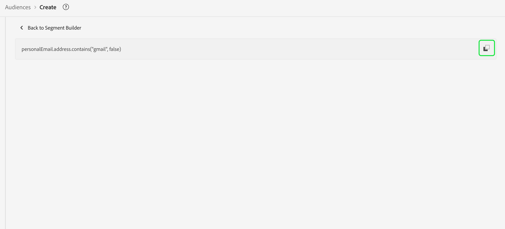

# [!DNL Segment Builder] UI ガイド

>[!NOTE]
>
>このガイドでは、セグメントビルダーで&#x200B;**セグメント定義**&#x200B;を使用して、オーディエンスを作成する方法について説明します。オーディエンス構成を使用してオーディエンスを作成する方法については、[オーディエンス構成 UI ガイド](./audience-composition.md)を参照してください。

[!DNL Segment Builder] のワークスペースには、[!DNL Profile] のデータ要素を操作できる豊富な機能があります。ワークスペースには、ルールを作成および編集するための直感的なコントロール（例えば、データプロパティを表示する際に使用するドラッグ＆ドロップタイルなど）があります。

## セグメント定義の構成要素 {#building-blocks}

>[!CONTEXTUALHELP]
>id="platform_segments_createsegment_segmentbuilder_fields"
>title="フィールド"
>abstract="セグメント定義を構成する 3 つのフィールドタイプは、属性、イベントおよびオーディエンスです。属性では、XDM 個人プロファイルクラスに属するプロファイル属性を使用できます。イベントでは、XDM ExperienceEvent データ要素を使用して実行されるアクションやイベントに基づいてオーディエンスを作成できます。また、オーディエンスでは、外部ソースから読み込まれたオーディエンスを使用できます。"

セグメント定義の基本的な構成要素は属性とイベントです。また、既存のオーディエンスに含まれている属性とイベントを、新しい定義の構成要素として使用することもできます。

これらの構成要素は、[!DNL Segment Builder] のワークスペースの左側にある「**[!UICONTROL フィールド]**」セクションに表示されます。「**[!UICONTROL フィールド]**」には、主要な各構成要素（「[!UICONTROL 属性]」、「[!UICONTROL イベント]」、「[!UICONTROL オーディエンス]」）のタブが含まれています。

### 属性

「**[!UICONTROL 属性]**」タブでは、[!DNL XDM Individual Profile] クラスに属する [!DNL Profile] 属性を参照できます。各フォルダーを展開して、追加の属性を表示できます。各属性はタイルで表されており、ワークスペースの中央にあるルールビルダーキャンバスにドラッグすることができます。[ルールビルダーキャンバス](#rule-builder-canvas)の詳細については、このガイドで後述します。

### イベント

「**[!UICONTROL イベント]**」タブでは、[!DNL XDM ExperienceEvent] のデータ要素を使用して実行されたイベントまたはアクションに基づいてオーディエンスを作成できます。また、「**[!UICONTROL イベント]**」タブにある「イベントタイプ」は、一般的に使用されるイベントを集めたもので、セグメント定義をより迅速に作成することができます。

[!DNL ExperienceEvent] 要素を参照できるだけでなく、イベントタイプを検索することもできます。イベントタイプでは、[!DNL ExperienceEvents] と同じコーディングロジックを使用します。その際に、[!DNL XDM ExperienceEvent] クラスで正しいイベントを検索する必要はありません。例えば、検索バーを使用して「cart」を検索すると、「[!UICONTROL AddCart]」と「[!UICONTROL RemoveCart]」というイベントタイプが返されます。これらは、セグメント定義を作成する際によく使用される 2 つの買い物かごアクションです。

任意のタイプのコンポーネントを検索するには、[Lucene の検索構文](https://docs.microsoft.com/ja-JP/azure/search/query-lucene-syntax)を使用して、検索バーにその名前を入力します。単語を完全に入力すると、検索結果が表示され始めます。例えば、XDM フィールド `ExperienceEvent.commerce.productViews` に基づくルールを作成するには、検索フィールドに「product views」と入力します。「product」という単語の入力が終わると同時に、検索結果が表示され始めます。検索結果には、それが属するオブジェクト階層も表示されます。

>[!NOTE]
>
>組織で定義されたカスタムスキーマフィールドが表示され、ルールの作成に使用できるようになるまでに、最長で 24 時間かかる場合があります。

その後は、 [!DNL ExperienceEvents] と「[!UICONTROL イベントタイプ]」をセグメント定義に簡単にドラッグ＆ドロップできます。

デフォルトでは、データストアから入力されたスキーマフィールドのみが表示されます。この中には「[!UICONTROL イベントタイプ]」が含まれます。「[!UICONTROL イベントタイプ]」リストが表示されない場合や、「[!UICONTROL イベントタイプ]」として「[!UICONTROL 任意]」しか選択できない場合は、「**[!UICONTROL フィールド]**」の横の&#x200B;**歯車アイコン**&#x200B;を選択したあと、「**[!UICONTROL 使用可能なフィールド]**」内の「**[!UICONTROL すべての XDM スキーマを表示]**」を選択します。**歯車**&#x200B;アイコンをもう一度選択すると、「**[!UICONTROL フィールド]**」タブに戻ります。データが含まれているかどうかに関係なく、複数の「[!UICONTROL イベントタイプ]」とスキーマフィールドが表示されるようになりました。

#### Adobe Analytics レポートスイートのデータセット

セグメント化において 1 つまたは複数の Adobe Analytics レポートスイートのデータをイベントとして使用できます。

単一の Analytics レポートスイートのデータを使用する場合、Platform は記述子とわかりやすい名前を eVar に自動的に追加するので、[!DNL Segment Builder] 内でこれらのフィールドを見つけやすくなります。

複数の Analytics レポートスイートのデータを使用する場合、Platform では、記述子やわかりやすい名前を eVar に自動的に追加することは&#x200B;**できません**。 したがって、Analytics レポートスイートのデータを使用する前に、XDM フィールドにマッピングする必要があります。 Analytics 変数から XDM へのマッピングについて詳しくは、[Adobe Analytics ソース接続ガイド](../../sources/tutorials/ui/create/adobe-applications/analytics.md#mapping)を参照してください。

例えば、次の変数が含まれる 2 つのレポートスイートがあるとします。

| フィールド | レポートスイートスキーマ A | レポートスイートスキーマ B |
| ----- | --------------------- | --------------------- |
| eVar1 | 参照ドメイン | ログイン済み Y/N |
| eVar2 | ページ名 | メンバーロイヤルティ ID |
| eVar3 | URL | ページ名 |
| eVar4 | 検索語句 | 製品名 |
| event1 | クリック数 | ページビュー数 |
| event2 | ページビュー数 | 買い物かごへの追加 |
| event3 | 買い物かごへの追加 | チェックアウト |
| event4 | 購入 | 購入 |

この場合、これら 2 つのレポートスイートを次のスキーマでマッピングできます。

>[!NOTE]
>
>汎用 eVar 値は引き続き入力されますが、レポート内の元の値とは異なる意味を持つ可能性があるので、セグメント定義では使用し&#x200B;**ない**&#x200B;でください（可能な場合）。

レポートスイートがマッピングされると、これらの新しくマッピングされたフィールドをプロファイル関連のワークフローおよびセグメント化内で使用できます。

| シナリオ | 結合スキーマエクスペリエンス | セグメント化汎用変数 | セグメント化マッピング変数 |
| -------- | ----------------------- | ----------------------------- | ---------------------------- |
| 単一レポートスイート | 汎用変数には、フレンドリ名記述子が含まれます。  **例：**&#x200B;ページ名（eVar2） | <ul><li>汎用変数に含まれるフレンドリ名記述子</li><li>唯一のクエリであるので、クエリでは特定のデータセットのデータを使用します</li></ul> | クエリでは、Adobe Analytics データを使用でき、場合によってはその他のソースを使用できます。 |
| 複数のレポートスイート | 汎用変数には、フレンドリ名記述子は含まれません。  **例：** eVar2 | <ul><li>複数の記述子を持つフィールドは、すべて汎用として表示されます。つまり、UI にフレンドリ名は表示されません。</li><li>クエリでは、eVar を含む任意のデータセットのデータを使用できます。これにより、結果が混在したり、不正確になったりする可能性があります。</li></ul> | クエリでは、複数のデータセットから正しく結合された結果を使用します。 |

### オーディエンス

>[!NOTE]
>
>Platform 内で作成されたオーディエンスの場合、 **同じ** 結合ポリシーが表示されます。

「**[!UICONTROL オーディエンス]**」タブには、Adobe Audience Manager などの外部ソースから読み込まれたすべてのオーディエンスと、[!DNL Experience Platform] 内で作成されたオーディエンスが表示されます。

「**[!UICONTROL オーディエンス]**」タブでは、使用可能なすべてのソースがフォルダーのグループとして表示されます。フォルダーを選択すると、使用可能なサブフォルダーとオーディエンスが表示されます。また、フォルダー構造を表示するには、フォルダーアイコンを選択します（右端の画像を参照）。チェックマークは、現在のフォルダーを表しています。また、ツリー内のフォルダーの名前を選択することで、フォルダー間を簡単に移動できます。

オーディエンス横の ⓘ にカーソルを置くと、そのオーディエンスに関する情報が表示されます。例えば、ID、説明、そのオーディエンスが存在するフォルダーの階層などです。

また、検索バーを使用してオーディエンスを検索することもできます。その場合は、[Lucene の検索構文](https://docs.microsoft.com/ja-JP/azure/search/query-lucene-syntax)を使用します。「**[!UICONTROL オーディエンス]**」タブで最上位のフォルダーを選択すると、検索バーが表示され、そのフォルダー内を検索することができます。検索結果は、単語の入力が終わると同時に表示され始めます。例えば、`Online Shoppers` という名前のオーディエンスを検索するには、検索バーに「Online」と入力します。「Online」という単語を完全に入力すると、「Online」という単語を含む検索結果が表示されます。

## ルールビルダーキャンバス {#rule-builder-canvas}

セグメント定義は、ターゲットオーディエンスの重要な特徴やビヘイビアーの説明に使用される一連のルールです。これらのルールは、[!DNL Segment Builder] の中央にあるルールビルダーキャンバスを使用して作成します。

セグメント定義に新しいルールを追加するには、タイルを「**[!UICONTROL フィールド]**」タブからルールビルダーキャンバスにドラッグ＆ドロップします。追加するデータのタイプに応じて、コンテキスト固有のオプションが表示されます。使用できるデータタイプには、文字列、日付、[!DNL ExperienceEvents]、「[!UICONTROL イベントタイプ]」、オーディエンスが含まれます。

>[!IMPORTANT]
>
>Adobe Experience Platform に対する最新の変更により、イベント間の `OR` および `AND` 論理演算子の使用が更新されました。これらの更新は、既存のセグメント定義には影響しません。ただし、既存のセグメント定義と新しく作成されたセグメント定義に対するその後の更新はすべて、これらの変更の影響を受けます。詳しくは、[時間制約の更新](./segment-refactoring.md)を参照してください。

属性の値を選択すると、属性が取り得る列挙値のリストが表示されます。

この列挙リストから値を選択すると、その値が実線の境界線で囲まれます。ただし、`meta:enum`（ソフト）列挙を使用するフィールドの場合、列挙リストに&#x200B;**ない**&#x200B;値を選択することもできます。独自の値を作成すると、この値が列挙リストにないという警告と共に、値が点線の境界線で囲まれます。

複数の値を作成している場合は、バルクアップロードを使用して一度にすべてを追加できます。 を選択して、**[!UICONTROL 一括で値を追加]**&#x200B;ポップオーバーを表示します。

**[!UICONTROL 一括で値を追加]**&#x200B;ポップオーバーで、CSV または TSV ファイルをアップロードできます。

または、コンマ区切りの値を手動で追加することもできます。

最大 250 個の値が許可されます。この値を超える場合は、値を削除してから追加する必要があります。

### オーディエンスの追加

オーディエンスを「**[!UICONTROL オーディエンス]**」タブからルールビルダーキャンバスにドラッグ＆ドロップすることで、新しいセグメント定義でオーディエンスのメンバーシップを参照できます。これにより、オーディエンスのメンバーシップを新しいセグメント定義ルールの属性として含めたり除外したりできます。

[!DNL Segment Builder] を使用して作成した [!DNL Platform] オーディエンスの場合は、オーディエンスを、そのオーディエンスのセグメント定義で使用されていた一連のルールに変換することができます。このような変換では、ルールロジックのコピーが作成されます。このコピーを変更すれば、元のセグメント定義に影響を与えずに済みます。セグメント定義に対する最近の変更を、ルールロジックに変換する前に必ず保存しておいてください。

>[!NOTE]
>
>外部ソースからオーディエンスを追加した場合、オーディエンスのメンバーシップのみが参照されます。このオーディエンスをルールに変換することはできないので、元のオーディエンスの作成に使用されたルールを新しいセグメント定義で変更することはできません。

オーディエンスをルールに変換するときに競合が発生した場合、[!DNL Segment Builder] は既存のオプションを可能な限り保持しようとします。

### コードビュー

または、[!DNL Segment Builder] で作成されたルールのコードベースバージョンを表示できます。ルールビルダーキャンバス内でルールを作成したら、「**[!UICONTROL コードビュー]**」を選択して、セグメント定義を PQL として表示できます。

コードビューには、API 呼び出しで使用するセグメント定義の値をコピーできるボタンがあります。セグメント定義の最新バージョンを取得するには、最新の変更をセグメント定義に保存してあることを確認してください。

### 集計関数

[!DNL Segment Builder] での集計は、データタイプが数値（倍精度浮動小数点数または整数）である XDM 属性のグループに対する計算です。セグメントビルダー内でサポートされている 4 つの集計関数は、SUM、AVERAGE、MIN および MAX です。

集計関数を作成するには、左側のパネルからイベントを選択して、[!UICONTROL イベント]コンテナに挿入します。

イベントコンテナ内にイベントを配置した後、省略記号アイコン（...）を選択し、続いて「**[!UICONTROL 集計]**」を選択します。

これで、集計が追加されます。集計関数を選択し、集計する属性、等値関数および値を選択できるようになりました。次の例では、個々の購入額が 100 ドル未満であっても、購入額の合計が 100 ドルを超えるプロファイルはすべて、このセグメント定義に該当します。

### カウント関数 {#count-functions}

セグメントビルダーのカウント関数は、指定されたイベントを検索し、イベントが実行された回数をカウントするために使用されます。セグメントビルダーでサポートされているカウント関数は、「少なくとも」、「最大で」、「正確に」、「範囲内」および「すべて」です。

カウント関数を作成するには、左側のパネルからイベントを選択して、[!UICONTROL イベント]コンテナに挿入します。

イベントコンテナ内にイベントを配置した後、「[!UICONTROL 少なくとも 1 回]」を選択します。

これで、カウント関数が追加されました。カウント関数と関数の値を選択できるようになりました。次の例では、少なくとも 1 回のクリックが発生したイベントを含めることになります。

## コンテナ

セグメントルールは、リストでの表示順に従って評価されます。コンテナでは、ネストされたクエリを使用して、評価の順序を制御できます。

ルールビルダーキャンバスにタイルを 1 つ以上追加したら、コンテナの追加を開始できます。新しいコンテナを作成するには、タイルの右上隅にある省略記号（...）を選択し、「**[!UICONTROL コンテナを追加]**」を選択します。

新しいコンテナが最初のコンテナの子として表示されますが、コンテナをドラッグして移動することで、階層を調整することができます。コンテナのデフォルト動作は、指定された属性、イベントまたはオーディエンスを「[!UICONTROL 含める]」ようになっています。コンテナ条件に一致するプロファイルを「[!UICONTROL 除外する]」ようにルールを設定するには、タイルの左上隅にある「**[!UICONTROL 含める]**」を選択し、「[!UICONTROL 除外する]」に変更します。

子コンテナを抜き出して、親コンテナにインラインで追加することもできます。それには、子コンテナで「コンテナを展開」を選択します。このオプションにアクセスするには、子コンテナの右上隅にある省略記号（...）を選択します。

「**[!UICONTROL コンテナを展開]**」を選択すると、子コンテナが削除され、条件がインライン表示されます。

>[!NOTE]
>
>コンテナを展開する場合には、ロジックが引き続き目的のセグメント定義を満たすようにしてください。

## 結合ポリシー

>[!CONTEXTUALHELP]
>id="platform_segmentation_createSegment_segmentBuilder_mergePolicies"
>title="結合ポリシー"
>abstract="結合ポリシーを使用すると、様々なデータセットを結合してプロファイルを形成できます。プラットフォームにはデフォルトの結合ポリシーが用意されていますが、プロファイルで新しいデフォルトの結合ポリシーを作成することもできます。このオーディエンスに対するマーケティング目的に合った結合ポリシーを選択します。"

[!DNL Experience Platform] では、個々の顧客の全体像を把握するために、複数のソースからのデータを統合することができます。このようなデータを統合する場合、データをどのように優先順位付けするかや、どのようなデータを組み合わせてプロファイルを作成するかを決定するために [!DNL Platform] で使用されるルールが結合ポリシーです。

このオーディエンスのマーケティング目的に合った結合ポリシーを選択することも、[!DNL Platform] から提供されるデフォルトの結合ポリシーを使用することもできます。デフォルトの結合ポリシーを独自に作成することも含め、組織に固有の複数の結合ポリシーを作成できます。組織の結合ポリシーを作成する手順については、まず[結合ポリシーの概要](../../profile/merge-policies/overview.md)を参照してください。

セグメント定義の結合ポリシーを選択するには、「**[!UICONTROL フィールド]**」タブの歯車アイコンを選択し、使用する結合ポリシーを&#x200B;**[!UICONTROL 結合ポリシー]**&#x200B;ドロップダウンメニューで選択します。

## セグメント定義プロパティ {#segment-properties}

>[!CONTEXTUALHELP]
>id="platform_segments_createsegment_segmentbuilder_segmentproperties"
>title="セグメント定義プロパティ"
>abstract="「セグメント定義プロパティ 」セクションには、生成されるセグメント定義のサイズの推定が表示され、プロファイルの合計数と比較して適格なプロファイルの数が表示されます。これにより、オーディエンスそのものを作成する前に、必要に応じてセグメント定義を調整できます。"

>[!CONTEXTUALHELP]
>id="platform_segments_createsegment_segmentbuilder_refreshestimate"
>title="推定の更新"
>abstract="セグメント定義の推定を更新すると、提案されたセグメント定義に適格と思われるプロファイルの数をすぐにプレビューできます。オーディエンスの推定は、当日のサンプルデータのサンプルサイズを使用して生成されます。"
>additional-url="https://experienceleague.adobe.com/docs/experience-platform/segmentation/tutorials/create-a-segment.html#estimate-and-preview-an-audience" text="オーディエンスの推定とプレビュー"

セグメント定義を作成する際には、作成されるセグメント定義の推定サイズがワークスペースの右側の「**[!UICONTROL セグメントのプロパティ]**」セクションに表示されるので、オーディエンスそのものを作成する前に、必要に応じてセグメント定義を調整できます。

「**[!UICONTROL セグメントのプロパティ]**」セクションでは、名前、説明、評価タイプなど、セグメント定義に関する重要な情報を指定することもできます。セグメント定義名は、組織で定義されたものの中から目的のセグメント定義を識別する際に使用されます。このため、セグメント定義名は、内容がわかりやすく簡潔、かつ一意である必要があります。

セグメント定義の作成中、「**[!UICONTROL プロファイルを表示]**」を選択することで、オーディエンスのプレビューをページ別に表示できます。

>[!NOTE]
>
>オーディエンスの推定は、当日のサンプルデータのサンプルサイズを使用して生成されます。プロファイルストアのエンティティ数が 100 万個未満の場合は、データセット全体が使用されます。100 万個から 2,000 万個のエンティティがある場合は、100 万個のエンティティが使用されます。2,000 万個を超えるエンティティがある場合は、合計エンティティ数の 5％が使用されます。セグメント定義の推定サイズを生成する方法について詳しくは、セグメント定義の作成に関するチュートリアルの[予測値の生成に関する節](../tutorials/create-a-segment.md#estimate-and-preview-an-audience)を参照してください。

また、評価方法を選択することもできます。 使用する評価方法がわかっている場合は、ドロップダウンリストを使用して、目的の評価方法を選択できます。 このセグメント定義が適合する評価タイプを知りたい場合、「参照」アイコン（）を選択すると、使用可能なセグメント定義の評価方法のリストが表示されます。

[!UICONTROL 評価方法の実施要件]ポップオーバーが表示されます。 このポップオーバーには、使用可能な評価方法（バッチ、ストリーミングおよびエッジ）が表示されます。 ポップオーバーには、どの評価方法が適格か不適格かが表示されます。 セグメント定義で使用したパラメーターによっては、特定の評価方法に適合しない場合があります。 各評価方法の要件について詳しくは、[ストリーミングセグメント化](./streaming-segmentation.md#query-types)または[エッジセグメント化](./edge-segmentation.md#query-types)の概要を参照してください。

無効な評価方法を選択すると、セグメント定義ルールを変更するか、評価方法を変更するかを尋ねるプロンプトが表示されます。

様々なセグメント定義評価方法について詳しくは、[セグメント化の概要](../home.md#evaluate-segments)を参照してください。

## 次の手順 {#next-steps}

セグメントビルダーには、マーケティング可能なオーディエンスを [!DNL Real-Time Customer Profile] データから分離するのに使用できる機能豊富なワークフローが用意されています。このガイドをお読みになると、次のことができるようになります。

- 属性、イベントおよび既存のオーディエンスの組み合わせを構成要素として使用して、セグメント定義を作成する。
- ルールビルダーキャンバスとコンテナを使用して、セグメントルールの実行順を制御する。
- 見込みオーディエンスの予測値を表示する。必要に応じてセグメント定義を調整できます。
- スケジュールに沿ったセグメント化に対してすべてのセグメント定義を有効にする。
- ストリーミングによるセグメント化に対して、特定のセグメント定義を有効にする。

[!DNL Segmentation Service] について詳しくは、引き続きこのドキュメントを参照し、関連するビデオを視聴して知識を補ってください。[!DNL Segmentation Service] UI の他の部分について詳しくは、[[!DNL Segmentation Service] ユーザーガイド](./overview.md)を参照してください。
