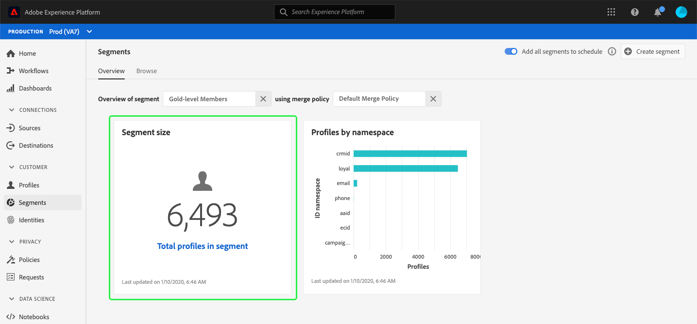

# （アルファ）セグメントダッシュボード{#segment-dashboard}

>[!IMPORTANT]
>
>このドキュメントで説明されているダッシュボード機能は、現在アルファベットで表示されており、すべてのユーザーが使用できるわけではありません。 ドキュメントと機能は変更される場合があります。

Adobe Experience Platformユーザーインターフェイス(UI)では、毎日のスナップショット時にキャプチャされる、セグメントに関する重要な情報を表示できるダッシュボードが提供されます。 このガイドでは、UIのセグメントダッシュボードにアクセスして操作する方法と、ダッシュボードに表示されるビジュアライゼーションに関する詳細を説明します。

プラットフォームユーザーインターフェイス内のAdobe Experience Platformセグメントサービスのすべての機能の概要については、[Segmentation Service UIガイド](overview.md)を参照してください。

## セグメントダッシュボードデータ

セグメントダッシュボードには、Experience Platform内のプロファイルストア内に組織が持つ属性（レコード）データのスナップショットが表示されます。 スナップショットには、イベント（時系列）データは含まれません。

スナップショット内の属性データは、スナップショットが作成された特定の時点で表示されるデータとまったく同じ内容を示します。 つまり、スナップショットはデータの近似やサンプルではなく、セグメントダッシュボードはリアルタイムで更新されません。

>[!NOTE]
>
>スナップショットが作成された後にデータに対して行われた変更や更新は、次のスナップショットが作成されるまでダッシュボードに反映されません。

## セグメントダッシュボードの詳細

プラットフォームUI内のセグメントダッシュボードに移動するには、左のナビゲーションバーの「**[!UICONTROL セグメント]**」を選択し、「**[!UICONTROL 概要]**」タブを選択してダッシュボードを表示します。

### セグメントの選択

ダッシュボードで表示するセグメントを選択するには、「**[!UICONTROL セグメントを選択]**」テキストボックスで、ダイアログセレクターを選択します。

>[!NOTE]
>
>セグメントが既に選択されている場合は、`X`を使用して最初にセグメントを削除し、次にダイアログセレクターが表示されます。
>
>

[**[!UICONTROL セグメントを選択]**]ダイアログが開き、表示するセグメントを選択できます。 目的のセグメントを選択したら、**[!UICONTROL 「]**」を選択してダッシュボードに戻ります。

### マージポリシー

セグメントを選択すると、「マージポリシー」テキストボックスに、そのセグメントに関連するマージポリシーが自動的に入力されます。

Experience Platformでのセグメントの作成について詳しくは、[セグメントビルダーのUIガイド](segment-builder.md)を参照してください。 結合ポリシーの詳細については、まず[リアルタイム顧客プロファイルの概要](../../profile/home.md)を参照してください。

### ウィジェットと指標

セグメントダッシュボードはウィジェットで構成され、ウィジェットは選択したセグメントに関する重要な情報を提供する読み取り専用の指標です。 ウィジェットの「最終更新日」の日時は、データの最後のスナップショットが作成された日時を示します。

## 利用可能なウィジェット

Experience Platformは、セグメントに関連する様々な指標を視覚化するために使用できる複数のウィジェットを提供します。 ウィジェット名を以下から選択して、詳細を確認します。

* [[!UICONTROL セグメントサイズ]](#segment-size)
* [[!UICONTROL 名前空間別プロファイル数]](#profiles-by-namespace)

### [!UICONTROL セグメントサイズ] {#segment-size}

**[!UICONTROL セグメントサイズ]**&#x200B;ウィジェットは、スナップショットが作成された時点で、選択したセグメント内に結合されたプロファイルの合計数を表示します。 この数値は、プロファイルフラグメントを結合してセグメント内の個々の個人の単一のプロファイルを形成するために、セグメントの結合ポリシーをプロファイルデータに適用した結果です。

フラグメントと結合されたプロファイルの詳細については、まず[リアルタイム顧客プロファイルの概要](../home.md)を参照してください。

### [!UICONTROL 名前空間別プロファイル数] {#profiles-by-namespace}

名前空間&#x200B;]**別の**[!UICONTROL &#x200B;プロファイルは、選択したセグメント内の結合されたすべてのプロファイルにおける名前空間の内訳を表示します。 [!UICONTROL ID名前空間]によるプロファイルの合計数(つまり、各名前空間に表示される値を合計)は、1つのプロファイルに複数の名前空間が関連付けられている場合があるので、通常、セグメント内のプロファイルの合計数より多くなります。 例えば、ある顧客が複数の顧客で自社のブランドとやり取りする場合、複数の名前空間をそのチャネルに関連付けることができます。

ID名前空間の詳細については、[Adobe Experience PlatformIDサービスドキュメント](../../identity-service/home.md)を参照してください。

## その他のダッシュボード

Platform UIには、Experience Platform内のデータのスナップショットを表示するための追加のダッシュボードが用意されています。 これらのダッシュボードには、リアルタイムカスタマープロファイルと[!UICONTROL ライセンスの使用]が含まれます。 これらの追加ダッシュボードの詳細については、次のリンクから選択してください。

* [[!DNL Profile] dashboard](../../profile/ui/profile-dashboard.md)
* [[!UICONTROL ライセンス] 使用ダッシュボード](../../landing/license-usage-dashboard.md)

## 次の手順

このドキュメントに従うことで、セグメントダッシュボードを見つけて、表示するセグメントを選択できるようになります。 利用可能なウィジェットに表示される指標も理解する必要があります。 Experience PlatformUIでのセグメントの操作について詳しくは、[Segmentation Service UIガイド](overview.md)を参照してください。