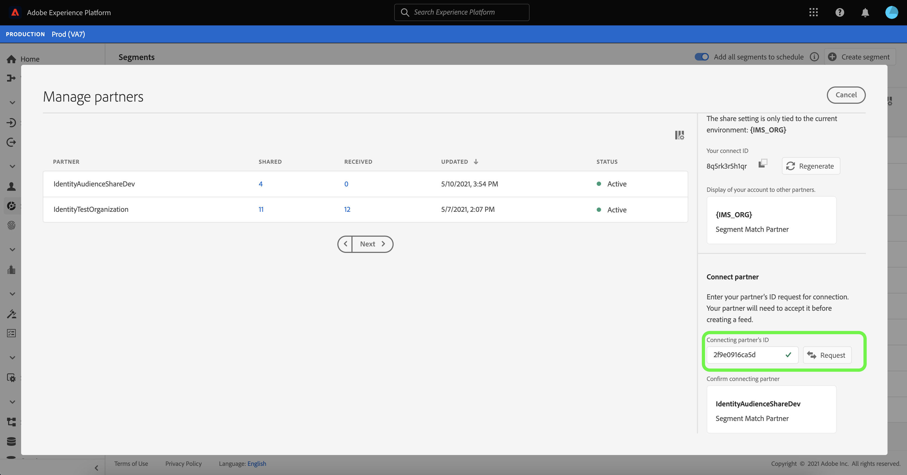

# （ベータ版） [!DNL Segment Match] の概要

>[!IMPORTANT]
>
>[!DNL Segment Match] は現在ベータ版です。ドキュメントと機能は変更される場合があります。

Adobe Experience Platform Segment Match は、2 人以上の Platform ユーザーが、安全で管理されたプライバシーに優しい方法でセグメントデータを交換できるセグメント共有サービスです。 [!DNL Segment Match] は、ハッシュ化された電子メール、ハッシュ化された電話番号、IDFA や GAID などのデバイス識別子など、Platform のプライバシー標準と個人識別子を使用します。

[!DNL Segment Match] では、以下のことが可能です。

* ID 重複プロセスを管理します。
* 共有前の見積もりを表示します。
* データ使用ラベルを適用して、データをパートナーと共有できるかどうかを制御します。
* フィードを公開した後も共有 Audience Lifecycle Management を維持し、追加、削除、共有解除の機能を通じて、データの動的な交換を続行します。

[!DNL Segment Match] では、id の重複プロセスを使用して、セグメントの共有がプライバシーに重点を置いた安全な方法でおこなわれるようにします。**重複する ID** は、セグメントと選択したパートナーのセグメントの両方で一致する ID です。 送信者と受信者の間でセグメントを共有する前に、ID 重複プロセスは名前空間内の重複を確認し、送信者と受信者の間の同意チェックを行います。 セグメントを共有するには、両方の重複チェックが合格する必要があります。

次の節では、セットアップとエンドツーエンドのワークフローの詳細など、[!DNL Segment Match] に関する詳細を説明します。

## セットアップ

次の節では、[!DNL Segment Match] の設定方法と設定方法について説明します。

### ID データと名前空間の設定 {#namespaces}

[!DNL Segment Match] を使い始める最初の手順は、サポートされている ID 名前空間に対してデータを取り込むことです。

ID 名前空間は、[Adobe Experience Platform ID サービス ](../../identity-service/home.md) のコンポーネントです。 各顧客 ID には、ID のコンテキストを示す関連付けられた名前空間が含まれます。 例えば、名前空間では、「name@email.com」の値を電子メールアドレスとして、または「443522」を数値 CRM ID として区別できます。

完全修飾 ID には、ID 値と名前空間が含まれます。プロファイルフラグメント間でレコードデータを一致させる場合（[!DNL Real-time Customer Profile] がプロファイルデータを結合する場合など）は、ID 値と名前空間の両方が一致する必要があります。

[!DNL Segment Match] のコンテキストでは、名前空間はデータを共有する際に重複プロセスで使用されます。

サポートされる名前空間のリストを次に示します。

| 名前空間 | 説明 |
| --------- | ----------- |
| 電子メール（SHA256、小文字） | 事前にハッシュ化された電子メールアドレス用の名前空間。 この名前空間で指定された値は、SHA256 でハッシュする前に小文字に変換されます。 E メールアドレスが正規化される前に、先頭と末尾の空白文字をトリミングする必要があります。 この設定を遡って変更することはできません。 詳しくは、[SHA256 ハッシュサポート ](https://experienceleague.adobe.com/docs/id-service/using/reference/hashing-support.html?lang=en#hashing-support) に関する次のドキュメントを参照してください。 |
| 電話 (SHA256_E.164) | SHA256 形式と E.164 形式の両方を使用してハッシュ化する必要がある生の電話番号を表す名前空間。 |
| ECID | Experience CloudID(ECID) 値を表す名前空間。 この名前空間は、次のエイリアスでも参照できます。&quot;Adobe Marketing Cloud ID&quot;、&quot;Adobe Experience Cloud ID&quot;、&quot;Adobe Experience Platform ID&quot;。 詳しくは、[ECID の概要](../../identity-service/ecid.md)を参照してください。 |
| Apple IDFA（広告主の ID） | Apple ID for Advertisers を表す名前空間。 詳しくは、[ 興味ベースの広告 ](https://support.apple.com/ja-jp/HT202074) に関する次のドキュメントを参照してください。 |
| Google 広告 ID | Google 広告 ID を表す名前空間。 詳しくは、[Google 広告 ID](https://support.google.com/googleplay/android-developer/answer/6048248?hl=en) の次のドキュメントを参照してください。 |

### 同意設定の設定

同意の設定を指定し、同意チェックのデフォルト値を `opt-in` または `opt-out` に設定する必要があります。

オプトインおよびオプトアウトの同意チェックは、デフォルトでユーザーデータを共有することに同意して操作できるかどうかを指定します。 同意設定のデフォルトが `opt-in` に設定されている場合は、ユーザーが明示的にオプトアウトしない限り、ユーザーデータを共有できます。 デフォルト値が `opt-out` に設定されている場合、ユーザーが明示的にオプトインしない限り、ユーザーデータは共有できません。

[!DNL Segment Match] のデフォルトの同意設定は `opt-out` に設定されます。 データに対してオプトインモデルを強制的に適用するには、担当のAdobeアカウントマネージャーに電子メールでリクエストを送信してください。

データ共有の同意値の設定に使用する `share` 属性について詳しくは、[privacy and consents field group](../../xdm/field-groups/profile/consents.md) に関する次のドキュメントを参照してください。 プライバシー、パーソナライゼーション、マーケティングの環境設定に関するデータの収集および使用に対する消費者の同意を取り込むために使用する特定のフィールドグループについて詳しくは、次の [Consent for Privacy, Personalization and Marketing Preferences GitHub example](https://github.com/adobe/xdm/blob/master/docs/reference/datatypes/consent/consent-preferences.schema.md) を参照してください。

### データ使用ラベルの設定

最後に確立する必要がある前提条件は、データの共有を防ぐために新しいデータ使用ラベルを設定することです。 データ使用ラベルを使用して、[!DNL Segment Match] を通じて共有できるデータを管理できます。

データ使用状況ラベルを使用すると、データに適用される使用ポリシーに従ってデータセットとフィールドを分類できます。ラベルはいつでも付けることができ、それによってデータの管理方法を柔軟に選択できます。ベストプラクティスとしては、データが Experience Platform に取り込まれたときや Experience Platform で使用可能になったときに、すぐにデータにラベルを付けることをお勧めします。

[!DNL Segment Match] は C11 ラベルを使用しま [!DNL Segment Match] す。これは、任意のデータセットや属性に手動で追加して、パートナー共有プロセスから除外できるようにするための契約ラ [!DNL Segment Match] ベルです。C11 ラベルは、[!DNL Segment Match] プロセスで使用すべきでないデータを示します。[!DNL Segment Match] から除外するデータセットやフィールドを決定し、それに応じて C11 ラベルを追加すると、[!DNL Segment Match] ワークフローによってラベルが自動的に適用されます。 [!DNL Segment Match] は、「データの共有を制限」コ [!UICONTROL アポリシーを自] 動的に有効にします。データ使用ラベルをデータセットに適用する方法について詳しくは、[UI でのデータ使用ラベルの管理 ](../../data-governance/labels/user-guide.md) に関するチュートリアルを参照してください。

データ使用ラベルとその定義の一覧については、[ データ使用ラベルの用語集 ](../../data-governance/labels/reference.md) を参照してください。 データ使用ポリシーの詳細については、「[ データ使用ポリシーの概要 ](../../data-governance/policies/overview.md)」を参照してください。

### [!DNL Segment Match] 権限の理解

[!DNL Segment Match] には、次の 2 つの権限が関連付けられています。

| 権限 | 説明 |
| --- | --- |
| オーディエンス共有接続の管理 | この権限を使用すると、2 つの IMS 組織を接続して [!DNL Segment Match] フローを有効にするパートナーハンドシェイクプロセスを完了できます。 |
| オーディエンス共有の管理 | この権限を持つユーザーは、アクティブなパートナー（**[!UICONTROL Audience Share Connections]** アクセス権を持つ管理者ユーザーによって接続されたパートナー）とのフィード（[!DNL Segment Match] に使用されるデータのパッケージ）を作成、編集および公開できます。 |

アクセス制御と権限の詳細については、[ アクセス制御の概要 ](../../access-control/home.md) を参照してください。

## [!DNL Segment Match] エンドツーエンドのワークフロー

ID データと名前空間、同意設定、データ使用ラベルを設定したら、[!DNL Segment Match] とその機能の使用を開始できます。

### パートナーの管理

Platform UI で、左側のナビゲーションから「 **[!UICONTROL セグメント]** 」を選択し、上部のヘッダーから「 **[!UICONTROL フィード]** 」を選択します。

[!UICONTROL  フィード ] ページには、パートナーから受信したフィードのリストと、共有したフィードが含まれます。 既存のパートナーの一覧を表示したり、新しいパートナーとの接続を確立したりするには、**[!UICONTROL 「パートナーを管理]**」を選択します。

2 つのパートナー間の接続は、ユーザーがサンドボックスレベルで Platform 組織を接続するためのセルフサービス手法の 1 つとして機能する「双方向ハンドシェイク」です。 接続は、契約が確立され、Platform がお客様とパートナー間でサービスを共有しやすくすることを Platform に通知するために必要です。

>[!NOTE]
>
>あなたとパートナーの間の「双方向ハンドシェイク」は、厳密に結びつきです。 このプロセス中はデータは交換されません。

[!UICONTROL  パートナーの管理 ] 画面のメインインターフェイスで、既存のパートナーとの接続のリストを表示できます。 右側のパネルには [!UICONTROL  共有設定 ] が表示され、新しい [!UICONTROL  接続 ID] を生成するオプションと、パートナーの [!UICONTROL  接続 ID] を入力できる入力ボックスを提供します。

新しい [!UICONTROL  接続 ID] を作成するには、[!UICONTROL  共有設定 ] の下の **[!UICONTROL Regenerate]** を選択し、新しく生成された ID の横にあるコピーアイコンを選択します。

[!UICONTROL  接続 ID] を使用してパートナーを接続するには、「[!UICONTROL  接続パートナー ]」の下の入力ボックスに一意の ID 値を入力し、「**[!UICONTROL リクエスト]**」を選択します。

### フィードの作成

**フィード** は、データ（セグメント）のグループ、そのデータの公開や使用の方法に関するルール、およびデータとパートナーのデータとの照合方法を決定する設定です。 フィードは、[!DNL Segment Match] を通じて、別々に管理し、他の Platform ユーザーと交換できます。

新しいフィードを作成するには、[!UICONTROL  フィード ] ダッシュボードから「**[!UICONTROL フィード]** を作成」を選択します。

フィードの基本的なセットアップには、名前、説明、マーケティングの使用例や ID の設定などが含まれます。 フィードの名前と説明を入力し、データの除外元となるマーケティングのユースケースを適用します。 以下のようなリストから、複数のユースケースを選択できます。

* [!UICONTROL Analytics]
* [!UICONTROL PII と組み合わせる]
* [!UICONTROL クロスサイトターゲティング]
* [!UICONTROL データサイエンス]
* [!UICONTROL E メールのターゲティング]
* [!UICONTROL サードパーティへの書き出し]
* [!UICONTROL オンサイト広告]
* [!UICONTROL オンサイトのパーソナライゼーション]
* [!UICONTROL Segment Match]
* [!UICONTROL 単一の ID パーソナライゼーション]

最後に、フィードに適した ID 名前空間を選択します。 [!DNL Segment Match] でサポートされている特定の名前空間について詳しくは、[ID データと名前空間の表 ](#namespaces) を参照してください。 終了したら、「**[!UICONTROL 次へ]**」を選択します。

フィードの設定を確立したら、共有するセグメントをファーストパーティセグメントのリストから選択します。 リストから 1 つ以上のセグメントを選択でき、右パネルを使用して選択したセグメントのリストを管理できます。 完了したら、「**[!UICONTROL 次へ]**」を選択します。

[!UICONTROL  共有 ] ページが表示され、フィードを共有するパートナーを選択するためのインターフェイスが表示されます。 この手順では、共有前の重複の予測レポートを表示し、自分とパートナーの間の名前空間別に重複する ID の数、データを共有することに同意する重複する ID の数を確認することもできます。

**[!UICONTROL セグメント別に分析]** を選択して、予測レポートを表示します。

重複の予測レポートでは、フィードを共有する前に、パートナーごとおよびセグメントごとの重複および同意チェックを管理できます。

| 指標 | 説明 |
| ------- | ----------- |
| 同意を伴う推定 ID | 組織に設定された同意要件を満たす重複する ID の合計数です。 |
| 重複する推定 ID | 選択したセグメントに適合し、選択したパートナーと一致する ID の数。 これらの ID は名前空間別に表示され、個々のプロファイル ID を表すものではありません。 重複の予測は、プロファイルのスケッチに基づいています。 |

終了したら、「**[!UICONTROL 閉じる]**」を選択します。

パートナーを選択し、重複予測レポートを表示したら、「**[!UICONTROL 次へ]**」を選択して次に進みます。

[!UICONTROL  確認 ] 手順が表示され、新しいフィードを共有して公開する前に確認できます。 この手順には、適用した ID 設定の詳細に加え、選択したマーケティングの使用例、セグメント、パートナーに関する情報が含まれます。

「**[!UICONTROL 終了]**」を選択して続行します。

### フィードの更新

セグメントを追加または削除するには、[!UICONTROL  フィード ] ページから「**[!UICONTROL フィード]** を作成 **[!UICONTROL 既存のフィード]**」を選択します。 表示される既存のフィードのリストで、更新するフィードを選択し、「**[!UICONTROL 次へ]**」を選択します。

セグメントのリストが表示されます。 ここから、新しいセグメントをフィードに追加し、右側のパネルを使用して不要になったセグメントを削除できます。 フィードのセグメントの管理が完了したら、「**[!UICONTROL 次へ]**」を選択し、上記の手順に従って更新されたフィードを完了します。

>[!NOTE]
>
>共有フィードにセグメントを追加または削除する場合、受信パートナーは、受信したフィードのリストの [!DNL Profile] 切り替えを再度有効にして、変更を確認する必要があります。

### 受信フィードの受け入れ

受信フィードを表示するには、[!UICONTROL  フィード ] ページのヘッダーから「**[!UICONTROL 受信済み]**」を選択し、リストから表示するフィードを選択します。 フィードを受け入れるには、「**[!UICONTROL プロファイルで有効]**」を選択し、ステータスが [!UICONTROL  保留 ] から [!UICONTROL  有効 ] に更新されるまでしばらく待ちます。

共有フィードを承認したら、共有データを使用して新しいセグメントを作成できます。

## 次の手順

このドキュメントでは、[!DNL Segment Match] とその機能、エンドツーエンドのワークフローについて理解しています。 他の Platform サービスの詳細については、次のドキュメントを参照してください。

* [[!DNL Segmentation Service]](../home.md)
* [[!DNL Identity Service]](../../identity-service/home.md)
* [[!DNL Real-time Customer Profile] の概要](../../profile/home.md)
