# [!DNL Segment Match] の概要

>[!IMPORTANT]
>
>Adobeは、2021年にお客様が共同作業やオーディエンスの交換を行うために[!DNL Segment Match]を導入しました。 2025年初頭、Adobeは[Real-Time CDP Collaboration](https://experienceleague.adobe.com/ja/docs/real-time-cdp-collaboration/using/home)を導入しました。これは、このユースケースに対応するための長期的なアプローチです。
>
>* 米国、カナダ、オーストラリア、ニュージーランド、EMEAのお客様：Adobeでは、Real-Time CDP PrimeおよびUltimateのお客様に対して、[!DNL Segment Match]からReal-Time CDP Collaborationへのデータコラボレーションユースケースの移行をお勧めします。 Real-Time CDP Collaborationの[&#x200B; ドキュメント &#x200B;](https://experienceleague.adobe.com/ja/docs/real-time-cdp-collaboration/using/home)および[&#x200B; クイックスタートガイド &#x200B;](https://experienceleague.adobe.com/ja/docs/real-time-cdp-collaboration/using/quick-start-guide)を参照し、詳しくはAdobe アカウントチームにお問い合わせください。
>* その他のすべての地域のお客様の場合：2026年にReal-Time CDP Collaborationがリリースされるまで、[!DNL Segment Match]をお勧めします。

Adobe Experience Platform Segment Matchは、複数のExperience Platform ユーザーが、安全に管理された環境で、プライバシーに配慮しながらセグメントデータを交換できるセグメント共有サービスです。 [!DNL Segment Match]は、Experience Platformのプライバシー標準と、ハッシュ化された電子メール、ハッシュ化された電話番号、IDFAやGAIDなどのデバイス IDなどの個人識別子を使用しています。

[!DNL Segment Match] を使用すると、次のことが可能です。

* ID 重複プロセスを管理します。
* 共有前の推定を表示します。
* データ使用ラベルを適用して、データをパートナーと共有できるかどうかを制御します。
* フィードを公開した後も共有オーディエンスのライフサイクル管理を維持し、追加、削除および共有解除の機能を通じてデータの動的交換を継続します。

[!DNL Segment Match] では、ID 重複プロセスを使用して、安全でプライバシーを重視した方法でセグメント共有が確実に行われるようにします。 **重複 ID** は、自分のセグメントと選択したパートナーのセグメントの両方で一致する ID です。 送信者と受信者の間でセグメントを共有する前に、ID 重複プロセスによって、名前空間の重複チェックと送信者と受信者の間の同意チェックが行われます。 セグメントを共有するには、両方の重複チェックに合格する必要があります。

以下の節では、セットアップとそのエンドツーエンドワークフローの詳細など、[!DNL Segment Match] について詳しく説明します。

## セットアップ

以下の節では、[!DNL Segment Match] のセットアップおよび設定方法の概要を説明します。

### ID データと名前空間のセットアップ {#namespaces}

[!DNL Segment Match] の使用を開始するための最初の手順として、サポートされている ID 名前空間に対してデータを確実に取り込みます。

ID 名前空間は、[Adobe Experience Platform ID サービス](../../../identity-service/home.md)のコンポーネントです。 各顧客 ID には、ID のコンテキストを示す関連する名前空間が含まれています。 例えば、名前空間では、「name@email.com」の値をメールアドレスとして識別でき、「443522」を数値 CRM ID として識別できます。

完全修飾 ID には、ID 値と名前空間が含まれています。 プロファイルフラグメント間でレコードデータを照合する場合（[!DNL Real-Time Customer Profile] でプロファイルデータを結合する場合など）は、ID 値と名前空間の両方が一致する必要があります。

[!DNL Segment Match] のコンテキストでは、名前空間は、データを共有する際に重複プロセスで使用されます。

サポートされている名前空間のリストを以下に示します。

| 名前空間 | 説明 |
| --------- | ----------- |
| メール（SHA256、小文字） | 事前にハッシュされたメールアドレスの名前空間。 この名前空間で指定された値は、小文字に変換されてから SHA256 でハッシュ化されます。 メールアドレスを正規化する前に、先頭と末尾のスペースを削除する必要があります。 この設定を過去にさかのぼって変更することはできません。 Experience Platformでは、[`setCustomerIDs`](https://experienceleague.adobe.com/docs/id-service/using/reference/hashing-support.html?lang=ja#hashing-support)および[data prep](../../../data-prep/functions.md#hashing)を通じて、データ収集時にハッシュをサポートする2つの方法を提供しています。 |
| 電話（SHA256_E.164） | SHA256 形式と E.164 形式の両方を使用してハッシュする必要がある生の電話番号を表す名前空間。 |
| ECID | Experience Cloud ID（ECID）値を表す名前空間。 この名前空間は、「Adobe Marketing Cloud ID」、「Adobe Experience Cloud ID」、「Adobe Experience Platform ID」という別名で呼ばれることもあります。 詳しくは、[ECID の概要](../../../identity-service/features/ecid.md)を参照してください。 |
| Apple IDFA（広告主の ID） | 広告主の Apple ID を表す名前空間。 詳しくは、[興味／関心に基づく広告](https://support.apple.com/ja-jp/HT202074)に関するドキュメントを参照してください。 |
| Google 広告 ID | Google 広告 ID を表す名前空間。 詳しくは、[Google 広告 ID](https://support.google.com/googleplay/android-developer/answer/6048248?hl=ja) に関する次のドキュメントを参照してください。 |

### 同意設定の指定

同意設定を指定し、同意チェックのオプトインまたはオプトアウトにデフォルト値を設定する必要があります。

オプトインおよびオプトアウトの同意チェックにより、デフォルトでユーザーデータを共有することに同意して操作できるかどうかが決まります。 同意設定のデフォルトがオプトインに設定されている場合、ユーザーが明示的にオプトアウトしない限り、ユーザーデータを共有できます。 デフォルトがオプトアウトに設定されている場合、ユーザーが明示的にオプトインしない限り、ユーザーデータを共有することはできません。

セグメントマッチのデフォルトの同意設定は、オプトアウトに設定されています。 データのオプトインモデルを適用するには、アドビアカウントチームにメールでリクエストを送信してください。

データ共有の同意値の設定に使用される`share`属性について詳しくは、[&#x200B; プライバシーと同意フィールドグループ &#x200B;](../../../xdm/field-groups/profile/consents.md)に関する次のドキュメントを参照してください。 プライバシー、パーソナライゼーション、マーケティングの環境設定に関連するデータの収集と使用に対する消費者の同意をキャプチャするために使用される特定のフィールドグループについては、次の[プライバシー、パーソナライゼーション、マーケティングの環境設定に関する同意の GitHub の例](https://github.com/adobe/xdm/blob/master/docs/reference/datatypes/consent/consent-preferences.schema.md)を参照してください。

### データ使用ラベルの設定

確立する必要がある最後の前提条件は、データの共有を防ぐための新しいデータ使用ラベルを設定することです。 データ使用ラベルを使用すると、どのようなデータを [!DNL Segment Match] を通じて共有できるかを管理できます。

データ使用状況ラベルを使用すると、データに適用される使用ポリシーに従ってデータセットとフィールドを分類できます。 ラベルはいつでも適用でき、データの管理方法を柔軟に選択できます。 ベストプラクティスでは、データがExperience Platformに取り込まれたらすぐに、またはデータがExperience Platformで使用できるようになったら、すぐにラベル付けを行うことを推奨しています。

[!DNL Segment Match] では C11 ラベル（[!DNL Segment Match] に固有の契約ラベルで、任意のデータセットや属性に手動で追加して、それらが [!DNL Segment Match] パートナー共有プロセスから確実に除外されるようにできるラベル）です。 C11 ラベルは、[!DNL Segment Match] プロセスで使用すべきでないデータを示します。 [!DNL Segment Match] から除外するデータセットやフィールドを決定し、それに応じて C11 ラベルを追加したら、そのラベルが [!DNL Segment Match] ワークフローによって自動的に適用されます。 [!DNL Segment Match]は、[!UICONTROL Restrict data sharing] コアポリシーを自動的に有効にします。 データ使用ラベルをデータセットに適用する方法について詳しくは、[UI でのデータ使用ラベルの管理](../../../data-governance/labels/user-guide.md)に関するチュートリアルを参照してください。

データ使用ラベルとその定義の一覧については、[データ使用ラベルの用語集](../../../data-governance/labels/reference.md)を参照してください。 データ使用ポリシーについて詳しくは、 [データ使用ポリシーの概要](../../../data-governance/policies/overview.md)を参照してください。

### [!DNL Segment Match] の権限について

[!DNL Segment Match] には、次の 2 つの権限が関連付けられています。

| 権限 | 説明 |
| --- | --- |
| オーディエンス共有接続の管理 | この権限を使用すると、2 つの組織を接続して [!DNL Segment Match] フローを有効にするパートナーハンドシェイクプロセスを完了できます。 |
| オーディエンス共有の管理 | この権限を使用すると、アクティブなパートナー（管理者ユーザーが&#x200B;**[!UICONTROL Audience Share Connections]** アクセスで接続したパートナー）とのフィード（[!DNL Segment Match]に使用されるデータのパッケージ）を作成、編集、公開できます。 |

アクセス制御と権限について詳しくは、[アクセス制御の概要](../../../access-control/home.md)を参照してください。

## [!DNL Segment Match] のエンドツーエンドワークフロー

ID データと名前空間、同意設定およびデータ使用ラベルを設定したら、[!DNL Segment Match] とその機能を使用した作業を開始できます。

### パートナーの管理

Experience Platform UIで、左側のナビゲーションから「**[!UICONTROL Segments]**」を選択し、上部のヘッダーから「**[!UICONTROL Feeds]**」を選択します。

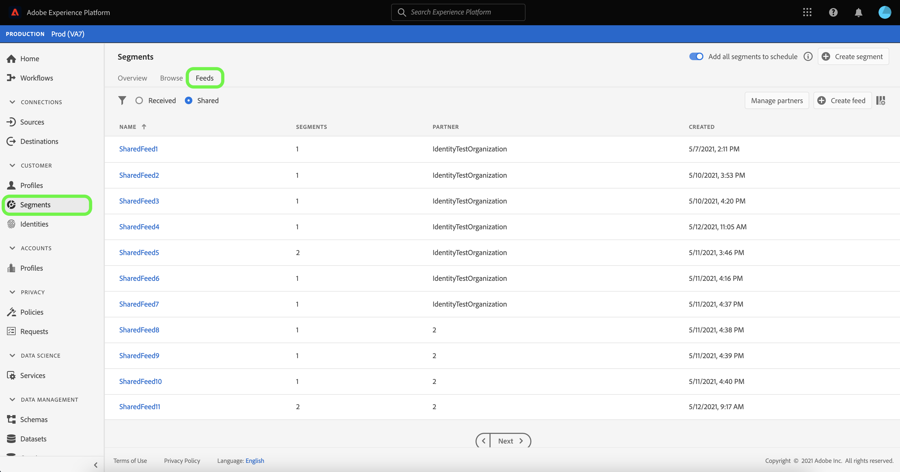

[!UICONTROL Feeds] ページには、パートナーから受信したフィードのリストと、共有したフィードが含まれています。 既存のパートナーのリストを表示するか、新しいパートナーとの接続を確立するには、**[!UICONTROL Manage partners]**&#x200B;を選択します。

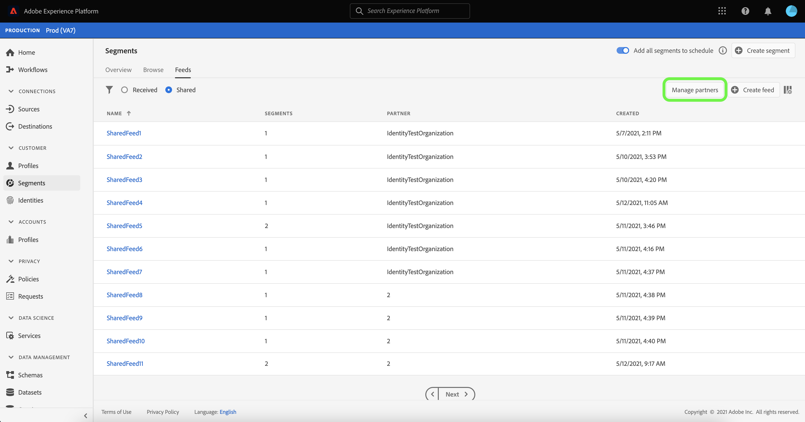

2つのパートナー間のつながりは、ユーザーがExperience Platform組織をサンドボックスレベルで結び付けるセルフサービス方式として機能する「双方向ハンドシェイク」です。 接続は、契約書が確立されたこと、およびExperience Platformがお客様とパートナーとの間でサービスの共有を容易にできることをExperience Platformに通知するために必要です。

>[!NOTE]
>
>ユーザーとユーザーのパートナーとの「双方向ハンドシェイク」は、厳密には接続です。 このプロセス中にデータが交換されることはありません。

[!UICONTROL Manage partners]画面のメインインターフェイスで、既存のパートナーとの接続のリストを表示できます。 右側のパネルには[!UICONTROL Share setting] パネルがあり、新しい[!UICONTROL connect ID]を生成するオプションと、パートナーの[!UICONTROL connect ID]を入力できる入力ボックスが表示されます。

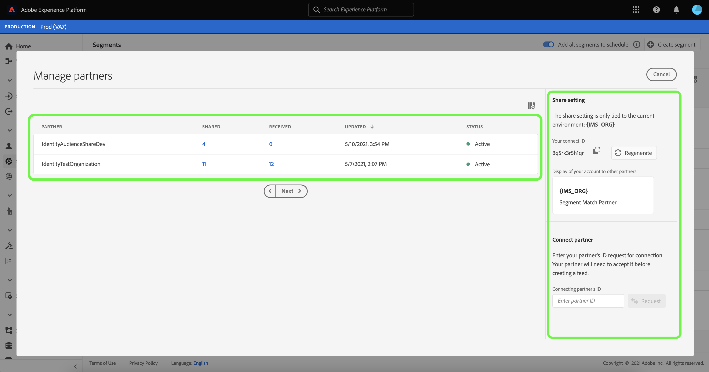

新しい[!UICONTROL connect ID]を作成するには、[!UICONTROL Share setting]の下の&#x200B;**[!UICONTROL Regenerate]**&#x200B;を選択し、新しく生成されたIDの横にあるコピーアイコンを選択します。

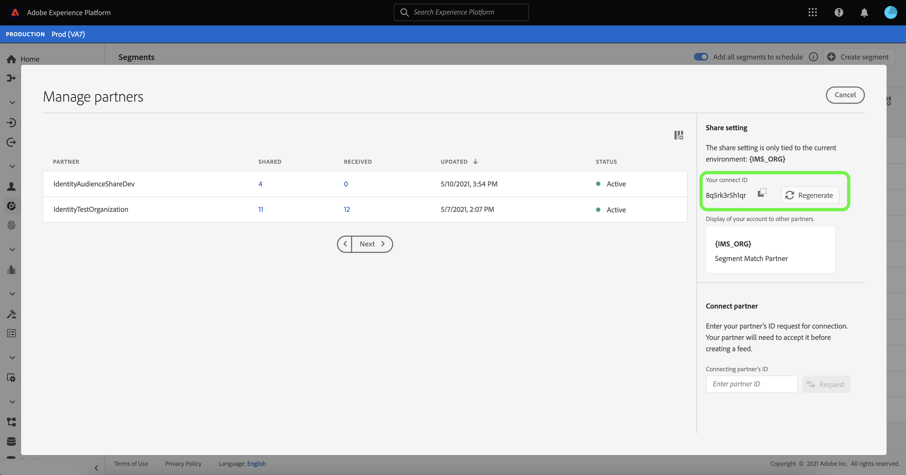

[!UICONTROL connect ID]を使用してパートナーを接続するには、[!UICONTROL Connect partner]の下の入力ボックスに一意のID値を入力し、**[!UICONTROL Request]**&#x200B;を選択します。

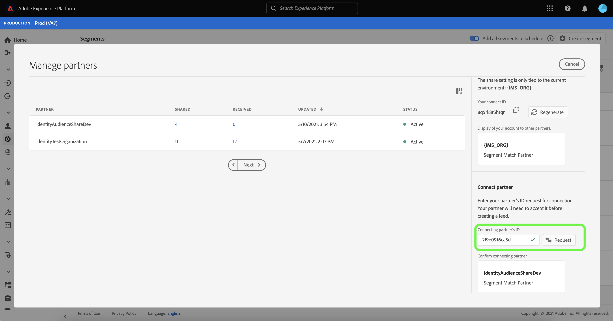

### フィードの作成 {#create-feed}

>[!CONTEXTUALHELP]
>id="platform_segment_match_marketing"
>title="制限付きマーケティングユースケース"
>abstract="制制限付きマーケティングユースケースは、データガバナンス制約に従って共有セグメントが適切に使用されるように、パートナーにガイダンスを提供するうえで役に立ちます。"
>text="Learn more in documentation"

**フィード**&#x200B;は、データ（セグメント）、そのデータの公開方法や使用方法についてのルール、およびユーザーのデータとパートナーのデータの照合方法を決定する設定をグループ化したものです。 フィードは個別に管理し、[!DNL Segment Match]を通じて他のExperience Platform ユーザーと交換できます。

新しいフィードを作成するには、[!UICONTROL Feeds] ダッシュボードから&#x200B;**[!UICONTROL Create feed]**&#x200B;を選択します。

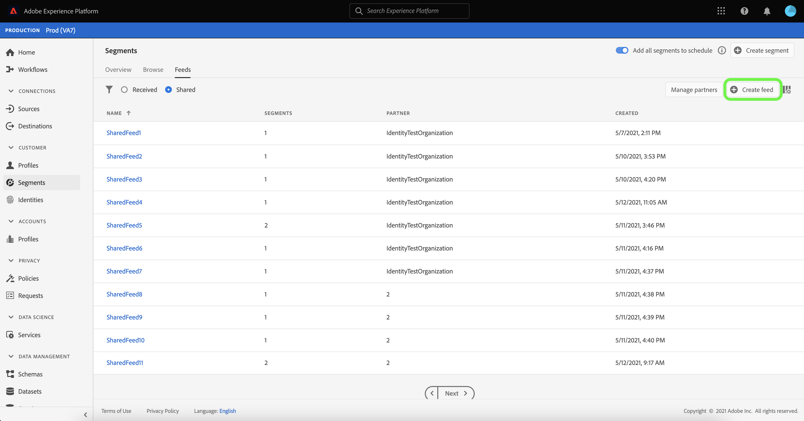

フィードの基本設定には、名前、説明、マーケティングユースケースや ID 設定に関する設定が含まれます。 フィードの名前と説明を入力したあと、データを除外するマーケティングユースケースを適用します。 以下を含むリストから複数のユースケースを選択できます。

* [!UICONTROL Analytics]
* [!UICONTROL Combine with PII]
* [!UICONTROL Cross-site targeting]
* [!UICONTROL Data Science]
* [!UICONTROL Email targeting]
* [!UICONTROL Export to third party]
* [!UICONTROL Onsite advertising]
* [!UICONTROL Onsite personalization]
* [!UICONTROL Segment Match]
* [!UICONTROL Single identity personalization]

最後に、フィードに適した ID 名前空間を選択します。 [!DNL Segment Match] でサポートされている具体的な名前空間について詳しくは、[ID データと名前空間の表](#namespaces)を参照してください。 完了したら、**[!UICONTROL Next]**&#x200B;を選択します。

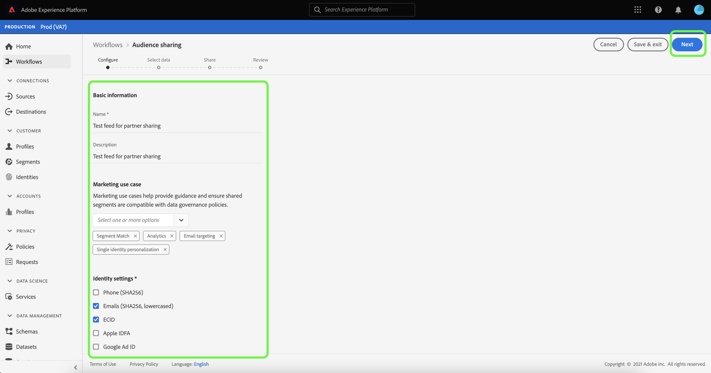

フィードの設定を確立したら、共有するセグメントをファーストパーティセグメントのリストから選択します。 リストから複数のセグメントを選択できます。また、右側のパネルを使用して、選択したセグメントのリストを管理できます。 完了したら、**[!UICONTROL Next]**&#x200B;を選択します。

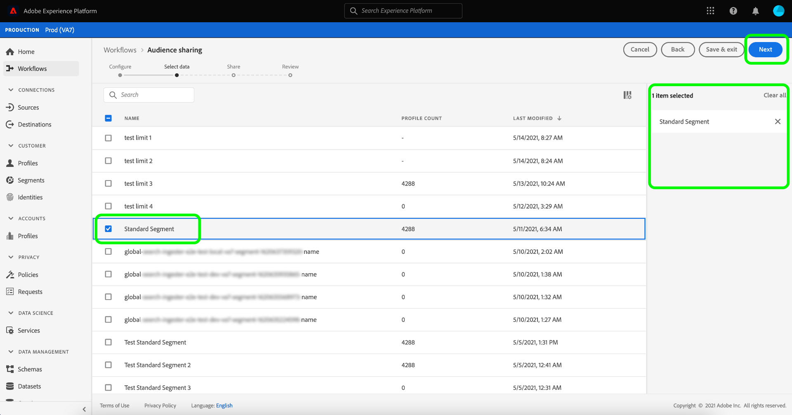

[!UICONTROL Share] ページが表示され、フィードを共有するパートナーを選択するためのインターフェイスが表示されます。 この手順の間に、共有前の重複予測レポートを確認したり、自社とパートナーの間で重複している ID の数を名前空間ごとに確認したり、データの共有に同意していて重複している ID の数を確認したりできます。

**[!UICONTROL Analyze by segment]**&#x200B;を選択して、見積もりレポートを表示します。

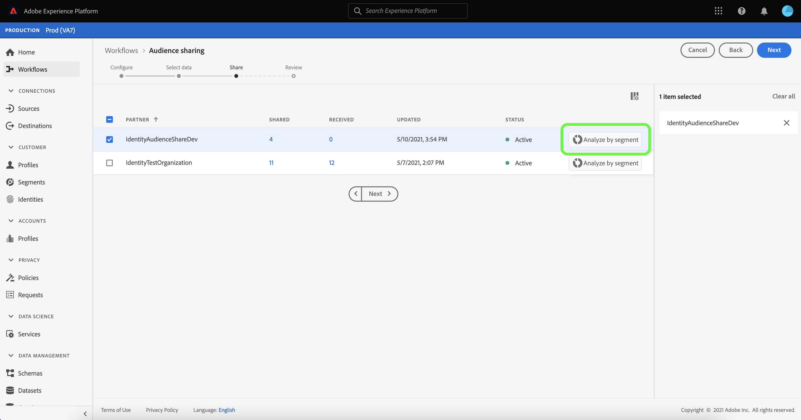

重複予測レポートでは、フィードを共有する前に、パートナーごとおよびセグメントごとに重複および同意チェックを管理できます。

| 指標 | 説明 |
| ------- | ----------- |
| 同意を得た ID の予測 | 組織に設定された同意要件を満たす重複した ID の合計数です。 |
| 重複 ID の予測 | 選択したセグメントに適合し、さらに選択したパートナーとの一致が見つかる ID の数です。 これらの ID は名前空間別に表示され、個々のプロファイル ID を表すものではありません。 重複の予測は、プロファイルのスケッチに基づいています。 |

完了したら、**[!UICONTROL Close]**&#x200B;を選択します。

パートナーを選択し、重複の見積もりレポートを表示したら、**[!UICONTROL Next]**&#x200B;を選択して続行します。

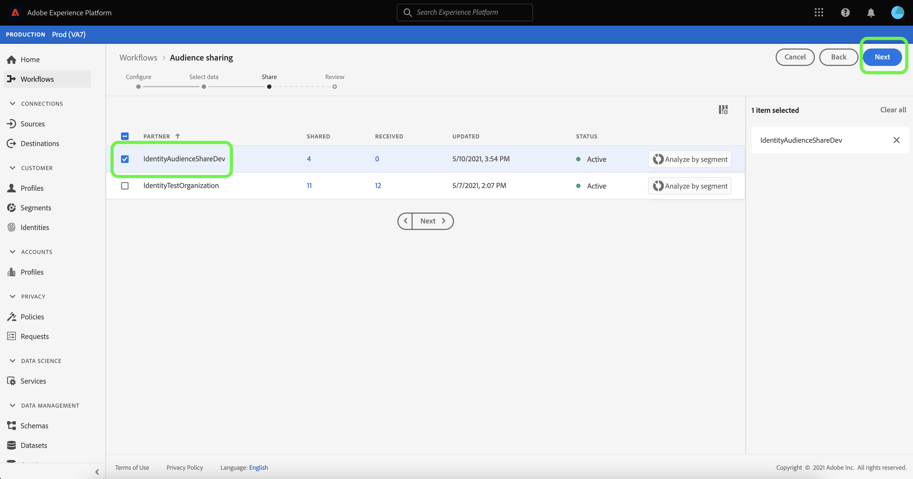

[!UICONTROL Review] ステップが表示され、新しいフィードを共有および公開する前に確認できます。 この手順には、適用した ID 設定の詳細や、選択したマーケティングのユースケース、セグメント、パートナーに関する情報が含まれます。

続行するには、**[!UICONTROL Finish]**&#x200B;を選択してください。

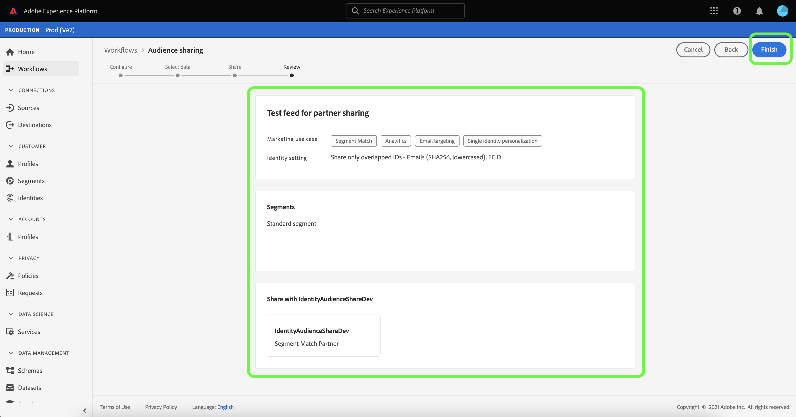

### フィードを更新

セグメントを追加または削除するには、[!UICONTROL Feeds] ページから&#x200B;**[!UICONTROL Create feed]**&#x200B;を選択し、**[!UICONTROL Existing feed]**&#x200B;を選択します。 表示される既存のフィードのリストで、更新するフィードを選択し、**[!UICONTROL Next]**&#x200B;を選択します。

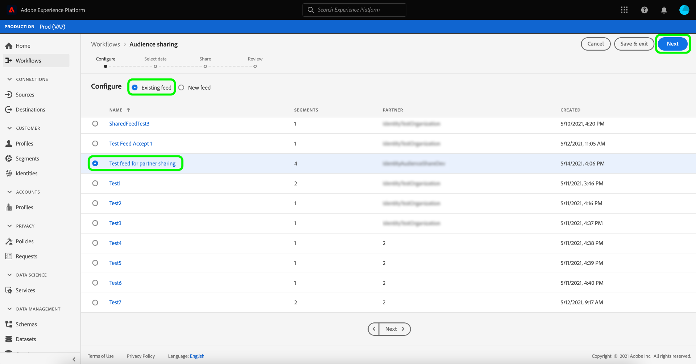

セグメントのリストが表示されます。 ここから、新しいセグメントをフィードに追加できます。また、右側のパネルを使用して、不要になったセグメントを削除できます。 フィードのセグメントの管理が完了したら、**[!UICONTROL Next]**&#x200B;を選択し、上記の手順に従って更新されたフィードを完了します。

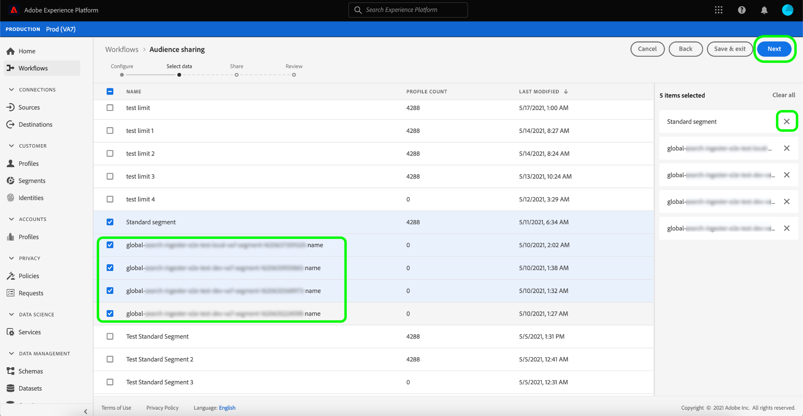

>[!NOTE]
>
>共有フィードにセグメントを追加または削除する場合、受信側のパートナーは、受信したフィードのリストの [!DNL Profile] 切替スイッチを再び有効にして変更を確定する必要があります。

### 受信フィードを受け入れる

受信フィードを表示するには、[!UICONTROL Feeds] ページのヘッダーから&#x200B;**[!UICONTROL Received]**&#x200B;を選択し、リストから表示するフィードを選択します。 フィードを承認するには、**[!UICONTROL Enable for profile]**&#x200B;を選択し、ステータスが[!UICONTROL Pending]から[!UICONTROL Enabled]に更新されるまでしばらく待ちます。

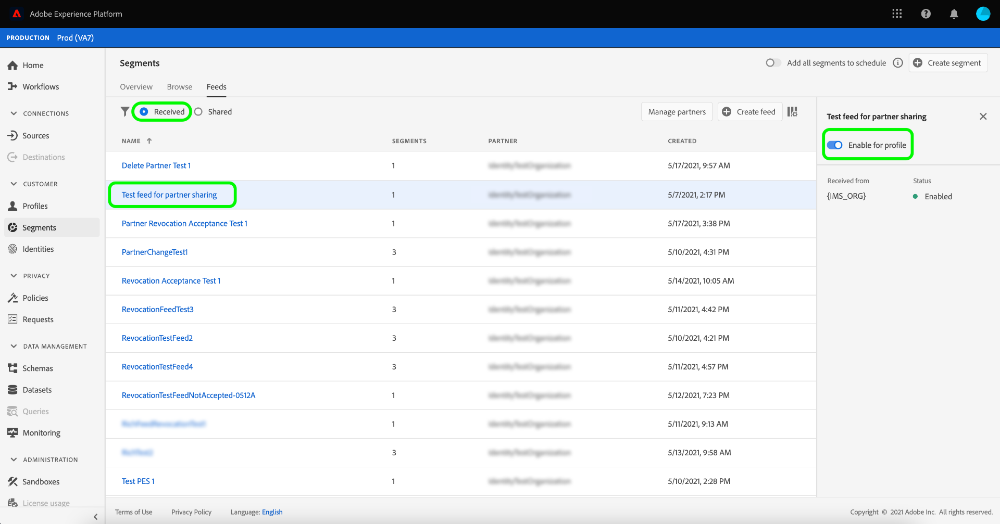

共有フィードを承認したら、共有データを使用して新しいセグメントを作成できます。

## 次の手順

このドキュメントを読むことで、[!DNL Segment Match] やその機能、およびエンドツーエンドのワークフローについて理解しました。 他の Platform サービスの詳細については、次のドキュメントを参照してください。

* [[!DNL Segmentation Service]](../../home.md)
* [[!DNL Identity Service]](../../../identity-service/home.md)
* [[!DNL Real-Time Customer Profile] 概要](../../../profile/home.md)
