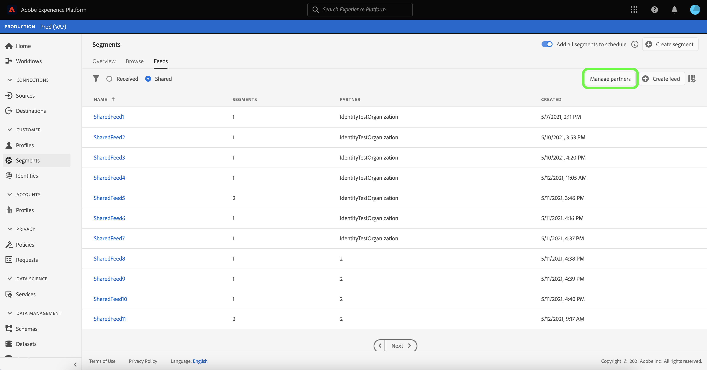
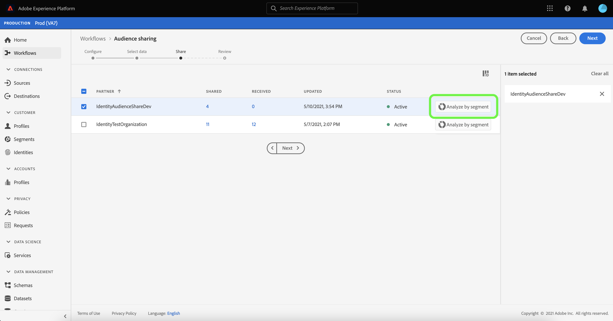

# [!DNL Segment Match] の概要

Adobe Experience Platform Segment Match は、2 人以上の Platform ユーザーが、安全で管理された、プライバシーに優しい方法でセグメントデータを交換できる、セグメント共有サービスです。 [!DNL Segment Match] は、Platform のプライバシー基準と個人識別子（ハッシュ化された電子メール、ハッシュ化された電話番号、IDFA や GAID などのデバイス識別子など）を使用します。

[!DNL Segment Match] では、以下のことが可能です。

* ID 重複プロセスを管理します。
* 共有前の見積もりを表示します。
* データ使用ラベルを適用して、データをパートナーと共有できるかどうかを制御します。
* フィードを公開した後も、共有オーディエンスのライフサイクル管理を維持し、追加、削除、共有解除の機能を通じて、データの動的な交換を続行します。

[!DNL Segment Match] では、id の重複プロセスを使用して、セグメント共有が安全でプライバシーに重点を置いた方法でおこなわれるようにします。 An **重複 ID** は、セグメントと選択したパートナーのセグメントの両方で一致する id です。 送信者と受信者の間でセグメントを共有する前に、ID 重複プロセスは名前空間での重複を確認し、送信者と受信者の間での同意チェックをおこないます。 セグメントを共有するには、両方の重複チェックが合格する必要があります。

以下の節では、 [!DNL Segment Match]（セットアップとエンドツーエンドのワークフローの詳細を含む）

## セットアップ

次の節では、を設定および設定する方法の概要を説明します [!DNL Segment Match]:

### ID データと名前空間の設定 {#namespaces}

を使い始めるための最初の手順 [!DNL Segment Match] は、サポートされている id 名前空間に対してデータを取り込むことを確認するためです。

ID 名前空間は、 [Adobe Experience Platform Identity Service](../../../identity-service/home.md). 各顧客 ID には、ID のコンテキストを示す関連付けられた名前空間が含まれます。 例えば、名前空間では「name」の値を区別できます@email.com」を電子メールアドレスとして、または数値 CRM ID として「443522」を指定します。

完全修飾 ID には、ID 値と名前空間が含まれます。プロファイルフラグメント間でレコードデータを一致させる場合 ( [!DNL Real-time Customer Profile] プロファイルデータの結合 )、ID 値と名前空間の両方が一致する必要があります。

のコンテキストでは [!DNL Segment Match]の場合、名前空間はデータを共有する際に重複プロセスで使用されます。

サポートされる名前空間のリストを次に示します。

| 名前空間 | 説明 |
| --------- | ----------- |
| 電子メール（SHA256、小文字） | 事前にハッシュ化された電子メールアドレス用の名前空間。 この名前空間で指定された値は、SHA256 でハッシュする前に小文字に変換されます。 E メールアドレスを正規化する前に、先頭と末尾のスペースをトリミングする必要があります。 この設定を遡って変更することはできません。 Platform では、次の 2 つの方法で、データ収集時のハッシュ化をサポートしています。 [`setCustomerIDs`](https://experienceleague.adobe.com/docs/id-service/using/reference/hashing-support.html?lang=en#hashing-support) そして [データ準備](../../../data-prep/functions.md#hashing). |
| 電話 (SHA256_E.164) | SHA256 形式と E.164 形式の両方を使用してハッシュ化する必要がある生の電話番号を表す名前空間です。 |
| ECID | Experience CloudID(ECID) 値を表す namespace。 この名前空間は、次のエイリアスからも参照できます。&quot;Adobe Marketing Cloud ID&quot;、&quot;Adobe Experience Cloud ID&quot;、&quot;Adobe Experience Platform ID&quot;。 詳しくは、[ECID の概要](../../../identity-service/ecid.md)を参照してください。 |
| Apple IDFA （広告主の ID） | 広告主のApple ID を表す名前空間。 次のドキュメントを参照してください： [興味ベースの広告](https://support.apple.com/ja-jp/HT202074) を参照してください。 |
| Google 広告 ID | Google Advertising ID を表す名前空間。 次のドキュメントを参照してください： [Google Advertising ID](https://support.google.com/googleplay/android-developer/answer/6048248?hl=en) を参照してください。 |

### 同意設定の設定

同意設定を指定し、そのデフォルト値を次のいずれかに設定する必要があります。 `opt-in` または `opt-out` 同意の確認を行う場合。

オプトインおよびオプトアウトの同意チェックは、デフォルトでユーザーデータを共有することに同意してを操作できるかどうかを決定します。 同意設定のデフォルトが `opt-out`を指定しない場合、ユーザーが明示的にオプトアウトしない限り、ユーザーデータを共有できます。 デフォルトが `opt-in`を指定しない場合、ユーザーが明示的にオプトインしない限り、ユーザーデータを共有できません。

のデフォルトの同意設定 [!DNL Segment Match] が `opt-out`. データに対してオプトインモデルを強制的に適用するには、担当のAdobeアカウントマネージャーに電子メールでリクエストを送信してください。

詳しくは、 `share` 属性を使用して、データ共有の同意の値を設定します。 [プライバシーと同意フィールドグループ](../../../xdm/field-groups/profile/consents.md). プライバシー、パーソナライゼーション、マーケティング環境設定に関連するデータの収集と使用に関する消費者の同意を取得するために使用される特定のフィールドグループについて詳しくは、次を参照してください [プライバシー、パーソナライゼーションおよびマーケティング環境設定に関する同意 GitHub の例](https://github.com/adobe/xdm/blob/master/docs/reference/datatypes/consent/consent-preferences.schema.md).

### データ使用ラベルの設定

最後に確立する必要があるのは、データの共有を防ぐために新しいデータ使用ラベルを設定することです。 データ使用ラベルを使用すると、を通じて共有できるデータを管理できます [!DNL Segment Match].

データ使用状況ラベルを使用すると、データに適用される使用ポリシーに従ってデータセットとフィールドを分類できます。ラベルはいつでも付けることができ、それによってデータの管理方法を柔軟に選択できます。ベストプラクティスとしては、データが Experience Platform に取り込まれたときや Experience Platform で使用可能になったときに、すぐにデータにラベルを付けることをお勧めします。

[!DNL Segment Match] は C11 ラベルを使用します。これは、 [!DNL Segment Match] データセットや属性を手動で追加して、それらがから除外されるようにする [!DNL Segment Match] パートナー共有プロセスを使用します。 C11 ラベルは、[!DNL Segment Match] プロセスで使用すべきでないデータを示します。除外するデータセットやフィールドを決定した後 [!DNL Segment Match] それに応じて、C11 ラベルが追加され、ラベルは [!DNL Segment Match] ワークフロー。 [!DNL Segment Match] を自動的に有効にする [!UICONTROL データ共有を制限] コアポリシーです。 データ使用ラベルをデータセットに適用する方法について詳しくは、 [UI でのデータ使用ラベルの管理](../../../data-governance/labels/user-guide.md).

データ使用ラベルとその定義のリストについては、 [データ使用ラベルの用語集](../../../data-governance/labels/reference.md). データ使用ポリシーについて詳しくは、 [データ使用ポリシーの概要](../../../data-governance/policies/overview.md).

### について [!DNL Segment Match] 権限

次の 2 つの権限が関連付けられています： [!DNL Segment Match]:

| 権限 | 説明 |
| --- | --- |
| オーディエンス共有接続を管理 | この権限を使用すると、2 つの IMS 組織を接続してを有効にする、パートナーハンドシェイクプロセスを完了できます [!DNL Segment Match] フロー。 |
| オーディエンス共有を管理 | この権限を使用すると、フィード ( [!DNL Segment Match]) とアクティブなパートナー ( 管理者ユーザーが **[!UICONTROL オーディエンス共有接続]** アクセス )。 |

詳しくは、 [アクセス制御の概要](../../../access-control/home.md) 」を参照してください。

## [!DNL Segment Match] エンドツーエンドのワークフロー

ID データと名前空間、同意設定、データ使用ラベルを設定したら、 [!DNL Segment Match] そしてその特徴

### パートナーを管理

Platform UI で、「 **[!UICONTROL セグメント]** 左側のナビゲーションから「 」を選択し、 **[!UICONTROL フィード]** を上部のヘッダーから削除します。

この [!UICONTROL フィード] ページには、パートナーから受け取ったフィードのリストと、共有したフィードが含まれています。 既存のパートナーの一覧を表示するか、新しいパートナーとの接続を確立するには、 **[!UICONTROL パートナーを管理]**.

2 つのパートナー間の接続は、ユーザーがサンドボックスレベルで Platform 組織を接続するためのセルフサービスメソッドとして機能する「双方向ハンドシェイク」です。 接続は、契約が確立され、Platform がお客様とパートナー間でのサービスの共有を促進できることを Platform に通知するために必要です。

>[!NOTE]
>
>あなたとパートナーの間の「双方向ハンドシェイク」は、厳密に繋がりです。 このプロセス中にデータが交換されることはありません。

既存のパートナーとの接続のリストは、 [!UICONTROL パートナーを管理] 画面 右側のパネルには、 [!UICONTROL 共有設定] パネルに表示されます。新しい [!UICONTROL 接続 ID] と、パートナーの [!UICONTROL 接続 ID].

新しい [!UICONTROL 接続 ID]を選択します。 **[!UICONTROL 再生成]** under [!UICONTROL 共有設定] 次に、新しく生成された ID の横にあるコピーアイコンを選択します。

を使用してパートナーに接続するには [!UICONTROL 接続 ID]の下の入力ボックスに一意の ID 値を入力します。 [!UICONTROL パートナーを接続] 次に、 **[!UICONTROL リクエスト]**.

### フィードを作成 {#create-feed}

>[!CONTEXTUALHELP]
>id="platform_segment_match_marketing"
>title="制限付きマーケティングの使用例"
>abstract="制限付きマーケティングの使用例は、共有セグメントがデータガバナンス制限に従って適切に使用されるよう、パートナーにガイダンスを提供します。"
>text="Learn more in documentation"

A **フィード** は、データ（セグメント）のグループ、そのデータの公開方法や使用方法のルール、およびデータとパートナーのデータとの照合方法を決定する設定です。 フィードは、を通じて個別に管理し、他の Platform ユーザーと交換できます [!DNL Segment Match].

新しいフィードを作成するには、 **[!UICONTROL フィードを作成]** から [!UICONTROL フィード] ダッシュボード。

フィードの基本的なセットには、名前、説明、マーケティングの使用例や ID の設定に関する設定が含まれます。 フィードの名前と説明を入力し、データを除外するマーケティングの使用例を適用します。 以下のようなリストから複数のユースケースを選択できます。

* [!UICONTROL Analytics]
* [!UICONTROL PII と組み合わせる]
* [!UICONTROL クロスサイトターゲティング]
* [!UICONTROL データサイエンス]
* [!UICONTROL E メールのターゲティング]
* [!UICONTROL サードパーティに書き出し]
* [!UICONTROL オンサイト広告]
* [!UICONTROL オンサイトパーソナライゼーション]
* [!UICONTROL Segment Match]
* [!UICONTROL 単一の ID パーソナライゼーション]

最後に、フィードに適した ID 名前空間を選択します。 でサポートされている特定の名前空間について詳しくは、 [!DNL Segment Match]を参照し、 [id データと名前空間の表](#namespaces). 完了したら、「 **[!UICONTROL 次へ]**.

フィードの設定を確立したら、共有するセグメントをファーストパーティセグメントのリストから選択します。 リストから複数のセグメントを選択できます。また、右側のパネルを使用して、選択したセグメントのリストを管理できます。 完了したら、「 」を選択します。 **[!UICONTROL 次へ]**.

この [!UICONTROL 共有] ページが表示され、フィードを共有するパートナーを選択するためのインターフェイスが表示されます。 この手順では、共有前の重複の予測レポートを表示し、自分とパートナーの間の名前空間別に重複している ID の数、データの共有に同意している重複している ID の数を確認することもできます。

選択 **[!UICONTROL セグメント別に分析]** をクリックして、予測レポートを表示します。

重複の予測レポートでは、フィードを共有する前に、パートナーごとおよびセグメントごとの重複および同意チェックを管理できます。

| 指標 | 説明 |
| ------- | ----------- |
| 同意を得た推定 ID | 組織に設定された同意要件を満たす重複した ID の合計数です。 |
| 推定重複 ID | 選択したセグメントに適合し、選択したパートナーとも一致する ID の数。 これらの ID は名前空間別に表示され、個々のプロファイル ID を表すものではありません。 重複の予測は、プロファイルのスケッチに基づいています。 |

完了したら、「 **[!UICONTROL 閉じる]**.

パートナーを選択し、重複予測レポートを表示したら、 **[!UICONTROL 次へ]** をクリックして続行します。

この [!UICONTROL レビュー] 手順が表示され、新しいフィードを共有して公開する前に確認できます。 この手順には、適用した ID 設定の詳細に加えて、選択したマーケティングの使用例、セグメント、パートナーに関する情報が含まれます。

選択 **[!UICONTROL 完了]** をクリックして続行します。

### フィードを更新

セグメントを追加または削除するには、「 **[!UICONTROL フィードを作成]** から [!UICONTROL フィード] ページを開き、 **[!UICONTROL 既存のフィード]**. 表示される既存のフィードのリストで、更新するフィードを選択し、「 」を選択します。 **[!UICONTROL 次へ]**.

セグメントのリストが表示されます。 ここから、新しいセグメントをフィードに追加できます。また、右側のパネルを使用して、不要になったセグメントを削除できます。 フィードのセグメントの管理が完了したら、 **[!UICONTROL 次へ]** その後、上記の手順に従って、更新されたフィードを完了します。

>[!NOTE]
>
>共有フィードにセグメントを追加または削除する場合、受信側のパートナーは、 [!DNL Profile] 受信したフィードのリストを切り替える。

### 受信フィードを受け入れる

受信フィードを表示するには、「 **[!UICONTROL 受信済み]** を [!UICONTROL フィード] ページを開き、リストから表示するフィードを選択します。 フィードを受け入れるには、 **[!UICONTROL プロファイルに対して有効にする]** ステータスが次の時間から更新されるまでしばらく待ちます： [!UICONTROL 保留中] から [!UICONTROL 有効].

共有フィードを承認したら、共有データを使用して新しいセグメントを作成できます。

## 次の手順

この文書を読むことで、 [!DNL Segment Match]、その機能、およびエンドツーエンドのワークフローについて説明します。 他の Platform サービスの詳細については、次のドキュメントを参照してください。

* [[!DNL Segmentation Service]](../../home.md)
* [[!DNL Identity Service]](../../../identity-service/home.md)
* [[!DNL Real-time Customer Profile] の概要](../../../profile/home.md)
