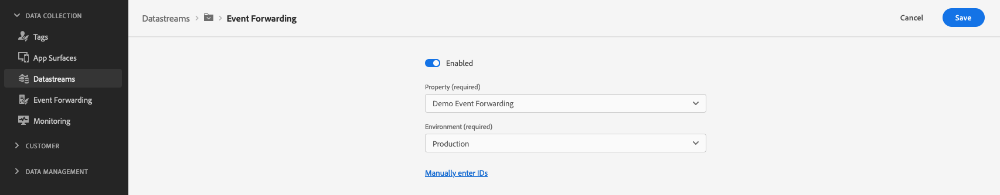

# サードパーティソリューションとのやり取り

## 概要 {#overview}

Edge Network Server API のイベント転送機能を使用して、収集したデータを非Adobeソリューションに送信します。

## データストリームイベント転送の設定 {#event-forwarding}

サードパーティソリューションが Server API からデータを受け取れるようにするには、次の手順を実行する必要があります [データストリームの設定](../edge/datastreams/overview.md#event-forwarding-settings) イベント転送の場合。

