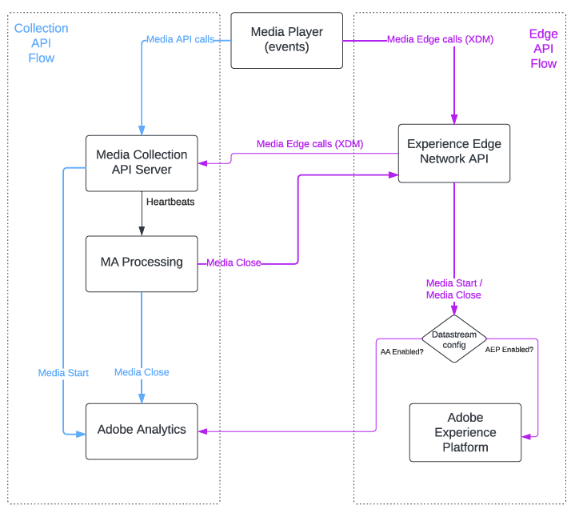

# メディアエッジ API の概要

Media Edge API は、Adobe Experience Platform(AEP) 上に構築され、のフレームワーク内でメディアイベントトラッキングデータを提供します。 [XDM スキーマ](https://experienceleague.adobe.com/docs/experience-platform/xdm/home.html?lang=en#:~:text=Experience%20Data%20Model%20(XDM)%2C,the%20power%20of%20digital%20experiences). Media Analytics のお客様は、これにより次の機能を利用できるようになります。

* を使用 [Customer Journey Analytics(CJA)](https://experienceleague.adobe.com/docs/analytics-platform/using/cja-overview/cja-overview.html?lang=ja)のお客様は、ほぼリアルタイムで詳細な時間の詳細、開始および停止を取得して、メディア指標を評価および組み合わせることができます。 Adobe Analyticsから移行するお客様は、CJA ですべてのレポート指標を利用できます。

* を使用 [Adobe Real-time Customer Data Platform(CDP)](https://experienceleague.adobe.com/docs/experience-platform/rtcdp/overview.html?lang=ja)のお客様は、メディア消費データを使用して、リアルタイムプロファイルを強化できます。

* を使用 [Adobe Journey Optimizer(AJO)](https://experienceleague.adobe.com/docs/journey-optimizer/using/get-started/get-started.html?lang=en)のお客様は、チャネルキャンペーンを最適化して、メディア消費シグナルを使用してジャーニーを自動化できます。

## メディアトラッキングデータフローの最適化

両方 [メディアコレクション](https://experienceleague.adobe.com/docs/media-analytics/using/implementation/streaming-media-apis/mc-api-overview.html?lang=en&amp;media-tracking-data-flows) API と Media Edge API は、RESTful サービスとしてメディアトラッキングデータを提供します。 ただし、Media Edge サービスを使用すると、次の利点があります。

* XDM スキーマをデータフローに組み込む最も簡単な方法です。

* 呼び出しは、メディアプレーヤーから [Experience Edge Platform Network](https://experienceleague.adobe.com/docs/experience-platform/edge-network-server-api/overview.html?lang=en).

* メディアイベントを最も効率的に追跡します。

次の表に、様々なAdobe分析ケースで最適なメディア API サービスを示します。

| ユースケース | Platform | API サービス |
| -------- | ------ | ---------- |
| CJA | AEP | Media Edge |
| CDP + CJA | AEP | Media Edge |
| Analytics と CJA | AEP | Media Edge |
| 従来の Analytics | なし | メディアコレクション |

>[!NOTE]
>
> Analytics 用のメディアコレクション API サービスは、引き続き XDM データを受け取りますが、Media Edge サービスの範囲では、XDM データに対して最適化されていません。 Media Player から送信されたデータに応じて、一部の Analytics のみのデータは、Media Edge API サービスを通じてルーティングすることもできます。

次の図に、2 つの API サービスのデータフローを示します。

Media Edge API の使用について詳しくは、はじめにのドキュメントを参照してください。

Platform Edge の使用について詳しくは、 [Media Edge を使用した Media Analytics のExperience Platform](https://experienceleague.adobe.com/docs/media-analytics/using/implementation/implementation-edge.html?lang=en).

