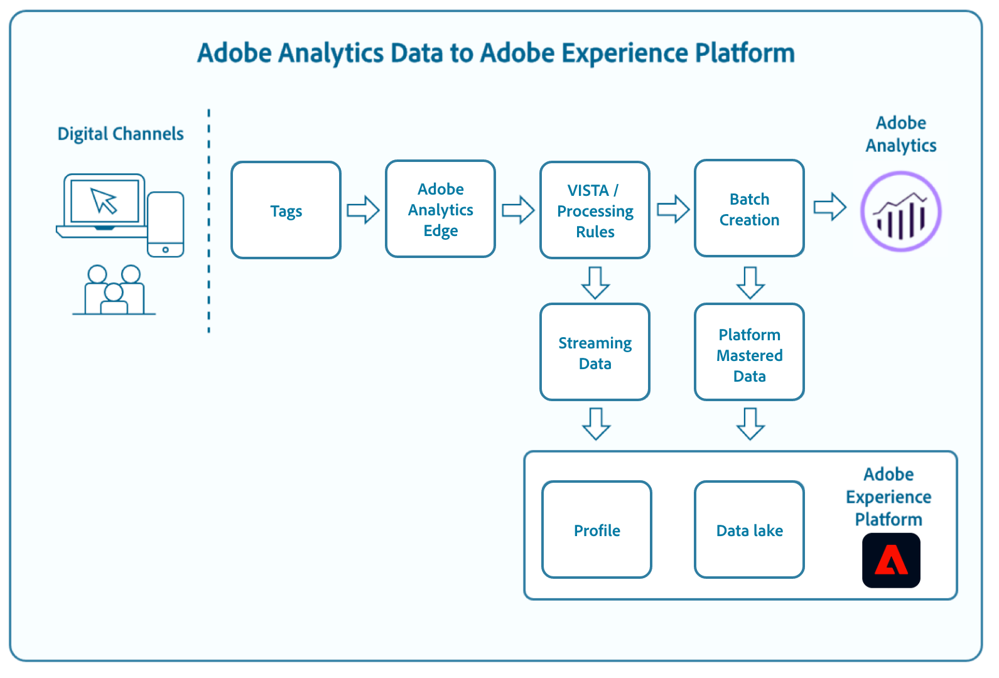

# レポートスイートデータ用Adobe Analyticsソースコネクタ

Adobe Experience Platformでは、Analyticsソースコネクタを使用してAdobe Analyticsデータを取り込むことができます。 [!DNL Analytics]ソースコネクタは、[!DNL Analytics]が収集したデータをリアルタイムでPlatformにストリーミングし、SCDS形式の[!DNL Analytics]データを[!DNL Experience Data Model] (XDM)フィールドに変換して、プラットフォームで使用します。

このドキュメントでは、[!DNL Analytics]の概要と[!DNL Analytics]データの使用例を説明します。

## Adobe Analytics と Analytics データ

[!DNL Analytics] は、顧客に関する詳細な情報、顧客がWebプロパティとどのようにやり取りするか、デジタルマーケティング投資が効果的かを確認し、改善の余地を特定するのに役立つ強力なエンジンです。[!DNL Analytics] 1年あたり数兆回のwebトランザクションを処理し、 [!DNL Analytics] ソースコネクタを使用すると、この豊富な動作データを簡単にタップして数分で拡張 [!DNL Real-time Customer Profile] できます。

[!DNL Analytics]は、高いレベルで、世界中の様々なデジタルチャネルや複数のデータセンターからデータを収集します。 データが収集されると、訪問者ID、セグメント化と変換のアーキテクチャ(VISTA)ルール、および処理ルールが適用され、入力データが形成されます。 生データがこの軽量処理を経た後、[!DNL Real-time Customer Profile]は消費の準備ができていると見なします。 前述と並行するプロセスでは、同じ処理済みデータがマイクロバッチ処理され、プラットフォームデータセットに取り込まれて[!DNL Data Science Workspace]、[!DNL Query Service]、および他のデータ検出アプリケーションで使用されます。

処理ルールの詳細については、[処理ルールの概要](https://docs.adobe.com/content/help/ja-JP/analytics/admin/admin-tools/processing-rules/processing-rules.html)を参照してください。

## エクスペリエンスデータモデル（XDM）

XDM は公に文書化された仕様で、 Experience Platform 上のサービスとの通信に使用するアプリケーションの共通の構造と定義を提供します。

XDM 標準規格に準拠することで、データを統一的に取り込むことができ、データの配信と情報の収集が容易になります。

XDM について詳しくは、「[XDM システムの概要](../../../xdm/home.md)」を参照してください。

## Adobe Analytics から XDM へのフィールドのマッピング方法

プラットフォームのユーザーインターフェイスを使用して[!DNL Analytics]データをExperience Platformに取り込むためのソース接続が確立されると、データフィールドは自動的にマッピングされ、数分以内に[!DNL Real-time Customer Profile]に取り込まれます。 プラットフォームUIを使用して[!DNL Analytics]とのソース接続を作成する手順については、[Analyticsソースコネクタのチュートリアル](../../tutorials/ui/create/adobe-applications/analytics.md)を参照してください。

[!DNL Analytics]とExperience Platformの間に発生するフィールドマッピングについて詳しくは、[Adobe Analyticsフィールドマッピング](./mapping/analytics.md)ガイドを参照してください。

## Platform の Analytics データで予想される遅延はどのくらいですか。

| Analytics データ | 予想される遅延 |
| -------------- | ---------------- |
| [!DNL Real-time Customer Profile]への新しいデータ（A4T ****&#x200B;が有効になっていません） | &lt; 2 分 |
| [!DNL Real-time Customer Profile]への新しいデータ（A4T **は**&#x200B;有効） | &lt; 15 分 |
| データレイクの新しいデータ | &lt; 90 分 |
| データのバックフィル（13 か月分のデータまたは 100 億イベントのデータのいずれか低い方） | &lt; 4 週間 |

>[!NOTE]
>
> 遅延は、顧客の構成、データ量、消費者のアプリケーションによって異なります。例えば、[!DNL Analytics]実装が`A4T`で設定されている場合、パイプラインへの待ち時間は5 ～ 10分に増えます。

## [!DNL Analytics]データのプライマリ識別子

[!DNL Analytics]ソースコネクタからのヒットにはすべて、ECIDとAIDのどちらが存在するかに応じたプライマリ識別子が含まれます。 ECIDがある場合、そのECIDを主識別子として指定します。 AIDがある場合、AIDはプライマリとして指定されます。
