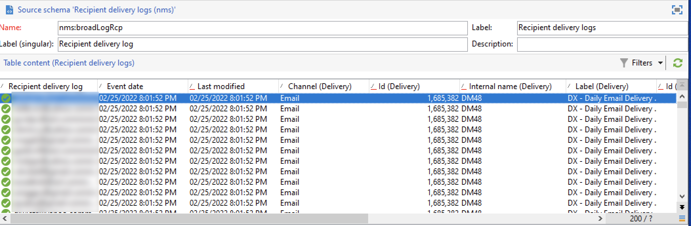

# Adobe Campaign Managed Cloud Services

Adobe Campaign Managed Cloud Servicesは、クロスチャネルのカスタマーエクスペリエンスを設計、視覚的なキャンペーンのオーケストレーション、リアルタイムのインタラクション管理、クロスチャネルの実行をサポートするマネージド基盤を提供します。 詳しくは、[Adobe Campaign v8 ドキュメント &#x200B;](https://experienceleague.adobe.com/docs/campaign/campaign-v8/campaign-home.html?lang=ja)を参照してください。

Adobe Campaign Managed Cloud Services ソースコネクタを使用すると、Adobe Campaign v8からAdobe Experience Platformに配信およびトラッキングログデータを取り込むことができます。 このコネクタは、Platform内のバッチソースとして動作します。

## 前提条件

Campaign v8をExperience Platformに取り込むためのソース接続を作成する前に、まず次の前提条件を満たす必要があります。

* [Adobe Campaign クライアントコンソールを使用したイベントログの読み込みの設定](#view-delivery-and-tracking-log-data)
* [XDM ExperienceEvent スキーマの作成](#create-a-schema)
* [データセットの作成](#create-a-dataset)

### 配信とトラッキングのログデータの表示 {#view-delivery-and-tracking-log-data}

>[!IMPORTANT]
>
>Campaignでログデータを表示するには、Adobe Campaign v8 クライアントコンソールにアクセスする必要があります。 クライアントコンソールのダウンロードとインストール方法については、[Campaign v8 ドキュメント &#x200B;](https://experienceleague.adobe.com/docs/campaign/campaign-v8/deploy/connect.html?lang=ja)を参照してください。

クライアントコンソールからCampaign v8 インスタンスにログインします。 「[!DNL Explorer]」タブで「[!DNL Administration]」を選択し、「[!DNL Configuration]」を選択します。 次に、[!DNL Data schemas]を選択し、名前またはラベルに`broadLog` フィルターを適用します。 表示されるリストで、名前`broadLogRcp`の受信者配信ログ ソーススキーマを選択します。

次に、「**データ**」タブを選択します。

データパネルで右クリックまたはキーを押して、コンテキストメニューを開きます。 ここから、**リストの設定…**&#x200B;を選択します

リスト設定ウィンドウが表示され、既存のリストに目的のフィールドを追加して、データパネルでデータを表示できるインターフェイスが表示されます。

これで、前の手順で追加した設定フィールドを含む、受信者の配信ログを表示できます。

>[!TIP]
>
>同じ手順を繰り返すことができますが、`tracking`をフィルタリングしてトラッキングログデータを表示します。

### スキーマの作成 {#create-a-schema}

次に、配信ログとトラッキングログの両方のXDM ExperienceEvent スキーマを作成します。 Campaign配信ログ フィールドグループを配信ログスキーマに適用し、Campaign トラッキングログ フィールドグループをトラッキングログスキーマに適用する必要があります。 また、`externalID` フィールドをスキーマのプライマリ IDとして定義する必要があります。

>[!NOTE]
>
>Campaign データを[!DNL Real-Time Customer Profile]に取り込むには、XDM ExperienceEvent スキーマをプロファイル対応にする必要があります。

スキーマの作成方法について詳しくは、[UIでのXDM スキーマの作成](../../../xdm/tutorials/create-schema-ui.md)に関するガイドを参照してください。

### データセットの作成 {#create-a-dataset}

最後に、スキーマのデータセットを作成する必要があります。 データセットの作成方法について詳しくは、[UIでのデータセットの作成](../../../catalog/datasets/user-guide.md)に関するガイドを参照してください。

## Adobe Campaign Managed Cloud Services ソースの予想待ち時間 {#latency}

通常、通常のデータボリュームとバックログがないと仮定すると、Campaign イベントからExperience Platformのデータ可用性までのエンドツーエンドの遅延は、通常は15 ～ 30分です（15分のレプリケーション、マイクロバッチエクスポート、スケジュールされたExperience Platform データフローを含む）。 これは、スケジュールされたマイクロバッチ同期（通常は数十分の順序）によって達成される、ほぼリアルタイムのプロセスですが、継続的なストリーミングではありません。

| シナリオ | 詳細 | 予想遅延時間 |
| --- | --- | --- |
| キャンペーンイベントは、ミッドソーシング/メッセージセンターインスタンスで生成されます | 配信または追跡イベント（送信、開く、クリックなど）は、Campaign v8実行（ミッド/メッセージセンター）ノードで発生します。 | Campaign ランタイム内のリアルタイム（現在、Experience Platformには表示されません）。 |
| ランタイムからCampaign マーケティングデータベースへのレプリケーション | イベントデータは、ミッド/メッセージセンターからCampaign マーケティングデータベース（[!DNL Snowflake]または[!DNL Postgres]、顧客サイズに応じて）にレプリケートされます。 標準の統合パターンは、通常のレプリケーションジョブを前提としています。 | 15分ほどで、標準的な15分のレプリケーションケイデンスに基づきます。 |
| Campaign マーケティングデータベースからランディングゾーンへの書き出し（[!DNL Data Landing Zone]、[!DNL Amazon S3]、[!DNL Azure Blob]など） | Campaignの書き出しワークフロー（書き出しサービス）は、スケジュール上で実行され、新しい/変更された配信ログとトラッキングログを抽出し、それらをマイクロバッチとしてファイルベースのランディングゾーンに書き込みます。 | 分、および書き出しスケジュール間隔を追加します。 |
| Experience Platform ソースデータフローは、書き出されたファイルを取得します | Adobe Campaign Managed Cloud Services ソースは、Experience Platform [!DNL Flow Service]でバッチデータフローとして設定されています。 ランディングゾーンを定期的にスキャンし、新しいファイルを取り込んで、設定されたExperienceEvent データセットに書き込みます。 監視では、「成功したバッチ」と「失敗したバッチ」が表示されます。 | 分、データフロースケジュール間隔を加えた値。 |
| データレイクおよびリアルタイムの顧客プロファイルで利用可能なデータ | バッチが取り込まれると、レコードがデータレイクに取り込まれ、（データセットがプロファイル対応の場合）リアルタイム顧客プロファイルに取り込まれます。 バッチおよびプロファイル取得用の標準的なExperience Platform SLAが適用されます。 | データフローと同じ実行ウィンドウ内（つまり、バッチ実行が完了した直後）。 レコードは通常、ダウンストリームサービスで数分で利用できるようになります。 |

{style="table-layout:auto"}

## Experience Platform UIを使用したAdobe Campaign Managed Cloud Services ソース接続の作成

これで、Campaign クライアントコンソールのデータログにアクセスし、スキーマとデータセットを作成したので、次にソース接続を作成してCampaign Managed Services データをExperience Platformに取り込むことができます。

Campaign v8配信ログとトラッキングログデータをExperience Platformに取り込む方法について詳しくは、[UIでのCampaign Managed Services ソース接続の作成](../../tutorials/ui/create/adobe-applications/campaign.md)に関するガイドを参照してください。

>[!IMPORTANT]
>
>最近削除されたメール受信者とメールとのやり取りが、Experience Platformに個人情報を再取り込む可能性があるエッジケースがあります。 これにより、そのユーザーに対するマーケティングが再度有効になる場合があります。
>
>* このシナリオは、Experience Platformでプライバシーリクエストが実行されてから、Adobe Campaign Classicでプライバシーリクエストが実行されるまでの間にのみアクティブになります。 Campaignでリクエストが実行された後、レコードがCampaignに書き出されないかどうかを確認するチェックが行われます。 実行後72時間後にGDPR リクエストを再発行して、これを解決してください。
