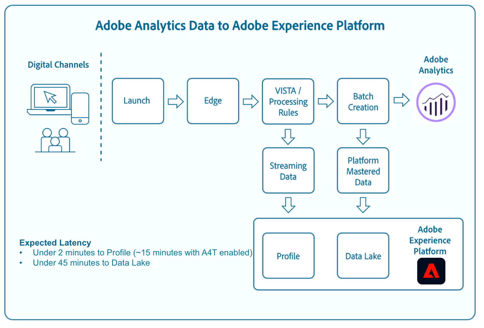

# Analytics フィールドのマッピング

Adobe Experience Platformでは、Analytics ソースを通じてAdobe Analytics データを取り込むことができます。 ADCを通じて取り込まれたデータの一部は、Analytics フィールドからExperience Data Model （XDM）フィールドに直接マッピングできますが、その他のデータには変換や特定の機能を正常にマッピングする必要があります。

## ストリーミングメディアパラメーター

ストリーミングメディアのパラメーターについて詳しくは、次の表を参照してください。

| データフィード | XDM フィールドパス | データタイプ | 説明 |
| --- | --- | --- | --- |
| `videoname` | `mediaReporting.sessionDetails.friendlyName` | 文字列 | ビデオのわかりやすい（人間が読み取れる）名前。 |
| `videoaudioauthor` | `mediaReporting.sessionDetails.author` | 文字列 | メディア作成者の名前。 |
| `videoaudioartist` | `mediaReporting.sessionDetails.artist` | 文字列 | ミュージックレコーディングまたはビデオを実行するアルバムアーティストまたはグループの名前。 |
| `videoaudioalbum` | `mediaReporting.sessionDetails.album` | 文字列 | ミュージックレコーディングまたはビデオが属するアルバムの名前。 |
| `videolength` | `mediaReporting.sessionDetails.length` | 整数 | ビデオの長さや実行時間。 |
| `videoshowtype` | `mediaReporting.sessionDetails.showType` | 文字列 |  |
| `video` | `mediaReporting.sessionDetails.name` | 文字列 | ビデオのID。 |
| `videoshow` | `mediaReporting.sessionDetails.show` | 文字列 | プログラムまたはシリーズの名前。 番組/シリーズ名は、番組がシリーズの一部である場合にのみ必要です。 |
| `videostreamtype` | mediaReporting.sessionDetails.streamType | 文字列 | 「ビデオ」や「オーディオ」などのストリーミングメディアの種類。 |
| `videoseason` | `mediaReporting.sessionDetails.season` | 文字列 | 番組が属するシーズン番号。 この値は、番組がシリーズの一部である場合にのみ必要です。 |
| `videoepisode` | `mediaReporting.sessionDetails.episode` | 文字列 | エピソードの番号。 |
| `videogenre` | `mediaReporting.sessionDetails.genreList[]` | 文字列[] | ビデオのジャンル。 |
| `videosessionid` | `mediaReporting.sessionDetails.ID` | 文字列 | 個々の再生に固有のコンテンツストリームのインスタンスの識別子。 |
| `videoplayername` | `mediaReporting.sessionDetails.playerName` | 文字列 | ビデオプレーヤーの名前。 |
| `videochannel` | `mediaReporting.sessionDetails.channel` | 文字列 | コンテンツが再生された場所からの配信チャネル。 |
| `videocontenttype` | `mediaReporting.sessionDetails.contentType` | 文字列 | コンテンツに使用されるストリーム配信のタイプ。 すべてのビデオビューでは、これは自動的に「ビデオ」に設定されます。 推奨される値には、VOD、ライブ、リニア、UGC、DVOD、ラジオ、ポッドキャスト、オーディオブック、ソングなどがあります。 |
| `videonetwork` | `mediaReporting.sessionDetails.network` | 文字列 | ネットワークまたはチャネル名。 |
| `videofeedtype` | `mediaReporting.sessionDetails.feed` | 文字列 | フィードのタイプ。これは、「East HD」や「SD」などの実際のフィード関連のデータ、またはURLなどのフィードのソースを表すことができます。 |
| `videosegment` | `mediaReporting.sessionDetails.segment` | 文字列 |  |
| `videostart` | `mediaReporting.sessionDetails.isViewed` | ブール値 | ビデオが開始されたかどうかを示すブール値。 これは、ユーザーが再生ボタンを選択すると発生し、プリロール広告、バッファリング、エラーなどが発生した場合でもカウントされます。 |
| `videoplay` | `mediaReporting.sessionDetails.isPlayed` | ブール値 | メディアの最初のフレームが開始されたかどうかを示すブール値。 ユーザーが広告またはバッファリング時間の間にドロップした場合、「コンテンツ開始」は適格ではありません。 |
| `videotime` | `mediaReporting.sessionDetails.timePlayed` | 整数 | メインコンテンツ上の`type=PLAY`のすべてのイベントの期間（秒単位）。 |
| `videocomplete` | `mediaReporting.sessionDetails.isCompleted` | ブール値 | タイムドメディアアセットが完了するまで監視されたかどうかを示すブール値。 この値は、ビューアがビデオ全体を視聴したことを必ずしも意味するものではありません。この値は、ビューアがスキップする可能性を考慮していません。 |
| `videototaltime` | `mediaReporting.sessionDetails.totalTimePlayed` | 整数 | 特定のタイムドメディアアセットにユーザーが費やした合計時間（広告の視聴時間を含む）。 |
| `videouniquetimeplayed` | `mediaReporting.sessionDetails.uniqueTimePlayed` | 整数 | タイムドメディアアセットでユーザーが確認したユニーク間隔の合計。 つまり、複数回再生された再生間隔の長さは1回のみカウントされます。 |
| `videoaverageminuteaudience` | `mediaReporting.sessionDetails.averageMinuteAudience` | 数値 | 特定のメディア項目に費やした平均コンテンツ時間。 つまり、すべての再生セッションで費やしたコンテンツの合計時間を長さで割ったものです。 |
| `videoprogress10` | `mediaReporting.sessionDetails.hasProgress10` | ブール値 | 指定されたビデオの再生ヘッドがビデオ全体の長さの10%のマーカーに合格したかどうかを示すブール値。 マーカーは、逆方向にシークしても 1 回だけカウントされます。早送りのシークがあった場合は、スキップされたマーカーはカウントされません。  |
| `videoprogress25` | `mediaReporting.sessionDetails.hasProgress25` | ブール値 | 指定されたビデオの再生ヘッドがビデオ全体の長さの25%のマーカーを通過したかどうかを示すブール値。 マーカーは、逆方向にシークしても 1 回だけカウントされます。早送りのシークがあった場合は、スキップされたマーカーはカウントされません。  |
| `videoprogress50` | `mediaReporting.sessionDetails.hasProgress50` | ブール値 | 指定されたビデオの再生ヘッドがビデオ全体の長さの50%のマーカーを通過したかどうかを示すブール値。 マーカーは、逆方向にシークしても 1 回だけカウントされます。早送りのシークがあった場合は、スキップされたマーカーはカウントされません。  |
| `videoprogress75` | `mediaReporting.sessionDetails.hasProgress75` | ブール値 | 指定されたビデオの再生ヘッドがビデオ全体の長さの75%のマーカーを通過したかどうかを示すブール値。 マーカーは、逆方向にシークしても 1 回だけカウントされます。早送りのシークがあった場合は、スキップされたマーカーはカウントされません。  |
| `videoprogress95` | `mediaReporting.sessionDetails.hasProgress95` | ブール値 | 指定されたビデオの再生ヘッドがビデオ全体の長さの95%のマーカーに合格したかどうかを示すブール値。 マーカーは、逆方向にシークしても 1 回だけカウントされます。早送りのシークがあった場合は、スキップされたマーカーはカウントされません。  |
| `videopause` | `mediaReporting.sessionDetails.hasPauseImpactedStreams` | ブール値 | 単一のメディアアイテムの再生中に1つ以上の一時停止が発生したかどうかを示すブール値。 |
| `videopausecount` | `mediaReporting.sessionDetails.pauseCount` | 整数 | 再生中に発生した一時停止期間の数。 |
| `videopausetime` | `mediaReporting.sessionDetails.pauseTime` | 整数 | ユーザーが再生を一時停止した合計時間（秒単位）です。 |
| `videomvpd` | `mediaReporting.sessionDetails.mvpd` | 文字列 | Adobe認証を介して提供されるMVPD ID。 |
| `videoauthorized` | `mediaReporting.sessionDetails.authorized` | 文字列 | ユーザーがAdobe認証を介して承認されていることを定義します。 |
| `videodaypart` | `mediaReporting.sessionDetails.dayPart` | コンテンツがブロードキャストまたは再生された日の時刻を定義します。 |  |
| `videoresume` | `mediaReporting.sessionDetails.hasResume` | ブール値 | バッファー、一時停止、またはストール期間が30分以上経過した後に再開された各再生をマークするブール値。 |
| `videosegmentviews` | `mediaReporting.sessionDetails.hasSegmentView` | ブール値 | 少なくとも1つのフレームが表示されていることを示すブール値。 このフレームは最初のフレームである必要はありません。 |
| `videoaudiolabel` | `mediaReporting.sessionDetails.label` | 文字列 | レコードラベルの名前。 |
| `videoaudiostation` | `mediaReporting.sessionDetails.station` | 文字列 | オーディオが再生されるラジオ局または名前。 |
| `videoaudiopublisher` | `mediaReporting.sessionDetails.publisher` | 文字列 | オーディオコンテンツパブリッシャーの名前。 |
| `videosecondssincelastcall` | `mediaReporting.sessionDetails.secondsSinceLastCall` | 数値 | ユーザーの最後の既知のインタラクションからセッションが閉じられるまでの間に経過した時間（秒単位）を示します。 |
| `videoadload` | `mediaReporting.sessionDetails.adLoad` | 文字列 | 独自の内部表現で定義された広告のタイプ。 |

{style="table-layout:auto"}

## Advertising パラメーター

広告パラメーターについて詳しくは、次の表を参照してください。

| データフィード | XDM フィールドパス | データタイプ | 説明 |
| --- | --- | --- | --- |
| `videoad` | `mediaReporting.advertisingDetails.name` | 文字列 | 広告の名前。 レポートでは、「Ad Name」は分類であり、「Ad Name （variable）」はeVarです。 |
| `videoadinpod` | `mediaReporting.advertisingDetails.podPosition` | 整数 | 親広告内の広告のインデックスが開始します。 例えば、最初の広告のインデックスは0で、2番目の広告のインデックスは1です。 |
| `videoadlength` | `mediaReporting.advertisingDetails.length` | 整数 | 動画広告の長さ（秒単位）。 |
| `videoadplayername` | `mediaReporting.advertisingDetails.playerName` | 文字列 | 広告のレンダリングに使用するプレーヤーの名前。 |
| `videoadpod` | `mediaReporting.advertisingPodDetails.ID` | 文字列 | 広告枠のID。 |
| `videoadname` | `mediaReporting.advertisingDetails.friendlyName` | 文字列 | 広告ブレークのわかりやすい（人間が読み取れる）名前。 |
| `videoadadvertiser` | `mediaReporting.advertisingDetails.advertiser` | 文字列 | 広告で商品が取り上げられる企業やブランド。 |
| `videoadcampaign` | `mediaReporting.advertisingDetails.campaignID` | 文字列 | 広告キャンペーンのID。 |
| `videoadstart` | `mediaReporting.advertisingDetails.isStarted` | ブール値 | 広告が開始されたかどうかを示すブール値。 |
| `videoadcomplete` | `mediaReporting.advertisingDetails.isCompleted` | ブール値 | が完了したかどうかを示すブール値。 |
| `videoadtime` | `mediaReporting.advertisingDetails.timePlayed` | 整数 | 広告の視聴にかかった合計時間（秒単位）。 |

{style="table-layout:auto"}

## 章パラメーター

章パラメーターについて詳しくは、次の表を参照してください。

| データフィード | XDM フィールドパス | データタイプ | 説明 |
| --- | --- | --- | --- |
| `videochapter` | `mediaReporting.chapterDetails.ID` | 文字列 | 章の自動生成されたID。 |
| `videochapterstart` | `mediaReporting.chapterDetails.isStarted` | ブール値 | 章が開始されたかどうかを示すブール値。 |
| `videochaptercomplete` | `mediaReporting.chapterDetails.isCompleted` | ブール値 | 章が完了したかどうかを示すブール値。 |
| `videochaptertime` | `mediaReporting.chapterDetails.timePlayed` | 整数 | 章に費やした時間（秒単位）です。 |

{style="table-layout:auto"}

## プレーヤーの状態パラメーター

プレーヤーの状態パラメーターについて詳しくは、次の表を参照してください。

| データフィード | XDM フィールドパス | データタイプ | 説明 |
| --- | --- | --- | --- |
| `videostatefullscreen` | `mediaReporting.states[].isSet` | ブール値 | ビデオの状態がフルスクリーンに設定されているかどうかを示すブール値。 |
| `videostatefullscreencount` | `mediaReporting.states[].count` | 整数 | ビデオ状態がフルスクリーンに設定された回数。 |
| `videostatefullscreentime` | `mediaReporting.states[].time` | 整数 | ビデオの状態が全画面に設定された合計時間です。 |
| `videostateclosedcaptioning` | `mediaReporting.states[].isSet` | ブール値 | クローズドキャプションが有効かどうかを示すブール値。 |
| `videostateclosedcaptioningcount` | `mediaReporting.states[].count` | 整数 | クローズドキャプションが有効になった回数。 |
| `videostateclosedcaptioningtime` | `mediaReporting.states[].time` | 整数 | クローズドキャプションが有効になったときの合計期間。 |
| `videostatemute` | `mediaReporting.states[].isSet` | ブール値 | ビデオの状態がミュートに設定されているかどうかを示すブール値。 |
| `videostatemutecount` | `mediaReporting.states[].count` | 整数 | ビデオがミュートされた回数 |
| `videostatemutetime` | `mediaReporting.states[].time` | 整数 | ミュート内のビデオの合計デュレーション。 |
| `videostatepictureinpicture` | `mediaReporting.states[].isSet` | ブール値 | ピクチャーインピクチャーモードが有効かどうかを示すブール値。 |
| `videostatepictureinpicturecount` | `mediaReporting.states[].count` | 整数 | ピクチャーインピクチャーモードが有効になっている回数。 |
| `videostatepictureinpicturetime` | `mediaReporting.states[].time` | 整数 | ピクチャーインピクチャーモードが有効なときの合計時間です。 |
| `videostateinfocus` | `mediaReporting.states[].isSet` | ブール値 | フォーカスモードが有効かどうかを示すブール値 |
| `videostateinfocuscount` | `mediaReporting.states[].count` | 整数 | インピクチャモードが有効になった回数。 |
| `videostateinfocustime` | `mediaReporting.states[].time` | 整数 | インフォーカスモードが有効なときの合計時間です。 |

{style="table-layout:auto"}

## 品質パラメーター

品質パラメーターについて詳しくは、次の表を参照してください。

| データフィード | XDM フィールドパス | データタイプ | 説明 |
| --- | --- | --- | --- |
| `videoqoebitrateaverage` | `mediaReporting.qoeDataDetails.bitrateAverage` | 数値 | 平均ビットレート（kbps、整数）。 この指標は、再生セッション中に発生した再生時間に関連するすべてのビットレート値の加重平均として計算されます。 |
| `videoqoebitratechange` | `mediaReporting.qoeDataDetails.hasBitrateChangeImpactedStreams` | ブール値 | ビットレートの変更が発生したストリームの数を示すブール値。 この指標は、再生セッション中に少なくとも1つのビットレート変更イベントが発生した場合にのみtrueに設定されます。 |
| `videoqoebitratechangecountevar` | `mediaReporting.qoeDataDetails.bitrateChangeCount` | 整数 |  |
| `videoqoebitrateaverageevar` | `mediaReporting.qoeDataDetails.bitrateAverageBucket` | 文字列 | ビットレートの変更数。 この値は、再生セッション中に発生したすべてのビットレート変更イベントの合計として計算されます。 |
| `videoqoetimetostartevar` | `mediaReporting.qoeDataDetails.timeToStart` | 整数 | ビデオの読み込みとビデオの開始の間に通過した時間（秒単位）です。 |
| `videoqoedroppedframes` | `mediaReporting.qoeDataDetails.hasDroppedFrameImpactedStreams` | ブール値 | フレームがドロップされたストリームの数を示すブール値。 この指標は、再生セッション中に少なくとも1つのフレームがドロップされた場合にのみtrueに設定されます。 |
| `videoqoedroppedframecountevar` | `mediaReporting.qoeDataDetails.droppedFrames` | 整数 | メインコンテンツの再生中にドロップしたフレームの数。 |
| `videoqoebuffercountevar` | `mediaReporting.qoeDataDetails.bufferCount` | 整数 | バッファーイベントの数。 この指標は、再生セッション中に発生したさまざまなバッファー状態のカウントとして計算されます。 これは、プレーヤーが他の状態（再生や一時停止など）からバッファー状態に入った回数のカウントです。 |
| `videoqoebuffertimeevar` | `mediaReporting.qoeDataDetails.bufferTime` | 整数 | バッファリングに費やされた合計時間（秒単位）です。 この値は、再生セッション中に発生したすべてのバッファーイベント期間の合計として計算されます。 |
| `videoqoebuffer` | `mediaReporting.qoeDataDetails.hasBufferImpactedStreams` | ブール値 | バッファリングによって影響を受けるストリームの数を示すブール値。 この指標は、再生セッション中に少なくとも1つのバッファーイベントが発生した場合にのみtrueに設定されます。 |
| `videoqoeerror` | `mediaReporting.qoeDataDetails.hasErrorImpactedStreams` | ブール値 | エラーイベントが発生したストリームの数を示すブール値。 例えば、再生セッション中にtrackErrorが呼び出され、type=error ハートビート呼び出しが生成された場合です。 この指標は、再生中に少なくとも1つのエラーが発生した場合にのみtrueに設定されます。 |
| `videoerrorcountevar` | `mediaReporting.qoeDataDetails.errorCount` | 整数 | 発生したエラーの数。 この値は、再生セッション中に発生したすべてのエラーイベントの合計として計算されます。 |
| `videoqoeplayersdkerrors` | `mediaReporting.qoeDataDetails.playerSdkErrors` | 文字列の配列 | プレイヤーSDKによって生成された一意のエラーID。 提供されたエラーAPIを使用して、実装時にエラーコードまたはIDを指定する必要があります。 |
| `videoqoeextneralerrors` | `mediaReporting.qoeDataDetails.externalErrors` | 文字列の配列 | CDN エラーなどの外部ソースからの一意のエラーID。 提供されたエラーAPIを使用して、実装時にエラーコードまたはIDを指定する必要があります。 |
| `videoqoedropbeforestart` | `mediaReporting.qoeDataDetails.isDroppedBeforeStart` | ブール値 | 再生中にMedia SDKによって生成される一意のエラーID。 |

{style="table-layout:auto"}

## 非推奨のフィールド

非推奨のAnalytics マッピングフィールドについて詳しくは、この節を参照してください。

### 直接マッピングフィールド

+++非推奨のダイレクトマッピングフィールドのテーブルを表示する場合に選択

| データフィード | XDM フィールド | XDM タイプ | 説明 |
| --- | --- | --- | --- |
| `m_evar1` `[...]` `m_evar250` | `_experience.analytics.customDimensions.` `eVars.eVar1` `[...]` `_experience.analytics.customDimensions.` `eVars.eVar250` | 文字列 | カスタム分析eVar: 企業によってeVarの使い方は異なります。 |
| `m_prop1` `[...]` `m_prop75` | `_experience.analytics.customDimensions.` `props.prop1` `[...]` `_experience.analytics.customDimensions.` `props.prop75` | 文字列 | カスタム分析prop: propの使い方は組織によって異なります。 |
| `m_browser` | `_experience.analytics.environment.` `browserID` | 整数 | ブラウザーの番号 ID。 |
| `m_browser_height` | `environment.browserDetails.viewportHeight` | 整数 | ブラウザーの高さ（ピクセル単位）。 |
| `m_browser_width` | `environment.browserDetails.viewportWidth` | 整数 | ブラウザーの幅（ピクセル単位）。 |
| `m_campaign` | `marketing.trackingCode` | 文字列 | トラッキングコードディメンションで使用される変数。 |
| `m_channel` | `web.webPageDetails.siteSection` | 文字列 | 「サイトセクション」ディメンションで使用される変数。 |
| `m_domain` | `environment.domain` | 文字列 | 「ドメイン」ディメンションで使用される変数。これは、ユーザーのインターネットサービスプロバイダー（ISP）に基づいています。 |
| `m_geo_city` | `placeContext.geo.city` | 文字列 | ヒットの市区町村の名前。これは、ヒットのIP アドレスに基づいています。 |
| `m_geo_dma` | `placeContext.geo.dmaID` | 整数 | ヒットの人口統計領域の数値 ID。これは、ヒットのIP アドレスに基づいています。 |
| `m_geo_region` | `placeContext.geo.stateProvince` | 文字列 | ヒットの都道府県または地域の名前。これは、ヒットのIP アドレスに基づいています。 |
| `m_geo_zip` | `placeContext.geo.postalCode` | 文字列 | ヒットの郵便番号。これは、ヒットのIP アドレスに基づいています。 |
| `m_keywords` | `search.keywords` | 文字列 | 「キーワード」ディメンションで使用される変数。 |
| `m_os` | `_experience.analytics.environment.` `operatingSystemID` | 整数 | 訪問者のオペレーティングシステムを表す数値 ID。user_agent 列に基づきます。 |
| `m_page_url` | `web.webPageDetails.URL` | 文字列 | ページヒットの URL。 |
| `m_pagename` | `web.webPageDetails.pageViews.value` | 文字列 | ページ名を持つヒット数に1と等しい。 これは、Adobe Analyticsのページビュー指標と同様です。 |
| `m_referrer` | `web.webReferrer.URL` | 文字列 | 前のページのページ URL。 |
| `m_search_page_num` | `search.pageDepth` | 整数 | 「すべての検索ページのランク」ディメンションで使用されます。ユーザーがクリックスルーしてサイトに到達する前にサイトが表示された検索結果ページを示します。 |
| `m_state` | `_experience.analytics.customDimensions.` `stateProvince` | 文字列 | 状態変数。 |
| `m_user_server` | `web.webPageDetails.server` | 文字列 | 「サーバー」ディメンションで使用される変数。 |
| `m_zip` | `_experience.analytics.customDimensions.` `postalCode` | 文字列 | 「郵便番号」ディメンションの生成に使用される変数。 |
| `accept_language` | `environment.browserDetails.acceptLanguage` | 文字列 | Accept-Language HTTP ヘッダーで指定されている受け入れ可能なすべての言語のリスト。 |
| `homepage` | `web.webPageDetails.isHomePage` | ブール値 | 使用されなくなりました。 現在の URL がブラウザーのホームページかどうかを示します。 |
| `ipv6` | `environment.ipV6` | 文字列 |  |
| `j_jscript` | `environment.browserDetails.javaScriptVersion` | 文字列 | ブラウザーでサポートされているJavaScriptのバージョン。 |
| `user_agent` | `environment.browserDetails.userAgent` | 文字列 | HTTP ヘッダーで送信されるユーザーエージェント文字列。 |
| `mobileappid` | `application.name` | 文字列 | モバイルアプリ ID。次の形式で保存されます。`[AppName][BundleVersion]` |
| `mobiledevice` | `device.model` | 文字列 | モバイルデバイスの名前。iOS の場合は、コンマ区切りの 2 桁の文字列として格納されます。最初の数字はデバイスの世代を表し、2 番目の数字はデバイスファミリーを表します。 |
| `pointofinterest` | `placeContext.POIinteraction.POIDetail.` `name` | 文字列 | モバイルサービスで使用されます。目標地点を表します。 |
| `pointofinterestdistance` | `placeContext.POIinteraction.POIDetail.` `geoInteractionDetails.distanceToCenter` | 数値 | モバイルサービスで使用されます。目標地点の距離を表します。 |
| `mobileplaceaccuracy` | `placeContext.POIinteraction.POIDetail.` `geoInteractionDetails.deviceGeoAccuracy` | 数値 | コンテキストデータ変数a.loc.accから収集されます。 収集時のGPSの精度をメーター単位で示します。 |
| `mobileplacecategory` | `placeContext.POIinteraction.POIDetail.` `category` | 文字列 | コンテキストデータ変数a.loc.categoryから収集されます。 特定の場所のカテゴリを記述します。 |
| `mobileplaceid` | `placeContext.POIinteraction.POIDetail.` `POIID` | 文字列 | コンテキストデータ変数 a.loc.id から収集します。特定の対象地点の識別子。 |
| `videoadpod` | `advertising.adAssetViewDetails.adBreak._id` | 文字列 | |
| `mobilebeaconmajor` | `placeContext.POIinteraction.POIDetail.` `beaconInteractionDetails.beaconMajor` | 数値 | Mobile Services ビーコンのメジャー番号。 |
| `mobilebeaconminor` | `placeContext.POIinteraction.POIDetail.` `beaconInteractionDetails.beaconMinor` | 数値 | Mobile Services ビーコンのマイナー番号。 |
| `mobilebeaconuuid` | `placeContext.POIinteraction.POIDetail.` `beaconInteractionDetails.proximityUUID` | 文字列 | Mobile Services ビーコンの UUID。 |
| `mobileinstalls` | `application.firstLaunches` | オブジェクト | これは、インストールまたは再インストール `{id (string), value (number)}`後の初回実行時にトリガーされます |
| `mobileupgrades` | `application.upgrades` | オブジェクト | アプリのアップグレード番号を報告します。アップグレード後の初回実行時またはバージョン番号が変更されるたびにトリガーが発生します。`{id (string), value (number)}` |
| `mobilelaunches` | `application.launches` | オブジェクト | アプリの起動回数。 `{id (string), value (number)}` |
| `mobilecrashes` | `application.crashes` | オブジェクト | `{id (string), value (number)}` |
| `mobilemessageclicks` | `directMarketing.clicks` | オブジェクト | `{id (string), value (number)}` |
| `mobileplaceentry` | `placeContext.POIinteraction.poiEntries` | オブジェクト | `{id (string), value (number)}` |
| `mobileplaceexit` | `placeContext.POIinteraction.poiExits` | オブジェクト | `{id (string), value (number)}` |
| `videoqoetimetostart` | `media.mediaTimed.primaryAssetViewDetails.` `qoe.timeToStart` | オブジェクト | ビデオ画質の開始時間。`{id (string), value (number)}` |
| `videoqoedropbeforestart` | `media.mediaTimed.dropBeforeStarts` | オブジェクト | `{id (string), value (number)}` |
| `videoqoebuffercount` | `media.mediaTimed.primaryAssetViewDetails.` `qoe.buffers` | オブジェクト | ビデオ品質バッファー数`{id (string), value (number)}` |
| `videoqoebuffertime` | `media.mediaTimed.primaryAssetViewDetails.` `qoe.bufferTime` | オブジェクト | ビデオ品質のバッファー時間`{id (string), value (number)}` |
| `videoqoebitratechangecount` | `media.mediaTimed.primaryAssetViewDetails.` `qoe.bitrateChanges` | オブジェクト | ビデオの品質変更カウント `{id (string), value (number)}` |
| `videoqoebitrateaverage` | `media.mediaTimed.primaryAssetViewDetails.` `qoe.bitrateAverage` | オブジェクト | ビデオ品質の平均ビット レート `{id (string), value (number)}` |
| `videoqoeerrorcount` | `media.mediaTimed.primaryAssetViewDetails.` `qoe.errors` | オブジェクト | ビデオ品質エラー数`{id (string), value (number)}` |
| `videoqoedroppedframecount` | `media.mediaTimed.primaryAssetViewDetails.` `qoe.droppedFrames` | オブジェクト | `{id (string), value (number)}` |

{style="table-layout:auto"}

+++

## 生成されたマッピングフィールド

ADCから取得したSelect フィールドは変換する必要があり、XDMで生成するには、Adobe Analyticsからの直接コピーを超えるロジックが必要です。

+++非推奨の生成マッピングフィールドのテーブルを表示するには、を選択します

| データフィード | XDM フィールド | XDM タイプ | 説明 |
| --- | --- | --- | --- |
| `m_prop1` `[...]` `m_prop75` | `_experience.analytics.customDimensions` `.listprops.prop1` `[...]` `_experience.analytics.customDimensions.` `listprops.prop75` | オブジェクト | リスト propに設定されたカスタム Analytics prop。 区切られた値のリストが含まれます。`{}` |
| `m_hier1` `[...]` `m_hier5` | `_experience.analytics.customDimensions.` `hierarchies.hier1` `[...]` `_experience.analytics.customDimensions.` `hierarchies.hier5` | オブジェクト | 階層変数で使用されます。区切られた値のリストが含まれます。`{values (array), delimiter (string)}` |
| `m_mvvar1` `[...]` `m_mvvar3` | `_experience.analytics.customDimensions.` `lists.list1.list[]` `[...]` `_experience.analytics.customDimensions.` `lists.list3.list[]` | 配列 | カスタム分析リスト変数： 値の区切りリストが含まれます。 `{value (string), key (string)}` |
| `m_color` | `device.colorDepth` | 整数 | c_color列の値に基づく色深度ID。 |
| `m_cookies` | `environment.browserDetails.cookiesEnabled` | ブール値 | Cookie サポートディメンションで使用される変数。 |
| `m_event_list` | `commerce.purchases`, `commerce.productViews`, `commerce.productListOpens`, `commerce.checkouts`, `commerce.productListAdds`, `commerce.productListRemovals`, `commerce.productListViews` | オブジェクト | ヒット時にトリガーされる標準コマースイベント。`{id (string), value (number)}` |
| `m_event_list` | `_experience.analytics.event1to100.event1` `[...]` `_experience.analytics.event901to1000.event1000` | オブジェクト | ヒット時にトリガーされるカスタムイベント。`{id (Object), value (Object)}` |
| `m_geo_country` | `placeContext.geo.countryCode` | 文字列 | ヒットが発生した国の略語。IPに基づいています。 |
| `m_geo_latitude` | `placeContext.geo._schema.latitude` | 数値 | |
| `m_geo_longitude` | `placeContext.geo._schema.longitude` | 数値 | |
| `m_java_enabled` | `environment.browserDetails.javaEnabled` | ブール値 | Java™が有効かどうかを示すフラグ。 |
| `m_latitude` | `placeContext.geo._schema.latitude` | 数値 | |
| `m_longitude` | `placeContext.geo._schema.longitude` | 数値 | |
| `m_page_event_var1` | `web.webInteraction.URL` | 文字列 | リンクトラッキングイメージリクエストでのみ使用される変数。この変数には、クリックされたダウンロードリンク、離脱リンク、またはカスタムリンクの URL が含まれます。 |
| `m_page_event_var2` | `web.webInteraction.name` | 文字列 | リンクトラッキングイメージリクエストでのみ使用される変数。このリストは、リンクのカスタム名をリスト表示します（指定されている場合）。 |
| `m_page_type` | `web.webPageDetails.isErrorPage` | ブール値 | 「ページが見つかりません」ディメンションの入力に使用される変数。この変数は、空にするか、「ErrorPage」を含む必要があります。 |
| `m_pagename_no_url` | `web.webPageDetails.name` | 数値 | ページの名前（設定されている場合）。ページが指定されていない場合、この値は空のままになります。 |
| `m_paid_search` | `search.isPaid` | ブール値 | ヒットが有料検索の検出に一致した場合に設定されるフラグ。 |
| `m_product_list` | `productListItems[].items` | 配列 | products変数を通じて渡される製品リスト。`{SKU (string), quantity (integer), priceTotal (number)}` |
| `m_ref_type` | `web.webReferrer.type` | 文字列 | ヒットのリファラルのタイプを表す数値 ID。 `1`: サイト内 `2`：その他のweb サイト  `3`：検索エンジン  `4`: ハードドライブ  `5`: USENET `6`：入力/ブックマーク済み（リファラーなし）  `7`: email `8`:JavaScriptなし `9`: Social Networks |
| `m_search_engine` | `search.searchEngine` | 文字列 | サイトに訪問者を誘導した検索エンジンを表す数値 ID。 |
| `post_currency` | `commerce.order.currencyCode` | 文字列 | トランザクションで使用された通貨のコード。 |
| `post_cust_hit_time_gmt` | `timestamp` | 文字列 | タイムスタンプが有効なデータセットでのみ使用されます。これは、UNIX®時間に基づいて、ヒットとともに送信されるタイムスタンプです。 |
| `post_cust_visid` | `identityMap` | オブジェクト | 顧客訪問者 ID。 |
| `post_cust_visid` | `endUserIDs._experience.aacustomid.primary` | ブール値 | 顧客訪問者 ID。 |
| `post_cust_visid` | `endUserIDs._experience.aacustomid.namespace.code` | 文字列 | 顧客訪問者 ID。 |
| `post_visid_high` + `visid_low` | `identityMap` | オブジェクト | 訪問の一意の ID。 |
| `post_visid_high` + `visid_low` | `endUserIDs._experience.aaid.id` | 文字列 | 訪問の一意の ID。 |
| `post_visid_high` | `endUserIDs._experience.aaid.primary` | ブール値 | `visid_low`で使用して、訪問を一意に識別します。 |
| `post_visid_high` | `endUserIDs._experience.aaid.namespace.code` | 文字列 | `visid_low`で使用して、訪問を一意に識別します。 |
| `post_visid_low` | `identityMap` | オブジェクト | 訪問を一意に識別するためにvisid_highと共に使用します。 |
| `hit_time_gmt` | `receivedTimestamp` | 文字列 | UNIX®時間に基づくヒットのタイムスタンプ。 |
| `hitid_high` + `hitid_low` | `_id` | 文字列 | ヒットを識別する一意の ID。 |
| `hitid_low` | `_id` | 文字列 | ヒットを一意に識別するためにhitid_highと共に使用します。 |
| `ip` | `environment.ipV4` | 文字列 | イメージリクエストの HTTP ヘッダーに基づく IP アドレス。 |
| `j_jscript` | `environment.browserDetails.javaScriptEnabled` | ブール値 | 使用する JavaScript のバージョン。 |
| `mcvisid_high` + `mcvisid_low` | identityMap | オブジェクト | Experience Cloud 訪問者 ID。 |
| `mcvisid_high` + `mcvisid_low` | endUserIDs._experience.mcid.id | 文字列 | Experience Cloud ID （ECID）はMCIDとも呼ばれ、ネームスペースで使用されることがあります。 |
| `mcvisid_high` | `endUserIDs._experience.mcid.primary` | ブール値 | Experience Cloud ID （ECID）はMCIDとも呼ばれ、ネームスペースで使用されることがあります。 |
| `mcvisid_high` | `endUserIDs._experience.mcid.namespace.code` | 文字列 | Experience Cloud ID （ECID）はMCIDとも呼ばれ、ネームスペースで使用されることがあります。 |
| `mcvisid_low` | `identityMap` | オブジェクト | Experience Cloud 訪問者 ID。 |
| `sdid_high` + `sdid_low` | `_experience.target.supplementalDataID` | 文字列 | ヒットステッチ ID。解析フィールド sdid_high と sdid_low は、2 つ以上の受信ヒットを結合するために使用される補足的なデータ ID です。 |
| `mobilebeaconproximity` | `placeContext.POIinteraction.POIDetail.` `beaconInteractionDetails.proximity` | 文字列 | Mobile Services ビーコンの近接性. |

{style="table-layout:auto"}

+++

## フィールドの分割マッピング

これらのフィールドには 1 つのソースがありますが、**複数の** XDM の場所にマッピングされます。

+++非推奨の分割マッピングフィールドのテーブルを表示するには、を選択します

| データフィード | XDM フィールド | XDM タイプ | 説明 |
| --- | --- | --- | --- |
| `s_resolution` | `device.screenWidth`、 `device.screenHeight` | 整数 | モニターの解像度を表す数値 ID。 |
| `mobileosversion` | `environment.operatingSystem`、 `environment.operatingSystemVersion` | 文字列 | モバイルオペレーティングシステムのバージョン。 |

{style="table-layout:auto"}

+++

## 高度なマッピングフィールド

フィールドを選択（ポスト値と呼ばれます）すると、Adobeが処理ルール、VISTA ルール、ルックアップテーブルを使用して値を調整した後にデータが含まれます。 ほとんどのpost値には、事前処理された対応する値があります。

Analytics ソースコネクタは、事前処理済みのデータをExperience Platformのデータセットに送信します。 変換を使用して、このデータを後処理されたデータに変換できます。 Query Serviceを使用してこれらの変換を実行する方法について詳しくは、『 Query Service ユーザーガイド』の「[Adobe定義の関数](/help/query-service/sql/adobe-defined-functions.md)」を参照してください。

Query Serviceを使用してこれらの変換を実行する方法について詳しくは、『 Query Service ユーザーガイド』の「[Adobe定義の関数](/help/query-service/sql/adobe-defined-functions.md)」を参照してください。

+++非推奨の高度なマッピングフィールドのテーブルを表示するには、を選択します

| データフィード | XDM フィールド | XDM タイプ | 説明 |
| --- | --- | --- | --- |
| `post_evar1` `[...]` `post_evar250` | `_experience.analytics.customDimensions.` `eVars.eVar1` `[...]` `_experience.analytics.customDimensions.` `eVars.eVar250` | 文字列 | カスタム分析eVar: 企業によってeVarの使い方は異なります。 |
| `post_prop1` `[...]` `post_prop75` | `_experience.analytics.customDimensions.` `props.prop1` `[...]` `_experience.analytics.customDimensions.` `props.prop75` | 文字列 | カスタム分析prop: propの使い方は組織によって異なります。 |
| `post_browser_height` | `environment.browserDetails.viewportHeight` | 整数 | ブラウザーの高さ（ピクセル単位）。 |
| `post_browser_width` | `environment.browserDetails.viewportWidth` | 整数 | ブラウザーの幅（ピクセル単位）。 |
| `post_campaign` | `marketing.trackingCode` | 文字列 | トラッキングコードディメンションで使用される変数。 |
| `post_channel` | `web.webPageDetails.siteSection` | 文字列 | 「サイトセクション」ディメンションで使用される変数。 |
| `post_cust_visid` | `endUserIDs._experience.aacustomid.id` | 文字列 | カスタム訪問者 ID（設定されている場合）。 |
| `post_first_hit_page_url` | `_experience.analytics.endUser.` `firstWeb.webPageDetails.URL` | 文字列 | 訪問者が最初に到達するページの URL。 |
| `post_first_hit_pagename` | `_experience.analytics.endUser.` `firstWeb.webPageDetails.name` | 文字列 | 「オリジナルの入口ページ」ディメンションで使用される変数。訪問者の入口ページのページ名。 |
| `post_keywords` | `search.keywords` | 文字列 | ヒット用に収集されたキーワード。 |
| `post_page_url` | `web.webPageDetails.URL` | 文字列 | ページヒットの URL。 |
| `post_pagename` | `web.webPageDetails.pageViews.value` | 文字列 | ページ名を持つヒット数に1と等しい。 これは、Adobe Analyticsのページビュー指標と同様です。 |
| `post_purchaseid` | `commerce.order.purchaseID` | 文字列 | 購入を一意に識別するために使用される変数。 |
| `post_referrer` | `web.webReferrer.URL` | 文字列 | 前のページの URL。 |
| `post_state` | `_experience.analytics.customDimensions.` `stateProvince` | 文字列 | 状態変数。 |
| `post_user_server` | `web.webPageDetails.server` | 文字列 | 「サーバー」ディメンションで使用される変数。 |
| `post_zip` | `_experience.analytics.customDimensions.` `postalCode` | 文字列 | 「郵便番号」ディメンションの生成に使用される変数。 |
| `browser` | `_experience.analytics.environment.` `browserID` | 整数 | ブラウザーの数値 ID。 |
| `domain` | `environment.domain` | 文字列 | 「ドメイン」ディメンションで使用される変数。これは、ユーザーのインターネットサービスプロバイダー（ISP）に基づいています。 |
| `first_hit_referrer` | `_experience.analytics.endUser.` `firstWeb.webReferrer.URL` | 文字列 | 訪問者の最初の参照 URL。 |
| `geo_city` | `placeContext.geo.city` | 文字列 | ヒットの市区町村の名前。これは、ヒットのIP アドレスに基づいています。 |
| `geo_dma` | `placeContext.geo.dmaID` | 整数 | ヒットの人口統計領域の数値 ID。これは、ヒットのIP アドレスに基づいています。 |
| `geo_region` | `placeContext.geo.stateProvince` | 文字列 | ヒットの都道府県または地域の名前。これは、ヒットのIP アドレスに基づいています。 |
| `geo_zip` | `placeContext.geo.postalCode` | 文字列 | ヒットの郵便番号。これは、ヒットのIP アドレスに基づいています。 |
| `os` | `_experience.analytics.environment.` `operatingSystemID` | 整数 | 訪問者のオペレーティングシステムを表す数値 ID。user_agent 列に基づきます。 |
| `search_page_num` | `search.pageDepth` | 整数 | この変数は、「すべての検索ページのランク」ディメンションで使用され、ユーザーがクリックスルーしてサイトに到達する前に、お客様のサイトが表示された | 検索結果のページを示します。 |
| `visit_keywords` | `_experience.analytics.session.` `search.keywords` | 文字列 | 「検索キーワード」ディメンションで使用される変数。 |
| `visit_num` | `_experience.analytics.session.` `num` | 整数 | 「訪問回数」ディメンションで使用される変数。1 から始まり、（訪問者ごとに）新しい訪問が開始されるたびに増分されます。 |
| `visit_page_num` | `_experience.analytics.session.` `depth` | 整数 | 「ヒットの深さ」ディメンションで使用される変数。この値は、ユーザーが生成したヒットごとに 1 ずつ増加し、各訪問後にリセットされます。 |
| `visit_referrer` | `_experience.analytics.session.` `web.webReferrer.URL` | 文字列 | 訪問の最初のリファラー。 |
| `visit_search_page_num` | `_experience.analytics.session.` `search.pageDepth` | 整数 | 訪問の最初のページ名。 |
| `post_prop1` `[...]` `post_prop75` | `_experience.analytics.customDimensions.` `listprops.prop1` `[...]` `_experience.analytics.customDimensions.` `listprops.prop75` | オブジェクト | リスト propに設定されたカスタム Analytics prop。 区切られた値のリストが含まれます。 |
| `post_hier1` `[...]` `post_hier5` | `_experience.analytics.customDimensions.` `hierarchies.hier1` `[...]` `_experience.analytics.customDimensions.` `hierarchies.hier5` | オブジェクト | 階層変数で使用され、値の区切りリストが含まれます。 | {values (配列), delimiter (文字列)} |
| `post_mvvar1` `[...]` `post_mvvar3` | `_experience.analytics.customDimensions.` `lists.list1.list[]` `[...]` `_experience.analytics.customDimensions.` `lists.list3.list[]` | 配列 | 変数値のリスト。実装に応じて、カスタム値の区切りリストが含まれます。 | {value (文字列), key (文字列)} |
| `post_cookies` | `environment.browserDetails.cookiesEnabled` | ブール値 | 「cookie サポート」ディメンションで使用される変数。 |
| `post_event_list` | `commerce.purchases`, `commerce.productViews`, `commerce.productListOpens`, `commerce.checkouts`, `commerce.productListAdds`, `commerce.productListRemovals`, `commerce.productListViews` | オブジェクト | 標準コマースイベントがヒット時にトリガーされました。 | {id (文字列), value (数値)} |
| `post_event_list` | `_experience.analytics.event1to100.event1` `[...]` `_experience.analytics.event901to1000.event1000` | オブジェクト | カスタムイベントがヒット時にトリガーされました。 | {id (オブジェクト), value (オブジェクト)} |
| `post_java_enabled` | `environment.browserDetails.javaEnabled` | ブール値 | Java™が有効かどうかを示すフラグ。 |
| `post_latitude` | `placeContext.geo._schema.latitude` | 数値 |   |
| `post_longitude` | `placeContext.geo._schema.longitude` | 数値 |   |
| `post_page_event` | `web.webInteraction.type` | 文字列 | イメージリクエストで送信されるヒットのタイプ（標準的なヒット、ダウンロードリンク、離脱リンク、クリックされたカスタムリンク）。 |
| `post_page_event` | `web.webInteraction.linkClicks.value` | 数値 | ヒットがリンククリックの場合は1に等しい。 これは、Adobe Analyticsのページイベント指標と同様です。 |
| `post_page_event_var1` | `web.webInteraction.URL` | 文字列 | この変数は、リンクトラッキングイメージリクエストでのみ使用されます。ダウンロードリンク、終了リンク、またはクリックされたカスタムリンクのURLです。 |
| `post_page_event_var2` | `web.webInteraction.name` | 文字列 | この変数は、リンクトラッキングイメージリクエストでのみ使用されます。リンクのカスタム名です。 |
| `post_page_type` | `web.webPageDetails.isErrorPage` | ブール値 | 「エラーページ」ディメンションの入力に使用されます。この変数の値は、空か「ErrorPage」である必要があります。 |
| `post_pagename_no_url` | `web.webPageDetails.name` | 数値 | ページの名前（設定されている場合）。ページが指定されていない場合、この値は空のままになります。 |
| `post_product_list` | `productListItems[].items` | 配列 | 製品リスト。products 変数を通じて渡されます。 | {SKU (文字列), quantity (整数), priceTotal (数値)} |
| `post_search_engine` | `search.searchEngine` | 文字列 | サイトに訪問者を誘導した検索エンジンを表す数値 ID。 |
| `mvvar1_instances` | `.list.items[]` | オブジェクト | 変数値のリスト。実装に応じて、カスタム値の区切りリストが含まれます。 |
| `mvvar2_instances` | `.list.items[]` | オブジェクト | 変数値のリスト。実装に応じて、カスタム値の区切りリストが含まれます。 |
| `mvvar3_instances` | `.list.items[]` | オブジェクト | 変数値のリスト。実装に応じて、カスタム値の区切りリストが含まれます。 |
| `color` | `device.colorDepth` | 整数 | c_color 列の値に基づく色深度 ID。 |
| `first_hit_ref_type` | `_experience.analytics.endUser.` `firstWeb.webReferrer.type` | 文字列 | 訪問者の最初のリファラーのリファラータイプを表す数値ID。 |
| `first_hit_time_gmt` | `_experience.analytics.endUser.` `firstTimestamp` | 整数 | UNIX®時間での訪問者の最初のヒットのタイムスタンプ。 |
| `geo_country` | `placeContext.geo.countryCode` | 文字列 | ヒットの発生元となった国の略称（IP アドレスに基づく）。 |
| `geo_latitude` | `placeContext.geo._schema.latitude` | 数値 |  |
| `geo_longitude` | `placeContext.geo._schema.longitude` | 数値 |  |
| `paid_search` | `search.isPaid` | ブール値 | ヒットが有料検索の検出に一致した場合に設定されるフラグ。 |
| `ref_type` | `web.webReferrer.type` | 文字列 | ヒットのリファラルのタイプを表す数値 ID。 |
| `visit_paid_search` | `_experience.analytics.session.` `search.isPaid` | ブール値 | 訪問の最初のヒットが有料検索ヒットからのヒットであったかどうかを示すフラグ（1 = 有料、0 = 無料）。 |
| `visit_ref_type` | `_experience.analytics.session.` `web.webReferrer.type` | 文字列 | 訪問の最初のリファラーのリファラータイプを表す数値 ID。 |
| `visit_search_engine` | `_experience.analytics.session.` `search.searchEngine` | 文字列 | 訪問の最初の検索エンジンを表す数値 ID。 |
| `visit_start_time_gmt` | `_experience.analytics.session.` `timestamp` | 整数 | UNIX®時間での訪問の最初のヒットのタイムスタンプ。 |

+++
