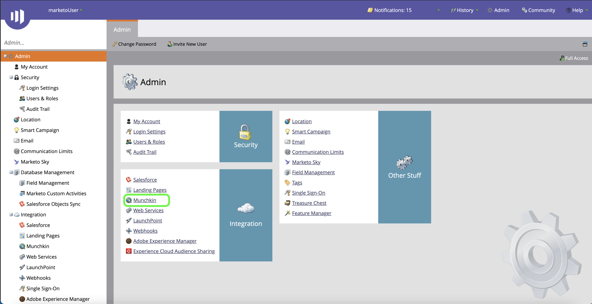

# [!DNL Marketo Engage] ソースコネクタの認証

[!DNL Marketo Engage] （以下「[!DNL Marketo]」）ソースコネクタを作成する前に、まず [!DNL Marketo] インターフェイスを通じてカスタムサービスを設定し、Munchkin ID、クライアント ID、クライアントシークレットの値を取得する必要があります。

以下のドキュメントでは、[!DNL Marketo] ソースコネクタを作成するために認証資格情報を取得する手順を説明します。

## 新しい役割の設定

認証資格情報を取得する最初の手順は、[[!DNL Marketo]](https://app-sjint.marketo.com/#MM0A1) インターフェイスを使用して新しい役割を設定することです。

[!DNL Marketo] にログインし、上部のナビゲーションバーから「**[!DNL Admin]**」を選択します。

*[!DNL Users & Role]s* ページには、ユーザー、ロール、およびログイン履歴に関する情報が含まれています。 新しい役割を作成するには、上部のヘッダーから「**[!DNL Roles]**」を選択し、「**[!DNL New Role]**」を選択します。

**[!DNL Create New Role]** ダイアログボックスが表示されます。 名前と説明を入力したあと、この役割に付与したい権限を選択します。 権限は特定のワークスペースに制限され、ユーザーは、権限を持つワークスペースでアクションのみを実行できます。

付与する権限を選択したら、「**[!DNL Create]**」を選択します。

[!DNL Marketo] を使用して役割を作成する場合、API で制限付き権限を管理できます。 「API にアクセス」を選択する代わりに、次の権限を選択して、最小限のアクセスレベルで役割を提供できます。

* [!DNL Read-Only Activity]
* [!DNL Read-Only Assets]
* [!DNL Read-Only Campaign]
* [!DNL Read-Only Company]
* [!DNL Read-Only Custom Object]
* [!DNL Read-Only Custom Object Type]
* [!DNL Read-Only Named Account]
* [!DNL Read-Only Named Account List]
* [!DNL Read-Only Opportunity]
* [!DNL Read-Only Person]
* [!DNL Read-Only Sales Person]

## 新しいユーザーの設定

役割と同様に、**[!DNL Users & Roles]** のページから新しいユーザーを設定できます。 **[!DNL Users]** のページには、現在Marketoでプロビジョニングされているアクティブなユーザーのリストが表示されます。 「**[!DNL Invite New User]**」を選択して、新しいユーザーをプロビジョニングします。

ポップオーバーダイアログメニューが表示されます。 メール、名、姓、理由に適した情報を入力します。 この手順では、招待する新しいユーザーアカウントのアクセスの有効期限を設定することもできます。 終了したら「**[!DNL Next]**」を選択します。

>[!IMPORTANT]
>
>新しいユーザーを設定する場合は、作成するカスタムサービス専用のユーザーにアクセス権を割り当てる必要があります。

**[!DNL Permissions]** の手順で適切なフィールドを選択し、「**[!DNL API Only]**」チェックボックスをオンにして、新しいユーザーに API の役割を指定します。 「**[!DNL Next]**」を選択して次に進みます。

プロセスを完了するには、「**[!DNL Send]**」を選択します。

## カスタムサービスの設定

新しいユーザーを確立したら、カスタムサービスを設定して新しい資格情報を取得できます。 管理ページで「**[!DNL LaunchPoint]**」を選択します。

**[!DNL Installed services]** ページには既存のサービスのリストが含まれます。新しいカスタムサービスを作成するには、「**[!DNL New]**」を選択し、「**[!DNL New Service]**」を選択します。

新しいサービスにわかりやすい表示名を指定し、**[!DNL Service]** ドロップダウンメニューから「**[!DNL Custom]**」を選択します。 適切な説明を入力し、プロビジョニングするユーザーを **[!DNL API Only User]** ドロップダウンメニューから選択します。 必要な詳細を入力したら、「**[!DNL Create]**」を選択して新しいカスタムサービスを作成します。

## クライアント ID とクライアントシークレットの取得

新しいカスタムサービスを作成すると、クライアント ID とクライアント秘密鍵の値を取得できるようになりました。 **[!DNL Installed Services]** メニューから、アクセスするカスタムサービスを探し、**[!DNL View Details]** を選択します。

クライアント ID とクライアント秘密鍵を含むダイアログボックスが表示されます。

## Munchkin ID の取得

[!DNL Marketo] ソースコネクタを認証するために完了する必要がある最後の手順は、Munchkin ID を取得することです。 管理ページで、**[!DNL Integration]** ントロールパネルの下の「**[!DNL Munchkin]**」を選択します。

*[!DNL Munchkin]* ページが表示され、パネルの上部に一意の Munchkin ID がリストされます。

クライアント ID とクライアントシークレットを組み合わせると、Munchkin ID を使用して、Experience Platform時に新しいアカウントを設定し、[&#x200B; 新しいソース接続を作成 &#x200B;](../../../tutorials/ui/create/adobe-applications/marketo.md) するこ  [!DNL Marketo]  ができます。
