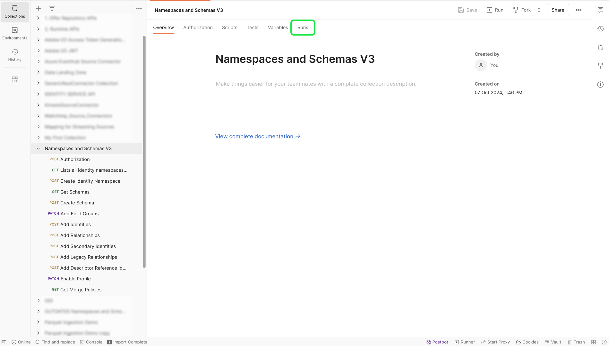
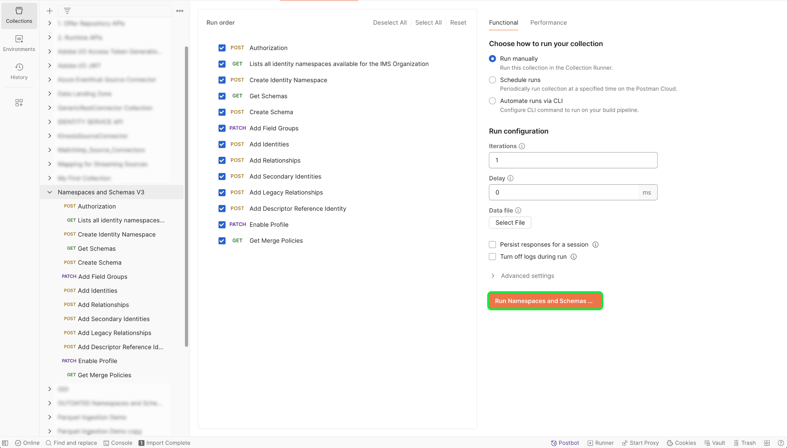

# B2B 名前空間とスキーマ

>[!AVAILABILITY]
>
>- B2B スキーマを[&#x200B; リアルタイム顧客プロファイル &#x200B;](../../../../rtcdp/b2b-overview.md)で選定するには、[Adobe Real-Time Customer Data Platform B2B edition](../../../../profile/home.md)へのアクセス権が必要です。
>
>- 2026年1月以降、Real-Time CDP B2B editionでは、B2B エンティティ間の&#x200B;**非標準**&#x200B;関係がサポートされなくなります。 したがって、[B2B名前空間およびスキーマガイド &#x200B;](../../../../rtcdp/schemas/b2b.md)に記載されている標準の関係を使用するように、B2B エンティティを更新することをお勧めします。

>[!NOTE]
>
>Adobe Experience Platform UIのテンプレートを使用すれば、B2BおよびB2C データ向けのアセット作成を迅速化できます。 詳しくは、[Experience Platform UIでのテンプレートの使用](../../../tutorials/ui/templates.md)に関するガイドを参照してください。

このドキュメントでは、B2B ソースで使用するネームスペースとスキーマの基礎となる設定について説明します。 このドキュメントでは、B2B ネームスペースとスキーマの生成に必要なPostman オートメーション ユーティリティの設定に関する詳細も説明します。

## B2B名前空間とスキーマ自動生成ユーティリティを設定する

>[!IMPORTANT]
>
>サービスアカウント （JWT）資格情報は非推奨になりました。 2025年1月27日（PT）より前に、アプリケーションまたは統合を新しいOAuth サーバー間資格情報に移行する必要があります。 JWT資格情報をOAuth サーバー間の資格情報に移行する方法[の詳細な手順については、次のドキュメントを参照してください](https://developer.adobe.com/developer-console/docs/guides/authentication/ServerToServerAuthentication/migration/)。

B2B名前空間およびスキーマ自動生成ユーティリティをサポートするように[!DNL Postman]環境を設定する方法の前提条件については、次のドキュメントを参照してください。

- 名前空間とスキーマ自動生成ユーティリティのコレクションと環境は、この[GitHub リポジトリ &#x200B;](https://github.com/adobe/experience-platform-postman-samples/tree/master/Postman%20Collections/CDP%20Namespaces%20and%20Schemas%20Utility)からダウンロードできます。
- 必要なヘッダーの値を収集し、サンプル API呼び出しを読み取る方法など、Experience Platform APIの使用方法について詳しくは、[Experience Platform APIの概要](../../../../landing/api-guide.md)に関するガイドを参照してください。
- Experience Platform APIの資格情報を生成する方法について詳しくは、[Experience Platform APIの認証とアクセス &#x200B;](../../../../landing/api-authentication.md)に関するチュートリアルを参照してください。
- Experience Platform API用の[!DNL Postman]の設定方法について詳しくは、[開発者向けコンソールの設定および [!DNL Postman]](../../../../landing/postman.md)に関するチュートリアルを参照してください。

Experience Platform開発者コンソールと[!DNL Postman]の設定が完了したら、[!DNL Postman]環境に適切な環境値を適用できるようになりました。

次の表は、値の例と、[!DNL Postman]環境の入力に関する追加情報を示しています。

| 変数 | 説明 | 例 |
| --- | --- | --- |
| `CLIENT_SECRET` | `{ACCESS_TOKEN}`の生成に使用される一意のID。 [の取得方法について詳しくは、](../../../../landing/api-authentication.md)Experience Platform APIの認証とアクセス `{CLIENT_SECRET}`に関するチュートリアルを参照してください。 | `{CLIENT_SECRET}` |
| `API_KEY` | Experience Platform APIへの呼び出しを認証するために使用される一意のID。 [の取得方法について詳しくは、](../../../../landing/api-authentication.md)Experience Platform APIの認証とアクセス `{API_KEY}`に関するチュートリアルを参照してください。 | `c8d9a2f5c1e03789bd22e8efdd1bdc1b` |
| `ACCESS_TOKEN` | Experience Platform APIへの呼び出しを完了するために必要な認証トークン。 [の取得方法について詳しくは、](../../../../landing/api-authentication.md)Experience Platform APIの認証とアクセス `{ACCESS_TOKEN}`に関するチュートリアルを参照してください。 | `Bearer {ACCESS_TOKEN}` |
| `META_SCOPE` | [!DNL Marketo]に関しては、この値は固定され、常に`ent_dataservices_sdk`に設定されます。 | `ent_dataservices_sdk` |
| `CONTAINER_ID` | `global` コンテナには、標準のAdobeおよびExperience Platform パートナーが提供するすべてのクラス、スキーマフィールドグループ、データタイプ、スキーマが格納されます。 [!DNL Marketo]に関しては、この値は固定され、常に`global`に設定されます。 | `global` |
| `TECHNICAL_ACCOUNT_ID` | Adobe I/Oへの統合に使用する資格情報。 | `D42AEVJZTTJC6LZADUBVPA15@techacct.adobe.com` |
| `IMS` | Identity Management System （IMS）は、Adobe サービスに認証のためのフレームワークを提供します。 [!DNL Marketo]に関しては、この値は固定され、常に`ims-na1.adobelogin.com`に設定されます。 | `ims-na1.adobelogin.com` |
| `IMS_ORG` | 製品やサービスを所有またはライセンス供与し、そのメンバーへのアクセスを許可できる法人。 [情報の取得方法については、 [!DNL Postman]](../../../../landing/postman.md)開発者向けコンソールの設定と`{ORG_ID}`に関するチュートリアルを参照してください。 | `ABCEH0D9KX6A7WA7ATQE0TE@adobeOrg` |
| `SANDBOX_NAME` | 使用している仮想サンドボックスパーティションの名前。 | `prod` |
| `TENANT_ID` | 作成するリソースが適切な名前空間で構成され、組織内に含まれていることを確認するために使用されるID。 | `b2bcdpproductiontest` |
| `PLATFORM_URL` | API呼び出しを行うURL エンドポイント。 この値は固定されており、常に`http://platform.adobe.io/`に設定されます。 | `http://platform.adobe.io/` |

{style="table-layout:auto"}

### スクリプトの実行

[!DNL Postman] コレクションと環境を設定したら、[!DNL Postman] インターフェイスを使用してスクリプトを実行できるようになりました。

[!DNL Postman] インターフェイスで、自動生成ユーティリティのルート フォルダーを選択し、上部ヘッダーから&#x200B;**[!DNL Run]**&#x200B;を選択します。

[!DNL Runner] インターフェイスが表示されます。 ここから、すべてのチェックボックスが選択されていることを確認し、**[!DNL Run Namespaces and Schemas Autogeneration Utility]**&#x200B;を選択します。

。

リクエストが成功すると、B2Bに必要な名前空間とスキーマが作成されます。

## B2B名前空間

ID名前空間は、IDのコンテキストを区別するのに役立つ[[!DNL Identity Service]](../../../../identity-service/home.md)のコンポーネントです。 完全修飾IDには、ID値と名前空間が含まれます。 詳しくは、[名前空間の概要](../../../../identity-service/features/namespaces.md)を参照してください。

B2B名前空間は、エンティティのプライマリ IDで使用されます。

次の表に、B2B名前空間の基になる設定に関する情報を示します。

>[!NOTE]
>
>表の全内容を表示するには、左右にスクロールしてください。

| 表示名 | ID シンボル | ID タイプ |
| --- | --- | --- |
| B2B人物 | `b2b_person` | `CROSS_DEVICE` |
| B2B アカウント | `b2b_account` | `B2B_ACCOUNT` |
| B2B オポチュニティ | `b2b_opportunity` | `B2B_OPPORTUNITY` |
| B2B オポチュニティと人物の関係 | `b2b_opportunity_person_relation` | `B2B_OPPORTUNITY_PERSON` |
| B2B キャンペーン | `b2b_campaign` | `B2B_CAMPAIGN` |
| B2B キャンペーンメンバー | `b2b_campaign_member` | `B2B_CAMPAIGN_MEMBER` |
| B2B マーケティングリスト | `b2b_marketing_list` | `B2B_MARKETING_LIST` |
| B2B マーケティングリストメンバー | `b2b_marketing_list_member` | `B2B_MARKETING_LIST_MEMBER` |
| B2B アカウントと人物の関係 | `b2b_account_person_relation` | `B2B_ACCOUNT_PERSON` |

{style="table-layout:auto"}

## B2B スキーマ

Experience Platform では、スキーマを使用して、一貫性のある再利用可能な方法でデータの構造を記述します。システムをまたいで一貫したデータを定義することで、意味を保有しやすくなり、データから価値を得ることができます。

データをExperience Platformに取り込む前に、データの構造を説明するスキーマを作成し、各フィールドに含めることができるデータタイプに制約を与える必要があります。 スキーマは、基本クラスと 0 個以上のスキーマフィールドグループで構成されます。

デザインの原則やベストプラクティスなど、スキーマ構成モデルについて詳しくは、[スキーマ構成の基本](../../../../xdm/schema/composition.md)を参照してください。

次の表に、B2B スキーマの基礎となる設定に関する情報を示します。

>[!NOTE]
>
>表の全内容を表示するには、左右にスクロールしてください。

| スキーマ名 | ベースクラス | フィールドグループ | スキーマの[!DNL Profile] | プライマリ ID | プライマリ ID 名前空間 | セカンダリID | セカンダリID名前空間 | 関係 | メモ |
| --- | --- | --- | --- | --- | --- | --- | --- | --- | --- |
| B2B アカウント | [XDM ビジネスアカウント &#x200B;](../../../../xdm/classes/b2b/business-account.md) | XDM ビジネスアカウントの詳細 | 有効 | 基本クラスの`accountKey.sourceKey` | B2B アカウント | 基本クラスの`extSourceSystemAudit.externalKey.sourceKey` | B2B アカウント | <ul><li>XDM ビジネスアカウント詳細フィールドグループの`accountParentKey.sourceKey`</li><li>宛先プロパティ：`/accountKey/sourceKey`</li><li>タイプ：1対1</li><li>参照スキーマ：B2B アカウント</li><li>名前空間：B2B アカウント</li></ul> |  |
| B2B人物 | [XDM 個人プロファイル](../../../../xdm/classes/individual-profile.md) | <ul><li>XDM ビジネスパーソンの詳細</li><li>XDM ビジネスパーソンのコンポーネント</li><li>identityMap</li><li>同意と環境設定の詳細</li></ul> | 有効 | XDM ビジネス担当者詳細フィールドグループの`b2b.personKey.sourceKey` | B2B人物 | <ol><li>XDM ビジネス担当者詳細フィールド グループの`extSourceSystemAudit.externalKey.sourceKey`</li><li>XDM ビジネス担当者詳細フィールド グループの`workEmail.address`</ol></li> | <ol><li>B2B人物</li><li>メール</li></ol> | <ul><li>XDM ビジネス担当者コンポーネント フィールド グループの`personComponents.sourceAccountKey.sourceKey`</li><li>タイプ：多対一</li><li>参照スキーマ：B2B アカウント</li><li>名前空間：B2B アカウント</li><li>宛先プロパティ：accountKey.sourceKey</li><li>現在のスキーマからの関係名：アカウント</li><li>参照スキーマからの関係名：人物</li></ul> |  |
| B2B オポチュニティ | [XDM ビジネス機会](../../../../xdm/classes/b2b/business-opportunity.md) | XDM ビジネスオポチュニティの詳細 | 有効 | 基本クラスの`opportunityKey.sourceKey` | B2B オポチュニティ | 基本クラスの`extSourceSystemAudit.externalKey.sourceKey` | B2B オポチュニティ | <ul><li>基本クラスの`accountKey.sourceKey`</li><li>タイプ：多対一</li><li>参照スキーマ：B2B アカウント</li><li>名前空間：B2B アカウント</li><li>宛先プロパティ：`accountKey.sourceKey`</li><li>現在のスキーマからの関係名：アカウント</li><li>参照スキーマからの関係名：商談</li></ul> |  |
| B2B オポチュニティと人物の関係 | [XDM ビジネスオポチュニティ人物との関係](../../../../xdm/classes/b2b/business-opportunity-person-relation.md) | なし | 有効 | 基本クラスの`opportunityPersonKey.sourceKey` | B2B オポチュニティと人物の関係 | | | **最初の関係**<ul><li>基本クラスの`personKey.sourceKey`</li><li>タイプ：多対一</li><li>参照スキーマ：B2B人物</li><li>名前空間：B2B Person</li><li>宛先プロパティ：b2b.personKey.sourceKey</li><li>現在のスキーマからの関係名：人物</li><li>参照スキーマからの関係名：商談</li></ul>**2番目の関係**<ul><li>基本クラスの`opportunityKey.sourceKey`</li><li>タイプ：多対一</li><li>リファレンススキーマ：B2B Opportunity </li><li>名前空間：B2B オポチュニティ </li><li>宛先プロパティ：`opportunityKey.sourceKey`</li><li>現在のスキーマからの関係名：商談</li><li>参照スキーマからの関係名：人物</li></ul> | |
| B2B キャンペーン | [XDM ビジネスキャンペーン &#x200B;](../../../../xdm/classes/b2b/business-campaign.md) | XDM ビジネスキャンペーンの詳細 | 有効 | 基本クラスの`campaignKey.sourceKey` | B2B キャンペーン | | | | |
| B2B キャンペーンメンバー | [XDM ビジネスキャンペーンメンバー](../../../../xdm/classes/b2b/business-campaign-members.md) | XDM ビジネスキャンペーンメンバーの詳細 | 有効 | 基本クラスの`ccampaignMemberKey.sourceKey` | B2B キャンペーンメンバー | | | **最初の関係**<ul><li>基本クラスの`personKey.sourceKey`</li><li>タイプ：多対一</li><li>参照スキーマ：B2B人物</li><li>名前空間：B2B Person</li><li>宛先プロパティ：`b2b.personKey.sourceKey`</li><li>現在のスキーマからの関係名：人物</li><li>参照スキーマからの関係名：Campaigns</li></ul>**2番目の関係**<ul><li>基本クラスの`campaignKey.sourceKey`</li><li>タイプ：多対一</li><li>リファレンススキーマ：B2B キャンペーン</li><li>名前空間：B2B キャンペーン</li><li>宛先プロパティ：`campaignKey.sourceKey`</li><li>現在のスキーマからの関係名：Campaign</li><li>参照スキーマからの関係名：人物</li></ul> |  |
| B2B マーケティングリスト | [XDM ビジネスマーケティングリスト &#x200B;](../../../../xdm/classes/b2b/business-marketing-list.md) | なし | 有効 | 基本クラスの`marketingListKey.sourceKey` | B2B マーケティングリスト | なし | なし | なし | 静的リストは[!DNL Salesforce]から同期されていないため、セカンダリ IDがありません。 |
| B2B マーケティングリストメンバー | [XDM ビジネスマーケティングリストのメンバー](../../../../xdm/classes/b2b/business-marketing-list-members.md) | なし | 有効 | 基本クラスの`marketingListMemberKey.sourceKey` | B2B マーケティングリストメンバー | なし | なし | **最初の関係**<ul><li>基本クラスの`PersonKey.sourceKey`</li><li>タイプ：多対一</li><li>参照スキーマ：B2B人物</li><li>名前空間：B2B Person</li><li>宛先プロパティ：`b2b.personKey.sourceKey`</li><li>現在のスキーマからの関係名：人物</li><li>参照スキーマからの関係名：マーケティングリスト</li></ul>**2番目の関係**<ul><li>基本クラスの`marketingListKey.sourceKey`</li><li>タイプ：多対一</li><li>リファレンススキーマ：B2B マーケティングリスト</li><li>名前空間：B2B マーケティングリスト</li><li>宛先プロパティ：`marketingListKey.sourceKey`</li><li>現在のスキーマからの関係名：マーケティングリスト</li><li>参照スキーマからの関係名：人物</li></ul> | 静的リスト メンバーは[!DNL Salesforce]から同期されていないため、セカンダリ IDがありません。 |
| B2B アカウントと人物の関係 | [XDM ビジネスアカウント人物の関係](../../../../xdm/classes/b2b/business-account-person-relation.md) | ID マップ | 有効 | 基本クラスの`accountPersonKey.sourceKey` | B2B アカウントと人物の関係 | なし | なし | **最初の関係**<ul><li>基本クラスの`personKey.sourceKey`</li><li>タイプ：多対一</li><li>参照スキーマ：B2B人物</li><li>名前空間：B2B Person</li><li>宛先プロパティ：`b2b.personKey.SourceKey`</li><li>現在のスキーマからの関係名：人物</li><li>参照スキーマからの関係名：アカウント</li></ul>**2番目の関係**<ul><li>基本クラスの`accountKey.sourceKey`</li><li>タイプ：多対一</li><li>参照スキーマ：B2B アカウント</li><li>名前空間：B2B アカウント</li><li>宛先プロパティ：`accountKey.sourceKey`</li><li>現在のスキーマからの関係名：アカウント</li><li>参照スキーマからの関係名：人物</li></ul> |  |

{style="table-layout:auto"}

## 次の手順

[!DNL Marketo] データをExperience Platformに接続する方法については、[UIでのMarketo ソースコネクタの作成](../../../tutorials/ui/create/adobe-applications/marketo.md)に関するチュートリアルを参照してください。

<!--

| B2B Activity | [XDM ExperienceEvent](../../../../xdm/classes/experienceevent.md) | <ul><li>Visit WebPage</li><li>New Lead</li><li>Convert Lead</li><li>Add To List</li><li>Remove From List</li><li>Add To Opportunity</li><li>Remove From Opportunity</li><li>Form Filled Out</li><li>Link Clicks</li><li>Email Delivered</li><li>Email Opened</li><li>Email Clicked</li><li>Email Bounced</li><li>Email Bounced Soft</li><li>Email Unsubscribed</li><li>Score Changed</li><li>Opportunity Updated</li><li>Status in Campaign Progression Changed</li><li>Person Identifier</li><li>Marketo Web URL</li><li>Interesting Moment</li><li>Call Webhook</li><li>Change Campaign Cadence</li><li>Revenue Stage Changed</li><li>Merge Leads</li><li>Email Sent</li><li>Change Campaign Stream</li><li>Add to Campaign</li></ul> | Enabled | `personKey.sourceKey` of Person Identifier field group | B2B Person | None | None | | `ExperienceEvent` is different from entities. The identity of experience event is the person who did the activity. |

-->