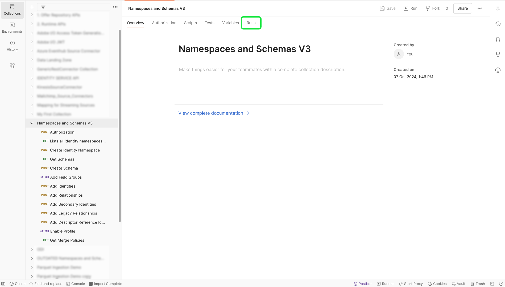

# B2B 名前空間とスキーマ

>[!AVAILABILITY]
>
>B2B スキーマが &lbrace; リアルタイム顧客プロファイル [&#x200B; に適合するには、&lbrace;0](../../../../rtcdp/b2b-overview.md)Adobe Real-Time Customer Data Platform B2B edition[&#x200B; へのアクセス権が必要です。](../../../../profile/home.md)

>[!NOTE]
>
>Adobe Experience Platform UI でテンプレートを使用すると、B2B および B2C データのアセット作成を迅速化できます。 詳しくは、[Experience Platform UI でのテンプレートの使用 &#x200B;](../../../tutorials/ui/templates.md) に関するガイドを参照してください。

B2B ソースで使用する名前空間とスキーマの設定について詳しくは、このドキュメントを参照してください。 このドキュメントでは、B2B 名前空間とスキーマを生成するために必要なPostman自動化ユーティリティの設定に関する詳細も説明します。

## B2B 名前空間とスキーマ自動生成ユーティリティの設定

>[!IMPORTANT]
>
>サービスアカウント（JWT）資格情報は非推奨（廃止予定）となりました。 2025 年 1 月 27 日（PT）までに、アプリケーションまたは統合を新しい OAuth サーバー間資格情報に移行する必要があります。 [JWT 資格情報を OAuth サーバー間資格情報に移行する方法 &#x200B;](https://developer.adobe.com/developer-console/docs/guides/authentication/ServerToServerAuthentication/migration/) に関する詳細な手順については、次のドキュメントを参照してください。

B2B 名前空間とスキーマ自動生成ユーティリティをサポートするための [!DNL Postman] 環境の設定方法に関する前提条件の情報については、次のドキュメントを参照してください。

- この [GitHub リポジトリ &#x200B;](https://github.com/adobe/experience-platform-postman-samples/tree/master/Postman%20Collections/CDP%20Namespaces%20and%20Schemas%20Utility) から、名前空間およびスキーマ自動生成ユーティリティのコレクションと環境をダウンロードできます。
- 必要なヘッダーの値を収集する方法やサンプル API 呼び出しを読み取る方法など、Experience Platform API の使用について詳しくは、[Experience Platform API の概要 &#x200B;](../../../../landing/api-guide.md) を参照してください。
- Experience Platform API の資格情報の生成方法について詳しくは、[Experience Platform API の認証とアクセス &#x200B;](../../../../landing/api-authentication.md) に関するチュートリアルを参照してください。
- Experience Platform API の [!DNL Postman] の設定方法について詳しくは、[Developer Console との設定  [!DNL Postman]](../../../../landing/postman.md) に関するチュートリアルを参照してください。

Experience Platform Developer Console と [!DNL Postman] の設定により、[!DNL Postman] 環境に適切な環境値を適用できるようになりました。

次の表に、値の例と、[!DNL Postman] 環境へのデータ入力に関する追加情報を示します。

| 変数 | 説明 | 例 |
| --- | --- | --- |
| `CLIENT_SECRET` | `{ACCESS_TOKEN}` ータの生成に使用される一意の ID。 サー [&#x200B; スの取得方法について詳しくは、](../../../../landing/api-authentication.md)Experience Platform API の認証とアクセス `{CLIENT_SECRET}` に関するチュートリアルを参照してください。 | `{CLIENT_SECRET}` |
| `API_KEY` | Experience Platform API への呼び出しの認証に使用される一意の ID。 サー [&#x200B; スの取得方法について詳しくは、](../../../../landing/api-authentication.md)Experience Platform API の認証とアクセス `{API_KEY}` に関するチュートリアルを参照してください。 | `c8d9a2f5c1e03789bd22e8efdd1bdc1b` |
| `ACCESS_TOKEN` | Experience Platform API を呼び出すために必要な認証トークン。 サー [&#x200B; スの取得方法について詳しくは、](../../../../landing/api-authentication.md)Experience Platform API の認証とアクセス `{ACCESS_TOKEN}` に関するチュートリアルを参照してください。 | `Bearer {ACCESS_TOKEN}` |
| `META_SCOPE` | [!DNL Marketo] に関しては、この値は固定で、常に `ent_dataservices_sdk` に設定されます。 | `ent_dataservices_sdk` |
| `CONTAINER_ID` | `global` コンテナには、標準のAdobeおよびExperience Platform パートナー提供のすべてのクラス、スキーマフィールドグループ、データタイプおよびスキーマが含まれます。 [!DNL Marketo] に関しては、この値は固定で、常に `global` に設定されます。 | `global` |
| `TECHNICAL_ACCOUNT_ID` | Adobe I/Oへの統合に使用する資格情報。 | `D42AEVJZTTJC6LZADUBVPA15@techacct.adobe.com` |
| `IMS` | Identity Management System （IMS）は、Adobe サービスに対して認証を行うためのフレームワークを提供します。 [!DNL Marketo] に関しては、この値は固定で、常に `ims-na1.adobelogin.com` に設定されます。 | `ims-na1.adobelogin.com` |
| `IMS_ORG` | 製品およびサービスを所有またはライセンスし、そのメンバーへのアクセスを許可できる法人組織。 [&#x200B; ーザー情報の取得方法については、 [!DNL Postman]](../../../../landing/postman.md)Developer Console の設定および `{ORG_ID}` に関するチュートリアルを参照してください。 | `ABCEH0D9KX6A7WA7ATQE0TE@adobeOrg` |
| `SANDBOX_NAME` | 使用している仮想サンドボックスパーティションの名前。 | `prod` |
| `TENANT_ID` | 作成するリソースの名前空間が適切に設定され、組織内に含まれていることを確認するために使用される ID。 | `b2bcdpproductiontest` |
| `PLATFORM_URL` | API 呼び出しを行う URL エンドポイント。 この値は固定で、常に `http://platform.adobe.io/` に設定されます。 | `http://platform.adobe.io/` |

{style="table-layout:auto"}

### スクリプトの実行

[!DNL Postman] コレクションと環境を設定すると、[!DNL Postman] インターフェイスを使用してスクリプトを実行できます。

[!DNL Postman] インターフェイスで、自動生成ユーティリティのルートフォルダーを選択し、上部のヘッダーから「**[!DNL Run]**」を選択します。

[!DNL Runner] インターフェイスが表示されます。 ここから、すべてのチェックボックスが選択されていることを確認してから選択し **[!DNL Run Namespaces and Schemas Autogeneration Utility]** す。

リクエストが成功すると、B2B に必要な名前空間とスキーマが作成されます。

## B2B 名前空間

ID 名前空間は、ID のコンテキストを区別するのに役立つ [[!DNL Identity Service]](../../../../identity-service/home.md) のコンポーネントです。 完全修飾 ID には、ID 値と名前空間が含まれます。 詳しくは、[&#x200B; 名前空間の概要 &#x200B;](../../../../identity-service/features/namespaces.md) を参照してください。

B2B 名前空間は、エンティティのプライマリ ID で使用されます。

B2B 名前空間の基盤となるセットアップに関する情報を次の表に示します。

>[!NOTE]
>
>左右にスクロールして、テーブルの内容をすべて表示してください。

| 表示名 | ID シンボル | ID タイプ |
| --- | --- | --- |
| B2B ユーザー | `b2b_person` | `CROSS_DEVICE` |
| B2B アカウント | `b2b_account` | `B2B_ACCOUNT` |
| B2B オポチュニティ | `b2b_opportunity` | `B2B_OPPORTUNITY` |
| B2B オポチュニティ人物関係 | `b2b_opportunity_person_relation` | `B2B_OPPORTUNITY_PERSON` |
| B2B キャンペーン | `b2b_campaign` | `B2B_CAMPAIGN` |
| B2B キャンペーンメンバー | `b2b_campaign_member` | `B2B_CAMPAIGN_MEMBER` |
| B2B マーケティングリスト | `b2b_marketing_list` | `B2B_MARKETING_LIST` |
| B2B マーケティングリストメンバー | `b2b_marketing_list_member` | `B2B_MARKETING_LIST_MEMBER` |
| B2B アカウント人物関係 | `b2b_account_person_relation` | `B2B_ACCOUNT_PERSON` |

{style="table-layout:auto"}

## B2B スキーマ

Experience Platform では、スキーマを使用して、一貫性のある再利用可能な方法でデータの構造を記述します。システムをまたいで一貫したデータを定義することで、意味を保有しやすくなり、データから価値を得ることができます。

データをExperience Platformに取り込む前に、データの構造を記述し、各フィールドに含めることができるデータのタイプに制約を適用するためのスキーマを作成する必要があります。 スキーマは、基本クラスと 0 個以上のスキーマフィールドグループで構成されます。

デザインの原則やベストプラクティスなど、スキーマ構成モデルについて詳しくは、[スキーマ構成の基本](../../../../xdm/schema/composition.md)を参照してください。

B2B スキーマの基盤となる設定に関する情報を次の表に示します。

>[!NOTE]
>
>左右にスクロールして、テーブルの内容をすべて表示してください。

| スキーマ名 | 基本クラス | フィールドグループ | スキーマ内の [!DNL Profile] | プライマリ ID | プライマリ ID 名前空間 | セカンダリID | セカンダリid 名前空間 | 関係 | メモ |
| --- | --- | --- | --- | --- | --- | --- | --- | --- | --- |
| B2B アカウント | [XDM ビジネスアカウント &#x200B;](../../../../xdm/classes/b2b/business-account.md) | XDM ビジネスアカウントの詳細 | 有効 | 基本クラスの `accountKey.sourceKey` | B2B アカウント | 基本クラスの `extSourceSystemAudit.externalKey.sourceKey` | B2B アカウント | <ul><li>XDM ビジネスアカウントの詳細フィールドグループの `accountParentKey.sourceKey`</li><li>宛先のプロパティ：`/accountKey/sourceKey`</li><li>タイプ : 1 対 1</li><li>参照スキーマ：B2B アカウント</li><li>名前空間：B2B アカウント</li></ul> |  |
| B2B ユーザー | [XDM 個人プロファイル](../../../../xdm/classes/individual-profile.md) | <ul><li>XDM ビジネスパーソンの詳細</li><li>XDM ビジネスパーソンのコンポーネント</li><li>identityMap</li><li>同意と環境設定の詳細</li></ul> | 有効 | XDM ビジネス人物の詳細フィールドグループの `b2b.personKey.sourceKey` | B2B ユーザー | <ol><li>XDM ビジネス人物の詳細フィールドグループの `extSourceSystemAudit.externalKey.sourceKey`</li><li>XDM ビジネス人物の詳細フィールドグループの `workEmail.address`</ol></li> | <ol><li>B2B ユーザー</li><li>メール</li></ol> | <ul><li>XDM ビジネスユーザーコンポーネントフィールドグループの `personComponents.sourceAccountKey.sourceKey`</li><li>タイプ：多対 1</li><li>参照スキーマ：B2B アカウント</li><li>名前空間：B2B アカウント</li><li>宛先プロパティ：accountKey.sourceKey</li><li>現在のスキーマからの関係名：アカウント</li><li>参照スキーマからの関係名：人物</li></ul> |  |
| B2B オポチュニティ | [XDM ビジネスオポチュニティ &#x200B;](../../../../xdm/classes/b2b/business-opportunity.md) | XDM ビジネスオポチュニティの詳細 | 有効 | 基本クラスの `opportunityKey.sourceKey` | B2B オポチュニティ | 基本クラスの `extSourceSystemAudit.externalKey.sourceKey` | B2B オポチュニティ | <ul><li>基本クラスの `accountKey.sourceKey`</li><li>タイプ：多対 1</li><li>参照スキーマ：B2B アカウント</li><li>名前空間：B2B アカウント</li><li>宛先のプロパティ：`accountKey.sourceKey`</li><li>現在のスキーマからの関係名：アカウント</li><li>参照スキーマからの関係名：商談</li></ul> |  |
| B2B オポチュニティ人物関係 | [XDM ビジネスオポチュニティ人物関係 &#x200B;](../../../../xdm/classes/b2b/business-opportunity-person-relation.md) | なし | 有効 | 基本クラスの `opportunityPersonKey.sourceKey` | B2B オポチュニティ人物関係 | | | **最初の関係**<ul><li>基本クラスの `personKey.sourceKey`</li><li>タイプ：多対 1</li><li>参照スキーマ：B2B Person</li><li>名前空間：B2B Person</li><li>宛先プロパティ：b2b.personKey.sourceKey</li><li>現在のスキーマからの関係名：人物</li><li>参照スキーマからの関係名：商談</li></ul>**2 番目の関係**<ul><li>基本クラスの `opportunityKey.sourceKey`</li><li>タイプ：多対 1</li><li>参照スキーマ：B2B オポチュニティ </li><li>名前空間：B2B オポチュニティ </li><li>宛先のプロパティ：`opportunityKey.sourceKey`</li><li>現在のスキーマからの関係名：商談</li><li>参照スキーマからの関係名：人物</li></ul> |  |
| B2B キャンペーン | [XDM ビジネスキャンペーン &#x200B;](../../../../xdm/classes/b2b/business-campaign.md) | XDM ビジネスキャンペーンの詳細 | 有効 | 基本クラスの `campaignKey.sourceKey` | B2B キャンペーン | | |  |
| B2B キャンペーンメンバー | [XDM ビジネスキャンペーンメンバー &#x200B;](../../../../xdm/classes/b2b/business-campaign-members.md) | XDM ビジネスキャンペーンメンバーの詳細 | 有効 | 基本クラスの `ccampaignMemberKey.sourceKey` | B2B キャンペーンメンバー | | | **最初の関係**<ul><li>基本クラスの `personKey.sourceKey`</li><li>タイプ：多対 1</li><li>参照スキーマ：B2B Person</li><li>名前空間：B2B Person</li><li>宛先のプロパティ：`b2b.personKey.sourceKey`</li><li>現在のスキーマからの関係名：人物</li><li>参照スキーマからの関係名：キャンペーン</li></ul>**2 番目の関係**<ul><li>基本クラスの `campaignKey.sourceKey`</li><li>タイプ：多対 1</li><li>参照スキーマ：B2B キャンペーン</li><li>名前空間：B2B キャンペーン</li><li>宛先のプロパティ：`campaignKey.sourceKey`</li><li>現在のスキーマからの関係名：Campaign</li><li>参照スキーマからの関係名：人物</li></ul> |  |
| B2B マーケティングリスト | [XDM ビジネスマーケティングリスト &#x200B;](../../../../xdm/classes/b2b/business-marketing-list.md) | なし | 有効 | 基本クラスの `marketingListKey.sourceKey` | B2B マーケティングリスト | なし | なし | なし | 静的リストは [!DNL Salesforce] から同期されないので、セカンダリ ID がありません。 |
| B2B マーケティングリストメンバー | [XDM ビジネスマーケティングリストメンバー &#x200B;](../../../../xdm/classes/b2b/business-marketing-list-members.md) | なし | 有効 | 基本クラスの `marketingListMemberKey.sourceKey` | B2B マーケティングリストメンバー | なし | なし | **最初の関係**<ul><li>基本クラスの `PersonKey.sourceKey`</li><li>タイプ：多対 1</li><li>参照スキーマ：B2B Person</li><li>名前空間：B2B Person</li><li>宛先のプロパティ：`b2b.personKey.sourceKey`</li><li>現在のスキーマからの関係名：人物</li><li>参照スキーマからの関係名：マーケティングリスト</li></ul>**2 番目の関係**<ul><li>基本クラスの `marketingListKey.sourceKey`</li><li>タイプ：多対 1</li><li>参照スキーマ：B2B マーケティングリスト</li><li>名前空間：B2B マーケティングリスト</li><li>宛先のプロパティ：`marketingListKey.sourceKey`</li><li>現在のスキーマからの関係名：マーケティングリスト</li><li>参照スキーマからの関係名：人物</li></ul> | 静的リストメンバーは [!DNL Salesforce] から同期されないので、セカンダリ ID がありません。 |
| B2B アカウント人物関係 | [XDM ビジネスアカウント人物関係 &#x200B;](../../../../xdm/classes/b2b/business-account-person-relation.md) | ID マップ | 有効 | 基本クラスの `accountPersonKey.sourceKey` | B2B アカウント人物関係 | なし | なし | **最初の関係**<ul><li>基本クラスの `personKey.sourceKey`</li><li>タイプ：多対 1</li><li>参照スキーマ：B2B Person</li><li>名前空間：B2B Person</li><li>宛先のプロパティ：`b2b.personKey.SourceKey`</li><li>現在のスキーマからの関係名：人物</li><li>参照スキーマからの関係名：アカウント</li></ul>**2 番目の関係**<ul><li>基本クラスの `accountKey.sourceKey`</li><li>タイプ：多対 1</li><li>参照スキーマ：B2B アカウント</li><li>名前空間：B2B アカウント</li><li>宛先のプロパティ：`accountKey.sourceKey`</li><li>現在のスキーマからの関係名：アカウント</li><li>参照スキーマからの関係名：人物</li></ul> |  |

{style="table-layout:auto"}

## 次の手順

[!DNL Marketo] データをExperience Platformに接続する方法については、[UI でのMarketo ソースコネクタの作成 &#x200B;](../../../tutorials/ui/create/adobe-applications/marketo.md) のチュートリアルを参照してください。

<!--

| B2B Activity | [XDM ExperienceEvent](../../../../xdm/classes/experienceevent.md) | <ul><li>Visit WebPage</li><li>New Lead</li><li>Convert Lead</li><li>Add To List</li><li>Remove From List</li><li>Add To Opportunity</li><li>Remove From Opportunity</li><li>Form Filled Out</li><li>Link Clicks</li><li>Email Delivered</li><li>Email Opened</li><li>Email Clicked</li><li>Email Bounced</li><li>Email Bounced Soft</li><li>Email Unsubscribed</li><li>Score Changed</li><li>Opportunity Updated</li><li>Status in Campaign Progression Changed</li><li>Person Identifier</li><li>Marketo Web URL</li><li>Interesting Moment</li><li>Call Webhook</li><li>Change Campaign Cadence</li><li>Revenue Stage Changed</li><li>Merge Leads</li><li>Email Sent</li><li>Change Campaign Stream</li><li>Add to Campaign</li></ul> | Enabled | `personKey.sourceKey` of Person Identifier field group | B2B Person | None | None | | `ExperienceEvent` is different from entities. The identity of experience event is the person who did the activity. |

-->