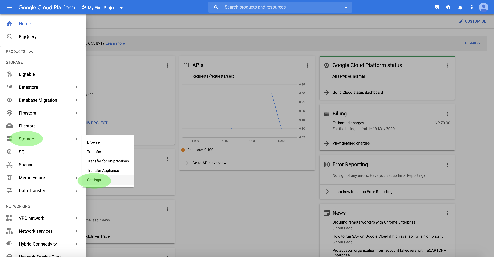
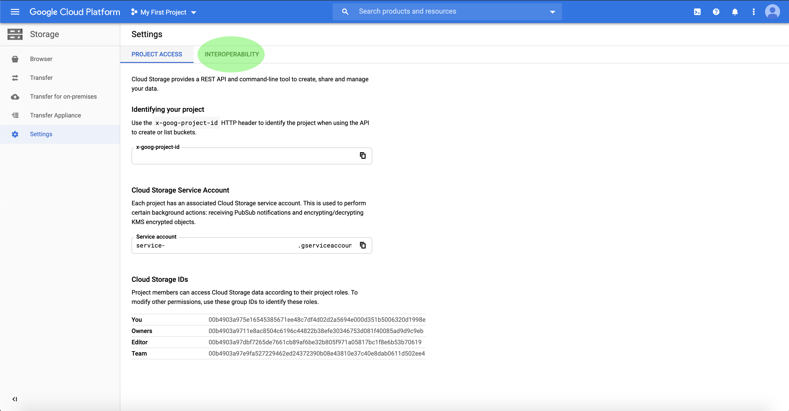

# Google Cloud Storage コネクタ

Adobe Experience Platform には、AWS、[!DNL Google Cloud Platform]、[!DNL Azure] などのクラウドプロバイダーとのネイティブ接続が用意されており、これらのシステムからデータを取り込むことができます。

クラウドストレージソースを使用すると、ダウンロード、フォーマット、アップロードを行う必要なく、独自のデータを Platform に取り込むことができます。取り込んだデータは、Experience Data Model(XDM) に準拠している JSON または Parquet 形式にするか、区切り形式にすることができます。 プロセスのすべての手順がソースワークフローに統合されます。 Platform では、次の場所からデータを取り込むことができます： [!DNL Google Cloud Storage] バッチを使用します。

## IP アドレス許可リスト

ソースコネクタを操作する前に、IP アドレスのリストを許可リストに追加する必要があります。 地域固有の IP アドレスを許可リストに追加しないと、ソースを使用する際にエラーが発生したり、パフォーマンスが低下する場合があります。 詳しくは、[IP アドレスの許可リスト](../../ip-address-allow-list.md)ページを参照してください。

## 接続の前提条件の設定 [!DNL Google Cloud Storage] アカウント

Platform に接続するには、まず、 [!DNL Google Cloud Storage] アカウント 相互運用性設定にアクセスするには、を開きます。 [!DNL Google Cloud Platform] を選択し、 **[!UICONTROL 設定]** から **[!UICONTROL クラウドストレージ]** 」オプションを使用します。

この **[!UICONTROL 設定]** ページが表示されます。 ここから、 [!DNL Google] プロジェクト ID と、 [!DNL Google Cloud Storage] アカウント 相互運用性の設定にアクセスするには、 **[!UICONTROL 相互運用性]** を上部のヘッダーから削除します。

この **[!UICONTROL 相互運用性]** ページには、認証、アクセスキー、およびサービスアカウントに関連付けられたデフォルトプロジェクトに関する情報が含まれています。 サービスアカウントの新しいアクセスキー ID と秘密アクセスキーを生成するには、「 」を選択します。 **[!UICONTROL サービスアカウントのキーの作成]**.

新しく生成されたアクセスキー ID と秘密アクセスキーを使用して、 [!DNL Google Cloud Storage] アカウントを Platform に送信します。

## ファイルとディレクトリの命名制約

クラウドストレージファイルまたはディレクトリに名前を付ける際に考慮する必要がある制約のリストを次に示します。

- ディレクトリ名とファイルコンポーネント名は 255 文字を超えてはなりません。
- ディレクトリ名とファイル名の末尾にスラッシュ（`/`）は使用できません。使用した場合、自動的に削除されます。
- 次の予約 URL 文字は、適切にエスケープする必要があります。`! ' ( ) ; @ & = + $ , % # [ ]`
- 次の文字は使用できません。`" \ / : | < > * ?`
- 無効な URL パス文字は使用できません。`\uE000` のようなコードポイントは、NTFS ファイル名では有効ですが、有効な Unicode 文字ではありません。また、一部の ASCII 文字や Unicode 文字、例えば制御文字（0x00 ～ 0x1F、\u0081 など）も使用できません。HTTP/1.1 で Unicode 文字列を規定するルールについては、[RFC 2616、セクション 2.2：基本ルール](https://www.ietf.org/rfc/rfc2616.txt)および [RFC 3987](https://www.ietf.org/rfc/rfc3987.txt) を参照してください。
- 次のファイル名は使用できません：LPT1、LPT2、LPT3、LPT4、LPT5、LPT6、LPT7、LPT8、LPT9、COM1、COM2、COM3、COM4、COM5、COM6、COM7、COM8、COM9、PRN、AUX、NUL、CON、CLOCK$、ドット文字（.）、2 つのドット文字（..）。

## [!DNL Google Cloud Storage] を Platform に接続

以下のドキュメントでは、API やユーザーインターフェイスを使用して [!DNL Google Cloud Storage] と Platform を接続する方法について説明します。

### API の使用

- [フローサービス API を使用したGoogle Cloud Storage ベース接続の作成](../../tutorials/api/create/cloud-storage/google.md)
- [Flow Service API を使用して、クラウドストレージソースのデータ構造とコンテンツを探索](../../tutorials/api/explore/cloud-storage.md)
- [Flow Service API を使用して、クラウドストレージソースのデータフローを作成](../../tutorials/api/collect/cloud-storage.md)

### UI の使用

- [UI でのGoogle Cloud ストレージソース接続の作成](../../tutorials/ui/create/cloud-storage/google-cloud-storage.md)
- [UI でクラウドストレージ接続のデータフローを作成](../../tutorials/ui/dataflow/batch/cloud-storage.md)
