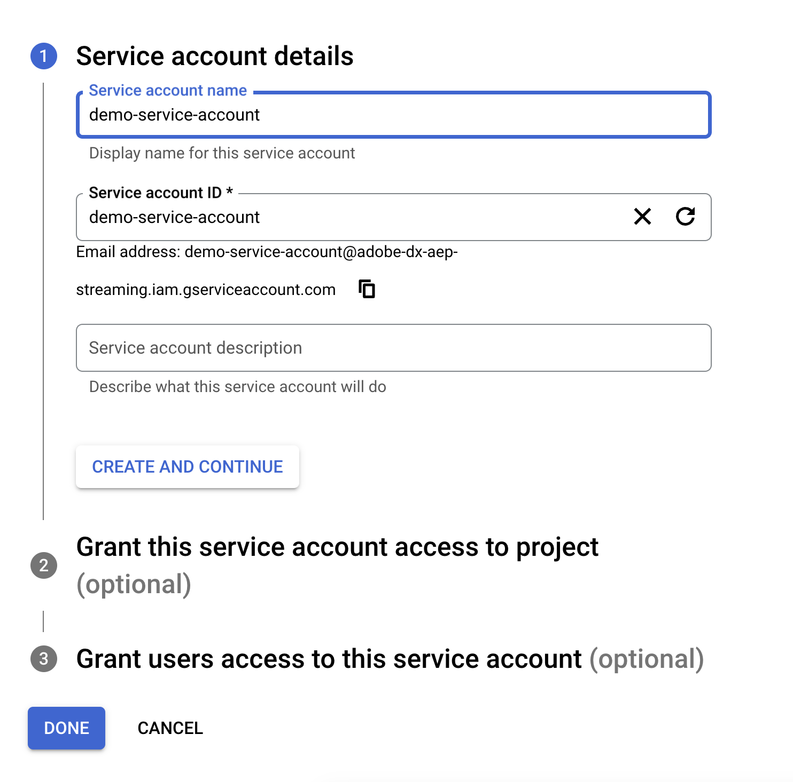
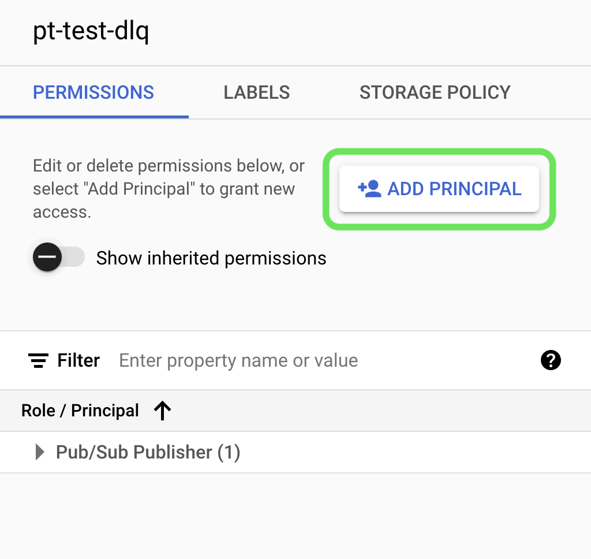

# [!DNL Google PubSub] ソース

>[!IMPORTANT]
>
>Real-time Customer Data Platform Ultimate を購入したユーザーは、ソースカタログで [!DNL Google PubSub] ソースを利用できます。

Adobe Experience Platform は、[!DNL AWS]、[!DNL Google Cloud Platform]、[!DNL Azure] などのクラウドプロバイダーとのネイティブ接続を提供し、これらのシステムからデータを Platform に取り込み、下流のサービスや配信先で使用できるようにします。

クラウドストレージのソースは、ダウンロード、フォーマット、アップロードの必要なく、データを Platform に取り込むことができます。取り込んだデータは、XDM JSON、XDM Parquet 形式または区切り形式で書式設定できます。 プロセスのすべての手順がソースワークフローに統合されます。 Platform では、[!DNL Google PubSub] からリアルタイムにデータを取り込むことができます。

## 前提条件 {#prerequisites}

この節では、[!DNL Google PubSub] アカウントをExperience Platformに接続する前に完了する必要がある前提条件の設定について説明します。

### サービスアカウントを作成 {#create-service-account}

**サービスアカウント** は、ユーザーではなく、アプリケーションまたは計算ワークロードでよく使用されるアカウントの一種です。 サービスアカウントは、そのアカウントに固有のメールアドレスによって識別されます。

* 一方、サービスアカウントは **プリンシパル** です。サービスアカウントにリソースへのアクセス [!DNL Google Cloud] 許可できます。 例えば、サービスアカウントに、特定のプロジェクトでの Compute 管理者ロール `(roles/compute.admin)` 付与できます。 これにより、サービスアカウントがその特定のプロジェクトの Compute Engine リソースを管理できるようになります。
* 一方、サービスアカウントもリソースです。他のプリンシパルにサービスアカウントへのアクセス権限を付与することができます。 たとえば、サービス アカウントに対してサービス アカウントのユーザーの役割 `(roles/iam.serviceAccountUser)` をユーザーに付与して、そのサービス アカウントをリソースに関連付けることができます。 または、サービス アカウント管理者の役割 `(roles/iam.serviceAccountAdmin)` をユーザーに付与して、そのユーザーがサービス アカウントの表示、編集、無効化、削除などのタスクを完了できるようにすることもできます。

ユースケースに適した認証タイプの決定について詳しくは、[[!DNL Google]  認証方法に関するガイド ](https://cloud.google.com/docs/authentication) を参照してください。

サービスアカウントを作成するには、以下に説明する手順に従います。

最初に [!DNL Google Developer Console] ージの [!DNL IAM] ページに移動し、「**[!DNL Create Service Account]**」を選択します。

次に、サービス アカウントの表示名と ID を入力し、[**[!DNL Create and Continue]**] をクリックします。

### サービスアカウントキーの生成 {#generate-service-account-keys}

サービスアカウントのキーを生成するには、サービスアカウントページでキーヘッダーを選択します。 そこから「**[!DNL Add key]**」を選択し、ドロップダウンメニューから「**[!DNL Create new key]**」を選択します。 また、このパネルを使用して、既存のキーをアップロードすることもできます。

成功すると、秘密鍵がコンピューターに保存され、ファイルがダウンロードされることを示すメッセージが表示されます。 その後、Experience Platformで [!DNL Google PubSub] アカウントを作成する際に、このファイルの内容を資格情報として使用できます。

### トピックおよび購読レベルで権限を付与 {#grant-permissions}

トピックおよびサブスクリプションレベルで権限を付与するには、トピックのコンソールページに移動してから「**[!DNL Show info panel]**」を選択します。 次に、「[!DNL Permissions]」タブで「[!DNL Add Principal]」を選択し、権限と共にサービスアカウントプリンシパルを追加します。

## 最適な [!DNL Google PubSub usage] ークフローの構成 {#optimal-configurations}

この節では、Experience Platform上の [!DNL Google PubSub] ソースの使用を最適化するために推奨される設定の概要を説明します。

### 購読プロパティ {#subscription-properties}

[!DNL Google Developer Console] を使用して **受信確認の期限を延長** します。 これにより、設定した時間に従って [!DNL Google Publisher] ーザーが待機してからメッセージを再送信することができます。 この遅延は、加入者レベルでの不要な負荷の低減に役立ちます。

**[!DNL exactly one delivery]** を有効にします。 この設定は、受信確認期限が切れる前に、サブスクリプションに送信されたメッセージが再送信されないことを保証するように [!DNL Google Publisher] ーザーに通知します。 この設定を使用すると、受信確認メッセージがサブスクリプションに再送信されなくなります。

**[!DNL Retry after exponential backoff delay]** を有効にすると、サーバーにさらに圧倒されるリスクを軽減できます。 [!DNL Google Developer Console] でこの設定を有効にすると、一時的なエラー（通常は自分自身を解決する一時的なエラー）を適切に軽減できます。これは、別の接続を試す前に、システムがより多くの時間を回復できるようにするためです。

ピーク時の読み込み時に未確認のデータが失われないようにするには、**サブスクリプションメッセージの保持期間を 24 時間以上に設定** する必要があります。 さらに、**デッドレタートピックを有効にする** ことで、まれなエッジケースでもデータ損失が発生しないようにします。

>[!IMPORTANT]
>
>サブスクリプションごとに 1 つのソースデータフローのみを作成 [!DNL Google PubSub] きます。 複数のサンドボックスにまたがる場合でも、サブスクリプションを再利用すると、データが失われます。

## [!DNL Google PubSub] をExperience Platformに接続

以下のドキュメントでは、API やユーザーインターフェイスを使用して [!DNL Google PubSub] と Platform を接続する方法について説明します。

### API の使用

* [Flow Service API を使用した Google PubSub ソース接続の作成](../../tutorials/api/create/cloud-storage/google-pubsub.md)
* [Flow Service API を用いたストリーミングデータの収集](../../tutorials/api/collect/streaming.md)

### UI の使用

* [UI で Google PubSub のソース接続を作成](../../tutorials/ui/create/cloud-storage/google-pubsub.md)
* [UI でのクラウドストレージ接続のデータフローの設定](../../tutorials/ui/dataflow/streaming/cloud-storage-streaming.md)
