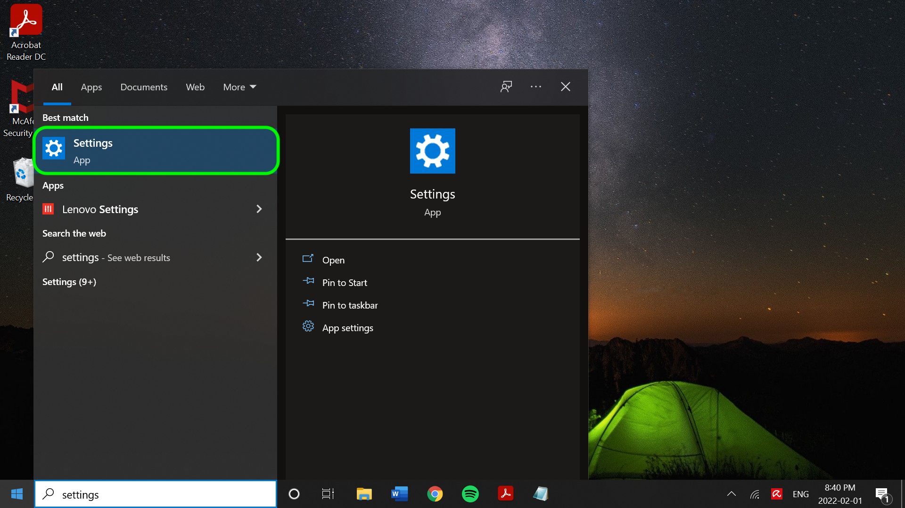

# SFTP コネクタ

Adobe Experience Platformは、AWSなどのクラウドプロバイダーにネイティブの接続を提供します。 [!DNL Google Cloud Platform]、および [!DNL Azure]を使用して、これらのシステムからデータを取り込むことができます。

クラウドストレージソースは、独自のデータを [!DNL Platform] をダウンロード、フォーマット、アップロードする必要はありません。 取り込んだデータは、XDM JSON、XDM Parquet 形式または区切り形式で書式設定できます。 プロセスのすべての手順が、ソースワークフローに統合されます。 [!DNL Platform] では、FTP または SFTP サーバーからデータをバッチで取り込むことができます。

## IP アドレスの許可リスト

ソースコネクタを操作する前に、IP アドレスのリストを許可リストに追加する必要があります。 地域固有の IP アドレスを許可リストに追加しないと、ソースを使用する際にエラーが発生したり、パフォーマンスが低下する場合があります。 詳しくは、 [IP アドレスの許可リスト](../../ip-address-allow-list.md) ページを参照してください。

## ファイルとディレクトリの命名制約

クラウドストレージファイルまたはディレクトリに名前を付ける際に考慮する必要がある制約のリストを次に示します。

- ディレクトリ名とファイルコンポーネント名は 255 文字を超えてはなりません。
- ディレクトリ名とファイル名の末尾をスラッシュ (`/`) をクリックします。 指定した場合、自動的に削除されます。
- 以下の予約 URL 文字は、適切にエスケープする必要があります。 `! ' ( ) ; @ & = + $ , % # [ ]`
- 次の文字は使用できません。 `" \ / : | < > * ?`.
- 無効な URL パス文字は使用できません。 次のようなコードポイント `\uE000`は NTFS ファイル名で有効ですが、有効な Unicode 文字ではありません。 また、制御文字（0x00 ～ 0x1F、\u0081 など）などの ASCII 文字や Unicode 文字も使用できません。 HTTP/1.1 で Unicode 文字列を規定するルールについては、 [RFC 2616、セクション 2.2:基本ルール](https://www.ietf.org/rfc/rfc2616.txt) および [RFC 3987](https://www.ietf.org/rfc/rfc3987.txt).
- 次のファイル名は使用できません。LPT1, LPT2, LPT3, LPT4, LPT5, LPT6, LPT7, LPT8, LPT9, COM1, COM2, COM3, COM4, COM5, COM6, COM8, COM9,prn、AUX、NUL、CON、CLOCK$、ドット文字 (.)、2 つのドット文字 (...)。

## 用の Base64 エンコードされた OpenSSH 秘密鍵の設定 [!DNL SFTP]

この [!DNL SFTP] ソースは、 [!DNL Base64]-encoded OpenSSH 秘密鍵。 Base64 でエンコードされた OpenSSH 秘密鍵を生成し、接続する方法については、以下の手順を参照してください [!DNL SFTP] を Platform に送信します。

### [!DNL Windows] users

を使用している場合、 [!DNL Windows] マシンを開きます。 **開始** メニューから「 **設定**.



次の **設定** 表示されるメニューで、「 」を選択します。 **アプリ**.


次に、 **オプション機能**.


オプション機能のリストが表示されます。 If **OpenSSH クライアント** は既にお使いのコンピューターにインストールされているため、 **インストールされた機能** リストの下 **オプション機能**.


インストールされていない場合は、「 」を選択します。 **インストール** そして、 **[!DNL Powershell]** 次のコマンドを実行して秘密鍵を生成します。

```shell
PS C:\Users\lucy> ssh-keygen -t rsa -m pem
Generating public/private rsa key pair.
Enter file in which to save the key (C:\Users\lucy/.ssh/id_rsa):
Enter passphrase (empty for no passphrase):
Enter same passphrase again:
Your identification has been saved in C:\Users\lucy/.ssh/id_rsa.
Your public key has been saved in C:\Users\lucy/.ssh/id_rsa.pub.
The key fingerprint is:
SHA256:osJ6Lg0TqK8nekNQyZGMoYwfyxNc+Wh0hYBtBylXuGk lucy@LAPTOP-FUJT1JEC
The key's randomart image is:
+---[RSA 3072]----+
|.=.*+B.o.        |
|=.O.O +          |
|+o+= B           |
|+o +E .          |
|.o=o  . S        |
|+... . .         |
| *o .            |
|o.B.             |
|=O..             |
+----[SHA256]-----+
```

次に、秘密鍵のファイルパスを指定して次のコマンドを実行し、秘密鍵をエンコードします。 [!DNL Base64]:

```shell
C:\Users\lucy> [convert]::ToBase64String((Get-Content -path "C:\Users\lucy\.ssh\id_rsa" -Encoding byte)) > C:\Users\lucy\.ssh\id_rsa_base64
```

上記のコマンドは、 [!DNL Base64]指定したファイルパスの —encoded 秘密鍵。 その後、その秘密鍵を使用して、 [!DNL SFTP] をクリックし、Platform に接続します。

### [!DNL Mac] ユーザー

を使用している場合、 [!DNL Mac]，開く **ターミナル** 次のコマンドを実行して秘密鍵を生成します ( この場合、秘密鍵は `/Documents/id_rsa`):

```shell
ssh-keygen -t rsa -m pem -f ~/Documents/id_rsa
Generating public/private rsa key pair.
Enter passphrase (empty for no passphrase):
Enter same passphrase again:
Your identification has been saved in /Users/vrana/Documents/id_rsa.
Your public key has been saved in /Users/vrana/Documents/id_rsa.pub.
The key fingerprint is:
SHA256:s49PCaO4a0Ee8I7OOeSyhQAGc+pSUQnRii9+5S7pp1M vrana@vrana-macOS
The key's randomart image is:
+---[RSA 2048]----+
|o ==..           |
|.+..o            |
|oo.+             |
|=.. +            |
|oo = .  S        |
|+.+ +E . = .     |
|o*..*.. . o      |
|.o*=.+   +       |
|.oo=Oo  ..o      |
+----[SHA256]-----+
```

次に、次のコマンドを実行して、で秘密鍵をエンコードします。 [!DNL Base64]:

```shell
base64 ~/Documents/id_rsa > ~/Documents/id_rsa_base64
 
 
# Print Content of base64 encoded file
cat ~/Documents/id_rsa_base64
LS0tLS1CRUdJTiBPUEVOU1NIIFBSSVZBVEUgS0VZLS0tLS0KYjNCbGJuTnphQzFyWlhrdGRqRUFBQUFBQkc1dmJtVUFBQUFFYm05dVpRQUFBQUFBQUFBQkFBQUJGd0FBQUFkemMyZ3RjbgpOaEFBQUFBd0VBQVFBQUFRRUF0cWFYczlXOUF1ZmtWazUwSXpwNXNLTDlOMU9VYklaYXVxbVM0Q0ZaenI1NjNxUGFuN244CmFxZWdvQTlCZnVnWDJsTVpGSFl5elEzbnp6NXdXMkdZa1hkdjFjakd0elVyNyt1NnBUeWRneGxrOGRXZWZsSzBpUlpYWW4KVFRwS0E5c2xXaHhjTXg3R2x5ejdGeDhWSzI3MmdNSzNqY1d1Q0VIU3lLSFR5SFFwekw0MEVKbGZJY1RGR1h1dW1LQjI5SwpEakhwT1grSDdGcG5Gd1pabTA4Uzc2UHJveTVaMndFalcyd1lYcTlyUDFhL0E4ejFoM1ZLdllzcG53c2tCcHFQSkQ1V3haCjczZ3M2OG9sVllIdnhWajNjS3ZsRlFqQlVFNWRNUnB2M0I5QWZ0SWlrYmNJeUNDaXV3UnJmbHk5eVNPQ2VlSEc0Z2tUcGwKL3V4YXNOT0h1d0FBQThqNnF6R1YrcXN4bFFBQUFBZHpjMmd0Y25OaEFBQUJBUUMycHBlejFiMEM1K1JXVG5Rak9ubXdvdgowM1U1UnNobHE2cVpMZ0lWbk92bnJlbzlxZnVmeHFwNkNnRDBGKzZCZmFVeGtVZGpMTkRlZlBQbkJiWVppUmQyL1Z5TWEzCk5TdnY2N3FsUEoyREdXVHgxWjUrVXJTSkZsZGlkTk9rb0QyeVZhSEZ3ekhzYVhMUHNYSHhVcmJ2YUF3cmVOeGE0SVFkTEkKb2RQSWRDbk12alFRbVY4aHhNVVplNjZZb0hiMG9PTWVrNWY0ZnNXbWNYQmxtYlR4THZvK3VqTGxuYkFTTmJiQmhlcjJzLwpWcjhEelBXSGRVcTlpeW1mQ3lRR21vOGtQbGJGbnZlQ3pyeWlWVmdlL0ZXUGR3cStVVkNNRlFUbDB4R20vY0gwQiswaUtSCnR3aklJS0s3Qkd0K1hMM0pJNEo1NGNiaUNST21YKzdGcXcwNGU3QUFBQUF3RUFBUUFBQVFBcGs0WllzMENSRnNRTk9WS0sKYWxjazlCVDdzUlRLRjFNenhrSGVydmpJYk9kL0lvRXpkcHlVa28rbm41RmpGK1hHRnNCUXZnOFdTaUlJTk1oU3BNYWI1agpvWXlka2gvd0ovWElOaDlZaE5QVXlURi9NNkFnMkNYd21KS2RxN1VKWjZyNjloV3V0VVN6U05QbkVYWTZLc29GeVUwTEFvCko0OHJMT1pMZldtMHFhWDBLNUgzNmJPaHFXSWJwMDNoZk94eno5M0MrSDM5MFJkRkp4bzJVZ0FVY3UvdHREb0REVldBdmEKVkVyMWEzak9LenVHbThrK21WeXpPZERjVFY4ckZIT0pwRnRBU3l6Q24yVld1MjV0TWtrcGRPRjNKcVdMZHdOY3loeG1URApXZGVDNWh4V0Fiano0WDZ5WXpHcFcwTmptVkFoWUVVZGNBSVlXWWM3OGEvQkFBQUFnRm8wakl4aGhwZkJ6QjF6b09FMDJBClpjTC9hcUNuYysrdmJ1a2V0aFg5Zzhlb0xQMTQyeUgzdlpLczl3c1RtbVVsZ0prZURaN2hUcklwOGY2eEwzdDRlMXByY1kKb2ZLd0gwckNGOTFyaldPbGZOUmxEempoR1NTTEVMczZoNlNzMEdBQXE2Z0ZQTVF2dTB4TDlQUTlGQ21YZVVKazJpRm1MWgpEWWJGc0NyVUxEQUFBQWdRRGF0a1pMamJaSTBFM0ZuY2dTOVF5Y3lVWmtkZ1dVNjBQcG9ud3BMQXdUdHRpOG1EQXE5cHYwClEvUlk1WE9UeGF3VXNHa0tYMjNtV1BYR0grdUlBSzhrelVVM2dGM1dRWGVkTWw4NHVCVFZCTEtUdStvVVAvZmIvMEE0dE0KSE9BSythbXZPMkZuYzFiSmVwd05USTE2cjZXWk9sZWV2ZklJQVpXcEgxVVpIdkVRQUFBSUVBMWNwcStDNUVXSFJwbnVPZQpiNHE4T0tKTlJhSUxIRUN6U0twWlFpZDFhRmJYWlVKUXpIQU85YzhINVZMcjBNUjFkcW1ORkNja2ZsZzI2Y3BEUEl3TjBYCm5HMFBxcmhKbXp0U3ZQZ3NGdkNPallncXF6U0RYUjkxd1JQTEN5cU8zcGMyM2kzZnp2WkhtMGhIdWdoNVJqV0loUlFZVkwKZUpDWHRqM08vY3p1SWdzQUFBQVJkbkpoYm1GQWRuSmhibUV0YldGalQxTUJBZz09Ci0tLS0tRU5EIE9QRU5TU0ggUFJJVkFURSBLRVktLS0tLQo=
```

一度 [!DNL Base64]エンコードされた秘密鍵は指定したフォルダーに保存されます。その後、公開鍵ファイルの内容を [!DNL SFTP] 認証済みキーをホストします。 コマンドラインで次のコマンドを実行します。

```shell
cat ~/id_rsa.pub >> ~/.ssh/authorized_keys
```

公開鍵が正しく追加されたかどうかを確認するには、コマンドラインで次を実行します。

```shell
more ~/.ssh/authorized_keys
```

## SFTP の接続先 [!DNL Platform]

>[!IMPORTANT]
>
>接続する前に、SFTP サーバー設定でキーボードインタラクティブ認証を無効にする必要があります。 この設定を無効にすると、サービスやプログラムを通じて入力するのではなく、パスワードを手動で入力できます。 詳しくは、 [Component Pro ドキュメント](https://doc.componentpro.com/ComponentPro-Sftp/authenticating-with-a-keyboard-interactive-authentication) を参照してください。

以下のドキュメントでは、SFTP サーバーをに接続する方法に関する情報を提供します。 [!DNL Platform] API またはユーザーインターフェイスを使用する場合：

### API の使用

- [フローサービス API を使用した SFTP ベース接続の作成](../../tutorials/api/create/cloud-storage/sftp.md)
- [フローサービス API を使用したクラウドストレージソースのデータ構造とコンテンツの調査](../../tutorials/api/explore/cloud-storage.md)
- [フローサービス API を使用して、クラウドストレージソースのデータフローを作成する](../../tutorials/api/collect/cloud-storage.md)

### UI の使用

- [UI での SFTP ソース接続の作成](../../tutorials/ui/create/cloud-storage/sftp.md)
- [UI でのクラウドストレージ接続のデータフローの作成](../../tutorials/ui/dataflow/batch/cloud-storage.md)
