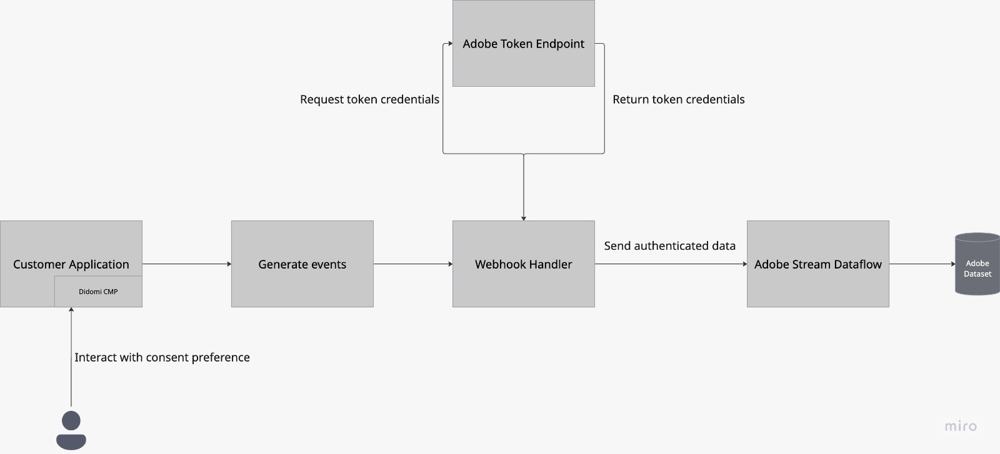
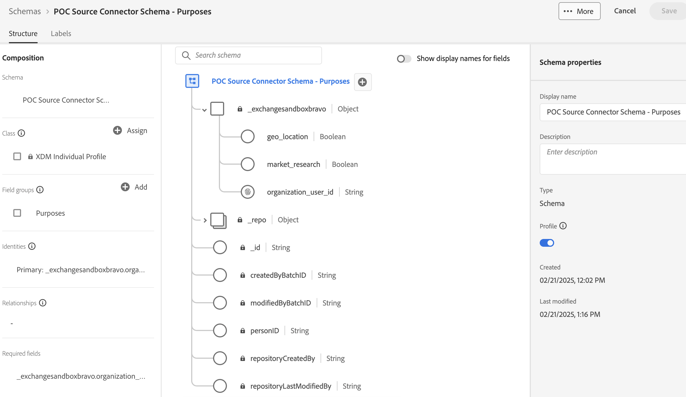
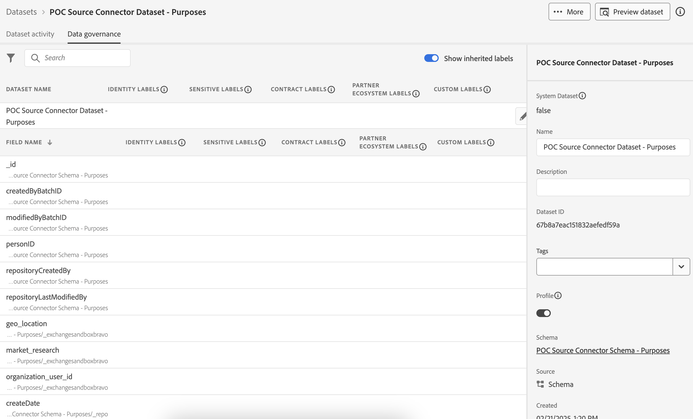
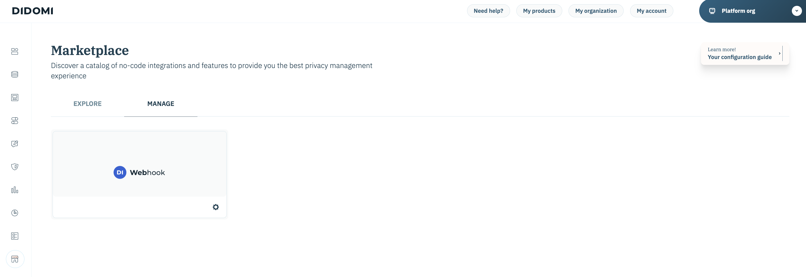

# [!DNL Didomi]

>[!AVAILABILITY]
>
>[!DNL Didomi] ソースはベータ版です。ベータ版のソースの使用について詳しくは、ソースの概要の[条件](../../home.md#terms-and-conditions)を参照してください。

[!DNL Didomi]は、組織がweb サイト、アプリ、社内ツールをまたいで、個人データに関するユーザーの選択を収集、管理、適用するのに役立つ同意および環境設定の管理プラットフォームです。

Adobe Experience Platformでは、ソースコネクタを使用して、クラウドストレージ、データベース、[!DNL Didomi]などのアプリケーションなど、幅広い外部システムからデータを取り込むことができます。 ソースを使用して外部システムを認証し、Experience Platformへのデータフローを管理します。これにより、顧客データの一貫性のある構造化された取り込みが可能になります。

[!DNL Didomi] ソースを使用して、[!DNL Didomi]の同意と環境設定の管理プラットフォームからリアルタイムのユーザー同意と環境設定データをExperience Platformにストリーミングします。 [!DNL Didomi] ソースを使用すると、Experience Platformの同意データを一元化して処理できるため、顧客プロファイルとダウンストリームのワークフローをコンプライアンスに準拠させ、最新の状態に保つことができます。

## 前提条件

[!DNL Didomi] アカウントをExperience Platformに正常に接続するには、次の前提条件の手順を実行します。

### IP アドレスの許可リスト

ソースをExperience Platformに接続する前に、リージョン固有のIP アドレスをードに追加する必要があります。 詳しくは、[Experience PlatformへのIP アドレスの許可リストに加える](../../ip-address-allow-list.md)に関するガイドを参照してください。

### Experience Platformの権限の設定

**[!UICONTROL View Sources]** アカウントをExperience Platformに接続するには、アカウントに対して&#x200B;**[!UICONTROL Manage Sources]**&#x200B;と[!DNL Didomi]の両方の権限を有効にする必要があります。 必要な権限を取得するには、製品の管理者にお問い合わせください。 詳しくは、[ アクセス制御UI ガイド ](../../../access-control/ui/overview.md)を参照してください。

### Adobe API資格情報の収集

[!DNL Didomi]をExperience Platformに安全に接続するには、Adobe API資格情報を使用して認証する必要があります。 これらの資格情報は、Webhookの設定とデータ取り込みの設定に不可欠です。

Experience Platform APIを正常に呼び出す方法について詳しくは、[Experience Platform APIの概要](../../../landing/api-authentication.md)に関するガイドを参照してください。

### Experience Platform スキーマの作成

>[!TIP]
>
>既存のXDM スキーマがある場合は、この手順をスキップできます。

**Experience Data Model （XDM）スキーマ**&#x200B;は、[!DNL Didomi]からExperience Platformに送信するデータの構造（ユーザーID、同意目的など）を定義します。

スキーマを作成するには、Experience Platform UIの左側のナビゲーションで「[!UICONTROL Schemas]」を選択し、「**[!UICONTROL Create schema]**」を選択します。 次に、スキーマタイプとして「**[!UICONTROL Standard]**」を選択し、**[!UICONTROL Manual]**」を選択してフィールドを手動で作成します。 スキーマの基本クラスを選択し、スキーマの名前を指定します。

作成したら、必須フィールドのいずれかを追加してスキーマを更新します。 1つ以上のフィールドが、プライマリ ID値についてExperience Platformに通知する[!UICONTROL Identity] フィールドであることを確認してください。 最後に、データを正常に保存するために、[!UICONTROL Profile] トグルを有効にします。

詳しくは、[UIでのスキーマの作成](../../../xdm/tutorials/create-schema-ui.md)に関するガイドを参照してください。

### データセットの作成

>[!TIP]
>
>既存のデータセットがある場合は、この手順をスキップできます。

Experience Platformの&#x200B;**データセット**&#x200B;は、定義したスキーマに基づいて受信データを保存するために使用されます。

データセットを作成するには、Experience Platform UIの左側のナビゲーションで「[!UICONTROL Datasets]」を選択し、「**[!UICONTROL Create dataset]**」を選択します。 次に、**[!UICONTROL Create dataset from schema]**&#x200B;を選択し、新しいデータセットに関連付けるスキーマを選択します。

## [!DNL Didomi] コンソールでのHTTP Webhookの設定

[!DNL Webhooks]を使用すると、ユーザーが同意設定を操作したときに[!DNL Didomi] プラットフォームでトリガーされるイベントを購読できます。 関連するイベントが発生した場合（例えば、ユーザーが同意を与えたり取り消したりした場合）、[!DNL Didomi]は、JSON ペイロードを含むリアルタイムのHTTP POST リクエストを、設定された[!DNL webhook] エンドポイントに送信します。

Experience Platformとの互換性を確保するには、Webhookが次の要件を満たしている必要があります。

| フィールド | 説明 | 例 |
| --- | --- | --- |
| クライアントシークレット | Adobe API資格情報に関連付けられた秘密鍵。 | `d8f3b2e1-4c9a-4a7f-9b2e-8f1c3d2a1b6e` |
| API キー | Adobe サービスへのリクエストの認証に使用される公開API キー。 |  |
| 付与タイプ | アプリケーションが認証サーバーからアクセストークンを取得する方法。 この値を`client_credentials`に設定します。 | `client_credentials` |
| 範囲 | 認証スコープは、アプリケーションがAPI プロバイダーに要求する特定の権限またはアクセスレベルを定義します。 | `openid,AdobeID,read_organizations,additional_info.projectedProductContext,session` |
| 認証ヘッダー | Adobe トークンリクエストに必要な追加ヘッダー。 | `{"Content-type": "application/x-www-form-urlencoded"}` |
| トークン URL | Adobeトークンエンドポイント。 | `https://ims-na1.adobelogin.com/ims/token/v3` |
| エンドポイント URL | 最後のAdobe コネクタ URL （設定の最後に提供）。 | `https://dcs.adobedc.net/collection/your-adobe-endpoint-id` |

{style="table-layout:auto"}

次に、次のオプションを[!DNL webhook]に設定します。

| フィールド | 説明 | 値 |
| ---| --- | --- |
| リクエストヘッダー | [!DNL webhook]のカスタム ヘッダー。 `x-adobe-flow-id`が含まれていることを確認してください。 この値は、[ データフローの作成後に取得できます](../../tutorials/ui/create/consent-and-preferences/didomi.md#retrieve-the-streaming-endpoint-url)。 | `{"Content-Type": "application/json", "Cache-Control": "no-cache", "x-adobe-flow-id": "{DATAFLOW_ID}"}` |
| 分割・統合 | このプロパティは、[!DNL webhook] データがフラットオブジェクトとして送信されることを保証するため、チェックする必要があります。 | 有効 |
| イベントタイプ | [!DNL Didomi]をトリガーにする`event.*` イベント （`user.*`または[!DNL webhook]）の特定のグループを選択します。 `event.*`を使用して同意または環境設定の変更を追跡し、`user.*`を使用してユーザープロファイルの更新を追跡します。 この選択は、互換性のあるイベントのみがAdobeに送信されるようにするために必要です。 Adobeでは、データフローごとに1つのスキーマしかサポートされていないため、両方のイベントタイプを選択すると、取り込みエラーが発生する可能性があります。 | サポートされるイベントタイプのリストは次のとおりです。 <ul><li>`Event.created`</li><li>`Event.updated`</li><li>`Event.deleted`</li><li>`User.created`</li><li>`User.updated`</li><li>`User.deleted`</li></ul> |

### サンプルペイロードファイルのダウンロード {#download-the-sample-payload-file}

選択したイベントグループに基づいて、適切な&#x200B;**サンプルペイロードファイル**&#x200B;を[!DNL Didomi] コンソールから直接ダウンロードします。 このファイルはデータの構造を表し、Adobeのスキーマとマッピングステップで使用されます。

| **イベントグループ** | **ダウンロードするサンプルファイル** | **フィルターオプション** |
| --- | ---| --- |
| `event.*` | `event.created`のサンプルをダウンロード | `event.*`件のイベントのみをフィルタリング |
| `user.*` | `user.created`のサンプルをダウンロード | `user.*`件のイベントのみをフィルタリング |

## [!DNL Didomi] アカウントをExperience Platformに接続する

ソース接続を作成し、[からExperience Platformに同意と環境設定データを取り込む方法については、 [!DNL Didomi] Experience Platformへの](../../tutorials/ui/create/consent-and-preferences/didomi.md)接続[!DNL Didomi]に関するガイドをご覧ください。
