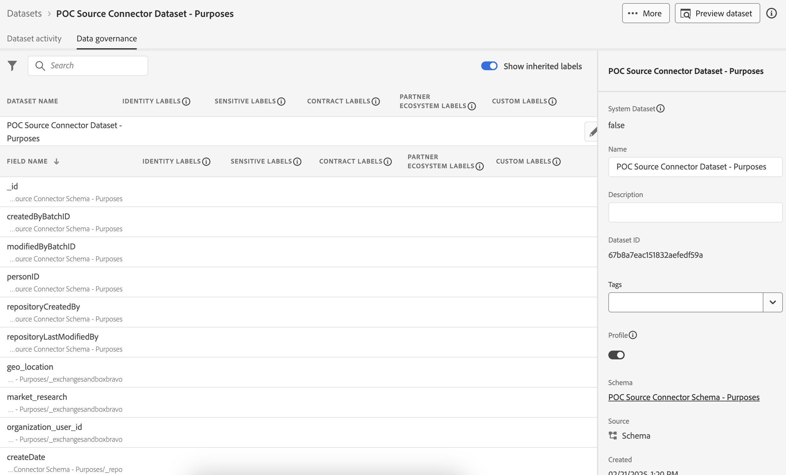

# [!DNL Didomi]

>[!AVAILABILITY]
>
>[!DNL Didomi] ソースはベータ版です。ベータラベル付きソースの使用について詳しくは、ソースの概要の [ 利用条件 ](../../home.md#terms-and-conditions) を参照してください。

[!DNL Didomi] は、組織が web サイト、アプリ、内部ツールをまたいで個人データに関するユーザーの選択を収集、管理、適用するのに役立つ、同意および環境設定管理プラットフォームです。

Adobe Experience Platformは、ソースコネクタのシステムを介して、クラウドストレージ、データベース、[!DNL Didomi] のようなアプリケーションなど、様々な外部システムからのデータ取り込みをサポートしています。 ソースを使用して外部システムを認証し、Experience Platformへのデータフローを管理し、顧客データの一貫性のある構造化された取り込みを確保します。

[!DNL Didomi] ソースを使用すると、ユーザーの同意および環境設定に関するリアルタイムのデータを [!DNL Didomi] の同意および環境設定管理プラットフォームからExperience Platformにストリーミングできます。 [!DNL Didomi] ソースを通じて、Experience Platformで同意データを一元化して処理できるので、顧客プロファイルとダウンストリームワークフローを準拠させ、最新の状態に保つことができます。

## 前提条件

[!DNL Didomi] アカウントをExperience Platformに正常に接続するには、以下に説明する前提条件の手順を実行してください。

### IP アドレスの許可リスト

ソースをExperience Platformに接続する前に、地域固有の IP アドレスを許可リストに追加する必要があります。 詳しくは、[Experience Platformへの接続に対する IP アドレスの許可リストに加える](../../ip-address-allow-list.md) に関するガイドを参照してください。

### Experience Platformに対する権限の設定

**[!UICONTROL アカウントをExperience Platformに接続するには、アカウントで]** ソースの表示 **[!UICONTROL および]** ソースの管理 [!DNL Didomi] 権限の両方が有効になっている必要があります。 必要な権限を取得するには、製品管理者にお問い合わせください。 詳しくは、[ アクセス制御 UI ガイド ](../../../access-control/ui/overview.md) を参照してください。

### Adobe API 資格情報の収集

[!DNL Didomi] をExperience Platformに安全に接続するには、Adobe API 資格情報を使用して認証する必要があります。 これらの資格情報は、Webhook の設定とデータ取り込みの設定に不可欠です。

Experience Platform API を正常に呼び出す方法については、[Experience Platform API の概要 ](../../../landing/api-authentication.md) に関するガイドを参照してください。

### Experience Platform スキーマの作成

>[!TIP]
>
>既存の XDM スキーマがある場合は、この手順をスキップできます。

**エクスペリエンスデータモデル（XDM）スキーマ** は、[!DNL Didomi] ーザーからExperience Platformに送信するデータの構造（ユーザー ID、同意目的など）を定義します。

スキーマを作成するには、Experience Platform UI の左側のナビゲーションで「[!UICONTROL  スキーマ ]」を選択し、「**[!UICONTROL スキーマを作成]**」を選択します。 次に、スキーマタイプとして **[!UICONTROL 標準]** を選択し、次に **[!UICONTROL 手動]** を選択して、フィールドを手動で作成します。 スキーマの基本クラスを選択し、スキーマの名前を指定します。

作成したら、必須フィールドを追加してスキーマを更新します。 少なくとも 1 つのフィールドが、プライマリ ID 値についてExperience Platformに通知する [!UICONTROL ID] フィールドであることを確認してください。 最後に、データを正常に保存するために、「[!UICONTROL  プロファイル ]」トグルを有効になっていることを確認します。

詳しくは、[UI でのスキーマの作成 ](../../../xdm/tutorials/create-schema-ui.md) に関するガイドを参照してください。

### データセットの作成

>[!TIP]
>
>既存のデータセットが既にある場合は、この手順をスキップできます。

Experience Platformの **データセット** は、定義したスキーマに基づいて受信データを保存するために使用されます。

データセットを作成するには、Experience Platform UI の左側のナビゲーションで [!UICONTROL  データセット ] を選択してから、「**[!UICONTROL データセットを作成]**」を選択します。 次に、「**[!UICONTROL スキーマからデータセットを作成]**」を選択し、新しいデータセットに関連付けるスキーマを選択します。

## [!DNL Didomi] コンソールで HTTP Webhook を設定します

[!DNL Webhooks] を使用すると、ユーザーが同意環境設定で操作する際に、[!DNL Didomi] platform でトリガーされるイベントを登録できます。 関連するイベントが発生すると（ユーザーが同意の付与や取り消しを行った場合など）、[!DNL Didomi] は、設定された [!DNL webhook] エンドポイントに JSON ペイロードを含むリアルタイム HTTP POST リクエストを送信します。

Experience Platformとの互換性を確保するには、Webhook が次の要件を満たしている必要があります。

| フィールド | 説明 | 例 |
| --- | --- | --- | 
| クライアントシークレット | Adobe API 資格情報に関連付けられた秘密鍵。 | `d8f3b2e1-4c9a-4a7f-9b2e-8f1c3d2a1b6e` |
| API キー | Adobe サービスへのリクエストの認証に使用される公開 API キー。 |
| 付与タイプ | アプリケーションが認証サーバーからアクセストークンを取得する方法。 この値を `client_credentials` に設定します。 | `client_credentials` |
| 範囲 | 認証範囲は、アプリケーションが API プロバイダーにリクエストする特定の権限またはアクセスレベルを定義します。 | `openid,AdobeID,read_organizations,additional_info.projectedProductContext,session` |
| 認証ヘッダー | Adobe トークンリクエストに必要な追加ヘッダー。 | `{"Content-type": "application/x-www-form-urlencoded"}` |
| トークン URL | Adobe トークンエンドポイント。 | `https://ims-na1.adobelogin.com/ims/token/v3` |
| エンドポイント URL | 最終的なAdobe コネクタ URL （セットアップの最後に提供されます）。 | `https://dcs.adobedc.net/collection/your-adobe-endpoint-id` |

{style="table-layout:auto"}

次に、[!DNL webhook] ークフローに次のオプションを設定します。

| フィールド | 説明 | 値 |
| ---| --- | --- | 
| リクエストヘッダー | [!DNL webhook] のカスタムヘッダー。 必ず `x-adobe-flow-id` を含めてください。 この値は、[ データフローが作成 ](../../tutorials/ui/create/consent-and-preferences/didomi.md#retrieve-the-streaming-endpoint-url) された後に取得できます。 | `{"Content-Type": "application/json", "Cache-Control": "no-cache", "x-adobe-flow-id": "{DATAFLOW_ID}"}` |
| Flatten | [!DNL webhook] データがフラットなオブジェクトとして送信されるので、このプロパティをオンにする必要があります。 | 有効 |
| イベントタイプ | [!DNL Didomi] をトリガーする `event.*` イベントのグループ （`user.*` または [!DNL webhook]）を選択します。 `event.*` を使用して同意または環境設定の変更を追跡し、`user.*` を使用してユーザープロファイルの更新を追跡します。 この選択項目は、互換性のあるイベントのみをAdobeに送信するために必要です。 Adobeはデータフローごとに 1 つのスキーマのみをサポートするので、両方のイベントタイプを選択すると、取り込みエラーが発生する可能性があります。 | サポートされているイベントタイプのリストを以下に示します。 <ul><li>`Event.created`</li><li>`Event.updated`</li><li>`Event.deleted`</li><li>`User.created`</li><li>`User.updated`</li><li>`User.deleted`</li></ul> |

### サンプルペイロードファイルをダウンロードします。 {#download-the-sample-payload-file}

選択したイベントグループに応じて、適切な **サンプルペイロードファイル** を [!DNL Didomi] Console から直接ダウンロードします。 このファイルは、データの構造を表し、Adobeのスキーマおよびマッピング手順で使用されます。

| **イベントグループ** | **ダウンロードするサンプルファイル** | **フィルターオプション** |
| --- | ---| --- |
| `event.*` | `event.created` のサンプルをダウンロードします | `event.*` イベントにのみフィルター |
| `user.*` | `user.created` のサンプルをダウンロードします | `user.*` イベントにのみフィルター |

## [!DNL Didomi] アカウントのExperience Platformへの接続

ソース接続を作成し、[ からExperience Platformに同意データと環境設定データを取り込む方法については、 [!DNL Didomi] ](../../tutorials/ui/create/consent-and-preferences/didomi.md) Experience Platformへの接続 [!DNL Didomi] に関するガイドを参照してください。
