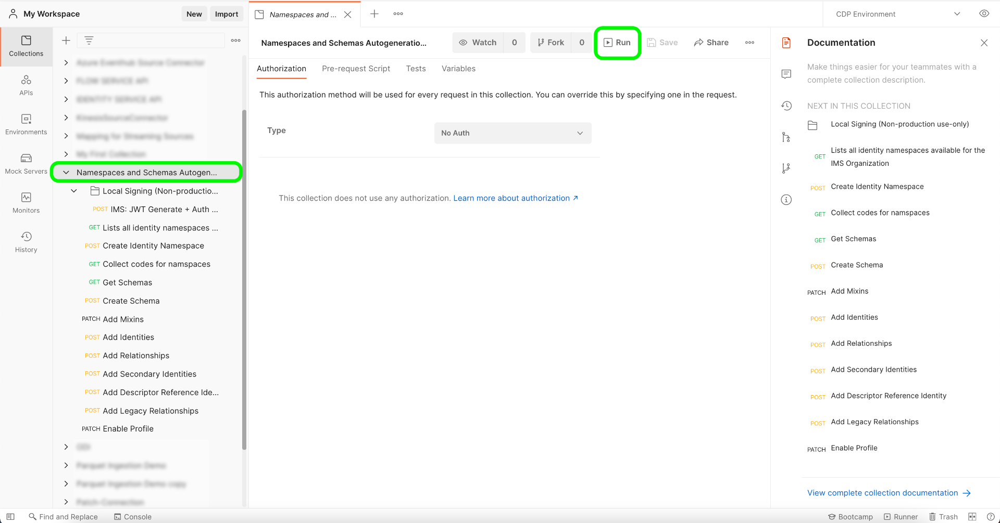
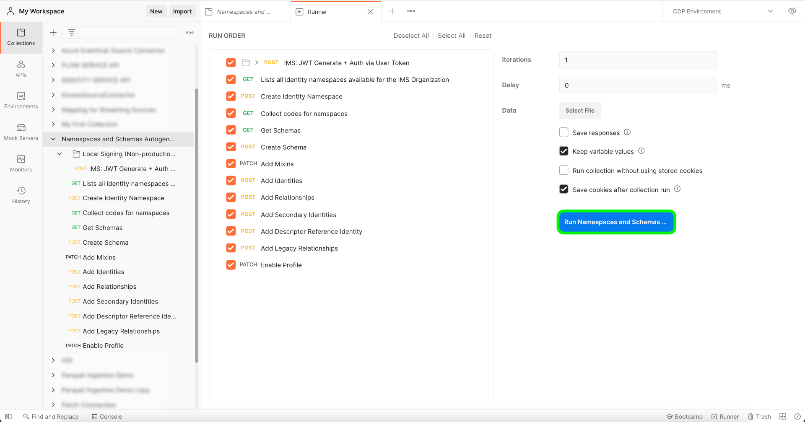

# [!DNL Salesforce]

>[!IMPORTANT]
>
>Amazon Web Services（AWS）でAdobe Experience Platformを実行する際に、[!DNL Salesforce] ソースを使用できるようになりました。 AWS上で動作するExperience Platformは、現在、一部のお客様にご利用いただけます。 サポートされているExperience Platform インフラストラクチャについて詳しくは、[Experience Platform マルチクラウドの概要](../../../landing/multi-cloud.md)を参照してください。

Adobe Experience Platform を使用すると、データを外部ソースから取得しながら、Experience Platform サービスを使用して、受信データの構造化、ラベル付け、拡張を行うことができます。 アドビのアプリケーション、クラウドベースのストレージ、データベースなど、様々なソースからデータを取り込むことができます。

Experience Platform は、サードパーティの CRM システムからのデータ取り込みをサポートしています。 CRM プロバイダーのサポートは [!DNL Salesforce] を含みます。

## AzureでExperience Platformの[!DNL Salesforce] ソースを設定する {#azure}

AzureでExperience Platformの[!DNL Salesforce] アカウントを設定する方法については、次の手順に従ってください。

### AZUREに接続するためのIP アドレスの許可リスト

Azure上のExperience Platformにソースを接続する前に、リージョン固有のIP アドレスを許可リストに追加する必要があります。 地域に固有のIP アドレスをYoutube 許可リストに追加しないと、ソースを使用する際にエラーまたはパフォーマンスが低下する可能性があります。 詳しくは、[IP アドレスの許可リスト](../../ip-address-allow-list.md) ページを参照してください。

>[!BEGINTABS]

>[!TAB VA7]

- `40.70.226.96/28`
- `40.70.226.32/28`
- `52.232.229.255`
- `52.232.229.253`
- `40.70.226.144/28`
- `40.70.226.64/28`
- `40.70.225.240/28`
- `40.70.225.224/28`
- `40.70.224.64/29`
- `40.70.226.80/28`
- `40.70.226.176/28`
- `52.232.229.230`
- `40.70.226.128/28`
- `40.70.226.0/28`
- `40.70.226.16/28`
- `52.138.119.167`
- `40.70.226.160/28`
- `40.70.226.192/28`
- `40.70.226.48/28`
- `20.96.243.176`
- `40.70.226.112/28`
- `40.70.226.208/28`

>[!TAB NLD2]

- `40.74.4.144/28`
- `40.74.3.176/28`
- `40.74.5.128/28`
- `40.74.4.176/28`
- `40.74.6.112/28`
- `40.74.7.128/28`
- `40.74.6.144/28`
- `51.105.144.81`
- `52.142.236.87`
- `40.74.6.80/28`
- `20.101.246.9`
- `40.74.7.208/28`
- `40.74.6.128/28`
- `40.74.7.176/28`
- `51.124.70.4`
- `40.74.7.144/28`
- `108.141.12.47`
- `20.50.23.153`
- `51.144.184.248/29`
- `40.74.7.160/28`
- `40.74.7.192/28`
- `51.105.144.1`
- `40.74.4.160/28`
- `40.74.6.96/28`

>[!TAB AUS5]

- `20.43.111.32/28`
- `20.43.110.144/28`
- `20.53.111.113`
- `20.227.32.175`
- `20.43.110.96/28`
- `20.43.110.64/28`
- `20.193.56.144/28`
- `20.43.110.192/28`
- `20.43.97.95`
- `20.43.111.16/28`
- `20.43.110.128/28`
- `20.40.185.111`
- `20.193.56.160/28`
- `20.43.110.112/28`
- `40.82.220.111`
- `20.43.111.0/28`
- `20.193.38.208/28`
- `20.43.110.80/28`
- `20.43.110.176/28`
- `20.43.110.48/28`
- `20.193.36.37`
- `20.43.110.208/28`
- `20.43.110.224/28`
- `20.43.110.160/28`
- `20.40.185.225`
- `20.43.110.240/28`
- `20.193.56.128/28`
- `20.40.185.185`

>[!TAB CAN2]

- `20.116.159.48/28`
- `20.116.159.144/28`
- `20.116.159.96/28`
- `20.220.243.238`
- `20.116.159.80/28`
- `20.116.159.32/28`
- `20.151.241.138`
- `4.172.28.20`
- `20.151.241.124`
- `20.116.248.0/28`
- `20.116.155.128/28`
- `20.116.159.64/28`
- `20.116.159.192/28`
- `20.116.159.176/28`
- `20.116.175.240/28`
- `20.116.248.16/28`
- `20.116.158.240/28`
- `20.116.159.112/28`
- `20.151.240.247`
- `20.151.241.173`
- `20.116.159.128/28`
- `20.116.159.160/28`
- `20.116.159.0/28`
- `20.104.5.248`
- `20.116.175.224/28`
- `20.116.159.208/28`
- `20.116.159.224/28`

>[!TAB GBR9]

- `20.162.155.16/28`
- `20.162.154.96/28`
- `20.26.64.0/28`
- `20.26.64.96/28`
- `20.162.154.64/28`
- `20.108.200.27`
- `20.162.154.80/28`
- `20.162.153.192/28`
- `20.108.200.61`
- `20.162.154.48/28`
- `20.162.154.192/28`
- `20.162.154.0/28`
- `20.26.64.16/28`
- `20.162.154.112/28`
- `20.162.153.32/28`
- `20.254.80.141`
- `20.162.153.208/28`
- `20.108.203.20`
- `20.26.64.48/28`
- `20.162.154.240/28`
- `20.162.154.208/28`
- `20.162.154.160/28`
- `20.108.205.182`
- `20.108.202.198`
- `20.162.154.32/28`
- `20.162.153.16/28`

>[!TAB IND2]

- `4.188.92.84`
- `4.224.5.224/28`
- `4.224.7.32/28`
- `4.188.92.87`
- `4.188.89.92`
- `4.224.5.112/28`
- `4.224.6.80/28`
- `4.224.144.224/28`
- `4.224.144.240/28`
- `4.224.6.96/28`
- `4.188.89.255`
- `4.188.94.32/28`
- `4.224.5.96/28`
- `4.224.6.64/28`
- `4.224.7.48/28`
- `4.224.5.208/28`
- `4.188.90.65`
- `4.224.6.16/28`
- `4.224.6.0/28`
- `4.224.5.192/28`
- `4.224.7.16/28`
- `4.188.90.67`
- `4.188.90.17`
- `4.188.94.48/28`
- `4.224.6.112/28`
- `4.224.5.240/28`
- `4.224.7.0/28`

>[!ENDTABS]

### [!DNL Salesforce]からXDMへのフィールドマッピング

[!DNL Salesforce]とExperience Platformの間にソース接続を確立するには、[!DNL Salesforce] ソースデータフィールドをExperience Platformに取り込む前に、適切なターゲット XDM フィールドにマッピングする必要があります。

[!DNL Salesforce] データセットとExperience Platform間のフィールドマッピングルールについて詳しくは、次を参照してください。

- [連絡先](../adobe-applications/mapping/salesforce.md#contact)
- [リード](../adobe-applications/mapping/salesforce.md#lead)
- [アカウント](../adobe-applications/mapping/salesforce.md#account)
- [商談](../adobe-applications/mapping/salesforce.md#opportunity)
- [商談連絡先の役割](../adobe-applications/mapping/salesforce.md#opportunity-contact-role)
- [キャンペーン](../adobe-applications/mapping/salesforce.md#campaign)
- [キャンペーンメンバー](../adobe-applications/mapping/salesforce.md#campaign-member)
- [アカウント連絡先の関係](../adobe-applications/mapping/salesforce.md#account-contact-relation)

### [!DNL Salesforce]名前空間とスキーマ自動生成ユーティリティの設定

[!DNL Salesforce] ソースを[!DNL B2B-CDP]の一部として使用するには、まず[!DNL Postman] ユーティリティを設定して[!DNL Salesforce]名前空間とスキーマを自動生成する必要があります。 次のドキュメントでは、[!DNL Postman] ユーティリティの設定に関する追加情報を提供しています。

- 名前空間とスキーマ自動生成ユーティリティのコレクションと環境は、この[GitHub リポジトリ &#x200B;](https://github.com/adobe/experience-platform-postman-samples/tree/master/Postman%20Collections/CDP%20Namespaces%20and%20Schemas%20Utility)からダウンロードできます。
- 必要なヘッダーの値を収集し、サンプル API呼び出しを読み取る方法など、Experience Platform APIの使用方法について詳しくは、[Experience Platform APIの概要](../../../landing/api-guide.md)に関するガイドを参照してください。
- Experience Platform APIの資格情報を生成する方法について詳しくは、[Experience Platform APIの認証とアクセス &#x200B;](../../../landing/api-authentication.md)に関するチュートリアルを参照してください。
- Experience Platform API用の[!DNL Postman]の設定方法について詳しくは、[開発者向けコンソールの設定および [!DNL Postman]](../../../landing/postman.md)に関するチュートリアルを参照してください。

Experience Platform開発者コンソールと[!DNL Postman]の設定が完了したら、[!DNL Postman]環境に適切な環境値を適用できるようになりました。

+++変数テーブルガイドを表示する

次の表は、値の例と、[!DNL Postman]環境の入力に関する追加情報を示しています。

| 変数 | 説明 | 例 |
| --- | --- | --- |
| `CLIENT_SECRET` | `{ACCESS_TOKEN}`の生成に使用される一意のID。 `{CLIENT_SECRET}`の取得方法について詳しくは、[Experience Platform APIの認証とアクセス &#x200B;](../../../landing/api-authentication.md)に関するチュートリアルを参照してください。 | `{CLIENT_SECRET}` |
| `JWT_TOKEN` | JSON Web トークン （JWT）は、{ACCESS_TOKEN}の生成に使用される認証資格情報です。 `{JWT_TOKEN}`の生成方法について詳しくは、[Experience Platform APIの認証とアクセス &#x200B;](../../../landing/api-authentication.md)に関するチュートリアルを参照してください。 | `{JWT_TOKEN}` |
| `API_KEY` | Experience Platform APIへの呼び出しを認証するために使用される一意のID。 `{API_KEY}`の取得方法について詳しくは、[Experience Platform APIの認証とアクセス &#x200B;](../../../landing/api-authentication.md)に関するチュートリアルを参照してください。 | `c8d9a2f5c1e03789bd22e8efdd1bdc1b` |
| `ACCESS_TOKEN` | Experience Platform APIへの呼び出しを完了するために必要な認証トークン。 `{ACCESS_TOKEN}`の取得方法について詳しくは、[Experience Platform APIの認証とアクセス &#x200B;](../../../landing/api-authentication.md)に関するチュートリアルを参照してください。 | `Bearer {ACCESS_TOKEN}` |
| `META_SCOPE` | [!DNL Marketo]に関しては、この値は固定され、常に`ent_dataservices_sdk`に設定されます。 | `ent_dataservices_sdk` |
| `CONTAINER_ID` | `global` コンテナには、標準のAdobeおよびExperience Platform パートナーが提供するすべてのクラス、スキーマフィールドグループ、データタイプ、スキーマが格納されます。 [!DNL Marketo]に関しては、この値は固定され、常に`global`に設定されます。 | `global` |
| `PRIVATE_KEY` | Experience Platform APIに対する[!DNL Postman] インスタンスの認証に使用される資格情報。 {PRIVATE_KEY}の取得方法については、「開発者向けコンソールの設定」および「[開発者向けコンソールの設定」のチュートリアルおよび「 [!DNL Postman]](../../../landing/postman.md)」を参照してください。 | `{PRIVATE_KEY}` |
| `TECHNICAL_ACCOUNT_ID` | Adobe I/Oへの統合に使用する資格情報。 | `D42AEVJZTTJC6LZADUBVPA15@techacct.adobe.com` |
| `IMS` | Identity Management System （IMS）は、Adobe サービスに認証のためのフレームワークを提供します。 [!DNL Marketo]に関しては、この値は固定され、常に`ims-na1.adobelogin.com`に設定されます。 | `ims-na1.adobelogin.com` |
| `IMS_ORG` | 製品やサービスを所有またはライセンス供与し、そのメンバーへのアクセスを許可できる法人。 `{ORG_ID}`情報の取得方法については、[開発者向けコンソールの設定と [!DNL Postman]](../../../landing/postman.md)に関するチュートリアルを参照してください。 | `ABCEH0D9KX6A7WA7ATQE0TE@adobeOrg` |
| `SANDBOX_NAME` | 使用している仮想サンドボックスパーティションの名前。 | `prod` |
| `TENANT_ID` | 作成するリソースが適切な名前空間で構成され、組織内に含まれていることを確認するために使用されるID。 | `b2bcdpproductiontest` |
| `PLATFORM_URL` | API呼び出しを行うURL エンドポイント。 この値は固定されており、常に`http://platform.adobe.io/`に設定されます。 | `http://platform.adobe.io/` |
| `munchkinId` | [!DNL Marketo] アカウントの一意のID。 `munchkinId`の取得方法について詳しくは、[&#x200B; インスタンスの認証 [!DNL Marketo] に関するチュートリアルを参照してください。](../adobe-applications/marketo/marketo-auth.md) | `123-ABC-456` |
| `sfdc_org_id` | [!DNL Salesforce] アカウントの組織ID。 [!DNL Salesforce]組織IDの取得について詳しくは、次の[[!DNL Salesforce]  ガイド &#x200B;](https://help.salesforce.com/articleView?id=000325251&type=1&mode=1)を参照してください。 | `00D4W000000FgYJUA0` |
| `has_abm` | [!DNL Marketo Account-Based Marketing]を購読しているかどうかを示すブール値。 | `false` |
| `has_msi` | [!DNL Marketo Sales Insight]を購読しているかどうかを示すブール値。 | `false` |

{style="table-layout:auto"}

+++

### スクリプトの実行

[!DNL Postman] コレクションと環境を設定したら、[!DNL Postman] インターフェイスを使用してスクリプトを実行できるようになりました。

[!DNL Postman] インターフェイスで、自動生成ユーティリティのルート フォルダーを選択し、上部ヘッダーから&#x200B;**[!DNL Run]**&#x200B;を選択します。



[!DNL Runner] インターフェイスが表示されます。 ここから、すべてのチェックボックスが選択されていることを確認し、**[!DNL Run Namespaces and Schemas Autogeneration Utility]**&#x200B;を選択します。



リクエストが成功すると、ベータ仕様に従ってB2B名前空間とスキーマが作成されます。

## Amazon Web ServicesでExperience Platformの[!DNL Salesforce] ソースを設定する {#aws}

>[!AVAILABILITY]
>
>この節は、Amazon Web Services（AWS）で動作するExperience Platformの実装に適用されます。 AWS上で動作するExperience Platformは、現在、一部のお客様にご利用いただけます。 サポートされているExperience Platform インフラストラクチャについて詳しくは、[Experience Platform マルチクラウドの概要](../../../landing/multi-cloud.md)を参照してください。

Amazon Web Services （AWS）でExperience Platformの[!DNL Salesforce] アカウントを設定する方法については、次の手順に従ってください。

### 前提条件

[!DNL Salesforce] アカウントをAWS リージョンのExperience Platformに接続するには、次の条件を満たす必要があります。

- API アクセスを持つ[!DNL Salesforce] アカウント。
- JWT_BEARER OAuth フローを有効にするために使用できる[!DNL Salesforce Connected App]です。
- データへのアクセスに必要な[!DNL Salesforce]の権限。

### AWSでの接続用IP アドレスの許可リストに加える

AWS上のExperience Platformにソースを接続する前に、リージョン固有のIP アドレスを許可リストに追加する必要があります。 詳しくは、[AWS上のExperience Platformに接続するためのIP アドレスの許可リストに加える](../../ip-address-allow-list.md)に関するガイドを参照してください。

### [!DNL Salesforce Connected App]を作成

最初に、以下を使用して、PEM ファイルの証明書/キーペアを作成します。

```shell
openssl req -newkey rsa:4096 -new -nodes -x509 -days 3650 -keyout key.pem -out cert.pem  
```

1. [!DNL Salesforce] ダッシュボードで、設定を選択します（） **[!DNL Setup]**&#x200B;を選択します。
2. [!DNL App Manager]に移動し、**[!DNL New Connection App]**&#x200B;を選択します。
3. アプリの名前を指定し、残りのフィールドを自動入力できるようにします。
4. [!DNL Enable OAuth Settings]のボックスを有効にします。
5. コールバック URLを設定します。 これはJWTには使用されないので、`https://localhost`を使用できます。
6. [!DNL Use Digital Signatures]のボックスを有効にします。
7. 前に作成したcert.pem ファイルをアップロードします。

#### 必要な権限を追加

次の権限を追加します。

1. API （api）によるユーザーデータの管理
2. カスタム権限へのアクセス（custom_permissions）
3. ID URL サービス（ID、プロファイル、電子メール、アドレス、電話）にアクセスする
4. 一意のID （openid）へのアクセス
5. いつでもリクエストを実行できます（refresh_token、offline_access）

権限が追加されたら、**[!DNL Issue JSON Web Token (JWT)-based access tokens for named user]**&#x200B;のボックスを有効にしてください。

次に、**[!DNL Save]**、**[!DNL Continue]**、**[!DNL Manage Customer Details]**&#x200B;の順に選択します。 消費者の詳細パネルを使用して、次の情報を取得します。

- **コンシューマーキー**: [!DNL Salesforce] アカウントをExperience Platformに認証する際に、後でこのコンシューマーキーをクライアント IDとして使用します。
- **Consumer secret**：後で[!DNL Salesforce] アカウントをExperience Platformに認証する際に、このConsumer secretをクライアント IDとして使用します。

### 接続されたアプリへの[!DNL Salesforce] ユーザーの認証

以下の手順に従って、Connected Appを使用する認証を取得します。

1. **[!DNL Manage Connected Apps]**&#x200B;に移動します。
2. **[!DNL Edit]** を選択します。
3. **[!DNL Permitted Users]**&#x200B;を&#x200B;**[!DNL Admin approved users are pre-authorized]**&#x200B;として設定し、**[!DNL Save]**&#x200B;を選択します。
4. **[!DNL Settings]> [!DNL Manage Users] >[!DNL Profiles]**&#x200B;に移動します。
5. ユーザーに関連付けられているプロファイルを編集します。
6. **[!DNL Connected App Access]**&#x200B;に移動し、前の手順で作成したアプリを選択します。

### JWT ベアラートークンの生成

JWT ベアラートークンを生成するには、次の手順に従います。

#### キーペアをpkcs12に変換

JWT ベアラートークンを生成するには、まず次のコマンドを使用して、証明書/キーペアをpkcs12形式に変換する必要があります。 この手順では、プロンプトが表示されたら、**書き出しパスワード**&#x200B;を設定する必要もあります。

```shell
openssl pkcs12 -export -in cert.pem -inkey key.pem -name jwtcert >jwtcert.p12
```

#### pkcs12に基づくJava キーストアの作成

次に、次のコマンドを使用して、生成したpkcs12に基づいてJava キーストアを作成します。 この手順では、プロンプトが表示されたら、**宛先キーストアパスワードを設定**&#x200B;する必要もあります。 さらに、以前の書き出しパスワードをソースキーストアパスワードとして指定する必要があります。

```shell
keytool -importkeystore -srckeystore jwtcert.p12 -destkeystore keystore.jks -srcstoretype pkcs12 -alias jwtcert
```

#### keystroke.jksにjwtcert エイリアスが含まれていることを確認します

次に、follow コマンドを使用して、`keystroke.jks`に`jwtcert` エイリアスが含まれていることを確認します。 この手順では、前の手順で生成した宛先キーストアパスワードを指定するように求められます。

```shell
keytool -keystore keystore.jks -list
```

#### 署名済みトークンを生成

最後に、以下のJava クラス JWTExampleを使用して、署名済みトークンを生成します。

```java
package org.example;
 
import org.apache.commons.codec.binary.Base64;
 
import java.io.*;
import java.security.*;
import java.text.MessageFormat;
 
public class Main {
 
    public static void main(String[] args) {
 
        String header = "{\"alg\":\"RS256\"}";
        String claimTemplate = "'{'\"iss\": \"{0}\", \"sub\": \"{1}\", \"aud\": \"{2}\", \"exp\": \"{3}\"'}'";
 
        try {
            StringBuffer token = new StringBuffer();
 
            //Encode the JWT Header and add it to our string to sign
            token.append(Base64.encodeBase64URLSafeString(header.getBytes("UTF-8")));
 
            //Separate with a period
            token.append(".");
 
            //Create the JWT Claims Object
            String[] claimArray = new String[5];
            claimArray[0] = "{CLIENT_ID}";
            claimArray[1] = "{AUTHORIZED_SALESFORCE_USERNAME}";
            claimArray[2] = "{SALESFORCE_LOGIN_URL}";
            claimArray[3] = Long.toString((System.currentTimeMillis() / 1000) + 2629746*4);
            MessageFormat claims;
            claims = new MessageFormat(claimTemplate);
            String payload = claims.format(claimArray);
 
            //Add the encoded claims object
            token.append(Base64.encodeBase64URLSafeString(payload.getBytes("UTF-8")));
 
            //Load the private key from a keystore
            KeyStore keystore = KeyStore.getInstance("JKS");
            keystore.load(new FileInputStream("path/to/keystore"), "keystorepassword".toCharArray());
            PrivateKey privateKey = (PrivateKey) keystore.getKey("jwtcert", "privatekeypassword".toCharArray());
 
            //Sign the JWT Header + "." + JWT Claims Object
            Signature signature = Signature.getInstance("SHA256withRSA");
            signature.initSign(privateKey);
            signature.update(token.toString().getBytes("UTF-8"));
            String signedPayload = Base64.encodeBase64URLSafeString(signature.sign());
 
            //Separate with a period
            token.append(".");
 
            //Add the encoded signature
            token.append(signedPayload);
 
            System.out.println(token.toString());
 
        } catch (Exception e) {
            e.printStackTrace();
        }
    }
}
```

| プロパティ | 設定 |
| --- | --- |
| `claimArray[0]` | クライアント IDで`claimArray[0]`を更新します。 |
| `claimArray[1]` | アプリに対して承認された[!DNL Salesforce] ユーザー名で`claimArray[1]`を更新します。 |
| `claimArray[2]` | `claimArray[2]`を[!DNL Salesforce] ログイン URLで更新します。 |
| `claimArray[3]` | 有効期限がエポック時間からミリ秒単位でフォーマットされた`claimArray[3]`を更新します。 例えば、`3660624000000`は12-31-2085です。 |
| `/path/to/keystore` | `/path/to/keystore`をキーストア.jksへの正しいパスに置き換えます |
| `keystorepassword` | `keystorepassword`を宛先キーストアのパスワードに置き換えます。 |
| `privatekeypassword` | `privatekeypassword`をソースキーストアパスワードに置き換えます。 |

## 次の手順

[!DNL Salesforce] アカウントの前提条件の設定が完了したら、[!DNL Salesforce] アカウントをExperience Platformに接続し、CRM データを取り込みます。 詳しくは、以下のドキュメントを参照してください。

### APIを使用して[!DNL Salesforce]をExperience Platformに接続する

以下のドキュメントでは、APIまたはユーザーインターフェイスを使用して[!DNL Salesforce]をExperience Platformに接続する方法について説明します。

- [Flow Service APIを使用してSalesforceをExperience Platformに接続する](../../tutorials/api/create/crm/salesforce.md)
- [Flow Service API を使用したデータテーブルの探索](../../tutorials/api/explore/tabular.md)
- [Flow Service API を使用して、CRM ソースのデータフローを作成する](../../tutorials/api/collect/crm.md)

### UIを使用して[!DNL Salesforce]をExperience Platformに接続する

- [UIでのSalesforce ソース接続の作成](../../tutorials/ui/create/crm/salesforce.md)
- [UIでのCRM接続用データフローの作成](../../tutorials/ui/dataflow/crm.md)