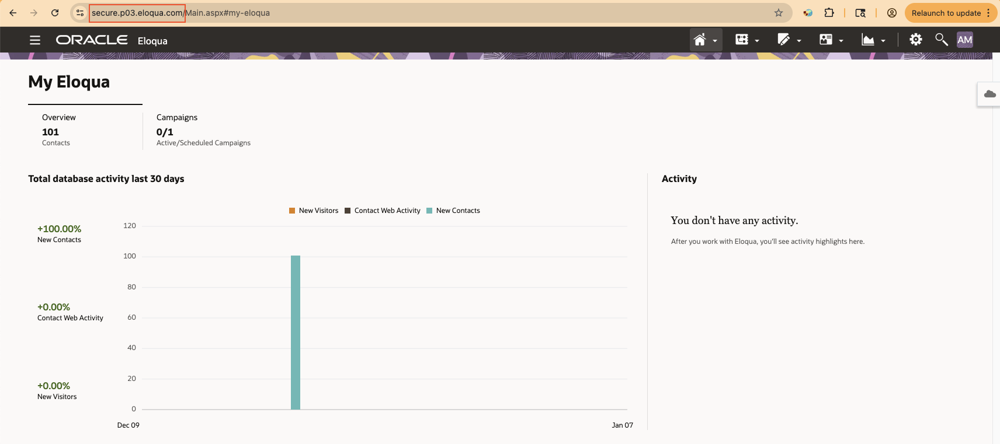
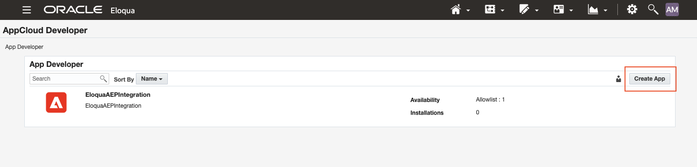
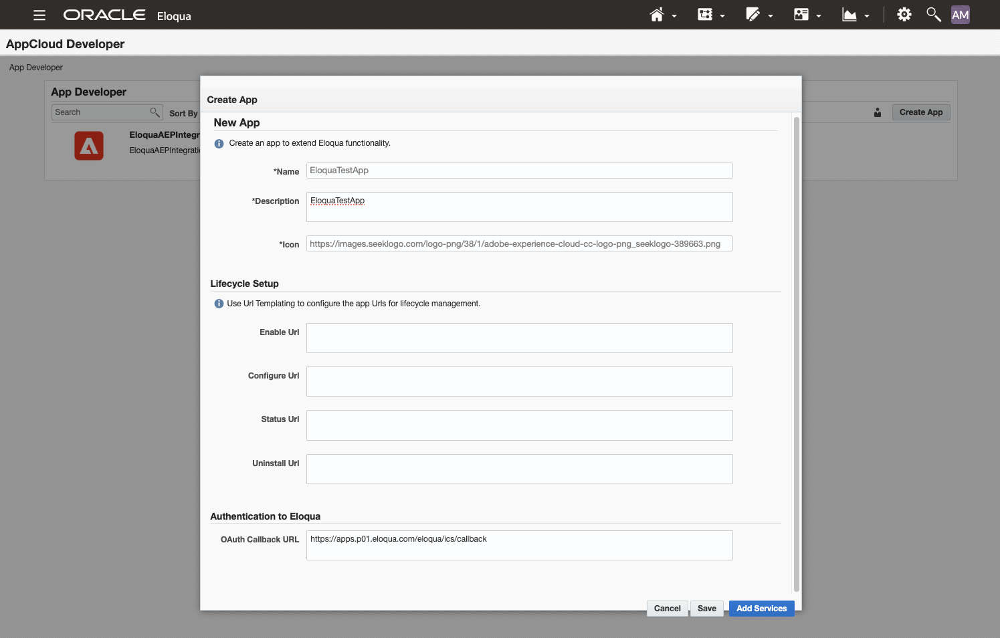
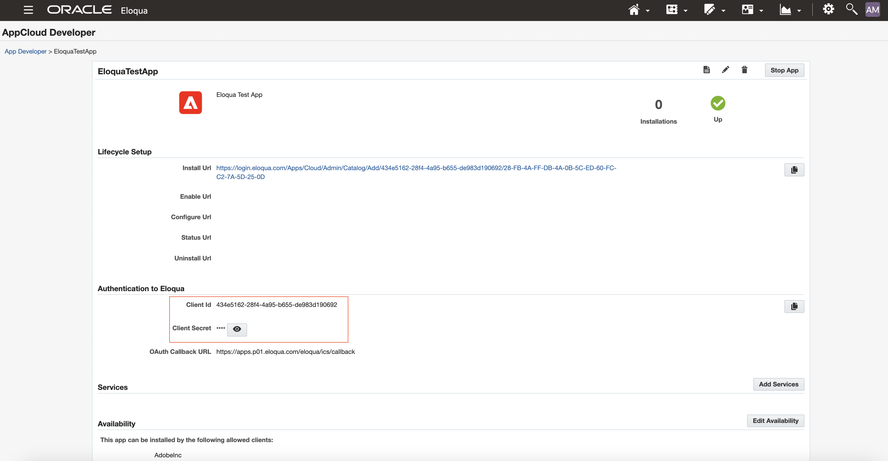
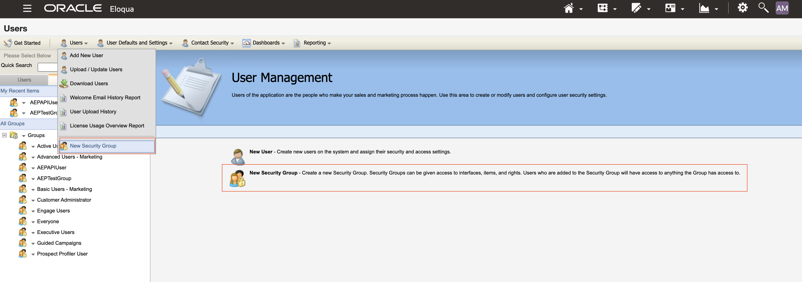
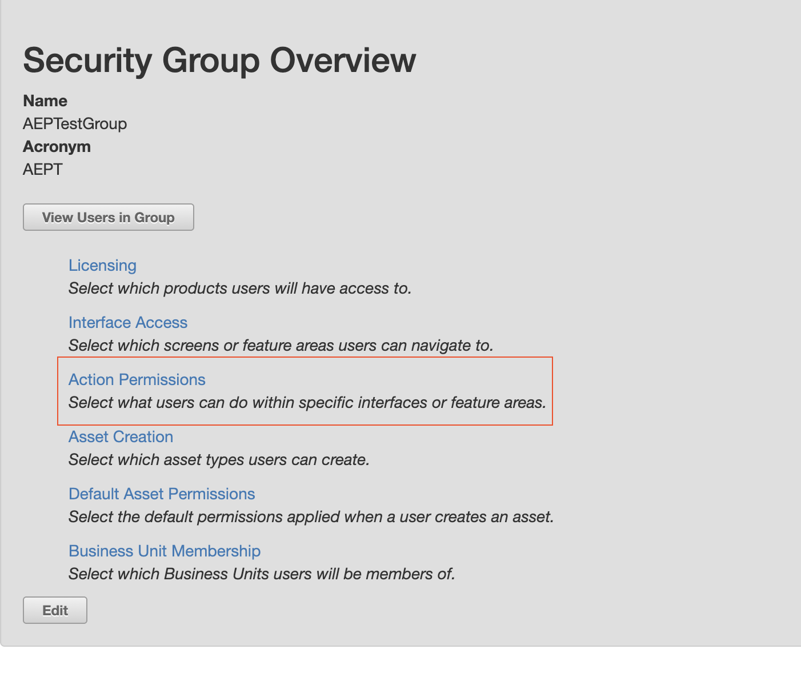
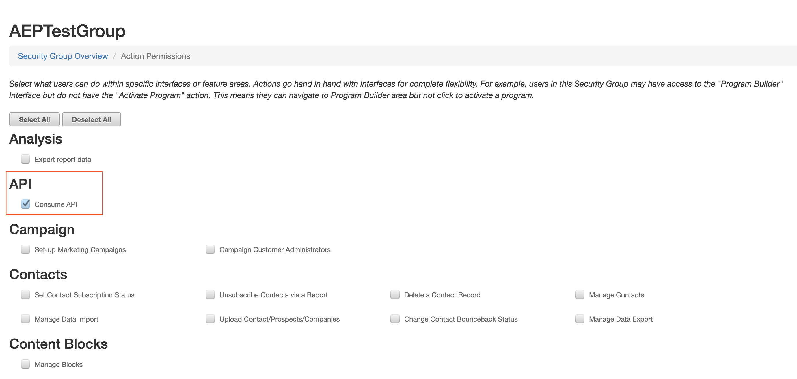
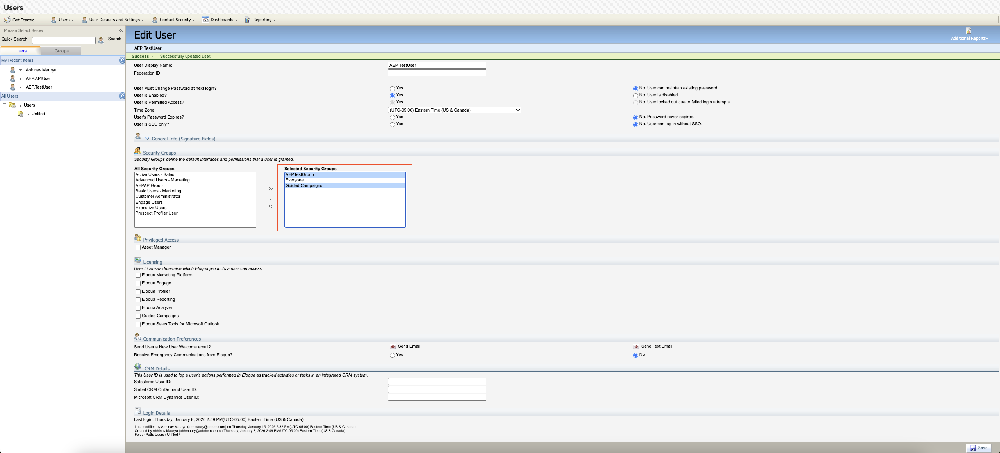

# [!DNL Oracle Eloqua] （V2） ソースの概要

>[!IMPORTANT]
>
>元の[[!DNL Oracle Eloqua]  （V1） ](oracle-eloqua.md) ソースは、2026年1月の時点で非推奨（廃止予定）となりました。 この非推奨のソースで利用できる移行はありません。新しい[!DNL Oracle Eloqua] （V2） ソースを使用してデータを再実装する必要があります。

[!DNL Oracle Eloqua]は、主にB2B分野の組織が、リードの管理とバイヤージャーニーのオーケストレーションという複雑なプロセスを自動化およびパーソナライズできるように設計された、強力なエンタープライズグレードのマーケティングオートメーションプラットフォームです。 マーケティングチームが複数のデジタルチャネルをまたいで高度なキャンペーンを定義、展開、測定できる中心的なハブとして機能し、見込み客が最もエンゲージしている的確なタイミングで適切なコンテンツを受け取れるようにします。 [!DNL Eloqua]を通じて取り込むためにサポートされているオブジェクトは、**連絡先**、**アカウント**、**キャンペーン**、および&#x200B;**アクティビティ**&#x200B;です。 最初の取り込みが完了すると、変更されたデータはすべて、スケジュールされた増分プロセスを使用して取り込まれます。

[!DNL Eloqua] ソースを使用して、[!DNL Eloqua] アカウントをAdobe Experience Platformに接続できます。 詳しくは、以下のドキュメントを参照してください。

## ユースケースの例 {#use-case-examples}

次の表は、[!DNL Eloqua] （V2）とAdobe Experience Platformの統合でサポートされるマーケティングオブジェクトの概要を示しています。 各オブジェクトには、[!DNL Eloqua] データをReal-Time CDPと統合して、マーケティングの効果とキャンペーンの成果を向上させる方法を示す説明とユースケースの例が記載されています。

| オブジェクト | 説明 | ユースケースの例 |
| --- | --- | --- |
| 連絡先 | 連絡先データ（名前、メールアドレス、電話番号、役職など）をReal-Time CDPに取り込み、詳細な統合された顧客プロファイルを作成します。これにより、個々の連絡先とのあらゆるインタラクションとエンゲージメントを統合できます。 | **キャンペーンの最適化：** [!DNL Eloqua]からの連絡先データを統合することで、マーケティング部門は、メール開封、フォーム送信、イベント登録などの最近のアクティビティに基づいて、優先順位の高い見込み顧客を特定できます。 Real-Time CDPでは、電子メールやweb サイトなどのマーケティング接点をまたいで、各顧客の行動を包括的に把握できるため、マーケティング部門は施策をカスタマイズし、メッセージを最適化して、エンゲージメントとコンバージョンを向上できます。 |
| アカウント | アカウントレベルのデータ（企業名、業界、企業規模、売上、所在地など）を取り込んで、Real-Time CDPでアカウントベースドマーケティング（ABM）戦略を構築します。これにより、適切な組織をターゲットにして、適切なメッセージを配信し、エンゲージメントを高めることができます。 | **ABM キャンペーン：** [!DNL Eloqua]からのアカウントデータを統合すると、ターゲットを絞ったABM キャンペーンを構築できます。 たとえば、ソフトウェア企業では、アカウントデータを利用して、金融分野の企業の意思決定者にパーソナライズされたメールキャンペーンをセグメント化して送信し、業界向けにカスタマイズされた新しいソリューションをプロモーションすることができます。 |
| キャンペーン | キャンペーンのデータ（キャンペーン名、種類、目標、開封率、CTRなどのパフォーマンス指標）をReal-Time CDPに取り込み、複数のチャネルをまたいでキャンペーンのパフォーマンスを追跡および最適化できます。 このデータは、ROIの測定や戦略の改善に役立てることができます。 | **クロスチャネルアトリビューション：** [!DNL Eloqua]がキャンペーンデータをReal-Time CDPに送信する場合、マーケティング部門は、様々なチャネル（電子メール、ソーシャルメディア、広告など）でのキャンペーンのパフォーマンスを確認し、コンバージョンを適切なタッチポイントにアトリビューションし、そのinsightに基づいて今後の戦略を改善することができます。 |
| アクティビティ | アクティビティデータ（メール開封、クリック、web サイト訪問、フォーム送信、ウェビナーへの参加など）を取り込んで、さまざまなチャネルをまたいでリアルタイムの行動と連絡先を追跡し、リアルタイムにパーソナライズされたエンゲージメントの機会を創出します。 | **リアルタイムのナーチャリング：** Real-Time CDPでは、[!DNL Eloqua]のアクティビティデータを統合することで、連絡先がコンテンツを操作した際（ホワイトペーパーのダウンロードやメールリンクのクリックなど）に、パーソナライズされた電子メールや通知を営業部門にトリガーすることができ、タイムリーなフォローアップとコンバージョンの機会の向上が可能になります。 |

{style="table-layout:auto"}

## 前提条件 {#prerequisites}

ソースをExperience Platformに接続する前に必要な前提条件の設定については、以下の節を参照してください。

### 認証用アプリケーションの設定

以下の手順に従って、[!DNL Eloqua] アカウントを設定し、基本認証を使用してExperience Platformに接続する方法を説明します。

開始するには、管理者（またはユーザー、セキュリティグループ、アプリを作成するアクセス権を持つユーザー）として[!DNL Eloqua] インスタンスにログインします。

**設定** > **Platform Extensions** > **App Cloud Developer** > **アプリを作成**&#x200B;に移動します。 アプリの名前、説明、アイコン、OAuth コールバック URLなど、アプリの詳細を入力します。 完了したら、「**保存**」をクリックします。

| プロパティ | 説明 |
| --- | --- |
| 名前 | アプリの名前。 |
| 説明 | アプリの簡単な説明。 |
| アイコン | アイコンのURL。 |
| OAuth コールバック URL | アプリをインストールし、[!DNL Eloqua]で認証した後にユーザーがリダイレクトする必要があるURL。 |

アプリを作成したら、[!DNL Authentication to Eloqua]に移動し、新しく作成したアプリから&#x200B;**クライアント ID**&#x200B;と&#x200B;**クライアントシークレット**&#x200B;を取得します。 これらの値は、後でExperience Platformに接続する際に使用されます。

セキュリティグループを使用すると、管理者は、ユーザーがアセット、機能、インターフェイスなどに対してどのようなレベルのアクセス権を持つかを制御できます。 セキュリティグループを作成するには、**設定** > **ユーザー**&#x200B;に移動します。 次に、左側のパネルで「**グループ**」タブを選択し、「**新しいセキュリティグループを作成**」を選択します。

「**[!DNL Security Group Overview]**」ウィンドウを使用して、セキュリティグループの名前と略語を指定します。 作成したら、[!DNL Action Permissions]に移動し、リストから[!DNL Consume] API権限を追加して、**保存**&#x200B;を選択します。

>[!NOTE]
>
>[!DNL Consume] APIは必要な権限ですが、アプリの使用状況に応じて、さらに権限を追加できます。

キャンペーンデータを取り込むには、**ユーザーの編集** インターフェイスに移動し、選択したセキュリティグループに[!DNL Guided Campaigns]を追加します。

オプションで、追加のユーザーを作成し、そのユーザーをセキュリティグループに追加できます。 詳細な手順については、[!DNL Eloqua] ユーザーの作成[および](https://docs.oracle.com/en/cloud/saas/marketing/eloqua-user/Help/UserManagement/Tasks/CreatingIndividualUsers.htm) セキュリティグループへのユーザーの割り当て[に関する](https://docs.oracle.com/en/cloud/saas/marketing/eloqua-user/Help/SecurityGroups/Tasks/AddingUsersToSecurityGroups.htm) ドキュメントを参照してください。

### 必要な資格情報の収集

[!DNL Eloqua]をExperience Platformに接続するには、次の資格情報の値を指定する必要があります。

| 資格情報 | 説明 |
| --- | --- |
| クライアント ID | Experience Platformの承認時に[!DNL Eloqua]がアカウントを識別するために使用する公開されたID。 |
| クライアントシークレット | クライアントアプリケーションと認証サーバーのみが知っている機密鍵。 このキーは、アカウントを認証するためにクライアント IDと一緒に必要です。 |
| ユーザー名 | [!DNL Eloqua] アカウントに関連付けられているユーザー名。 これは、アクセスを検証および承認するために使用されます。 ユーザー名は`CompanyName\Username`の形式に従っています。 |
| パスワード | [!DNL Eloqua] アカウントに関連付けられているパスワード。 ユーザー名と共に、Eloqua環境へのアクセス権を付与します。 |
| ベースエンドポイント | [!DNL Eloqua]の認証ベース URIのプレフィックス。 認証時に、基本エンドポイントに`http://`または`https://`を含めることはできません。 |

## [!DNL Eloqua] マッピングガイド

>[!NOTE]
>
>増分データ読み込みに内部的に使用される差分フィールドは次のとおりです。
>
>- **連絡先：** `C_DateModified`
>- **アカウント：** `M_DateModified`
>- **アクティビティ：** `CreatedAt`
>- **キャンペーン：** `updatedAt`

次の表は、Experience Platformの[!DNL Eloqua] ソースフィールドと、対応するExperience Data Model （XDM）宛先フィールドとの間の詳細なマッピングを示しています。 各行には、フィールドが不変かどうかを問わず、変換ロジックの概要が示され、Experience Platformで[!DNL Eloqua] データがどのように取り込まれ、構造化されるかを理解するのに役立つメモが追加されています。

### アカウント

| エロクアSourceカラム | XDM宛先パス | メモ |
| --- | --- | --- |
| `"Eloqua"` | accountKey.sourceType | このフィールドは常に固定値「Eloqua」に設定されます。 |
| `"${SOURCE_INSTANCE_ID}"` | accountKey.sourceInstanceID | `SOURCE_INSTANCE_ID`は自動的にコネクタに置き換えられます。 |
| `Id` | accountKey.sourceID | |
| `concat(Id, "\\@${SOURCE_INSTANCE_ID}.Eloqua")` | accountKey.sourceKey | `SOURCE_INSTANCE_ID`は自動的にコネクタに置き換えられます。 |
| `M_CompanyName` | accountName | |
| `M_Country` | accountPhysicalAddress.country | |
| `M_Address1` | accountPhysicalAddress.street1 | |
| `M_City` | accountPhysicalAddress.city | |
| `M_State_Prov` | accountPhysicalAddress.stateProvince | |
| `M_Zip_Postal` | accountPhysicalAddress.postalCode | |
| `M_BusPhone` | accountPhone.number | |
| `M_Fax1` | accountFax.number | |
| `M_Account_Engagement_Score` | accountScore | |
| `M_Account_Type1` | accountType | |
| `M_Wesbsite1` | accountOrganization.website | |
| `M_Employees1` | accountOrganization.numberOfEmployees | |
| `to_decimal(M_Annual_Revenue1)` | accountOrganization.annualRevenue.amount | |
| `M_DateModified` | extSourceSystemAudit.lastUpdatedDate | |
| `M_DateCreated` | extSourceSystemAudit.createdDate | |
| `M_Industry1` | accountOrganization.industry | |
| `iif(M_SFDCAccountID != null && M_SFDCAccountID != "", to_object("sourceType", "Salesforce", "sourceInstanceID", "${CRM_INSTANCE_ID}", "sourceID", M_SFDCAccountID, "sourceKey", concat(M_SFDCAccountID, "\\@${CRM_INSTANCE_ID}.Salesforce")), iif(M_MSCRMAccountID != null && M_MSCRMAccountID != "", to_object("sourceType", "Dynamics", "sourceInstanceID", "${CRM_INSTANCE_ID}", "sourceID", M_MSCRMAccountID, "sourceKey", concat(M_MSCRMAccountID, "\\@${CRM_INSTANCE_ID}.Dynamics")), null))` | extSourceSystemAudit.externalKey | コネクタはCRM インスタンス IDを自動的に検出できません。 `${CRM_INSTANCE_ID}`を実際のCRM インスタンス ID （SalesforceまたはDynamics インスタンス ID）に手動で置き換える必要があります。 取り込み中に`M_SFDCAccountID`が存在する場合、コネクタはその値を使用して外部キーを生成し、`\@CRM_INSTANCE_ID.Salesforce`を追加します。 そのフィールドが空の場合、コネクタは`M_MSCRMAccountID`を使用し、代わりに`\@CRM_INSTANCE_ID.Dynamics`を追加します。 両方のフィールドが空の場合、このフィールドはnullに設定されます。 |

{style="table-layout:auto"}

### アクティビティ

| エロクアSourceカラム | XDM宛先パス | メモ |
| --- | --- | --- |
| `"Eloqua"` | personKey.sourceType | このフィールドは常に固定値「Eloqua」に設定されます。 |
| `"${SOURCE_INSTANCE_ID}"` | personKey.sourceInstanceID | `SOURCE_INSTANCE_ID`は自動的にコネクタに置き換えられます。 |
| `ContactId` | personKey.sourceID |  |
| `concat(ContactId, "\\@${SOURCE_INSTANCE_ID}.Eloqua")` | personKey.sourceKey | `SOURCE_INSTANCE_ID`は自動的にコネクタに置き換えられます。 |
| `ExternalId` | _id |  |
| `iif(ActivityType!=null && ActivityType!="", iif(ActivityType=="EmailSend", "directMarketing.emailSent", iif(ActivityType=="EmailOpen", "directMarketing.emailOpened", iif(ActivityType=="EmailClickthrough", "directMarketing.emailClicked", iif(ActivityType=="Unsubscribe", "directMarketing.emailUnsubscribed", iif(ActivityType=="Bounceback", "directMarketing.emailBounced", iif(ActivityType=="FormSubmit", "web.formFilledOut", iif(ActivityType=="PageView", "web.webpagedetails.pageViews", ActivityType))))))), null)` | eventType | ActivityTypeに基づいて、対応するExperience Platform eventType値が入力されます。 ExternalActivitiesの場合、Experience PlatformにはeventTypeがありません。 このマッピングを変更して、より多くのタイプを処理できます。 |
| `ActivityDate` | タイムスタンプ | |
| `iif(AssetType == "Email", AssetName, null)` | directMarketing.mailingName | |
| `iif(AssetType == "Email", to_object("sourceType", "Eloqua", "sourceInstanceID", "${SOURCE_INSTANCE_ID}","sourceID",${AssetId}, "sourceKey", concat(${AssetId},"\\@${SOURCE_INSTANCE_ID}.Eloqua")), null)` | directMarketing.mailingKey | `SOURCE_INSTANCE_ID`は自動的にコネクタに置き換えられます。 |
| `iif(AssetType == "Email", EmailAddress, null)` | directMarketing.email | |
| `iif(ActivityType == "Bounceback", SmtpStatusCode, null)` | directMarketing.emailBouncedCode | |
| `iif(AssetType == "Email", SmtpMessage, null)` | directMarketing.emailBouncedDetails | |
| `iif(AssetType == "Email", EmailWebLink, null)` | directMarketing.linkURL | |
| `iif(ActivityType == "FormSubmit", AssetName, null)` | web.fillOutForm.webFormName | |
| `iif(ActivityType == "FormSubmit", to_object("sourceType", "Eloqua", "sourceInstanceID", "${SOURCE_INSTANCE_ID}","sourceID",${AssetId}, "sourceKey", concat(${AssetId},"\\@${SOURCE_INSTANCE_ID}.Eloqua")), null)` | web.fillOutForm.webFormKey | `SOURCE_INSTANCE_ID`は自動的にコネクタに置き換えられます。 |
| `iif(ActivityType == "PageView", AssetName, null)` | web.webPageDetails.name | |
| `iif(ActivityType == "PageView", to_object("sourceType", "Eloqua", "sourceInstanceID", "${SOURCE_INSTANCE_ID}","sourceID",${AssetId}, "sourceKey", concat(${AssetId},"\\@${SOURCE_INSTANCE_ID}.Eloqua")), null)` | web.webPageDetails.webPageKey | `SOURCE_INSTANCE_ID`は自動的にコネクタに置き換えられます。 |
| `iif(ActivityType == "PageView", Url, null)` | web.webPageDetails.URL | |

{style="table-layout:auto"}

### キャンペーン

| エロクアSourceカラム | XDM宛先パス | メモ |
| --- | --- | --- |
| `"Eloqua"` | campaignKey.sourceType | このフィールドは常に固定値「Eloqua」に設定されます。 |
| `"${SOURCE_INSTANCE_ID}"` | campaignKey.sourceInstanceID | `SOURCE_INSTANCE_ID`は自動的にコネクタに置き換えられます。 |
| `id` | campaignKey.sourceID | |
| `concat(id, "\\@${SOURCE_INSTANCE_ID}.Eloqua")` | campaignKey.sourceKey | `SOURCE_INSTANCE_ID`は自動的にコネクタに置き換えられます。 |
| `name` | campaignName | |
| `endAt` | campaignEndDate | |
| `startAt` | campaignStartDate | |
| `actualCost` | actualCost.amount | |
| `budgetedCost` | budgetedCost.amount | |
| `description` | campaignDescription | |
| `currentStatus` | campaignStatus | |
| `campaignType` | campaignType | |
| `createdAt` | extSourceSystemAudit.createdDate | |
| `updatedAt` | extSourceSystemAudit.lastUpdatedDate | |

{style="table-layout:auto"}

### 連絡先

| エロクアSourceカラム | XDM宛先パス | メモ |
| --- | --- | --- |
| `"Eloqua"` | b2b.personKey.sourceType | このフィールドは常に固定値「Eloqua」に設定されます。 |
| `"${SOURCE_INSTANCE_ID}"` | b2b.personKey.sourceInstanceID | `SOURCE_INSTANCE_ID`は自動的にコネクタに置き換えられます。 |
| `Id` | b2b.personKey.sourceID |  |
| `concat(Id, "\\@${SOURCE_INSTANCE_ID}.Eloqua"` | b2b.personKey.sourceKey | `SOURCE_INSTANCE_ID`は自動的にコネクタに置き換えられます。 |
| `C_Company` | b2b.companyName |  |
| `C_Website1` | b2b.companyWebsite |  |
| `C_Job_Title1` | extendedWorkDetails.jobTitle |  |
| `C_Fax` | faxPhone.number |  |
| `C_MobilePhone` | mobilePhone.number |  |
| `iif(C_SFDCLeadID != null && C_SFDCLeadID != "\\", to_object("sourceType", "Salesforce", "sourceInstanceID", "${CRM_INSTANCE_ID}", "sourceID", C_SFDCLeadID, "sourceKey", concat(C_SFDCLeadID, "\\@${CRM_INSTANCE_ID}.Salesforce")), iif(C_SFDCContactID != null && C_SFDCContactID != "\\", to_object("sourceType", "Salesforce", "sourceInstanceID", "${CRM_INSTANCE_ID}", "sourceID", C_SFDCContactID, "sourceKey", concat(C_SFDCContactID, "\\@${CRM_INSTANCE_ID}.Salesforce")), null))` | personComponents.sourceExternalKey | [!DNL Eloqua] インスタンスがSalesforceと同期されている場合は、このマッピングを保持します。 それ以外は削除してください。 コネクタにはCRM_INSTANCE_IDを判断する手段がないので、${CRM_INSTANCE_ID}を同期したSalesforce インスタンス IDに置き換える必要があります。 この同じマッピングがpersonComponentsとextSourceSystemAuditに適用されるので、両方を維持してください。 |
| `iif(C_MSCRMLeadID != null && C_MSCRMLeadID != "\\", to_object("sourceType", "Dynamics", "sourceInstanceID", "${CRM_INSTANCE_ID}", "sourceID", C_MSCRMLeadID, "sourceKey", concat(C_MSCRMLeadID, "\\@${CRM_INSTANCE_ID}.Dynamics")), iif(C_MSCRMContactID != null && C_MSCRMContactID != "\\", to_object("sourceType", "Dynamics", "sourceInstanceID", "${CRM_INSTANCE_ID}", "sourceID", C_MSCRMContactID, "sourceKey", concat(C_MSCRMContactID, "\\@${CRM_INSTANCE_ID}.Dynamics")), null))"` | personComponents.sourceExternalKey | [!DNL Eloqua] インスタンスがDynamicsと同期されている場合は、このマッピングを保持します。 それ以外は削除してください。 コネクタにはCRM_INSTANCE_IDを決定する方法がないので、${CRM_INSTANCE_ID}を同期したDynamics インスタンス IDに置き換える必要があります。 この同じマッピングがpersonComponentsとextSourceSystemAuditに適用されるので、両方を維持してください。 |
| `iif(C_SFDCLeadID != null && C_SFDCLeadID != "\\", to_object("sourceType", "Salesforce", "sourceInstanceID", "${CRM_INSTANCE_ID}", "sourceID", C_SFDCLeadID, "sourceKey", concat(C_SFDCLeadID, "\\@${CRM_INSTANCE_ID}.Salesforce")), iif(C_SFDCContactID != null && C_SFDCContactID != "\\", to_object("sourceType", "Salesforce", "sourceInstanceID", "${CRM_INSTANCE_ID}", "sourceID", C_SFDCContactID, "sourceKey", concat(C_SFDCContactID, "\\@${CRM_INSTANCE_ID}.Salesforce")), null))"` | extSourceSystemAudit.externalKey | [!DNL Eloqua] インスタンスがSalesforceと同期されている場合は、このマッピングを保持します。 それ以外は削除してください。 コネクタにはCRM_INSTANCE_IDを判断する手段がないので、${CRM_INSTANCE_ID}を同期したSalesforce インスタンス IDに置き換える必要があります。 この同じマッピングがpersonComponentsとextSourceSystemAuditに適用されるので、両方を維持してください。 |
| `iif(C_MSCRMLeadID != null && C_MSCRMLeadID != "\\", to_object("sourceType", "Dynamics", "sourceInstanceID", "${CRM_INSTANCE_ID}", "sourceID", C_MSCRMLeadID, "sourceKey", concat(C_MSCRMLeadID, "\\@${CRM_INSTANCE_ID}.Dynamics")), iif(C_MSCRMContactID != null && C_MSCRMContactID != "\\", to_object("sourceType", "Dynamics", "sourceInstanceID", "${CRM_INSTANCE_ID}", "sourceID", C_MSCRMContactID, "sourceKey", concat(C_MSCRMContactID, "\\@${CRM_INSTANCE_ID}.Dynamics")), null))` | extSourceSystemAudit.externalKey | [!DNL Eloqua] インスタンスがDynamicsと同期されている場合は、このマッピングを保持します。 それ以外は削除してください。 コネクタにはCRM_INSTANCE_IDを決定する方法がないので、${CRM_INSTANCE_ID}を同期したDynamics インスタンス IDに置き換える必要があります。 この同じマッピングがpersonComponentsとextSourceSystemAuditに適用されるので、両方を維持してください。 |
| `C_DateCreated` | extSourceSystemAudit.createdDate |  |
| `C_DateModified` | extSourceSystemAudit.lastUpdatedDate |  |
| `iif(C_SFDCAccountID != null && C_SFDCAccountID != "\\", to_object("sourceType", "Salesforce", "sourceInstanceID", "${CRM_INSTANCE_ID}", "sourceID", C_SFDCAccountID, "sourceKey", concat(C_SFDCAccountID, "\\@${CRM_INSTANCE_ID}.Salesforce")), iif(C_MSCRMAccountID != null && C_MSCRMAccountID != "\\", to_object("sourceType", "Dynamics", "sourceInstanceID", "${CRM_INSTANCE_ID}", "sourceID", C_MSCRMAccountID, "sourceKey", concat(C_MSCRMAccountID, "\\@${CRM_INSTANCE_ID}.Dynamics")), null))` | b2b.accountKey | コネクタにはCRM_INSTANCE_IDを判断する手段がないので、${CRM_INSTANCE_ID}をSalesforce インスタンス IDまたはDynamics インスタンス IDのいずれかで同期したCRM インスタンス IDに置き換える必要があります。 この同じマッピングがb2b.accountKeyとpersonComponents.sourceAccountKeyの両方に適用されるので、両方を維持します。 |
| `iif(C_SFDCAccountID != null && C_SFDCAccountID != "\\", to_object("sourceType", "Salesforce", "sourceInstanceID", "${CRM_INSTANCE_ID}", "sourceID", C_SFDCAccountID, "sourceKey", concat(C_SFDCAccountID, "\\@${CRM_INSTANCE_ID}.Salesforce")), iif(C_MSCRMAccountID != null && C_MSCRMAccountID != "\\", to_object("sourceType", "Dynamics", "sourceInstanceID", "${CRM_INSTANCE_ID}", "sourceID", C_MSCRMAccountID, "sourceKey", concat(C_MSCRMAccountID, "\\@${CRM_INSTANCE_ID}.Dynamics")), null))` | personComponents.sourceAccountKey | コネクタにはCRM_INSTANCE_IDを判断する手段がないので、${CRM_INSTANCE_ID}をSalesforce インスタンス IDまたはDynamics インスタンス IDのいずれかで同期したCRM インスタンス IDに置き換える必要があります。 この同じマッピングがb2b.accountKeyとpersonComponents.sourceAccountKeyの両方に適用されるので、両方を維持します。 |
| `C_Lead_Source___Original1` | b2b.personSource | |
| `C_Lead_Source___Original1` | personComponents.personSource | |
| `C_Lead_Status1` | b2b.personStatus | |
| `C_Lead_Status1` | personComponents.personStatus | |
| `C_FirstName` | person.name.firstName | |
| `C_LastName` | person.name.lastName | |
| `C_Middle_Name1` | person.name.middleName | |
| `C_Salutation` | person.name.courtesyTitle | |
| `C_City` | workAddress.city | |
| `C_Country` | workAddress.country | |
| `C_Zip_Postal` | workAddress.postalCode | |
| `C_State_Prov` | workAddress.state | |

{style="table-layout:auto"}

### アクティビティタイプマッピングリファレンス

| Eloqua ActivityType | XDM eventType |
| -------------------- | --------------- |
| `EmailSend` | directMarketing.emailSent |
| `EmailOpen` | directMarketing.emailOpened |
| `EmailClickthrough` | directMarketing.emailClicked |
| `Unsubscribe` | directMarketing.emailUnsubscribed |
| `Bounceback` | directMarketing.emailBounced |
| `FormSubmit` | web.formFilledOut |
| `PageView` | web.webpagedetails.pageViews |
| `Other` | そのまま通過 |

{style="table-layout:auto"}

### 変数プレースホルダー

マッピングテンプレートでは、データフローの実行後に置き換えられる次の変数プレースホルダーを使用します。

| プレースホルダ | 説明 | 用途 |
| ----------- | ----------- | ----- |
| `${SOURCE_INSTANCE_ID}` | Eloqua ソースインスタンスの一意のID | ソースキーで使用 |
| `${CRM_INSTANCE_ID}` | CRM システムの一意のID （Salesforce/Dynamics） | 外部キーで使用 |

## [!DNL Eloqua]をExperience Platformに接続

Experience Platform内で[!DNL Eloqua] ソース接続の設定に進みます。 UIによる接続の設定に関するステップバイステップガイドについては、[ チュートリアル（](../../tutorials/ui/create/marketing-automation/eloqua.md)）を参照してください。 このチュートリアルでは、[!DNL Eloqua] アカウントの接続、データの選択、フィールドのマッピング、取り込みのスケジュール設定、データフローの監視について説明します。
