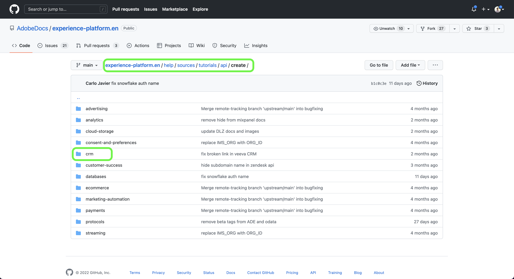
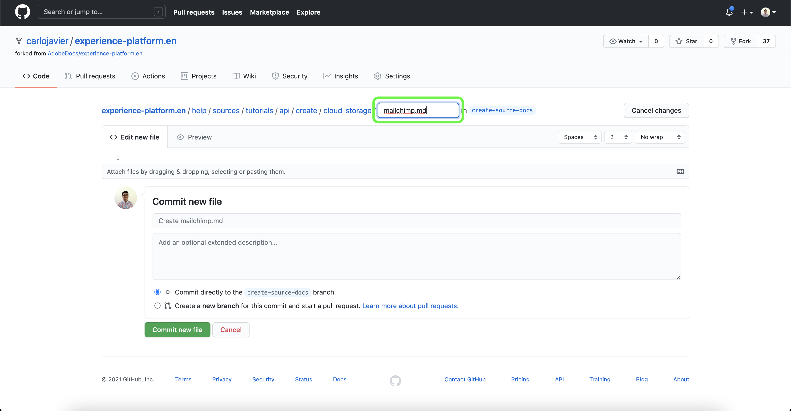

# GitHub Web インターフェイスを使用してソースドキュメントページを作成する

このドキュメントでは、GitHub Web インターフェイスを使用してドキュメントを作成し、プル要求 (PR) を送信する手順を説明します。

>[!TIP]
>
>ドキュメントプロセスをさらにサポートするには、Adobeのコントリビューションガイドに記載されている次のドキュメントを使用できます。 <ul><li>[Git および Markdown オーサリングツールのインストール](https://experienceleague.adobe.com/docs/contributor/contributor-guide/setup/install-tools.html?lang=en)</li><li>[ドキュメント用のローカル Git リポジトリの設定](https://experienceleague.adobe.com/docs/contributor/contributor-guide/setup/local-repo.html?lang=en)</li><li>[大きな変更をする際の GitHub コントリビューションワークフロー](https://experienceleague.adobe.com/docs/contributor/contributor-guide/setup/full-workflow.html?lang=en)</li></ul>

## GitHub 環境の設定

GitHub 環境を設定する最初の手順は、 [Adobe Experience Platform GitHub リポジトリ](https://github.com/AdobeDocs/experience-platform.en).

次に、 **分岐**.

分岐が完了したら、「 」を選択します。 **プライマリ** をクリックし、表示されるドロップダウンメニューに新しいブランチの名前を入力します。 ブランチは作業内容を含むために使用されるので、分岐にわかりやすい名前を付けてから、「 」を選択します。 **ブランチを作成**.

フォークされたリポジトリの GitHub フォルダー構造で、に移動します。 [`experience-platform.en/help/sources/tutorials/api/create/`](https://github.com/AdobeDocs/experience-platform.en/tree/main/help/sources/tutorials/api/create) 次に、ソースに適したカテゴリをリストから選択します。 例えば、新しい CRM ソースのドキュメントを作成する場合は、 **crm**.

>[!TIP]
>
>UI 用のドキュメントを作成している場合は、に移動します。 [`experience-platform.en/help/sources/tutorials/ui/create/`](https://github.com/AdobeDocs/experience-platform.en/tree/main/help/sources/tutorials/ui/create) をクリックし、ソースに適したカテゴリを選択します。 画像を追加するには、以下に移動します。 [`experience-platform.en/help/sources/images/tutorials/create/sdk`](https://github.com/AdobeDocs/experience-platform.en/tree/main/help/sources/images/tutorials/create) 次に、 `sdk` フォルダー。

既存の CRM ソースのフォルダが表示されます。 新しいソースのドキュメントを追加するには、 **ファイルを追加** 次に、 **新しいファイルを作成** を選択します。

ソースファイルに名前を付ける `YOURSOURCE.md` ここで、YOURSOURCE は、Platform でのソースの名前です。 例えば、会社が ACME CRM の場合、ファイル名は `acme-crm.md`.

## ソースに関するドキュメントページの作成

新しいソースのドキュメント化を開始するには、 [ソースドキュメントテンプレート](./template.md) を GitHub Web エディターに追加します。 また、テンプレートをダウンロードすることもできます [ここ](../assets/api-template.zip).

テンプレートを GitHub Web エディターインターフェイスにコピーした状態で、テンプレートに記載されている手順に従い、ソースに関連する情報を含む値を編集します。

完了したら、ブランチのファイルをコミットします。

## ドキュメントを送信してレビュー

ファイルがコミットされたら、プルリクエスト (PR) を開き、作業ブランチをAdobeドキュメントリポジトリの master ブランチにマージできます。 作業中のブランチが選択されていることを確認し、「 」を選択します。 **リクエストの比較とプル**.

ベースと比較ブランチが正しいことを確認します。 PR にメモを追加し、更新内容を説明してから、「 」を選択します。 **プル要求の作成**. PR を開き、作業の作業ブランチをAdobeリポジトリの master ブランチにマージします。

>[!TIP]
>
>を **メンテナーによる編集を許可** チェックボックスをオンにして、Adobeドキュメントチームが PR を編集できるようにします。

この時点で、Adobeコントリビューター使用許諾契約 (CLA) に署名するよう求める通知が表示されます。 これは必須の手順です。 CLA に署名した後、PR ページを更新し、プル要求を送信します。

https://github.com/AdobeDocs/experience-platform.enの「プルリクエスト」タブを調べて、プルリクエストが送信されたことを確認できます。

