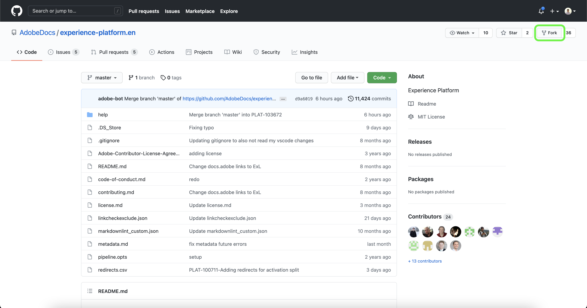
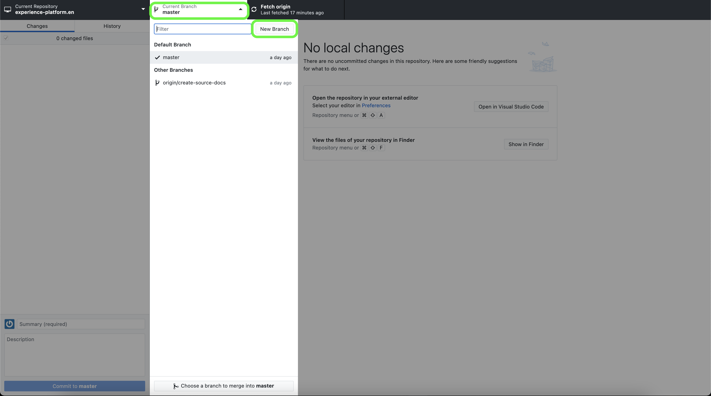
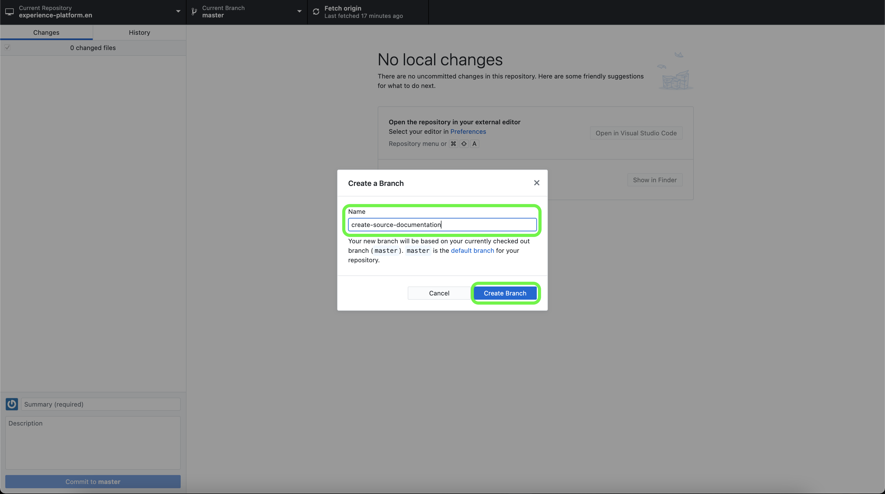

# ローカル環境でのテキストエディターを使用したソースドキュメントページの作成

このドキュメントでは、ローカル環境を使用して、ソースに関するドキュメントを作成し、プル要求 (PR) を送信する手順を説明します。

>[!TIP]
>
>ドキュメントプロセスをさらにサポートするには、Adobeのコントリビューションガイドに記載されている次のドキュメントを使用できます。 <ul><li>[Git および Markdown オーサリングツールのインストール](https://experienceleague.adobe.com/docs/contributor/contributor-guide/setup/install-tools.html?lang=en)</li><li>[ドキュメント用のローカル Git リポジトリの設定](https://experienceleague.adobe.com/docs/contributor/contributor-guide/setup/local-repo.html?lang=en)</li><li>[大きな変更をする際の GitHub コントリビューションワークフロー](https://experienceleague.adobe.com/docs/contributor/contributor-guide/setup/full-workflow.html?lang=en)</li></ul>

## 前提条件

以下のチュートリアルでは、GitHub Desktop をローカルマシンにインストールしておく必要があります。 GitHub Desktop をお持ちでない場合は、アプリケーションをダウンロードできます [ここ](https://desktop.github.com/).

## GitHub に接続してローカルオーサリング環境を設定する

ローカルオーサリング環境を設定する最初の手順は、 [Adobe Experience Platform GitHub リポジトリ](https://github.com/AdobeDocs/experience-platform.en).

Platform GitHub リポジトリのメインページで、 **分岐**.

リポジトリをローカルマシンに複製するには、 **コード**. 表示されるドロップダウンメニューから、「 」を選択します。 **HTTPS** 次に、「 **GitHub Desktop で開く**.

>[!TIP]
>
>詳しくは、 [ドキュメント用のローカル Git リポジトリの設定](https://experienceleague.adobe.com/docs/contributor/contributor-guide/setup/local-repo.html?lang=en#create-a-local-clone-of-the-repository).

次に、GitHub Desktop が `experience-platform.en` リポジトリ。

クローン作成プロセスが完了したら、GitHub Desktop にアクセスし、新しいブランチを作成します。 選択 **マスター** 上部ナビゲーションから「 」を選択し、 **新しいブランチ**

表示されるポップオーバーパネルで、ブランチのわかりやすい名前を入力し、「 」を選択します **ブランチを作成**.

次に、 **ブランチを公開**.

## ソースに関するドキュメントページの作成

リポジトリをローカルマシンに複製し、新しいブランチを作成したら、次を使用して、新しいソースのドキュメントページのオーサリングを開始できます。 [任意のテキストエディター](https://experienceleague.adobe.com/docs/contributor/contributor-guide/setup/install-tools.html?lang=en#understand-markdown-editors).

Adobeでは、 [Visual Studio Code](https://code.visualstudio.com/) Markdown Authoring 拡張機能をインストールするAdobe。 拡張機能をインストールするには、Visual Studio Code を起動し、 **拡張機能** タブをクリックします。

次に、 `Adobe Markdown Authoring` を検索バーに追加し、 **インストール** 表示されるページから。

ローカルマシンの準備が整ったら、 [ソースドキュメントテンプレート](../assets/api-template.zip) を選択し、 `experience-platform.en/help/sources/tutorials/api/create/...` と [`...`] 選択したカテゴリを表します。 例えば、データベースソースを作成する場合は、データベースフォルダを選択します。

最後に、テンプレートに記載されている手順に従い、ソースに関する関連情報を使用してテンプレートを編集します。

## ドキュメントを送信してレビュー

プル要求 (PR) を作成し、レビュー用にドキュメントを送信するには、まず [!DNL Visual Studio Code] （または任意のテキストエディター）。 次に、GitHub Desktop を使用して、コミットメッセージを入力し、「 」を選択します。 **create-source-documentation にコミット**.

次に、 **プッシュ元** をクリックして、作業をリモートブランチにアップロードします。

プル要求を作成するには、「 **プル要求の作成**.

ベースと比較ブランチが正しいことを確認します。 PR にメモを追加し、更新内容を説明してから、「 」を選択します。 **プル要求の作成**. PR を開き、作業の作業ブランチをAdobeリポジトリの master ブランチにマージします。

>[!TIP]
>
>を **メンテナーによる編集を許可** チェックボックスをオンにして、Adobeドキュメントチームが PR を編集できるようにします。

https://github.com/AdobeDocs/experience-platform.enの「プルリクエスト」タブを調べて、プルリクエストが送信されたことを確認できます。

