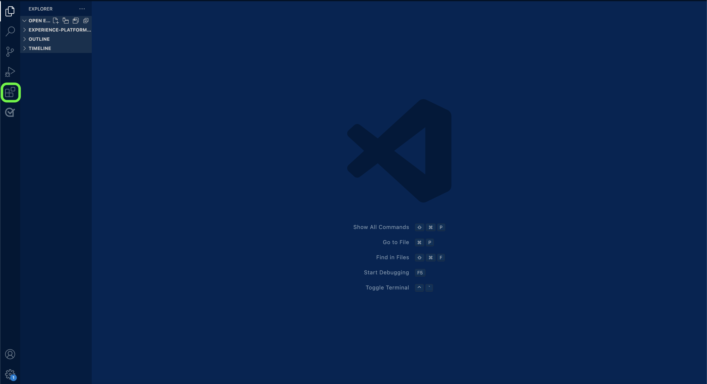
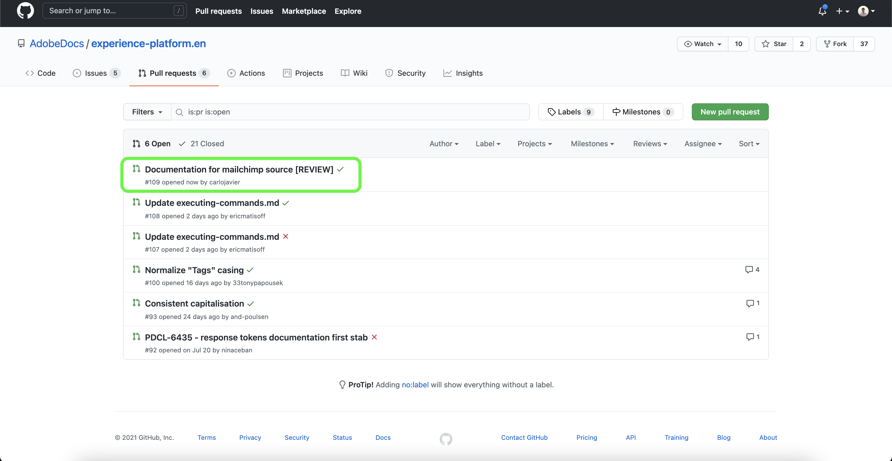

# ローカル環境でのテキストエディターを使用したソースドキュメントページの作成

このドキュメントでは、ローカル環境を使用して、ソースのドキュメントを作成し、プルリクエスト（PR）を送信する手順を説明します。

>[!TIP]
>
>ドキュメントプロセスをさらにサポートするには、Adobeのコントリビューション ガイドに記載されている次のドキュメントを使用できます。 <ul><li>[Git および Markdown オーサリングツールのインストール ](https://experienceleague.adobe.com/docs/contributor/contributor-guide/setup/install-tools.html)</li><li>[ ドキュメントを参照するために Git リポジトリをローカルに設定する ](https://experienceleague.adobe.com/docs/contributor/contributor-guide/setup/local-repo.html)</li><li>[ 大幅な変更点に対する GitHub 投稿ワークフロー ](https://experienceleague.adobe.com/docs/contributor/contributor-guide/setup/full-workflow.html)</li></ul>

## 前提条件

次のチュートリアルでは、ローカルマシンに GitHub Desktop をインストールする必要があります。 GitHub デスクトップがない場合は、アプリケーションを [ こちら ](https://desktop.github.com/) からダウンロードできます。

## GitHub に接続し、ローカルオーサリング環境を設定します

ローカルオーサリング環境を設定する最初の手順は、[Adobe Experience Platform GitHub リポジトリ ](https://github.com/AdobeDocs/experience-platform.en) に移動することです。

Experience Platform GitHub リポジトリのメインページで、「**分岐**」を選択します。

リポジトリをローカルマシンにクローンするには、「**コード**」を選択します。 表示されるドロップダウンメニューから「**HTTPS**」を選択し、「**GitHub デスクトップで開く**」を選択します。

>[!TIP]
>
>詳しくは、[ ドキュメント用の Git リポジトリのローカルでのセットアップ ](https://experienceleague.adobe.com/docs/contributor/contributor-guide/setup/local-repo.html#create-a-local-clone-of-the-repository) に関するチュートリアルを参照してください。

次に、GitHub デスクトップで `experience-platform.en` リポジトリのクローンが作成されるまでしばらく待ちます。

クローン作成が完了したら、GitHub デスクトップに移動して新しいブランチを作成します。 上部ナビゲーションから「**マスター**」を選択し、「**新しいブランチ**」を選択します

表示されるポップオーバーパネルで、ブランチのわかりやすい名前を入力し、「**ブランチを作成**」を選択します。

次に、「**ブランチを公開**」を選択します。

## ソースのドキュメントページを作成する

ローカルマシンにリポジトリのクローンを作成し、新しいブランチを作成したら、選択した [ テキストエディター ](https://experienceleague.adobe.com/docs/contributor/contributor-guide/setup/install-tools.html#understand-markdown-editors) を使用して、新しいソースのドキュメントページのオーサリングを開始できます。

Adobeでは、[Visual Studio Code](https://code.visualstudio.com/) を使用し、Adobe Markdown オーサリング拡張機能をインストールすることをお勧めします。 拡張機能をインストールするには、Visual Studio Code を起動し、左側のナビゲーションから「**拡張機能**」タブを選択します。

次に、検索バーに `Adobe Markdown Authoring` と入力し、表示されるページから **インストール** を選択します。

ローカルマシンの準備が整ったら、[sources ドキュメントテンプレート ](../assets/api-template.zip) をダウンロードし、選択したカテゴリを表す [`...`] を使用してファイルを抽出し `experience-platform.en/help/sources/tutorials/api/create/...` す。 例えば、データベースソースを作成する場合、データベースフォルダーを選択します。

最後に、テンプレートに記載されている手順に従って、ソースに関連する関連情報を使用してテンプレートを編集します。

## レビュー用にドキュメントを送信

プルリクエスト（PR）を作成し、ドキュメントをレビュー用に送信するには、まず [!DNL Visual Studio Code] （または選択したテキストエディター）で作業内容を保存します。 次に、GitHub デスクトップを使用して、コミットメッセージを入力し、「**Commit to create-source-documentation**」を選択します。

次に、「**接触チャネルをプッシュ**」を選択して、作業をリモートブランチにアップロードします。

プルリクエストを作成するには、「**プルリクエストを作成**」を選択します。

ベースおよび比較ブランチが正しいことを確認します。 更新を説明するメモを PR に追加してから、「**プルリクエストを作成**」を選択します。 これにより、作業の作業ブランチをAdobe リポジトリのマスターブランチに結合する PR が開きます。

>[!TIP]
>
>「**メンテナーによる編集を許可**」チェックボックスを選択したままにして、Adobe ドキュメントチームが PR を編集できるようにします。

https://github.com/AdobeDocs/experience-platform.enの「プルリクエスト」タブを調べると、プルリクエストが送信されたことを確認できます。

